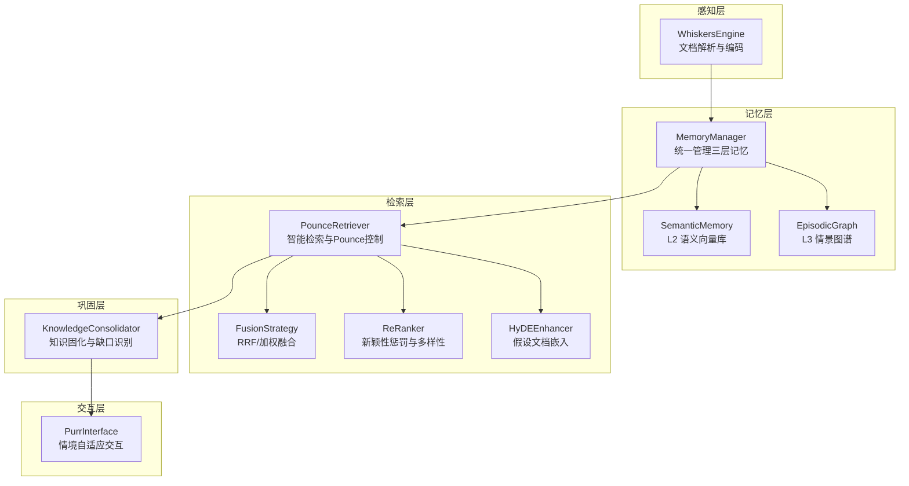
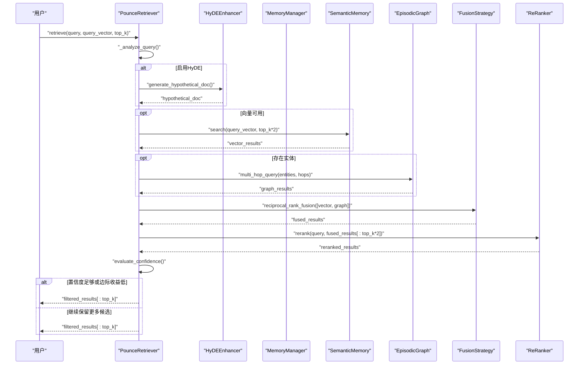
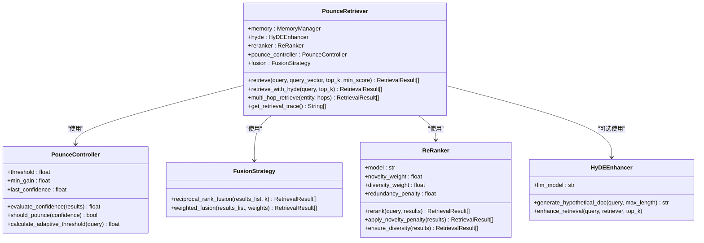
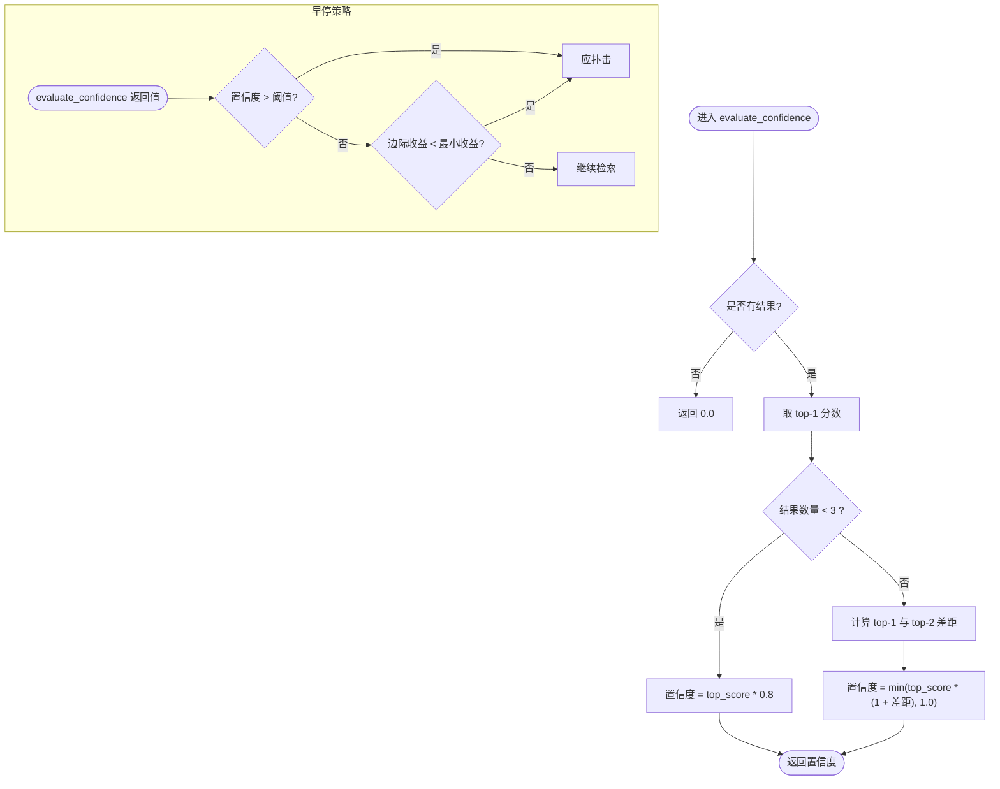
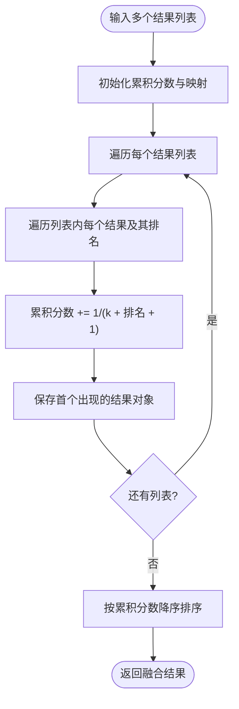
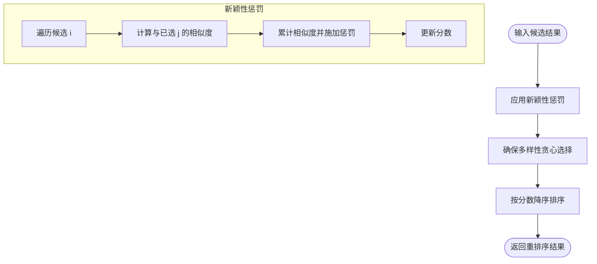
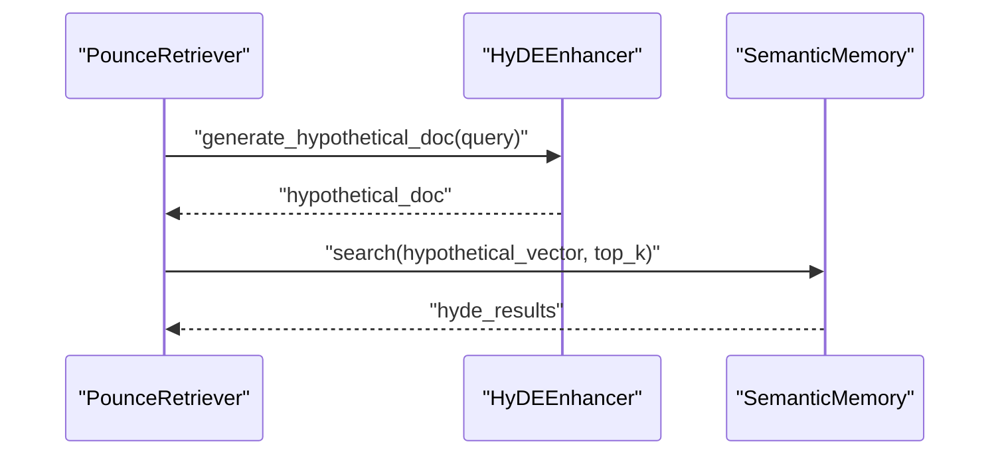
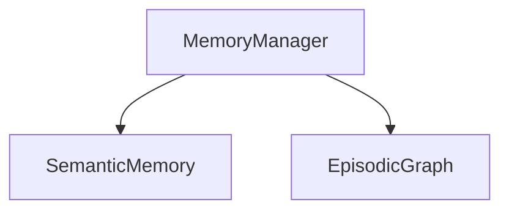
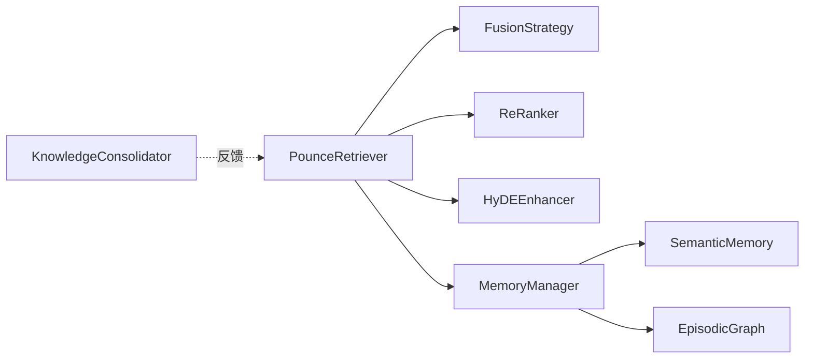

# Pounce Strategy - 检索层

<cite>
**本文引用的文件**
- [src/retrieval/__init__.py](file://src/retrieval/__init__.py)
- [src/retrieval/retriever.py](file://src/retrieval/retriever.py)
- [src/retrieval/fusion.py](file://src/retrieval/fusion.py)
- [src/retrieval/hyde.py](file://src/retrieval/hyde.py)
- [src/retrieval/reranker.py](file://src/retrieval/reranker.py)
- [src/retrieval/models.py](file://src/retrieval/models.py)
- [src/memory/manager.py](file://src/memory/manager.py)
- [src/memory/semantic_memory.py](file://src/memory/semantic_memory.py)
- [src/memory/episodic_graph.py](file://src/memory/episodic_graph.py)
- [src/memory/models.py](file://src/memory/models.py)
- [src/grooming/consolidator.py](file://src/grooming/consolidator.py)
- [src/grooming/models.py](file://src/grooming/models.py)
- [src/whiskers/engine.py](file://src/whiskers/engine.py)
- [example/example_usage.py](file://example/example_usage.py)
- [docs/README.md](file://docs/README.md)
- [QUICKSTART.md](file://QUICKSTART.md)
</cite>

## 目录
1. [简介](#简介)
2. [项目结构](#项目结构)
3. [核心组件](#核心组件)
4. [架构总览](#架构总览)
5. [详细组件分析](#详细组件分析)
6. [依赖关系分析](#依赖关系分析)
7. [性能考量](#性能考量)
8. [故障排查指南](#故障排查指南)
9. [结论](#结论)
10. [附录](#附录)

## 简介
本文件面向“Pounce Strategy（检索层）”的技术文档，系统阐述智能检索策略的设计思想与实现机制，重点覆盖以下方面：
- 多路检索融合：向量检索、图谱检索与HyDE增强的融合策略
- 重排序算法：基于新颖性惩罚与多样性的精排
- Pounce机制：基于置信度的智能决策与早停策略
- 检索模式：向量检索、图谱检索、混合检索与多跳检索
- 与记忆层和巩固层的协作关系
- 检索API、配置参数与性能调优建议

## 项目结构
检索层位于NecoRAG五层架构中的第三层，负责将感知层编码的知识与记忆层的三层存储相结合，通过多路检索、融合与重排序，输出高质量的检索结果，并以Pounce机制实现智能早停。

图表来源
- [src/whiskers/engine.py:14-130](file://src/whiskers/engine.py#L14-L130)
- [src/memory/manager.py:16-186](file://src/memory/manager.py#L16-L186)
- [src/memory/semantic_memory.py:21-179](file://src/memory/semantic_memory.py#L21-L179)
- [src/memory/episodic_graph.py:10-194](file://src/memory/episodic_graph.py#L10-L194)
- [src/retrieval/retriever.py:108-336](file://src/retrieval/retriever.py#L108-L336)
- [src/retrieval/fusion.py:9-128](file://src/retrieval/fusion.py#L9-L128)
- [src/retrieval/reranker.py:10-179](file://src/retrieval/reranker.py#L10-L179)
- [src/retrieval/hyde.py:9-81](file://src/retrieval/hyde.py#L9-L81)
- [src/grooming/consolidator.py:9-142](file://src/grooming/consolidator.py#L9-L142)

章节来源
- [docs/README.md:40-54](file://docs/README.md#L40-L54)
- [QUICKSTART.md:69-83](file://QUICKSTART.md#L69-L83)

## 核心组件
- PounceRetriever：集成多路检索、融合与重排序，支持HyDE增强与多跳检索，内置Pounce控制器实现智能早停
- FusionStrategy：提供倒数排名融合（RRF）与加权融合两种策略
- ReRanker：基于新颖性惩罚与多样性保证的精排模块
- HyDEEnhancer：生成假设文档并辅助检索
- MemoryManager：统一管理L1/L2/L3三层记忆，为检索提供底层数据支撑
- SemanticMemory：L2语义向量库，提供向量检索能力
- EpisodicGraph：L3情景图谱，提供实体关系与多跳推理能力

章节来源
- [src/retrieval/__init__.py:6-18](file://src/retrieval/__init__.py#L6-L18)
- [src/retrieval/retriever.py:108-336](file://src/retrieval/retriever.py#L108-L336)
- [src/retrieval/fusion.py:9-128](file://src/retrieval/fusion.py#L9-L128)
- [src/retrieval/reranker.py:10-179](file://src/retrieval/reranker.py#L10-L179)
- [src/retrieval/hyde.py:9-81](file://src/retrieval/hyde.py#L9-L81)
- [src/memory/manager.py:16-186](file://src/memory/manager.py#L16-L186)
- [src/memory/semantic_memory.py:21-179](file://src/memory/semantic_memory.py#L21-L179)
- [src/memory/episodic_graph.py:10-194](file://src/memory/episodic_graph.py#L10-L194)

## 架构总览
检索层围绕PounceRetriever展开，形成“查询理解 → 多路检索 → 结果融合 → 重排序 → Pounce早停”的流水线。HyDE增强器可选地介入，生成假设文档以提升检索质量；融合策略与重排序器分别承担“聚合不同来源”和“精细化排序”的职责；Pounce控制器基于置信度动态决定是否提前返回结果，避免冗余计算。

图表来源
- [src/retrieval/retriever.py:140-201](file://src/retrieval/retriever.py#L140-L201)
- [src/retrieval/hyde.py:28-52](file://src/retrieval/hyde.py#L28-L52)
- [src/retrieval/fusion.py:18-70](file://src/retrieval/fusion.py#L18-L70)
- [src/retrieval/reranker.py:41-70](file://src/retrieval/reranker.py#L41-L70)
- [src/memory/semantic_memory.py:80-118](file://src/memory/semantic_memory.py#L80-L118)
- [src/memory/episodic_graph.py:71-93](file://src/memory/episodic_graph.py#L71-L93)

## 详细组件分析

### PounceRetriever（智能检索器）
- 多路检索：根据是否存在查询向量与实体，分别触发向量检索与图谱检索
- 结果融合：采用RRF策略对多路结果进行融合，兼顾不同来源的相对排名
- 重排序：应用新颖性惩罚与多样性保证，减少重复并提升覆盖度
- HyDE增强：可选地生成假设文档，辅助检索（当前实现为占位）
- 多跳检索：基于图谱进行多跳查询，输出路径型检索结果
- Pounce控制：通过置信度评估与边际收益判断，决定是否提前返回

图表来源
- [src/retrieval/retriever.py:108-336](file://src/retrieval/retriever.py#L108-L336)
- [src/retrieval/fusion.py:9-128](file://src/retrieval/fusion.py#L9-L128)
- [src/retrieval/reranker.py:10-179](file://src/retrieval/reranker.py#L10-L179)
- [src/retrieval/hyde.py:9-81](file://src/retrieval/hyde.py#L9-L81)

章节来源
- [src/retrieval/retriever.py:140-201](file://src/retrieval/retriever.py#L140-L201)
- [src/retrieval/retriever.py:203-227](file://src/retrieval/retriever.py#L203-L227)
- [src/retrieval/retriever.py:229-259](file://src/retrieval/retriever.py#L229-L259)
- [src/retrieval/retriever.py:270-336](file://src/retrieval/retriever.py#L270-L336)

### Pounce 控制器（置信度与早停）
- 置信度评估：基于top-1分数与分数差距，结合结果规模进行缩放
- 早停策略：固定阈值与边际收益递减双重约束，避免无效计算
- 自适应阈值：基于查询长度动态调整阈值，提升鲁棒性

图表来源
- [src/retrieval/retriever.py:41-87](file://src/retrieval/retriever.py#L41-L87)

章节来源
- [src/retrieval/retriever.py:41-87](file://src/retrieval/retriever.py#L41-L87)

### 融合策略（FusionStrategy）
- RRF（倒数排名融合）：对同一记忆项在不同来源中的排名进行倒数求和，再按分数排序
- 加权融合：对不同来源结果按权重加权求和，适合显式指定来源重要性

图表来源
- [src/retrieval/fusion.py:18-70](file://src/retrieval/fusion.py#L18-L70)

章节来源
- [src/retrieval/fusion.py:18-70](file://src/retrieval/fusion.py#L18-L70)
- [src/retrieval/fusion.py:72-128](file://src/retrieval/fusion.py#L72-L128)

### 重排序器（ReRanker）
- 新颖性惩罚：对与已选结果重复的内容施加惩罚，抑制重复
- 多样性保证：采用类似MMR的贪心策略，最大化相关性与最小化最大相似度
- 相似度计算：当前实现为Jaccard相似度，后续可替换为更精确的度量

图表来源
- [src/retrieval/reranker.py:41-70](file://src/retrieval/reranker.py#L41-L70)
- [src/retrieval/reranker.py:72-107](file://src/retrieval/reranker.py#L72-L107)
- [src/retrieval/reranker.py:109-153](file://src/retrieval/reranker.py#L109-L153)
- [src/retrieval/reranker.py:155-179](file://src/retrieval/reranker.py#L155-L179)

章节来源
- [src/retrieval/reranker.py:41-70](file://src/retrieval/reranker.py#L41-L70)
- [src/retrieval/reranker.py:72-107](file://src/retrieval/reranker.py#L72-L107)
- [src/retrieval/reranker.py:109-153](file://src/retrieval/reranker.py#L109-L153)
- [src/retrieval/reranker.py:155-179](file://src/retrieval/reranker.py#L155-L179)

### HyDE 增强器（假设文档嵌入）
- 生成假设文档：为查询生成“假设性答案”，作为检索目标
- 增强检索：将假设文档向量化后参与检索（当前为占位流程）

图表来源
- [src/retrieval/retriever.py:203-227](file://src/retrieval/retriever.py#L203-L227)
- [src/retrieval/hyde.py:28-52](file://src/retrieval/hyde.py#L28-L52)

章节来源
- [src/retrieval/hyde.py:28-52](file://src/retrieval/hyde.py#L28-L52)
- [src/retrieval/hyde.py:54-81](file://src/retrieval/hyde.py#L54-L81)

### 记忆层协作
- MemoryManager统一管理L1/L2/L3三层记忆，为检索提供向量与图谱基础
- SemanticMemory提供向量检索能力，支持混合检索扩展
- EpisodicGraph提供实体关系与多跳推理，支撑图谱检索

图表来源
- [src/memory/manager.py:16-186](file://src/memory/manager.py#L16-L186)
- [src/memory/semantic_memory.py:21-179](file://src/memory/semantic_memory.py#L21-L179)
- [src/memory/episodic_graph.py:10-194](file://src/memory/episodic_graph.py#L10-L194)

章节来源
- [src/memory/manager.py:16-186](file://src/memory/manager.py#L16-L186)
- [src/memory/semantic_memory.py:21-179](file://src/memory/semantic_memory.py#L21-L179)
- [src/memory/episodic_graph.py:10-194](file://src/memory/episodic_graph.py#L10-L194)

### 与巩固层的协作
- KnowledgeConsolidator分析查询模式与知识缺口，指导检索层优化
- 通过主动补充知识缺口与更新图谱连接，间接提升检索质量

章节来源
- [src/grooming/consolidator.py:35-61](file://src/grooming/consolidator.py#L35-L61)
- [src/grooming/consolidator.py:75-102](file://src/grooming/consolidator.py#L75-L102)
- [src/grooming/models.py:50-66](file://src/grooming/models.py#L50-L66)

## 依赖关系分析
- 检索层内部耦合：PounceRetriever高度依赖FusionStrategy与ReRanker；HyDEEnhancer可选集成
- 与记忆层耦合：直接依赖MemoryManager提供的语义向量与图谱能力
- 与巩固层耦合：通过查询模式与知识缺口反馈，间接影响检索策略

图表来源
- [src/retrieval/retriever.py:108-136](file://src/retrieval/retriever.py#L108-L136)
- [src/memory/manager.py:16-43](file://src/memory/manager.py#L16-L43)
- [src/grooming/consolidator.py:32-33](file://src/grooming/consolidator.py#L32-L33)

章节来源
- [src/retrieval/retriever.py:108-136](file://src/retrieval/retriever.py#L108-L136)
- [src/memory/manager.py:16-43](file://src/memory/manager.py#L16-L43)

## 性能考量
- 早停优化：通过Pounce控制显著减少重排序与融合的候选集规模，降低延迟
- 融合参数：RRF的k值影响不同来源的权重衰减速度，需结合业务调优
- 重排序成本：新颖性惩罚与多样性保证的时间复杂度与候选规模相关，建议先做粗排
- 向量检索：合理设置top_k扩大因子，平衡召回与性能
- HyDE流程：假设文档生成与向量化为额外开销，建议按查询复杂度动态启用

## 故障排查指南
- 检索结果为空
  - 检查查询向量是否为空或维度不匹配
  - 确认SemanticMemory中是否存在向量数据
- 置信度过低导致过早返回
  - 调整Pounce阈值与最小边际收益
  - 检查融合与重排序是否过度抑制
- 重复结果过多
  - 提升新颖性惩罚权重或多样性权重
  - 检查相似度计算是否过于宽松
- 图谱检索未生效
  - 确认查询分析是否提取到实体
  - 检查EpisodicGraph中是否存在相关实体与关系

章节来源
- [src/retrieval/retriever.py:194-201](file://src/retrieval/retriever.py#L194-L201)
- [src/retrieval/reranker.py:72-107](file://src/retrieval/reranker.py#L72-L107)
- [src/retrieval/reranker.py:109-153](file://src/retrieval/reranker.py#L109-L153)
- [src/memory/semantic_memory.py:80-118](file://src/memory/semantic_memory.py#L80-L118)
- [src/memory/episodic_graph.py:71-93](file://src/memory/episodic_graph.py#L71-L93)

## 结论
Pounce Strategy通过“多路检索 + 融合 + 重排序 + Pounce早停”的组合拳，在保证检索质量的同时显著提升效率。HyDE增强与图谱检索进一步增强了语义理解与推理能力。与记忆层和巩固层的协同，使系统具备持续学习与自我优化的能力。建议在生产环境中结合业务场景对阈值、权重与融合参数进行系统性调优。

## 附录

### 检索API与使用示例
- 完整工作流示例可参考示例脚本，展示从感知、记忆、检索到交互的端到端流程
- 示例中包含检索器初始化、向量检索、HyDE增强与多跳检索的调用方式

章节来源
- [example/example_usage.py:94-136](file://example/example_usage.py#L94-L136)
- [example/example_usage.py:139-173](file://example/example_usage.py#L139-L173)
- [example/example_usage.py:176-215](file://example/example_usage.py#L176-L215)

### 配置参数与调优建议
- PounceRetriever
  - pounce_threshold：默认0.85，复杂查询可适当降低
  - enable_hyde：复杂问题可开启
  - reranker_model：重排序模型名称
- FusionStrategy
  - RRF的k：默认60，可根据来源数量与排名差异调整
  - 加权融合权重：需与业务目标一致
- ReRanker
  - novelty_weight：0.3，抑制重复
  - diversity_weight：0.2，保证覆盖
  - redundancy_penalty：0.4，控制重复度
- MemoryManager
  - decay_rate：记忆衰减速率，影响长期效果
- Dashboard与API
  - 可通过Dashboard创建与激活Profile，动态调整模块参数

章节来源
- [src/retrieval/retriever.py:115-135](file://src/retrieval/retriever.py#L115-L135)
- [src/retrieval/fusion.py:21-28](file://src/retrieval/fusion.py#L21-L28)
- [src/retrieval/reranker.py:20-39](file://src/retrieval/reranker.py#L20-L39)
- [src/memory/manager.py:23-43](file://src/memory/manager.py#L23-L43)
- [QUICKSTART.md:159-171](file://QUICKSTART.md#L159-L171)