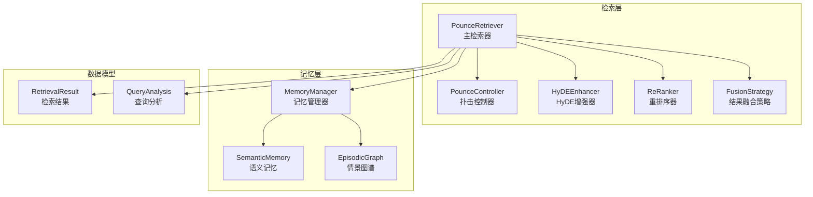
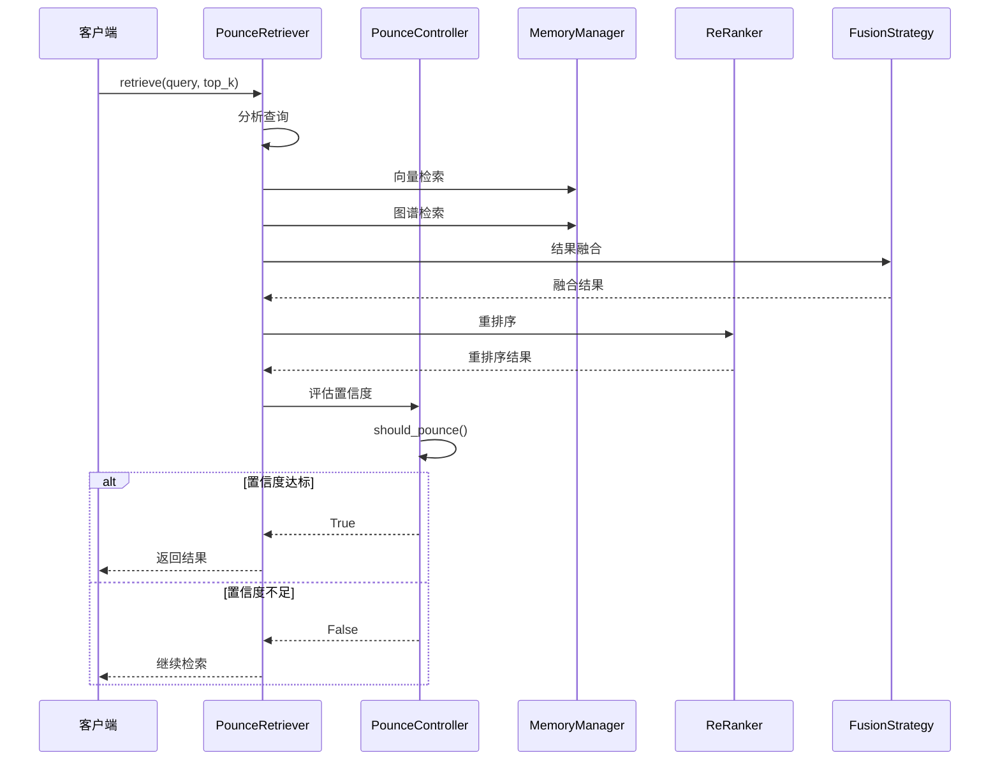
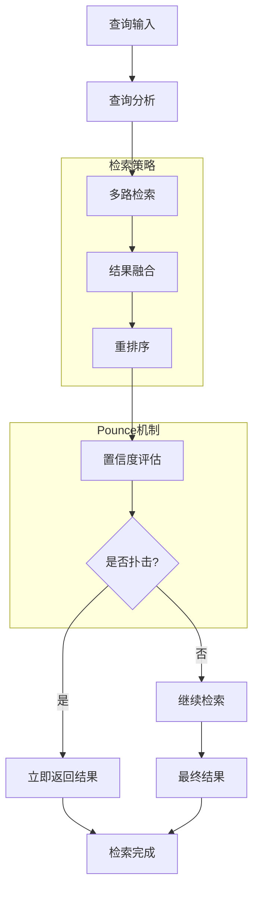
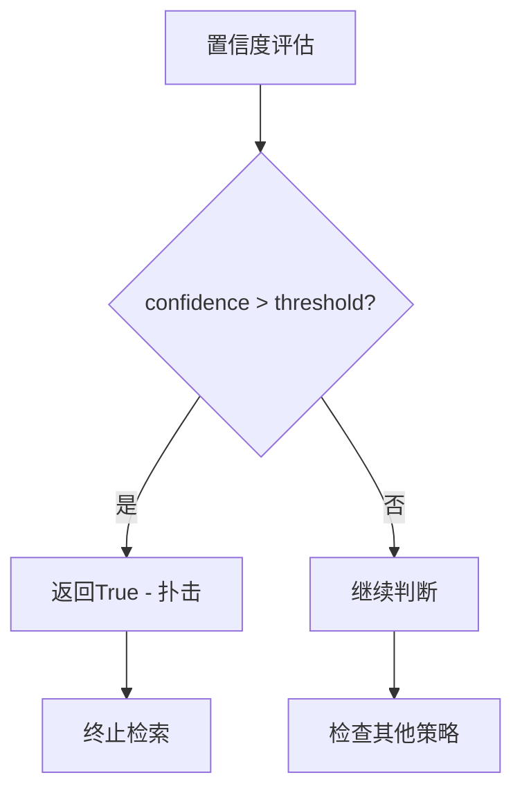
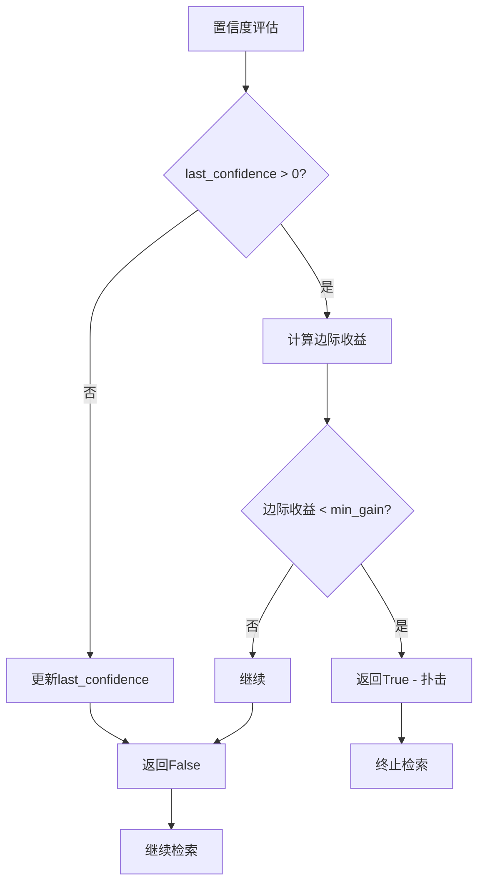
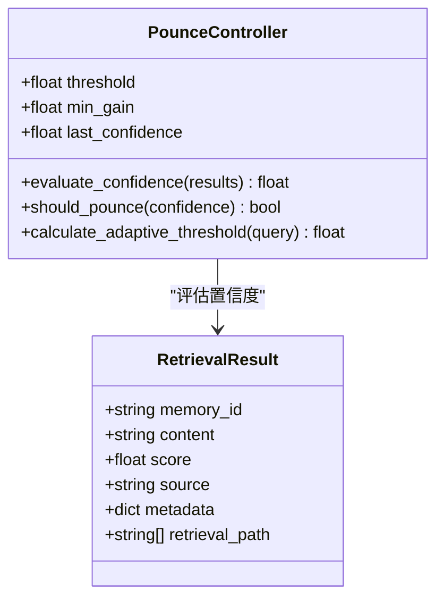
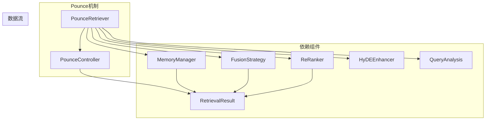

# Pounce扑击机制

<cite>
**本文档引用的文件**
- [retriever.py](file://src/retrieval/retriever.py)
- [fusion.py](file://src/retrieval/fusion.py)
- [reranker.py](file://src/retrieval/reranker.py)
- [models.py](file://src/retrieval/models.py)
- [README.md](file://src/retrieval/README.md)
- [example_usage.py](file://example/example_usage.py)
- [manager.py](file://src/memory/manager.py)
- [index.html](file://src/dashboard/static/index.html)
</cite>

## 目录
1. [简介](#简介)
2. [项目结构](#项目结构)
3. [核心组件](#核心组件)
4. [架构概览](#架构概览)
5. [详细组件分析](#详细组件分析)
6. [依赖关系分析](#依赖关系分析)
7. [性能考虑](#性能考虑)
8. [故障排除指南](#故障排除指南)
9. [结论](#结论)
10. [附录](#附录)

## 简介

Pounce扑击机制是NecoRAG检索层的核心创新组件，模拟猫捕猎时的"锁定-跳跃"行为模式。该机制通过智能置信度评估和阈值判断策略，在保证检索准确性的同时显著提升检索效率，避免不必要的计算资源浪费。

该机制的核心理念是：一旦置信度超过预设阈值，立即终止冗余检索，就像猫咪发现猎物后立即扑击一样，不进行多余的动作。这种设计既保证了检索质量，又实现了高效的资源利用。

## 项目结构

Pounce机制位于NecoRAG的检索层，与记忆管理、结果融合、重排序等组件协同工作：



**图表来源**
- [retriever.py:108-139](file://src/retrieval/retriever.py#L108-L139)
- [manager.py:16-47](file://src/memory/manager.py#L16-L47)

**章节来源**
- [retriever.py:1-336](file://src/retrieval/retriever.py#L1-L336)
- [manager.py:1-186](file://src/memory/manager.py#L1-L186)

## 核心组件

### PounceController（扑击控制器）

PounceController是Pounce机制的核心决策组件，负责置信度评估和扑击判断：

| 参数 | 类型 | 默认值 | 说明 |
|------|------|--------|------|
| threshold | float | 0.85 | 固定阈值，置信度超过此值立即扑击 |
| min_gain | float | 0.05 | 最小边际收益，用于边际收益递减策略 |

### PounceRetriever（扑击检索器）

PounceRetriever集成多种检索策略，包含完整的检索管道：



**图表来源**
- [retriever.py:140-202](file://src/retrieval/retriever.py#L140-L202)
- [retriever.py:67-87](file://src/retrieval/retriever.py#L67-L87)

**章节来源**
- [retriever.py:16-106](file://src/retrieval/retriever.py#L16-L106)
- [retriever.py:108-202](file://src/retrieval/retriever.py#L108-L202)

## 架构概览

Pounce机制在整个检索系统中的位置和作用：



**图表来源**
- [retriever.py:140-202](file://src/retrieval/retriever.py#L140-L202)
- [retriever.py:41-87](file://src/retrieval/retriever.py#L41-L87)

## 详细组件分析

### 置信度计算方法

PounceController实现了三种置信度评估策略：

#### 1. 基础置信度评估

置信度计算基于top-1分数和分数分布差异：

```mermaid
flowchart TD
A[输入: 检索结果列表] --> B{是否有结果?}
B --> |否| C[置信度 = 0.0]
B --> |是| D[获取top-1分数]
D --> E{结果数量 < 3?}
E --> |是| F[置信度 = top_score × 0.8]
E --> |否| G[计算分数差距]
G --> H[置信度 = top_score × (1 + score_gap)]
H --> I[置信度 = min(置信度, 1.0)]
F --> J[返回置信度]
I --> J
C --> J
```

**图表来源**
- [retriever.py:41-65](file://src/retrieval/retriever.py#L41-L65)

#### 2. 固定阈值策略

最直接的判断方式，当置信度超过固定阈值时立即扑击：



**图表来源**
- [retriever.py:77-79](file://src/retrieval/retriever.py#L77-L79)

#### 3. 边际收益递减策略

基于置信度变化的判断，避免过度优化：



**图表来源**
- [retriever.py:81-87](file://src/retrieval/retriever.py#L81-L87)

### 自适应阈值机制

PounceController提供了基于查询复杂度的自适应阈值调整：

| 查询类型 | 阈值调整 | 说明 |
|----------|----------|------|
| 简单查询（<20字符） | threshold × 0.9 | 降低阈值以提高召回率 |
| 复杂查询（≥20字符） | threshold | 使用默认阈值 |

**章节来源**
- [retriever.py:89-105](file://src/retrieval/retriever.py#L89-L105)

### 判断逻辑实现

PounceController的完整判断流程：



**图表来源**
- [retriever.py:16-106](file://src/retrieval/retriever.py#L16-L106)
- [models.py:9-29](file://src/retrieval/models.py#L9-L29)

**章节来源**
- [retriever.py:16-106](file://src/retrieval/retriever.py#L16-L106)

### 性能优化策略

#### 1. 检索路径追踪

PounceRetriever实现了详细的检索过程追踪：

```python
# 检索步骤追踪示例
self._retrieval_trace = [
    "Query analyzed: factual",
    "Vector search: 20 results",
    "Graph search: 0 results", 
    "Fusion: 20 results",
    "Reranked: 20 results",
    "Confidence too low: 0.75",
    "Returning 10 results"
]
```

#### 2. 多路检索优化

支持并行执行多种检索策略，包括向量检索、图谱检索和HyDE增强：

- **向量检索**：基于语义记忆的快速检索
- **图谱检索**：基于情景图谱的关系推理
- **HyDE增强**：基于假设文档的语义增强

**章节来源**
- [retriever.py:137-139](file://src/retrieval/retriever.py#L137-L139)
- [retriever.py:165-184](file://src/retrieval/retriever.py#L165-L184)

## 依赖关系分析

Pounce机制与其他组件的依赖关系：



**图表来源**
- [retriever.py:108-139](file://src/retrieval/retriever.py#L108-L139)
- [models.py:9-29](file://src/retrieval/models.py#L9-L29)

**章节来源**
- [retriever.py:108-139](file://src/retrieval/retriever.py#L108-L139)
- [models.py:9-29](file://src/retrieval/models.py#L9-L29)

## 性能考虑

### 时间复杂度分析

| 组件 | 时间复杂度 | 说明 |
|------|------------|------|
| 置信度评估 | O(n) | n为结果数量 |
| 边际收益计算 | O(1) | 常数时间 |
| 整体检索 | O(k log k) | k为融合后结果数量 |
| Pounce判断 | O(1) | 常数时间 |

### 空间复杂度分析

- **置信度缓存**：O(1) - 仅存储上次置信度
- **检索结果**：O(k) - k为返回结果数量
- **融合结果**：O(m) - m为融合后唯一结果数

### 性能优化建议

1. **阈值调优**
   - 简单查询：适当降低阈值（如0.7-0.8）
   - 复杂查询：保持默认阈值（0.85）
   - 推理查询：根据具体需求调整

2. **最小边际收益设置**
   - 高精度场景：设置较小值（0.02-0.05）
   - 高性能场景：设置较大值（0.05-0.1）

3. **检索参数优化**
   - top_k：根据业务需求调整
   - min_score：平衡召回率和精确率

## 故障排除指南

### 常见问题及解决方案

#### 1. 置信度始终过低

**症状**：所有查询都返回较少结果或继续检索

**可能原因**：
- 阈值设置过高
- 检索结果质量差
- 置信度评估参数不当

**解决方案**：
```python
# 降低阈值
retriever = PounceRetriever(
    memory=memory,
    pounce_threshold=0.7
)

# 增加最小边际收益
controller = PounceController(
    threshold=0.85,
    min_gain=0.1
)
```

#### 2. 检索速度过慢

**症状**：Pounce机制无法及时终止检索

**可能原因**：
- 检索结果过多
- 重排序耗时较长
- 融合策略复杂

**解决方案**：
- 减少top_k值
- 优化重排序参数
- 简化融合策略

#### 3. 结果质量不稳定

**症状**：置信度波动较大

**可能原因**：
- 查询复杂度变化
- 检索结果分布不均
- 阈值设置不合理

**解决方案**：
```python
# 实现自定义阈值调整
def calculate_adaptive_threshold(self, query: str) -> float:
    length = len(query)
    if length < 10:
        return self.threshold * 0.8
    elif length < 30:
        return self.threshold * 0.9
    else:
        return self.threshold
```

**章节来源**
- [retriever.py:89-105](file://src/retrieval/retriever.py#L89-L105)

## 结论

Pounce扑击机制通过模拟猫捕猎的行为模式，实现了智能的检索决策系统。该机制的核心优势在于：

1. **高效性**：通过置信度评估和阈值判断，避免不必要的计算
2. **准确性**：结合多种检索策略和重排序，保证结果质量
3. **自适应性**：支持基于查询复杂度的阈值调整
4. **可扩展性**：模块化设计便于功能扩展和优化

该机制在保证检索准确性的同时，显著提升了检索效率，为构建高性能的AI检索系统提供了有效的解决方案。

## 附录

### 配置参数参考表

| 参数名称 | 类型 | 默认值 | 范围 | 说明 |
|----------|------|--------|------|------|
| pounce_threshold | float | 0.85 | 0.7-0.95 | 扑击阈值 |
| min_gain | float | 0.05 | 0.01-0.2 | 最小边际收益 |
| top_k | int | 10 | 5-50 | 返回结果数量 |
| min_score | float | 0.3 | 0.1-0.8 | 最低相关度 |
| novelty_weight | float | 0.3 | 0.1-0.5 | 新颖性权重 |
| diversity_weight | float | 0.2 | 0.1-0.4 | 多样性权重 |
| redundancy_penalty | float | 0.4 | 0.2-0.8 | 冗余惩罚 |

### 使用场景示例

1. **问答系统**：高精度场景使用较高阈值
2. **信息检索**：平衡召回率和精确率
3. **推荐系统**：基于用户行为调整阈值
4. **智能客服**：实时响应场景优化性能

### 实际应用案例

```python
# 基础使用示例
from src.retrieval import PounceRetriever
from src.memory import MemoryManager

# 初始化检索器
memory = MemoryManager()
retriever = PounceRetriever(
    memory=memory,
    reranker_model="BGE-Reranker-v2",
    pounce_threshold=0.85,
    enable_hyde=True
)

# 执行检索
results = retriever.retrieve(
    query="机器学习算法有哪些应用场景？",
    query_vector=your_query_vector,
    top_k=10
)

# 查看检索路径
print(retriever.get_retrieval_trace())
```

**章节来源**
- [example_usage.py:94-136](file://example/example_usage.py#L94-L136)
- [retriever.py:115-135](file://src/retrieval/retriever.py#L115-L135)