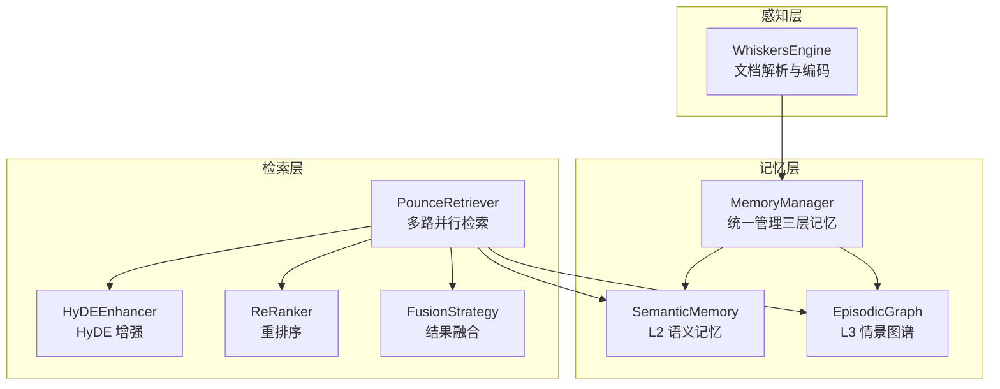
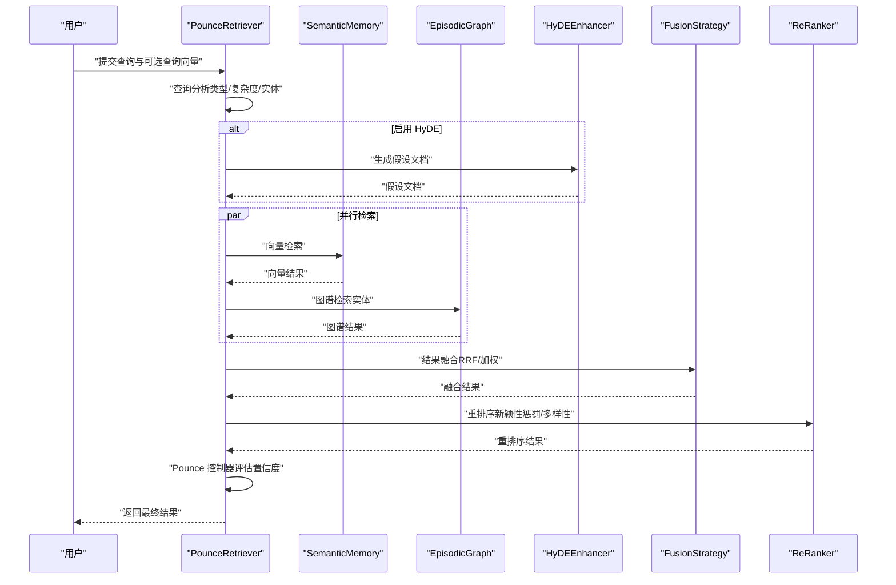
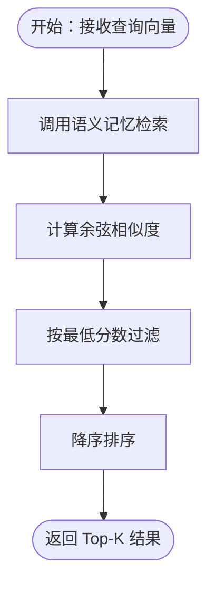
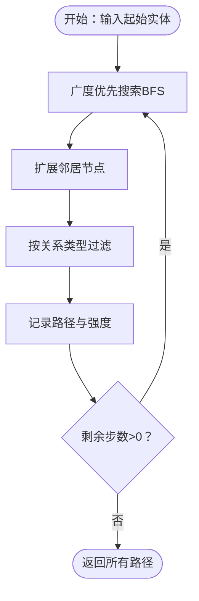
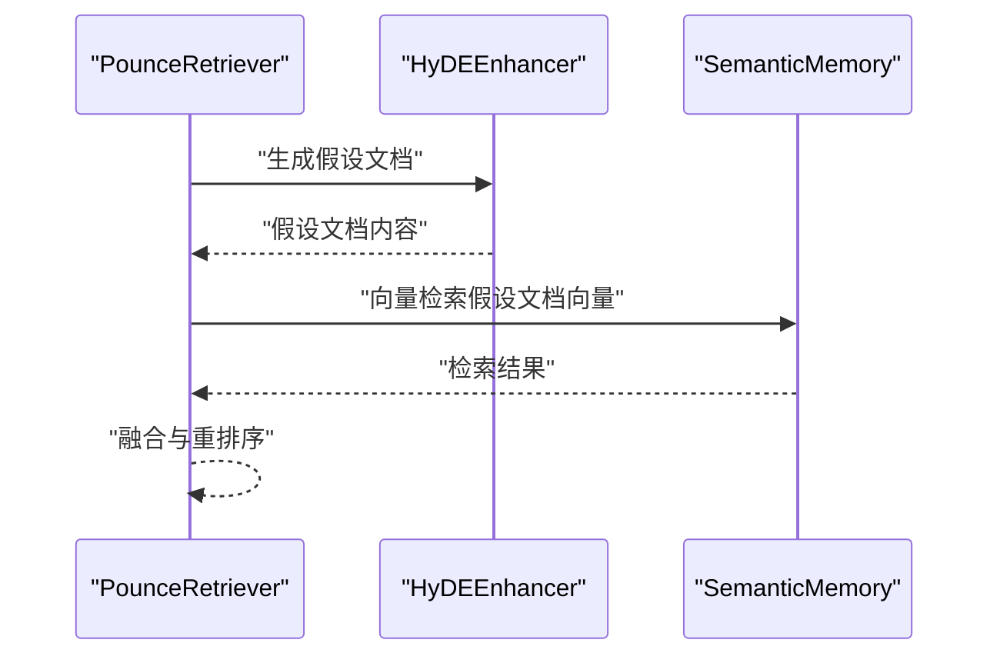
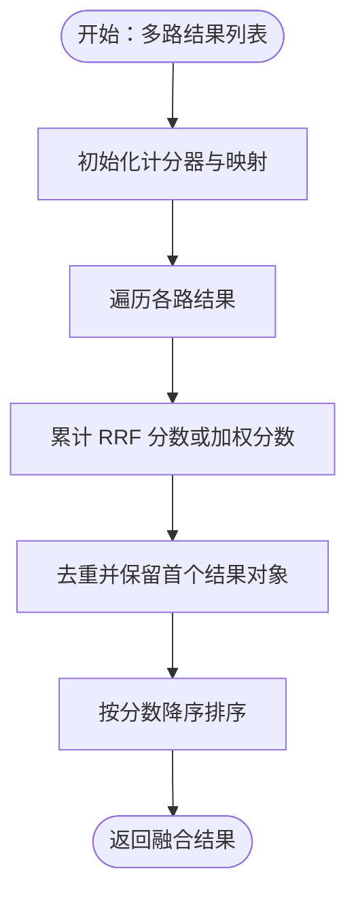
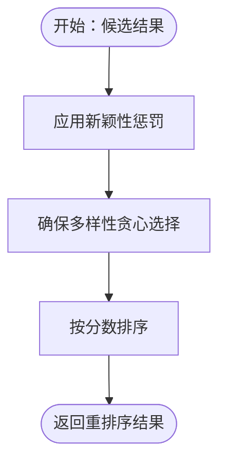
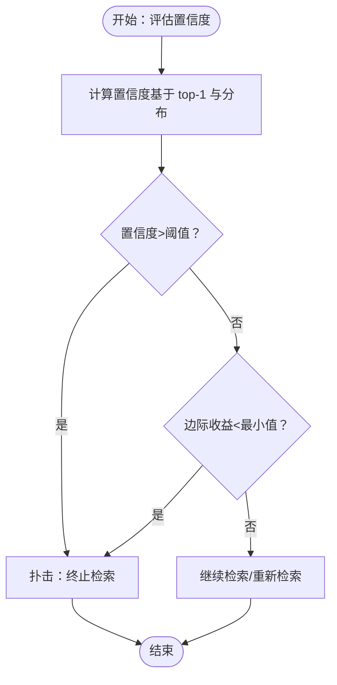
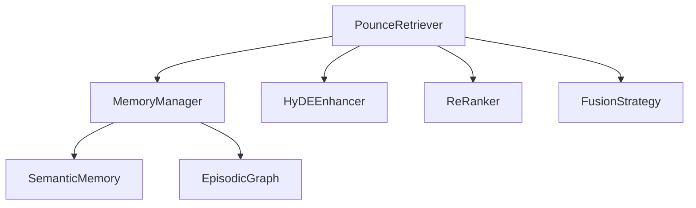

# 多路检索策略

<cite>
**本文引用的文件**
- [src/retrieval/__init__.py](file://src/retrieval/__init__.py)
- [src/retrieval/retriever.py](file://src/retrieval/retriever.py)
- [src/retrieval/models.py](file://src/retrieval/models.py)
- [src/retrieval/fusion.py](file://src/retrieval/fusion.py)
- [src/retrieval/hyde.py](file://src/retrieval/hyde.py)
- [src/retrieval/reranker.py](file://src/retrieval/reranker.py)
- [src/retrieval/README.md](file://src/retrieval/README.md)
- [src/memory/models.py](file://src/memory/models.py)
- [src/memory/manager.py](file://src/memory/manager.py)
- [src/memory/episodic_graph.py](file://src/memory/episodic_graph.py)
- [src/memory/semantic_memory.py](file://src/memory/semantic_memory.py)
- [src/whiskers/engine.py](file://src/whiskers/engine.py)
- [example/example_usage.py](file://example/example_usage.py)
</cite>

## 目录
1. [简介](#简介)
2. [项目结构](#项目结构)
3. [核心组件](#核心组件)
4. [架构总览](#架构总览)
5. [详细组件分析](#详细组件分析)
6. [依赖关系分析](#依赖关系分析)
7. [性能考量](#性能考量)
8. [故障排查指南](#故障排查指南)
9. [结论](#结论)
10. [附录](#附录)

## 简介
本技术文档围绕“多路检索策略”展开，系统阐述向量检索、关键词检索、图谱检索与 HyDE 增强检索四种核心检索模式的设计原理与实现机制，并解释多路并行检索如何提升召回率与准确性。文档还覆盖检索器基类设计、具体实现类的功能差异与选择策略、性能对比、参数调优建议以及实际使用示例，帮助读者在不同业务场景下做出合理配置与取舍。

## 项目结构
检索层位于 src/retrieval 目录，与记忆层（src/memory）紧密协作，形成“感知-记忆-检索-精排”的完整闭环。Whiskers 引擎负责文档解析与编码，生成可用于检索的向量与实体信息；MemoryManager 将编码后的知识持久化至语义记忆与情景图谱；PounceRetriever 则在检索层执行多路并行检索、结果融合与重排序，并通过 Pounce 控制器实现“锁定-跳跃”式智能终止。

图表来源
- [src/whiskers/engine.py:14-130](file://src/whiskers/engine.py#L14-L130)
- [src/memory/manager.py:16-186](file://src/memory/manager.py#L16-L186)
- [src/memory/semantic_memory.py:21-179](file://src/memory/semantic_memory.py#L21-L179)
- [src/memory/episodic_graph.py:10-194](file://src/memory/episodic_graph.py#L10-L194)
- [src/retrieval/retriever.py:108-336](file://src/retrieval/retriever.py#L108-L336)
- [src/retrieval/hyde.py:9-81](file://src/retrieval/hyde.py#L9-L81)
- [src/retrieval/reranker.py:10-179](file://src/retrieval/reranker.py#L10-L179)
- [src/retrieval/fusion.py:9-128](file://src/retrieval/fusion.py#L9-L128)

章节来源
- [src/retrieval/__init__.py:1-19](file://src/retrieval/__init__.py#L1-L19)
- [src/retrieval/README.md:1-352](file://src/retrieval/README.md#L1-L352)

## 核心组件
- PounceRetriever：多路并行检索的主控制器，负责调用向量检索、图谱检索、HyDE 增强与结果融合，并在重排序后通过 Pounce 控制器决定是否提前终止。
- HyDEEnhancer：生成假设文档并驱动检索，缓解查询模糊带来的语义错配。
- ReRanker：基于 BGE-Reranker 的精排，结合新颖性惩罚与多样性保证，提升排序质量。
- FusionStrategy：支持 RRF 与加权融合，聚合多路检索结果。
- 数据模型：RetrievalResult、QueryAnalysis，承载检索结果与查询分析信息。

章节来源
- [src/retrieval/retriever.py:108-336](file://src/retrieval/retriever.py#L108-L336)
- [src/retrieval/hyde.py:9-81](file://src/retrieval/hyde.py#L9-L81)
- [src/retrieval/reranker.py:10-179](file://src/retrieval/reranker.py#L10-L179)
- [src/retrieval/fusion.py:9-128](file://src/retrieval/fusion.py#L9-L128)
- [src/retrieval/models.py:9-29](file://src/retrieval/models.py#L9-L29)

## 架构总览
多路检索策略以“并行多源 + 融合 + 精排 + 智能终止”为核心路径，结合记忆层的三层结构（工作记忆、语义记忆、情景图谱），实现从感知到交互的全链路优化。

图表来源
- [src/retrieval/retriever.py:140-202](file://src/retrieval/retriever.py#L140-L202)
- [src/retrieval/retriever.py:203-228](file://src/retrieval/retriever.py#L203-L228)
- [src/retrieval/retriever.py:229-259](file://src/retrieval/retriever.py#L229-L259)
- [src/retrieval/fusion.py:18-71](file://src/retrieval/fusion.py#L18-L71)
- [src/retrieval/reranker.py:41-71](file://src/retrieval/reranker.py#L41-L71)
- [src/retrieval/hyde.py:54-81](file://src/retrieval/hyde.py#L54-L81)

## 详细组件分析

### 向量检索（Vector Search）
- 设计原理：利用语义向量空间中的余弦相似度进行近似最近邻检索，适合模糊匹配与语义对齐。
- 实现机制：PounceRetriever 调用 MemoryManager 的 SemanticMemory.search，返回包含 memory_id、content、score 与 metadata 的结果列表。
- 适用场景：通用问答、文档片段检索、跨文档相似度匹配。
- 性能特点：查询复杂度与向量维度、索引规模相关；当前实现为内存级余弦相似度，后续可接入 HNSW/Qdrant。
- 配置参数：top_k、min_score（在检索器内部使用）、向量维度（由编码器决定）。

图表来源
- [src/retrieval/retriever.py:289-318](file://src/retrieval/retriever.py#L289-L318)
- [src/memory/semantic_memory.py:80-119](file://src/memory/semantic_memory.py#L80-L119)

章节来源
- [src/retrieval/retriever.py:289-318](file://src/retrieval/retriever.py#L289-L318)
- [src/memory/semantic_memory.py:21-179](file://src/memory/semantic_memory.py#L21-L179)

### 图谱检索（Graph Search）
- 设计原理：基于实体关系网络进行多跳推理，捕捉结构化知识与因果链条。
- 实现机制：PounceRetriever 在存在实体识别结果时调用 EpisodicGraph.multi_hop_query，当前最小实现采用 BFS 展开；图谱节点与边以内存结构维护。
- 适用场景：因果关系推理、实体关联查询、知识图谱问答。
- 性能特点：受最大跳数与关系类型过滤影响；当前为内存遍历，后续可接入 Neo4j。
- 配置参数：max_hops（在检索器内部使用）、关系类型过滤（可扩展）。

图表来源
- [src/retrieval/retriever.py:319-336](file://src/retrieval/retriever.py#L319-L336)
- [src/memory/episodic_graph.py:71-126](file://src/memory/episodic_graph.py#L71-L126)

章节来源
- [src/retrieval/retriever.py:319-336](file://src/retrieval/retriever.py#L319-L336)
- [src/memory/episodic_graph.py:10-194](file://src/memory/episodic_graph.py#L10-L194)

### HyDE 增强检索（Hypothetical Document Embeddings）
- 设计原理：通过 LLM 生成“假设答案”，将其向量化后检索真实文档，缓解查询模糊与术语不匹配问题。
- 实现机制：HyDEEnhancer 生成假设文档，PounceRetriever.retrieve_with_hyde 调用该增强流程；当前为最小实现，后续需集成 LLM 与向量化。
- 适用场景：模糊查询、多语言查询、术语歧义场景。
- 性能特点：生成成本与 LLM 模型相关；向量检索阶段复用现有向量检索逻辑。
- 配置参数：llm_model（可选）、max_length（控制假设文档长度）。

图表来源
- [src/retrieval/retriever.py:203-228](file://src/retrieval/retriever.py#L203-L228)
- [src/retrieval/hyde.py:28-53](file://src/retrieval/hyde.py#L28-L53)
- [src/retrieval/hyde.py:54-81](file://src/retrieval/hyde.py#L54-L81)

章节来源
- [src/retrieval/hyde.py:9-81](file://src/retrieval/hyde.py#L9-L81)
- [src/retrieval/retriever.py:203-228](file://src/retrieval/retriever.py#L203-L228)

### 结果融合（Fusion）
- 设计原理：将多路检索结果进行融合，提升召回与稳定性。
- 实现机制：支持 RRF（倒数排名融合）与加权融合两种策略；RRF 对相同 memory_id 的排名位置进行累加，再按分数排序。
- 适用场景：多源检索（向量+图谱+HyDE）合并，提升整体召回。
- 性能特点：时间复杂度与结果总数线性相关；RRF 在稀疏结果上表现稳定。
- 配置参数：k（RRF 调整参数，默认 60）、weights（加权融合权重列表）。

图表来源
- [src/retrieval/fusion.py:18-71](file://src/retrieval/fusion.py#L18-L71)
- [src/retrieval/fusion.py:72-128](file://src/retrieval/fusion.py#L72-L128)

章节来源
- [src/retrieval/fusion.py:9-128](file://src/retrieval/fusion.py#L9-L128)

### 重排序（ReRanker）
- 设计原理：在候选集上进行细粒度重排，结合新颖性惩罚与多样性保证，抑制重复并鼓励新信息。
- 实现机制：先应用新颖性惩罚（基于与已选结果的重复度），再进行多样性保证（类似 MMR 的贪心选择），最后按分数排序。
- 适用场景：提升排序质量与信息密度，避免重复与同质化。
- 性能特点：相似度计算为 O(n^2)，适合候选规模较小的情况；可扩展为更高效的相似度计算。
- 配置参数：novelty_weight、diversity_weight、redundancy_penalty。

图表来源
- [src/retrieval/reranker.py:41-71](file://src/retrieval/reranker.py#L41-L71)
- [src/retrieval/reranker.py:72-108](file://src/retrieval/reranker.py#L72-L108)
- [src/retrieval/reranker.py:109-154](file://src/retrieval/reranker.py#L109-L154)

章节来源
- [src/retrieval/reranker.py:10-179](file://src/retrieval/reranker.py#L10-L179)

### Pounce 控制器（智能终止）
- 设计原理：模拟猫捕猎的“锁定-跳跃”机制，当置信度达到阈值或边际收益过低时立即终止冗余检索。
- 实现机制：evaluate_confidence 基于 top-1 与 top-2 分数差与结果数量评估；should_pounce 结合固定阈值与边际收益递减策略。
- 适用场景：长尾查询、复杂检索路径下的资源优化。
- 性能特点：显著减少不必要的计算；阈值与最小边际收益可调。
- 配置参数：threshold、min_gain、自适应阈值（基于查询长度）。

图表来源
- [src/retrieval/retriever.py:16-106](file://src/retrieval/retriever.py#L16-L106)

章节来源
- [src/retrieval/retriever.py:16-106](file://src/retrieval/retriever.py#L16-L106)

### 检索器基类设计与选择策略
- 基类设计：检索器应抽象出 retrieve 与 batch_retrieve 等通用接口，便于扩展不同策略。
- 选择策略：
  - 简单查询：优先向量检索，快速返回。
  - 复杂查询：启用 HyDE 增强与图谱检索，提升召回与准确性。
  - 推理查询：优先图谱检索，结合因果链条与多跳推理。
- 具体实现差异：
  - PounceRetriever：多路并行 + 融合 + 重排 + Pounce 终止。
  - HyDEEnhancer：假设文档生成与检索增强。
  - ReRanker：新颖性惩罚与多样性保证。
  - FusionStrategy：RRF 与加权融合。

章节来源
- [src/retrieval/README.md:143-222](file://src/retrieval/README.md#L143-L222)
- [src/retrieval/retriever.py:108-336](file://src/retrieval/retriever.py#L108-L336)

## 依赖关系分析
检索层与记忆层的耦合主要体现在 MemoryManager 对 SemanticMemory 与 EpisodicGraph 的封装，检索器通过 MemoryManager 获取底层检索能力。HyDEEnhancer 与 ReRanker、FusionStrategy 独立于具体存储实现，便于替换与扩展。

图表来源
- [src/retrieval/retriever.py:108-136](file://src/retrieval/retriever.py#L108-L136)
- [src/memory/manager.py:16-47](file://src/memory/manager.py#L16-L47)

章节来源
- [src/retrieval/retriever.py:108-136](file://src/retrieval/retriever.py#L108-L136)
- [src/memory/manager.py:16-47](file://src/memory/manager.py#L16-L47)

## 性能考量
- 多路并行检索：向量检索与图谱检索并行执行，显著缩短端到端延迟；融合与重排在候选集上进行，避免对全量结果排序。
- Pounce 控制器：在高置信度时提前终止，减少不必要的计算；自适应阈值根据查询长度动态调整。
- 重排序成本：新颖性惩罚与多样性保证的时间复杂度与候选规模相关，建议在融合后缩小候选规模再重排。
- 存储与索引：当前实现为内存级向量与图谱，生产环境建议接入 Qdrant、Neo4j 等专业存储与索引系统。

章节来源
- [src/retrieval/README.md:329-337](file://src/retrieval/README.md#L329-L337)
- [src/retrieval/retriever.py:16-106](file://src/retrieval/retriever.py#L16-L106)
- [src/retrieval/reranker.py:41-71](file://src/retrieval/reranker.py#L41-L71)

## 故障排查指南
- 检索结果为空
  - 检查查询向量是否正确生成与传入。
  - 确认 MemoryManager 的 SemanticMemory 中是否存在向量数据。
  - 检查 min_score 是否过高导致过滤过度。
- 图谱检索无结果
  - 确认实体识别是否成功，查询分析中 entities 是否为空。
  - 检查 EpisodicGraph 中是否存在对应实体与关系。
- 重排序异常
  - 检查候选集中是否存在重复内容导致惩罚过度。
  - 调整 novelty_weight、diversity_weight、redundancy_penalty 的平衡。
- HyDE 增强未生效
  - 确认 enable_hyde 选项与 retrieve_with_hyde 调用路径。
  - 检查假设文档生成逻辑与后续向量检索流程。

章节来源
- [src/retrieval/retriever.py:140-202](file://src/retrieval/retriever.py#L140-L202)
- [src/retrieval/retriever.py:203-228](file://src/retrieval/retriever.py#L203-L228)
- [src/retrieval/reranker.py:72-108](file://src/retrieval/reranker.py#L72-L108)
- [src/retrieval/hyde.py:54-81](file://src/retrieval/hyde.py#L54-L81)

## 结论
多路检索策略通过“并行多源 + 融合 + 精排 + 智能终止”的组合拳，在保证召回的同时显著提升准确性与用户体验。向量检索承担基础语义匹配，图谱检索提供结构化推理，HyDE 增强缓解模糊查询问题，融合与重排进一步提升排序质量，Pounce 控制器则在合适时机终止冗余计算。建议在不同业务场景下灵活配置参数与策略，逐步引入专业存储与索引系统以满足生产需求。

## 附录

### 使用示例
- 完整工作流示例展示了从 Whiskers 编码、MemoryManager 存储、PounceRetriever 检索到 Grooming 与 Purr 交互的全流程。
- 示例代码路径：[example/example_usage.py:1-252](file://example/example_usage.py#L1-L252)

章节来源
- [example/example_usage.py:1-252](file://example/example_usage.py#L1-L252)

### 配置参数总览
- 检索参数
  - top_k：返回数量
  - min_score：最低相关度
  - max_hops：最大跳数
  - hyde_enabled：是否启用 HyDE
- 重排序参数
  - novelty_weight：新颖性权重
  - diversity_weight：多样性权重
  - redundancy_penalty：冗余惩罚
- Pounce 参数
  - pounce_threshold：扑击阈值
  - min_gain：最小边际收益
  - max_iterations：最大迭代次数

章节来源
- [src/retrieval/README.md:305-328](file://src/retrieval/README.md#L305-L328)