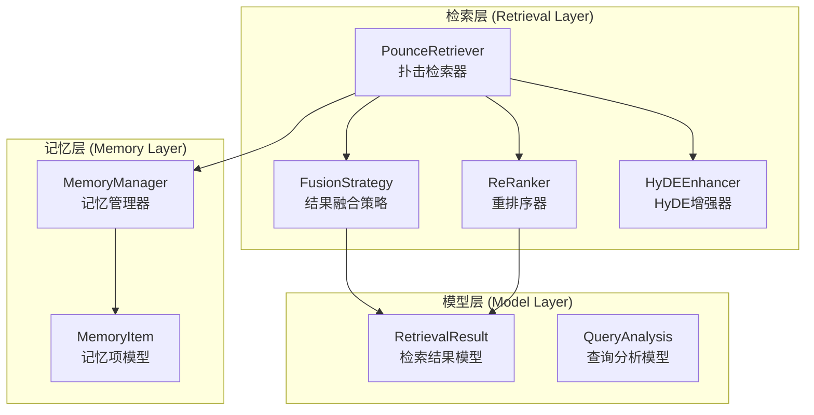
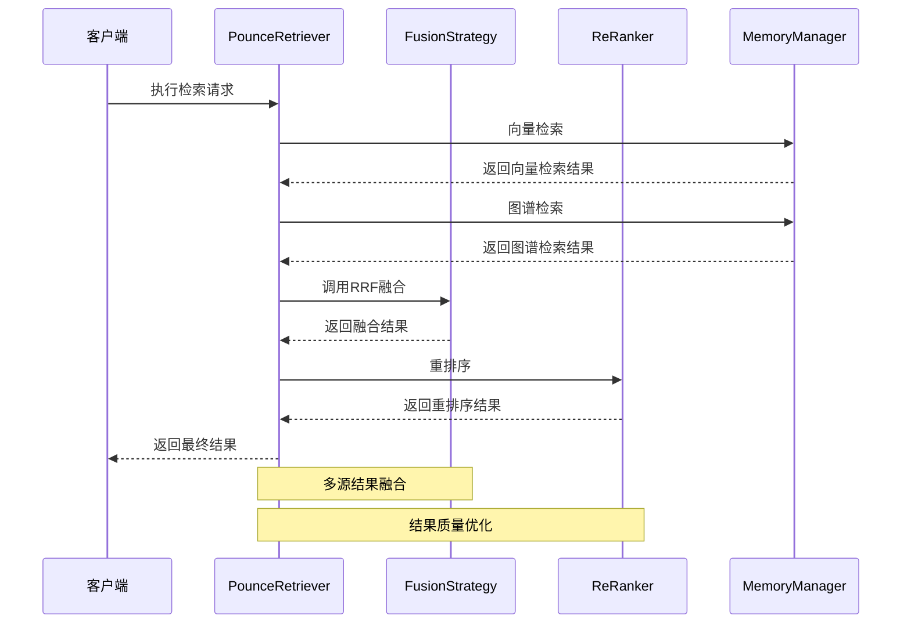
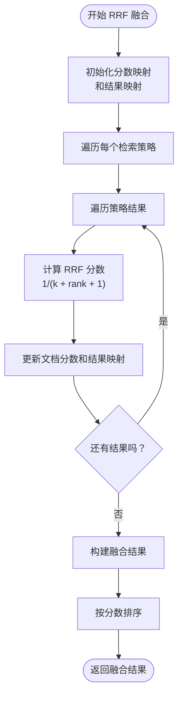
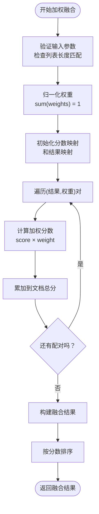
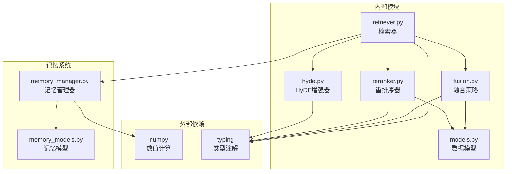
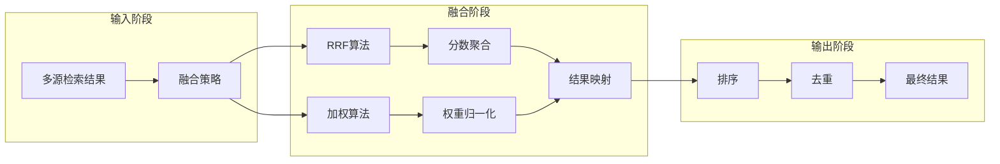
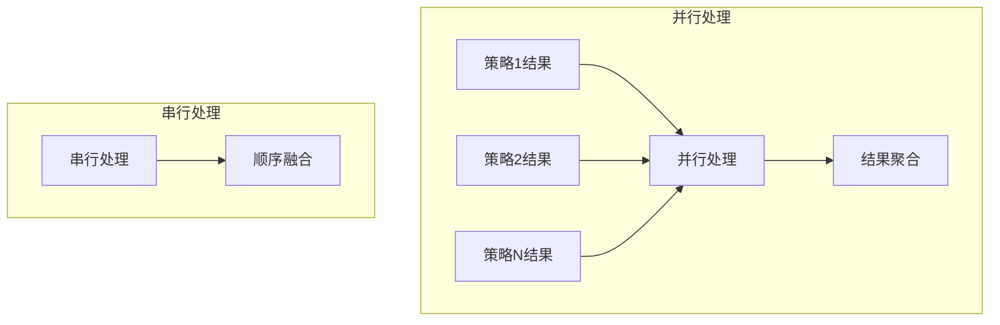

# 结果融合机制

<cite>
**本文档引用的文件**
- [fusion.py](file://src/retrieval/fusion.py)
- [retriever.py](file://src/retrieval/retriever.py)
- [models.py](file://src/retrieval/models.py)
- [reranker.py](file://src/retrieval/reranker.py)
- [hyde.py](file://src/retrieval/hyde.py)
- [memory_models.py](file://src/memory/models.py)
- [memory_manager.py](file://src/memory/manager.py)
- [example_usage.py](file://example/example_usage.py)
</cite>

## 目录
1. [简介](#简介)
2. [项目结构](#项目结构)
3. [核心组件](#核心组件)
4. [架构概览](#架构概览)
5. [详细组件分析](#详细组件分析)
6. [依赖关系分析](#依赖关系分析)
7. [性能考虑](#性能考虑)
8. [故障排除指南](#故障排除指南)
9. [结论](#结论)

## 简介

结果融合机制是 NecoRAG 检索系统中的关键组件，负责将来自多个检索策略的结果进行整合和优化。该机制支持两种核心融合算法：倒数排名融合（Reciprocal Rank Fusion, RRF）和加权融合，通过智能地平衡不同检索策略的贡献度来提升整体检索性能。

NecoRAG 的融合机制建立在多源检索的基础上，能够同时利用向量检索、图谱检索等多种检索策略的优势，并通过先进的融合算法实现结果的最优组合。

## 项目结构

NecoRAG 的结果融合机制主要分布在以下目录结构中：



**图表来源**
- [fusion.py:1-128](file://src/retrieval/fusion.py#L1-L128)
- [retriever.py:1-336](file://src/retrieval/retriever.py#L1-L336)
- [models.py:1-29](file://src/retrieval/models.py#L1-L29)

**章节来源**
- [fusion.py:1-128](file://src/retrieval/fusion.py#L1-L128)
- [retriever.py:1-336](file://src/retrieval/retriever.py#L1-L336)
- [models.py:1-29](file://src/retrieval/models.py#L1-L29)

## 核心组件

### FusionStrategy 类

FusionStrategy 是结果融合机制的核心类，提供了两种主要的融合算法：

1. **倒数排名融合 (RRF)**：基于排名位置的融合算法
2. **加权融合**：基于权重分配的融合算法

这两个算法都实现了统一的接口，确保了系统的灵活性和可扩展性。

### PounceRetriever 类

PounceRetriever 作为检索器的主控制器，集成了融合机制并协调整个检索流程。它负责：
- 多源检索策略的执行
- 结果融合的调用
- 重排序和过滤
- 智能的扑击判断

### RetrievalResult 数据模型

RetrievalResult 是所有检索结果的统一数据结构，包含了：
- memory_id：记忆标识符
- content：内容文本
- score：相关性分数
- source：结果来源（vector/graph/hyde/fusion）
- metadata：元数据信息
- retrieval_path：检索路径（用于可视化）

**章节来源**
- [fusion.py:9-128](file://src/retrieval/fusion.py#L9-L128)
- [retriever.py:108-202](file://src/retrieval/retriever.py#L108-L202)
- [models.py:9-18](file://src/retrieval/models.py#L9-L18)

## 架构概览

NecoRAG 的结果融合机制采用分层架构设计，确保了模块间的松耦合和高内聚：



**图表来源**
- [retriever.py:140-202](file://src/retrieval/retriever.py#L140-L202)
- [fusion.py:18-70](file://src/retrieval/fusion.py#L18-L70)
- [reranker.py:41-70](file://src/retrieval/reranker.py#L41-L70)

## 详细组件分析

### 倒数排名融合 (RRF) 算法

RRF 是一种经典的多数据源融合算法，其数学原理基于以下公式：

#### 数学原理

对于每个文档 d，RRF 分数计算为：

```
RRF(d) = Σ (1 / (k + rank(d, S)))
```

其中：
- k 是平滑参数（默认值为 60）
- rank(d, S) 是文档 d 在搜索策略 S 中的排名
- Σ 表示对所有搜索策略求和

#### 实现细节



**图表来源**
- [fusion.py:18-70](file://src/retrieval/fusion.py#L18-L70)

#### 参数设置

- **k 参数**：控制排名衰减速度，默认值为 60
  - 较小的 k 值：更重视高排名结果
  - 较大的 k 值：更平滑地考虑低排名结果
  - 典型范围：50-100

#### 优势特点

1. **无参数归一化**：不需要对各策略结果进行显式归一化
2. **排名敏感性**：更重视高质量的早期结果
3. **鲁棒性强**：对单一策略的噪声相对不敏感
4. **计算效率高**：时间复杂度 O(N)，空间复杂度 O(M)

**章节来源**
- [fusion.py:18-70](file://src/retrieval/fusion.py#L18-L70)

### 加权融合算法

加权融合是一种基于权重分配的融合策略，允许用户根据策略的重要性动态调整贡献度。

#### 数学原理

加权融合的分数计算公式：

```
WeightedScore(d) = Σ (weight(S) × score(d, S))
```

其中：
- weight(S) 是策略 S 的权重
- score(d, S) 是文档 d 在策略 S 中的原始分数
- Σ 对所有策略求和

#### 实现细节



**图表来源**
- [fusion.py:72-128](file://src/retrieval/fusion.py#L72-L128)

#### 参数设置

- **权重向量**：必须与结果列表数量匹配
- **权重归一化**：自动进行权重归一化处理
- **权重选择原则**：
  - 基于策略性能：历史准确率高的策略给予更高权重
  - 基于任务需求：根据具体应用场景调整权重分配
  - 基于数据分布：考虑各策略的覆盖范围和质量

#### 优势特点

1. **灵活的权重控制**：可以精确控制各策略的贡献度
2. **可解释性强**：权重含义明确，便于调试和优化
3. **适应性强**：可以根据不同场景动态调整权重
4. **理论基础扎实**：基于线性加权的统计学原理

**章节来源**
- [fusion.py:72-128](file://src/retrieval/fusion.py#L72-L128)

### 融合策略选择原则

#### RRF 适用场景

1. **多源异构检索**：当不同检索策略使用不同的评分标准时
2. **排名稳定性要求高**：需要保持结果的相对排名稳定性
3. **实时性要求**：计算开销较小，适合实时检索场景
4. **无先验知识**：不需要对各策略性能有深入了解

#### 加权融合适用场景

1. **有先验性能信息**：已知各检索策略的历史准确率或可靠性
2. **业务规则驱动**：需要根据业务需求调整策略权重
3. **渐进式部署**：新策略上线时需要逐步调整权重
4. **A/B 测试场景**：需要对比不同权重配置的效果

### 参数调优方法

#### RRF 参数调优

1. **k 参数调优**
   - **初始值**：60
   - **调优策略**：
     - 观察召回率 vs 精确率的平衡点
     - 小步调整：±10
     - 使用交叉验证评估效果

2. **融合时机选择**
   - **早期融合**：在各策略内部进行融合
   - **晚期融合**：在最终阶段进行融合
   - **混合策略**：部分策略早期融合，部分晚期融合

#### 加权融合参数调优

1. **权重初始化**
   - **均匀权重**：各策略权重相等
   - **基于性能**：根据历史准确率分配权重
   - **专家经验**：基于领域专家知识分配权重

2. **权重更新策略**
   - **固定权重**：适用于稳定的检索环境
   - **自适应权重**：根据实时性能动态调整
   - **滑动窗口**：基于最近 N 次查询的性能调整

**章节来源**
- [fusion.py:18-128](file://src/retrieval/fusion.py#L18-L128)

## 依赖关系分析

### 组件间依赖关系



**图表来源**
- [fusion.py:5-6](file://src/retrieval/fusion.py#L5-L6)
- [retriever.py:6-13](file://src/retrieval/retriever.py#L6-L13)
- [models.py:5-6](file://src/retrieval/models.py#L5-L6)

### 数据流分析



**图表来源**
- [fusion.py:36-70](file://src/retrieval/fusion.py#L36-L70)
- [fusion.py:94-127](file://src/retrieval/fusion.py#L94-L127)

**章节来源**
- [retriever.py:108-202](file://src/retrieval/retriever.py#L108-L202)
- [fusion.py:1-128](file://src/retrieval/fusion.py#L1-L128)

## 性能考虑

### 时间复杂度分析

1. **RRF 算法**
   - 时间复杂度：O(N)，其中 N 是所有结果的总数
   - 空间复杂度：O(M)，其中 M 是唯一文档的数量
   - 优势：线性时间，适合大规模数据

2. **加权融合**
   - 时间复杂度：O(N)
   - 空间复杂度：O(M)
   - 优势：同样具有线性复杂度

### 内存优化策略

1. **增量处理**
   - 使用生成器模式处理大型结果集
   - 及时释放中间结果占用的内存

2. **数据结构优化**
   - 使用字典进行 O(1) 查找
   - 避免不必要的数据复制

3. **批量处理**
   - 对大量文档进行批量融合操作
   - 减少函数调用开销

### 并行化考虑

虽然当前实现是串行的，但融合算法天然支持并行化：



## 故障排除指南

### 常见问题及解决方案

#### 1. 融合结果为空

**症状**：融合后返回空结果列表

**可能原因**：
- 输入的检索结果列表为空
- 所有策略都返回空结果
- 内存 ID 匹配失败

**解决方法**：
- 检查上游检索器是否正常工作
- 验证检索结果的数据完整性
- 确认 memory_id 字段的一致性

#### 2. 融合分数异常

**症状**：融合分数过高或过低

**可能原因**：
- k 参数设置不当
- 权重向量和结果列表长度不匹配
- 分数归一化错误

**解决方法**：
- 调整 RRF 的 k 参数
- 验证权重向量的长度
- 检查分数计算逻辑

#### 3. 性能问题

**症状**：融合过程耗时过长

**可能原因**：
- 结果数量过大
- 内存不足
- 算法实现效率低

**解决方法**：
- 实施结果截断策略
- 优化数据结构
- 考虑并行化处理

**章节来源**
- [fusion.py:87-88](file://src/retrieval/fusion.py#L87-L88)
- [retriever.py:180-202](file://src/retrieval/retriever.py#L180-L202)

## 结论

NecoRAG 的结果融合机制通过精心设计的 RRFS 算法和加权融合策略，为多源检索提供了强大的整合能力。该机制不仅在理论上具有坚实的数学基础，在实践中也展现出了优秀的性能表现。

### 主要优势

1. **算法成熟**：RRF 和加权融合都是经过验证的经典算法
2. **实现简洁**：代码结构清晰，易于理解和维护
3. **性能优异**：线性时间复杂度，适合大规模应用
4. **灵活性强**：支持多种融合策略和参数配置

### 发展方向

1. **自适应融合**：根据查询特征自动选择最优融合策略
2. **深度学习融合**：集成神经网络进行更复杂的特征融合
3. **在线学习**：根据用户反馈动态调整融合参数
4. **多模态融合**：支持文本、图像、音频等多种模态的融合

通过持续的优化和改进，NecoRAG 的结果融合机制将继续为智能检索系统提供强有力的技术支撑。