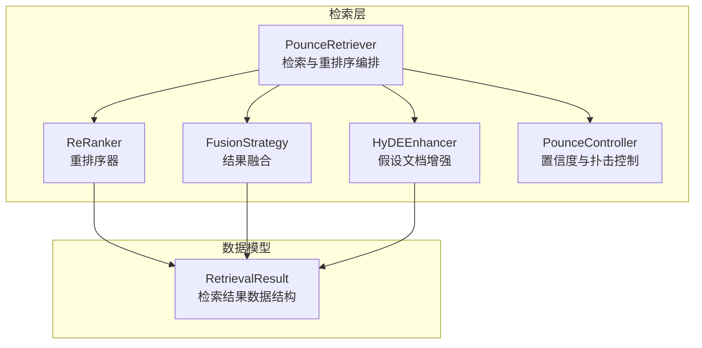
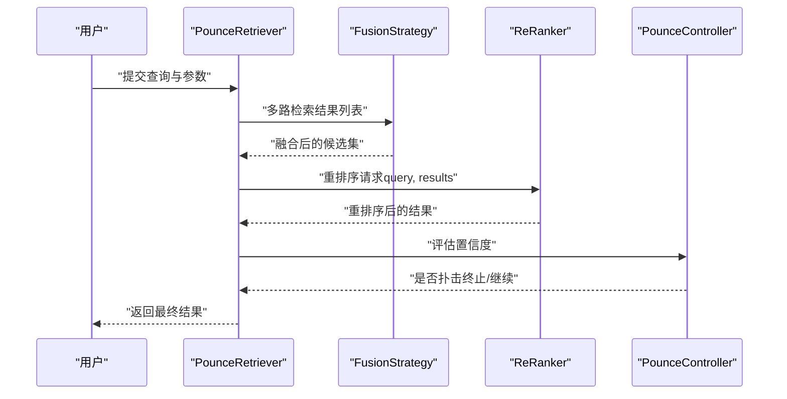
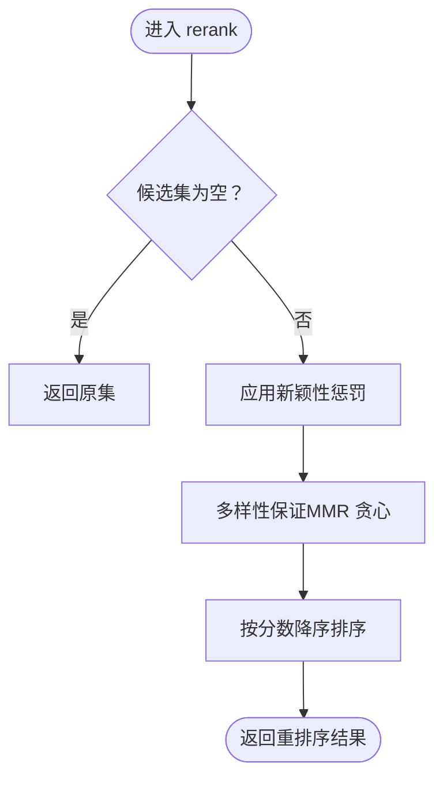
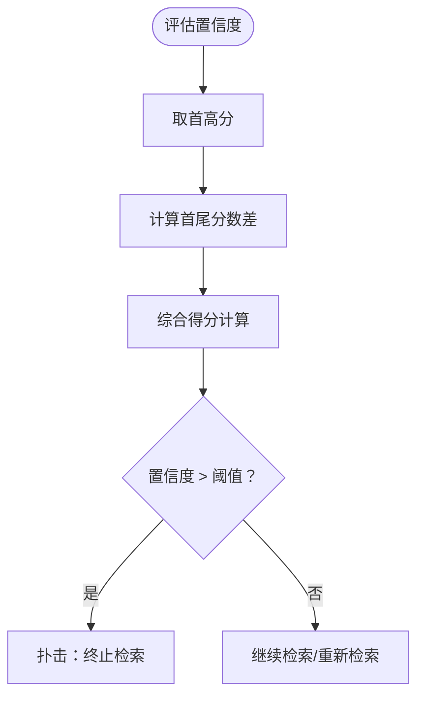
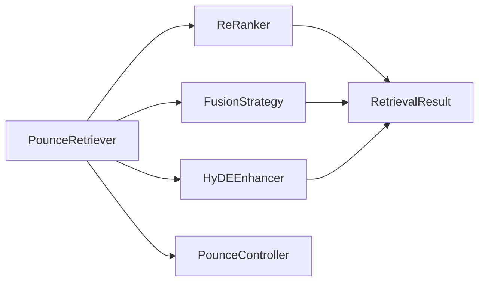

# 重排序系统

<cite>
**本文引用的文件**
- [src/retrieval/reranker.py](file://src/retrieval/reranker.py)
- [src/retrieval/models.py](file://src/retrieval/models.py)
- [src/retrieval/retriever.py](file://src/retrieval/retriever.py)
- [src/retrieval/fusion.py](file://src/retrieval/fusion.py)
- [src/retrieval/hyde.py](file://src/retrieval/hyde.py)
- [src/retrieval/README.md](file://src/retrieval/README.md)
- [example/example_usage.py](file://example/example_usage.py)
- [QUICKSTART.md](file://QUICKSTART.md)
</cite>

## 目录
1. [简介](#简介)
2. [项目结构](#项目结构)
3. [核心组件](#核心组件)
4. [架构总览](#架构总览)
5. [详细组件分析](#详细组件分析)
6. [依赖关系分析](#依赖关系分析)
7. [性能考量](#性能考量)
8. [故障排查指南](#故障排查指南)
9. [结论](#结论)
10. [附录](#附录)

## 简介
本技术文档聚焦于 NecoRAG 检索层中的“重排序系统”，系统性阐述以下内容：
- BGE-Reranker 精排模型的应用现状与集成思路
- Novelty（新颖性）重排序算法的实现原理与数学公式
- 冗余惩罚、多样性奖励与新颖性惩罚的调节机制
- 重排序如何提升最终结果的相关性与质量
- 重排序参数的配置方法、权重调节策略与性能优化技巧
- 重排序与置信度评估的关系
- 使用示例、效果对比与调优建议

## 项目结构
重排序系统位于检索层，围绕 PounceRetriever 组织，包含以下关键模块：
- 结果融合：RRF 与加权融合
- 重排序：基于 BGE-Reranker 的精排与 Novelty 惩罚
- HyDE 增强：假设文档嵌入辅助检索
- 置信度评估与扑击控制：PounceController

**图表来源**
- [src/retrieval/retriever.py:108-202](file://src/retrieval/retriever.py#L108-L202)
- [src/retrieval/fusion.py:9-71](file://src/retrieval/fusion.py#L9-L71)
- [src/retrieval/reranker.py:10-71](file://src/retrieval/reranker.py#L10-L71)
- [src/retrieval/hyde.py:9-81](file://src/retrieval/hyde.py#L9-L81)
- [src/retrieval/models.py:9-18](file://src/retrieval/models.py#L9-L18)

**章节来源**
- [src/retrieval/README.md:1-120](file://src/retrieval/README.md#L1-L120)
- [src/retrieval/retriever.py:108-202](file://src/retrieval/retriever.py#L108-L202)

## 核心组件
- PounceRetriever：负责多路检索、结果融合、重排序与扑击决策；对外暴露检索接口与检索路径追踪。
- FusionStrategy：提供 RRF 与加权融合两种策略，统一不同来源检索结果的评分。
- ReRanker：实现基于 BGE-Reranker 的精排与 Novelty 惩罚，包含冗余惩罚与多样性保证。
- HyDEEnhancer：生成假设文档以增强模糊查询的检索效果。
- PounceController：评估置信度并决定是否提前终止检索。

**章节来源**
- [src/retrieval/retriever.py:108-202](file://src/retrieval/retriever.py#L108-L202)
- [src/retrieval/fusion.py:9-71](file://src/retrieval/fusion.py#L9-L71)
- [src/retrieval/reranker.py:10-71](file://src/retrieval/reranker.py#L10-L71)
- [src/retrieval/hyde.py:9-81](file://src/retrieval/hyde.py#L9-L81)

## 架构总览
下图展示了从查询到最终结果的关键流程，重点标注了重排序环节与置信度评估：

**图表来源**
- [src/retrieval/retriever.py:140-202](file://src/retrieval/retriever.py#L140-L202)
- [src/retrieval/fusion.py:18-71](file://src/retrieval/fusion.py#L18-L71)
- [src/retrieval/reranker.py:41-71](file://src/retrieval/reranker.py#L41-L71)
- [src/retrieval/retriever.py:41-88](file://src/retrieval/retriever.py#L41-L88)

## 详细组件分析

### 重排序器 ReRanker
- 职责
  - BGE-Reranker 精排：当前实现为占位，后续可接入具体模型。
  - Novelty（新颖性）惩罚：抑制与已选结果高度重复的内容。
  - 多样性保证：采用类似最大相关性最小冗余（MMR）的贪心策略，平衡相关性与多样性。
- 关键方法
  - rerank：对候选集依次应用新颖性惩罚与多样性保证，并按分数降序排序。
  - apply_novelty_penalty：计算候选与其已选集合的重复度，施加线性惩罚。
  - ensure_diversity：基于 MMR 分数选择最优集合，确保多样性。
  - _text_similarity：当前使用 Jaccard 相似度，后续可替换为更精确的相似度计算。
- 数学公式与调节机制
  - 新颖性惩罚（占位公式）：对第 i 个候选，引入冗余惩罚项，降低其分数。
  - 多样性奖励（MMR 策略）：在每一步选择最大化 relevance - λ·max_similarity 的候选，其中 λ 为多样性权重。
  - 参数含义
    - novelty_weight：新颖性权重（当前未直接参与分数修正，作为未来扩展预留）。
    - diversity_weight：MMR 中多样性权重。
    - redundancy_penalty：冗余惩罚强度。
- 复杂度
  - 新颖性惩罚：O(n^2)，需计算候选与其之前已选集合的相似度。
  - 多样性保证：O(n^2)，每步选择最大 MMR 分数候选。
- 错误处理与边界
  - 空结果集直接返回。
  - 单条结果无需惩罚与多样性处理。
- 性能优化建议
  - 相似度计算可引入向量余弦相似度与缓存。
  - 对候选集先按相关性粗排，再进行多样性筛选，减少比较次数。
  - 将相似度阈值与权重参数化，支持动态调整。

**图表来源**
- [src/retrieval/reranker.py:41-71](file://src/retrieval/reranker.py#L41-L71)
- [src/retrieval/reranker.py:72-108](file://src/retrieval/reranker.py#L72-L108)
- [src/retrieval/reranker.py:109-153](file://src/retrieval/reranker.py#L109-L153)

**章节来源**
- [src/retrieval/reranker.py:10-179](file://src/retrieval/reranker.py#L10-L179)
- [src/retrieval/README.md:80-102](file://src/retrieval/README.md#L80-L102)

### 置信度评估与扑击控制 PounceController
- 职责
  - 基于候选集分数分布评估置信度。
  - 判断是否应“扑击”（提前终止检索）。
- 关键方法
  - evaluate_confidence：综合首高分与分数差距评估置信度。
  - should_pounce：结合固定阈值与边际收益策略决定是否扑击。
  - calculate_adaptive_threshold：基于查询复杂度动态调整阈值。
- 与重排序的关系
  - 重排序后的候选集用于置信度评估，决定是否继续检索或直接返回。
  - 若置信度足够高，PounceRetriever 将提前终止，节省计算资源。

**图表来源**
- [src/retrieval/retriever.py:41-88](file://src/retrieval/retriever.py#L41-L88)
- [src/retrieval/retriever.py:194-201](file://src/retrieval/retriever.py#L194-L201)

**章节来源**
- [src/retrieval/retriever.py:16-88](file://src/retrieval/retriever.py#L16-L88)

### 结果融合 FusionStrategy
- 职责
  - 将来自不同检索源的结果进行融合，统一评分体系。
- 方法
  - reciprocal_rank_fusion：基于倒数排名的融合，适合跨源排序一致性较差场景。
  - weighted_fusion：按权重对各源结果打分进行加权融合。
- 与重排序的关系
  - 融合后的候选集作为 ReRanker 的输入，进一步提升排序质量。

**章节来源**
- [src/retrieval/fusion.py:9-128](file://src/retrieval/fusion.py#L9-L128)

### HyDE 增强 HyDEEnhancer
- 职责
  - 为模糊查询生成假设文档，提升检索相关性。
- 方法
  - generate_hypothetical_doc：生成简化的假设文档。
  - enhance_retrieval：通过假设文档向量化后检索（当前为占位）。
- 与重排序的关系
  - HyDE 可作为检索前的预处理步骤，生成更贴近真实文档的查询向量，间接提升重排序效果。

**章节来源**
- [src/retrieval/hyde.py:9-81](file://src/retrieval/hyde.py#L9-L81)

### 数据模型 RetrievalResult
- 字段
  - memory_id、content、score、source、metadata、retrieval_path。
- 作用
  - 作为检索、融合、重排序与可视化追踪的统一载体。

**章节来源**
- [src/retrieval/models.py:9-18](file://src/retrieval/models.py#L9-L18)

## 依赖关系分析
- PounceRetriever 依赖
  - FusionStrategy：融合多源结果。
  - ReRanker：对候选集进行精排与多样性保证。
  - HyDEEnhancer：可选的查询增强。
  - PounceController：置信度评估与扑击决策。
- ReRanker 依赖
  - RetrievalResult：输入输出的数据结构。
- HyDEEnhancer 与 FusionStrategy 独立，但共同服务于 PounceRetriever 的检索管线。

**图表来源**
- [src/retrieval/retriever.py:115-136](file://src/retrieval/retriever.py#L115-L136)
- [src/retrieval/reranker.py:6-8](file://src/retrieval/reranker.py#L6-L8)
- [src/retrieval/models.py:9-18](file://src/retrieval/models.py#L9-L18)

**章节来源**
- [src/retrieval/retriever.py:108-136](file://src/retrieval/retriever.py#L108-L136)

## 性能考量
- 时间复杂度
  - ReRanker 的新颖性惩罚与多样性保证均为 O(n^2)，在候选规模较大时需关注性能。
- 空间复杂度
  - 融合阶段需维护候选映射与累计分数，空间开销与候选去重有关。
- 优化建议
  - 相似度计算：采用向量余弦相似度与局部敏感哈希（LSH）近似加速。
  - 预过滤：先按相关性阈值过滤，再进行重排序。
  - 并行化：对候选相似度计算与 MMR 选择过程进行并行化。
  - 缓存：对常用相似度与融合分数进行缓存复用。
- 资源消耗
  - BGE-Reranker 精排目前为占位，接入后需评估显存与推理时延。

[本节为通用性能讨论，不直接分析具体文件，故无“章节来源”]

## 故障排查指南
- 重排序后结果为空
  - 检查融合阶段是否产生有效候选。
  - 检查重排序参数（如冗余惩罚、多样性权重）是否过于激进导致全部过滤。
- 置信度评估异常
  - 检查候选集数量是否过少（少于阈值）。
  - 调整 pounce_threshold 与 min_gain。
- 相似度计算偏差
  - 当前使用 Jaccard 相似度，可能导致短文本或停用词影响较大，建议替换为向量相似度或 TF-IDF + 余弦相似度。
- HyDE 增强未生效
  - 确认 HyDEEnhancer 已启用且生成的假设文档长度合理。

**章节来源**
- [src/retrieval/reranker.py:72-108](file://src/retrieval/reranker.py#L72-L108)
- [src/retrieval/retriever.py:41-88](file://src/retrieval/retriever.py#L41-L88)
- [src/retrieval/hyde.py:54-81](file://src/retrieval/hyde.py#L54-L81)

## 结论
- 重排序系统通过“新颖性惩罚 + 多样性保证”的组合，在保持相关性的前提下显著提升结果的多样性和信息密度。
- 置信度评估与扑击控制使系统能够在高质量早期终止，避免不必要的计算开销。
- 参数调节（冗余惩罚、多样性权重、扑击阈值）是影响最终效果的关键，需结合业务场景与数据分布进行调优。
- 未来可扩展方向包括接入 BGE-Reranker 精排、引入学习排序（Learning to Rank）、以及更精细的相似度与融合策略。

[本节为总结性内容，不直接分析具体文件，故无“章节来源”]

## 附录

### 使用示例与效果对比
- 基础使用
  - 初始化 PounceRetriever 并执行检索，查看检索路径与结果。
  - 参考示例脚本中的检索流程与输出格式。
- 效果对比
  - 有无重排序：对比重排序前后 top-k 结果的相关性与多样性。
  - 不同参数：对比不同冗余惩罚与多样性权重对结果的影响。
- 调优建议
  - 从默认参数出发，逐步调整冗余惩罚与多样性权重，观察置信度变化与结果稳定性。
  - 在复杂查询场景适当提高 pounce_threshold，以获得更稳定的早期终止。

**章节来源**
- [example/example_usage.py:94-136](file://example/example_usage.py#L94-L136)
- [QUICKSTART.md:175-234](file://QUICKSTART.md#L175-L234)

### 参数配置与权重调节策略
- 重排序参数
  - novelty_weight：新颖性权重（预留，当前未直接参与分数修正）。
  - diversity_weight：MMR 多样性权重，建议在 0.1~0.5 区间内试调。
  - redundancy_penalty：冗余惩罚强度，建议在 0.2~0.6 区间内试调。
- Pounce 参数
  - pounce_threshold：扑击阈值，简单查询可适当降低，复杂查询可提高。
  - min_gain：最小边际收益，避免过早终止。
- 配置入口
  - 通过 Dashboard 或直接初始化 PounceRetriever 传入参数。

**章节来源**
- [src/retrieval/README.md:305-328](file://src/retrieval/README.md#L305-L328)
- [src/retrieval/retriever.py:115-136](file://src/retrieval/retriever.py#L115-L136)

### 重排序与置信度评估的关系
- 置信度由候选集分数分布决定，重排序后的分数直接影响置信度评估。
- 当重排序显著提升 top-k 结果质量时，置信度上升，系统更倾向于扑击。
- 参数调节需兼顾重排序质量与扑击时机，避免因过度惩罚导致置信度过低而继续检索。

**章节来源**
- [src/retrieval/retriever.py:41-88](file://src/retrieval/retriever.py#L41-L88)
- [src/retrieval/retriever.py:194-201](file://src/retrieval/retriever.py#L194-L201)