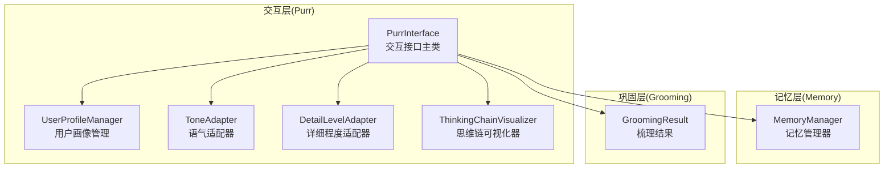
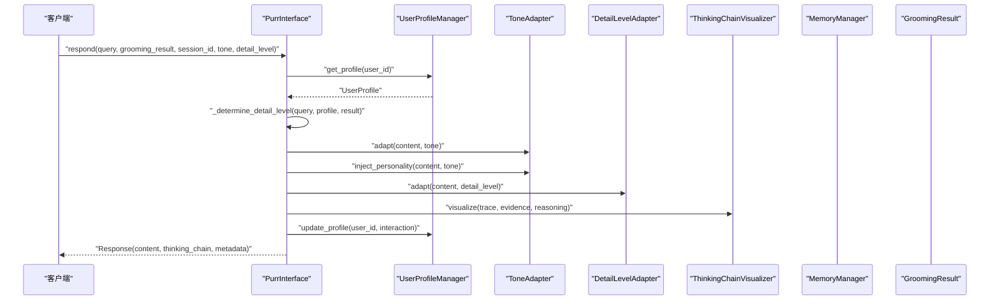
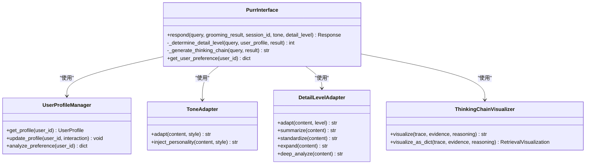
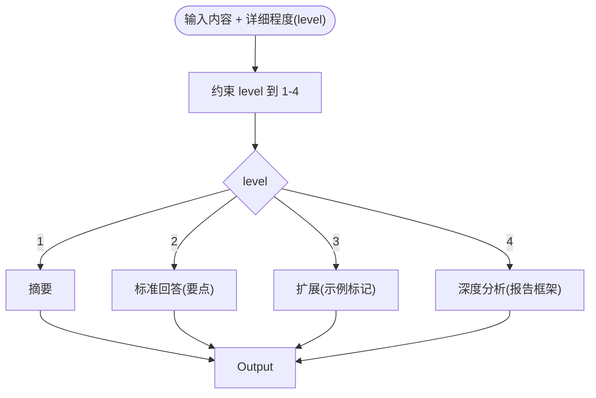
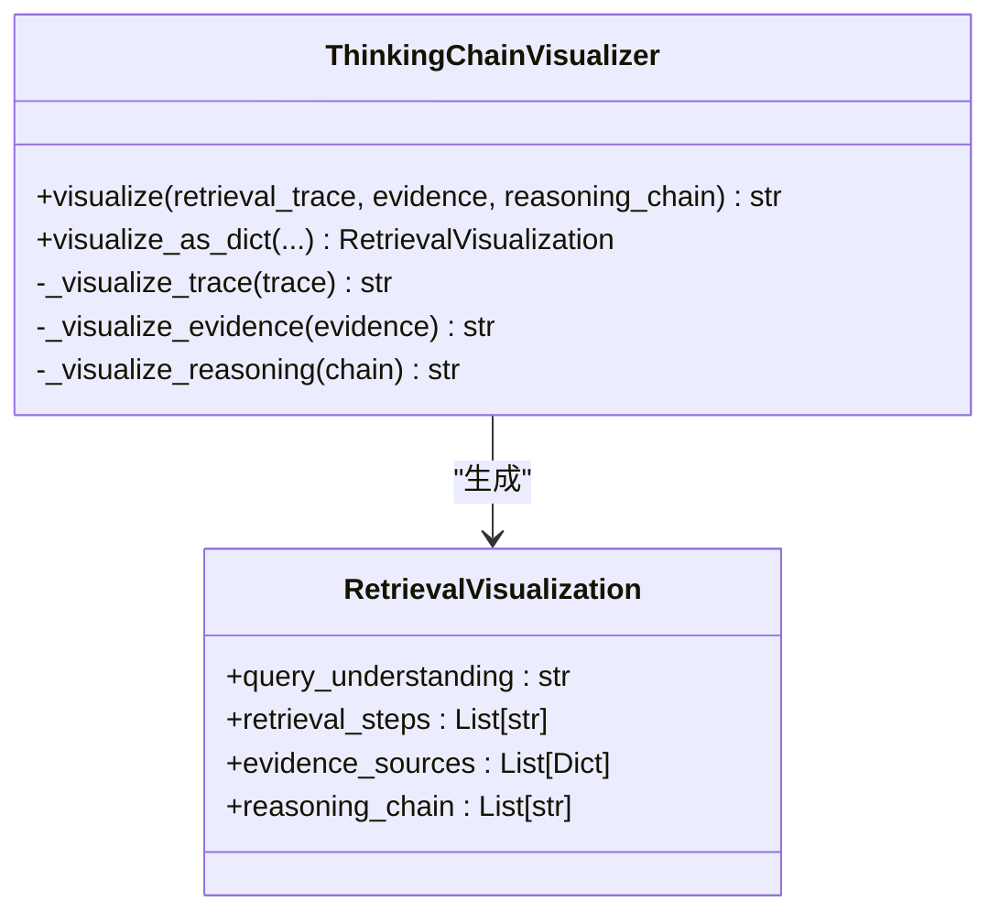
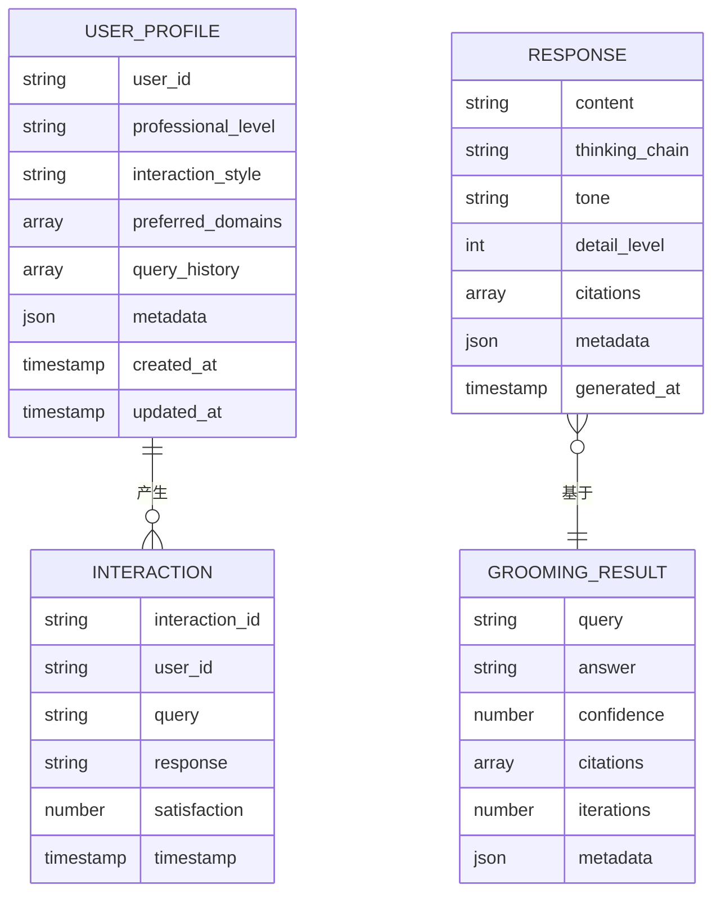
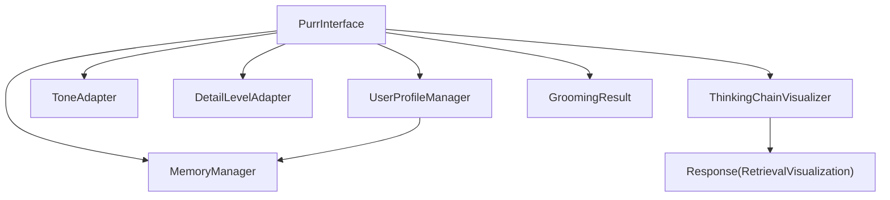

# Purr Interface - 交互层

<cite>
**本文引用的文件**
- [src/purr/interface.py](file://src/purr/interface.py)
- [src/purr/models.py](file://src/purr/models.py)
- [src/purr/profile_manager.py](file://src/purr/profile_manager.py)
- [src/purr/tone_adapter.py](file://src/purr/tone_adapter.py)
- [src/purr/detail_adapter.py](file://src/purr/detail_adapter.py)
- [src/purr/visualizer.py](file://src/purr/visualizer.py)
- [src/grooming/models.py](file://src/grooming/models.py)
- [src/memory/manager.py](file://src/memory/manager.py)
- [src/purr/README.md](file://src/purr/README.md)
- [src/dashboard/README.md](file://src/dashboard/README.md)
- [QUICKSTART.md](file://QUICKSTART.md)
- [example/example_usage.py](file://example/example_usage.py)
</cite>

## 目录
1. [简介](#简介)
2. [项目结构](#项目结构)
3. [核心组件](#核心组件)
4. [架构总览](#架构总览)
5. [详细组件分析](#详细组件分析)
6. [依赖分析](#依赖分析)
7. [性能考虑](#性能考虑)
8. [故障排查指南](#故障排查指南)
9. [结论](#结论)
10. [附录](#附录)

## 简介
Purr Interface（交互层）是 NecoRAG 五层架构中的“表达与沟通”层，负责将巩固层（Grooming Agent）生成的高质量答案，结合用户画像与情境需求，进行语气适配、详细程度控制与思维链可视化，最终输出可解释、个性化且多模态友好的交互响应。其设计理念强调“情境自适应”与“可解释性”，既满足不同用户的专业水平与偏好，也增强用户对 AI 思维过程的信任与理解。

## 项目结构
Purr Interface 的核心位于 src/purr 目录，围绕交互接口主类 PurrInterface，配合用户画像管理、语气适配、详细程度适配与思维链可视化四个子模块，并通过 MemoryManager 与 GroomingAgent 的结果进行数据集成与状态同步。

**图表来源**
- [src/purr/interface.py:16-132](file://src/purr/interface.py#L16-L132)
- [src/purr/profile_manager.py:10-100](file://src/purr/profile_manager.py#L10-L100)
- [src/purr/tone_adapter.py:8-76](file://src/purr/tone_adapter.py#L8-L76)
- [src/purr/detail_adapter.py:8-56](file://src/purr/detail_adapter.py#L8-L56)
- [src/purr/visualizer.py:9-72](file://src/purr/visualizer.py#L9-L72)
- [src/memory/manager.py:16-47](file://src/memory/manager.py#L16-L47)
- [src/grooming/models.py:38-47](file://src/grooming/models.py#L38-L47)

**章节来源**
- [src/purr/interface.py:16-132](file://src/purr/interface.py#L16-L132)
- [src/purr/README.md:1-46](file://src/purr/README.md#L1-L46)

## 核心组件
- 交互接口主类 PurrInterface：协调用户画像、语气适配、详细程度与思维链可视化，生成 Response 响应对象。
- 用户画像管理 UserProfileManager：从工作记忆读取/写入用户画像，分析偏好，跟踪交互历史。
- 语气适配器 ToneAdapter：按风格注入前缀/后缀、连接词与表情符号策略，适配正式/友好/幽默语气。
- 详细程度适配器 DetailLevelAdapter：将内容按层级（摘要/标准/扩展/深度分析）进行结构化组织。
- 思维链可视化器 ThinkingChainVisualizer：将检索路径、证据来源与推理过程转化为可读文本或结构化对象。
- 数据模型：UserProfile、Interaction、Response、RetrievalVisualization 与 GroomingResult。

**章节来源**
- [src/purr/interface.py:16-132](file://src/purr/interface.py#L16-L132)
- [src/purr/profile_manager.py:10-134](file://src/purr/profile_manager.py#L10-L134)
- [src/purr/tone_adapter.py:8-138](file://src/purr/tone_adapter.py#L8-L138)
- [src/purr/detail_adapter.py:8-202](file://src/purr/detail_adapter.py#L8-L202)
- [src/purr/visualizer.py:9-150](file://src/purr/visualizer.py#L9-L150)
- [src/purr/models.py:10-53](file://src/purr/models.py#L10-L53)
- [src/grooming/models.py:38-47](file://src/grooming/models.py#L38-L47)

## 架构总览
Purr Interface 作为最外层交互组件，接收来自巩固层的 GroomingResult，结合 MemoryManager 中的工作记忆（包含用户画像），在本地完成情境自适应与可解释性增强，最终返回包含内容、思维链与元数据的 Response。

**图表来源**
- [src/purr/interface.py:55-132](file://src/purr/interface.py#L55-L132)
- [src/purr/profile_manager.py:41-100](file://src/purr/profile_manager.py#L41-L100)
- [src/purr/tone_adapter.py:49-109](file://src/purr/tone_adapter.py#L49-L109)
- [src/purr/detail_adapter.py:28-56](file://src/purr/detail_adapter.py#L28-L56)
- [src/purr/visualizer.py:37-72](file://src/purr/visualizer.py#L37-L72)
- [src/grooming/models.py:38-47](file://src/grooming/models.py#L38-L47)

## 详细组件分析

### PurrInterface 交互接口主类
- 职责：整合用户画像、语气与详细程度适配，生成思维链可视化，封装响应元数据。
- 关键流程：
  - 获取用户画像并确定语气与详细程度；
  - 对答案进行语气与个性注入；
  - 按层级调整输出格式；
  - 生成思维链文本；
  - 更新用户画像交互记录。
- 输出：Response 对象，包含 content、thinking_chain、tone、detail_level、citations、metadata。

**图表来源**
- [src/purr/interface.py:16-132](file://src/purr/interface.py#L16-L132)
- [src/purr/profile_manager.py:10-134](file://src/purr/profile_manager.py#L10-L134)
- [src/purr/tone_adapter.py:8-109](file://src/purr/tone_adapter.py#L8-L109)
- [src/purr/detail_adapter.py:8-157](file://src/purr/detail_adapter.py#L8-L157)
- [src/purr/visualizer.py:9-150](file://src/purr/visualizer.py#L9-L150)

**章节来源**
- [src/purr/interface.py:55-132](file://src/purr/interface.py#L55-L132)

### 用户画像管理 UserProfileManager
- 职责：从工作记忆读取/创建用户画像；更新交互历史；分析偏好关键词；提供风格与专业水平检测占位。
- 特性：支持画像缓存、最大历史条数限制、更新时间戳；偏好分析基于查询历史词频统计。

**图表来源**
- [src/purr/profile_manager.py:41-100](file://src/purr/profile_manager.py#L41-L100)

**章节来源**
- [src/purr/profile_manager.py:41-134](file://src/purr/profile_manager.py#L41-L134)

### 语气适配器 ToneAdapter
- 职责：按风格注入个性化语言特征（前缀/后缀、连接词、表情符号策略），并可移除表情符号以适配正式场景。
- 支持风格：formal、friendly、humorous；每种风格具有不同的连接词与表情策略。

**图表来源**
- [src/purr/tone_adapter.py:49-109](file://src/purr/tone_adapter.py#L49-L109)

**章节来源**
- [src/purr/tone_adapter.py:8-138](file://src/purr/tone_adapter.py#L8-L138)

### 详细程度适配器 DetailLevelAdapter
- 职责：将内容按层级（1-4）进行结构化组织，支持摘要、标准回答、扩展与深度分析。
- 当前实现：最小可用实现（如抽取首句、添加要点、段落扩展、报告框架），后续可接入 LLM 进行更智能的生成与扩展。

**图表来源**
- [src/purr/detail_adapter.py:28-157](file://src/purr/detail_adapter.py#L28-L157)

**章节来源**
- [src/purr/detail_adapter.py:8-202](file://src/purr/detail_adapter.py#L8-L202)

### 思维链可视化器 ThinkingChainVisualizer
- 职责：将检索路径、证据来源与推理过程三部分整合为可读文本；同时提供结构化对象以供前端渲染或进一步处理。
- 可配置：是否显示检索路径、证据来源与推理过程。

**图表来源**
- [src/purr/visualizer.py:37-150](file://src/purr/visualizer.py#L37-L150)
- [src/purr/models.py:47-53](file://src/purr/models.py#L47-L53)

**章节来源**
- [src/purr/visualizer.py:9-150](file://src/purr/visualizer.py#L9-L150)

### 数据模型与集成点
- Response：封装最终输出内容、思维链、语气、详细程度、引用与元数据。
- GroomingResult：来自巩固层的生成结果，包含答案、置信度、迭代次数、引用与可选的幻觉检测报告。
- MemoryManager：为用户画像提供工作记忆上下文存储与读取。

**图表来源**
- [src/purr/models.py:10-53](file://src/purr/models.py#L10-L53)
- [src/grooming/models.py:38-47](file://src/grooming/models.py#L38-L47)

**章节来源**
- [src/purr/models.py:10-53](file://src/purr/models.py#L10-L53)
- [src/grooming/models.py:38-47](file://src/grooming/models.py#L38-L47)

## 依赖分析
- 组件耦合：
  - PurrInterface 依赖 MemoryManager（工作记忆）、UserProfileManager、ToneAdapter、DetailLevelAdapter、ThinkingChainVisualizer。
  - UserProfileManager 依赖 MemoryManager 的工作记忆上下文。
  - ThinkingChainVisualizer 依赖 Response 的结构化可视化字段。
- 外部依赖：
  - GroomingResult 由巩固层提供，包含答案、置信度、迭代次数与引用。
  - Dashboard 通过配置管理器提供 Purr 的默认参数（如默认语气、默认详细程度）。

**图表来源**
- [src/purr/interface.py:16-132](file://src/purr/interface.py#L16-L132)
- [src/purr/profile_manager.py:10-100](file://src/purr/profile_manager.py#L10-L100)
- [src/purr/visualizer.py:9-72](file://src/purr/visualizer.py#L9-L72)
- [src/purr/models.py:34-53](file://src/purr/models.py#L34-L53)
- [src/grooming/models.py:38-47](file://src/grooming/models.py#L38-L47)

**章节来源**
- [src/purr/interface.py:16-132](file://src/purr/interface.py#L16-L132)
- [src/purr/profile_manager.py:10-100](file://src/purr/profile_manager.py#L10-L100)
- [src/purr/visualizer.py:9-72](file://src/purr/visualizer.py#L9-L72)
- [src/grooming/models.py:38-47](file://src/grooming/models.py#L38-L47)

## 性能考虑
- 本地适配与可视化：语气与详细程度适配均为轻量字符串处理，思维链可视化为纯文本拼接，整体延迟可控。
- 用户画像缓存：UserProfileManager 内置内存缓存，减少重复读取工作记忆的开销。
- 历史长度限制：限制查询历史长度，避免内存膨胀与分析成本上升。
- 建议优化：
  - 将偏好分析与风格检测迁移为基于嵌入向量的聚类或分类模型，提升准确性与稳定性。
  - 将摘要与扩展逻辑替换为 LLM 驱动的生成，以提升内容质量与多样性。
  - 对思维链可视化进行分段缓存与增量更新，降低重复渲染成本。

[本节为通用性能建议，不直接分析具体文件]

## 故障排查指南
- Dashboard 参数未生效
  - 确认已激活目标 Profile，并在应用启动时通过配置管理器加载活动配置。
  - 检查 Purr 的默认参数（如 default_tone、default_detail_level）是否正确写入活动配置。
- 交互响应不符合预期
  - 检查用户画像是否正确加载与更新；确认 session_id 与用户画像映射一致。
  - 验证语气与详细程度参数是否传入；若未传入则使用默认值。
- 思维链为空
  - 确认 GroomingResult 包含 citations、confidence、iterations 等字段。
  - 检查 ThinkingChainVisualizer 的显示开关（show_trace/show_evidence/show_reasoning）。
- 性能异常
  - 检查用户画像历史长度是否过大；适当降低 max_history。
  - 关注内存缓存命中率，必要时清理缓存或增加缓存 TTL。

**章节来源**
- [src/dashboard/README.md:374-380](file://src/dashboard/README.md#L374-L380)
- [src/purr/interface.py:55-132](file://src/purr/interface.py#L55-L132)
- [src/purr/visualizer.py:37-72](file://src/purr/visualizer.py#L37-L72)
- [src/purr/profile_manager.py:20-40](file://src/purr/profile_manager.py#L20-L40)

## 结论
Purr Interface 通过“情境自适应”的用户画像、语气与详细程度适配，以及“可解释性”的思维链可视化，实现了高质量、可理解、可定制的交互体验。其模块化设计便于扩展与优化，结合 Dashboard 的参数化配置，能够快速适配不同业务场景与用户群体。未来可在偏好与风格检测、LLM 驱动的摘要与扩展、以及多模态输出方面持续演进。

[本节为总结性内容，不直接分析具体文件]

## 附录

### API 与配置参考
- 交互 API（PurrInterface）
  - respond：生成响应，支持指定语气与详细程度，返回 Response。
  - get_user_preference：分析用户偏好，返回关键词、查询总量、交互风格与专业水平。
- 配置参数（Dashboard）
  - Purr 模块参数：default_tone、default_detail_level。
  - 用户画像参数：profile_ttl、max_history、style_detection。
  - 语气适配参数：default_tone、auto_detect、personality_injection。
  - 详细程度参数：default_level、auto_adjust。
  - 可视化参数：show_trace、show_evidence、show_reasoning。

**章节来源**
- [src/purr/interface.py:55-132](file://src/purr/interface.py#L55-L132)
- [src/purr/README.md:347-375](file://src/purr/README.md#L347-L375)
- [src/dashboard/README.md:374-380](file://src/dashboard/README.md#L374-L380)

### 使用示例与最佳实践
- 完整工作流示例：从 Whiskers 到 Purr 的端到端演示，展示交互响应与思维链可视化。
- 最佳实践：
  - 为每个用户会话提供稳定的 session_id，以便持久化与复用用户画像。
  - 在复杂查询场景下，适度提高详细程度；在简单查询场景下保持简洁。
  - 通过 Dashboard 调优默认参数，观察用户反馈后进行迭代。

**章节来源**
- [example/example_usage.py:176-216](file://example/example_usage.py#L176-L216)
- [QUICKSTART.md:211-234](file://QUICKSTART.md#L211-L234)