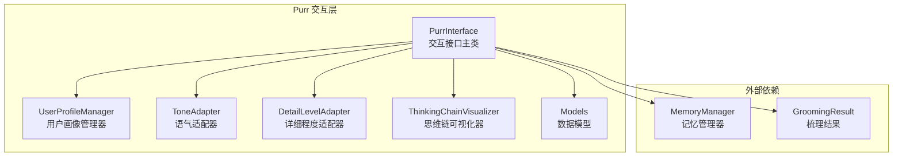
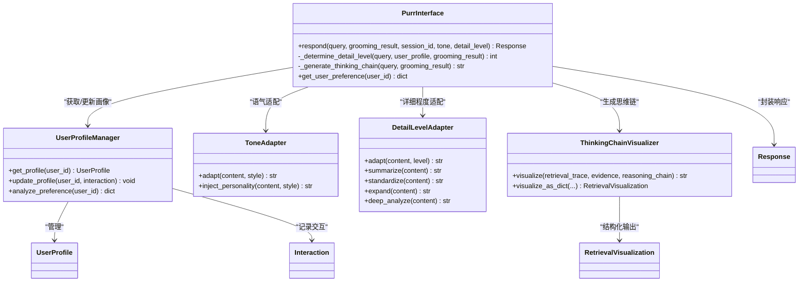
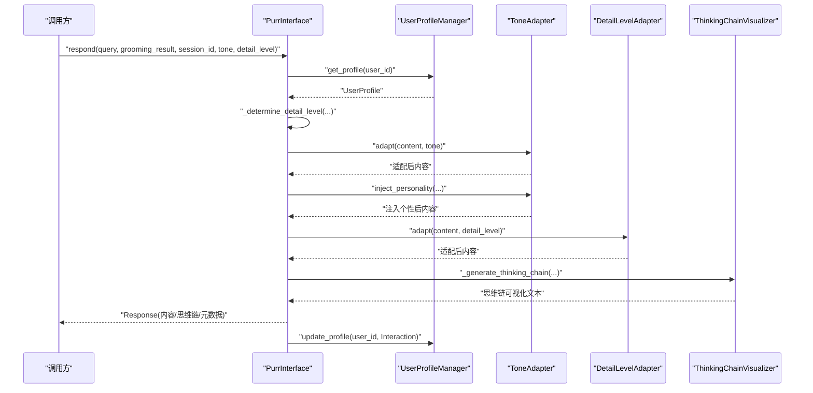
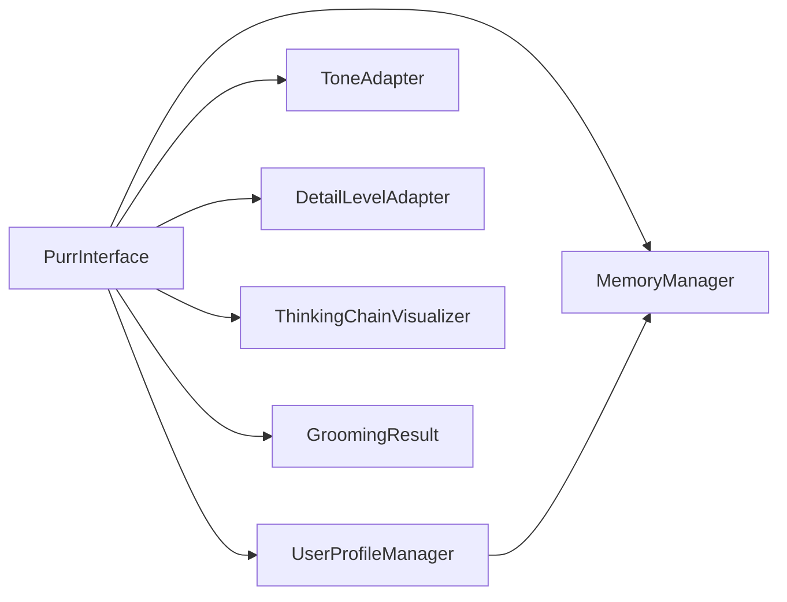

# Purr Interface 主接口

<cite>
**本文引用的文件**
- [interface.py](file://src/purr/interface.py)
- [models.py](file://src/purr/models.py)
- [profile_manager.py](file://src/purr/profile_manager.py)
- [tone_adapter.py](file://src/purr/tone_adapter.py)
- [detail_adapter.py](file://src/purr/detail_adapter.py)
- [visualizer.py](file://src/purr/visualizer.py)
- [README.md](file://src/purr/README.md)
- [__init__.py](file://src/purr/__init__.py)
- [example_usage.py](file://example/example_usage.py)
- [manager.py](file://src/memory/manager.py)
- [models.py](file://src/grooming/models.py)
- [server.py](file://src/dashboard/server.py)
</cite>

## 目录
1. [简介](#简介)
2. [项目结构](#项目结构)
3. [核心组件](#核心组件)
4. [架构总览](#架构总览)
5. [详细组件分析](#详细组件分析)
6. [依赖分析](#依赖分析)
7. [性能考量](#性能考量)
8. [故障排查指南](#故障排查指南)
9. [结论](#结论)
10. [附录](#附录)

## 简介
本文件为 Purr Interface（呼噜交互接口）主接口模块的详细技术文档。该模块位于 NecoRAG 的交互层，负责情境自适应生成与可解释性输出，提供人性化、可解释、可定制的对话式交互体验。其核心职责包括：
- 基于用户画像与查询复杂度进行语气与详细程度的自适应适配
- 将梳理阶段的结果（如答案、置信度、引用证据等）转化为最终响应
- 生成“思维链可视化”，帮助用户理解 AI 的检索路径、证据来源与推理过程
- 与记忆层、梳理层及其他模块协同工作，形成端到端的问答闭环

## 项目结构
Purr Interface 所在的 src/purr 目录包含以下关键文件：
- interface.py：交互接口主类，协调各子组件并生成最终响应
- models.py：定义用户画像、交互记录、响应、可视化等数据模型
- profile_manager.py：用户画像管理器，负责画像的获取、更新与偏好分析
- tone_adapter.py：语气适配器，将内容按风格（正式/友好/幽默）进行适配
- detail_adapter.py：详细程度适配器，按层级（摘要/标准/详细/深度）调整输出
- visualizer.py：思维链可视化器，生成可解释性输出文本
- README.md：模块概述与使用说明
- __init__.py：模块导出入口

**图表来源**
- [interface.py:16-132](file://src/purr/interface.py#L16-L132)
- [profile_manager.py:10-165](file://src/purr/profile_manager.py#L10-L165)
- [tone_adapter.py:8-138](file://src/purr/tone_adapter.py#L8-L138)
- [detail_adapter.py:8-202](file://src/purr/detail_adapter.py#L8-L202)
- [visualizer.py:9-150](file://src/purr/visualizer.py#L9-L150)
- [models.py:10-53](file://src/purr/models.py#L10-L53)
- [manager.py:16-186](file://src/memory/manager.py#L16-L186)
- [models.py:38-47](file://src/grooming/models.py#L38-L47)

**章节来源**
- [README.md:1-398](file://src/purr/README.md#L1-L398)
- [__init__.py:1-23](file://src/purr/__init__.py#L1-L23)

## 核心组件
- PurrInterface：交互接口主类，负责接收查询与梳理结果，结合用户画像与上下文，调用各适配器与可视化器生成最终响应，并更新用户画像。
- UserProfileManager：管理用户画像，提供画像获取、更新与偏好分析能力；与工作记忆交互以持久化用户状态。
- ToneAdapter：根据指定风格对内容进行语气适配与个性化注入，支持正式、友好、幽默三种风格。
- DetailLevelAdapter：按层级对内容进行压缩、标准化、扩展与深度分析，支持 1-4 级别。
- ThinkingChainVisualizer：生成可解释性输出，包含检索路径、证据来源与推理过程三部分。
- 数据模型：UserProfile、Interaction、Response、RetrievalVisualization 等，定义交互层的数据契约。

**章节来源**
- [interface.py:16-132](file://src/purr/interface.py#L16-L132)
- [profile_manager.py:10-165](file://src/purr/profile_manager.py#L10-L165)
- [tone_adapter.py:8-138](file://src/purr/tone_adapter.py#L8-L138)
- [detail_adapter.py:8-202](file://src/purr/detail_adapter.py#L8-L202)
- [visualizer.py:9-150](file://src/purr/visualizer.py#L9-L150)
- [models.py:10-53](file://src/purr/models.py#L10-L53)

## 架构总览
Purr Interface 的工作流遵循“输入 → 画像与上下文 → 适配 → 可解释性输出 → 响应”的闭环设计。下图展示了模块内部组件及其交互关系：

**图表来源**
- [interface.py:16-132](file://src/purr/interface.py#L16-L132)
- [profile_manager.py:10-165](file://src/purr/profile_manager.py#L10-L165)
- [tone_adapter.py:8-138](file://src/purr/tone_adapter.py#L8-L138)
- [detail_adapter.py:8-202](file://src/purr/detail_adapter.py#L8-L202)
- [visualizer.py:9-150](file://src/purr/visualizer.py#L9-L150)
- [models.py:10-53](file://src/purr/models.py#L10-L53)

## 详细组件分析

### PurrInterface：交互接口主类
- 职责
  - 接收查询与梳理结果，结合用户画像与上下文，决定语气与详细程度
  - 调用语气适配器与详细程度适配器进行内容转换
  - 生成思维链可视化，构建响应对象并更新用户画像
- 关键方法
  - respond：主流程入口，负责画像获取、风格与详细程度确定、内容适配、思维链生成、响应封装与画像更新
  - _determine_detail_level：基于用户专业水平与梳理迭代次数综合判定详细程度
  - _generate_thinking_chain：构建检索路径、证据来源与推理过程的可视化文本
  - get_user_preference：分析用户偏好（关键词、交互风格、专业水平等）
- 错误处理
  - tone 与 detail_level 为空时回退至用户画像或默认值
  - 未找到用户画像时创建默认画像
- 性能特性
  - 适配与可视化均为纯文本处理，开销极低，满足毫秒级响应目标

**图表来源**
- [interface.py:55-132](file://src/purr/interface.py#L55-L132)
- [profile_manager.py:41-100](file://src/purr/profile_manager.py#L41-L100)
- [tone_adapter.py:49-109](file://src/purr/tone_adapter.py#L49-L109)
- [detail_adapter.py:28-56](file://src/purr/detail_adapter.py#L28-L56)
- [visualizer.py:37-71](file://src/purr/visualizer.py#L37-L71)

**章节来源**
- [interface.py:16-132](file://src/purr/interface.py#L16-L132)

### UserProfileManager：用户画像管理器
- 职责
  - 从工作记忆获取/创建用户画像，维护画像缓存
  - 更新交互历史与时间戳，支持偏好分析
- 关键方法
  - get_profile：从缓存或工作记忆加载画像，不存在则创建默认画像
  - update_profile：追加查询历史、限制最大长度、更新时间戳
  - analyze_preference：统计关键词、交互风格与专业水平
- 设计要点
  - 通过 working_memory.add_context 与工作记忆同步，实现跨会话持久化
  - 支持最大历史条数限制，避免内存膨胀

**章节来源**
- [profile_manager.py:10-165](file://src/purr/profile_manager.py#L10-L165)

### ToneAdapter：语气适配器
- 职责
  - 将原始内容按风格（正式/友好/幽默）进行语气适配
  - 注入个性化连接词与前后缀，增强表达的一致性与亲和力
- 关键方法
  - adapt：添加前缀/后缀，必要时移除表情符号
  - inject_personality：在段落间注入连接词，提升可读性
- 设计要点
  - 模板化风格配置，便于扩展更多风格
  - emoji 移除采用 Unicode 范围过滤，保证兼容性

**章节来源**
- [tone_adapter.py:8-138](file://src/purr/tone_adapter.py#L8-L138)

### DetailLevelAdapter：详细程度适配器
- 职责
  - 将内容按层级（1-4）进行压缩、标准化、扩展与深度分析
- 关键方法
  - adapt：根据 level 调用对应策略
  - summarize/standardize/expand/deep_analyze：不同层级的输出形态
- 设计要点
  - 1 级别：最小实现为提取首句
  - 2 级别：在摘要基础上提取要点
  - 3 级别：添加示例标记的段落扩展
  - 4 级别：报告框架化输出
  - 支持自动调整开关

**章节来源**
- [detail_adapter.py:8-202](file://src/purr/detail_adapter.py#L8-L202)

### ThinkingChainVisualizer：思维链可视化器
- 职责
  - 生成可解释性输出，包含检索路径、证据来源与推理过程
- 关键方法
  - visualize：按配置显示/隐藏各部分
  - _visualize_trace/_visualize_evidence/_visualize_reasoning：分别渲染三部分
  - visualize_as_dict：生成结构化可视化对象
- 设计要点
  - 可配置显示开关，便于在不同场景下权衡可解释性与简洁性
  - 证据来源最多展示前若干条，避免冗长

**章节来源**
- [visualizer.py:9-150](file://src/purr/visualizer.py#L9-L150)

### 数据模型：交互层契约
- UserProfile：用户画像，包含专业水平、交互风格、偏好领域、查询历史与元数据
- Interaction：交互记录，包含查询、响应、满意度与时间戳
- Response：响应对象，包含内容、思维链、语气、详细程度、引用与元数据
- RetrievalVisualization：结构化可视化对象，便于前端渲染或进一步处理

**章节来源**
- [models.py:10-53](file://src/purr/models.py#L10-L53)

## 依赖分析
- 内部依赖
  - PurrInterface 依赖 UserProfileManager、ToneAdapter、DetailLevelAdapter、ThinkingChainVisualizer 与数据模型
  - UserProfileManager 依赖工作记忆（WorkingMemory）以持久化用户画像
- 外部依赖
  - MemoryManager：提供工作记忆接口，供 UserProfileManager 读写上下文
  - GroomingResult：由梳理层提供，包含答案、置信度、引用证据与迭代次数等
- 潜在耦合
  - PurrInterface 对 GroomingResult 的字段存在直接依赖，建议在后续版本中引入更严格的契约或适配层，以降低耦合度

**图表来源**
- [interface.py:47-50](file://src/purr/interface.py#L47-L50)
- [profile_manager.py:34-36](file://src/purr/profile_manager.py#L34-L36)
- [manager.py:16-46](file://src/memory/manager.py#L16-L46)
- [models.py:38-47](file://src/grooming/models.py#L38-L47)

**章节来源**
- [interface.py:47-50](file://src/purr/interface.py#L47-L50)
- [profile_manager.py:34-36](file://src/purr/profile_manager.py#L34-L36)
- [manager.py:16-46](file://src/memory/manager.py#L16-L46)
- [models.py:38-47](file://src/grooming/models.py#L38-L47)

## 性能考量
- 响应延迟目标：适配与可视化均为纯文本处理，目标延迟小于 200ms
- 画像缓存：UserProfileManager 内置缓存，减少重复读取工作记忆的开销
- 历史长度限制：限制查询历史条数，避免长期运行导致内存膨胀
- 可解释性输出：可视化器支持按需显示，可通过配置关闭不必要部分以降低输出体积
- 扩展建议
  - 为 ToneAdapter 与 DetailLevelAdapter 引入缓存策略，针对相同输入复用结果
  - 将 emoji 移除与连接词注入改为正则或规则引擎，提升可维护性与性能

[本节为通用性能讨论，无需具体文件来源]

## 故障排查指南
- 无法获取用户画像
  - 检查工作记忆是否可用，确认 working_memory.get_context 与 add_context 的调用路径
  - 确认 session_id 是否正确传递，若为空则回退为匿名用户
- 语气或详细程度未生效
  - 检查 tone 与 detail_level 参数是否传入，否则将回退至用户画像或默认值
  - 确认 ToneAdapter 与 DetailLevelAdapter 的风格/层级配置是否正确
- 思维链可视化为空
  - 检查 ThinkingChainVisualizer 的显示开关配置
  - 确认 _generate_thinking_chain 中的输入参数（检索路径、证据、推理链条）是否为空
- 响应内容异常
  - 检查 GroomingResult 的字段完整性（答案、置信度、引用证据、迭代次数）
  - 确认 adapt/inject_personality/summarize/standardize 等方法的输入文本格式

**章节来源**
- [profile_manager.py:41-100](file://src/purr/profile_manager.py#L41-L100)
- [interface.py:76-132](file://src/purr/interface.py#L76-L132)
- [visualizer.py:37-71](file://src/purr/visualizer.py#L37-L71)

## 结论
Purr Interface 通过“情境自适应 + 可解释性输出”的设计，实现了从梳理结果到用户友好响应的高质量转换。其模块化架构清晰、职责明确，具备良好的扩展性与可维护性。建议在后续版本中进一步解耦与抽象，以支持更丰富的风格与层级策略，并增强对多语言与情感计算的支持。

[本节为总结性内容，无需具体文件来源]

## 附录

### API 使用示例与最佳实践
- 完整工作流示例
  - 参考示例脚本，展示从感知层到交互层的完整调用链
  - 包含 Whiskers 编码、Memory 存储与检索、Grooming 梳理、Purr 交互响应的端到端流程
- 最佳实践
  - 明确 session_id 与 tone/description_level 的传递策略，确保个性化体验
  - 合理配置 ThinkingChainVisualizer 的显示开关，平衡可解释性与简洁性
  - 定期清理与归档低价值记忆，保持系统性能稳定

**章节来源**
- [example_usage.py:176-216](file://example/example_usage.py#L176-L216)
- [README.md:293-321](file://src/purr/README.md#L293-L321)

### 与仪表盘与配置管理的集成
- Dashboard 提供 REST API 与 Web UI，可用于管理配置与监控统计
- Purr 模块参数可在仪表盘中进行可视化配置与实时更新
- 建议在生产环境中通过仪表盘统一管理各模块参数，确保一致性与可观测性

**章节来源**
- [server.py:43-253](file://src/dashboard/server.py#L43-L253)
- [README.md:347-375](file://src/purr/README.md#L347-L375)