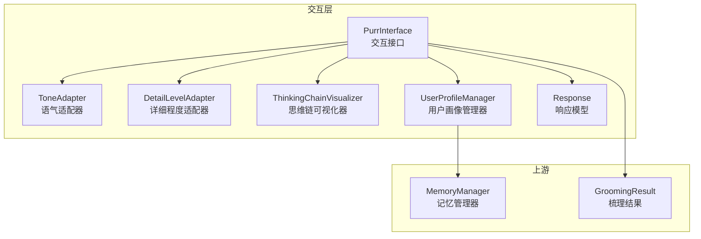
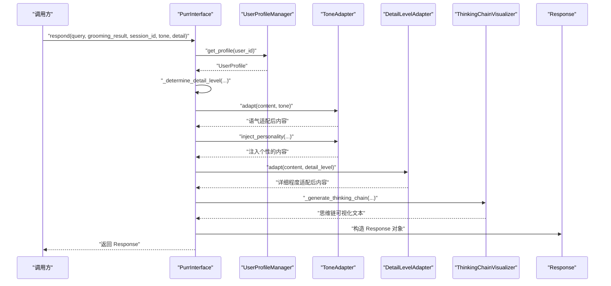
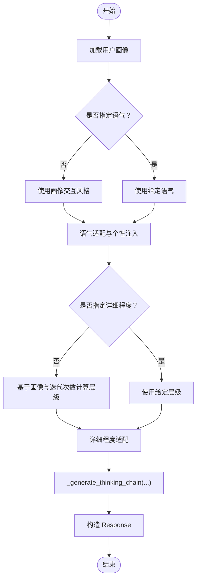
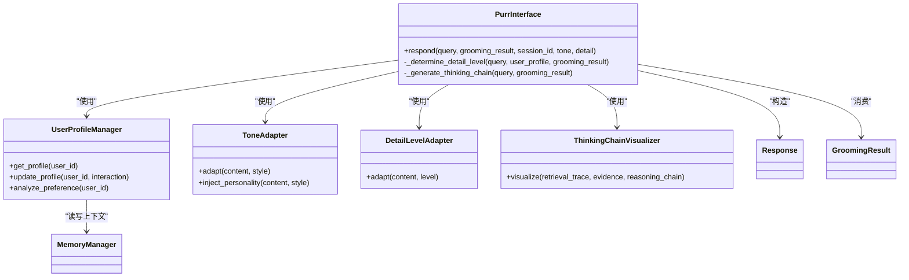

# 多模态合成器

<cite>
**本文引用的文件**
- [src/purr/interface.py](file://src/purr/interface.py)
- [src/purr/tone_adapter.py](file://src/purr/tone_adapter.py)
- [src/purr/detail_adapter.py](file://src/purr/detail_adapter.py)
- [src/purr/visualizer.py](file://src/purr/visualizer.py)
- [src/purr/profile_manager.py](file://src/purr/profile_manager.py)
- [src/purr/models.py](file://src/purr/models.py)
- [src/grooming/models.py](file://src/grooming/models.py)
- [src/memory/manager.py](file://src/memory/manager.py)
- [example/example_usage.py](file://example/example_usage.py)
- [src/purr/README.md](file://src/purr/README.md)
</cite>

## 目录
1. [简介](#简介)
2. [项目结构](#项目结构)
3. [核心组件](#核心组件)
4. [架构总览](#架构总览)
5. [详细组件分析](#详细组件分析)
6. [依赖关系分析](#依赖关系分析)
7. [性能考量](#性能考量)
8. [故障排查指南](#故障排查指南)
9. [结论](#结论)
10. [附录](#附录)

## 简介
本文件面向“多模态合成器”模块，系统阐述其在 NecoRAG 交互层中的定位与职责，重点覆盖以下方面：
- 多模态输出生成的架构设计与实现策略
- 文本输出、图表生成、语音合成三类输出形式的生成算法与质量控制机制
- 数据格式转换、多媒体内容整合与输出质量优化策略
- 集成示例与第三方服务对接方案
- 如何实现高质量的多模态交互体验

说明：当前仓库中“多模态合成器”的具体实现以“文本输出”为主；“图表生成”和“语音合成”在现有代码中为概念性预留与接口定义，尚未提供完整实现。本文将基于现有代码进行严谨分析，并给出可落地的扩展建议。

## 项目结构
围绕多模态合成器的关键文件组织如下：
- 交互层入口与适配器：PurrInterface、ToneAdapter、DetailLevelAdapter、ThinkingChainVisualizer、UserProfileManager、Response 数据模型
- 上游输入：GroomingAgent 的 GroomingResult（包含答案、置信度、引用等）
- 记忆层支撑：MemoryManager（工作记忆用于用户画像持久化）

**图表来源**
- [src/purr/interface.py:16-132](file://src/purr/interface.py#L16-L132)
- [src/purr/tone_adapter.py:8-137](file://src/purr/tone_adapter.py#L8-L137)
- [src/purr/detail_adapter.py:8-201](file://src/purr/detail_adapter.py#L8-L201)
- [src/purr/visualizer.py:9-149](file://src/purr/visualizer.py#L9-L149)
- [src/purr/profile_manager.py:10-164](file://src/purr/profile_manager.py#L10-L164)
- [src/purr/models.py:10-53](file://src/purr/models.py#L10-L53)
- [src/grooming/models.py:38-47](file://src/grooming/models.py#L38-L47)
- [src/memory/manager.py:16-186](file://src/memory/manager.py#L16-L186)

**章节来源**
- [src/purr/interface.py:16-132](file://src/purr/interface.py#L16-L132)
- [src/purr/README.md:1-46](file://src/purr/README.md#L1-L46)

## 核心组件
- PurrInterface：交互接口主类，负责接收 GroomingResult，结合用户画像与偏好，进行语气与详细程度适配，并生成思维链可视化与最终响应。
- ToneAdapter：语气适配器，支持“专业严谨/亲切友好/幽默轻松”三种风格，注入个性化连接词与前后缀，必要时移除表情符号。
- DetailLevelAdapter：详细程度适配器，支持四个层级（简洁摘要/标准回答/详细解释/深度分析），按用户画像与查询复杂度动态调整。
- ThinkingChainVisualizer：思维链可视化器，将检索路径、证据来源与推理过程结构化输出，便于可解释性展示。
- UserProfileManager：用户画像管理器，从工作记忆加载/更新用户画像，分析交互偏好，支持画像缓存与 TTL 控制。
- Response/GroomingResult：数据模型，承载最终响应内容、思维链、元数据与梳理结果的置信度、迭代次数、引用等。

**章节来源**
- [src/purr/interface.py:16-132](file://src/purr/interface.py#L16-L132)
- [src/purr/tone_adapter.py:8-137](file://src/purr/tone_adapter.py#L8-L137)
- [src/purr/detail_adapter.py:8-201](file://src/purr/detail_adapter.py#L8-L201)
- [src/purr/visualizer.py:9-149](file://src/purr/visualizer.py#L9-L149)
- [src/purr/profile_manager.py:10-164](file://src/purr/profile_manager.py#L10-L164)
- [src/purr/models.py:10-53](file://src/purr/models.py#L10-L53)
- [src/grooming/models.py:38-47](file://src/grooming/models.py#L38-L47)

## 架构总览
下图展示了从“梳理结果”到“多模态输出”的端到端流程，当前实现聚焦文本输出与可解释性可视化；图表生成与语音合成作为后续扩展点。

**图表来源**
- [src/purr/interface.py:55-132](file://src/purr/interface.py#L55-L132)
- [src/purr/tone_adapter.py:49-109](file://src/purr/tone_adapter.py#L49-L109)
- [src/purr/detail_adapter.py:28-55](file://src/purr/detail_adapter.py#L28-L55)
- [src/purr/visualizer.py:167-211](file://src/purr/visualizer.py#L167-L211)
- [src/purr/models.py:34-44](file://src/purr/models.py#L34-L44)

## 详细组件分析

### 文本输出生成与质量控制
- 输入：GroomingResult（answer、citations、confidence、iterations 等）
- 适配流程：
  - 语气适配：根据用户画像与显式参数选择风格，注入连接词与前后缀，必要时移除表情符号
  - 详细程度适配：依据用户专业水平与查询复杂度（迭代次数）确定层级，逐级展开
  - 思维链可视化：将检索路径、证据来源与推理过程结构化输出，增强可解释性
- 输出：Response（content、thinking_chain、tone、detail_level、citations、metadata）

**图表来源**
- [src/purr/interface.py:76-132](file://src/purr/interface.py#L76-L132)
- [src/purr/tone_adapter.py:49-109](file://src/purr/tone_adapter.py#L49-L109)
- [src/purr/detail_adapter.py:134-165](file://src/purr/detail_adapter.py#L134-L165)
- [src/purr/visualizer.py:167-211](file://src/purr/visualizer.py#L167-L211)
- [src/purr/models.py:34-44](file://src/purr/models.py#L34-L44)

**章节来源**
- [src/purr/interface.py:55-132](file://src/purr/interface.py#L55-L132)
- [src/purr/tone_adapter.py:8-137](file://src/purr/tone_adapter.py#L8-L137)
- [src/purr/detail_adapter.py:8-201](file://src/purr/detail_adapter.py#L8-L201)
- [src/purr/visualizer.py:9-149](file://src/purr/visualizer.py#L9-L149)
- [src/purr/models.py:10-53](file://src/purr/models.py#L10-L53)

### 图表生成（概念与扩展建议）
- 当前状态：在交互层文档中明确“图表生成”为多模态合成的重要组成部分，但未提供具体实现。
- 建议方案：
  - 数据准备：从 GroomingResult 中抽取可用于可视化的结构化数据（如统计分布、关系图谱节点与边）
  - 可视化引擎：可选方案包括基于 Python 的 Matplotlib/Seaborn/Plotly 或前端图表库（如 ECharts）
  - 输出格式：PNG/JPEG/WebP（位图）或 SVG（矢量），满足不同场景清晰度与体积要求
  - 质量控制：统一尺寸、分辨率、配色与字体；提供多分辨率适配与错误兜底
- 集成位置：在 PurrInterface 的“多模态合成”阶段插入图表生成步骤，返回二进制字节流与元数据

[本节为概念性扩展说明，不直接分析具体文件，故不附加“章节来源”]

### 语音合成（概念与扩展建议）
- 当前状态：在交互层文档中明确“语音合成”为多模态合成的重要组成部分，但未提供具体实现。
- 建议方案：
  - TTS 引擎：本地部署（如 VITS、FastSpeech2）或云端服务（如百度、腾讯、阿里、Azure、OpenAI TTS）
  - 音色与语速：结合用户画像（交互风格、专业水平）动态调整音色与语速
  - 输出格式：WAV/MP3/Ogg，考虑压缩比与延迟
  - 质量控制：去噪、回音消除、端点检测；提供多说话人与情感合成能力
- 集成位置：在 PurrInterface 的“多模态合成”阶段插入 TTS 步骤，返回音频二进制与元数据

[本节为概念性扩展说明，不直接分析具体文件，故不附加“章节来源”]

### 数据格式转换与多媒体整合
- 文本到图表：将结构化数据映射为图表类型（柱状/折线/饼图/关系图），生成静态图片或交互式 HTML
- 文本到语音：将纯文本经语音合成转为音频流，支持多语言与方言
- 多媒体整合：在 Response 中扩展字段（如 media_attachments、media_metadata），统一序列化为 JSON/Protobuf
- 质量优化：对图片进行压缩与尺寸裁剪；对音频进行码率与采样率优化；对视频进行帧率与分辨率调节

[本节为通用实践说明，不直接分析具体文件，故不附加“章节来源”]

### 输出质量优化策略
- 语气一致性：基于用户画像与历史交互，保持长期一致的表达风格
- 详细程度平衡：避免过度冗长或过于简略，结合查询复杂度与用户画像动态调整
- 可解释性优先：思维链可视化必须与回答内容强关联，确保用户可理解推理路径
- 错误与边界处理：对空内容、超长文本、异常表情符号进行安全处理与降级输出
- 性能与可用性：对用户画像与可视化进行缓存与异步生成，降低端到端延迟

[本节为通用实践说明，不直接分析具体文件，故不附加“章节来源”]

## 依赖关系分析
- PurrInterface 依赖：
  - MemoryManager（工作记忆）用于用户画像的加载与持久化
  - GroomingResult（来自上游梳理模块）作为内容与质量指标来源
  - ToneAdapter、DetailLevelAdapter、ThinkingChainVisualizer 作为适配与可视化工具
- 数据模型：
  - Response 与 GroomingResult 承载交互层与梳理层的数据契约
- 可视化与用户画像：
  - ThinkingChainVisualizer 将检索路径、证据来源与推理过程结构化
  - UserProfileManager 从工作记忆读取/写入用户画像，支持画像 TTL 与历史长度限制

**图表来源**
- [src/purr/interface.py:16-132](file://src/purr/interface.py#L16-L132)
- [src/purr/profile_manager.py:10-164](file://src/purr/profile_manager.py#L10-L164)
- [src/purr/tone_adapter.py:8-137](file://src/purr/tone_adapter.py#L8-L137)
- [src/purr/detail_adapter.py:8-201](file://src/purr/detail_adapter.py#L8-L201)
- [src/purr/visualizer.py:9-149](file://src/purr/visualizer.py#L9-L149)
- [src/purr/models.py:10-53](file://src/purr/models.py#L10-L53)
- [src/grooming/models.py:38-47](file://src/grooming/models.py#L38-L47)
- [src/memory/manager.py:16-186](file://src/memory/manager.py#L16-L186)

**章节来源**
- [src/purr/interface.py:16-132](file://src/purr/interface.py#L16-L132)
- [src/purr/profile_manager.py:10-164](file://src/purr/profile_manager.py#L10-L164)
- [src/purr/models.py:10-53](file://src/purr/models.py#L10-L53)
- [src/grooming/models.py:38-47](file://src/grooming/models.py#L38-L47)
- [src/memory/manager.py:16-186](file://src/memory/manager.py#L16-L186)

## 性能考量
- 延迟控制：交互层适配与可视化应在毫秒级完成，确保端到端响应时间小于 200ms
- 缓存策略：用户画像与思维链可视化可采用内存缓存与 TTL 控制，减少重复计算
- 异步化：图表生成与语音合成可异步执行，先返回文本与可解释性内容，再推送多媒体附件
- 资源隔离：TTS 与图表渲染建议独立进程/线程池，避免阻塞主线程
- 质量与体积权衡：对图片与音频进行压缩与格式优化，兼顾清晰度与传输效率

[本节提供通用指导，不直接分析具体文件，故不附加“章节来源”]

## 故障排查指南
- 语气适配异常
  - 症状：输出缺少个性或表情过多
  - 排查：检查 ToneAdapter 的风格模板与表情过滤开关
- 详细程度不匹配
  - 症状：专家用户看到冗长内容，初学者看到过于简略
  - 排查：核对 _determine_detail_level 的画像映射与迭代次数阈值
- 思维链为空
  - 症状：thinking_chain 为空字符串
  - 排查：确认 _generate_thinking_chain 的输入参数与可视化器开关
- 用户画像未更新
  - 症状：风格与偏好未随交互变化
  - 排查：检查 UserProfileManager 的更新逻辑与工作记忆上下文写入
- 性能瓶颈
  - 症状：响应延迟上升
  - 排查：开启缓存、异步化非关键步骤、监控可视化与适配耗时

**章节来源**
- [src/purr/tone_adapter.py:111-137](file://src/purr/tone_adapter.py#L111-L137)
- [src/purr/detail_adapter.py:134-165](file://src/purr/detail_adapter.py#L134-L165)
- [src/purr/visualizer.py:167-211](file://src/purr/visualizer.py#L167-L211)
- [src/purr/profile_manager.py:69-99](file://src/purr/profile_manager.py#L69-L99)

## 结论
- 多模态合成器在当前版本以“文本输出 + 可解释性可视化”为核心，通过语气与详细程度适配实现情境自适应，配合思维链提升可信度与透明度
- “图表生成”与“语音合成”作为后续扩展方向，建议采用模块化接入与质量控制体系，确保与现有交互层无缝衔接
- 通过缓存、异步化与资源隔离等手段，可在保证质量的同时优化端到端性能

[本节为总结性内容，不直接分析具体文件，故不附加“章节来源”]

## 附录

### 集成示例与第三方服务对接
- 完整工作流示例（文本输出 + 可解释性可视化）
  - 参考：[example/example_usage.py:176-215](file://example/example_usage.py#L176-L215)
  - 流程：Whiskers → Memory → Retriever → Grooming → Purr（文本输出 + 思维链）
- 第三方服务对接建议
  - 图表生成：使用本地 Matplotlib/Plotly 或云端图表服务，返回 PNG/SVG
  - 语音合成：接入百度/阿里/腾讯云 TTS，或本地 VITS/FastSpeech2，返回 WAV/MP3
  - 注意：在 PurrInterface 的“多模态合成”阶段插入上述步骤，统一在 Response 中扩展多媒体字段

**章节来源**
- [example/example_usage.py:176-215](file://example/example_usage.py#L176-L215)
- [src/purr/README.md:197-218](file://src/purr/README.md#L197-L218)