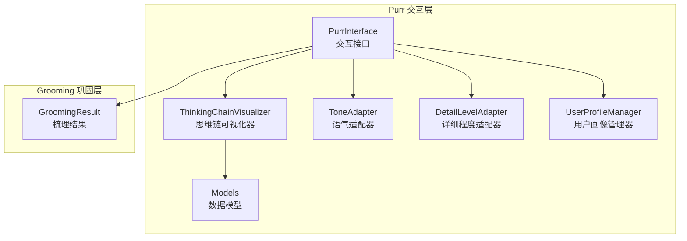
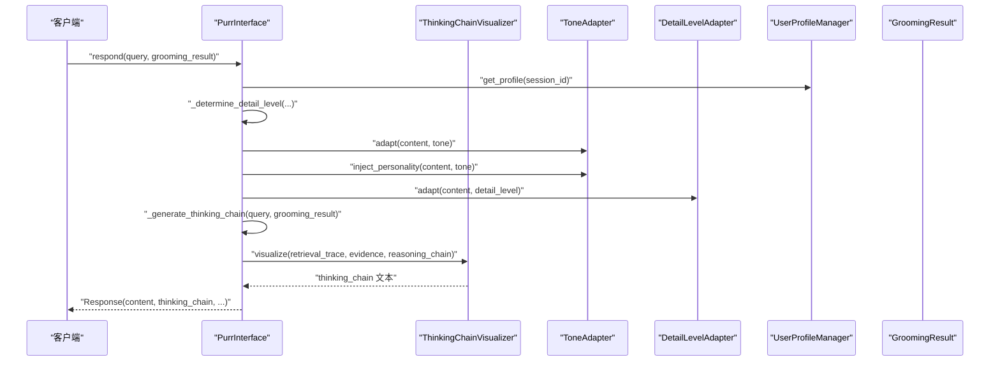
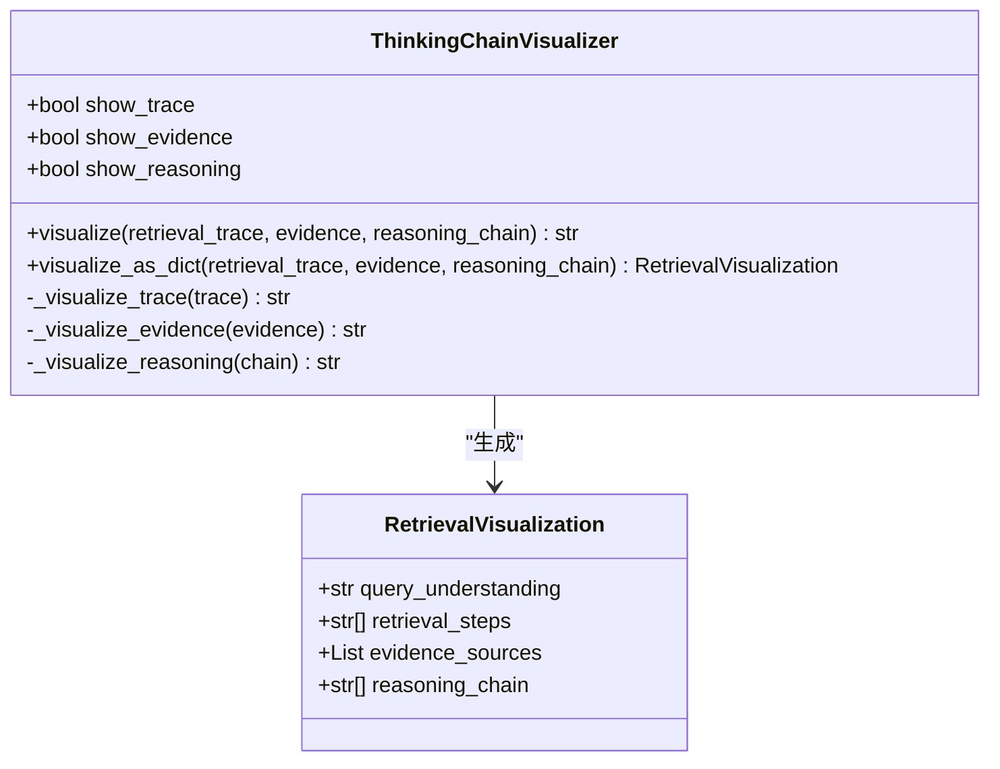
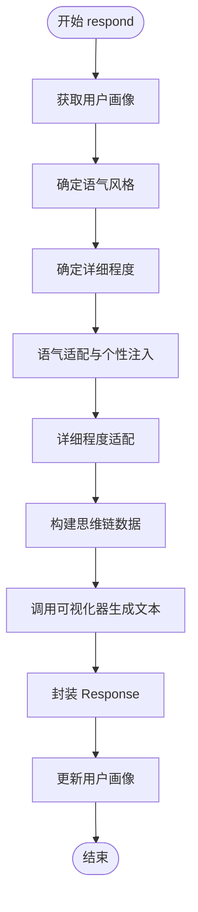
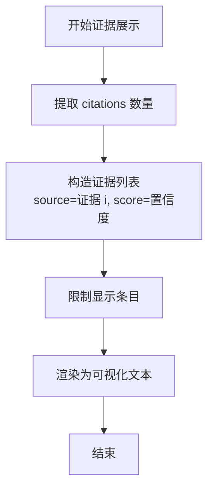
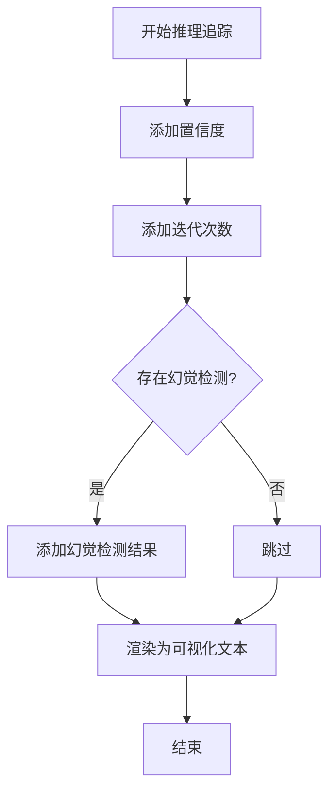
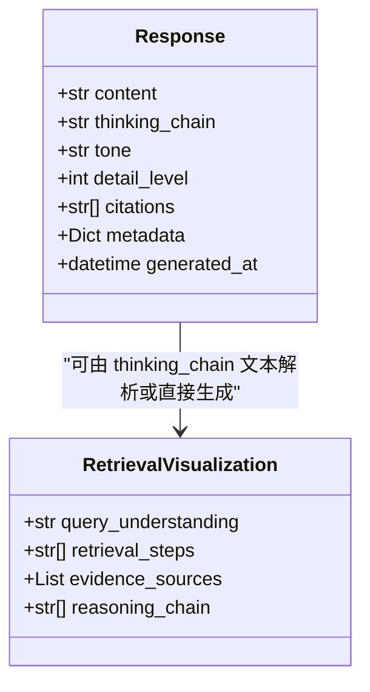
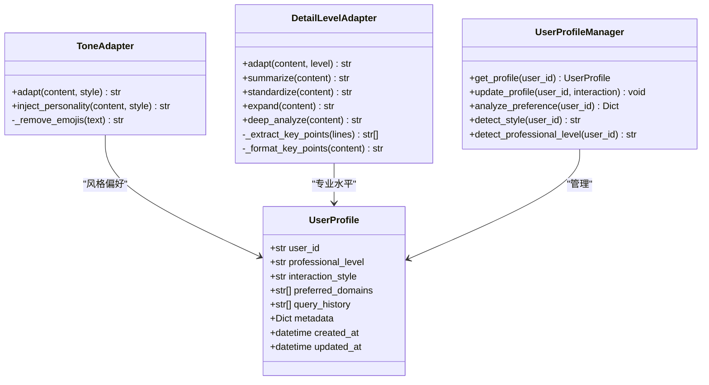
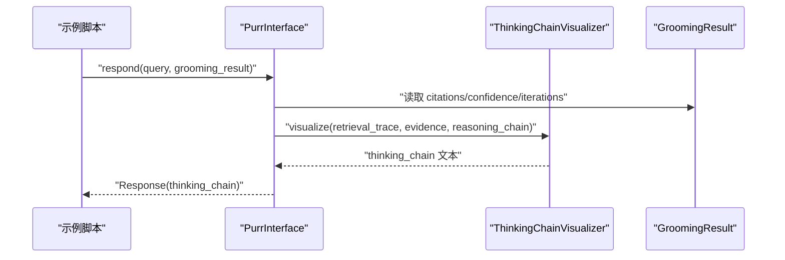
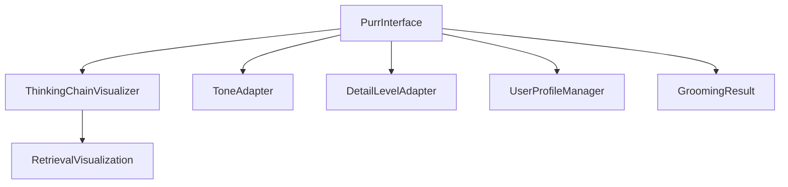

# 思维链可视化器

<cite>
**本文引用的文件**
- [src/purr/visualizer.py](file://src/purr/visualizer.py)
- [src/purr/interface.py](file://src/purr/interface.py)
- [src/purr/models.py](file://src/purr/models.py)
- [src/purr/detail_adapter.py](file://src/purr/detail_adapter.py)
- [src/purr/tone_adapter.py](file://src/purr/tone_adapter.py)
- [src/purr/profile_manager.py](file://src/purr/profile_manager.py)
- [src/grooming/models.py](file://src/grooming/models.py)
- [example/example_usage.py](file://example/example_usage.py)
- [DASHBOARD_GUIDE.md](file://DASHBOARD_GUIDE.md)
</cite>

## 目录
1. [简介](#简介)
2. [项目结构](#项目结构)
3. [核心组件](#核心组件)
4. [架构总览](#架构总览)
5. [组件详解](#组件详解)
6. [依赖关系分析](#依赖关系分析)
7. [性能考量](#性能考量)
8. [故障排查指南](#故障排查指南)
9. [结论](#结论)
10. [附录](#附录)

## 简介
本文件面向“思维链可视化器”模块，系统阐述其可解释性输出的设计理念、实现架构与使用方法。重点覆盖以下方面：
- 检索路径图生成算法：如何从查询到证据与推理过程构建可读的可视化路径
- 证据来源展示机制：证据 ID、相关度与来源标注
- 推理过程追踪系统：置信度、迭代次数与幻觉检测等关键指标
- 可视化输出格式设计：文本结构化输出与结构化对象输出
- 交互式图表生成与用户友好呈现：结合语气适配、详细程度适配与用户画像
- 完整可视化示例与配置选项：如何将复杂的AI推理过程转化为直观易懂的可视化内容

## 项目结构
思维链可视化器位于交互层（Purr）模块，围绕“可解释性输出”目标，与语气适配、详细程度适配、用户画像管理共同协作，形成情境自适应的交互体验。

**图表来源**
- [src/purr/interface.py:16-54](file://src/purr/interface.py#L16-L54)
- [src/purr/visualizer.py:9-36](file://src/purr/visualizer.py#L9-L36)
- [src/purr/models.py:10-53](file://src/purr/models.py#L10-L53)
- [src/grooming/models.py:38-47](file://src/grooming/models.py#L38-L47)

**章节来源**
- [src/purr/interface.py:16-54](file://src/purr/interface.py#L16-L54)
- [src/purr/visualizer.py:9-36](file://src/purr/visualizer.py#L9-L36)
- [src/purr/models.py:10-53](file://src/purr/models.py#L10-L53)
- [src/grooming/models.py:38-47](file://src/grooming/models.py#L38-L47)

## 核心组件
- 思维链可视化器（ThinkingChainVisualizer）：负责将检索路径、证据来源与推理过程三部分整合为可读的可视化文本，并支持结构化对象输出
- 交互接口（PurrInterface）：协调各子组件，生成情境自适应响应与思维链可视化
- 语气适配器（ToneAdapter）：根据用户画像与风格偏好，调整输出语气与连接词
- 详细程度适配器（DetailLevelAdapter）：按用户专业水平与查询复杂度动态调整输出详尽度
- 用户画像管理器（UserProfileManager）：维护用户画像、交互风格与查询历史，驱动情境自适应
- 数据模型（Models）：定义用户画像、交互记录、响应与检索可视化等数据结构

**章节来源**
- [src/purr/visualizer.py:9-36](file://src/purr/visualizer.py#L9-L36)
- [src/purr/interface.py:16-54](file://src/purr/interface.py#L16-L54)
- [src/purr/tone_adapter.py:8-47](file://src/purr/tone_adapter.py#L8-L47)
- [src/purr/detail_adapter.py:8-27](file://src/purr/detail_adapter.py#L8-L27)
- [src/purr/profile_manager.py:10-37](file://src/purr/profile_manager.py#L10-L37)
- [src/purr/models.py:10-53](file://src/purr/models.py#L10-L53)

## 架构总览
思维链可视化器在交互接口中被调用，依据梳理结果（GroomingResult）构建检索路径、证据来源与推理过程三段式可视化，并通过语气与详细程度适配器进行情境化处理。

**图表来源**
- [src/purr/interface.py:55-132](file://src/purr/interface.py#L55-L132)
- [src/purr/interface.py:167-211](file://src/purr/interface.py#L167-L211)
- [src/purr/visualizer.py:37-71](file://src/purr/visualizer.py#L37-L71)
- [src/purr/tone_adapter.py:49-75](file://src/purr/tone_adapter.py#L49-L75)
- [src/purr/detail_adapter.py:28-55](file://src/purr/detail_adapter.py#L28-L55)
- [src/grooming/models.py:38-47](file://src/grooming/models.py#L38-L47)

## 组件详解

### 思维链可视化器（ThinkingChainVisualizer）
- 职责
  - 可视化检索路径：将“查询理解—语义检索—证据发现”等步骤以有序列表形式呈现
  - 可视化证据来源：展示证据 ID 与相关度，限制最多显示条目
  - 可视化推理过程：展示置信度、迭代次数与幻觉检测等关键指标
  - 输出格式：文本串与结构化对象（RetrievalVisualization）
- 关键方法
  - visualize：拼接三部分可视化文本
  - _visualize_trace/_visualize_evidence/_visualize_reasoning：分别渲染对应部分
  - visualize_as_dict：生成结构化对象，便于进一步处理或持久化

**图表来源**
- [src/purr/visualizer.py:9-36](file://src/purr/visualizer.py#L9-L36)
- [src/purr/visualizer.py:37-71](file://src/purr/visualizer.py#L37-L71)
- [src/purr/visualizer.py:127-149](file://src/purr/visualizer.py#L127-L149)
- [src/purr/models.py:46-53](file://src/purr/models.py#L46-L53)

**章节来源**
- [src/purr/visualizer.py:9-36](file://src/purr/visualizer.py#L9-L36)
- [src/purr/visualizer.py:37-71](file://src/purr/visualizer.py#L37-L71)
- [src/purr/visualizer.py:73-125](file://src/purr/visualizer.py#L73-L125)
- [src/purr/visualizer.py:127-149](file://src/purr/visualizer.py#L127-L149)
- [src/purr/models.py:46-53](file://src/purr/models.py#L46-L53)

### 交互接口（PurrInterface）
- 职责
  - 情境自适应生成：根据用户画像与查询复杂度确定语气与详细程度
  - 思维链可视化：基于梳理结果构建检索路径、证据来源与推理过程
  - 用户画像更新：记录交互历史，驱动后续情境适配
- 关键流程
  - respond：生成响应并更新用户画像
  - _determine_detail_level：基于用户专业水平与迭代次数调整详细程度
  - _generate_thinking_chain：组装可视化所需的数据结构

**图表来源**
- [src/purr/interface.py:55-132](file://src/purr/interface.py#L55-L132)
- [src/purr/interface.py:134-165](file://src/purr/interface.py#L134-L165)
- [src/purr/interface.py:167-211](file://src/purr/interface.py#L167-L211)

**章节来源**
- [src/purr/interface.py:55-132](file://src/purr/interface.py#L55-L132)
- [src/purr/interface.py:134-165](file://src/purr/interface.py#L134-L165)
- [src/purr/interface.py:167-211](file://src/purr/interface.py#L167-L211)

### 证据来源展示机制
- 来源字段：证据 ID（source）、相关度（score）
- 展示策略：最多显示限定条目，避免信息过载
- 数据来源：由梳理结果中的 citations 与置信度生成

**图表来源**
- [src/purr/visualizer.py:90-108](file://src/purr/visualizer.py#L90-L108)
- [src/purr/interface.py:189-193](file://src/purr/interface.py#L189-L193)

**章节来源**
- [src/purr/visualizer.py:90-108](file://src/purr/visualizer.py#L90-L108)
- [src/purr/interface.py:189-193](file://src/purr/interface.py#L189-L193)

### 推理过程追踪系统
- 指标构成：置信度、迭代次数、幻觉检测（可选）
- 展示方式：逐条列出，形成清晰的推理链条

**图表来源**
- [src/purr/visualizer.py:110-125](file://src/purr/visualizer.py#L110-L125)
- [src/purr/interface.py:195-204](file://src/purr/interface.py#L195-L204)

**章节来源**
- [src/purr/visualizer.py:110-125](file://src/purr/visualizer.py#L110-L125)
- [src/purr/interface.py:195-204](file://src/purr/interface.py#L195-L204)

### 可视化输出格式设计
- 文本格式：三段式结构（检索路径/证据来源/推理过程），段落间以空行分隔
- 结构化格式：RetrievalVisualization 对象，便于前端渲染或二次加工

**图表来源**
- [src/purr/models.py:35-44](file://src/purr/models.py#L35-L44)
- [src/purr/models.py:46-53](file://src/purr/models.py#L46-L53)

**章节来源**
- [src/purr/models.py:35-44](file://src/purr/models.py#L35-L44)
- [src/purr/models.py:46-53](file://src/purr/models.py#L46-L53)

### 交互式图表生成与用户友好呈现
- 语气适配：根据用户交互风格（正式/友好/幽默）注入连接词与前后缀，必要时移除表情符号
- 详细程度适配：按用户专业水平与查询复杂度动态调整输出详尽度
- 用户画像：记录查询历史与交互风格，驱动情境自适应

**图表来源**
- [src/purr/tone_adapter.py:8-47](file://src/purr/tone_adapter.py#L8-L47)
- [src/purr/detail_adapter.py:8-55](file://src/purr/detail_adapter.py#L8-L55)
- [src/purr/profile_manager.py:10-37](file://src/purr/profile_manager.py#L10-L37)
- [src/purr/models.py:10-21](file://src/purr/models.py#L10-L21)

**章节来源**
- [src/purr/tone_adapter.py:8-47](file://src/purr/tone_adapter.py#L8-L47)
- [src/purr/detail_adapter.py:8-55](file://src/purr/detail_adapter.py#L8-L55)
- [src/purr/profile_manager.py:10-37](file://src/purr/profile_manager.py#L10-L37)
- [src/purr/models.py:10-21](file://src/purr/models.py#L10-L21)

### 完整可视化示例与配置选项
- 示例流程：从 Whiskers 到 Memory，再到 Retrieval、Grooming，最终由 Purr 生成响应与思维链可视化
- 配置入口：通过 Dashboard 的 Purr 模块参数启用/禁用可视化组件（如是否显示检索路径、证据来源、推理过程）

**图表来源**
- [example/example_usage.py:176-215](file://example/example_usage.py#L176-L215)
- [src/purr/interface.py:167-211](file://src/purr/interface.py#L167-L211)
- [src/purr/visualizer.py:37-71](file://src/purr/visualizer.py#L37-L71)

**章节来源**
- [example/example_usage.py:176-215](file://example/example_usage.py#L176-L215)
- [DASHBOARD_GUIDE.md:140-159](file://DASHBOARD_GUIDE.md#L140-L159)

## 依赖关系分析
- 思维链可视化器依赖数据模型（RetrievalVisualization）与输入数据（检索路径、证据、推理链）
- 交互接口依赖记忆管理器、梳理结果与各适配器，负责编排与调度
- 语气与详细程度适配器独立于可视化器，但共同决定最终输出风格与详尽度
- 用户画像管理器为情境自适应提供基础数据

**图表来源**
- [src/purr/visualizer.py:6-6](file://src/purr/visualizer.py#L6-L6)
- [src/purr/interface.py:5-12](file://src/purr/interface.py#L5-L12)
- [src/purr/models.py:46-53](file://src/purr/models.py#L46-L53)
- [src/grooming/models.py:38-47](file://src/grooming/models.py#L38-L47)

**章节来源**
- [src/purr/visualizer.py:6-6](file://src/purr/visualizer.py#L6-L6)
- [src/purr/interface.py:5-12](file://src/purr/interface.py#L5-L12)
- [src/purr/models.py:46-53](file://src/purr/models.py#L46-L53)
- [src/grooming/models.py:38-47](file://src/grooming/models.py#L38-L47)

## 性能考量
- 可视化文本拼接为 O(n) 操作，其中 n 为段落数；证据来源限制显示条目，避免线性增长带来的渲染压力
- 详细程度适配与语气适配均为轻量字符串处理，对整体性能影响较小
- 用户画像缓存与惰性加载可降低频繁查询成本

## 故障排查指南
- 可视化为空：检查输入参数（检索路径/证据/推理链）是否为空或格式不正确
- 证据来源过多：确认是否启用了证据上限（默认最多显示若干条）
- 语气异常：检查用户画像中的交互风格与语气模板映射
- 详细程度不符预期：核对用户专业水平与查询迭代次数的映射规则

**章节来源**
- [src/purr/visualizer.py:54-71](file://src/purr/visualizer.py#L54-L71)
- [src/purr/visualizer.py:100-108](file://src/purr/visualizer.py#L100-L108)
- [src/purr/interface.py:151-165](file://src/purr/interface.py#L151-L165)

## 结论
思维链可视化器通过“检索路径—证据来源—推理过程”的三段式结构，将复杂的AI推理过程转化为直观易懂的可视化内容。配合语气与详细程度适配、用户画像管理，实现了情境自适应的交互体验。借助结构化对象输出，可进一步拓展到前端可视化图表与仪表盘展示。

## 附录
- 配置选项参考：通过 Dashboard 的 Purr 模块参数启用/禁用可视化组件，或调整默认语气与详细程度
- 使用示例：参考示例脚本中的 Purr 使用流程，观察思维链可视化的输出效果

**章节来源**
- [DASHBOARD_GUIDE.md:140-159](file://DASHBOARD_GUIDE.md#L140-L159)
- [example/example_usage.py:176-215](file://example/example_usage.py#L176-L215)