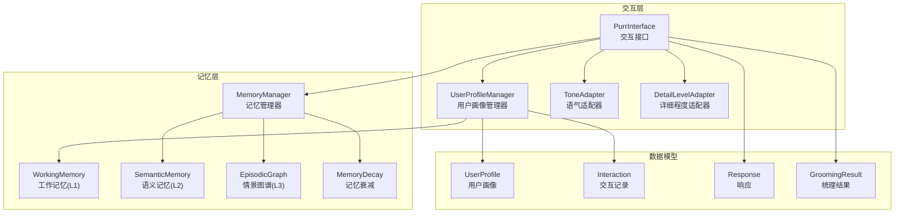
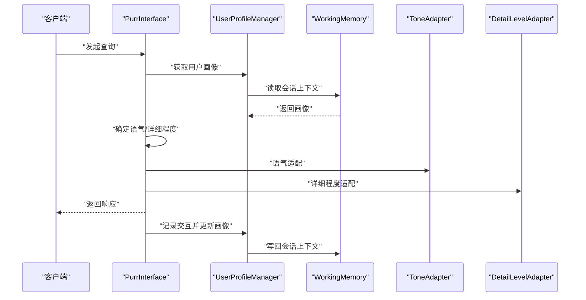
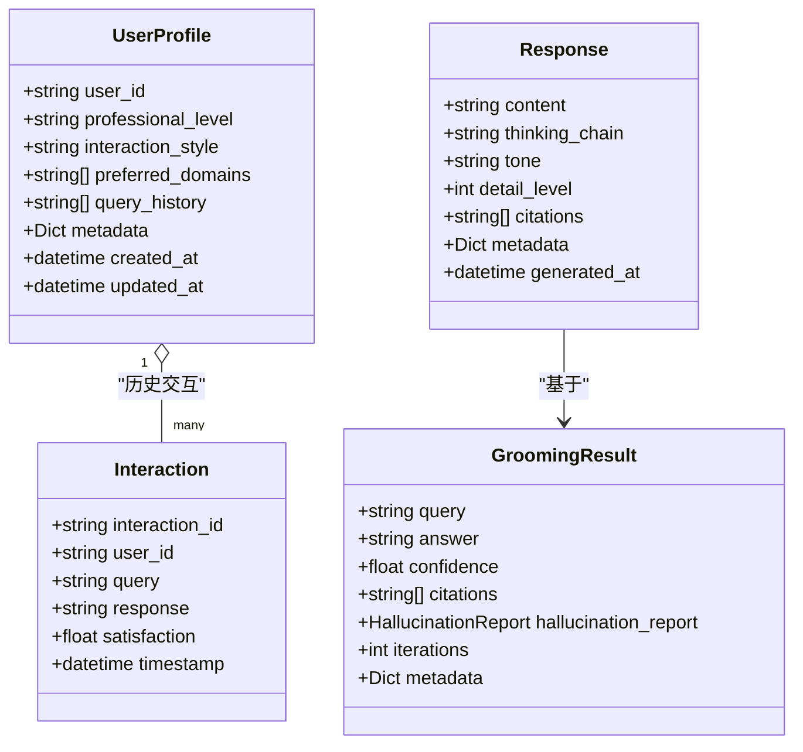
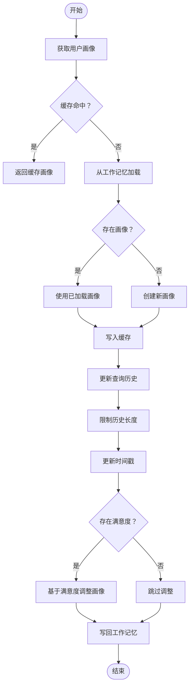
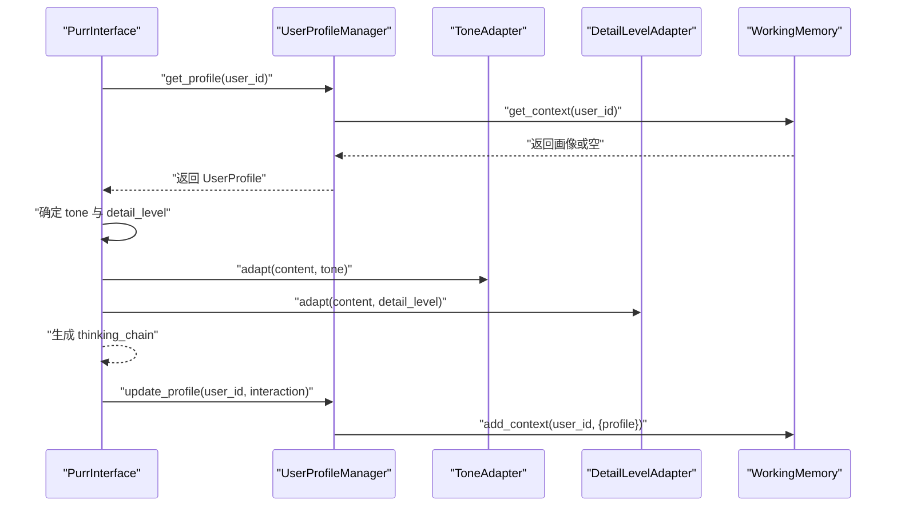
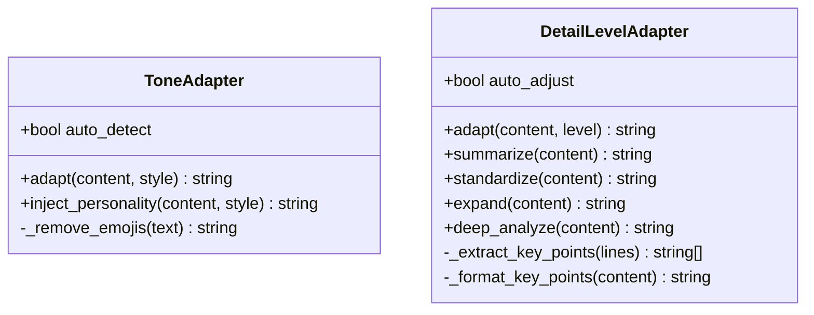
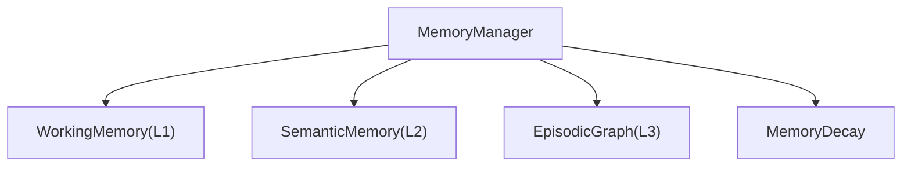
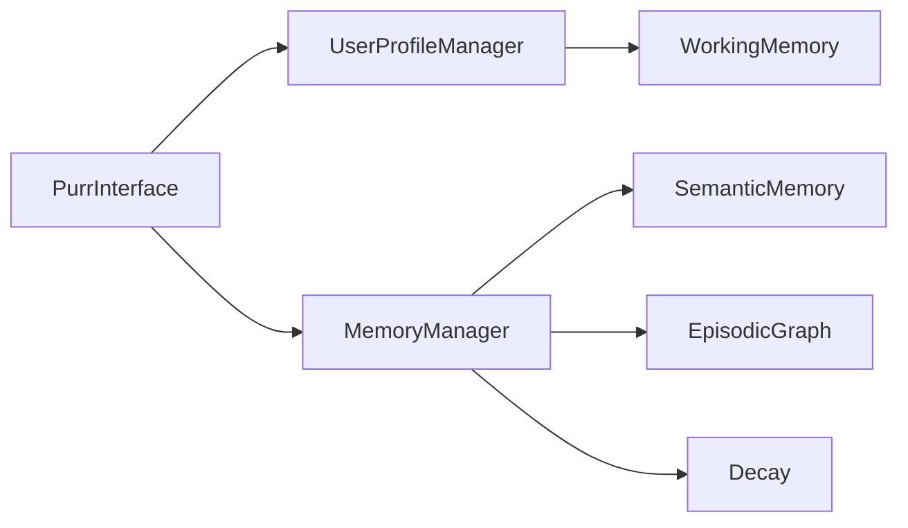

# 用户画像管理器

<cite>
**本文引用的文件**
- [src/purr/profile_manager.py](file://src/purr/profile_manager.py)
- [src/purr/models.py](file://src/purr/models.py)
- [src/purr/interface.py](file://src/purr/interface.py)
- [src/purr/tone_adapter.py](file://src/purr/tone_adapter.py)
- [src/purr/detail_adapter.py](file://src/purr/detail_adapter.py)
- [src/memory/manager.py](file://src/memory/manager.py)
- [src/memory/working_memory.py](file://src/memory/working_memory.py)
- [src/memory/semantic_memory.py](file://src/memory/semantic_memory.py)
- [src/memory/episodic_graph.py](file://src/memory/episodic_graph.py)
- [src/memory/decay.py](file://src/memory/decay.py)
- [src/grooming/models.py](file://src/grooming/models.py)
</cite>

## 目录
1. [简介](#简介)
2. [项目结构](#项目结构)
3. [核心组件](#核心组件)
4. [架构总览](#架构总览)
5. [详细组件分析](#详细组件分析)
6. [依赖关系分析](#依赖关系分析)
7. [性能考虑](#性能考虑)
8. [故障排查指南](#故障排查指南)
9. [结论](#结论)
10. [附录](#附录)

## 简介
本技术文档围绕用户画像管理器模块展开，系统性阐述用户画像的构建、维护与更新机制，覆盖历史交互分析算法、偏好领域识别、专业程度评估等核心能力。同时，文档详细说明画像数据结构设计、缓存策略、隐私保护机制，并提供用户行为分析示例与画像优化策略，解释如何通过机器学习算法持续提升画像准确性。

## 项目结构
用户画像管理器位于 Purr 交互层，与记忆管理器协同工作，形成“上下文感知”的个性化交互闭环。其核心文件包括：
- 用户画像与交互记录的数据模型定义
- 用户画像管理器：负责画像的读取、更新、偏好分析与风格/专业度检测
- 交互接口：在生成响应过程中驱动画像更新与适配
- 语气与详细程度适配器：依据画像风格与专业度进行输出风格化
- 记忆管理器与工作记忆：提供画像持久化与会话上下文存储

**图表来源**
- [src/purr/interface.py:16-54](file://src/purr/interface.py#L16-L54)
- [src/purr/profile_manager.py:10-40](file://src/purr/profile_manager.py#L10-L40)
- [src/memory/manager.py:16-47](file://src/memory/manager.py#L16-L47)
- [src/memory/working_memory.py:11-35](file://src/memory/working_memory.py#L11-L35)
- [src/memory/semantic_memory.py:21-49](file://src/memory/semantic_memory.py#L21-L49)
- [src/memory/episodic_graph.py:10-32](file://src/memory/episodic_graph.py#L10-L32)
- [src/memory/decay.py:11-38](file://src/memory/decay.py#L11-L38)
- [src/purr/models.py:10-44](file://src/purr/models.py#L10-L44)
- [src/grooming/models.py:38-47](file://src/grooming/models.py#L38-L47)

**章节来源**
- [src/purr/interface.py:16-54](file://src/purr/interface.py#L16-L54)
- [src/purr/profile_manager.py:10-40](file://src/purr/profile_manager.py#L10-L40)
- [src/memory/manager.py:16-47](file://src/memory/manager.py#L16-L47)

## 核心组件
- 用户画像数据模型：包含用户标识、专业程度、交互风格、偏好领域、查询历史、元数据及时间戳等字段，用于承载用户特征与行为轨迹。
- 用户画像管理器：负责画像的获取、更新、偏好分析、风格与专业度检测；内置本地缓存与工作记忆集成，确保低延迟与持久化。
- 交互接口：在生成响应时读取/更新用户画像，结合语气与详细程度适配器进行情境化输出，并生成思维链可视化。
- 语气与详细程度适配器：依据画像风格与专业度动态调整输出语气与信息密度，提升用户体验。
- 记忆管理器与工作记忆：提供会话上下文存储与画像持久化，配合记忆衰减机制实现知识巩固与主动遗忘。

**章节来源**
- [src/purr/models.py:10-44](file://src/purr/models.py#L10-L44)
- [src/purr/profile_manager.py:10-165](file://src/purr/profile_manager.py#L10-L165)
- [src/purr/interface.py:16-133](file://src/purr/interface.py#L16-L133)
- [src/purr/tone_adapter.py:8-76](file://src/purr/tone_adapter.py#L8-L76)
- [src/purr/detail_adapter.py:8-157](file://src/purr/detail_adapter.py#L8-L157)
- [src/memory/working_memory.py:11-120](file://src/memory/working_memory.py#L11-L120)
- [src/memory/manager.py:16-186](file://src/memory/manager.py#L16-L186)
- [src/memory/decay.py:11-155](file://src/memory/decay.py#L11-L155)

## 架构总览
用户画像管理器在交互流程中的位置如下：

**图表来源**
- [src/purr/interface.py:55-133](file://src/purr/interface.py#L55-L133)
- [src/purr/profile_manager.py:41-100](file://src/purr/profile_manager.py#L41-L100)
- [src/memory/working_memory.py:36-61](file://src/memory/working_memory.py#L36-L61)
- [src/purr/tone_adapter.py:49-76](file://src/purr/tone_adapter.py#L49-L76)
- [src/purr/detail_adapter.py:28-56](file://src/purr/detail_adapter.py#L28-L56)

## 详细组件分析

### 用户画像数据模型
- 用户画像（UserProfile）：包含用户标识、专业程度（初学者/中级/专家）、交互风格（正式/友好/幽默）、偏好领域列表、查询历史、元数据以及创建/更新时间戳。
- 交互记录（Interaction）：记录每次交互的查询、响应、满意度（0-1）与时间戳。
- 响应（Response）：封装最终输出内容、思维链可视化、语气、详细程度、引用列表与元数据。
- 梳理结果（GroomingResult）：包含查询、答案、置信度、引用列表、迭代次数与可选的幻觉检测报告。

**图表来源**
- [src/purr/models.py:10-44](file://src/purr/models.py#L10-L44)
- [src/grooming/models.py:38-47](file://src/grooming/models.py#L38-L47)

**章节来源**
- [src/purr/models.py:10-44](file://src/purr/models.py#L10-L44)
- [src/grooming/models.py:9-66](file://src/grooming/models.py#L9-L66)

### 用户画像管理器
- 初始化与缓存：持有工作记忆引用与缓存字典，支持画像 TTL 与历史记录上限配置。
- 获取画像：优先从本地缓存命中，否则从工作记忆读取；若不存在则创建新画像并写入缓存。
- 更新画像：追加查询历史、限制历史长度、更新时间戳；预留满意度调整接口；写回工作记忆。
- 偏好分析：统计查询历史中的高频关键词，返回前 N 个关键词、总查询数与当前画像风格/专业度。
- 风格与专业度检测：当前返回画像字段值，后续计划基于历史交互实现自动检测。

**图表来源**
- [src/purr/profile_manager.py:41-100](file://src/purr/profile_manager.py#L41-L100)

**章节来源**
- [src/purr/profile_manager.py:10-165](file://src/purr/profile_manager.py#L10-L165)

### 交互接口与画像更新
- 响应生成：读取用户画像，确定语气与详细程度，进行语气与详细程度适配，生成思维链可视化，封装响应对象。
- 画像更新：构造交互记录，调用管理器更新画像并写回工作记忆。
- 详细程度决策：基于用户专业度映射基础等级，并根据梳理迭代次数进行适度上调。

**图表来源**
- [src/purr/interface.py:55-133](file://src/purr/interface.py#L55-L133)
- [src/purr/profile_manager.py:69-100](file://src/purr/profile_manager.py#L69-L100)
- [src/memory/working_memory.py:36-49](file://src/memory/working_memory.py#L36-L49)

**章节来源**
- [src/purr/interface.py:55-166](file://src/purr/interface.py#L55-L166)

### 语气与详细程度适配器
- 语气适配器：支持正式、友好、幽默三种风格，注入个性化连接词与前后缀，必要时移除表情符号。
- 详细程度适配器：支持 1-4 级别，分别对应简洁摘要、标准回答、详细解释与深度分析，具备最小实现与扩展空间。

**图表来源**
- [src/purr/tone_adapter.py:8-138](file://src/purr/tone_adapter.py#L8-L138)
- [src/purr/detail_adapter.py:8-202](file://src/purr/detail_adapter.py#L8-L202)

**章节来源**
- [src/purr/tone_adapter.py:8-138](file://src/purr/tone_adapter.py#L8-L138)
- [src/purr/detail_adapter.py:8-202](file://src/purr/detail_adapter.py#L8-L202)

### 记忆管理器与工作记忆
- 记忆管理器：统一管理 L1 工作记忆、L2 语义记忆、L3 情景图谱与记忆衰减，提供存储、检索、巩固与主动遗忘能力。
- 工作记忆：模拟 Redis 的低延迟存储，支持 TTL、LRU 与会话上下文管理，用于短期会话与画像缓存。

**图表来源**
- [src/memory/manager.py:16-47](file://src/memory/manager.py#L16-L47)
- [src/memory/working_memory.py:11-35](file://src/memory/working_memory.py#L11-L35)
- [src/memory/semantic_memory.py:21-49](file://src/memory/semantic_memory.py#L21-L49)
- [src/memory/episodic_graph.py:10-32](file://src/memory/episodic_graph.py#L10-L32)
- [src/memory/decay.py:11-38](file://src/memory/decay.py#L11-L38)

**章节来源**
- [src/memory/manager.py:16-186](file://src/memory/manager.py#L16-L186)
- [src/memory/working_memory.py:11-120](file://src/memory/working_memory.py#L11-L120)

## 依赖关系分析
- 用户画像管理器依赖工作记忆以实现画像持久化与会话上下文读取。
- 交互接口依赖用户画像管理器进行画像读取与更新，并协调语气与详细程度适配器。
- 记忆管理器作为底层基础设施，向上提供三层记忆与衰减机制，支撑画像的历史积累与知识检索。

**图表来源**
- [src/purr/interface.py:27-53](file://src/purr/interface.py#L27-L53)
- [src/purr/profile_manager.py:20-40](file://src/purr/profile_manager.py#L20-L40)
- [src/memory/manager.py:23-47](file://src/memory/manager.py#L23-L47)

**章节来源**
- [src/purr/interface.py:27-53](file://src/purr/interface.py#L27-L53)
- [src/purr/profile_manager.py:20-40](file://src/purr/profile_manager.py#L20-L40)
- [src/memory/manager.py:23-47](file://src/memory/manager.py#L23-L47)

## 性能考虑
- 缓存策略：用户画像管理器在内存中维护轻量级缓存，减少重复读取；结合工作记忆的会话上下文，实现低延迟访问。
- 历史长度控制：通过最大历史记录数限制，避免查询历史无限增长导致的内存与处理开销。
- 适配器最小实现：语气与详细程度适配器采用轻量规则与字符串处理，保证在交互响应中的快速适配。
- 记忆衰减：通过权重衰减与主动遗忘，降低低价值知识的检索成本，提升整体检索效率。

[本节为通用性能讨论，不直接分析具体文件]

## 故障排查指南
- 画像未更新：检查交互接口是否正确构造交互记录并调用画像管理器更新方法；确认工作记忆写回是否成功。
- 偏好分析异常：确认查询历史非空且包含有效文本；检查关键词提取与排序逻辑是否按预期执行。
- 风格/专业度检测为空：当前实现返回画像字段值，如需自动检测，请参考后续优化方向实现基于历史的检测算法。
- 记忆过期与丢失：工作记忆的 TTL 过期检测为待实现功能，建议在生产环境中接入真实 Redis 并实现过期清理逻辑。

**章节来源**
- [src/purr/interface.py:122-132](file://src/purr/interface.py#L122-L132)
- [src/purr/profile_manager.py:69-100](file://src/purr/profile_manager.py#L69-L100)
- [src/memory/working_memory.py:97-107](file://src/memory/working_memory.py#L97-L107)

## 结论
用户画像管理器通过数据模型、缓存策略与记忆集成，实现了对用户特征与行为的高效建模与动态更新。结合语气与详细程度适配器，系统能够在不同场景下提供情境化的高质量输出。未来可通过引入机器学习算法对偏好、风格与专业度进行自动识别与优化，进一步提升画像准确性与个性化体验。

[本节为总结性内容，不直接分析具体文件]

## 附录

### 用户行为分析示例
- 偏好领域识别：通过对查询历史中的关键词计数与排序，识别用户关注的主题与领域，辅助推荐与内容适配。
- 交互风格与专业度：基于画像字段与查询复杂度进行综合判断，动态调整输出语气与信息密度，提升用户满意度。

[本节为概念性说明，不直接分析具体文件]

### 画像优化策略
- 基于满意度的画像微调：在交互记录中引入用户满意度指标，作为画像权重与偏好的调节因子。
- 主动学习与反馈循环：将用户显式反馈与隐式行为（点击、停留时间、重试等）纳入画像训练，持续优化偏好与风格预测。
- 多模态特征融合：结合检索证据、对话上下文与外部知识图谱，丰富画像特征维度，提升识别精度。

[本节为通用优化建议，不直接分析具体文件]