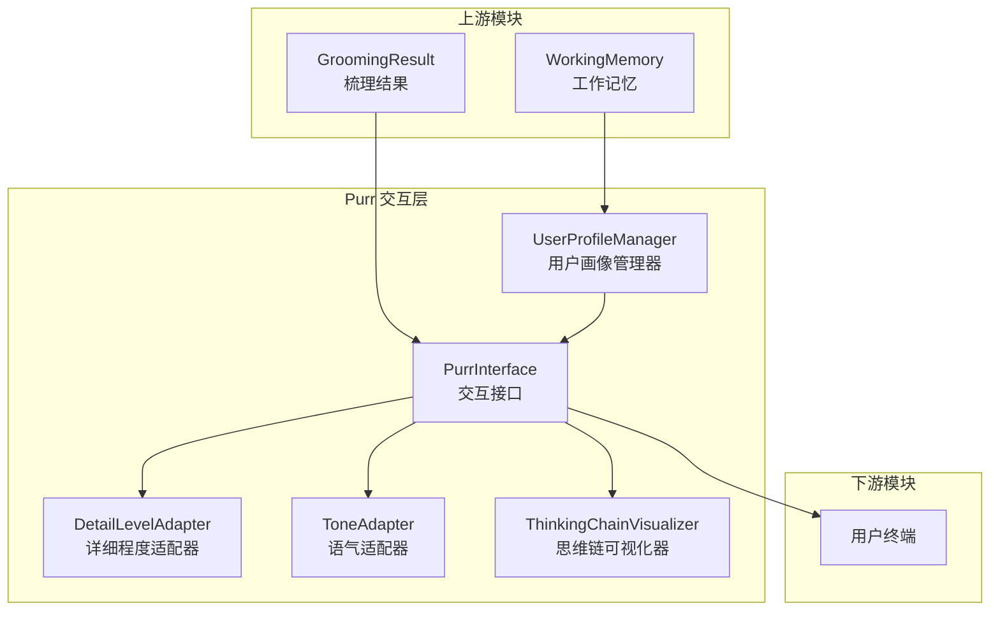
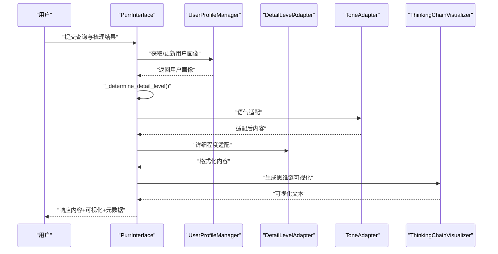
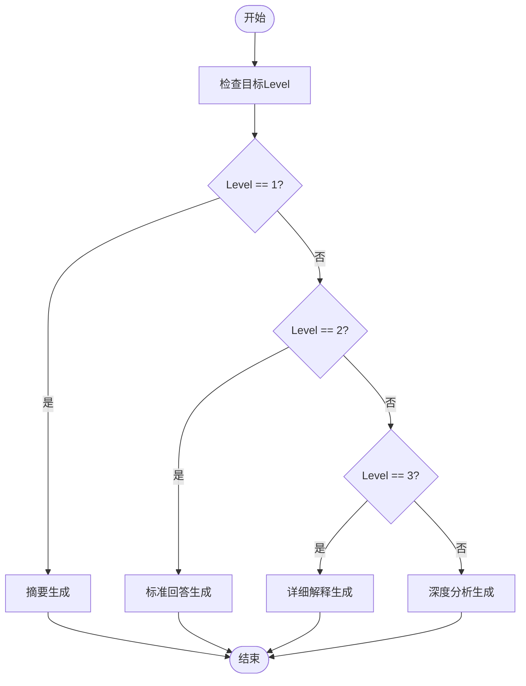
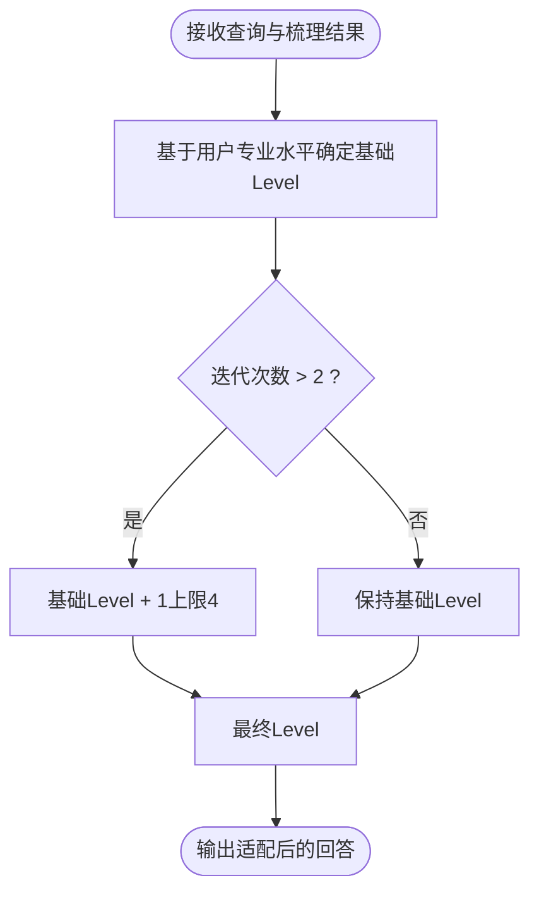
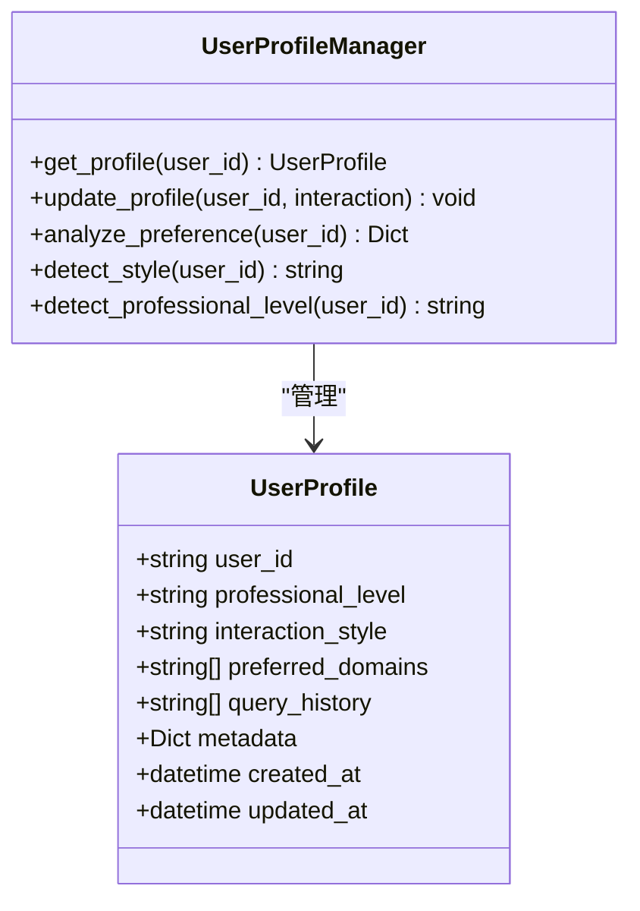
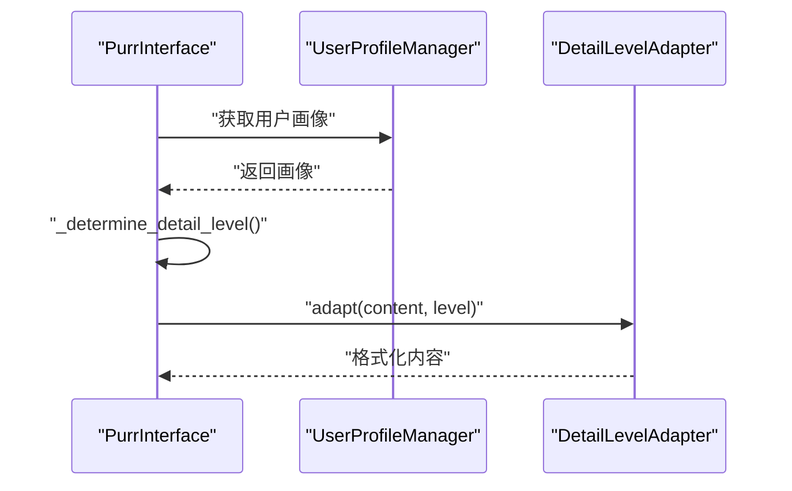
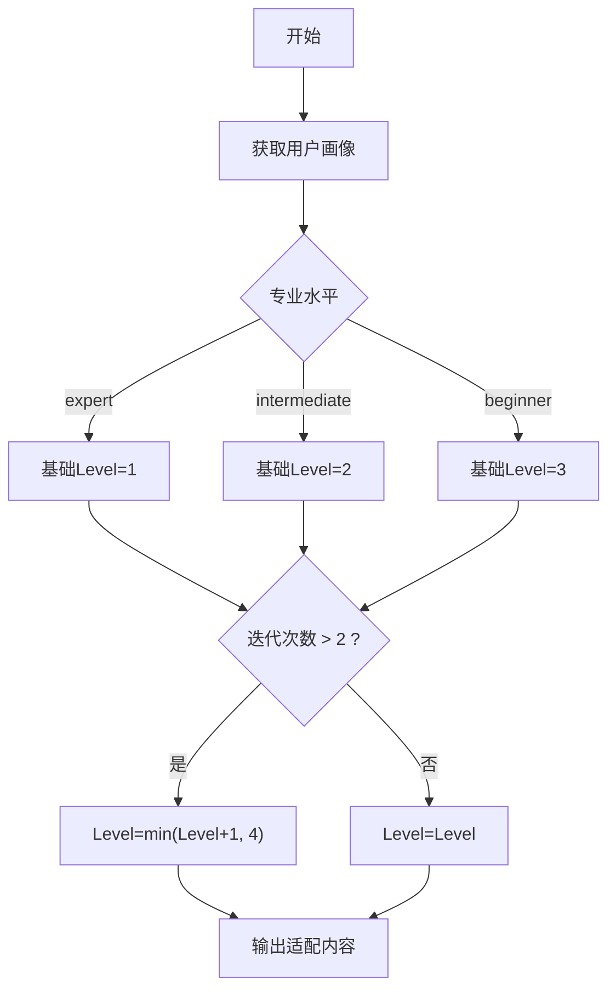
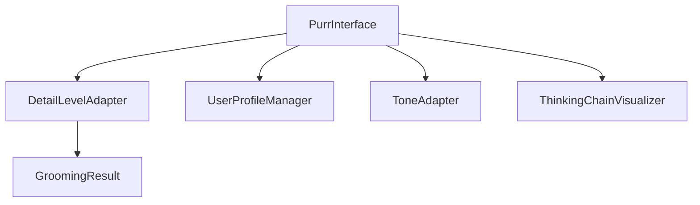

# 详细程度适配器

<cite>
**本文档引用的文件**
- [src/purr/detail_adapter.py](file://src/purr/detail_adapter.py)
- [src/purr/interface.py](file://src/purr/interface.py)
- [src/purr/models.py](file://src/purr/models.py)
- [src/purr/profile_manager.py](file://src/purr/profile_manager.py)
- [src/purr/tone_adapter.py](file://src/purr/tone_adapter.py)
- [src/purr/visualizer.py](file://src/purr/visualizer.py)
- [src/grooming/models.py](file://src/grooming/models.py)
- [example/example_usage.py](file://example/example_usage.py)
- [src/purr/README.md](file://src/purr/README.md)
</cite>

## 目录
1. [简介](#简介)
2. [项目结构](#项目结构)
3. [核心组件](#核心组件)
4. [架构总览](#架构总览)
5. [详细组件分析](#详细组件分析)
6. [依赖关系分析](#依赖关系分析)
7. [性能考量](#性能考量)
8. [故障排查指南](#故障排查指南)
9. [结论](#结论)
10. [附录](#附录)

## 简介
本文件面向详细程度适配器模块，系统性阐述其在 NecoRAG 交互层中的作用与实现。详细程度适配器负责将梳理阶段生成的标准化答案，按照用户画像与查询复杂度，动态映射到四个输出层级：简洁摘要（Level 1）、标准回答（Level 2）、详细解释（Level 3）、深度分析（Level 4）。本文将深入解析分级系统的设计原理、查询复杂度分析算法、用户专业水平识别机制，以及自适应调整策略，并提供决策树示例与实际应用场景，帮助读者理解如何根据用户背景与查询需求动态选择合适的详细程度。

## 项目结构
详细程度适配器位于 Purr 交互层，与语气适配器、用户画像管理器、思维链可视化器共同构成情境自适应生成的核心子系统。其与上游梳理结果（GroomingResult）和下游记忆系统（WorkingMemory）进行交互，形成端到端的响应生成链路。

**图表来源**
- [src/purr/interface.py:27-53](file://src/purr/interface.py#L27-L53)
- [src/purr/detail_adapter.py:8-26](file://src/purr/detail_adapter.py#L8-L26)
- [src/purr/tone_adapter.py:8-25](file://src/purr/tone_adapter.py#L8-L25)
- [src/purr/profile_manager.py:10-36](file://src/purr/profile_manager.py#L10-L36)
- [src/purr/visualizer.py:9-35](file://src/purr/visualizer.py#L9-L35)

**章节来源**
- [src/purr/interface.py:16-53](file://src/purr/interface.py#L16-L53)
- [src/purr/detail_adapter.py:8-26](file://src/purr/detail_adapter.py#L8-L26)
- [src/purr/tone_adapter.py:8-25](file://src/purr/tone_adapter.py#L8-L25)
- [src/purr/profile_manager.py:10-36](file://src/purr/profile_manager.py#L10-L36)
- [src/purr/visualizer.py:9-35](file://src/purr/visualizer.py#L9-L35)

## 核心组件
- 详细程度适配器（DetailLevelAdapter）：负责将内容按 Level 1-4 进行格式化与扩展，提供摘要、要点、段落扩展与报告框架等能力。
- 交互接口（PurrInterface）：协调用户画像、语气适配与详细程度适配，生成最终响应与思维链可视化。
- 用户画像管理器（UserProfileManager）：维护用户画像，分析交互偏好与专业水平，为详细程度决策提供依据。
- 语气适配器（ToneAdapter）：配合详细程度适配器，确保输出语气与用户风格一致。
- 思维链可视化器（ThinkingChainVisualizer）：生成检索路径、证据来源与推理过程的可视化文本。

**章节来源**
- [src/purr/detail_adapter.py:8-55](file://src/purr/detail_adapter.py#L8-L55)
- [src/purr/interface.py:16-132](file://src/purr/interface.py#L16-L132)
- [src/purr/profile_manager.py:10-164](file://src/purr/profile_manager.py#L10-L164)
- [src/purr/tone_adapter.py:8-75](file://src/purr/tone_adapter.py#L8-L75)
- [src/purr/visualizer.py:9-150](file://src/purr/visualizer.py#L9-L150)

## 架构总览
详细程度适配器在整体流程中的位置如下：

**图表来源**
- [src/purr/interface.py:55-132](file://src/purr/interface.py#L55-L132)
- [src/purr/detail_adapter.py:28-55](file://src/purr/detail_adapter.py#L28-L55)
- [src/purr/tone_adapter.py:49-75](file://src/purr/tone_adapter.py#L49-L75)
- [src/purr/visualizer.py:37-71](file://src/purr/visualizer.py#L37-L71)

## 详细组件分析

### 详细程度分级系统与决策逻辑
详细程度分级系统以“Level 1-4”为核心，分别对应不同粒度与深度的输出形态。系统通过用户画像与查询复杂度进行自适应调整，确保输出既满足用户需求，又不造成信息过载。

- Level 1：简洁摘要（1-2句话）
  - 目标：快速传达核心结论，适合忙碌用户或初步了解。
  - 实现：最小实现为提取首句，后续可接入 LLM 摘要生成。
- Level 2：标准回答（1段话 + 要点）
  - 目标：在简洁与完整性之间取得平衡，适合一般用户。
  - 实现：在摘要基础上添加要点列表，要点来源于文本中的关键句。
- Level 3：详细解释（多段落 + 案例）
  - 目标：提供充分背景与示例，适合需要深入理解的用户。
  - 实现：对段落进行扩展，插入示例标记，便于后续填充案例。
- Level 4：深度分析（完整报告）
  - 目标：生成结构化报告，包含摘要、详细内容、关键要点、延伸思考与参考资料。
  - 实现：采用报告框架，调用摘要与要点提取方法，留出扩展空间。

**图表来源**
- [src/purr/detail_adapter.py:28-55](file://src/purr/detail_adapter.py#L28-L55)
- [src/purr/detail_adapter.py:57-156](file://src/purr/detail_adapter.py#L57-L156)

**章节来源**
- [src/purr/detail_adapter.py:8-17](file://src/purr/detail_adapter.py#L8-L17)
- [src/purr/detail_adapter.py:57-156](file://src/purr/detail_adapter.py#L57-L156)

### 查询复杂度分析算法
查询复杂度由梳理阶段的迭代次数与置信度等指标反映。系统将这些客观指标作为“查询复杂度”的代理，用于动态调整详细程度。

- 迭代次数（iterations）：反映推理链长度与多跳推理的复杂程度。迭代次数越多，通常意味着更复杂的查询，需要更高的详细程度。
- 置信度（confidence）：反映答案的可信度。高置信度可适度降低详细程度，低置信度则可能需要更多解释与证据来源。

**图表来源**
- [src/purr/interface.py:134-165](file://src/purr/interface.py#L134-L165)

**章节来源**
- [src/purr/interface.py:134-165](file://src/purr/interface.py#L134-L165)
- [src/grooming/models.py:38-46](file://src/grooming/models.py#L38-L46)

### 用户专业水平识别机制
用户画像包含“专业程度”字段，系统据此设定不同层级的基础详细程度。该机制通过用户画像管理器维护与更新，结合查询历史进行偏好分析。

- 专业程度映射：
  - 初学者（beginner）：默认基础Level较高，以满足理解需求。
  - 中级（intermediate）：默认基础Level中等，兼顾效率与清晰度。
  - 专家（expert）：默认基础Level较低，强调简洁与直接。
- 偏好分析：统计查询历史中的高频关键词，辅助判断用户关注领域与表达习惯，为语气与详细程度提供参考。

**图表来源**
- [src/purr/models.py:10-20](file://src/purr/models.py#L10-L20)
- [src/purr/profile_manager.py:41-164](file://src/purr/profile_manager.py#L41-L164)

**章节来源**
- [src/purr/models.py:10-20](file://src/purr/models.py#L10-L20)
- [src/purr/profile_manager.py:41-164](file://src/purr/profile_manager.py#L41-L164)

### 自适应调整策略
自适应调整策略综合考虑用户画像与查询复杂度，确保输出既符合用户预期，又能有效传递信息。

- 基础Level确定：依据用户专业水平映射到 Level 1-3。
- 复杂度增强：若迭代次数超过阈值，则提升一级，但不超过 Level 4。
- 输出格式：在 Level 2 中自动添加要点；在 Level 3 中扩展段落并预留示例；在 Level 4 中生成报告框架。

**图表来源**
- [src/purr/interface.py:134-165](file://src/purr/interface.py#L134-L165)
- [src/purr/detail_adapter.py:28-55](file://src/purr/detail_adapter.py#L28-L55)

**章节来源**
- [src/purr/interface.py:134-165](file://src/purr/interface.py#L134-L165)
- [src/purr/detail_adapter.py:28-55](file://src/purr/detail_adapter.py#L28-L55)

### 四种输出层级的具体实现
- 简洁摘要（Level 1）
  - 实现要点：提取首句或截取前若干字符，保证快速理解。
  - 适用场景：快速预览、移动端首屏、紧急查询。
- 标准回答（Level 2）
  - 实现要点：在摘要基础上提取关键句作为要点，控制要点数量，保持可读性。
  - 适用场景：日常问答、知识检索、业务咨询。
- 详细解释（Level 3）
  - 实现要点：对段落进行扩展，插入示例标记，便于后续填充具体案例。
  - 适用场景：教学讲解、技术文档、深度研究。
- 深度分析（Level 4）
  - 实现要点：生成报告框架，包含摘要、详细内容、关键要点、延伸思考与参考资料。
  - 适用场景：学术论文、项目汇报、审计报告。

**章节来源**
- [src/purr/detail_adapter.py:57-156](file://src/purr/detail_adapter.py#L57-L156)

### 决策树算法示例与应用场景
以下为一个概念性的决策树示例，展示如何根据用户画像与查询复杂度选择详细程度：

**图表来源**
- [src/purr/interface.py:151-165](file://src/purr/interface.py#L151-L165)

应用场景举例：
- 场景一：初学者查询“深度学习的应用”，系统识别其专业水平为 beginner，基础Level=3；由于迭代次数>2，最终Level=4，输出深度分析报告，满足其学习需求。
- 场景二：专家查询“深度学习的应用”，系统识别其专业水平为 expert，基础Level=1；迭代次数未达阈值，最终Level=1，输出简洁摘要，节省时间。
- 场景三：中级用户查询“如何优化模型训练”，系统识别其专业水平为 intermediate，基础Level=2；迭代次数>2，最终Level=3，输出详细解释，包含示例与实践建议。

**章节来源**
- [src/purr/interface.py:151-165](file://src/purr/interface.py#L151-L165)

## 依赖关系分析
详细程度适配器与交互接口、用户画像管理器、语气适配器、思维链可视化器存在直接依赖关系，同时与梳理结果（GroomingResult）进行数据交互。

**图表来源**
- [src/purr/interface.py:47-50](file://src/purr/interface.py#L47-L50)
- [src/purr/detail_adapter.py:28-55](file://src/purr/detail_adapter.py#L28-L55)
- [src/purr/profile_manager.py:41-67](file://src/purr/profile_manager.py#L41-L67)
- [src/purr/tone_adapter.py:49-75](file://src/purr/tone_adapter.py#L49-L75)
- [src/purr/visualizer.py:37-71](file://src/purr/visualizer.py#L37-L71)

**章节来源**
- [src/purr/interface.py:47-50](file://src/purr/interface.py#L47-L50)
- [src/purr/detail_adapter.py:28-55](file://src/purr/detail_adapter.py#L28-L55)
- [src/purr/profile_manager.py:41-67](file://src/purr/profile_manager.py#L41-L67)
- [src/purr/tone_adapter.py:49-75](file://src/purr/tone_adapter.py#L49-L75)
- [src/purr/visualizer.py:37-71](file://src/purr/visualizer.py#L37-L71)

## 性能考量
- 时间复杂度
  - 摘要与要点提取：线性扫描文本，时间复杂度 O(n)，其中 n 为文本长度。
  - 段落扩展与报告生成：线性遍历段落与要点，时间复杂度 O(m)，其中 m 为段落数或要点数。
- 空间复杂度
  - 主要消耗在中间字符串拼接与列表构建，空间复杂度 O(n)。
- 优化建议
  - 对长文本采用分块处理与流式输出，减少一次性内存占用。
  - 将关键词匹配与要点提取逻辑缓存至工作记忆，复用历史结果。
  - 在 Level 3/4 中采用占位符与延迟填充策略，先输出框架，再异步补全示例与延伸思考。

[本节为通用性能讨论，无需特定文件来源]

## 故障排查指南
- 问题：Level 选择不符合预期
  - 排查要点：确认用户画像中的专业水平设置是否正确；检查梳理结果的迭代次数是否异常。
  - 参考路径：[src/purr/interface.py:151-165](file://src/purr/interface.py#L151-L165)
- 问题：摘要或要点提取效果不佳
  - 排查要点：检查文本分句与分段逻辑；确认关键词集合是否覆盖常见关键句。
  - 参考路径：[src/purr/detail_adapter.py:75-100](file://src/purr/detail_adapter.py#L75-L100)、[src/purr/detail_adapter.py:158-182](file://src/purr/detail_adapter.py#L158-L182)
- 问题：用户画像未更新
  - 排查要点：确认交互记录是否正确写入工作记忆；检查最大历史条数限制。
  - 参考路径：[src/purr/interface.py:123-130](file://src/purr/interface.py#L123-L130)、[src/purr/profile_manager.py:83-99](file://src/purr/profile_manager.py#L83-L99)

**章节来源**
- [src/purr/interface.py:151-165](file://src/purr/interface.py#L151-L165)
- [src/purr/detail_adapter.py:75-100](file://src/purr/detail_adapter.py#L75-L100)
- [src/purr/detail_adapter.py:158-182](file://src/purr/detail_adapter.py#L158-L182)
- [src/purr/interface.py:123-130](file://src/purr/interface.py#L123-L130)
- [src/purr/profile_manager.py:83-99](file://src/purr/profile_manager.py#L83-L99)

## 结论
详细程度适配器通过“Level 1-4”的分级体系与“用户画像 + 查询复杂度”的双因子决策机制，实现了对不同用户背景与查询需求的自适应输出。结合语气适配器与思维链可视化器，系统在保证信息质量的同时，提升了用户体验与可解释性。未来可在以下方面持续优化：引入更精细的查询复杂度指标（如实体数量、关系类型）、增强专业水平识别的自动化程度（基于查询语义特征），以及扩展 LLM 驱动的摘要与扩展能力，以进一步提升输出质量与效率。

[本节为总结性内容，无需特定文件来源]

## 附录
- 使用示例参考：交互接口的完整调用流程展示了从查询到响应的全过程，包括详细程度适配与思维链可视化。
  - 参考路径：[example/example_usage.py:176-215](file://example/example_usage.py#L176-L215)
- 模块设计文档：Purr 模块的 README 提供了更全面的功能概述与参数配置说明。
  - 参考路径：[src/purr/README.md:109-172](file://src/purr/README.md#L109-L172)

**章节来源**
- [example/example_usage.py:176-215](file://example/example_usage.py#L176-L215)
- [src/purr/README.md:109-172](file://src/purr/README.md#L109-L172)