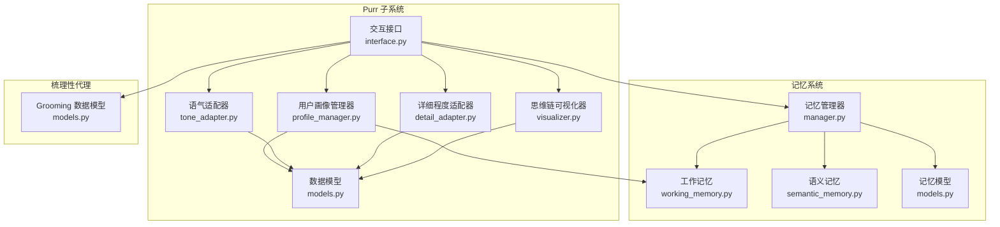
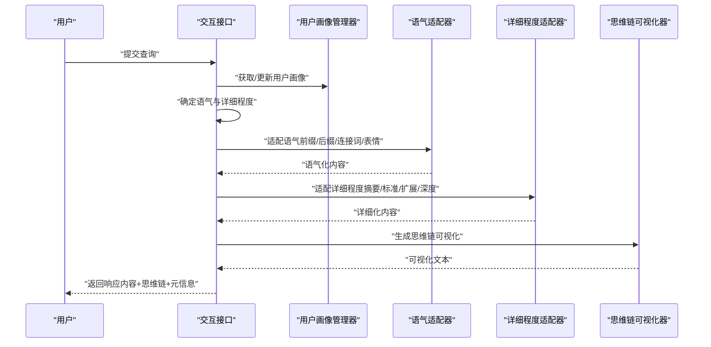
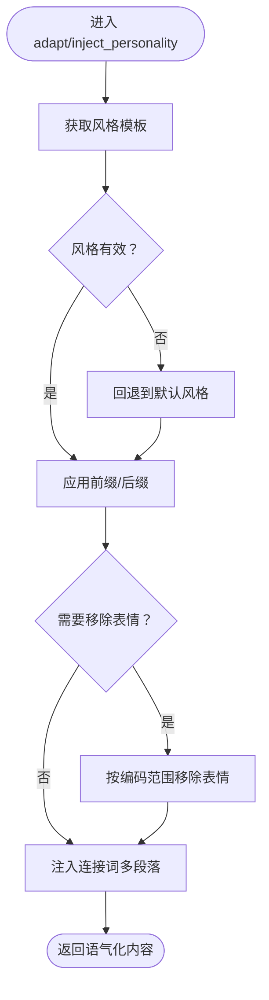
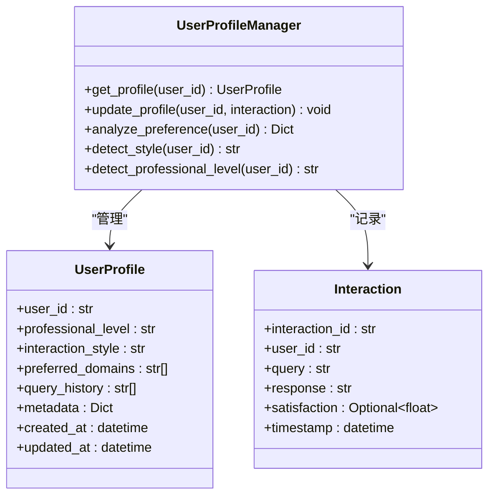
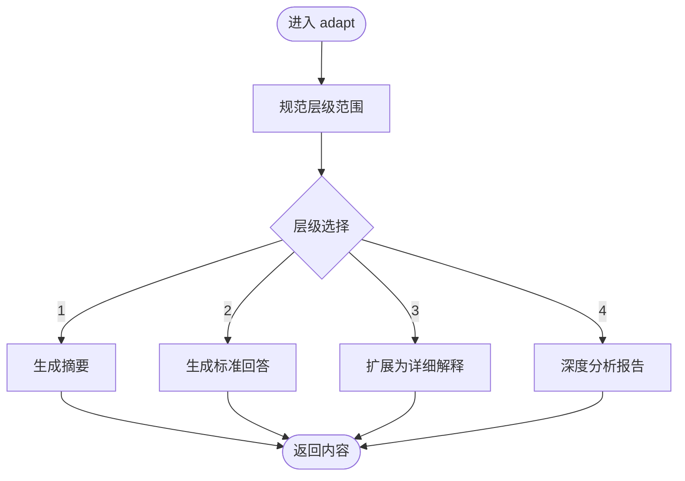
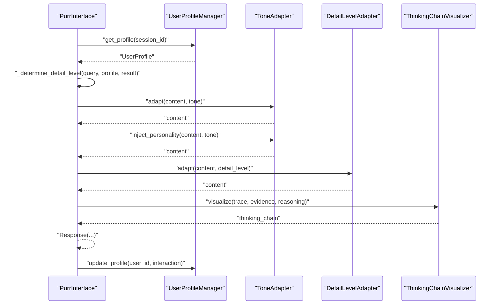
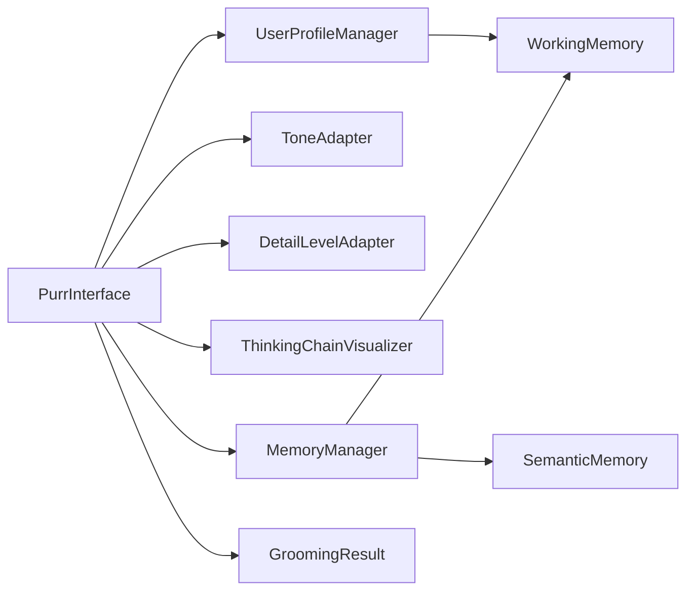

# 语气适配器

<cite>
**本文引用的文件**
- [tone_adapter.py](file://src/purr/tone_adapter.py)
- [profile_manager.py](file://src/purr/profile_manager.py)
- [models.py](file://src/purr/models.py)
- [interface.py](file://src/purr/interface.py)
- [detail_adapter.py](file://src/purr/detail_adapter.py)
- [visualizer.py](file://src/purr/visualizer.py)
- [example_usage.py](file://example/example_usage.py)
- [manager.py](file://src/memory/manager.py)
- [working_memory.py](file://src/memory/working_memory.py)
- [semantic_memory.py](file://src/memory/semantic_memory.py)
- [models.py](file://src/memory/models.py)
- [models.py](file://src/grooming/models.py)
</cite>

## 目录
1. [简介](#简介)
2. [项目结构](#项目结构)
3. [核心组件](#核心组件)
4. [架构总览](#架构总览)
5. [详细组件分析](#详细组件分析)
6. [依赖关系分析](#依赖关系分析)
7. [性能考虑](#性能考虑)
8. [故障排查指南](#故障排查指南)
9. [结论](#结论)
10. [附录](#附录)

## 简介
本技术文档聚焦于“语气适配器”模块，系统阐述其核心算法与实现机制，涵盖专业严谨、亲切友好、幽默轻松三种语气风格的转换逻辑；详解语气检测算法、个性化元素注入机制、以及与用户画像的动态关联策略；并通过具体示例展示如何依据用户的专业程度与交互风格自动调整输出语气；最后总结性能优化策略与质量评估方法。

## 项目结构
语气适配器位于 Purr 子系统内，与用户画像管理、详细程度适配、思维链可视化等模块协同工作，形成端到端的交互响应管线。

图表来源
- [interface.py:16-132](file://src/purr/interface.py#L16-L132)
- [tone_adapter.py:8-138](file://src/purr/tone_adapter.py#L8-L138)
- [profile_manager.py:10-165](file://src/purr/profile_manager.py#L10-L165)
- [detail_adapter.py:8-202](file://src/purr/detail_adapter.py#L8-L202)
- [visualizer.py:9-150](file://src/purr/visualizer.py#L9-L150)
- [manager.py:16-186](file://src/memory/manager.py#L16-L186)
- [working_memory.py:11-120](file://src/memory/working_memory.py#L11-L120)
- [semantic_memory.py:21-179](file://src/memory/semantic_memory.py#L21-L179)

章节来源
- [interface.py:16-132](file://src/purr/interface.py#L16-L132)
- [tone_adapter.py:8-138](file://src/purr/tone_adapter.py#L8-L138)
- [profile_manager.py:10-165](file://src/purr/profile_manager.py#L10-L165)
- [detail_adapter.py:8-202](file://src/purr/detail_adapter.py#L8-L202)
- [visualizer.py:9-150](file://src/purr/visualizer.py#L9-L150)
- [manager.py:16-186](file://src/memory/manager.py#L16-L186)
- [working_memory.py:11-120](file://src/memory/working_memory.py#L11-L120)
- [semantic_memory.py:21-179](file://src/memory/semantic_memory.py#L21-L179)

## 核心组件
- 语气适配器（ToneAdapter）：负责将原始内容按目标语气风格进行前缀/后缀注入、连接词注入、表情符号处理等。
- 用户画像管理器（UserProfileManager）：维护用户画像，提供交互风格与专业水平的读取与分析能力。
- 详细程度适配器（DetailLevelAdapter）：根据用户画像与查询复杂度，将内容调整为不同详细程度。
- 交互接口（PurrInterface）：编排上述组件，结合记忆系统与梳理性代理结果，生成最终响应。
- 思维链可视化器（ThinkingChainVisualizer）：将检索路径、证据来源与推理过程以文本形式呈现。

章节来源
- [tone_adapter.py:8-138](file://src/purr/tone_adapter.py#L8-L138)
- [profile_manager.py:10-165](file://src/purr/profile_manager.py#L10-L165)
- [detail_adapter.py:8-202](file://src/purr/detail_adapter.py#L8-L202)
- [interface.py:16-132](file://src/purr/interface.py#L16-L132)
- [visualizer.py:9-150](file://src/purr/visualizer.py#L9-L150)

## 架构总览
语气适配器在交互响应流程中的位置如下：

图表来源
- [interface.py:55-132](file://src/purr/interface.py#L55-L132)
- [tone_adapter.py:49-109](file://src/purr/tone_adapter.py#L49-L109)
- [detail_adapter.py:28-156](file://src/purr/detail_adapter.py#L28-L156)
- [visualizer.py:37-125](file://src/purr/visualizer.py#L37-L125)

## 详细组件分析

### 语气适配器（ToneAdapter）
- 支持风格
  - 专业严谨（formal）：强调逻辑性与正式性，避免表情符号，连接词偏向学术表达。
  - 亲切友好（friendly）：温和自然，适度使用表情符号，连接词更口语化。
  - 幽默轻松（humorous）：带有调侃与趣味，前缀/后缀含趣味性表达，连接词富有趣味性。
- 核心算法
  - 语气模板映射：根据风格选择前缀、后缀、连接词集合与是否禁用表情符号。
  - 个性化注入：在多段落内容中插入连接词，增强段落间的连贯性与风格一致性。
  - 表情符号处理：基于字符编码范围过滤表情符号，确保正式风格下的“无表情”输出。
- 复杂度分析
  - 适配与注入操作为线性复杂度 O(n)，其中 n 为内容字符数。
  - 表情符号移除为一次遍历，复杂度 O(n)。
- 错误处理
  - 当风格不在预设集合时，默认回退到“亲切友好”风格。
  - 对空内容与空连接词集合进行安全处理，避免异常。
- 性能优化
  - 使用字符编码范围快速判断表情符号，避免正则匹配开销。
  - 连接词注入按段落处理，减少不必要的字符串拼接。

图表来源
- [tone_adapter.py:49-109](file://src/purr/tone_adapter.py#L49-L109)
- [tone_adapter.py:111-137](file://src/purr/tone_adapter.py#L111-L137)

章节来源
- [tone_adapter.py:8-138](file://src/purr/tone_adapter.py#L8-L138)

### 用户画像管理器（UserProfileManager）
- 职责
  - 从工作记忆加载/创建用户画像，提供交互风格与专业水平的读取。
  - 维护查询历史，限制历史长度，更新时间戳。
  - 提供偏好分析（关键词统计、交互风格、专业水平）。
- 与语气适配的关系
  - 交互接口在生成响应时优先使用用户画像中的交互风格作为默认语气。
  - 专业水平影响详细程度的初始设定，间接影响语气的“深度”与“正式度”。
- 复杂度分析
  - 关键词统计为 O(m)，m 为历史查询总词数。
  - 偏好分析返回固定字段，时间复杂度与查询历史长度线性相关。
- 错误处理
  - 未找到画像时创建默认画像，保证可用性。
  - 历史长度超过上限时截断，避免内存膨胀。
- 性能优化
  - 使用内存字典缓存用户画像，降低重复读取成本。
  - 仅在必要时更新工作记忆，减少持久化写入。

图表来源
- [profile_manager.py:10-165](file://src/purr/profile_manager.py#L10-L165)
- [models.py:10-53](file://src/purr/models.py#L10-L53)

章节来源
- [profile_manager.py:10-165](file://src/purr/profile_manager.py#L10-L165)
- [models.py:10-53](file://src/purr/models.py#L10-L53)

### 详细程度适配器（DetailLevelAdapter）
- 层级定义
  - Level 1：简洁摘要（1-2句话）
  - Level 2：标准回答（1段+要点）
  - Level 3：详细解释（多段+示例）
  - Level 4：深度分析（完整报告框架）
- 与语气适配的协作
  - 先进行语气适配，再进行详细程度适配，确保语气风格贯穿不同层级。
  - 交互接口根据用户画像与查询复杂度动态决定详细程度。
- 复杂度分析
  - 摘要与标准回答为线性复杂度，扩展与深度分析涉及格式化与拼接，仍为线性。
- 错误处理
  - 对越界层级进行边界修正，保证输出稳定性。
  - 关键要点提取基于关键词匹配，对短行与空行进行过滤。

图表来源
- [detail_adapter.py:28-156](file://src/purr/detail_adapter.py#L28-L156)

章节来源
- [detail_adapter.py:8-202](file://src/purr/detail_adapter.py#L8-L202)

### 交互接口（PurrInterface）
- 控制流
  - 获取用户画像，确定语气与详细程度。
  - 对梳理性代理的生成结果进行语气与详细程度适配。
  - 生成思维链可视化，封装响应对象并更新用户画像。
- 语气检测与个性化
  - 默认使用用户画像中的交互风格；若显式指定，则覆盖。
  - 详细程度由“专业水平映射 + 查询复杂度调整”共同决定。
- 与记忆系统的集成
  - 通过记忆管理器访问工作记忆，实现用户画像的持久化与读取。
- 与梳理性代理的衔接
  - 依赖 GroomingResult 的 answer、citations、confidence、iterations 等字段。

图表来源
- [interface.py:55-132](file://src/purr/interface.py#L55-L132)
- [interface.py:134-165](file://src/purr/interface.py#L134-L165)
- [tone_adapter.py:49-109](file://src/purr/tone_adapter.py#L49-L109)
- [detail_adapter.py:28-156](file://src/purr/detail_adapter.py#L28-L156)
- [visualizer.py:37-125](file://src/purr/visualizer.py#L37-L125)

章节来源
- [interface.py:16-132](file://src/purr/interface.py#L16-L132)

### 思维链可视化器（ThinkingChainVisualizer）
- 功能
  - 将检索路径、证据来源与推理过程以结构化文本形式输出，便于用户理解生成过程。
- 与交互接口的协作
  - 交互接口在生成响应时调用该可视化器，将检索轨迹、证据与推理指标整合为可读文本。
- 复杂度分析
  - 输出构建为线性复杂度，受证据与推理步骤数量影响。

章节来源
- [visualizer.py:9-150](file://src/purr/visualizer.py#L9-L150)

## 依赖关系分析
- 组件耦合
  - PurrInterface 依赖 UserProfileManager、ToneAdapter、DetailLevelAdapter、ThinkingChainVisualizer。
  - UserProfileManager 依赖工作记忆（WorkingMemory）以读取/写入用户画像。
  - MemoryManager 统一管理 L1/L2/L3 三层记忆，为工作记忆与语义记忆提供基础设施。
- 外部依赖
  - 与梳理性代理（GroomingAgent）的结果数据结构保持一致，确保内容与证据的正确传递。
- 循环依赖
  - 未发现循环依赖，模块职责清晰，接口边界明确。

图表来源
- [interface.py:16-132](file://src/purr/interface.py#L16-L132)
- [profile_manager.py:10-165](file://src/purr/profile_manager.py#L10-L165)
- [manager.py:16-186](file://src/memory/manager.py#L16-L186)
- [working_memory.py:11-120](file://src/memory/working_memory.py#L11-L120)
- [semantic_memory.py:21-179](file://src/memory/semantic_memory.py#L21-L179)
- [models.py:38-47](file://src/grooming/models.py#L38-L47)

章节来源
- [interface.py:16-132](file://src/purr/interface.py#L16-L132)
- [profile_manager.py:10-165](file://src/purr/profile_manager.py#L10-L165)
- [manager.py:16-186](file://src/memory/manager.py#L16-L186)
- [working_memory.py:11-120](file://src/memory/working_memory.py#L11-L120)
- [semantic_memory.py:21-179](file://src/memory/semantic_memory.py#L21-L179)
- [models.py:38-47](file://src/grooming/models.py#L38-L47)

## 性能考虑
- 时间复杂度
  - 语气适配与详细程度适配均为线性复杂度，适合大规模文本处理。
  - 用户偏好分析的关键词统计与排序为 O(m log m)，m 为历史查询总词数。
- 空间复杂度
  - 用户画像缓存与查询历史占用线性空间，可通过最大历史长度参数控制。
- 优化建议
  - 对表情符号移除采用字符编码范围判断，避免正则开销。
  - 连接词注入按段落处理，减少字符串拼接次数。
  - 通过工作记忆缓存用户画像，降低重复读取成本。
  - 在交互接口中合并多次适配步骤，减少中间对象创建。

## 故障排查指南
- 语气未生效
  - 检查风格参数是否在预设集合内，若无效将回退到默认风格。
  - 确认是否正确调用 adapt 与 inject_personality 两个步骤。
- 表情符号未被移除
  - 确认正式风格模板的“禁用表情”标志已启用。
  - 检查输入文本中表情符号编码范围是否在过滤范围内。
- 详细程度不符合预期
  - 检查用户画像中的专业水平与查询复杂度（迭代次数）是否符合映射规则。
  - 确认交互接口的详细程度确定逻辑是否被显式覆盖。
- 用户偏好分析为空
  - 确认用户画像中已有查询历史，且历史长度未被截断至空。
  - 检查关键词提取的最小词长阈值是否过高导致无结果。

章节来源
- [tone_adapter.py:49-109](file://src/purr/tone_adapter.py#L49-L109)
- [profile_manager.py:101-134](file://src/purr/profile_manager.py#L101-L134)
- [interface.py:134-165](file://src/purr/interface.py#L134-L165)

## 结论
语气适配器通过风格模板、个性化注入与表情符号处理，实现了对“专业严谨、亲切友好、幽默轻松”的灵活切换；配合用户画像管理器与详细程度适配器，形成了从“风格感知—个性化注入—层级适配”的完整响应管线。交互接口将各组件有机串联，并与记忆系统、梳理性代理协同工作，最终输出既符合用户偏好的高质量响应。通过合理的复杂度控制与缓存策略，系统在保证质量的同时具备良好的性能表现。

## 附录
- 使用示例（来自完整演示脚本）
  - 展示了从 Whiskers 引擎到 Purr 交互接口的完整流程，包括语气与详细程度的设置与输出。
  - 可参考示例脚本中的交互接口调用方式，了解如何在实际场景中应用语气适配器。

章节来源
- [example_usage.py:176-215](file://example/example_usage.py#L176-L215)