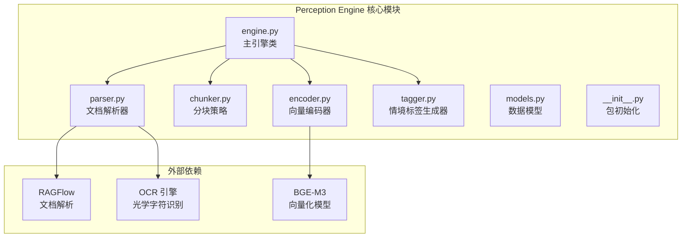
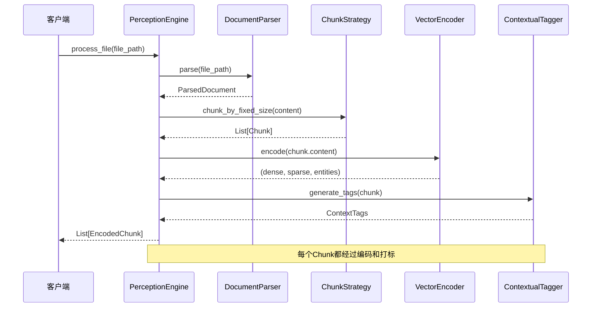
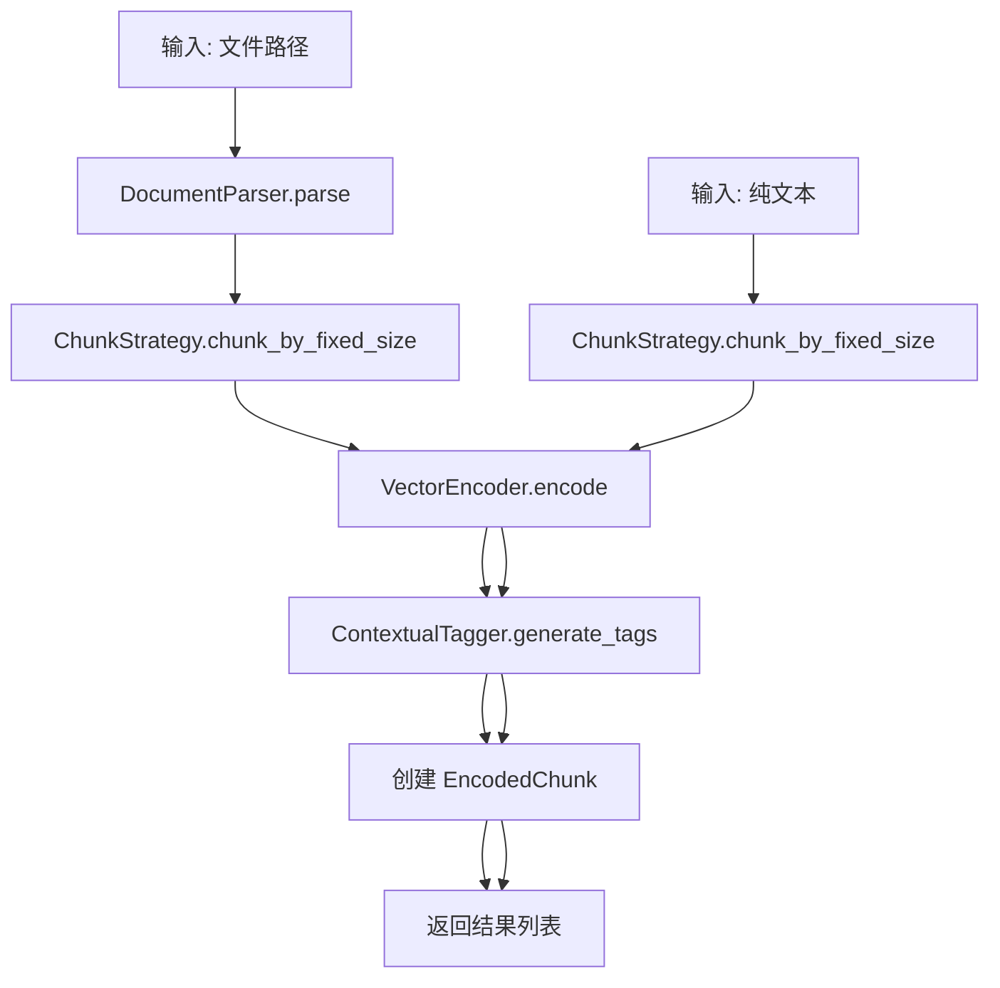
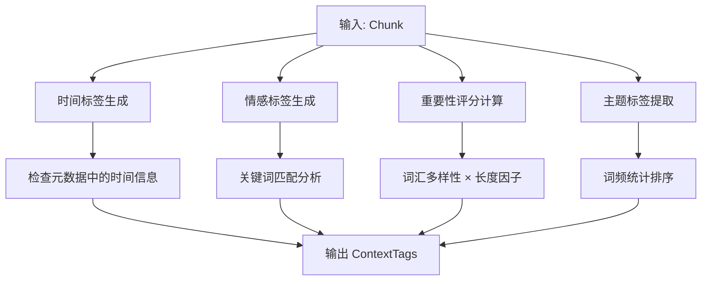
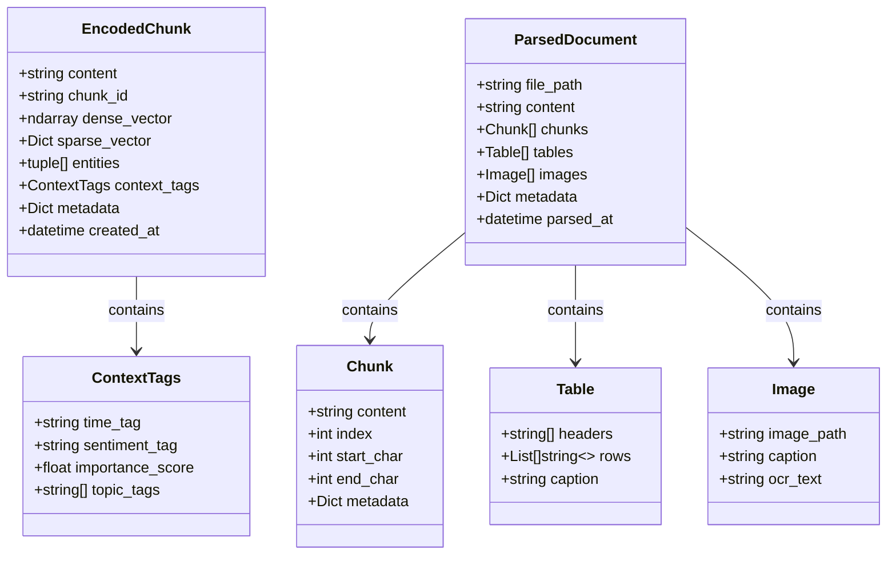
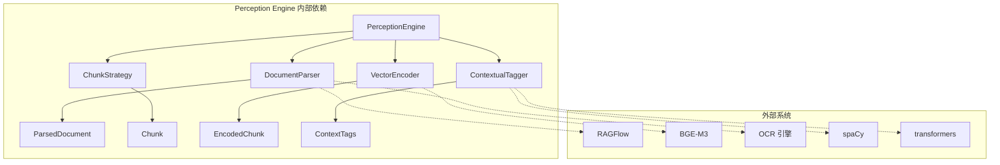

# Perception Engine - 感知层

<cite>
**本文档引用的文件**
- [engine.py](file://src/perception/engine.py)
- [parser.py](file://src/perception/parser.py)
- [chunker.py](file://src/perception/chunker.py)
- [encoder.py](file://src/perception/encoder.py)
- [tagger.py](file://src/perception/tagger.py)
- [models.py](file://src/perception/models.py)
- [__init__.py](file://src/perception/__init__.py)
- [README.md](file://src/perception/README.md)
- [example_usage.py](file://example/example_usage.py)
- [README.md](file://README.md)
- [QUICKSTART.md](file://QUICKSTART.md)
</cite>

## 更新摘要
**变更内容**
- 感知系统已从Whiskers重构为Perception系统
- 模块路径从`src/whiskers/`迁移到`src/perception/`
- API命名从`WhiskersEngine`更新为`PerceptionEngine`
- 项目整体架构保持不变，但模块名称和路径已更新
- README和示例代码中的引用已相应更新

## 目录
1. [简介](#简介)
2. [项目结构](#项目结构)
3. [核心组件](#核心组件)
4. [架构概览](#架构概览)
5. [详细组件分析](#详细组件分析)
6. [依赖分析](#依赖分析)
7. [性能考虑](#性能考虑)
8. [故障排除指南](#故障排除指南)
9. [结论](#结论)
10. [附录](#附录)

## 简介

Perception Engine（感知引擎）是 NecoRAG 的感知层核心组件，负责多模态数据的高精度编码与情境标记。就像猫的胡须能敏锐感知环境微变化一样，本引擎负责"感知"和"理解"输入的各种数据。

该引擎实现了文档解析、多模态编码和情境标签生成三大核心功能，为整个 NecoRAG 系统提供高质量的数据预处理能力。

**更新** 感知系统已从Whiskers重构为Perception系统，模块路径和API命名已相应更新。

## 项目结构

Perception Engine 位于 `src/perception/` 目录下，包含以下核心文件：



**图表来源**
- [engine.py:1-130](file://src/perception/engine.py#L1-L130)
- [parser.py:1-112](file://src/perception/parser.py#L1-L112)
- [encoder.py:1-98](file://src/perception/encoder.py#L1-L98)

**章节来源**
- [engine.py:1-130](file://src/perception/engine.py#L1-L130)
- [__init__.py:1-23](file://src/perception/__init__.py#L1-L23)

## 核心组件

Perception Engine 由五个核心组件构成，每个组件都有明确的职责分工：

### 1. PerceptionEngine 主引擎
作为整个感知层的协调者，负责组织各个子组件的工作流程。

### 2. DocumentParser 文档解析器
负责将各种格式文档转换为统一的结构化表示，支持多种文档格式。

### 3. ChunkStrategy 分块策略
提供多种分块算法，将长文本分割为适合处理的片段。

### 4. VectorEncoder 向量编码器
生成多类型的向量表示，包括稠密向量、稀疏向量和实体三元组。

### 5. ContextualTagger 情境标签生成器
为每个文本块生成丰富的情境标签，模拟猫胡须的环境感知能力。

**章节来源**
- [engine.py:14-130](file://src/perception/engine.py#L14-L130)
- [parser.py:11-112](file://src/perception/parser.py#L11-L112)
- [chunker.py:10-98](file://src/perception/chunker.py#L10-L98)
- [encoder.py:11-98](file://src/perception/encoder.py#L11-L98)
- [tagger.py:10-144](file://src/perception/tagger.py#L10-L144)

## 架构概览



**图表来源**
- [engine.py:54-106](file://src/perception/engine.py#L54-L106)
- [parser.py:27-59](file://src/perception/parser.py#L27-L59)
- [chunker.py:58-82](file://src/perception/chunker.py#L58-L82)
- [encoder.py:28-42](file://src/perception/encoder.py#L28-L42)
- [tagger.py:32-47](file://src/perception/tagger.py#L32-L47)

## 详细组件分析

### PerceptionEngine 主引擎

PerceptionEngine 是感知层的核心协调者，负责组织整个数据处理流程。

#### 核心功能
- **一站式处理**：提供 `process_file()` 方法，自动完成解析、分块、编码和打标
- **灵活接口**：支持直接处理已解析文档或纯文本
- **配置管理**：通过构造函数接受各种配置参数

#### 处理流程


**图表来源**
- [engine.py:92-129](file://src/perception/engine.py#L92-L129)

**章节来源**
- [engine.py:14-130](file://src/perception/engine.py#L14-L130)

### DocumentParser 文档解析器

DocumentParser 负责将各种格式文档转换为统一的结构化表示。

#### 支持的功能
- **文件存在性检查**：确保输入文件有效
- **多格式支持**：计划支持 PDF、Word、Markdown、HTML 等格式
- **基本内容提取**：当前版本支持文本文件的基本读取
- **元数据收集**：自动提取文件名、扩展名、文件大小等信息

#### 当前实现特点
- **最小可用实现**：当前版本主要处理文本文件
- **简单分块**：使用固定大小的简单分块策略
- **预留扩展点**：为未来集成 RAGFlow 留有接口

**章节来源**
- [parser.py:11-112](file://src/perception/parser.py#L11-L112)

### ChunkStrategy 分块策略

分块策略提供多种算法来处理长文本，确保后续处理的有效性。

#### 分块算法
1. **固定大小分块** (`chunk_by_fixed_size`)
   - 基于预设的块大小进行简单分块
   - 支持重叠区域设置
   - 适用于大多数文本处理场景

2. **语义分块** (`chunk_by_semantic`)
   - 基于段落边界进行分块
   - 保持语义完整性
   - 适用于需要保持上下文的场景

3. **结构化分块** (`chunk_by_structure`)
   - 基于文档结构（标题、段落等）
   - 保留文档层次信息
   - 适用于结构化文档

#### 分块参数
- **chunk_size**：分块大小（默认 512 字符）
- **chunk_overlap**：分块重叠长度（默认 50 字符）

**章节来源**
- [chunker.py:10-98](file://src/perception/chunker.py#L10-L98)

### VectorEncoder 向量编码器

VectorEncoder 生成多类型的向量表示，为后续的检索和匹配提供基础。

#### 编码类型
1. **稠密向量** (`encode_dense`)
   - 高维语义向量表示
   - 计划使用 BGE-M3 模型
   - 当前版本使用随机向量作为演示

2. **稀疏向量** (`encode_sparse`)
   - 关键词权重表示
   - 基于词频统计
   - 当前版本使用简单词频归一化

3. **实体三元组** (`extract_entities`)
   - 主体-关系-客体三元组
   - 计划集成实体识别模型
   - 当前版本返回空列表

#### 向量特性
- **维度**：BGE-M3 默认 1024 维
- **数据类型**：float32
- **归一化**：稀疏向量进行最大频率归一化

**章节来源**
- [encoder.py:11-98](file://src/perception/encoder.py#L11-L98)

### ContextualTagger 情境标签生成器

ContextualTagger 为每个文本块生成丰富的情境标签，模拟猫胡须的环境感知能力。

#### 标签类型
1. **时间标签** (`generate_time_tag`)
   - 检测文档创建时间等元数据
   - 当前版本基于 chunk.metadata 中的 created_at

2. **情感标签** (`generate_sentiment_tag`)
   - 正面/负面/中性情感分类
   - 基于关键词匹配的简单实现
   - 当前版本支持中英文关键词

3. **重要性评分** (`generate_importance_tag`)
   - 基于内容质量和信息密度的评分
   - 范围 0-1，数值越高越重要
   - 结合词汇多样性与长度因子

4. **主题标签** (`generate_topic_tags`)
   - 自动提取关键词作为主题标签
   - 基于高频词统计
   - 返回前3个最重要的关键词

#### 标签生成策略


**图表来源**
- [tagger.py:32-143](file://src/perception/tagger.py#L32-L143)

**章节来源**
- [tagger.py:10-144](file://src/perception/tagger.py#L10-L144)

### 数据模型

Perception Engine 使用一组精心设计的数据模型来表示处理过程中的各种数据结构。

#### 核心数据模型



**图表来源**
- [models.py:11-69](file://src/perception/models.py#L11-L69)

#### 模型关系说明
- **Chunk**：表示原始文本的最小处理单元
- **ContextTags**：为 Chunk 提供丰富的元数据标签
- **EncodedChunk**：包含所有编码和标注信息的最终输出
- **ParsedDocument**：文档解析后的完整结构化表示
- **Table/Image**：文档中的表格和图片数据

**章节来源**
- [models.py:11-69](file://src/perception/models.py#L11-L69)

## 依赖分析



**图表来源**
- [engine.py:6-10](file://src/perception/engine.py#L6-L10)
- [README.md:137-143](file://src/perception/README.md#L137-L143)

### 组件耦合度分析

Perception Engine 在设计上采用了良好的模块化原则：

- **低耦合**：各组件之间通过清晰的接口通信
- **高内聚**：每个组件专注于单一职责
- **可替换性**：支持自定义插件扩展

### 外部依赖管理

当前实现中，许多高级功能仍处于待实现状态，使用了合理的占位符实现：

- **RAGFlow 集成**：TODO 注释标识的未来集成
- **BGE-M3 模型**：当前使用随机向量演示
- **实体识别**：预留 spaCy 集成接口
- **情感分析**：预留 transformers 集成接口

**章节来源**
- [README.md:137-158](file://src/perception/README.md#L137-L158)

## 性能考虑

### 当前性能特征
- **文档解析速度**：PDF 约 10-20 页/秒（计划）
- **向量化速度**：约 1000 chunks/秒（GPU，计划）
- **标签生成速度**：约 500 chunks/秒

### 优化建议

#### 1. 向量化性能优化
- **批量处理**：实现批量向量化以提高 GPU 利用率
- **缓存机制**：缓存常用文本的向量表示
- **异步处理**：支持异步向量化操作

#### 2. 内存管理
- **流式处理**：对于大文件采用流式处理方式
- **内存池**：复用向量数组减少内存分配开销
- **分页加载**：支持超大数据集的分页处理

#### 3. 并行处理
- **多线程分块**：利用多核 CPU 加快分块处理
- **并行编码**：向量化操作的并行化
- **流水线处理**：各组件间的流水线式处理

## 故障排除指南

### 常见问题及解决方案

#### 1. 文件解析错误
**问题**：文件不存在或无法读取
**解决方案**：
- 检查文件路径是否正确
- 验证文件权限
- 确认文件编码格式

#### 2. 向量维度不匹配
**问题**：向量维度与预期不符
**解决方案**：
- 检查 BGE-M3 模型配置
- 验证向量维度设置
- 确认模型加载状态

#### 3. 标签生成异常
**问题**：标签生成失败或结果异常
**解决方案**：
- 检查情感分析模型配置
- 验证实体识别模型状态
- 确认输入文本格式

#### 4. 内存不足
**问题**：处理大文件时内存溢出
**解决方案**：
- 增加 chunk_size 重叠设置
- 启用流式处理模式
- 优化向量存储格式

**章节来源**
- [parser.py:41-42](file://src/perception/parser.py#L41-L42)
- [engine.py:21-27](file://src/perception/engine.py#L21-L27)

## 结论

Perception Engine 作为 NecoRAG 框架的感知层，展现了优秀的模块化设计和清晰的职责分离。虽然当前实现主要基于占位符和最小可用版本，但其架构设计为未来的功能扩展奠定了坚实的基础。

### 主要优势
- **模块化设计**：五个核心组件职责明确，易于维护和扩展
- **可扩展性**：预留了大量扩展点和插件接口
- **性能潜力**：为 GPU 加速和并行处理提供了良好基础
- **实用性**：提供了完整的端到端处理流程

### 发展方向
- **功能完善**：逐步实现文档解析、实体识别、情感分析等高级功能
- **性能优化**：针对大规模数据处理进行性能调优
- **集成增强**：更好地集成现有的 NLP 生态系统工具
- **监控完善**：添加更完善的日志记录和性能监控

## 附录

### API 参考

#### PerceptionEngine 类
- `__init__(model="BGE-M3", chunk_size=512, chunk_overlap=50, enable_ocr=True)`
- `parse_document(file_path: str) -> ParsedDocument`
- `process(parsed_doc: ParsedDocument) -> List[EncodedChunk]`
- `process_file(file_path: str) -> List[EncodedChunk]`
- `process_text(text: str) -> List[EncodedChunk]`

#### DocumentParser 类
- `__init__(enable_ocr: bool = True)`
- `parse(file_path: str) -> ParsedDocument`
- `extract_tables(content: str) -> List[Table]`
- `extract_images(content: str) -> List[Image]`

#### ChunkStrategy 类
- `__init__(chunk_size: int = 512, chunk_overlap: int = 50)`
- `chunk_by_semantic(content: str) -> List[Chunk]`
- `chunk_by_fixed_size(content: str, size: int = None) -> List[Chunk]`
- `chunk_by_structure(content: str) -> List[Chunk]`

#### VectorEncoder 类
- `__init__(model: str = "BGE-M3")`
- `encode(text: str) -> Tuple[np.ndarray, Dict[str, float], List[Tuple]]`
- `encode_dense(text: str) -> np.ndarray`
- `encode_sparse(text: str) -> Dict[str, float]`
- `extract_entities(text: str) -> List[Tuple]`

#### ContextualTagger 类
- `__init__(sentiment_model: str = "default", importance_threshold: float = 0.5)`
- `generate_tags(chunk: Chunk) -> ContextTags`
- `generate_time_tag(chunk: Chunk) -> str`
- `generate_sentiment_tag(chunk: Chunk) -> str`
- `generate_importance_tag(chunk: Chunk) -> float`
- `generate_topic_tags(chunk: Chunk) -> List[str]`

### 配置参数说明

| 参数名 | 类型 | 默认值 | 说明 |
|--------|------|--------|------|
| `model` | str | "BGE-M3" | 向量化模型名称 |
| `chunk_size` | int | 512 | 分块大小（字符数） |
| `chunk_overlap` | int | 50 | 分块重叠长度（字符数） |
| `enable_ocr` | bool | True | 是否启用 OCR 功能 |
| `sentiment_model` | str | "default" | 情感分析模型名称 |
| `importance_threshold` | float | 0.5 | 重要性评分阈值 |

### 使用示例

完整的使用示例如下：

```python
from src.perception import PerceptionEngine

# 初始化引擎
engine = PerceptionEngine(
    model="BGE-M3",
    chunk_size=512,
    chunk_overlap=50,
    enable_ocr=True
)

# 处理文本
text = "深度学习是机器学习的一个分支..."
encoded_chunks = engine.process_text(text)

# 处理文件
encoded_chunks = engine.process_file("document.pdf")

# 访问结果
for chunk in encoded_chunks:
    print(f"内容: {chunk.content[:100]}...")
    print(f"向量维度: {chunk.dense_vector.shape}")
    print(f"情境标签: {chunk.context_tags.sentiment_tag}")
    print(f"重要性: {chunk.context_tags.importance_score:.2f}")
```

**章节来源**
- [example_usage.py:12-47](file://example/example_usage.py#L12-L47)
- [engine.py:21-27](file://src/perception/engine.py#L21-L27)