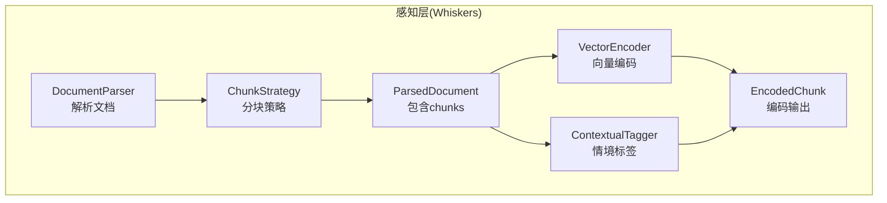
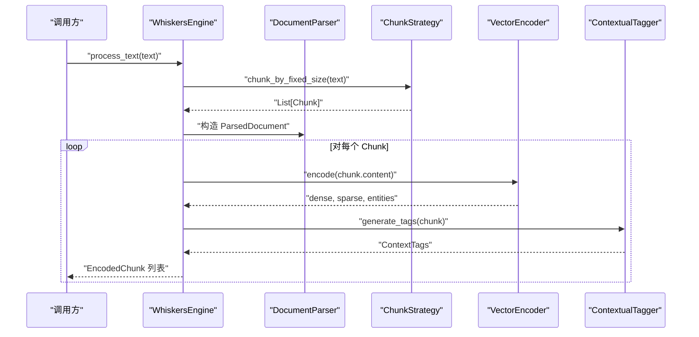
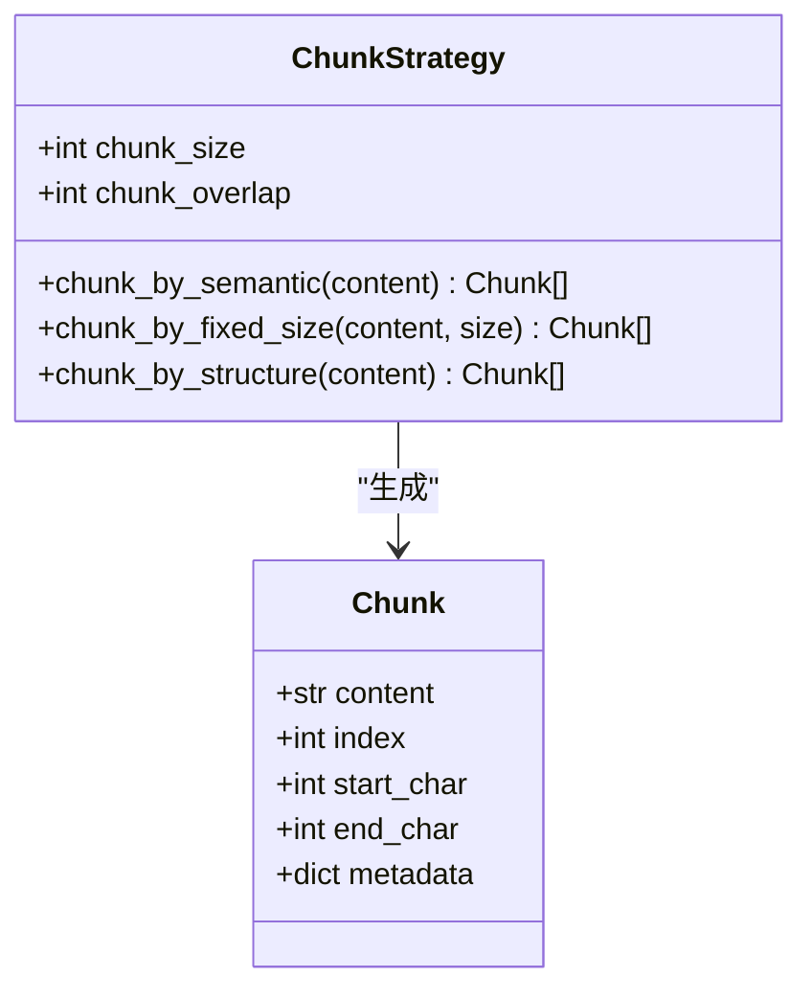
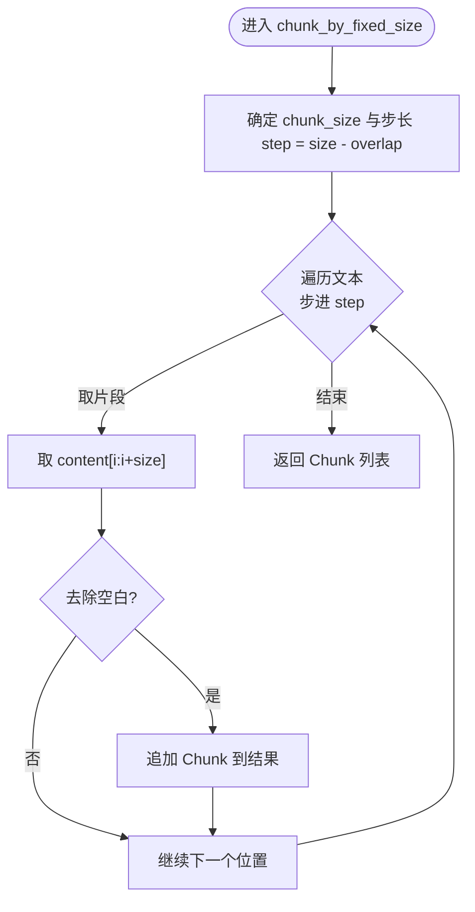
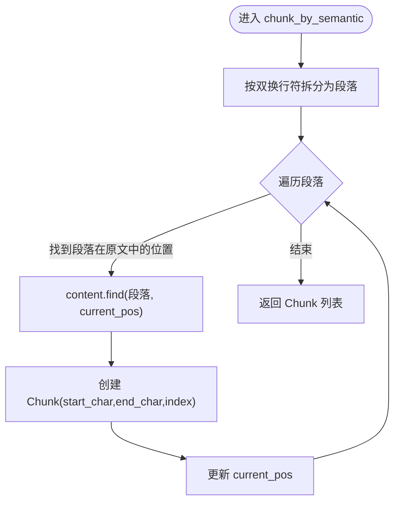
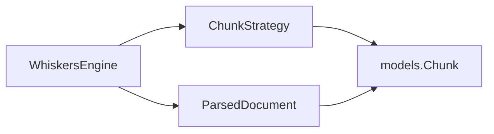

# 分块策略

<cite>
**本文引用的文件**
- [src/whiskers/chunker.py](file://src/whiskers/chunker.py)
- [src/whiskers/models.py](file://src/whiskers/models.py)
- [src/whiskers/engine.py](file://src/whiskers/engine.py)
- [src/whiskers/parser.py](file://src/whiskers/parser.py)
- [src/whiskers/tagger.py](file://src/whiskers/tagger.py)
- [src/whiskers/encoder.py](file://src/whiskers/encoder.py)
- [src/whiskers/__init__.py](file://src/whiskers/__init__.py)
- [src/whiskers/README.md](file://src/whiskers/README.md)
- [example/example_usage.py](file://example/example_usage.py)
</cite>

## 目录
1. [简介](#简介)
2. [项目结构](#项目结构)
3. [核心组件](#核心组件)
4. [架构总览](#架构总览)
5. [详细组件分析](#详细组件分析)
6. [依赖分析](#依赖分析)
7. [性能考虑](#性能考虑)
8. [故障排查指南](#故障排查指南)
9. [结论](#结论)
10. [附录](#附录)

## 简介
本章节面向“分块策略”模块，系统阐述 ChunkStrategy 类的多种分块算法实现与工程实践，包括语义分块、固定大小分块、结构化分块等策略；详解分块参数配置、重叠处理机制、语义一致性保证与性能优化；给出不同策略的适用场景、优缺点对比与选择指南；提供完整的 API 参考、配置参数说明与实际使用示例，并解释分块策略对后续编码与检索效果的影响。

## 项目结构
分块策略位于感知层 Whiskers Engine 中，作为文档解析与向量化之间的桥梁，负责将原始文本切分为更利于下游任务（编码、检索、记忆）的片段。其直接依赖数据模型 Chunk、ParsedDocument，间接参与 WhiskersEngine 的端到端处理流程。

图表来源
- [src/whiskers/engine.py:14-130](file://src/whiskers/engine.py#L14-L130)
- [src/whiskers/parser.py:27-59](file://src/whiskers/parser.py#L27-L59)
- [src/whiskers/chunker.py:10-98](file://src/whiskers/chunker.py#L10-L98)
- [src/whiskers/models.py:11-69](file://src/whiskers/models.py#L11-L69)
- [src/whiskers/encoder.py:11-98](file://src/whiskers/encoder.py#L11-L98)
- [src/whiskers/tagger.py:10-144](file://src/whiskers/tagger.py#L10-L144)

章节来源
- [src/whiskers/engine.py:14-130](file://src/whiskers/engine.py#L14-L130)
- [src/whiskers/parser.py:27-59](file://src/whiskers/parser.py#L27-L59)
- [src/whiskers/chunker.py:10-98](file://src/whiskers/chunker.py#L10-L98)
- [src/whiskers/models.py:11-69](file://src/whiskers/models.py#L11-L69)

## 核心组件
- ChunkStrategy：提供多种分块算法，支持语义分块、固定大小分块、结构化分块。
- Chunk/ParsedDocument：分块数据模型与解析后文档结构。
- WhiskersEngine：编排解析、分块、编码、打标的整体流程。
- VectorEncoder/ContextualTagger：与分块结果配合生成向量与情境标签。

章节来源
- [src/whiskers/chunker.py:10-98](file://src/whiskers/chunker.py#L10-L98)
- [src/whiskers/models.py:11-69](file://src/whiskers/models.py#L11-L69)
- [src/whiskers/engine.py:14-130](file://src/whiskers/engine.py#L14-L130)

## 架构总览
分块策略在 Whiskers Engine 中的位置如下：

图表来源
- [src/whiskers/engine.py:108-130](file://src/whiskers/engine.py#L108-L130)
- [src/whiskers/chunker.py:58-82](file://src/whiskers/chunker.py#L58-L82)
- [src/whiskers/encoder.py:28-42](file://src/whiskers/encoder.py#L28-L42)
- [src/whiskers/tagger.py:32-47](file://src/whiskers/tagger.py#L32-L47)

## 详细组件分析

### ChunkStrategy 类
- 角色定位：提供多种分块算法，将长文本切分为更小、更可控的片段，便于后续编码与检索。
- 关键方法
  - chunk_by_semantic(content): 基于语义边界（如段落）进行分块，保留语义完整性。
  - chunk_by_fixed_size(content, size): 按固定字符数进行分块，并支持重叠。
  - chunk_by_structure(content): 基于文档结构（标题、段落等）进行分块（当前最小实现复用语义分块）。
- 参数
  - chunk_size：默认 512，控制每块字符数。
  - chunk_overlap：默认 50，控制相邻块之间的重叠字符数，提升上下文连续性。
- 重叠处理机制
  - 在固定大小分块中，步进步长为 chunk_size - chunk_overlap，确保前后块有重叠区域，缓解跨边界语义断裂。
- 语义一致性保证
  - 语义分块优先按段落切分，减少跨段落的截断，有助于保持语义连贯。
  - 结构化分块当前最小实现复用语义分块，未来可扩展为基于标题层级或表格/代码块等结构元素。
- 性能优化
  - 固定大小分块采用线性扫描与切片，时间复杂度 O(n)，空间复杂度 O(n)。
  - 重叠通过步进控制，避免额外的回溯查找，保持高效。
  - 语义分块在段落级别切分，避免复杂的句法/语义分析开销。

图表来源
- [src/whiskers/chunker.py:10-98](file://src/whiskers/chunker.py#L10-L98)
- [src/whiskers/models.py:11-19](file://src/whiskers/models.py#L11-L19)

章节来源
- [src/whiskers/chunker.py:10-98](file://src/whiskers/chunker.py#L10-L98)
- [src/whiskers/models.py:11-19](file://src/whiskers/models.py#L11-L19)

### 分块算法流程图

#### 固定大小分块流程

图表来源
- [src/whiskers/chunker.py:58-82](file://src/whiskers/chunker.py#L58-L82)

#### 语义分块流程

图表来源
- [src/whiskers/chunker.py:28-56](file://src/whiskers/chunker.py#L28-L56)

### 分块参数配置与最佳实践
- chunk_size
  - 建议范围：256~1024 字符，取决于下游嵌入模型与检索器的窗口限制。
  - 小尺寸：更细粒度，利于精确检索，但增加编码与检索成本。
  - 大尺寸：减少块数量，提高吞吐，但可能丢失局部语义细节。
- chunk_overlap
  - 建议范围：20~200 字符，常用 50~100。
  - 作用：缓解跨边界语义断裂，提升检索召回与上下文连续性。
  - 注意：过大的重叠会增加重复信息与存储/计算开销。
- 选择策略
  - 语义优先：优先使用语义分块，结合段落/标题结构。
  - 规则驱动：固定大小分块适合规则化文档（如日志、表格转文本）。
  - 结构增强：结构化分块适合论文、手册等层次分明的文档。

章节来源
- [src/whiskers/chunker.py:17-26](file://src/whiskers/chunker.py#L17-L26)

### 不同分块策略的适用场景与对比
- 语义分块
  - 适用：自然语言文本、报告、论文、网页内容。
  - 优点：保留语义边界，减少跨段落截断。
  - 缺点：当前实现为最小实现，未集成复杂语义检测。
- 固定大小分块
  - 适用：日志、CSV 转文本、API 文档、代码注释。
  - 优点：实现简单、性能稳定、易于并行化。
  - 缺点：忽略语义边界，可能导致语义断裂。
- 结构化分块
  - 适用：带层级结构的文档（标题、子标题、段落）。
  - 优点：结合结构信息，提升检索相关性。
  - 缺点：当前为最小实现，需扩展结构识别逻辑。

章节来源
- [src/whiskers/chunker.py:28-98](file://src/whiskers/chunker.py#L28-L98)

### API 参考
- ChunkStrategy
  - chunk_by_semantic(content: str) -> List[Chunk]
  - chunk_by_fixed_size(content: str, size: int = None) -> List[Chunk]
  - chunk_by_structure(content: str) -> List[Chunk]
- Chunk
  - content: str
  - index: int
  - start_char: int
  - end_char: int
  - metadata: Dict[str, Any] = field(default_factory=dict)
- ParsedDocument
  - file_path: str
  - content: str
  - chunks: List[Chunk]
  - metadata: Dict[str, Any] = field(default_factory=dict)
  - parsed_at: datetime = field(default_factory=datetime.now)

章节来源
- [src/whiskers/chunker.py:10-98](file://src/whiskers/chunker.py#L10-L98)
- [src/whiskers/models.py:11-69](file://src/whiskers/models.py#L11-L69)

### 实际使用示例
- 在 WhiskersEngine 中对纯文本进行处理时，默认使用固定大小分块策略：
  - 参考路径：[src/whiskers/engine.py:108-130](file://src/whiskers/engine.py#L108-L130)
- 完整示例脚本展示了如何初始化引擎、处理文本并获取编码块：
  - 参考路径：[example/example_usage.py:12-47](file://example/example_usage.py#L12-L47)

章节来源
- [src/whiskers/engine.py:108-130](file://src/whiskers/engine.py#L108-L130)
- [example/example_usage.py:12-47](file://example/example_usage.py#L12-L47)

## 依赖分析
- 直接依赖
  - ChunkStrategy 依赖 Chunk 数据模型。
  - WhiskersEngine 在处理文本时调用 ChunkStrategy 的固定大小分块。
- 间接依赖
  - 分块结果作为 ParsedDocument 的一部分，参与后续的向量编码与情境标签生成。
- 导出与入口
  - 模块通过 __init__.py 导出 ChunkStrategy、Chunk、ParsedDocument 等。

图表来源
- [src/whiskers/chunker.py:10-98](file://src/whiskers/chunker.py#L10-L98)
- [src/whiskers/models.py:11-69](file://src/whiskers/models.py#L11-L69)
- [src/whiskers/engine.py:108-130](file://src/whiskers/engine.py#L108-L130)
- [src/whiskers/__init__.py:6-22](file://src/whiskers/__init__.py#L6-L22)

章节来源
- [src/whiskers/__init__.py:6-22](file://src/whiskers/__init__.py#L6-L22)
- [src/whiskers/engine.py:108-130](file://src/whiskers/engine.py#L108-L130)

## 性能考虑
- 时间复杂度
  - 固定大小分块：O(n)，其中 n 为文本长度。
  - 语义分块：O(n)，但包含多次 find 操作，受段落数影响。
- 空间复杂度
  - O(n) 用于存储 Chunk 列表与元数据。
- 重叠与召回
  - 合理设置 chunk_overlap 可提升检索召回，但会增加编码与存储成本。
- 并行化建议
  - 对独立 Chunk 的编码与打标可并行执行，以提升吞吐。
- 下游影响
  - 更细的分块提升检索精度但增加向量数量；更大的分块降低向量数量但可能损失局部语义。

## 故障排查指南
- 分块结果为空
  - 检查输入文本是否为空或仅包含空白字符。
  - 检查 chunk_size 是否过大导致切片为空。
- 语义分块未按预期切分
  - 确认文本中是否存在双换行符作为段落分隔。
  - 若文档为纯文本且无明显段落分隔，建议改用固定大小分块。
- 重叠无效
  - 确认 chunk_overlap 不大于 chunk_size，否则步长为非正数会导致死循环或异常。
- 编码阶段报错
  - 检查向量编码器与情境标签生成器的输入是否为有效字符串。
  - 若使用最小实现，注意向量编码器返回的是随机向量，仅用于演示。

章节来源
- [src/whiskers/chunker.py:58-82](file://src/whiskers/chunker.py#L58-L82)
- [src/whiskers/encoder.py:28-42](file://src/whiskers/encoder.py#L28-L42)
- [src/whiskers/tagger.py:32-47](file://src/whiskers/tagger.py#L32-L47)

## 结论
分块策略是感知层的关键环节，直接影响编码质量与检索效果。当前实现提供了语义分块、固定大小分块与结构化分块的最小可用能力。建议在生产环境中：
- 优先采用语义分块，结合段落/标题结构；
- 对规则化文档采用固定大小分块，并根据下游模型窗口与检索需求调参；
- 逐步完善结构化分块与语义分块的实现，提升语义一致性与召回效果；
- 在工程上重视重叠参数的平衡，兼顾召回与性能。

## 附录

### 分块策略对后续编码与检索的影响
- 编码阶段
  - 更细的分块带来更高分辨率的语义表示，但增加向量维度与存储压力。
  - 合理重叠可提升跨边界语义的连续性，有利于检索与记忆匹配。
- 检索阶段
  - 语义分块通常提升检索相关性，减少跨段落误匹配。
  - 固定大小分块在大规模文档中具备稳定的检索性能与可预测的召回。

章节来源
- [src/whiskers/engine.py:54-90](file://src/whiskers/engine.py#L54-L90)
- [src/whiskers/chunker.py:28-98](file://src/whiskers/chunker.py#L28-L98)