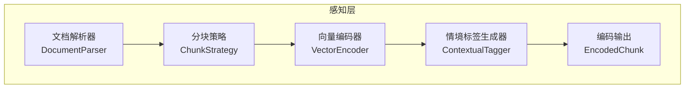
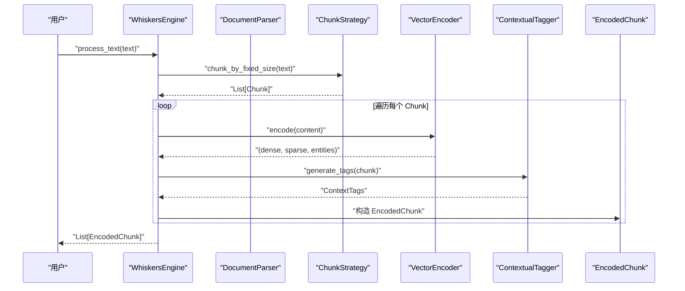
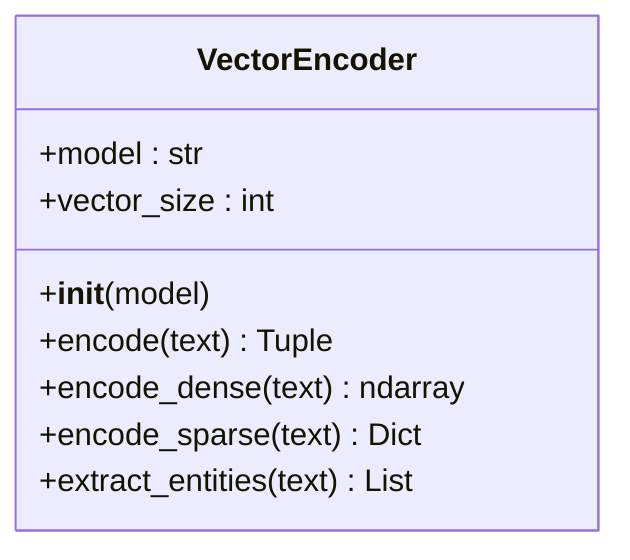
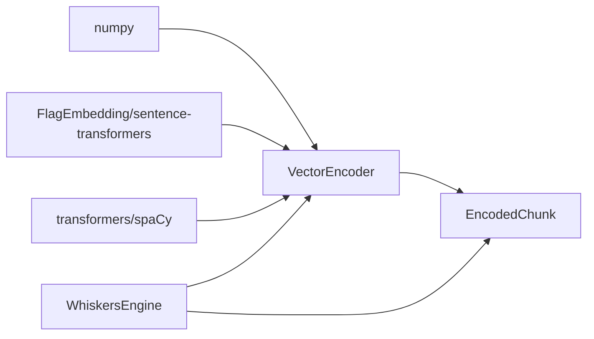

# 向量化编码器

<cite>
**本文引用的文件**
- [src/whiskers/encoder.py](file://src/whiskers/encoder.py)
- [src/whiskers/models.py](file://src/whiskers/models.py)
- [src/whiskers/engine.py](file://src/whiskers/engine.py)
- [src/whiskers/chunker.py](file://src/whiskers/chunker.py)
- [src/whiskers/tagger.py](file://src/whiskers/tagger.py)
- [src/whiskers/parser.py](file://src/whiskers/parser.py)
- [src/whiskers/__init__.py](file://src/whiskers/__init__.py)
- [src/whiskers/README.md](file://src/whiskers/README.md)
- [example/example_usage.py](file://example/example_usage.py)
- [requirements.txt](file://requirements.txt)
- [pyproject.toml](file://pyproject.toml)
</cite>

## 目录
1. [简介](#简介)
2. [项目结构](#项目结构)
3. [核心组件](#核心组件)
4. [架构总览](#架构总览)
5. [详细组件分析](#详细组件分析)
6. [依赖分析](#依赖分析)
7. [性能考虑](#性能考虑)
8. [故障排查指南](#故障排查指南)
9. [结论](#结论)
10. [附录](#附录)

## 简介
本文件面向向量化编码器模块，聚焦 VectorEncoder 类在感知层中的应用，围绕 BGE-M3 模型的多维度向量表示生成（稠密向量、稀疏向量、实体三元组）、向量归一化处理、实体识别与知识图谱构建基础进行系统化技术说明。文档同时覆盖模型配置、性能优化、内存管理与批量处理策略，并提供完整的 API 参考、配置参数说明与实际使用示例，帮助读者理解向量编码对检索质量与系统性能的影响。

## 项目结构
感知层（Whiskers Engine）由文档解析、分块策略、情境标签生成、向量化编码与编码输出组成。向量化编码器位于感知层的核心位置，负责将文本块转换为多维度向量表示，并为后续检索与知识图谱构建提供基础。

图表来源
- [src/whiskers/engine.py:14-129](file://src/whiskers/engine.py#L14-L129)
- [src/whiskers/parser.py:11-111](file://src/whiskers/parser.py#L11-L111)
- [src/whiskers/chunker.py:10-97](file://src/whiskers/chunker.py#L10-L97)
- [src/whiskers/tagger.py:10-143](file://src/whiskers/tagger.py#L10-L143)
- [src/whiskers/encoder.py:11-97](file://src/whiskers/encoder.py#L11-L97)
- [src/whiskers/models.py:31-40](file://src/whiskers/models.py#L31-L40)

章节来源
- [src/whiskers/README.md:1-158](file://src/whiskers/README.md#L1-L158)
- [src/whiskers/engine.py:14-129](file://src/whiskers/engine.py#L14-L129)

## 核心组件
- VectorEncoder：生成稠密向量、稀疏向量与实体三元组，作为多模态感知与检索的基础。
- EncodedChunk：封装编码后的文本块，包含稠密向量、稀疏向量、实体三元组与情境标签。
- WhiskersEngine：编排感知层各组件，串联解析、分块、编码与打标流程。

章节来源
- [src/whiskers/encoder.py:11-97](file://src/whiskers/encoder.py#L11-L97)
- [src/whiskers/models.py:31-40](file://src/whiskers/models.py#L31-L40)
- [src/whiskers/engine.py:14-129](file://src/whiskers/engine.py#L14-L129)

## 架构总览
感知层通过 DocumentParser 将多格式文档解析为统一结构；ChunkStrategy 对内容进行分块；VectorEncoder 生成多维度向量表示；ContextualTagger 为每个文本块添加情境标签；最终形成 EncodedChunk 输出，供后续记忆层与检索层使用。

图表来源
- [src/whiskers/engine.py:108-129](file://src/whiskers/engine.py#L108-L129)
- [src/whiskers/chunker.py:58-82](file://src/whiskers/chunker.py#L58-L82)
- [src/whiskers/encoder.py:28-42](file://src/whiskers/encoder.py#L28-L42)
- [src/whiskers/tagger.py:32-47](file://src/whiskers/tagger.py#L32-L47)
- [src/whiskers/models.py:31-40](file://src/whiskers/models.py#L31-L40)

## 详细组件分析

### VectorEncoder 类分析
VectorEncoder 负责将文本转换为多维度向量表示，当前实现采用最小可行版本，后续将集成 BGE-M3 模型与实体抽取模型。其核心方法包括：
- encode：统一入口，调用 encode_dense、encode_sparse、extract_entities。
- encode_dense：生成稠密向量（TODO：集成 BGE-M3）。
- encode_sparse：生成稀疏向量（TODO：实现 BM25 或其他稀疏编码方法）。
- extract_entities：提取实体三元组（TODO：集成实体识别与关系抽取模型）。

图表来源
- [src/whiskers/encoder.py:11-97](file://src/whiskers/encoder.py#L11-L97)

章节来源
- [src/whiskers/encoder.py:11-97](file://src/whiskers/encoder.py#L11-L97)

### 多维度向量表示技术
- 稠密向量：当前实现返回固定维度的随机向量（演示用途），后续将替换为 BGE-M3 生成的语义向量。
- 稀疏向量：当前实现基于词频统计并归一化，作为关键词权重表示，后续将替换为 BM25 或其他稀疏编码方法。
- 实体三元组：当前实现返回空列表，后续将集成实体识别与关系抽取模型，形成知识图谱构建基础。

章节来源
- [src/whiskers/encoder.py:28-97](file://src/whiskers/encoder.py#L28-L97)

### 向量归一化处理
- 稀疏向量归一化：当前实现对词频进行最大值归一化，确保权重范围稳定，便于后续检索与融合。
- 稠密向量归一化：建议在集成 BGE-M3 后，对向量进行 L2 归一化，提升余弦相似度检索稳定性。

章节来源
- [src/whiskers/encoder.py:80-82](file://src/whiskers/encoder.py#L80-L82)

### 实体识别算法与知识图谱构建基础
- 当前实现：返回空列表，未进行实体识别与关系抽取。
- 后续实现：集成实体识别模型（如 spaCy 或 transformers），抽取命名实体并建立关系三元组，为知识图谱构建提供基础。

章节来源
- [src/whiskers/encoder.py:84-97](file://src/whiskers/encoder.py#L84-L97)

### 模型配置与参数
- 模型选择：构造函数支持 model 参数，默认为 "BGE-M3"。
- 向量维度：默认 vector_size 为 1024（BGE-M3 维度）。
- 分块策略：WhiskersEngine 在 process_text 中使用 ChunkStrategy 的固定大小分块策略。

章节来源
- [src/whiskers/encoder.py:18-26](file://src/whiskers/encoder.py#L18-L26)
- [src/whiskers/engine.py:108-129](file://src/whiskers/engine.py#L108-L129)
- [src/whiskers/chunker.py:17-26](file://src/whiskers/chunker.py#L17-L26)

### API 参考
- VectorEncoder.__init__(model="BGE-M3")
  - 作用：初始化编码器，设置模型名称与向量维度。
  - 参数：model（str），默认 "BGE-M3"。
- VectorEncoder.encode(text)
  - 作用：统一编码入口，返回 (稠密向量, 稀疏向量, 实体三元组)。
  - 参数：text（str）。
  - 返回：Tuple[np.ndarray, Dict[str, float], List[Tuple]]。
- VectorEncoder.encode_dense(text)
  - 作用：生成稠密向量（待集成 BGE-M3）。
  - 返回：np.ndarray。
- VectorEncoder.encode_sparse(text)
  - 作用：生成稀疏向量（待实现 BM25 或其他稀疏编码方法）。
  - 返回：Dict[str, float]。
- VectorEncoder.extract_entities(text)
  - 作用：提取实体三元组（待集成实体识别与关系抽取模型）。
  - 返回：List[Tuple]。

章节来源
- [src/whiskers/encoder.py:18-97](file://src/whiskers/encoder.py#L18-L97)

### 实际使用示例
- 完整工作流示例展示了从 WhiskersEngine 到 MemoryManager、PounceRetriever、GroomingAgent、PurrInterface 的端到端使用，其中向量化编码为检索与生成提供基础。

章节来源
- [example/example_usage.py:12-47](file://example/example_usage.py#L12-L47)
- [example/example_usage.py:50-91](file://example/example_usage.py#L50-L91)
- [example/example_usage.py:94-136](file://example/example_usage.py#L94-L136)
- [example/example_usage.py:139-173](file://example/example_usage.py#L139-L173)
- [example/example_usage.py:176-215](file://example/example_usage.py#L176-L215)

## 依赖分析
- 外部依赖：numpy（向量计算）、FlagEmbedding/sentence-transformers（BGE-M3 模型）、transformers/spaCy（实体识别与关系抽取）。
- 项目内依赖：VectorEncoder 依赖 EncodedChunk 数据模型；WhiskersEngine 协调解析、分块、编码与打标。

图表来源
- [requirements.txt:29-41](file://requirements.txt#L29-L41)
- [src/whiskers/encoder.py:6-8](file://src/whiskers/encoder.py#L6-L8)
- [src/whiskers/models.py:31-40](file://src/whiskers/models.py#L31-L40)
- [src/whiskers/engine.py:37-40](file://src/whiskers/engine.py#L37-L40)

章节来源
- [requirements.txt:1-57](file://requirements.txt#L1-L57)
- [pyproject.toml:27-30](file://pyproject.toml#L27-L30)

## 性能考虑
- 向量生成性能：当前实现为演示用途，建议集成 BGE-M3 后评估 GPU/CPU 向量化吞吐；合理设置 batch_size 与并发度。
- 稀疏向量构建：BM25 或 TF-IDF 可显著降低存储与计算开销，适合大规模检索场景。
- 内存管理：对大型文档分块后逐块编码，避免一次性加载全部内容；对向量进行 dtype 优化（如 float32）。
- 批量处理策略：在 WhiskersEngine.process 中按块顺序处理，可扩展为异步批处理或流水线并行。

章节来源
- [src/whiskers/encoder.py:44-97](file://src/whiskers/encoder.py#L44-L97)
- [src/whiskers/engine.py:64-90](file://src/whiskers/engine.py#L64-L90)
- [src/whiskers/chunker.py:58-82](file://src/whiskers/chunker.py#L58-L82)

## 故障排查指南
- 文档解析异常：检查文件路径是否存在，解析器会抛出文件不存在异常。
- 向量维度不匹配：确认模型输出维度与 vector_size 一致，必要时调整编码器配置。
- 稀疏向量为空：检查文本预处理与过滤规则，确保有足够长的词参与统计。
- 实体三元组缺失：确认实体识别与关系抽取模块已正确集成与配置。

章节来源
- [src/whiskers/parser.py:41-42](file://src/whiskers/parser.py#L41-L42)
- [src/whiskers/encoder.py:26](file://src/whiskers/encoder.py#L26)
- [src/whiskers/encoder.py:84-97](file://src/whiskers/encoder.py#L84-L97)

## 结论
VectorEncoder 作为感知层的核心，承担多维度向量表示生成与知识图谱构建基础的任务。当前实现为最小可行版本，后续应重点完成 BGE-M3 集成、稀疏编码方法与实体抽取模型的落地，以显著提升检索质量与系统性能。通过合理的配置、内存管理与批量处理策略，可进一步优化端到端吞吐与延迟表现。

## 附录

### 配置参数说明
- model：向量化模型名称（默认 "BGE-M3"）。
- vector_size：向量维度（默认 1024）。
- chunk_size：分块大小（默认 512）。
- chunk_overlap：分块重叠长度（默认 50）。
- enable_ocr：是否启用 OCR（默认 True）。
- sentiment_model：情感分析模型（默认 "default"）。
- importance_threshold：重要性阈值（默认 0.5）。

章节来源
- [src/whiskers/encoder.py:18-26](file://src/whiskers/encoder.py#L18-L26)
- [src/whiskers/engine.py:21-26](file://src/whiskers/engine.py#L21-L26)
- [src/whiskers/tagger.py:17-30](file://src/whiskers/tagger.py#L17-L30)

### 使用示例路径
- 完整工作流示例：从 WhiskersEngine 到检索与生成的端到端演示。
- 编码块访问：示例中展示如何访问编码块的稠密向量维度与情境标签。

章节来源
- [example/example_usage.py:12-47](file://example/example_usage.py#L12-L47)
- [example/example_usage.py:50-91](file://example/example_usage.py#L50-L91)
- [example/example_usage.py:94-136](file://example/example_usage.py#L94-L136)
- [example/example_usage.py:139-173](file://example/example_usage.py#L139-L173)
- [example/example_usage.py:176-215](file://example/example_usage.py#L176-L215)