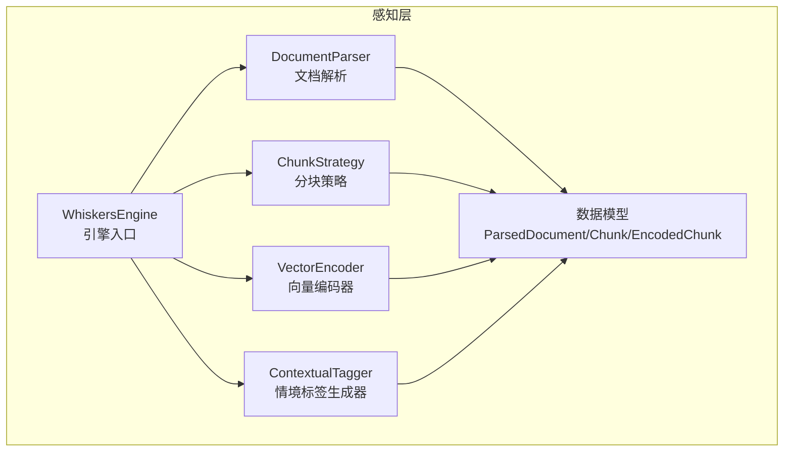
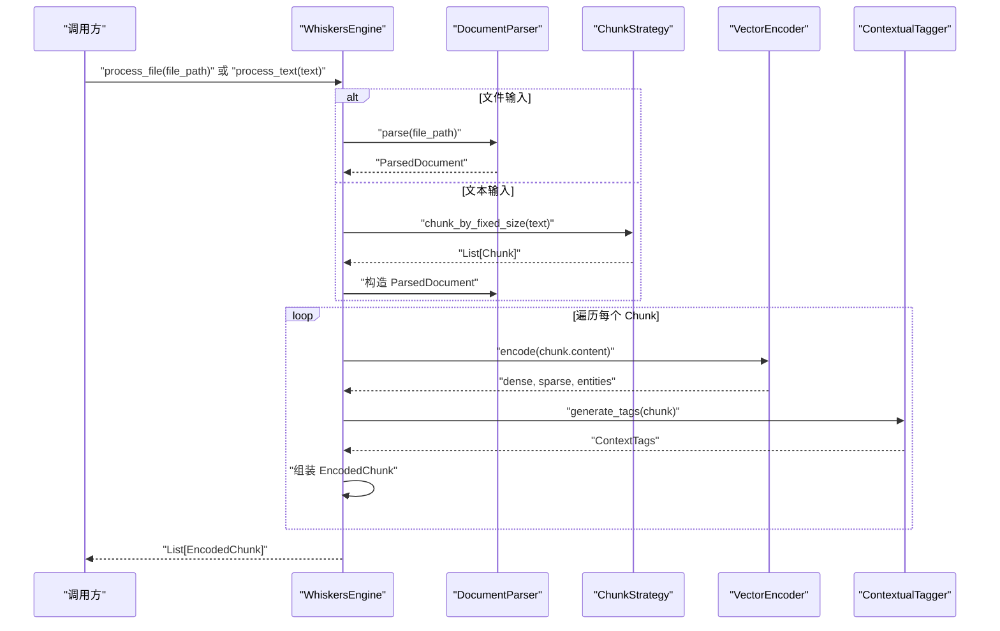
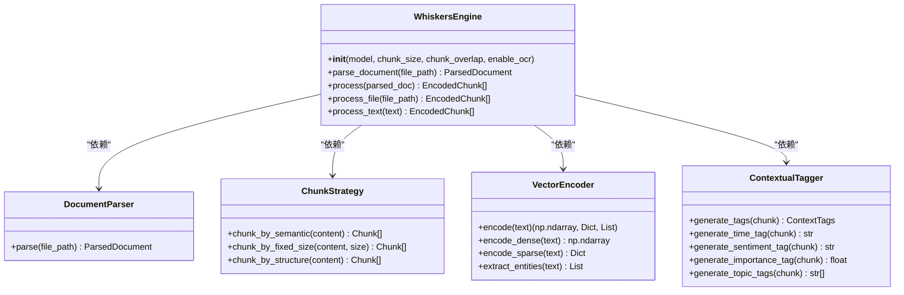
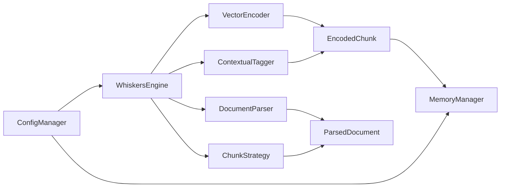

# 引擎核心

<cite>
**本文引用的文件**
- [src/whiskers/engine.py](file://src/whiskers/engine.py)
- [src/whiskers/__init__.py](file://src/whiskers/__init__.py)
- [src/whiskers/models.py](file://src/whiskers/models.py)
- [src/whiskers/chunker.py](file://src/whiskers/chunker.py)
- [src/whiskers/encoder.py](file://src/whiskers/encoder.py)
- [src/whiskers/parser.py](file://src/whiskers/parser.py)
- [src/whiskers/tagger.py](file://src/whiskers/tagger.py)
- [src/whiskers/README.md](file://src/whiskers/README.md)
- [example/example_usage.py](file://example/example_usage.py)
- [src/__init__.py](file://src/__init__.py)
- [src/dashboard/config_manager.py](file://src/dashboard/config_manager.py)
- [src/dashboard/models.py](file://src/dashboard/models.py)
- [src/dashboard/README.md](file://src/dashboard/README.md)
- [src/memory/manager.py](file://src/memory/manager.py)
- [src/memory/working_memory.py](file://src/memory/working_memory.py)
- [src/memory/decay.py](file://src/memory/decay.py)
</cite>

## 目录
1. [简介](#简介)
2. [项目结构](#项目结构)
3. [核心组件](#核心组件)
4. [架构总览](#架构总览)
5. [详细组件分析](#详细组件分析)
6. [依赖分析](#依赖分析)
7. [性能考虑](#性能考虑)
8. [故障排查指南](#故障排查指南)
9. [结论](#结论)
10. [附录](#附录)

## 简介
本文件面向 Whiskers Engine（胡须感知引擎）核心模块，系统性阐述其整体架构设计、组件协调机制与数据流管理。文档覆盖引擎初始化流程、模块间通信协议、错误处理机制与性能监控策略；同时提供配置管理、资源调度、并发处理与扩展性设计要点，并给出完整的 API 参考、配置参数说明与实际使用示例，解释该引擎在 NecoRAG 整体系统中的核心作用与与其他模块的集成关系。

## 项目结构
Whiskers Engine 位于感知层，负责多模态数据的高精度编码与情境标记，是 NecoRAG 的“感知前端”。其核心由以下子模块组成：
- 文档解析器：统一解析多种格式文档，产出结构化文档对象
- 分块策略：将长文本切分为可向量化的小块
- 向量编码器：生成稠密向量、稀疏向量与实体三元组
- 情境标签生成器：为每个文本块附加时间、情感、重要性、主题等标签
- 数据模型：统一的数据结构定义，贯穿全链路

图表来源
- [src/whiskers/engine.py:14-129](file://src/whiskers/engine.py#L14-L129)
- [src/whiskers/parser.py:11-111](file://src/whiskers/parser.py#L11-L111)
- [src/whiskers/chunker.py:10-97](file://src/whiskers/chunker.py#L10-L97)
- [src/whiskers/tagger.py:10-143](file://src/whiskers/tagger.py#L10-L143)
- [src/whiskers/encoder.py:11-97](file://src/whiskers/encoder.py#L11-L97)
- [src/whiskers/models.py:11-68](file://src/whiskers/models.py#L11-L68)

章节来源
- [src/whiskers/engine.py:14-129](file://src/whiskers/engine.py#L14-L129)
- [src/whiskers/__init__.py:13-22](file://src/whiskers/__init__.py#L13-L22)

## 核心组件
- WhiskersEngine：引擎主类，编排解析、分块、编码、打标流程，提供一站式处理接口
- DocumentParser：文档解析器，负责将多种格式文档转换为统一结构化表示
- ChunkStrategy：分块策略，支持语义分块、固定大小分块、结构化分块
- VectorEncoder：向量编码器，生成稠密向量、稀疏向量与实体三元组
- ContextualTagger：情境标签生成器，为每个文本块生成时间、情感、重要性、主题标签
- 数据模型：Chunk、ContextTags、EncodedChunk、Table、Image、ParsedDocument

章节来源
- [src/whiskers/engine.py:14-129](file://src/whiskers/engine.py#L14-L129)
- [src/whiskers/parser.py:11-111](file://src/whiskers/parser.py#L11-L111)
- [src/whiskers/chunker.py:10-97](file://src/whiskers/chunker.py#L10-L97)
- [src/whiskers/encoder.py:11-97](file://src/whiskers/encoder.py#L11-L97)
- [src/whiskers/tagger.py:10-143](file://src/whiskers/tagger.py#L10-L143)
- [src/whiskers/models.py:11-68](file://src/whiskers/models.py#L11-L68)

## 架构总览
Whiskers Engine 的处理管线如下：
- 输入：文件路径或纯文本
- 输出：编码后的文本块列表，包含稠密向量、稀疏向量、实体三元组与情境标签
- 关键步骤：解析 → 分块 → 编码 → 打标 → 组装输出

图表来源
- [src/whiskers/engine.py:42-129](file://src/whiskers/engine.py#L42-L129)
- [src/whiskers/parser.py:27-59](file://src/whiskers/parser.py#L27-L59)
- [src/whiskers/chunker.py:58-82](file://src/whiskers/chunker.py#L58-L82)
- [src/whiskers/encoder.py:28-42](file://src/whiskers/encoder.py#L28-L42)
- [src/whiskers/tagger.py:32-47](file://src/whiskers/tagger.py#L32-L47)

## 详细组件分析

### WhiskersEngine 类
- 职责：编排感知层处理流程，提供 parse_document/process/process_file/process_text 等高层接口
- 初始化参数：
  - model：向量化模型名称
  - chunk_size：分块大小
  - chunk_overlap：分块重叠长度
  - enable_ocr：是否启用 OCR
- 关键方法：
  - parse_document：委托 DocumentParser 解析文档
  - process：遍历已解析的 Chunk，执行编码与情境打标，组装 EncodedChunk
  - process_file：一站式处理（解析 → 编码 → 打标）
  - process_text：对纯文本进行分块后处理

图表来源
- [src/whiskers/engine.py:14-129](file://src/whiskers/engine.py#L14-L129)
- [src/whiskers/parser.py:11-111](file://src/whiskers/parser.py#L11-L111)
- [src/whiskers/chunker.py:10-97](file://src/whiskers/chunker.py#L10-L97)
- [src/whiskers/encoder.py:11-97](file://src/whiskers/encoder.py#L11-L97)
- [src/whiskers/tagger.py:10-143](file://src/whiskers/tagger.py#L10-L143)

章节来源
- [src/whiskers/engine.py:21-129](file://src/whiskers/engine.py#L21-L129)

### DocumentParser（文档解析器）
- 职责：将多种格式文档统一解析为 ParsedDocument，包含内容、分块、表格、图片与元数据
- 关键点：
  - 支持启用 OCR（通过构造函数参数）
  - 当前最小实现为读取文本文件并简单分块
  - 提供表格与图片提取接口（待实现）

章节来源
- [src/whiskers/parser.py:11-111](file://src/whiskers/parser.py#L11-L111)

### ChunkStrategy（分块策略）
- 职责：将长文本切分为多个 Chunk，便于后续向量化与情境打标
- 支持策略：
  - 语义分块：按段落等语义边界切分
  - 固定大小分块：按指定长度与重叠切分
  - 结构化分块：基于标题、段落等结构信息切分
- 关键点：当前最小实现采用按段落切分与固定大小切分

章节来源
- [src/whiskers/chunker.py:10-97](file://src/whiskers/chunker.py#L10-L97)

### VectorEncoder（向量编码器）
- 职责：为文本生成多类型向量表示与实体三元组
- 输出：
  - 稠密向量：高维语义表示
  - 稀疏向量：关键词权重
  - 实体三元组：主体-关系-客体
- 关键点：当前最小实现返回随机稠密向量、简单词频稀疏向量与空实体列表（预留模型集成接口）

章节来源
- [src/whiskers/encoder.py:11-97](file://src/whiskers/encoder.py#L11-L97)

### ContextualTagger（情境标签生成器）
- 职责：为每个 Chunk 生成情境标签，模拟猫胡须对环境微变化的感知
- 标签类型：
  - 时间标签：基于元数据推断
  - 情感标签：基于关键词匹配
  - 重要性评分：基于信息密度与长度因子
  - 主题标签：基于高频词提取
- 关键点：当前最小实现采用启发式规则（预留模型集成接口）

章节来源
- [src/whiskers/tagger.py:10-143](file://src/whiskers/tagger.py#L10-L143)

### 数据模型
- Chunk：文本块，包含内容、索引、起止位置与元数据
- ContextTags：情境标签，包含时间、情感、重要性评分与主题标签
- EncodedChunk：编码后的文本块，包含向量、实体、情境标签与元数据
- Table/Image：表格与图片数据
- ParsedDocument：解析后的文档，包含文件路径、内容、分块、表格、图片与元数据

章节来源
- [src/whiskers/models.py:11-68](file://src/whiskers/models.py#L11-L68)

## 依赖分析
- 模块内聚与耦合：
  - WhiskersEngine 作为编排者，依赖四个子模块；子模块之间保持低耦合
  - 数据模型在各模块间共享，形成清晰的数据契约
- 外部依赖：
  - 向量化模型（如 BGE-M3）、OCR、实体识别、情感分析等（当前最小实现为占位）
- 集成点：
  - 与 Memory 层：EncodedChunk 作为知识单元进入记忆管理
  - 与 Dashboard：通过配置管理器加载/切换 Profile，驱动各模块参数

图表来源
- [src/whiskers/engine.py:37-40](file://src/whiskers/engine.py#L37-L40)
- [src/whiskers/models.py:31-68](file://src/whiskers/models.py#L31-L68)
- [src/dashboard/config_manager.py:14-41](file://src/dashboard/config_manager.py#L14-L41)
- [src/memory/manager.py:138-167](file://src/memory/manager.py#L138-L167)

章节来源
- [src/whiskers/engine.py:37-40](file://src/whiskers/engine.py#L37-L40)
- [src/dashboard/config_manager.py:14-41](file://src/dashboard/config_manager.py#L14-L41)
- [src/memory/manager.py:138-167](file://src/memory/manager.py#L138-L167)

## 性能考虑
- 处理速度（最小实现指标）：
  - 文档解析速度：约 10-20 页/秒（PDF）
  - 向量化速度：约 1000 chunks/秒（GPU）
  - 标签生成速度：约 500 chunks/秒
- 优化建议：
  - 并发处理：对独立 Chunk 的编码与打标可并行化
  - 批量化：对编码与检索阶段采用批处理提升吞吐
  - 缓存策略：对常用向量与标签进行缓存
  - 资源调度：根据硬件能力动态调整分块大小与重叠
- 监控策略：
  - 记录每步耗时（解析、分块、编码、打标）
  - 统计向量维度与标签覆盖率
  - 观察内存占用与 GPU 利用率

章节来源
- [src/whiskers/README.md:131-136](file://src/whiskers/README.md#L131-L136)

## 故障排查指南
- 常见问题与定位：
  - 文件不存在：DocumentParser 在解析阶段抛出文件未找到异常
  - 向量维度不一致：检查向量编码器模型与维度配置
  - 标签为空：确认情境标签生成器的阈值与关键词库
- 错误处理机制：
  - 解析阶段：对外暴露明确的异常信息，便于上层捕获与降级
  - 编码阶段：最小实现返回随机向量，保证流程可用但需替换真实模型
  - 打标阶段：最小实现返回启发式标签，建议接入真实模型
- 建议的调试步骤：
  - 逐阶段打印中间产物（ParsedDocument、Chunk、EncodedChunk）
  - 对比不同分块策略的效果
  - 校验配置参数与实际行为的一致性

章节来源
- [src/whiskers/parser.py:41-42](file://src/whiskers/parser.py#L41-L42)
- [src/whiskers/encoder.py:54-58](file://src/whiskers/encoder.py#L54-L58)
- [src/whiskers/tagger.py:76-92](file://src/whiskers/tagger.py#L76-L92)

## 结论
Whiskers Engine 以清晰的模块化设计实现了从多模态输入到高精度编码与情境标记的完整感知链路。其编排式的处理流程、可替换的子模块与统一的数据模型，为后续集成真实模型与扩展能力提供了良好基础。结合 Dashboard 的配置管理与 Memory 层的存储检索，Whiskers Engine 在 NecoRAG 中承担着“感知前端”的关键角色，是高质量知识构建与下游检索增强生成的基础。

## 附录

### API 参考
- WhiskersEngine
  - 构造函数：接收 model、chunk_size、chunk_overlap、enable_ocr
  - parse_document(file_path) → ParsedDocument
  - process(parsed_doc) → List[EncodedChunk]
  - process_file(file_path) → List[EncodedChunk]
  - process_text(text) → List[EncodedChunk]
- DocumentParser
  - parse(file_path) → ParsedDocument
  - extract_tables(content) → List[Table]
  - extract_images(content) → List[Image]
- ChunkStrategy
  - chunk_by_semantic(content) → List[Chunk]
  - chunk_by_fixed_size(content, size=None) → List[Chunk]
  - chunk_by_structure(content) → List[Chunk]
- VectorEncoder
  - encode(text) → (np.ndarray, Dict, List)
  - encode_dense(text) → np.ndarray
  - encode_sparse(text) → Dict
  - extract_entities(text) → List
- ContextualTagger
  - generate_tags(chunk) → ContextTags
  - generate_time_tag(chunk) → str
  - generate_sentiment_tag(chunk) → str
  - generate_importance_tag(chunk) → float
  - generate_topic_tags(chunk) → List[str]

章节来源
- [src/whiskers/engine.py:21-129](file://src/whiskers/engine.py#L21-L129)
- [src/whiskers/parser.py:27-89](file://src/whiskers/parser.py#L27-L89)
- [src/whiskers/chunker.py:28-97](file://src/whiskers/chunker.py#L28-L97)
- [src/whiskers/encoder.py:28-97](file://src/whiskers/encoder.py#L28-L97)
- [src/whiskers/tagger.py:32-143](file://src/whiskers/tagger.py#L32-L143)

### 配置参数说明
- Whiskers Engine
  - chunk_size：文本分块大小（字符数）
  - chunk_overlap：分块重叠长度（字符数）
  - enable_ocr：是否启用 OCR
  - model：向量化模型名称
  - vector_size：向量维度
- Memory
  - l1_ttl：L1 记忆 TTL（秒）
  - decay_rate：记忆衰减速率
  - archive_threshold：归档阈值
- Retrieval
  - top_k：检索数量
  - pounce_threshold：扑击阈值
  - hyde_enabled：是否启用 HyDE
- Purr
  - default_tone：默认语气
  - default_detail_level：默认详细程度

章节来源
- [src/dashboard/README.md:339-365](file://src/dashboard/README.md#L339-L365)
- [src/dashboard/models.py:66-91](file://src/dashboard/models.py#L66-L91)

### 实际使用示例
- 基础使用：初始化引擎，处理文本，获取编码块与情境标签
- 与记忆层协作：将编码块存储至 MemoryManager，执行检索与巩固
- 与 Dashboard 集成：通过 ConfigManager 加载活动 Profile，按需切换配置

章节来源
- [example/example_usage.py:12-47](file://example/example_usage.py#L12-L47)
- [example/example_usage.py:50-91](file://example/example_usage.py#L50-L91)
- [example/example_usage.py:94-136](file://example/example_usage.py#L94-L136)
- [src/dashboard/README.md:232-251](file://src/dashboard/README.md#L232-L251)

### 引擎在系统中的核心作用与集成关系
- 核心作用：将多模态输入转化为可检索、可推理的知识单元（EncodedChunk），为检索与生成提供高质量语义基础
- 集成关系：
  - 与 Memory 层：编码后的知识单元进入分层存储，支持检索与巩固
  - 与 Dashboard：通过配置管理器实现多环境、多版本配置的快速切换
  - 与检索层：为检索器提供向量与标签，辅助重排序与路径追踪
  - 与交互层：为 Purr Interface 提供情境自适应响应所需的上下文与偏好信息

章节来源
- [src/__init__.py:9-25](file://src/__init__.py#L9-L25)
- [src/dashboard/config_manager.py:14-41](file://src/dashboard/config_manager.py#L14-L41)
- [src/memory/manager.py:138-167](file://src/memory/manager.py#L138-L167)
- [src/memory/working_memory.py:11-61](file://src/memory/working_memory.py#L11-L61)
- [src/memory/decay.py:104-154](file://src/memory/decay.py#L104-L154)