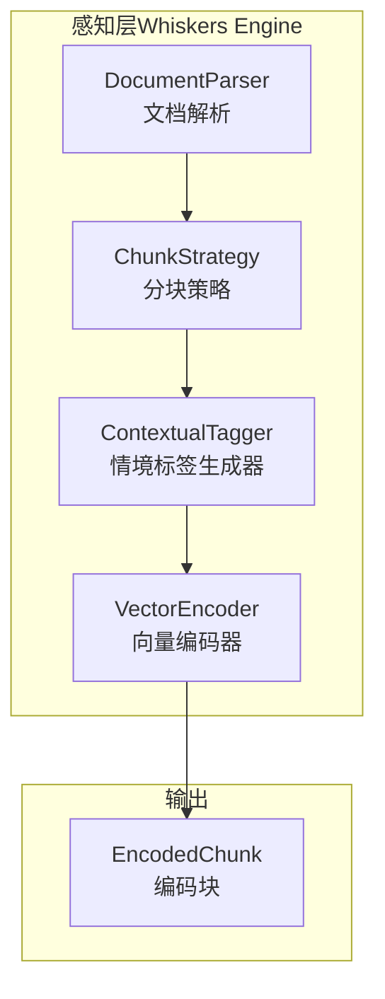
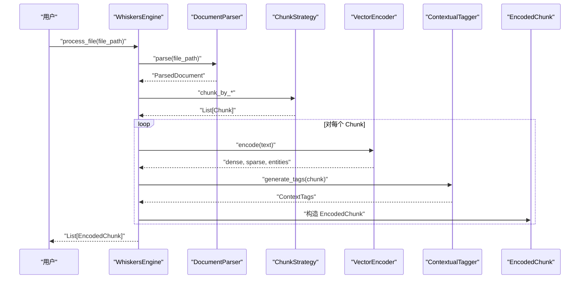
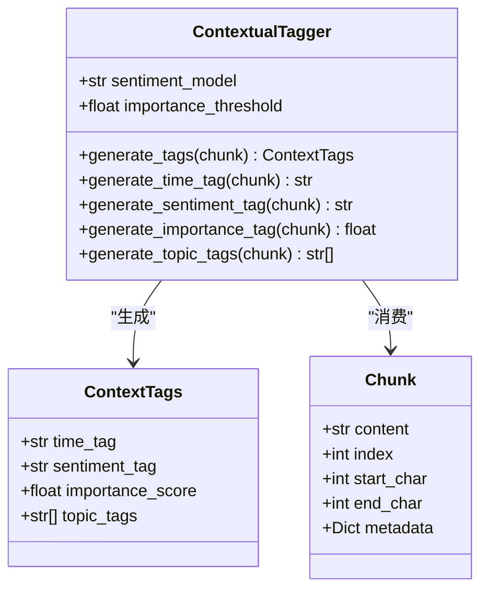
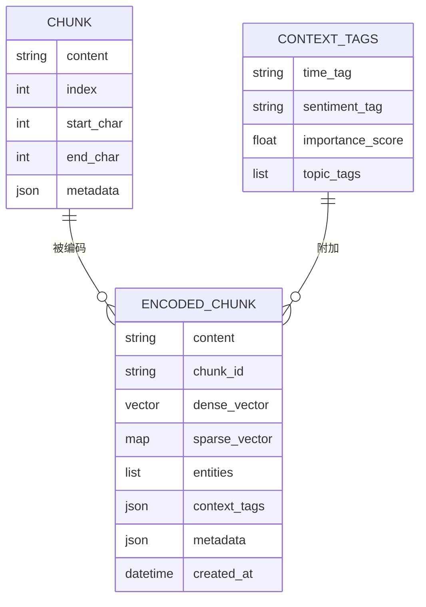
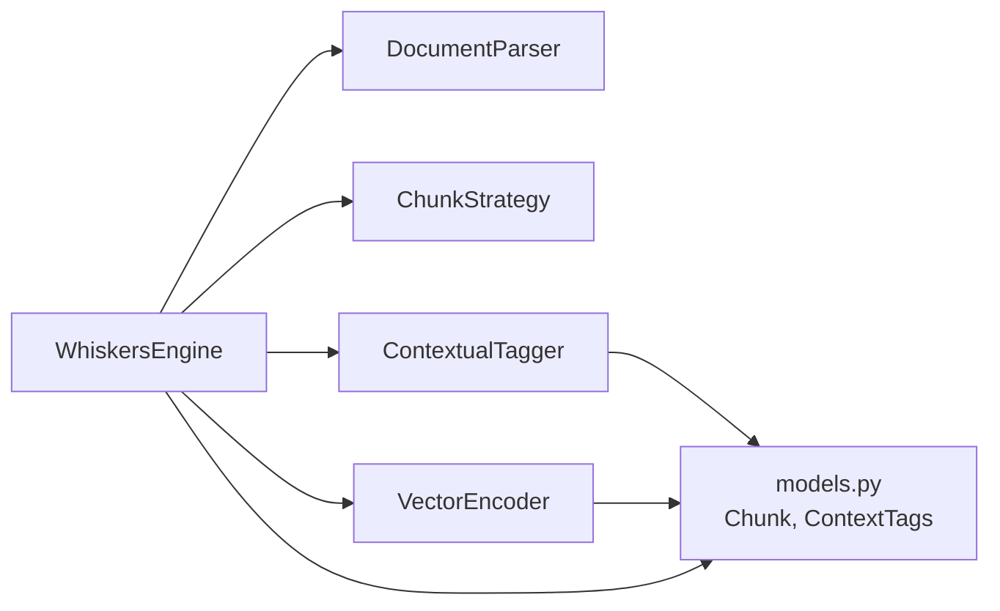

# 情境标签生成器

<cite>
**本文档引用的文件**
- [src/whiskers/tagger.py](file://src/whiskers/tagger.py)
- [src/whiskers/models.py](file://src/whiskers/models.py)
- [src/whiskers/engine.py](file://src/whiskers/engine.py)
- [src/whiskers/encoder.py](file://src/whiskers/encoder.py)
- [src/whiskers/chunker.py](file://src/whiskers/chunker.py)
- [src/whiskers/parser.py](file://src/whiskers/parser.py)
- [src/whiskers/README.md](file://src/whiskers/README.md)
- [example/example_usage.py](file://example/example_usage.py)
- [requirements.txt](file://requirements.txt)
- [docs/README.md](file://docs/README.md)
</cite>

## 目录
1. [简介](#简介)
2. [项目结构](#项目结构)
3. [核心组件](#核心组件)
4. [架构总览](#架构总览)
5. [详细组件分析](#详细组件分析)
6. [依赖分析](#依赖分析)
7. [性能考虑](#性能考虑)
8. [故障排除指南](#故障排除指南)
9. [结论](#结论)
10. [附录](#附录)

## 简介
本文件面向情境标签生成器模块，围绕 ContextualTagger 类展开，系统阐述其在 Whiskers Engine 中的定位与职责，重点解释时间标签、情感标签、重要性标签与主题标签的生成策略与实现思路。同时结合多模态特征融合、上下文感知技术以及标签质量评估方法，给出标签体系设计、权重计算、实时处理能力与扩展性设计的完整说明，并提供 API 参考、配置参数与实际使用示例，帮助读者理解情境标签如何提升检索精度与用户体验。

## 项目结构
Whiskers Engine 是 NecoRAG 感知层的核心，负责文档解析、分块、向量化与情境标签生成。情境标签生成器位于感知层的中间阶段，承接分块后的文本块，输出包含时间、情感、重要性与主题的上下文标签，供后续检索与交互层使用。

图表来源
- [src/whiskers/engine.py:54-90](file://src/whiskers/engine.py#L54-L90)
- [src/whiskers/parser.py:27-59](file://src/whiskers/parser.py#L27-L59)
- [src/whiskers/chunker.py:28-56](file://src/whiskers/chunker.py#L28-L56)
- [src/whiskers/tagger.py:32-47](file://src/whiskers/tagger.py#L32-L47)
- [src/whiskers/encoder.py:28-42](file://src/whiskers/encoder.py#L28-L42)

章节来源
- [src/whiskers/README.md:1-158](file://src/whiskers/README.md#L1-L158)
- [src/whiskers/engine.py:14-41](file://src/whiskers/engine.py#L14-L41)

## 核心组件
- ContextualTagger：情境标签生成器，负责为每个 Chunk 生成时间、情感、重要性与主题标签。
- EncodedChunk：编码块，承载文本内容、向量表示与情境标签。
- WhiskersEngine：编排器，串联解析、分块、编码与打标流程。

章节来源
- [src/whiskers/tagger.py:10-47](file://src/whiskers/tagger.py#L10-L47)
- [src/whiskers/models.py:21-41](file://src/whiskers/models.py#L21-L41)
- [src/whiskers/engine.py:14-41](file://src/whiskers/engine.py#L14-L41)

## 架构总览
Whiskers Engine 的处理流程如下：解析文档 → 分块 → 向量化 → 情境标签生成 → 输出编码块。情境标签生成器在编码之前运行，为后续检索与交互提供上下文增强信号。

图表来源
- [src/whiskers/engine.py:92-106](file://src/whiskers/engine.py#L92-L106)
- [src/whiskers/engine.py:54-90](file://src/whiskers/engine.py#L54-L90)
- [src/whiskers/parser.py:27-59](file://src/whiskers/parser.py#L27-L59)
- [src/whiskers/chunker.py:28-56](file://src/whiskers/chunker.py#L28-L56)
- [src/whiskers/encoder.py:28-42](file://src/whiskers/encoder.py#L28-L42)
- [src/whiskers/tagger.py:32-47](file://src/whiskers/tagger.py#L32-L47)

## 详细组件分析

### ContextualTagger 类分析
ContextualTagger 是情境标签生成器的核心类，提供四类标签的生成方法：时间标签、情感标签、重要性标签与主题标签。当前实现采用“最小可行实现”，为后续集成真实模型预留扩展点。

图表来源
- [src/whiskers/tagger.py:10-144](file://src/whiskers/tagger.py#L10-L144)
- [src/whiskers/models.py:21-28](file://src/whiskers/models.py#L21-L28)

章节来源
- [src/whiskers/tagger.py:10-144](file://src/whiskers/tagger.py#L10-L144)
- [src/whiskers/models.py:21-28](file://src/whiskers/models.py#L21-L28)

#### 时间标签生成策略
- 当前实现：从 Chunk 的元数据中读取创建时间，若存在则生成形如“created:YYYY-MM-DD”的时间标签；否则返回“unknown”。
- 上下文感知：利用文档元数据中的时间戳，体现内容的时效性与更新频率。
- 扩展建议：集成实体识别模型抽取自然语言时间表达式，或结合外部时间库进行标准化。

章节来源
- [src/whiskers/tagger.py:49-64](file://src/whiskers/tagger.py#L49-L64)

#### 情感标签生成策略
- 当前实现：基于关键词集合进行简单计数比较，输出“positive”、“negative”或“neutral”。
- 上下文感知：通过正负向词汇密度反映文本的情绪倾向。
- 扩展建议：集成预训练情感分析模型（如 transformers），支持多语言与细粒度情感强度。

章节来源
- [src/whiskers/tagger.py:66-92](file://src/whiskers/tagger.py#L66-L92)

#### 重要性标签生成策略
- 当前实现：综合词多样性与文本长度，归一化后取平均，得到 0-1 的重要性评分。
- 上下文感知：信息密度越高、长度适中时，重要性越高；过短或重复过多会降低评分。
- 扩展建议：引入 TF-IDF、关键句提取、摘要质量指标等，结合领域词典提升准确性。

章节来源
- [src/whiskers/tagger.py:94-119](file://src/whiskers/tagger.py#L94-L119)

#### 主题标签生成策略
- 当前实现：过滤短词后统计词频，返回出现频率最高的若干词作为主题标签。
- 上下文感知：高频词通常代表文档的核心话题。
- 扩展建议：集成主题模型（如 LDA）、关键词抽取（TextRank、YAKE）或实体分类，提升主题代表性。

章节来源
- [src/whiskers/tagger.py:121-143](file://src/whiskers/tagger.py#L121-L143)

#### 多模态特征融合与上下文感知
- 多模态融合：当前实现主要基于文本内容；未来可融合 OCR 提取的视觉文本、表格结构与图片 caption，形成更丰富的上下文。
- 上下文感知：通过 Chunk 的位置信息（index、start_char、end_char）与元数据（metadata），结合时间标签，构建“时空上下文”。

章节来源
- [src/whiskers/models.py:11-19](file://src/whiskers/models.py#L11-L19)
- [src/whiskers/tagger.py:49-64](file://src/whiskers/tagger.py#L49-L64)

#### 标签质量评估
- 当前评估：通过人工检查与简单统计（如词频分布、情感词比例）进行粗略评估。
- 建议指标：与标准数据集对比（如情感分类准确率、主题一致性 Coherence），或引入可解释性指标（如注意力权重、关键词覆盖率）。

章节来源
- [src/whiskers/tagger.py:66-92](file://src/whiskers/tagger.py#L66-L92)
- [src/whiskers/tagger.py:94-119](file://src/whiskers/tagger.py#L94-L119)
- [src/whiskers/tagger.py:121-143](file://src/whiskers/tagger.py#L121-L143)

### 数据模型与输出
- EncodedChunk：在编码完成后封装内容、向量、实体与情境标签，便于下游检索与交互使用。
- ContextTags：集中承载情境标签，便于统一访问与扩展。

图表来源
- [src/whiskers/models.py:11-41](file://src/whiskers/models.py#L11-L41)

章节来源
- [src/whiskers/models.py:11-41](file://src/whiskers/models.py#L11-L41)

### API 参考
- ContextualTagger
  - 构造函数：接收情感模型标识与重要性阈值
  - generate_tags(chunk): 生成完整情境标签
  - generate_time_tag(chunk): 生成时间标签
  - generate_sentiment_tag(chunk): 生成情感标签
  - generate_importance_tag(chunk): 生成重要性评分
  - generate_topic_tags(chunk): 生成主题标签列表

章节来源
- [src/whiskers/tagger.py:17-47](file://src/whiskers/tagger.py#L17-L47)

### 配置参数说明
- WhiskersEngine 初始化参数
  - model: 向量化模型名称（默认 BGE-M3）
  - chunk_size: 分块大小（默认 512）
  - chunk_overlap: 分块重叠长度（默认 50）
  - enable_ocr: 是否启用 OCR（默认 True）

- ContextualTagger 初始化参数
  - sentiment_model: 情感分析模型标识（默认 default）
  - importance_threshold: 重要性阈值（默认 0.5）

章节来源
- [src/whiskers/engine.py:21-41](file://src/whiskers/engine.py#L21-L41)
- [src/whiskers/tagger.py:17-30](file://src/whiskers/tagger.py#L17-L30)

### 实际使用示例
- 基础用法：通过 WhiskersEngine.process_text 或 process_file 获取 EncodedChunk 列表，其中包含 context_tags。
- 示例脚本展示了如何初始化引擎、处理文本、访问情境标签与向量维度。

章节来源
- [example/example_usage.py:12-47](file://example/example_usage.py#L12-L47)
- [src/whiskers/engine.py:108-129](file://src/whiskers/engine.py#L108-L129)

## 依赖分析
- 内部依赖
  - WhiskersEngine 依赖 DocumentParser、ChunkStrategy、ContextualTagger、VectorEncoder。
  - ContextualTagger 依赖 Chunk 与 ContextTags 数据模型。
- 外部依赖
  - numpy：向量运算与数组操作。
  - 可选依赖：RAGFlow（文档解析）、BGE-M3（向量化）、spaCy/transformers（情感与实体分析）。

图表来源
- [src/whiskers/engine.py:14-41](file://src/whiskers/engine.py#L14-L41)
- [src/whiskers/tagger.py:6-7](file://src/whiskers/tagger.py#L6-L7)
- [src/whiskers/models.py:5-8](file://src/whiskers/models.py#L5-L8)

章节来源
- [requirements.txt:4-47](file://requirements.txt#L4-L47)
- [src/whiskers/engine.py:14-41](file://src/whiskers/engine.py#L14-L41)

## 性能考虑
- 当前实现为最小可行实现，适合原型与演示场景。
- 优化方向
  - 将情感分析与实体抽取替换为轻量级模型，减少推理延迟。
  - 对重要性评分与主题标签采用缓存策略，避免重复计算。
  - 在批量处理时并行化标签生成，提升吞吐量。
- 性能指标（来自文档）
  - 标签生成速度：约 500 chunks/秒（CPU）。
  - 向量化速度：约 1000 chunks/秒（GPU）。

章节来源
- [src/whiskers/README.md:131-136](file://src/whiskers/README.md#L131-L136)

## 故障排除指南
- 情感标签恒为 neutral
  - 检查输入文本是否包含情感词集合；必要时调整关键词集合或切换到真实情感模型。
- 重要性评分偏低
  - 确认文本长度与词多样性；过短或重复文本会导致评分偏低。
- 时间标签为 unknown
  - 确保 Chunk.metadata 包含创建时间字段；否则需在上游填充元数据。
- 主题标签无意义
  - 调整过滤短词阈值或引入更高级的主题抽取算法。

章节来源
- [src/whiskers/tagger.py:66-92](file://src/whiskers/tagger.py#L66-L92)
- [src/whiskers/tagger.py:94-119](file://src/whiskers/tagger.py#L94-L119)
- [src/whiskers/tagger.py:49-64](file://src/whiskers/tagger.py#L49-L64)
- [src/whiskers/tagger.py:121-143](file://src/whiskers/tagger.py#L121-L143)

## 结论
情境标签生成器通过时间、情感、重要性与主题四个维度为文本块提供上下文增强，为后续检索与交互提供高质量信号。当前实现以“最小可行实现”为基础，具备良好的扩展性与可维护性。建议在生产环境中逐步替换为真实模型与算法，以获得更高的准确性与鲁棒性，并结合缓存与并行化策略提升整体性能。

## 附录

### 标签体系设计
- 时间标签：体现内容时效性，支持检索时按时间范围过滤。
- 情感标签：辅助检索时的情绪匹配与个性化推荐。
- 重要性标签：用于排序与剪枝，提高检索效率与相关性。
- 主题标签：用于聚类、分类与检索扩展。

章节来源
- [src/whiskers/README.md:22-27](file://src/whiskers/README.md#L22-L27)

### 标签权重计算
- 当前实现未引入显式的加权策略；建议在检索阶段结合标签权重与向量相似度进行加权融合，例如：
  - 综合分数 = α × 向量相似度 + β × 情感匹配度 + γ × 重要性权重 + δ × 主题权重
  - 权重系数可通过实验调优或在线学习确定。

章节来源
- [src/whiskers/tagger.py:94-119](file://src/whiskers/tagger.py#L94-L119)

### 实时处理能力与扩展性
- 实时处理：当前实现适合中小规模流式处理；建议在大规模场景中引入异步队列与批处理。
- 扩展性：支持自定义标签生成器、分块策略与向量编码器，便于按业务需求定制。

章节来源
- [src/whiskers/README.md:144-151](file://src/whiskers/README.md#L144-L151)