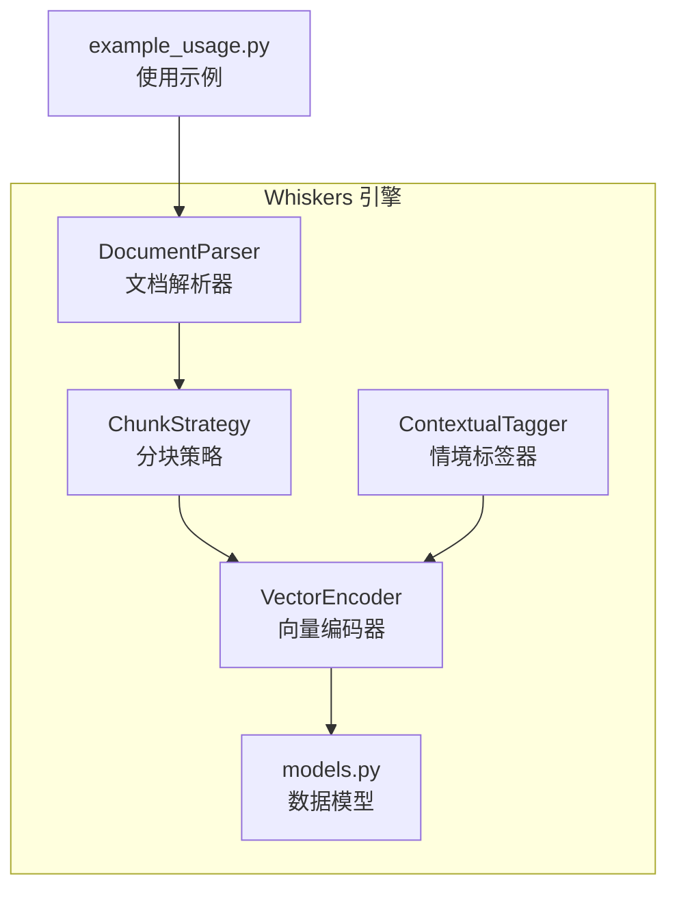
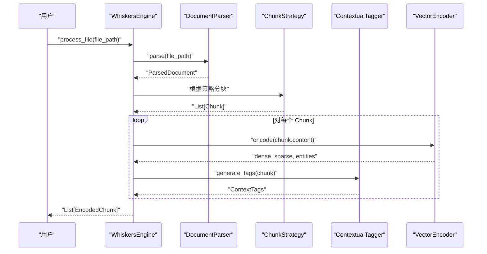
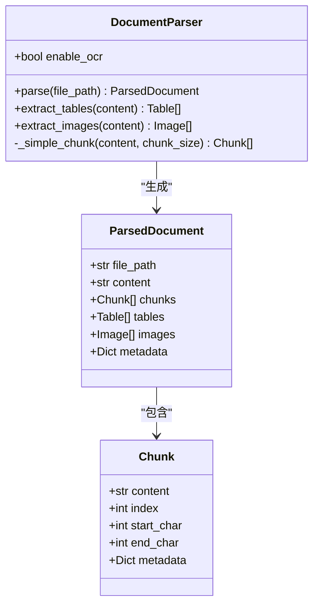
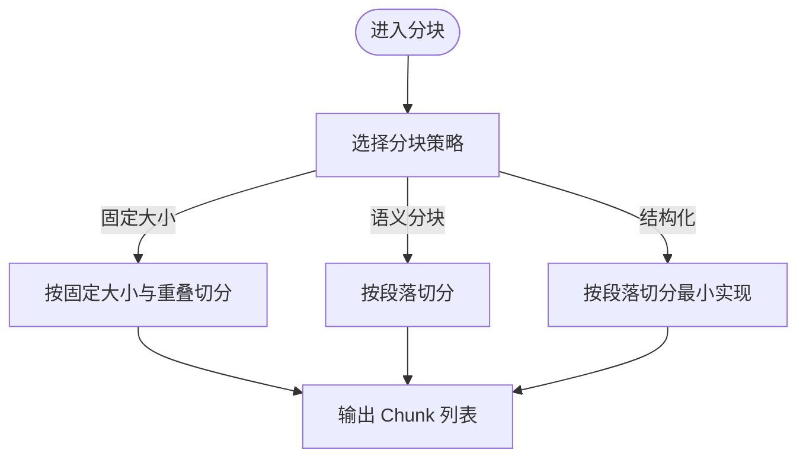
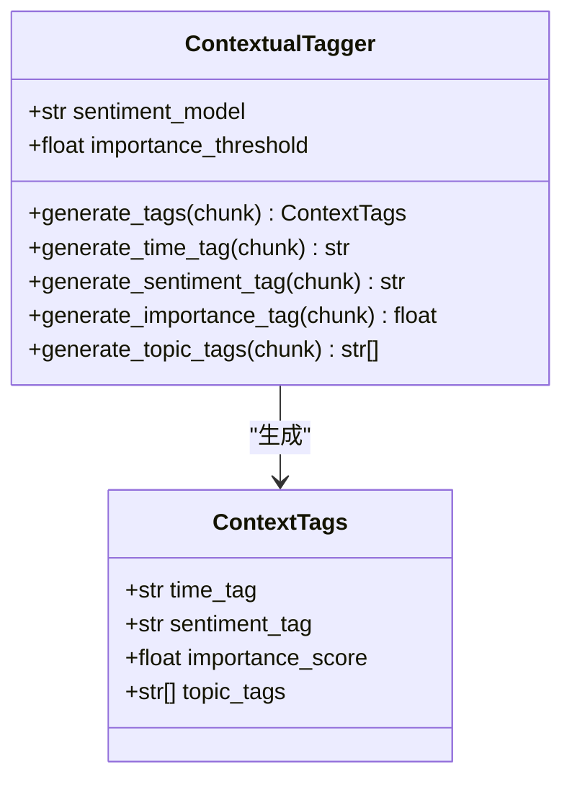
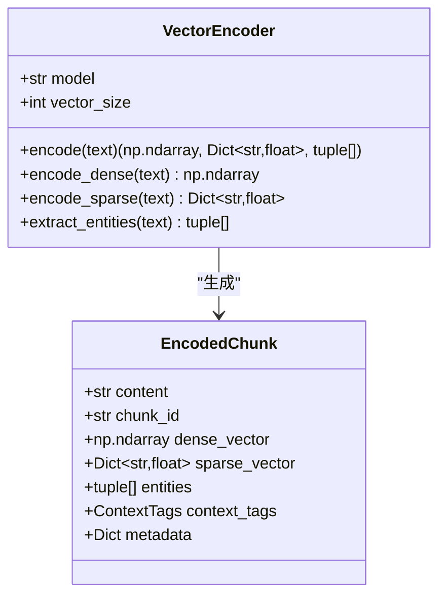
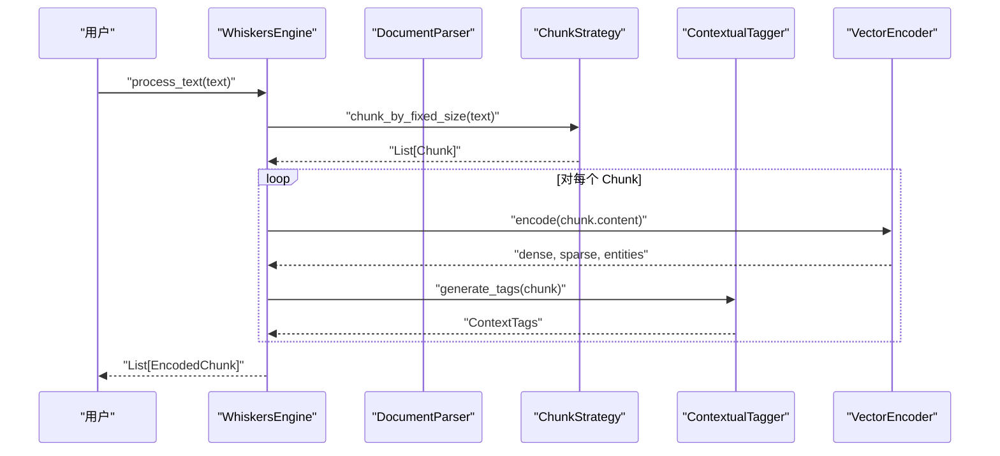
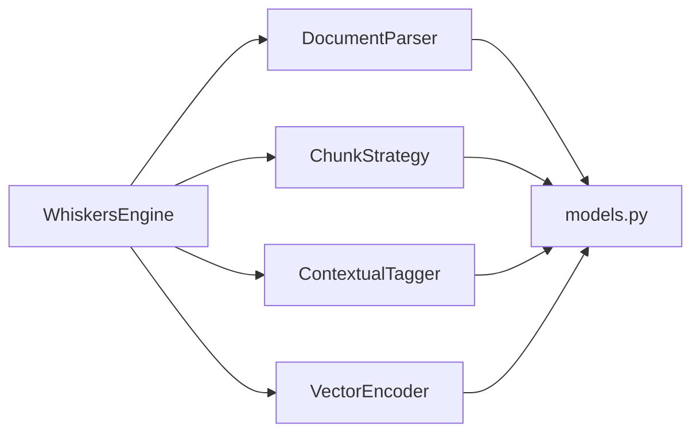

# 文档解析器

<cite>
**本文引用的文件**
- [src/whiskers/parser.py](file://src/whiskers/parser.py)
- [src/whiskers/engine.py](file://src/whiskers/engine.py)
- [src/whiskers/models.py](file://src/whiskers/models.py)
- [src/whiskers/chunker.py](file://src/whiskers/chunker.py)
- [src/whiskers/tagger.py](file://src/whiskers/tagger.py)
- [src/whiskers/encoder.py](file://src/whiskers/encoder.py)
- [src/whiskers/__init__.py](file://src/whiskers/__init__.py)
- [example/example_usage.py](file://example/example_usage.py)
- [requirements.txt](file://requirements.txt)
</cite>

## 目录
1. [简介](#简介)
2. [项目结构](#项目结构)
3. [核心组件](#核心组件)
4. [架构总览](#架构总览)
5. [详细组件分析](#详细组件分析)
6. [依赖分析](#依赖分析)
7. [性能考虑](#性能考虑)
8. [故障排查指南](#故障排查指南)
9. [结论](#结论)
10. [附录](#附录)

## 简介
本文件面向“文档解析器”模块，围绕 DocumentParser 类及其周边组件，系统阐述多格式文档处理能力（当前最小实现为文本读取）、RAGFlow 集成规划、OCR 光学字符识别能力预留、表格结构还原技术预留、文档层级分析算法预留，以及解析流程、错误处理、性能优化与扩展性设计。同时提供完整的 API 参考、配置参数说明与实际使用示例，并解释与 Whiskers 引擎及其他模块的集成关系与数据流转。

## 项目结构
Whiskers 引擎位于 src/whiskers 目录下，包含解析器、分块策略、情境标签器、向量编码器及数据模型；示例脚本 example/example_usage.py 展示了从解析到编码再到检索与交互的完整流程；requirements.txt 中标注了可选的外部依赖（如 RAGFlow、PDF/Word/HTML 解析库等）。

图表来源
- [src/whiskers/parser.py:11-111](file://src/whiskers/parser.py#L11-L111)
- [src/whiskers/engine.py:14-129](file://src/whiskers/engine.py#L14-L129)
- [src/whiskers/chunker.py:10-98](file://src/whiskers/chunker.py#L10-L98)
- [src/whiskers/tagger.py:10-144](file://src/whiskers/tagger.py#L10-L144)
- [src/whiskers/encoder.py:11-98](file://src/whiskers/encoder.py#L11-L98)
- [src/whiskers/models.py:11-69](file://src/whiskers/models.py#L11-L69)
- [example/example_usage.py:12-47](file://example/example_usage.py#L12-L47)

章节来源
- [src/whiskers/__init__.py:6-22](file://src/whiskers/__init__.py#L6-L22)
- [requirements.txt:12-16](file://requirements.txt#L12-L16)

## 核心组件
- DocumentParser：负责将输入文档解析为统一的结构化表示，当前最小实现为读取文本文件并进行简单分块；提供表格与图片提取的预留接口。
- ChunkStrategy：提供多种分块策略（语义分块、固定大小分块、结构化分块），当前以最小实现为主。
- ContextualTagger：为每个文本块生成情境标签（时间、情感、重要性、主题），当前以最小实现为主。
- VectorEncoder：生成稠密向量、稀疏向量与实体三元组，当前以最小实现为主。
- 数据模型：定义 Chunk、ContextTags、EncodedChunk、Table、Image、ParsedDocument 等数据结构。

章节来源
- [src/whiskers/parser.py:11-111](file://src/whiskers/parser.py#L11-L111)
- [src/whiskers/chunker.py:10-98](file://src/whiskers/chunker.py#L10-L98)
- [src/whiskers/tagger.py:10-144](file://src/whiskers/tagger.py#L10-L144)
- [src/whiskers/encoder.py:11-98](file://src/whiskers/encoder.py#L11-L98)
- [src/whiskers/models.py:11-69](file://src/whiskers/models.py#L11-L69)

## 架构总览
WhiskersEngine 将解析、分块、编码、打标串联为端到端流水线，支持从文件路径或纯文本输入。DocumentParser 的输出作为后续模块的输入，最终形成 EncodedChunk 列表供检索与交互使用。

图表来源
- [src/whiskers/engine.py:42-106](file://src/whiskers/engine.py#L42-L106)
- [src/whiskers/parser.py:27-59](file://src/whiskers/parser.py#L27-L59)
- [src/whiskers/chunker.py:58-82](file://src/whiskers/chunker.py#L58-L82)
- [src/whiskers/tagger.py:32-47](file://src/whiskers/tagger.py#L32-L47)
- [src/whiskers/encoder.py:28-42](file://src/whiskers/encoder.py#L28-L42)

## 详细组件分析

### DocumentParser 组件分析
- 职责：将多格式文档统一解析为 ParsedDocument；当前最小实现为读取文本文件并进行固定大小分块；预留表格与图片提取接口。
- 关键方法与行为
  - parse(file_path): 校验文件存在性，读取 UTF-8 文本，调用内部分块逻辑，构建 ParsedDocument。
  - extract_tables(content): 表格提取预留接口（当前返回空列表）。
  - extract_images(content): 图片提取与 OCR 预留接口（当前返回空列表）。
  - _simple_chunk(content, chunk_size): 固定大小分块，记录字符起止位置与索引。
- 错误处理：文件不存在抛出 FileNotFoundError。
- 扩展性：支持通过启用 OCR 参数控制 OCR 能力；TODO 注释提示集成 RAGFlow 进行深度解析。

图表来源
- [src/whiskers/parser.py:11-111](file://src/whiskers/parser.py#L11-L111)
- [src/whiskers/models.py:60-69](file://src/whiskers/models.py#L60-L69)

章节来源
- [src/whiskers/parser.py:18-59](file://src/whiskers/parser.py#L18-L59)
- [src/whiskers/parser.py:61-89](file://src/whiskers/parser.py#L61-L89)
- [src/whiskers/parser.py:91-111](file://src/whiskers/parser.py#L91-L111)

### 分块策略组件分析
- 职责：提供多种分块策略，当前以最小实现为主，便于后续替换为更复杂的算法。
- 关键方法与行为
  - chunk_by_semantic(content): 基于段落进行最小实现的语义分块。
  - chunk_by_fixed_size(content, size): 固定大小分块，默认使用 overlap 参数控制重叠。
  - chunk_by_structure(content): 结构化分块（当前最小实现为按段落分割）。
- 性能与复杂度：当前实现为 O(n) 线性扫描，空间开销与输出块数量线性相关。

图表来源
- [src/whiskers/chunker.py:28-82](file://src/whiskers/chunker.py#L28-L82)

章节来源
- [src/whiskers/chunker.py:17-26](file://src/whiskers/chunker.py#L17-L26)
- [src/whiskers/chunker.py:58-82](file://src/whiskers/chunker.py#L58-L82)

### 情境标签器组件分析
- 职责：为每个 Chunk 生成情境标签，包含时间标签、情感标签、重要性评分与主题标签。
- 关键方法与行为
  - generate_tags(chunk): 组合各类标签生成 ContextTags。
  - generate_time_tag(chunk): 基于元数据生成时间标签（最小实现）。
  - generate_sentiment_tag(chunk): 基于关键词统计判断情感（最小实现）。
  - generate_importance_tag(chunk): 基于长度与词汇多样性计算重要性（最小实现）。
  - generate_topic_tags(chunk): 基于高频词提取主题标签（最小实现）。
- 扩展性：TODO 注释提示集成情感分析模型、主题分类与实体识别。

图表来源
- [src/whiskers/tagger.py:10-144](file://src/whiskers/tagger.py#L10-L144)
- [src/whiskers/models.py:22-28](file://src/whiskers/models.py#L22-L28)

章节来源
- [src/whiskers/tagger.py:32-47](file://src/whiskers/tagger.py#L32-L47)
- [src/whiskers/tagger.py:49-92](file://src/whiskers/tagger.py#L49-L92)
- [src/whiskers/tagger.py:94-119](file://src/whiskers/tagger.py#L94-L119)
- [src/whiskers/tagger.py:121-143](file://src/whiskers/tagger.py#L121-L143)

### 向量编码器组件分析
- 职责：为文本生成多类型向量表示（稠密向量、稀疏向量、实体三元组）。
- 关键方法与行为
  - encode(text): 组合稠密、稀疏与实体编码。
  - encode_dense(text): 当前返回随机向量（最小实现）。
  - encode_sparse(text): 基于词频统计生成稀疏向量（最小实现）。
  - extract_entities(text): 实体三元组提取（最小实现）。
- 扩展性：TODO 注释提示集成 BGE-M3 等模型与实体识别/关系抽取模型。

图表来源
- [src/whiskers/encoder.py:11-98](file://src/whiskers/encoder.py#L11-L98)
- [src/whiskers/models.py:31-41](file://src/whiskers/models.py#L31-L41)

章节来源
- [src/whiskers/encoder.py:28-42](file://src/whiskers/encoder.py#L28-L42)
- [src/whiskers/encoder.py:44-58](file://src/whiskers/encoder.py#L44-L58)
- [src/whiskers/encoder.py:60-82](file://src/whiskers/encoder.py#L60-L82)
- [src/whiskers/encoder.py:84-97](file://src/whiskers/encoder.py#L84-L97)

### WhiskersEngine 组件分析
- 职责：组装解析、分块、编码、打标流程，提供一站式处理接口。
- 关键方法与行为
  - parse_document(file_path): 委托 DocumentParser 解析。
  - process(parsed_doc): 对每个 Chunk 执行编码与打标，生成 EncodedChunk 列表。
  - process_file(file_path): 从文件到编码块的完整流程。
  - process_text(text): 从纯文本到编码块的流程。
- 配置参数
  - model: 向量化模型名称（默认 BGE-M3）。
  - chunk_size: 分块大小（默认 512）。
  - chunk_overlap: 分块重叠（默认 50）。
  - enable_ocr: 是否启用 OCR（默认 True）。

图表来源
- [src/whiskers/engine.py:108-129](file://src/whiskers/engine.py#L108-L129)
- [src/whiskers/chunker.py:58-82](file://src/whiskers/chunker.py#L58-L82)
- [src/whiskers/tagger.py:32-47](file://src/whiskers/tagger.py#L32-L47)
- [src/whiskers/encoder.py:28-42](file://src/whiskers/encoder.py#L28-L42)

章节来源
- [src/whiskers/engine.py:21-41](file://src/whiskers/engine.py#L21-L41)
- [src/whiskers/engine.py:42-106](file://src/whiskers/engine.py#L42-L106)

## 依赖分析
- 内部依赖
  - WhiskersEngine 依赖 DocumentParser、ChunkStrategy、ContextualTagger、VectorEncoder。
  - 各组件共享 models.py 中的数据模型。
- 外部依赖（可选）
  - requirements.txt 中标注了可选依赖，如 RAGFlow、PDF/Word/HTML 解析库等，当前注释状态表明尚未集成。

图表来源
- [src/whiskers/engine.py:6-11](file://src/whiskers/engine.py#L6-L11)
- [src/whiskers/parser.py:6-8](file://src/whiskers/parser.py#L6-L8)
- [src/whiskers/chunker.py:6-7](file://src/whiskers/chunker.py#L6-L7)
- [src/whiskers/tagger.py:6-7](file://src/whiskers/tagger.py#L6-L7)
- [src/whiskers/encoder.py:6-8](file://src/whiskers/encoder.py#L6-L8)
- [src/whiskers/models.py:5-8](file://src/whiskers/models.py#L5-L8)

章节来源
- [requirements.txt:12-16](file://requirements.txt#L12-L16)

## 性能考虑
- 当前最小实现
  - 文本读取与分块为 O(n) 线性复杂度，内存占用与输入长度线性相关。
  - 向量编码当前返回随机向量，不涉及外部模型调用，延迟极低但不具备语义表达能力。
- 优化建议
  - 分块策略：引入滑动窗口与语义边界检测，减少跨语义单元的截断。
  - 编码器：集成 BGE-M3 等模型，支持批量编码与 GPU 加速。
  - 标签器：采用轻量级规则与预训练模型结合，降低计算开销。
  - 缓存：对常用文档的解析结果与向量进行缓存，避免重复计算。
- 扩展性
  - 通过配置 enable_ocr 控制 OCR 开关，减少不必要的计算。
  - 通过 requirements.txt 中的可选依赖，逐步替换为高性能实现。

## 故障排查指南
- 常见问题
  - 文件不存在：parse 方法会抛出 FileNotFoundError，检查文件路径是否正确。
  - 编码维度异常：当前向量编码返回随机向量，若后续接入真实模型需确保维度一致。
  - 分块越界：固定大小分块会自动裁剪末尾，确保 start_char/end_char 正确映射。
- 排查步骤
  - 确认输入文件编码为 UTF-8。
  - 检查 chunk_size 与 chunk_overlap 设置是否合理。
  - 在接入真实模型前，先以最小实现验证流程完整性。
- 相关实现参考
  - 文件存在性校验与异常抛出。
  - 分块字符范围计算与索引维护。

章节来源
- [src/whiskers/parser.py:41-42](file://src/whiskers/parser.py#L41-L42)
- [src/whiskers/parser.py:102-111](file://src/whiskers/parser.py#L102-L111)
- [src/whiskers/encoder.py:56-58](file://src/whiskers/encoder.py#L56-L58)

## 结论
当前文档解析器模块以最小实现为核心，提供了统一的解析入口与数据结构，为后续集成 RAGFlow、OCR、表格还原与层级分析奠定了基础。通过 WhiskersEngine 的流水线式编排，实现了从解析到编码再到情境标记的完整链路。建议优先补齐外部依赖并在各组件中替换为生产级实现，以获得更强的解析能力与更高的性能表现。

## 附录

### API 参考

- DocumentParser
  - 构造函数
    - 参数
      - enable_ocr: bool，是否启用 OCR（默认 True）
  - 方法
    - parse(file_path: str) -> ParsedDocument
    - extract_tables(content: str) -> List[Table]
    - extract_images(content: str) -> List[Image]
    - _simple_chunk(content: str, chunk_size: int = 512) -> List[Chunk]

- ChunkStrategy
  - 构造函数
    - 参数
      - chunk_size: int，分块大小（默认 512）
      - chunk_overlap: int，分块重叠（默认 50）
  - 方法
    - chunk_by_semantic(content: str) -> List[Chunk]
    - chunk_by_fixed_size(content: str, size: int = None) -> List[Chunk]
    - chunk_by_structure(content: str) -> List[Chunk]

- ContextualTagger
  - 构造函数
    - 参数
      - sentiment_model: str，情感分析模型（默认 "default"）
      - importance_threshold: float，重要性阈值（默认 0.5）
  - 方法
    - generate_tags(chunk: Chunk) -> ContextTags
    - generate_time_tag(chunk: Chunk) -> str
    - generate_sentiment_tag(chunk: Chunk) -> str
    - generate_importance_tag(chunk: Chunk) -> float
    - generate_topic_tags(chunk: Chunk) -> List[str]

- VectorEncoder
  - 构造函数
    - 参数
      - model: str，向量化模型（默认 "BGE-M3"）
  - 方法
    - encode(text: str) -> Tuple[np.ndarray, Dict[str, float], List[Tuple]]
    - encode_dense(text: str) -> np.ndarray
    - encode_sparse(text: str) -> Dict[str, float]
    - extract_entities(text: str) -> List[Tuple]

- WhiskersEngine
  - 构造函数
    - 参数
      - model: str，向量化模型（默认 "BGE-M3"）
      - chunk_size: int，分块大小（默认 512）
      - chunk_overlap: int，分块重叠（默认 50）
      - enable_ocr: bool，是否启用 OCR（默认 True）
  - 方法
    - parse_document(file_path: str) -> ParsedDocument
    - process(parsed_doc: ParsedDocument) -> List[EncodedChunk]
    - process_file(file_path: str) -> List[EncodedChunk]
    - process_text(text: str) -> List[EncodedChunk]

章节来源
- [src/whiskers/parser.py:18-111](file://src/whiskers/parser.py#L18-L111)
- [src/whiskers/chunker.py:17-98](file://src/whiskers/chunker.py#L17-L98)
- [src/whiskers/tagger.py:17-144](file://src/whiskers/tagger.py#L17-L144)
- [src/whiskers/encoder.py:18-98](file://src/whiskers/encoder.py#L18-L98)
- [src/whiskers/engine.py:21-129](file://src/whiskers/engine.py#L21-L129)

### 配置参数说明
- enable_ocr: 控制是否启用 OCR 功能（影响图片与表格的识别能力）
- model: 向量化模型名称（默认 "BGE-M3"）
- chunk_size: 分块大小（默认 512）
- chunk_overlap: 分块重叠（默认 50）
- sentiment_model: 情感分析模型（默认 "default"）
- importance_threshold: 重要性阈值（默认 0.5）

章节来源
- [src/whiskers/engine.py:21-41](file://src/whiskers/engine.py#L21-L41)
- [src/whiskers/tagger.py:17-31](file://src/whiskers/tagger.py#L17-L31)

### 实际使用示例
- 使用 WhiskersEngine 处理文本并生成编码块
  - 参考示例：example/example_usage.py 中的 example_whiskers()

章节来源
- [example/example_usage.py:12-47](file://example/example_usage.py#L12-L47)

### 与其他模块的集成关系与数据流转
- 与 WhiskersEngine 的关系
  - WhiskersEngine 通过 DocumentParser 获取 ParsedDocument，再经 ChunkStrategy、VectorEncoder、ContextualTagger 生成 EncodedChunk。
- 与检索与交互模块的关系
  - EncodedChunk 作为下游模块（如检索与交互）的输入，承载内容、向量、标签与元数据。
- 数据模型
  - 所有组件共享 models.py 中的 Chunk、ContextTags、EncodedChunk、Table、Image、ParsedDocument。

章节来源
- [src/whiskers/engine.py:42-106](file://src/whiskers/engine.py#L42-L106)
- [src/whiskers/models.py:11-69](file://src/whiskers/models.py#L11-L69)