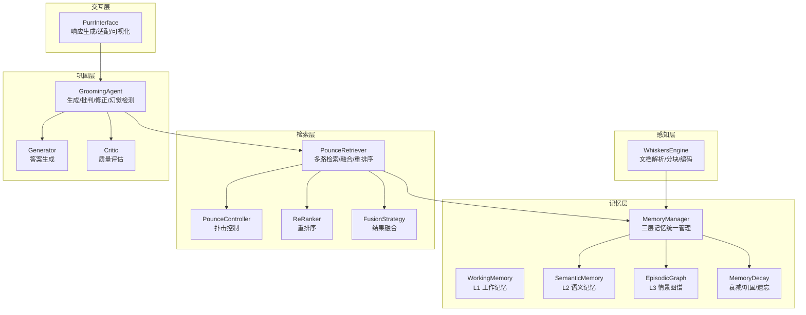
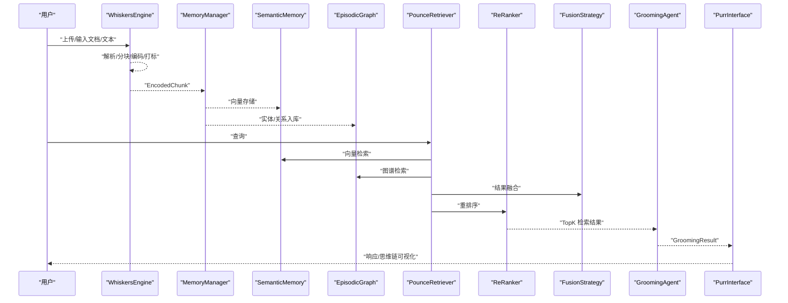
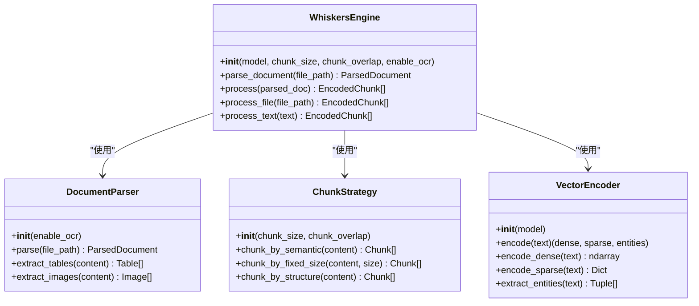
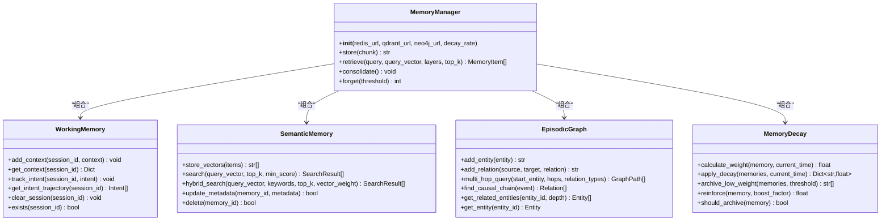
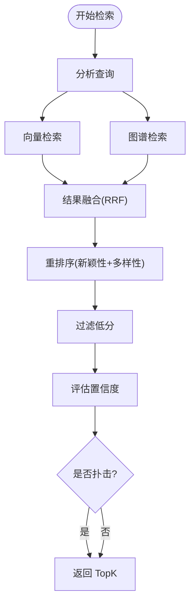
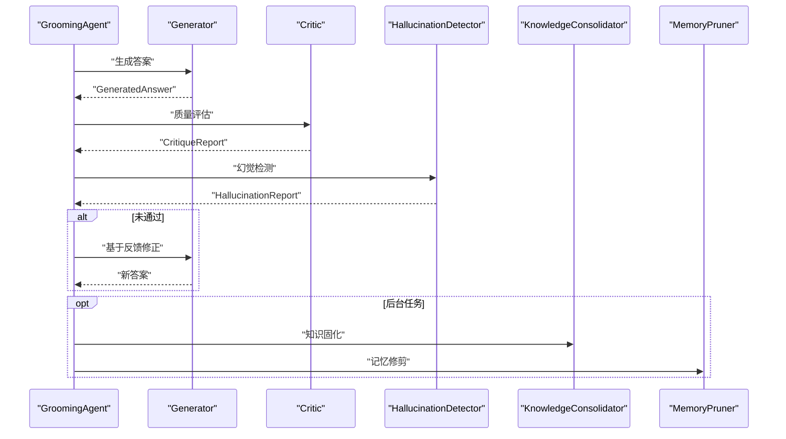
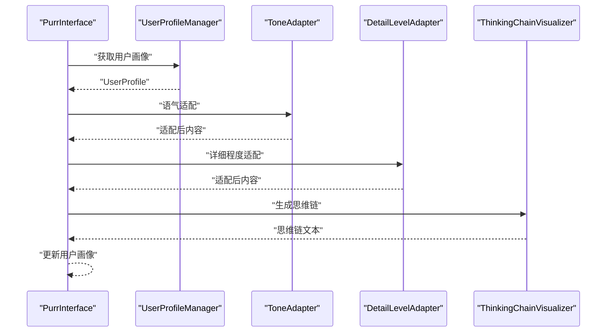
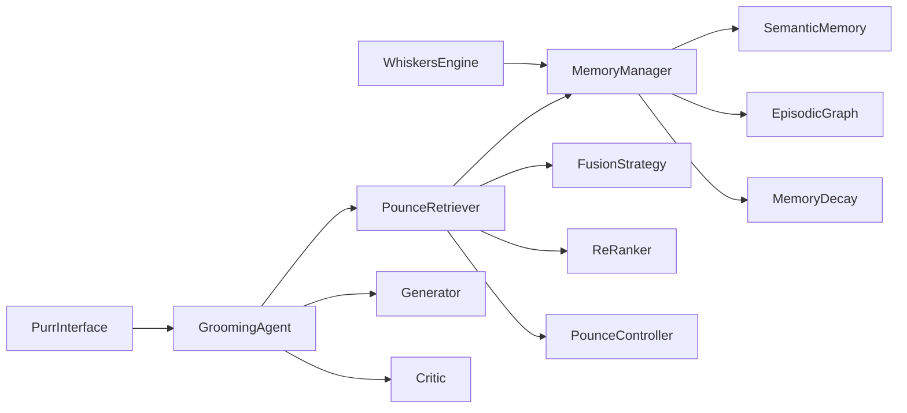

# 核心模块详解

<cite>
**本文引用的文件**
- [src/whiskers/engine.py](file://src/whiskers/engine.py)
- [src/whiskers/parser.py](file://src/whiskers/parser.py)
- [src/whiskers/chunker.py](file://src/whiskers/chunker.py)
- [src/whiskers/encoder.py](file://src/whiskers/encoder.py)
- [src/memory/manager.py](file://src/memory/manager.py)
- [src/memory/working_memory.py](file://src/memory/working_memory.py)
- [src/memory/semantic_memory.py](file://src/memory/semantic_memory.py)
- [src/memory/episodic_graph.py](file://src/memory/episodic_graph.py)
- [src/memory/decay.py](file://src/memory/decay.py)
- [src/retrieval/retriever.py](file://src/retrieval/retriever.py)
- [src/retrieval/reranker.py](file://src/retrieval/reranker.py)
- [src/retrieval/fusion.py](file://src/retrieval/fusion.py)
- [src/grooming/agent.py](file://src/grooming/agent.py)
- [src/grooming/generator.py](file://src/grooming/generator.py)
- [src/grooming/critic.py](file://src/grooming/critic.py)
- [src/purr/interface.py](file://src/purr/interface.py)
- [src/grooming/models.py](file://src/grooming/models.py)
- [src/retrieval/models.py](file://src/retrieval/models.py)
- [src/purr/models.py](file://src/purr/models.py)
</cite>

## 目录
1. [简介](#简介)
2. [项目结构](#项目结构)
3. [核心组件](#核心组件)
4. [架构总览](#架构总览)
5. [详细组件分析](#详细组件分析)
6. [依赖分析](#依赖分析)
7. [性能考虑](#性能考虑)
8. [故障排查指南](#故障排查指南)
9. [结论](#结论)
10. [附录](#附录)

## 简介
本文件面向 NecoRAG 的五大核心模块，提供系统化技术文档。目标是帮助读者理解每个模块的设计理念、架构模式与实现细节，并阐明模块间的数据流与依赖关系。五大模块分别为：
- Whiskers Engine（感知层）：文档解析、分块与编码，生成多模态向量与情境标签
- Nine-Lives Memory（记忆层）：三层记忆架构（工作记忆、语义记忆、情景图谱），配合衰减与巩固机制
- Pounce Strategy（检索层）：多路检索、融合、重排序与“扑击”控制策略
- Grooming Agent（巩固层）：答案生成、批判评估、幻觉检测与异步知识巩固
- Purr Interface（交互层）：情境自适应交互、语气与详细程度适配、思维链可视化

## 项目结构
NecoRAG 采用按功能域划分的模块化组织方式，核心模块分别位于独立子包中，彼此通过清晰的数据模型与接口耦合。

图表来源
- [src/whiskers/engine.py:14-130](file://src/whiskers/engine.py#L14-L130)
- [src/memory/manager.py:16-186](file://src/memory/manager.py#L16-L186)
- [src/memory/working_memory.py:11-120](file://src/memory/working_memory.py#L11-L120)
- [src/memory/semantic_memory.py:21-179](file://src/memory/semantic_memory.py#L21-L179)
- [src/memory/episodic_graph.py:10-194](file://src/memory/episodic_graph.py#L10-L194)
- [src/memory/decay.py:11-155](file://src/memory/decay.py#L11-L155)
- [src/retrieval/retriever.py:108-336](file://src/retrieval/retriever.py#L108-L336)
- [src/retrieval/reranker.py:10-179](file://src/retrieval/reranker.py#L10-L179)
- [src/retrieval/fusion.py:9-128](file://src/retrieval/fusion.py#L9-L128)
- [src/grooming/agent.py:16-151](file://src/grooming/agent.py#L16-L151)
- [src/grooming/generator.py:9-64](file://src/grooming/generator.py#L9-L64)
- [src/grooming/critic.py:9-72](file://src/grooming/critic.py#L9-L72)
- [src/purr/interface.py:16-224](file://src/purr/interface.py#L16-L224)

章节来源
- [src/whiskers/engine.py:14-130](file://src/whiskers/engine.py#L14-L130)
- [src/memory/manager.py:16-186](file://src/memory/manager.py#L16-L186)
- [src/retrieval/retriever.py:108-336](file://src/retrieval/retriever.py#L108-L336)
- [src/grooming/agent.py:16-151](file://src/grooming/agent.py#L16-L151)
- [src/purr/interface.py:16-224](file://src/purr/interface.py#L16-L224)

## 核心组件
本节概述五大模块的核心职责与关键流程。

- Whiskers Engine（感知层）
  - 职责：解析多模态输入（文本/文档），进行分块与编码，生成稠密/稀疏向量及实体三元组，并打上情境标签
  - 关键点：一站式处理接口、纯文本处理、与编码器/分块器/解析器/标签器协作

- Nine-Lives Memory（记忆层）
  - 职责：统一管理 L1/L2/L3 三层记忆；持久化向量与实体关系；执行衰减、巩固与主动遗忘
  - 关键点：MemoryManager 作为中枢；WorkingMemory（会话级）、SemanticMemory（向量检索）、EpisodicGraph（图谱推理）

- Pounce Strategy（检索层）
  - 职责：多路检索（向量/图谱/HyDE），结果融合与重排序，结合“扑击”控制策略以减少冗余计算
  - 关键点：PounceController 的置信度评估与阈值判断；FusionStrategy 的 RRF；ReRanker 的新颖性与多样性

- Grooming Agent（巩固层）
  - 职责：生成答案、批判评估、幻觉检测、修正与迭代；异步知识固化与修剪
  - 关键点：Generator/Critic/Refiner 闭环；HallucinationDetector；KnowledgeConsolidator/MemoryPruner

- Purr Interface（交互层）
  - 职责：情境自适应生成，语气与详细程度适配，思维链可视化，用户画像驱动个性化
  - 关键点：UserProfileManager；ToneAdapter/DetailLevelAdapter；ThinkingChainVisualizer

章节来源
- [src/whiskers/engine.py:14-130](file://src/whiskers/engine.py#L14-L130)
- [src/memory/manager.py:16-186](file://src/memory/manager.py#L16-L186)
- [src/retrieval/retriever.py:108-336](file://src/retrieval/retriever.py#L108-L336)
- [src/grooming/agent.py:16-151](file://src/grooming/agent.py#L16-L151)
- [src/purr/interface.py:16-224](file://src/purr/interface.py#L16-L224)

## 架构总览
下图展示端到端的数据流：感知层产出编码块 → 记忆层持久化与图谱构建 → 检索层多路检索与融合 → 巩固层生成与验证 → 交互层情境适配与可视化。

图表来源
- [src/whiskers/engine.py:42-130](file://src/whiskers/engine.py#L42-L130)
- [src/memory/manager.py:48-112](file://src/memory/manager.py#L48-L112)
- [src/retrieval/retriever.py:140-202](file://src/retrieval/retriever.py#L140-L202)
- [src/retrieval/fusion.py:18-70](file://src/retrieval/fusion.py#L18-L70)
- [src/retrieval/reranker.py:41-70](file://src/retrieval/reranker.py#L41-L70)
- [src/grooming/agent.py:61-129](file://src/grooming/agent.py#L61-L129)
- [src/purr/interface.py:55-132](file://src/purr/interface.py#L55-L132)

## 详细组件分析

### 感知层：Whiskers Engine
- 设计理念
  - 将“解析-分块-编码-打标”解耦为独立组件，便于替换与扩展
  - 支持文件与纯文本两种输入路径，提供一站式处理接口
- 核心流程
  - 文档解析：调用 DocumentParser，支持 OCR 开关
  - 文本分块：ChunkStrategy 支持固定大小与语义分块
  - 向量编码：VectorEncoder 生成稠密/稀疏向量与实体三元组
  - 情境打标：ContextualTagger 生成上下文标签
- 数据模型
  - ParsedDocument、Chunk、EncodedChunk 作为中间与最终载体

图表来源
- [src/whiskers/engine.py:21-130](file://src/whiskers/engine.py#L21-L130)
- [src/whiskers/parser.py:11-112](file://src/whiskers/parser.py#L11-L112)
- [src/whiskers/chunker.py:10-98](file://src/whiskers/chunker.py#L10-L98)
- [src/whiskers/encoder.py:11-98](file://src/whiskers/encoder.py#L11-L98)

章节来源
- [src/whiskers/engine.py:14-130](file://src/whiskers/engine.py#L14-L130)
- [src/whiskers/parser.py:11-112](file://src/whiskers/parser.py#L11-L112)
- [src/whiskers/chunker.py:10-98](file://src/whiskers/chunker.py#L10-L98)
- [src/whiskers/encoder.py:11-98](file://src/whiskers/encoder.py#L11-L98)

### 记忆层：Nine-Lives Memory
- 设计理念
  - 三层记忆协同：L1（工作记忆，会话级）、L2（语义记忆，向量检索）、L3（情景图谱，关系推理）
  - 衰减与巩固：通过 MemoryDecay 实现动态权重与访问强化，支持主动遗忘与归档
- 核心流程
  - 存储：将 EncodedChunk 转为 MemoryItem，写入 L2 向量库，同时抽取实体/关系写入 L3
  - 检索：支持指定层级检索，默认优先 L2 向量检索
  - 巩固：应用衰减、识别低权重并归档或删除
- 数据模型
  - MemoryItem、Entity、Relation、GraphPath、MemoryLayer

图表来源
- [src/memory/manager.py:16-186](file://src/memory/manager.py#L16-L186)
- [src/memory/working_memory.py:11-120](file://src/memory/working_memory.py#L11-L120)
- [src/memory/semantic_memory.py:21-179](file://src/memory/semantic_memory.py#L21-L179)
- [src/memory/episodic_graph.py:10-194](file://src/memory/episodic_graph.py#L10-L194)
- [src/memory/decay.py:11-155](file://src/memory/decay.py#L11-L155)

章节来源
- [src/memory/manager.py:16-186](file://src/memory/manager.py#L16-L186)
- [src/memory/working_memory.py:11-120](file://src/memory/working_memory.py#L11-L120)
- [src/memory/semantic_memory.py:21-179](file://src/memory/semantic_memory.py#L21-L179)
- [src/memory/episodic_graph.py:10-194](file://src/memory/episodic_graph.py#L10-L194)
- [src/memory/decay.py:11-155](file://src/memory/decay.py#L11-L155)

### 检索层：Pounce Strategy
- 设计理念
  - “锁定-跳跃”策略：一旦达到足够置信度，立即停止冗余检索，节省计算资源
  - 多路检索：向量检索与图谱检索并行，融合后重排序
- 核心流程
  - 查询分析 → 多路检索 → 结果融合（RRF）→ 重排序（新颖性+多样性）→ 过滤低分 → 扑击判断 → 返回 TopK
- 控制策略
  - PounceController：阈值与边际收益双重判断，支持自适应阈值

图表来源
- [src/retrieval/retriever.py:140-202](file://src/retrieval/retriever.py#L140-L202)
- [src/retrieval/fusion.py:18-70](file://src/retrieval/fusion.py#L18-L70)
- [src/retrieval/reranker.py:41-70](file://src/retrieval/reranker.py#L41-L70)

章节来源
- [src/retrieval/retriever.py:108-336](file://src/retrieval/retriever.py#L108-L336)
- [src/retrieval/fusion.py:9-128](file://src/retrieval/fusion.py#L9-L128)
- [src/retrieval/reranker.py:10-179](file://src/retrieval/reranker.py#L10-L179)

### 巩固层：Grooming Agent
- 设计理念
  - 生成-批判-修正闭环：先生成答案，再由 Critic 评估，必要时 Refiner 修正；同时进行幻觉检测
  - 异步巩固：后台周期性运行知识固化与修剪
- 核心流程
  - 生成初始答案 → 批判评估 → 幻觉检测 → 未通过则修正 → 达到迭代上限或满足条件后返回

图表来源
- [src/grooming/agent.py:61-129](file://src/grooming/agent.py#L61-L129)
- [src/grooming/generator.py:25-63](file://src/grooming/generator.py#L25-L63)
- [src/grooming/critic.py:25-71](file://src/grooming/critic.py#L25-L71)

章节来源
- [src/grooming/agent.py:16-151](file://src/grooming/agent.py#L16-L151)
- [src/grooming/generator.py:9-64](file://src/grooming/generator.py#L9-L64)
- [src/grooming/critic.py:9-72](file://src/grooming/critic.py#L9-L72)

### 交互层：Purr Interface
- 设计理念
  - 情境自适应：根据用户画像与查询复杂度，自动选择语气与详细程度
  - 思维链可视化：将检索与推理过程转化为可读的思维链文本
- 核心流程
  - 获取用户画像 → 确定语气与详细程度 → 适配内容 → 生成思维链 → 更新画像

图表来源
- [src/purr/interface.py:55-132](file://src/purr/interface.py#L55-L132)

章节来源
- [src/purr/interface.py:16-224](file://src/purr/interface.py#L16-L224)

## 依赖分析
- 模块内聚与耦合
  - Whiskers Engine 与编码/解析/分块/标签组件低耦合，通过 ParsedDocument/EncodedChunk 传递
  - MemoryManager 对外暴露统一接口，内部组合三层记忆与衰减机制
  - PounceRetriever 依赖 MemoryManager、FusionStrategy、ReRanker、PounceController
  - GroomingAgent 依赖 Generator、Critic、HallucinationDetector，以及可选的 Consolidator/Pruner
  - PurrInterface 依赖 MemoryManager（工作记忆用于画像）、ToneAdapter、DetailLevelAdapter、ThinkingChainVisualizer
- 外部依赖
  - 向量/稀疏编码、HyDE、重排序等均标注为待集成外部模型或服务（TODO），当前以最小实现替代

图表来源
- [src/whiskers/engine.py:14-130](file://src/whiskers/engine.py#L14-L130)
- [src/memory/manager.py:16-186](file://src/memory/manager.py#L16-L186)
- [src/retrieval/retriever.py:108-336](file://src/retrieval/retriever.py#L108-L336)
- [src/grooming/agent.py:16-151](file://src/grooming/agent.py#L16-L151)
- [src/purr/interface.py:16-224](file://src/purr/interface.py#L16-L224)

章节来源
- [src/whiskers/engine.py:14-130](file://src/whiskers/engine.py#L14-L130)
- [src/memory/manager.py:16-186](file://src/memory/manager.py#L16-L186)
- [src/retrieval/retriever.py:108-336](file://src/retrieval/retriever.py#L108-L336)
- [src/grooming/agent.py:16-151](file://src/grooming/agent.py#L16-L151)
- [src/purr/interface.py:16-224](file://src/purr/interface.py#L16-L224)

## 性能考虑
- 感知层
  - 分块参数（大小/重叠）影响召回与向量规模，需结合下游检索器性能权衡
  - 编码器当前为最小实现，建议尽快集成真实模型并缓存向量
- 记忆层
  - L2 向量检索建议引入近似最近邻索引（如 HNSW）与批量写入
  - L3 图谱遍历复杂度高，建议限制 hop 数与关系类型过滤
- 检索层
  - 多路检索与融合/重排序成本较高，可通过“扑击”策略提前截断
  - 重排序阶段的相似度计算可采用向量化加速
- 巩固层
  - 幻觉检测与 LLM 评估成本高，建议批量化与缓存
- 交互层
  - 思维链可视化可异步生成，避免阻塞响应

## 故障排查指南
- 常见问题
  - 检索结果为空：检查 MemoryManager 是否正确存储向量；确认 query_vector 是否生成
  - 置信度低导致“扑击”提前返回：调整 PounceController 阈值与最小边际收益
  - 答案质量差：提升 Generator 的证据数量与质量；加强 Critic 的评估规则
  - 幻觉风险：启用更严格的 HallucinationDetector；降低置信度衰减系数
- 调试手段
  - 使用 PounceRetriever 的检索追踪接口查看每一步骤
  - 检查 MemoryDecay 的权重变化与归档情况
  - 核对 GroomingAgent 的迭代次数与最终置信度

章节来源
- [src/retrieval/retriever.py:261-268](file://src/retrieval/retriever.py#L261-L268)
- [src/memory/decay.py:96-118](file://src/memory/decay.py#L96-L118)
- [src/grooming/agent.py:130-150](file://src/grooming/agent.py#L130-L150)

## 结论
NecoRAG 通过五大模块的协同，实现了从感知、记忆、检索、巩固到交互的完整链路。模块边界清晰、职责明确，既便于扩展真实模型与外部服务，又能在性能与效果之间取得平衡。建议后续重点完成各模块的外部集成（向量/稀疏编码、HyDE、重排序、LLM 评估等），并完善监控与可观测性，以支撑生产环境的稳定运行。

## 附录
- 使用示例（路径指引）
  - 感知层：参考 [src/whiskers/engine.py:92-130](file://src/whiskers/engine.py#L92-L130)
  - 记忆层：参考 [src/memory/manager.py:48-112](file://src/memory/manager.py#L48-L112)
  - 检索层：参考 [src/retrieval/retriever.py:140-202](file://src/retrieval/retriever.py#L140-L202)
  - 巩固层：参考 [src/grooming/agent.py:61-129](file://src/grooming/agent.py#L61-L129)
  - 交互层：参考 [src/purr/interface.py:55-132](file://src/purr/interface.py#L55-L132)
- 最佳实践
  - 明确模块职责与接口契约，保持最小实现快速迭代
  - 在检索阶段尽早剪枝（扑击），避免无效计算
  - 重视记忆的衰减与巩固，防止噪声积累
  - 以数据模型为中心，确保跨模块数据一致性
- 性能优化建议
  - 向量检索引入索引与缓存
  - 重排序阶段采用向量化相似度计算
  - 批量化处理与异步任务分离
  - 逐步替换 TODO 模块为真实模型与服务