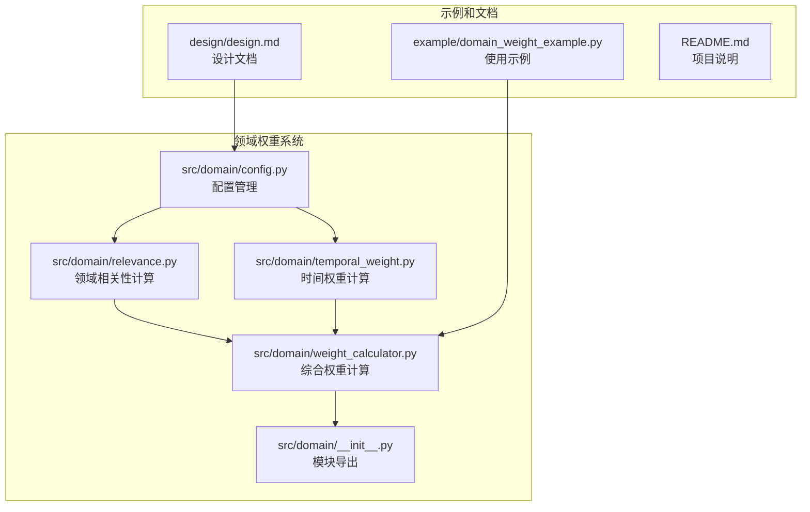
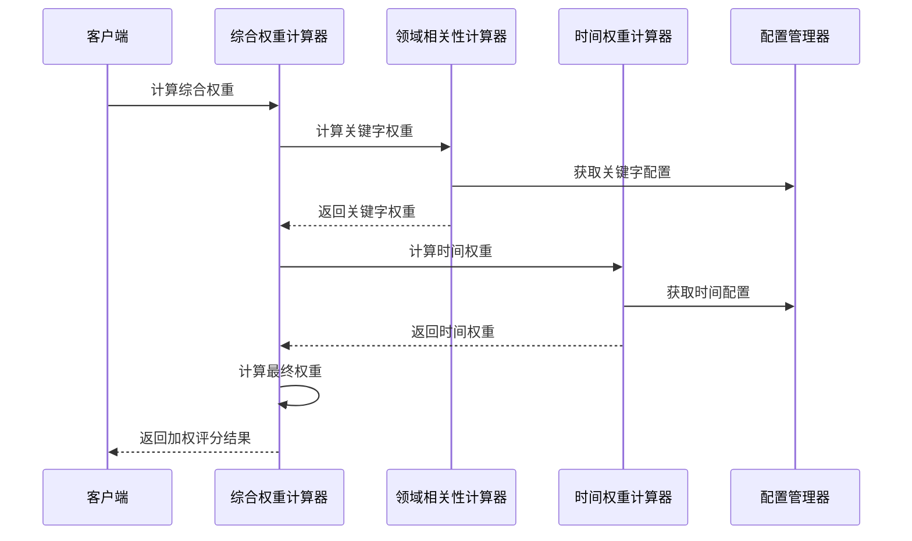
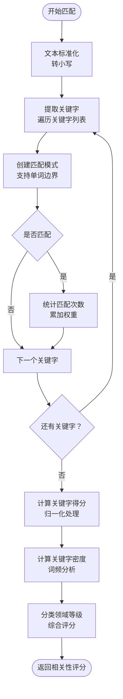
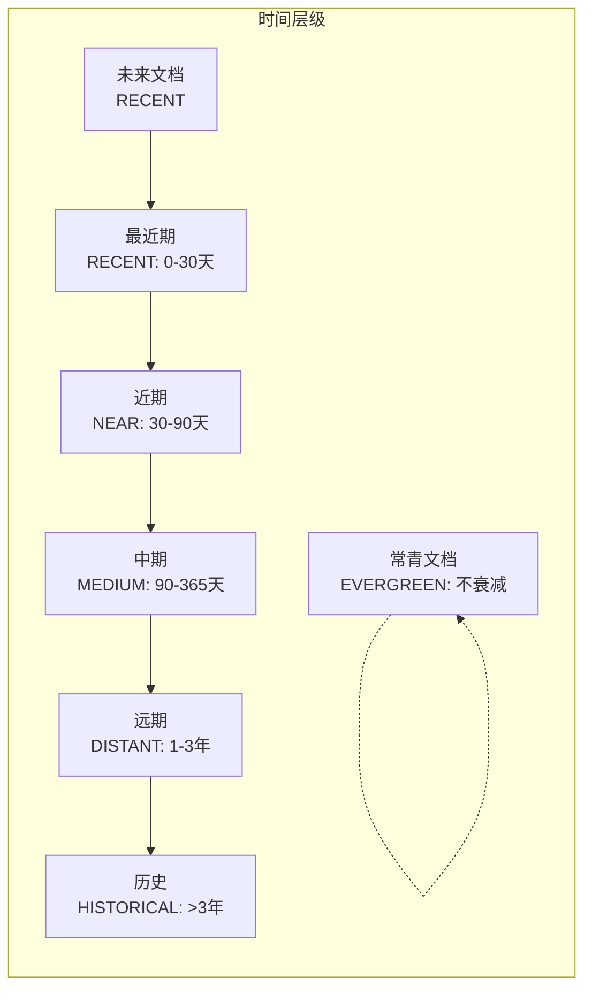
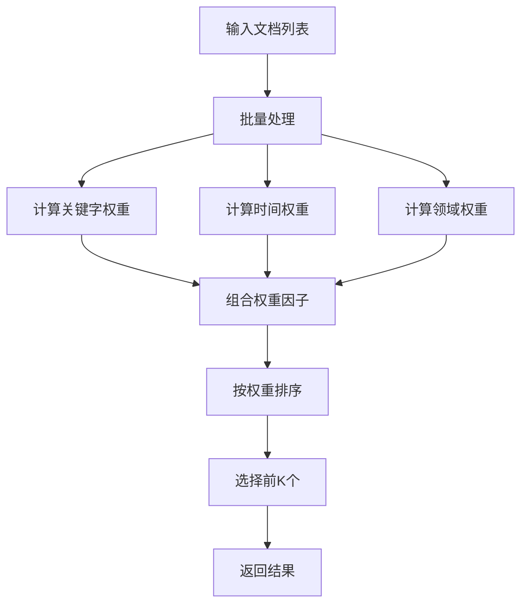
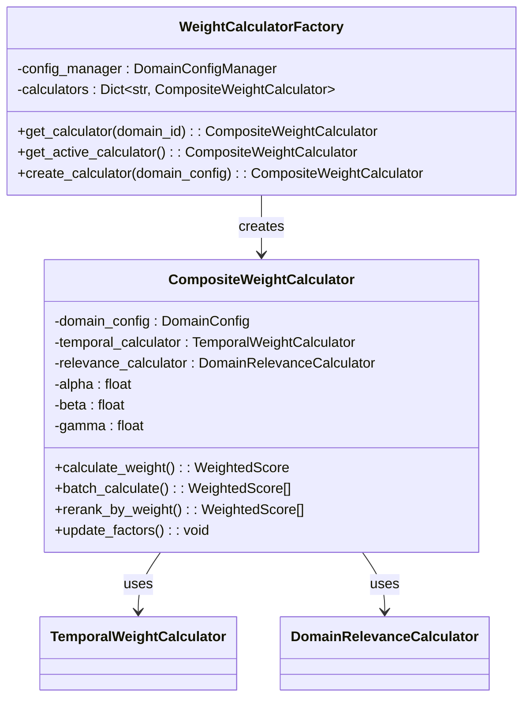
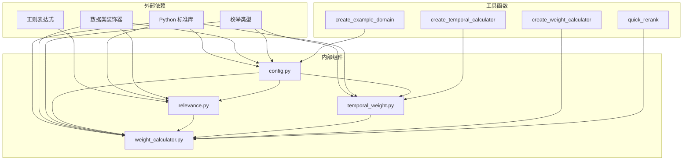

# 领域权重计算系统

<cite>
**本文档引用的文件**
- [src/domain/weight_calculator.py](file://src/domain/weight_calculator.py)
- [src/domain/relevance.py](file://src/domain/relevance.py)
- [src/domain/temporal_weight.py](file://src/domain/temporal_weight.py)
- [src/domain/config.py](file://src/domain/config.py)
- [src/domain/__init__.py](file://src/domain/__init__.py)
- [example/domain_weight_example.py](file://example/domain_weight_example.py)
- [design/design.md](file://design/design.md)
- [README.md](file://README.md)
</cite>

## 目录
1. [简介](#简介)
2. [项目结构](#项目结构)
3. [核心组件](#核心组件)
4. [架构概览](#架构概览)
5. [详细组件分析](#详细组件分析)
6. [依赖关系分析](#依赖关系分析)
7. [性能考量](#性能考量)
8. [故障排除指南](#故障排除指南)
9. [结论](#结论)

## 简介

领域权重计算系统是 NecoRAG 认知型检索增强生成框架中的核心组件，负责整合多种权重因子来优化知识检索和重排序。该系统通过三个主要维度来计算最终权重：

- **关键字权重**：基于领域关键字匹配的相关性评分
- **时间权重**：基于文档时效性的衰减权重
- **领域权重**：基于文档与目标领域匹配程度的权重

系统采用模块化设计，支持灵活的配置管理和批量处理，为整个 NecoRAG 框架提供智能化的知识检索和排序能力。

## 项目结构

领域权重计算系统位于 `src/domain/` 目录下，包含以下核心文件：



**图表来源**
- [src/domain/config.py:1-285](file://src/domain/config.py#L1-L285)
- [src/domain/relevance.py:1-328](file://src/domain/relevance.py#L1-L328)
- [src/domain/temporal_weight.py:1-271](file://src/domain/temporal_weight.py#L1-L271)
- [src/domain/weight_calculator.py:1-318](file://src/domain/weight_calculator.py#L1-L318)

**章节来源**
- [src/domain/__init__.py:1-69](file://src/domain/__init__.py#L1-L69)
- [README.md:1-678](file://README.md#L1-L678)

## 核心组件

领域权重计算系统由四个核心组件构成，每个组件都有明确的职责和接口：

### 1. 配置管理组件
- **DomainConfig**：领域配置的核心类，管理关键字词典和权重参数
- **DomainConfigManager**：配置管理器，支持配置的持久化和加载
- **KeywordConfig**：关键字配置，包含权重等级和别名信息

### 2. 领域相关性组件
- **DomainRelevanceCalculator**：计算文本与领域的相关性评分
- **RelevanceScore**：相关性评分结果的数据结构
- **QueryRelevanceEnhancer**：查询增强器，提升查询质量

### 3. 时间权重组件
- **TemporalWeightCalculator**：计算文档的时间权重
- **TemporalWeightConfig**：时间权重配置
- **TemporalTier**：时间层级枚举

### 4. 综合权重组件
- **CompositeWeightCalculator**：综合权重计算器，整合所有权重因子
- **WeightedScore**：加权评分结果
- **DocumentMetadata**：文档元数据

**章节来源**
- [src/domain/config.py:14-285](file://src/domain/config.py#L14-L285)
- [src/domain/relevance.py:16-328](file://src/domain/relevance.py#L16-L328)
- [src/domain/temporal_weight.py:14-271](file://src/domain/temporal_weight.py#L14-L271)
- [src/domain/weight_calculator.py:16-318](file://src/domain/weight_calculator.py#L16-L318)

## 架构概览

系统采用分层架构设计，各组件之间通过清晰的接口进行交互：



**图表来源**
- [src/domain/weight_calculator.py:81-146](file://src/domain/weight_calculator.py#L81-L146)
- [src/domain/relevance.py:198-241](file://src/domain/relevance.py#L198-L241)
- [src/domain/temporal_weight.py:160-195](file://src/domain/temporal_weight.py#L160-L195)

系统的核心计算公式为：
```
最终权重 = 基础分数 × α × 关键字权重 × β × 时间权重 × γ × 领域权重 × 自定义权重
```

其中 α、β、γ 分别是三个权重因子的系数，可针对不同领域进行调整。

**章节来源**
- [src/domain/weight_calculator.py:89-129](file://src/domain/weight_calculator.py#L89-L129)
- [design/design.md:67-105](file://design/design.md#L67-L105)

## 详细组件分析

### 配置管理系统

配置管理系统是整个权重计算系统的基础，提供了灵活的领域配置和管理能力。

#### 关键字权重等级系统

系统定义了四个关键字权重等级，每个等级都有相应的权重范围：

| 等级 | 描述 | 权重范围 | 典型示例 |
|------|------|----------|----------|
| CORE | 核心关键字 | 1.5-2.0 | 深度学习、机器学习、神经网络 |
| IMPORTANT | 重要关键字 | 1.2-1.5 | 向量数据库、嵌入模型、知识图谱 |
| NORMAL | 普通关键字 | 0.9-1.1 | GPU、Python、训练、推理 |
| PERIPHERAL | 边缘关键字 | 0.5-0.8 | 显卡、图形处理器、数据科学 |

#### 领域权重配置

系统支持四种领域相关性等级，每种等级对应不同的权重乘数：

| 等级 | 描述 | 权重乘数 | 适用场景 |
|------|------|----------|----------|
| CORE | 核心领域 | 1.5 | 完全属于目标领域 |
| RELATED | 相关领域 | 1.0-1.2 | 与目标领域有交集 |
| PERIPHERAL | 边缘领域 | 0.6-0.8 | 弱相关 |
| OUT_OF_DOMAIN | 领域外 | 0.2-0.4 | 基本无关 |

**章节来源**
- [src/domain/config.py:14-28](file://src/domain/config.py#L14-L28)
- [src/domain/config.py:30-101](file://src/domain/config.py#L30-L101)

### 领域相关性计算系统

领域相关性计算系统通过关键字匹配和密度分析来评估文本与目标领域的相关性。

#### 关键字匹配算法

系统采用正则表达式进行高效的关键字匹配，支持中英文关键字和别名：



**图表来源**
- [src/domain/relevance.py:66-130](file://src/domain/relevance.py#L66-L130)
- [src/domain/relevance.py:132-178](file://src/domain/relevance.py#L132-L178)

#### 关键字密度计算

关键字密度用于衡量关键字在整个文本中的重要程度：

```
关键字密度 = (关键字出现次数) / (总词汇数)
```

系统将密度值归一化到 [0, 1] 范围，并通过权重加权的方式影响最终评分。

#### 领域等级判定

系统使用综合评分来判定领域等级：

```
综合评分 = 关键字得分 × 0.7 + 密度得分 × 0.3
```

根据综合评分范围确定领域等级：

- ≥ 1.2：核心领域 (CORE)
- ≥ 0.8：相关领域 (RELATED)  
- ≥ 0.4：边缘领域 (PERIPHERAL)
- < 0.4：领域外 (OUT_OF_DOMAIN)

**章节来源**
- [src/domain/relevance.py:95-154](file://src/domain/relevance.py#L95-L154)
- [src/domain/relevance.py:156-178](file://src/domain/relevance.py#L156-L178)
- [src/domain/relevance.py:198-241](file://src/domain/relevance.py#L198-L241)

### 时间权重计算系统

时间权重计算系统模拟人类记忆的时效性衰减机制，通过指数衰减模型来计算文档的时间权重。

#### 时间层级划分

系统将文档按发布时间划分为六个时间层级：



**图表来源**
- [src/domain/temporal_weight.py:14-22](file://src/domain/temporal_weight.py#L14-L22)

#### 指数衰减模型

系统采用指数衰减模型来计算时间权重：

```
时间权重 = e^(-λ × 天数差)
```

其中 λ 是衰减系数，可通过领域特性进行调整：

| 领域类型 | 衰减系数 | 说明 |
|----------|----------|------|
| 快速变化领域 | 0.01 | 新闻、科技等快速变化领域 |
| 正常领域 | 0.001 | 学术、技术文档等 |
| 缓慢变化领域 | 0.0001 | 历史、法律等缓慢变化领域 |
| 常青领域 | 禁用衰减 | 基础科学等不受时间影响的领域 |

#### 预设配置

系统提供了三种预设的时间衰减配置：

1. **fast_changing_domain()**：快速变化领域，适用于新闻、科技等领域
2. **normal_domain()**：正常变化领域，适用于学术、技术文档等领域  
3. **slow_changing_domain()**：缓慢变化领域，适用于历史、法律等领域
4. **evergreen_domain()**：常青领域，适用于基础科学等领域

**章节来源**
- [src/domain/temporal_weight.py:47-195](file://src/domain/temporal_weight.py#L47-L195)
- [src/domain/temporal_weight.py:231-271](file://src/domain/temporal_weight.py#L231-L271)

### 综合权重计算系统

综合权重计算系统整合了关键字权重、时间权重和领域权重，通过可调节的权重因子来计算最终的加权分数。

#### 权重因子系统

系统支持三个可调节的权重因子：

- **α (alpha)**：关键字权重因子，控制关键字相关性对最终结果的影响程度
- **β (beta)**：时间权重因子，控制时间因素对最终结果的影响程度  
- **γ (gamma)**：领域权重因子，控制领域相关性对最终结果的影响程度

每个因子的取值范围为 [0, 2]，默认值为 1.0。

#### 批量处理能力

系统提供了批量处理功能，支持对多个文档进行并行权重计算：



**图表来源**
- [src/domain/weight_calculator.py:162-205](file://src/domain/weight_calculator.py#L162-L205)

#### 工厂模式设计

系统采用了工厂模式来管理权重计算器的生命周期：



**图表来源**
- [src/domain/weight_calculator.py:225-276](file://src/domain/weight_calculator.py#L225-L276)
- [src/domain/weight_calculator.py:56-80](file://src/domain/weight_calculator.py#L56-L80)

**章节来源**
- [src/domain/weight_calculator.py:56-223](file://src/domain/weight_calculator.py#L56-L223)

## 依赖关系分析

领域权重计算系统具有清晰的依赖关系，遵循单一职责原则和依赖倒置原则：



**图表来源**
- [src/domain/config.py:7-12](file://src/domain/config.py#L7-L12)
- [src/domain/relevance.py:7-13](file://src/domain/relevance.py#L7-L13)
- [src/domain/temporal_weight.py:7-12](file://src/domain/temporal_weight.py#L7-L12)
- [src/domain/weight_calculator.py:7-14](file://src/domain/weight_calculator.py#L7-L14)

系统的主要依赖特点：

1. **低耦合**：各组件之间通过接口交互，减少直接依赖
2. **高内聚**：每个组件专注于特定的功能领域
3. **可扩展性**：通过配置管理器支持新的领域和权重因子
4. **可测试性**：清晰的接口设计便于单元测试

**章节来源**
- [src/domain/__init__.py:7-38](file://src/domain/__init__.py#L7-L38)

## 性能考量

领域权重计算系统在设计时充分考虑了性能优化：

### 时间复杂度分析

1. **关键字匹配**：O(n × m)，其中 n 是关键字数量，m 是文本长度
2. **相关性评分**：O(n + m)，线性时间复杂度
3. **时间权重计算**：O(1)，常数时间复杂度
4. **批量处理**：O(k × (n × m))，k 是文档数量

### 内存使用优化

1. **关键字索引**：预先构建正则表达式索引，避免重复编译
2. **缓存机制**：工厂模式缓存已创建的计算器实例
3. **数据结构优化**：使用高效的数据结构存储配置信息

### 批量处理优化

系统提供了高效的批量处理接口，支持对大量文档进行并行权重计算：

```python
# 批量处理示例
scored_docs = [
    (score, DocumentMetadata(doc_id, content, created_at))
    for doc_id, score, content, created_at in base_scores
]

weighted_scores = calculator.batch_calculate(scored_docs, top_k=10)
```

## 故障排除指南

### 常见问题及解决方案

#### 1. 关键字权重异常

**问题**：关键字权重不在预期范围内
**原因**：权重超出配置范围或关键字未正确匹配
**解决方案**：
- 检查关键字配置的权重范围
- 验证关键字的别名设置
- 确认文本预处理是否正确

#### 2. 时间权重计算错误

**问题**：时间权重为负数或异常值
**原因**：文档时间戳在未来或配置错误
**解决方案**：
- 检查文档时间戳的有效性
- 验证衰减系数的设置
- 确认时间层级的划分逻辑

#### 3. 领域相关性评分不准确

**问题**：相关性评分与预期不符
**原因**：关键字权重设置不当或密度计算错误
**解决方案**：
- 调整关键字的权重等级
- 检查关键字的别名配置
- 验证密度计算的准确性

#### 4. 性能问题

**问题**：批量处理速度较慢
**原因**：关键字数量过多或正则表达式复杂
**解决方案**：
- 优化关键字列表的规模
- 简化正则表达式模式
- 使用更高效的数据结构

**章节来源**
- [src/domain/relevance.py:95-130](file://src/domain/relevance.py#L95-L130)
- [src/domain/temporal_weight.py:84-109](file://src/domain/temporal_weight.py#L84-L109)
- [src/domain/weight_calculator.py:162-180](file://src/domain/weight_calculator.py#L162-L180)

## 结论

领域权重计算系统是一个设计精良、功能完整的权重计算框架，具有以下特点：

### 核心优势

1. **模块化设计**：清晰的组件分离和接口定义
2. **灵活配置**：支持动态调整权重因子和领域配置
3. **高性能**：优化的算法和数据结构设计
4. **易于扩展**：良好的架构支持新功能的添加

### 应用价值

该系统为 NecoRAG 框架提供了强大的知识检索和排序能力，通过智能化的权重计算提升了整体的检索质量和用户体验。系统的设计理念体现了认知科学的原理，模拟了人类大脑的记忆和决策机制。

### 发展前景

随着 NecoRAG 框架的不断发展，领域权重计算系统将继续演进，可能的改进方向包括：

1. **机器学习集成**：引入更复杂的机器学习模型来优化权重计算
2. **实时学习**：支持权重因子的在线学习和自适应调整
3. **多模态支持**：扩展到图像、音频等多模态数据的权重计算
4. **分布式计算**：支持大规模数据的分布式权重计算

该系统为构建下一代认知型 AI 系统奠定了坚实的基础，展现了在人工智能领域的重要价值和应用潜力。