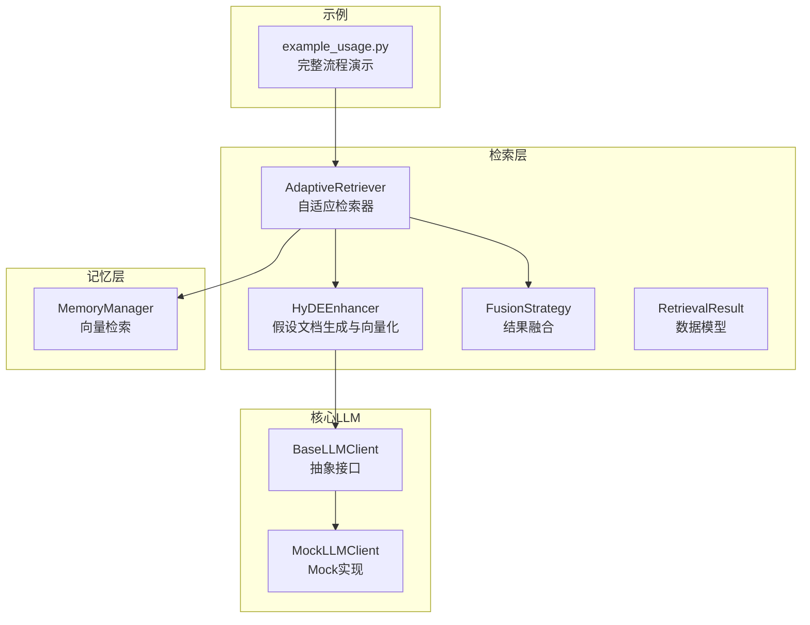
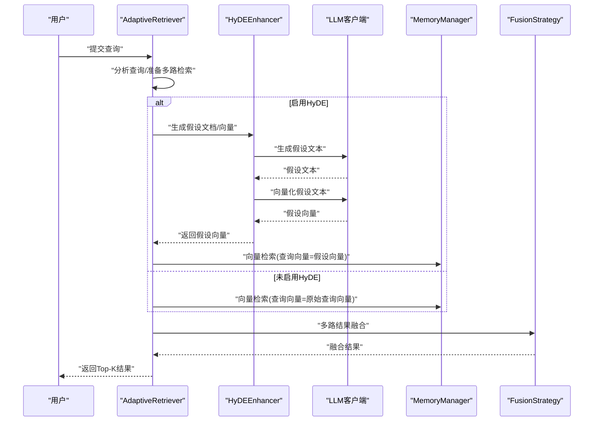
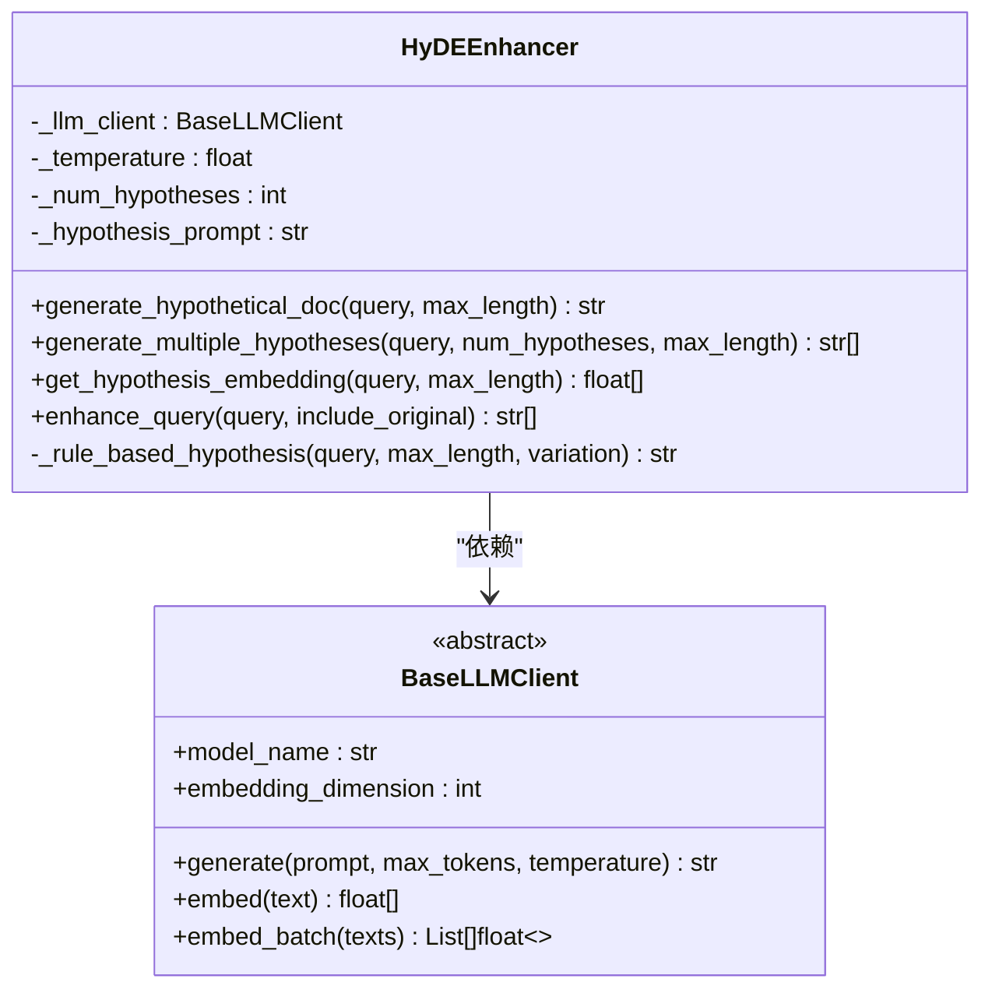
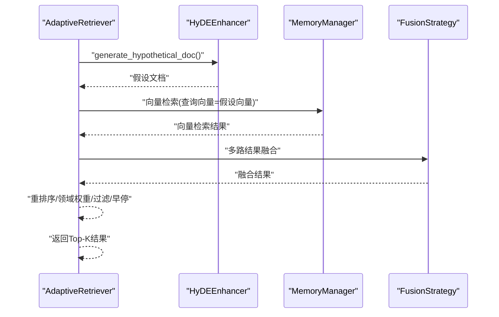
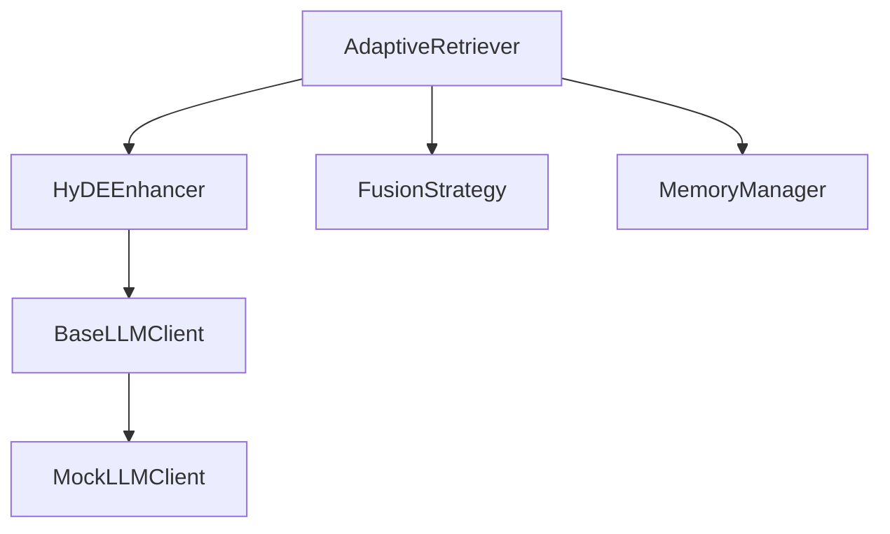
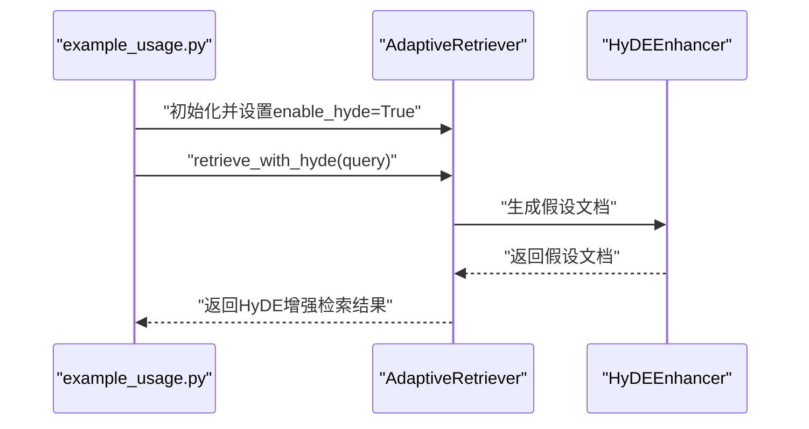

# HyDE增强技术

<cite>
**本文引用的文件**
- [src/retrieval/hyde.py](file://src/retrieval/hyde.py)
- [src/retrieval/retriever.py](file://src/retrieval/retriever.py)
- [src/retrieval/models.py](file://src/retrieval/models.py)
- [src/retrieval/fusion.py](file://src/retrieval/fusion.py)
- [src/core/llm/base.py](file://src/core/llm/base.py)
- [src/core/llm/mock.py](file://src/core/llm/mock.py)
- [src/memory/manager.py](file://src/memory/manager.py)
- [example/example_usage.py](file://example/example_usage.py)
- [README.md](file://README.md)
</cite>

## 目录
1. [引言](#引言)
2. [项目结构](#项目结构)
3. [核心组件](#核心组件)
4. [架构总览](#架构总览)
5. [详细组件分析](#详细组件分析)
6. [依赖分析](#依赖分析)
7. [性能考量](#性能考量)
8. [故障排查指南](#故障排查指南)
9. [结论](#结论)
10. [附录](#附录)

## 引言
本文件围绕HyDE（Hypothetical Document Embeddings）增强技术展开，系统阐述其理论基础、实现原理与在NecoRAG中的集成方式。重点包括：
- 假设文档生成算法与多样性控制
- 假设文档向量化与检索优化效果
- HyDEEnhancer类的工作流程与参数配置
- 在模糊查询与长尾查询场景下的优势
- 实际调用示例与结果对比思路

## 项目结构
与HyDE增强技术直接相关的模块主要位于检索层与核心LLM接口层：
- 检索层：HyDE增强器、自适应检索器、结果融合策略、检索数据模型
- 核心LLM：抽象接口与Mock实现，用于生成与向量化
- 记忆层：提供向量检索能力，支撑HyDE增强后的查询向量
- 示例：完整工作流演示，包含HyDE启用与检索调用

图表来源
- [src/retrieval/hyde.py:17-213](file://src/retrieval/hyde.py#L17-L213)
- [src/retrieval/retriever.py:122-440](file://src/retrieval/retriever.py#L122-L440)
- [src/retrieval/fusion.py:9-128](file://src/retrieval/fusion.py#L9-L128)
- [src/core/llm/base.py:11-178](file://src/core/llm/base.py#L11-L178)
- [src/core/llm/mock.py:16-313](file://src/core/llm/mock.py#L16-L313)
- [src/memory/manager.py:16-195](file://src/memory/manager.py#L16-L195)
- [example/example_usage.py:94-136](file://example/example_usage.py#L94-L136)

章节来源
- [src/retrieval/hyde.py:1-213](file://src/retrieval/hyde.py#L1-L213)
- [src/retrieval/retriever.py:1-440](file://src/retrieval/retriever.py#L1-L440)
- [src/retrieval/fusion.py:1-128](file://src/retrieval/fusion.py#L1-L128)
- [src/core/llm/base.py:1-178](file://src/core/llm/base.py#L1-L178)
- [src/core/llm/mock.py:1-313](file://src/core/llm/mock.py#L1-L313)
- [src/memory/manager.py:1-195](file://src/memory/manager.py#L1-L195)
- [example/example_usage.py:1-252](file://example/example_usage.py#L1-L252)
- [README.md:247-286](file://README.md#L247-L286)

## 核心组件
- HyDEEnhancer：负责生成假设文档、生成多样化假设、获取假设向量、增强查询
- AdaptiveRetriever：集成HyDE增强器，执行HyDE增强检索与多路检索、融合、重排序、早停
- BaseLLMClient/MockLLMClient：提供文本生成与向量化能力，支持回退方案
- MemoryManager：提供向量检索能力，支撑HyDE增强后的查询向量
- FusionStrategy：结果融合策略（RRF等）
- RetrievalResult：检索结果数据模型

章节来源
- [src/retrieval/hyde.py:17-213](file://src/retrieval/hyde.py#L17-L213)
- [src/retrieval/retriever.py:122-440](file://src/retrieval/retriever.py#L122-L440)
- [src/core/llm/base.py:11-178](file://src/core/llm/base.py#L11-L178)
- [src/core/llm/mock.py:16-313](file://src/core/llm/mock.py#L16-L313)
- [src/memory/manager.py:16-195](file://src/memory/manager.py#L16-L195)
- [src/retrieval/fusion.py:9-128](file://src/retrieval/fusion.py#L9-L128)
- [src/retrieval/models.py:9-29](file://src/retrieval/models.py#L9-L29)

## 架构总览
HyDE增强技术在NecoRAG中的位置与交互如下：
- HyDEEnhancer生成假设文档并可选生成向量
- AdaptiveRetriever在检索流程中可调用HyDE增强，将假设向量作为查询向量参与向量检索
- MemoryManager提供向量检索能力
- 结果经融合与重排序，结合早停机制输出最终结果

图表来源
- [src/retrieval/retriever.py:177-254](file://src/retrieval/retriever.py#L177-L254)
- [src/retrieval/retriever.py:307-331](file://src/retrieval/retriever.py#L307-L331)
- [src/retrieval/hyde.py:58-142](file://src/retrieval/hyde.py#L58-L142)
- [src/memory/manager.py:114-147](file://src/memory/manager.py#L114-L147)
- [src/retrieval/fusion.py:18-70](file://src/retrieval/fusion.py#L18-L70)

## 详细组件分析

### HyDEEnhancer类分析
HyDEEnhancer的核心职责：
- 生成单一假设文档
- 生成多样化假设（通过温度扰动）
- 获取假设文档向量（需LLM客户端）
- 增强查询（可包含原始查询与假设集合）

图表来源
- [src/retrieval/hyde.py:17-213](file://src/retrieval/hyde.py#L17-L213)
- [src/core/llm/base.py:11-178](file://src/core/llm/base.py#L11-L178)

实现要点与算法流程：
- 假设生成：使用提示词模板，调用LLM生成假设文档；若无LLM客户端则回退到规则生成
- 多样化生成：通过逐步增加温度生成不同变体，提升检索覆盖
- 向量化：调用LLM客户端的embed接口获取向量；若无LLM客户端则返回None
- 增强查询：可选择是否包含原始查询，组合为查询列表

图表来源
- [src/retrieval/hyde.py:58-142](file://src/retrieval/hyde.py#L58-L142)
- [src/core/llm/base.py:14-47](file://src/core/llm/base.py#L14-L47)

章节来源
- [src/retrieval/hyde.py:17-213](file://src/retrieval/hyde.py#L17-L213)
- [src/core/llm/base.py:11-178](file://src/core/llm/base.py#L11-L178)

### AdaptiveRetriever与HyDE集成
AdaptiveRetriever在检索流程中可调用HyDE增强：
- retrieve_with_hyde：生成假设文档，记录日志，然后调用retrieve
- retrieve：执行多路检索、融合、重排序、领域权重、过滤、早停
- retrieve方法中预留了HyDE向量化使用的注释（TODO），表明后续可将假设向量作为查询向量参与向量检索

图表来源
- [src/retrieval/retriever.py:307-331](file://src/retrieval/retriever.py#L307-L331)
- [src/retrieval/retriever.py:177-254](file://src/retrieval/retriever.py#L177-L254)
- [src/memory/manager.py:114-147](file://src/memory/manager.py#L114-L147)
- [src/retrieval/fusion.py:18-70](file://src/retrieval/fusion.py#L18-L70)

章节来源
- [src/retrieval/retriever.py:122-440](file://src/retrieval/retriever.py#L122-L440)
- [src/memory/manager.py:114-147](file://src/memory/manager.py#L114-L147)
- [src/retrieval/fusion.py:18-70](file://src/retrieval/fusion.py#L18-L70)

### 检索数据模型
RetrievalResult用于承载检索结果，包含内存ID、内容、分数、来源、元数据与检索路径等字段，便于HyDE增强后的结果可视化与溯源。

章节来源
- [src/retrieval/models.py:9-29](file://src/retrieval/models.py#L9-L29)

## 依赖分析
- HyDEEnhancer依赖BaseLLMClient接口，支持Mock实现，保证在无外部LLM时仍可运行
- AdaptiveRetriever依赖HyDEEnhancer、FusionStrategy、MemoryManager与重排序器
- MemoryManager提供向量检索能力，支撑HyDE增强后的查询向量
- FusionStrategy提供多路结果融合（RRF等）

图表来源
- [src/retrieval/hyde.py:17-213](file://src/retrieval/hyde.py#L17-L213)
- [src/core/llm/base.py:11-178](file://src/core/llm/base.py#L11-L178)
- [src/core/llm/mock.py:16-313](file://src/core/llm/mock.py#L16-L313)
- [src/retrieval/retriever.py:122-440](file://src/retrieval/retriever.py#L122-L440)
- [src/retrieval/fusion.py:9-128](file://src/retrieval/fusion.py#L9-L128)
- [src/memory/manager.py:16-195](file://src/memory/manager.py#L16-L195)

章节来源
- [src/retrieval/hyde.py:17-213](file://src/retrieval/hyde.py#L17-L213)
- [src/core/llm/base.py:11-178](file://src/core/llm/base.py#L11-L178)
- [src/core/llm/mock.py:16-313](file://src/core/llm/mock.py#L16-L313)
- [src/retrieval/retriever.py:122-440](file://src/retrieval/retriever.py#L122-L440)
- [src/retrieval/fusion.py:9-128](file://src/retrieval/fusion.py#L9-L128)
- [src/memory/manager.py:16-195](file://src/memory/manager.py#L16-L195)

## 性能考量
- 假设生成成本：每次生成假设都会触发一次LLM调用，生成多个假设时成本线性增长
- 向量化成本：假设向量生成需要额外的嵌入调用，增加延迟与资源消耗
- 多样化温度：适度增加温度可提升多样性，但可能影响质量稳定性
- 早停机制：在融合与重排序后评估置信度，满足阈值即可提前终止，减少无效计算
- 批量嵌入：如需批量生成假设向量，可利用LLM客户端的批量嵌入接口（embed_batch）降低开销

章节来源
- [src/retrieval/hyde.py:85-121](file://src/retrieval/hyde.py#L85-L121)
- [src/core/llm/base.py:49-59](file://src/core/llm/base.py#L49-L59)
- [src/retrieval/retriever.py:307-331](file://src/retrieval/retriever.py#L307-L331)

## 故障排查指南
- 无LLM客户端：HyDEEnhancer会回退到规则生成，确保系统可用；若需要向量化，请提供有效LLM客户端
- 假设向量为空：get_hypothesis_embedding在无LLM客户端时返回None，需检查初始化参数
- HyDE增强未生效：确认AdaptiveRetriever初始化时enable_hyde为True，并正确调用retrieve_with_hyde或在更高层启用HyDE
- 结果质量不稳定：适当调整temperature与num_hypotheses，平衡多样性与稳定性
- 性能瓶颈：减少num_hypotheses、使用批量嵌入、启用早停机制

章节来源
- [src/retrieval/hyde.py:42-48](file://src/retrieval/hyde.py#L42-L48)
- [src/retrieval/hyde.py:138-142](file://src/retrieval/hyde.py#L138-L142)
- [src/retrieval/retriever.py:129-151](file://src/retrieval/retriever.py#L129-L151)

## 结论
HyDE增强技术通过“生成假设文档—向量化—检索真实文档”的范式，显著提升了模糊查询与长尾查询的检索质量。在NecoRAG中，HyDEEnhancer与AdaptiveRetriever紧密协作，配合多路检索、融合、重排序与早停机制，形成高效稳定的检索闭环。合理配置温度、假设数量与向量化策略，可在保证性能的同时获得更优的检索效果。

## 附录

### HyDE技术理论基础与实现原理
- 理论基础：假设文档嵌入（HyDE）通过生成一个“包含答案的真实文档”风格的假设文本，将其向量化后与真实文档进行相似度匹配，从而缓解查询表达模糊带来的检索偏差
- 实现要点：提示词模板设计、LLM生成与向量化、多样化假设生成（温度扰动）、回退方案（规则生成）

章节来源
- [src/retrieval/hyde.py:17-56](file://src/retrieval/hyde.py#L17-L56)
- [src/retrieval/hyde.py:172-213](file://src/retrieval/hyde.py#L172-L213)

### HyDEEnhancer工作流程
- 输入：查询文本、温度、假设数量
- 输出：假设文档、假设向量、增强后的查询列表
- 关键步骤：提示词构造、LLM生成、向量化、多样化生成、规则回退

章节来源
- [src/retrieval/hyde.py:58-170](file://src/retrieval/hyde.py#L58-L170)

### HyDE在模糊查询与长尾查询中的优势
- 模糊查询：通过生成“真实文档风格”的假设，使查询向量更贴近知识库中的表达方式，提升召回
- 长尾查询：多样化假设生成有助于覆盖少见表达，提高稀疏查询的检索命中

章节来源
- [src/retrieval/hyde.py:85-121](file://src/retrieval/hyde.py#L85-L121)

### HyDE配置参数使用指南
- temperature：控制生成多样性，默认0.5；增大可提升多样性，但可能降低稳定性
- num_hypotheses：生成假设数量，默认1；建议在1-3之间权衡性能与效果
- llm_client：可选；若为空则使用Mock回退方案，仅支持规则生成与向量化
- enable_hyde：在AdaptiveRetriever中启用HyDE增强检索

章节来源
- [src/retrieval/hyde.py:24-40](file://src/retrieval/hyde.py#L24-L40)
- [src/retrieval/retriever.py:129-151](file://src/retrieval/retriever.py#L129-L151)
- [README.md:279-285](file://README.md#L279-L285)

### 实际调用方法与结果对比分析
- 基础检索：使用AdaptiveRetriever.retrieve执行多路检索、融合、重排序与早停
- HyDE增强检索：使用AdaptiveRetriever.retrieve_with_hyde，内部生成假设并参与检索
- 完整流程示例：参考example_usage.py中的检索示例，观察检索路径与结果

图表来源
- [example/example_usage.py:94-136](file://example/example_usage.py#L94-L136)
- [src/retrieval/retriever.py:307-331](file://src/retrieval/retriever.py#L307-L331)

章节来源
- [example/example_usage.py:94-136](file://example/example_usage.py#L94-L136)
- [src/retrieval/retriever.py:307-331](file://src/retrieval/retriever.py#L307-L331)