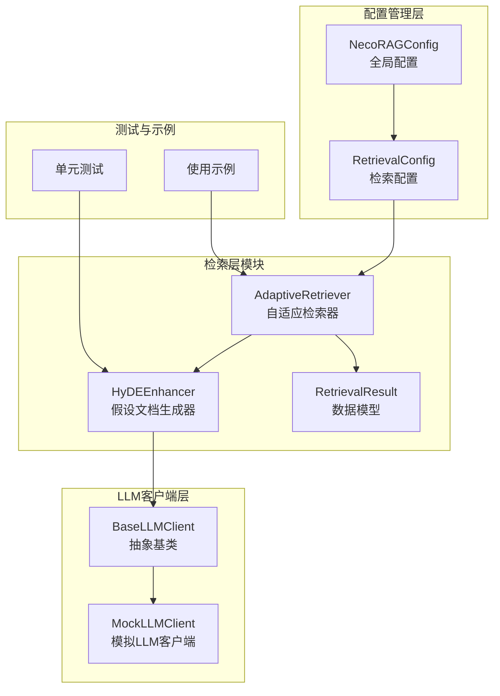
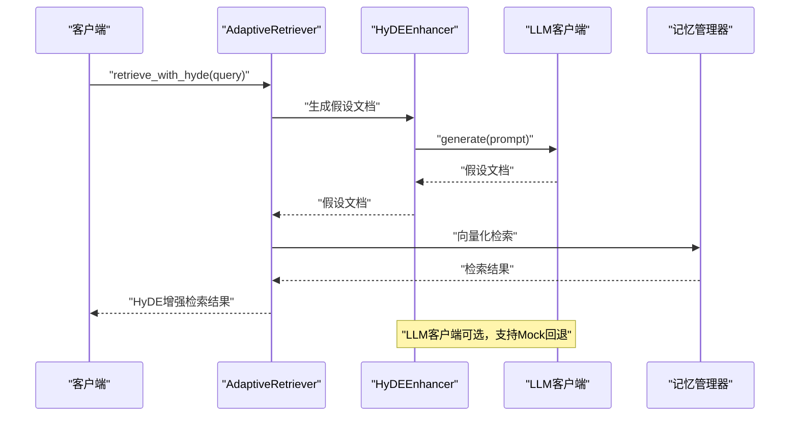
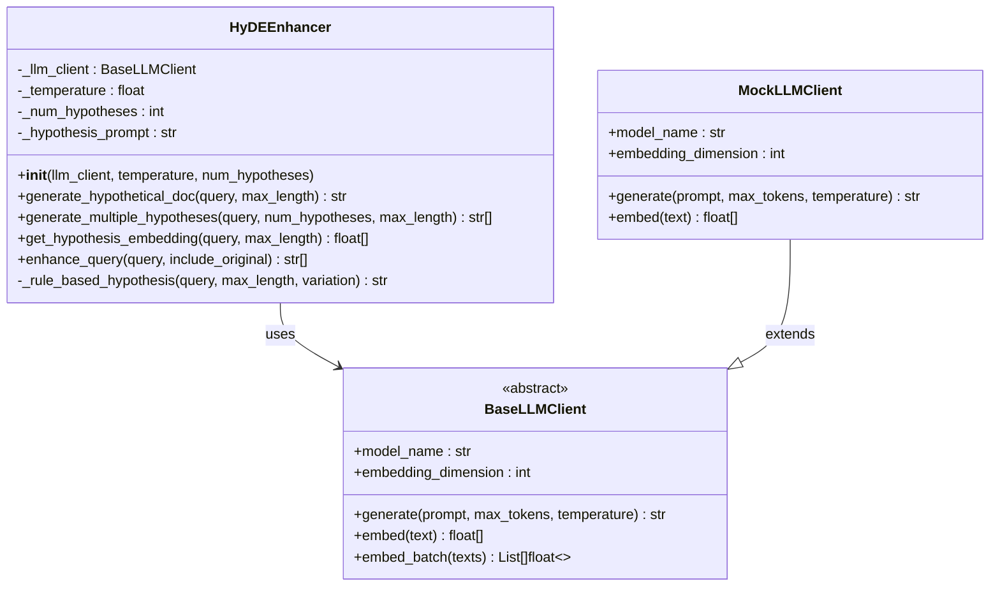
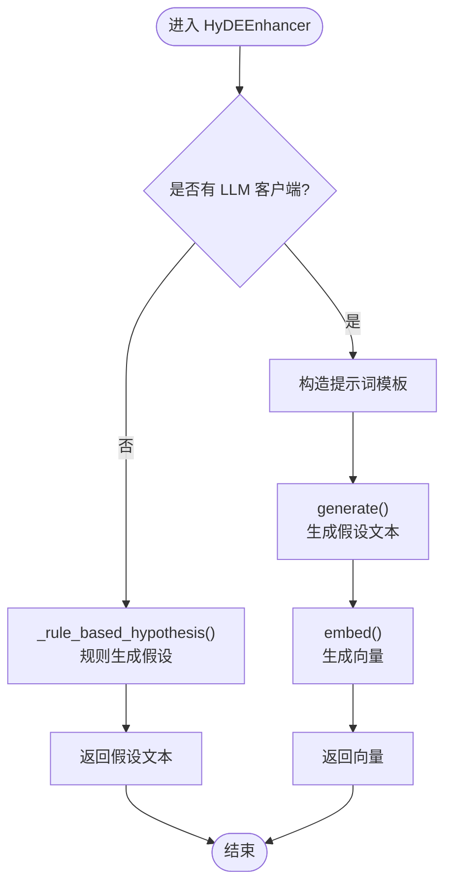
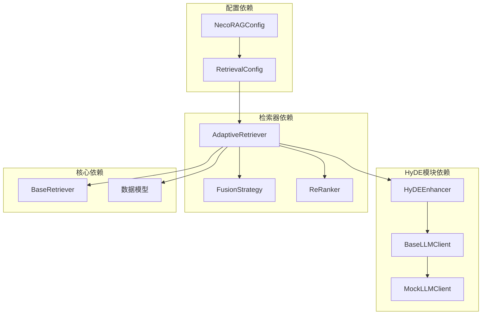
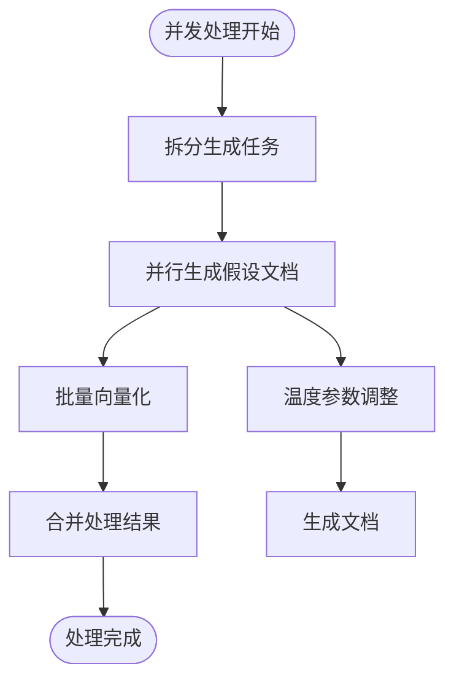
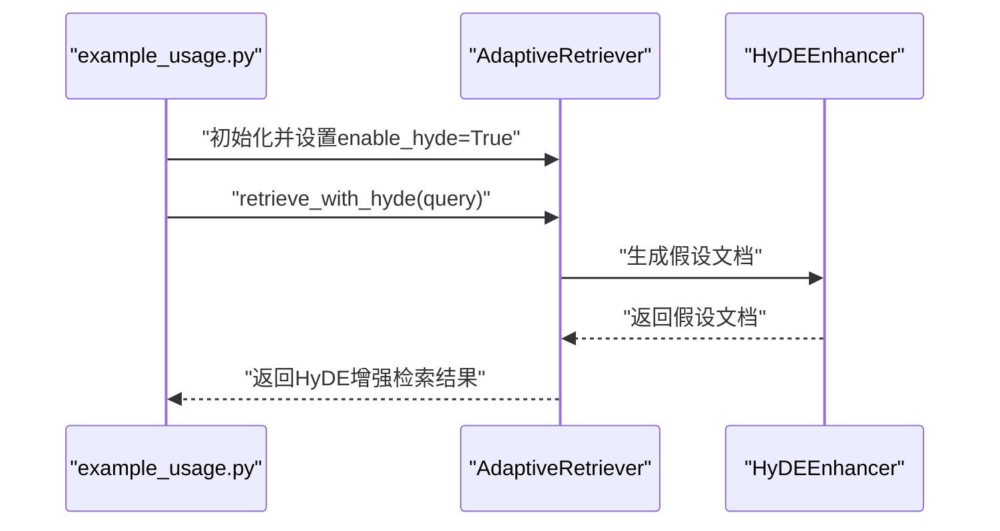

# HyDE增强技术

<cite>
**本文档引用的文件**
- [src/retrieval/hyde.py](file://src/retrieval/hyde.py)
- [src/retrieval/retriever.py](file://src/retrieval/retriever.py)
- [src/retrieval/models.py](file://src/retrieval/models.py)
- [src/core/llm/base.py](file://src/core/llm/base.py)
- [src/core/llm/mock.py](file://src/core/llm/mock.py)
- [src/core/config.py](file://src/core/config.py)
- [example/example_usage.py](file://example/example_usage.py)
- [tests/test_retrieval/test_retriever.py](file://tests/test_retrieval/test_retriever.py)
- [wiki/wiki/检索引擎模块/HyDE增强技术.md](file://wiki/wiki/检索引擎模块/HyDE增强技术.md)
- [wiki/wiki/核心架构设计/五层认知架构/检索层 (L3)/HyDE增强技术.md](file://wiki/wiki/核心架构设计/五层认知架构/检索层 (L3)/HyDE增强技术.md)
</cite>

## 目录
1. [简介](#简介)
2. [项目结构](#项目结构)
3. [核心组件](#核心组件)
4. [架构概览](#架构概览)
5. [详细组件分析](#详细组件分析)
6. [依赖关系分析](#依赖关系分析)
7. [性能考虑](#性能考虑)
8. [故障排除指南](#故障排除指南)
9. [配置选项说明](#配置选项说明)
10. [最佳实践指南](#最佳实践指南)
11. [与其他检索技术的结合](#与其他检索技术的结合)
12. [实际应用场景](#实际应用场景)
13. [结论](#结论)

## 简介

HyDE（Hypothetical Document Embeddings）增强技术是NecoRAG检索系统中的核心技术组件，通过生成假设性文档来解决传统检索中的语义鸿沟问题。该技术的核心思想是：不是直接用用户的模糊查询进行检索，而是先生成一个"包含答案的真实文档"风格的假设文档，然后将这个假设文档向量化并与知识库中的真实文档进行相似度匹配。

这种LLM驱动的文档构造过程能够有效缓解查询表达模糊带来的检索偏差，特别适用于处理模糊查询、长尾查询和复杂查询场景。通过假设文档生成、语义一致性保证和向量化策略的有机结合，HyDE技术显著提升了检索系统的准确性和鲁棒性。

## 项目结构

HyDE增强技术在NecoRAG项目中的组织结构如下：



**图表来源**
- [src/retrieval/hyde.py:17-213](file://src/retrieval/hyde.py#L17-L213)
- [src/retrieval/retriever.py:135-200](file://src/retrieval/retriever.py#L135-L200)
- [src/core/llm/base.py:16-50](file://src/core/llm/base.py#L16-L50)

**章节来源**
- [src/retrieval/hyde.py:1-213](file://src/retrieval/hyde.py#L1-L213)
- [src/retrieval/retriever.py:1-200](file://src/retrieval/retriever.py#L1-L200)

## 核心组件

### HyDEEnhancer类

HyDEEnhancer是HyDE增强技术的核心实现类，负责生成假设文档并提供相关的检索增强功能。

#### 主要功能特性

1. **假设文档生成**：使用LLM客户端生成符合真实文档风格的假设答案
2. **多样化生成**：通过温度参数控制生成的多样性
3. **向量化支持**：将假设文档转换为向量表示
4. **规则回退**：在缺少LLM客户端时使用规则生成策略
5. **查询增强**：生成包含原始查询和假设文档的查询列表

#### 关键方法

- `generate_hypothetical_doc()`: 生成单个假设文档
- `generate_multiple_hypotheses()`: 生成多个假设文档
- `get_hypothesis_embedding()`: 获取假设文档的向量表示
- `enhance_query()`: 增强查询列表

**章节来源**
- [src/retrieval/hyde.py:17-213](file://src/retrieval/hyde.py#L17-L213)

### AdaptiveRetriever集成

AdaptiveRetriever作为检索系统的主控制器，集成了HyDE增强技术，实现了完整的检索流程。

#### 集成特点

1. **条件启用**：通过配置参数控制HyDE的启用状态
2. **无缝集成**：HyDE增强与传统检索方法的自然融合
3. **性能优化**：支持早停机制和结果重排序
4. **结果追踪**：记录检索过程和路径信息

**章节来源**
- [src/retrieval/retriever.py:135-200](file://src/retrieval/retriever.py#L135-L200)

## 架构概览

HyDE增强技术的整体架构采用分层设计，确保了模块间的松耦合和高内聚。



**图表来源**
- [src/retrieval/retriever.py:362-388](file://src/retrieval/retriever.py#L362-L388)
- [src/retrieval/hyde.py:58-170](file://src/retrieval/hyde.py#L58-L170)

## 详细组件分析

### HyDEEnhancer类详细分析



**图表来源**
- [src/retrieval/hyde.py:17-213](file://src/retrieval/hyde.py#L17-L213)
- [src/core/llm/base.py:16-50](file://src/core/llm/base.py#L16-L50)
- [src/core/llm/mock.py:16-70](file://src/core/llm/mock.py#L16-L70)

#### 类结构设计

HyDEEnhancer采用了面向对象的设计模式，通过依赖注入的方式与LLM客户端解耦。这种设计使得系统既可以在生产环境中使用真实的LLM服务，也可以在开发和测试环境中使用Mock客户端。

#### 算法流程



**图表来源**
- [src/retrieval/hyde.py:58-170](file://src/retrieval/hyde.py#L58-L170)

**章节来源**
- [src/retrieval/hyde.py:17-213](file://src/retrieval/hyde.py#L17-L213)

### 数据模型支持

HyDE增强技术与RetrievalResult数据模型无缝集成，支持记录HyDE相关的检索信息。

#### RetrievalResult模型扩展

- `memory_id`: 记忆ID
- `content`: 内容文本
- `score`: 相关性分数
- `source`: 检索来源（vector/graph/hyde）
- `metadata`: 元数据信息（包含权重详情）
- `retrieval_path`: 检索路径（用于可视化）

**章节来源**
- [src/retrieval/models.py:9-18](file://src/retrieval/models.py#L9-L18)

## 依赖关系分析

### 组件依赖图



**图表来源**
- [src/retrieval/hyde.py:13-14](file://src/retrieval/hyde.py#L13-L14)
- [src/retrieval/retriever.py:13-17](file://src/retrieval/retriever.py#L13-L17)

### 外部依赖分析

HyDE增强技术的主要外部依赖包括：

1. **LLM客户端接口**：通过BaseLLMClient抽象层实现，支持多种LLM服务提供商
2. **向量存储**：与记忆管理器的SemanticMemory集成，支持向量数据库
3. **配置管理**：支持运行时配置和参数调整，通过NecoRAGConfig统一管理

**章节来源**
- [src/retrieval/retriever.py:13-17](file://src/retrieval/retriever.py#L13-L17)

## 性能考虑

### 生成效率优化

1. **温度参数调节**：通过逐步增加温度参数生成多样化的假设文档，平衡生成质量和速度
2. **批量处理**：支持批量生成和向量化处理，提高整体吞吐量
3. **缓存策略**：可以考虑实现假设文档的缓存机制，减少重复生成开销

### 内存管理

1. **向量维度控制**：通过embedding_dimension参数控制向量大小，避免内存溢出
2. **文本长度限制**：max_length参数防止过长文本影响性能
3. **批量操作**：使用embed_batch方法提高向量化效率

### 并发处理



**图表来源**
- [src/retrieval/hyde.py:105-119](file://src/retrieval/hyde.py#L105-L119)
- [src/core/llm/base.py:24-36](file://src/core/llm/base.py#L24-L36)

**章节来源**
- [src/retrieval/hyde.py:105-119](file://src/retrieval/hyde.py#L105-L119)

## 故障排除指南

### 常见问题及解决方案

#### 1. LLM客户端未正确初始化

**问题症状**：
- HyDE增强器无法生成假设文档
- 返回空结果或错误

**解决方案**：
- 确保正确传入BaseLLMClient实例
- 检查LLM客户端的model_name和embedding_dimension属性
- 验证generate和embed方法的实现

#### 2. 向量维度不匹配

**问题症状**：
- 向量计算时报维度错误
- 检索结果异常

**解决方案**：
- 确保HyDEEnhancer使用的LLM客户端与记忆管理器期望的维度一致
- 检查embedding_dimension配置

#### 3. 性能问题

**问题症状**：
- 假设文档生成速度慢
- 检索响应时间过长

**解决方案**：
- 调整temperature参数，平衡生成质量和速度
- 适当减少num_hypotheses数量
- 实现适当的缓存机制

**章节来源**
- [tests/test_retrieval/test_retriever.py:231-248](file://tests/test_retrieval/test_retriever.py#L231-L248)

## 配置选项说明

### HyDE配置参数

| 参数名 | 类型 | 默认值 | 描述 |
|--------|------|--------|------|
| enable_hyde | bool | True | 是否启用HyDE增强功能 |
| hyde_temperature | float | 0.5 | 控制假设生成的多样性，范围0-1 |
| num_hypotheses | int | 1 | 生成假设文档的数量 |
| max_length | int | 300 | 假设文档的最大长度 |

### 检索配置参数

| 参数名 | 类型 | 默认值 | 描述 |
|--------|------|--------|------|
| default_top_k | int | 10 | 默认返回结果数量 |
| enable_early_termination | bool | True | 是否启用早停机制 |
| confidence_threshold | float | 0.85 | 早停置信度阈值 |
| enable_rerank | bool | True | 是否启用重排序 |
| rerank_top_k | int | 20 | 重排序输入规模 |

**章节来源**
- [src/core/config.py:160-181](file://src/core/config.py#L160-L181)

## 最佳实践指南

### HyDE技术理论基础

HyDE（Hypothetical Document Embeddings）技术的核心理论基础是通过生成一个"包含答案的真实文档"风格的假设文本，将其向量化后与真实文档进行相似度匹配，从而缓解查询表达模糊带来的检索偏差。

### 实现要点

1. **提示词模板设计**：精心设计的提示词模板是生成高质量假设文档的关键
2. **LLM生成与向量化**：确保LLM客户端正确实现generate和embed方法
3. **多样化假设生成**：通过温度参数控制生成的多样性
4. **回退方案**：在缺少LLM客户端时使用规则生成策略

### 使用示例

```python
# 初始化HyDE增强器
from src.retrieval.hyde import HyDEEnhancer
from src.core.llm import MockLLMClient

llm_client = MockLLMClient(
    model_name="mock-llm-v1",
    embedding_dim=768,
    deterministic=True
)

hyde_enhancer = HyDEEnhancer(
    llm_client=llm_client,
    temperature=0.7,
    num_hypotheses=3
)

# 生成假设文档
query = "什么是深度学习？"
hypothesis = hyde_enhancer.generate_hypothetical_doc(query, max_length=300)
print(f"假设文档: {hypothesis}")

# 生成多个假设文档
hypotheses = hyde_enhancer.generate_multiple_hypotheses(
    query, 
    num_hypotheses=3, 
    max_length=300
)
print(f"假设文档数量: {len(hypotheses)}")

# 获取向量表示
embedding = hyde_enhancer.get_hypothesis_embedding(query, max_length=300)
if embedding:
    print(f"向量维度: {len(embedding)}")
```

**章节来源**
- [wiki/wiki/核心架构设计/五层认知架构/检索层 (L3)/HyDE增强技术.md:400-445](file://wiki/wiki/核心架构设计/五层认知架构/检索层 (L3)/HyDE增强技术.md#L400-L445)

## 与其他检索技术的结合

### 与自适应检索的结合

HyDE增强技术与AdaptiveRetriever的结合形成了完整的检索闭环：



**图表来源**
- [example/example_usage.py:94-136](file://example/example_usage.py#L94-L136)
- [src/retrieval/retriever.py:362-388](file://src/retrieval/retriever.py#L362-L388)

### 与重排序系统的集成

HyDE生成的假设文档可以与传统的向量检索结果一起参与重排序，提升最终结果的质量。

### 与多路检索的融合

HyDE增强的检索结果可以与向量检索、图谱检索等多种检索方式的结果进行融合，形成更全面的检索效果。

**章节来源**
- [src/retrieval/retriever.py:362-388](file://src/retrieval/retriever.py#L362-L388)

## 实际应用场景

### 模糊查询处理

HyDE技术特别适用于处理模糊、简短或复杂的查询，能够有效减少语义歧义，提高检索质量。

### 长尾查询优化

通过多样化假设生成，HyDE技术能够覆盖少见的查询表达，提高稀疏查询的检索命中率。

### 复杂查询场景

对于需要多跳推理或跨领域知识的复杂查询，HyDE生成的假设文档能够提供更好的语义对齐。

### 实际调用方法

```python
# 在AdaptiveRetriever中启用HyDE
from src.retrieval.retriever import AdaptiveRetriever

retriever = AdaptiveRetriever(
    memory=memory_manager,
    enable_hyde=True,
    confidence_threshold=0.85
)

# 执行HyDE增强检索
results = retriever.retrieve_with_hyde(
    query="深度学习的应用领域",
    top_k=10
)
```

**章节来源**
- [src/retrieval/retriever.py:362-388](file://src/retrieval/retriever.py#L362-L388)

## 结论

NecoRAG的HyDE增强技术模块通过实现假设文档驱动检索，显著提升了检索系统的准确性和鲁棒性。该模块的设计具有以下优势：

1. **模块化设计**：HyDEEnhancer独立于具体LLM实现，易于扩展和替换
2. **智能回退**：在缺少LLM客户端时自动使用规则生成策略
3. **性能优化**：支持批量处理和参数调节，适应不同性能需求
4. **无缝集成**：与AdaptiveRetriever完美集成，形成完整的检索管道

HyDE技术特别适用于处理模糊、简短或复杂的查询，能够有效减少语义歧义，提高检索质量。随着LLM能力的提升，HyDE技术将在未来的检索系统中发挥越来越重要的作用。

通过合理的参数配置和最佳实践指导，HyDE增强技术能够在保证性能的同时获得更优的检索效果，为用户提供更加精准和可靠的检索体验。