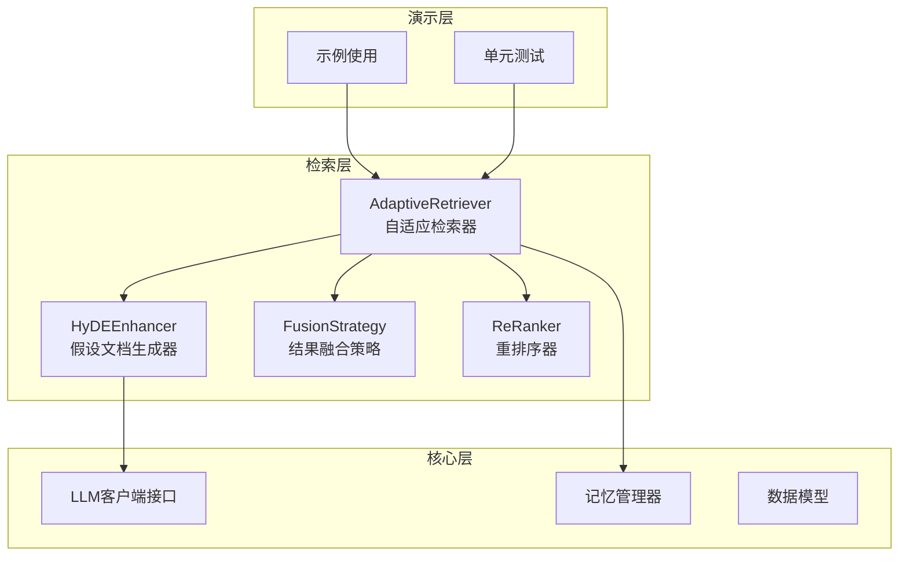
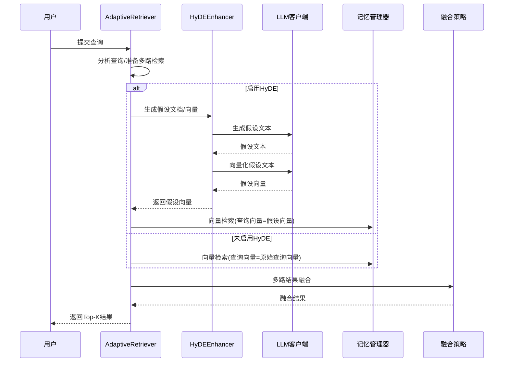
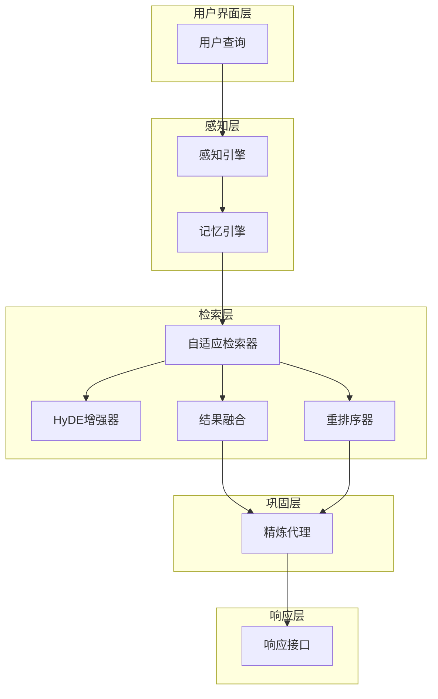
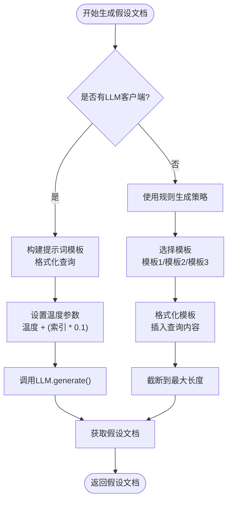
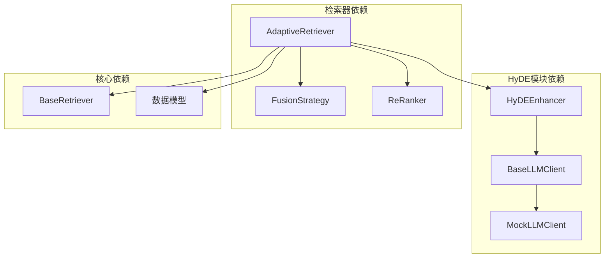

# HyDE增强技术

<cite>
**本文档引用的文件**
- [src/retrieval/hyde.py](file://src/retrieval/hyde.py)
- [src/retrieval/retriever.py](file://src/retrieval/retriever.py)
- [src/core/llm/base.py](file://src/core/llm/base.py)
- [src/core/llm/mock.py](file://src/core/llm/mock.py)
- [src/retrieval/__init__.py](file://src/retrieval/__init__.py)
- [example/example_usage.py](file://example/example_usage.py)
- [tests/test_retrieval/test_retriever.py](file://tests/test_retrieval/test_retriever.py)
- [wiki/wiki/检索引擎模块/HyDE增强技术.md](file://wiki/wiki/检索引擎模块/HyDE增强技术.md)
- [wiki/wiki/核心架构设计/五层认知架构/检索层 (L3)/HyDE增强技术.md](file://wiki/wiki/核心架构设计/五层认知架构/检索层 (L3)/HyDE增强技术.md)
</cite>

## 目录
1. [简介](#简介)
2. [项目结构](#项目结构)
3. [核心组件](#核心组件)
4. [架构概览](#架构概览)
5. [详细组件分析](#详细组件分析)
6. [依赖关系分析](#依赖关系分析)
7. [性能考虑](#性能考虑)
8. [故障排查指南](#故障排查指南)
9. [结论](#结论)
10. [附录](#附录)

## 简介

HyDE（Hypothetical Document Embeddings）增强技术是NecoRAG检索系统中的核心技术组件，通过生成假设性文档来优化向量检索效果。该技术的核心思想是：对于给定的查询，先生成一个"包含答案的真实文档"风格的假设文本，然后将该假设文本向量化，最后用假设向量在知识库中检索真实的文档。

这种范式显著改善了模糊查询、抽象概念和长尾查询的检索效果，因为它能够缓解查询表达模糊带来的检索偏差，使查询向量更贴近知识库中的真实表达方式。

## 项目结构

HyDE增强技术在NecoRAG项目中的组织结构如下：



**图表来源**
- [src/retrieval/__init__.py:6-18](file://src/retrieval/__init__.py#L6-L18)
- [src/retrieval/retriever.py:128-170](file://src/retrieval/retriever.py#L128-L170)

**章节来源**
- [src/retrieval/__init__.py:1-33](file://src/retrieval/__init__.py#L1-L33)
- [src/retrieval/hyde.py:17-22](file://src/retrieval/hyde.py#L17-L22)

## 核心组件

### HyDEEnhancer类

HyDEEnhancer是HyDE增强技术的核心实现类，负责生成假设文档并进行向量化处理。其主要职责包括：

- **单一假设生成**：生成单个假设文档
- **多样化假设生成**：通过温度扰动生成多个变体
- **向量化处理**：将假设文档转换为向量表示
- **查询增强**：生成包含原始查询和假设文档的查询列表

### LLM客户端接口

系统支持多种LLM客户端实现，包括：

- **BaseLLMClient**：抽象基类，定义标准接口
- **MockLLMClient**：演示用客户端，提供确定性响应
- **自定义实现**：可替换的LLM实现

### AdaptiveRetriever集成

HyDEEnhancer与AdaptiveRetriever紧密集成，形成完整的检索管道：



**图表来源**
- [src/retrieval/retriever.py:362-388](file://src/retrieval/retriever.py#L362-L388)
- [src/retrieval/hyde.py:58-142](file://src/retrieval/hyde.py#L58-L142)

**章节来源**
- [src/retrieval/hyde.py:17-213](file://src/retrieval/hyde.py#L17-L213)
- [src/retrieval/retriever.py:362-388](file://src/retrieval/retriever.py#L362-L388)

## 架构概览

HyDE增强技术在整个NecoRAG系统中的位置和作用：



**图表来源**
- [wiki/wiki/核心架构设计/五层认知架构/检索层 (L3)/HyDE增强技术.md:133-163](file://wiki/wiki/核心架构设计/五层认知架构/检索层 (L3)/HyDE增强技术.md#L133-L163)

HyDE技术特别适用于处理模糊、简短或复杂的查询，能够有效减少语义歧义，提高检索质量。该技术通过"生成假设文档—向量化—检索真实文档"的范式，显著提升了检索系统的准确性和鲁棒性。

## 详细组件分析

### HyDEEnhancer类详细分析

#### 类结构设计


**图表来源**
- [src/retrieval/hyde.py:17-213](file://src/retrieval/hyde.py#L17-L213)
- [src/core/llm/base.py:16-50](file://src/core/llm/base.py#L16-L50)
- [src/core/llm/mock.py:16-70](file://src/core/llm/mock.py#L16-L70)

#### 假设文档生成流程



**图表来源**
- [src/retrieval/hyde.py:85-121](file://src/retrieval/hyde.py#L85-L121)
- [src/retrieval/hyde.py:172-213](file://src/retrieval/hyde.py#L172-L213)

#### 核心方法详解

**generate_hypothetical_doc方法**：
- 接收查询文本和最大长度参数
- 使用提示词模板生成假设文档
- 支持温度参数控制生成多样性
- 返回生成的假设文档字符串

**generate_multiple_hypotheses方法**：
- 生成多个假设文档以提高检索覆盖
- 通过逐步增加温度参数生成不同变体
- 支持回退到规则生成策略
- 返回假设文档列表

**get_hypothesis_embedding方法**：
- 将假设文档转换为向量表示
- 需要有效的LLM客户端才能执行
- 返回浮点数向量列表

**enhance_query方法**：
- 生成包含原始查询和假设文档的查询列表
- 支持可选包含原始查询
- 用于增强检索效果

**章节来源**
- [src/retrieval/hyde.py:58-170](file://src/retrieval/hyde.py#L58-L170)

### LLM客户端集成

#### BaseLLMClient抽象层

BaseLLMClient定义了LLM客户端的标准接口，确保HyDEEnhancer可以与不同的LLM实现兼容：

- **generate方法**：生成文本响应
- **embed方法**：生成文本嵌入向量
- **embed_batch方法**：批量向量化处理
- **model_name属性**：模型名称标识
- **embedding_dimension属性**：向量维度规格

#### MockLLMClient实现

MockLLMClient提供了演示和测试用的LLM实现，具有以下特点：

- **确定性响应**：相同输入总是产生相同输出
- **向量化支持**：能够生成确定性的向量表示
- **模板化响应**：根据输入内容选择合适的响应模板
- **可配置参数**：支持自定义模型名称、向量维度等

**章节来源**
- [src/core/llm/base.py:16-50](file://src/core/llm/base.py#L16-L50)
- [src/core/llm/mock.py:16-134](file://src/core/llm/mock.py#L16-L134)

## 依赖关系分析

### 组件依赖图



**图表来源**
- [src/retrieval/hyde.py:13-14](file://src/retrieval/hyde.py#L13-L14)
- [src/retrieval/retriever.py:13-17](file://src/retrieval/retriever.py#L13-L17)

### 外部依赖分析

HyDE增强技术的主要外部依赖包括：

1. **LLM客户端接口**：通过BaseLLMClient抽象层实现
2. **向量存储**：与记忆管理器的SemanticMemory集成
3. **配置管理**：支持运行时配置和参数调整

**章节来源**
- [src/retrieval/retriever.py:13-17](file://src/retrieval/retriever.py#L13-L17)

## 性能考虑

### 生成效率优化

1. **温度参数调节**：通过逐步增加温度参数生成多样化的假设文档
2. **批量处理**：支持批量生成和向量化处理
3. **缓存策略**：可以考虑实现假设文档的缓存机制

### 成本分析

- **假设生成成本**：每次生成假设都会触发一次LLM调用，生成多个假设时成本线性增长
- **向量化成本**：假设向量生成需要额外的嵌入调用，增加延迟与资源消耗
- **多样化温度**：适度增加温度可提升多样性，但可能影响质量稳定性

### 早停机制

在融合与重排序后评估置信度，满足阈值即可提前终止，减少无效计算。

### 批量嵌入优化

如需批量生成假设向量，可利用LLM客户端的批量嵌入接口（embed_batch）降低开销。

**章节来源**
- [src/retrieval/hyde.py:280-284](file://src/retrieval/hyde.py#L280-L284)
- [src/core/llm/base.py:24-36](file://src/core/llm/base.py#L24-L36)

## 故障排查指南

### 常见问题及解决方案

#### LLM客户端未正确初始化

**问题症状**：
- HyDE增强器无法生成假设文档
- 返回空结果或错误

**解决方案**：
- 确保正确传入BaseLLMClient实例
- 检查LLM客户端的model_name和embedding_dimension属性
- 验证generate和embed方法的实现

#### 向量维度不匹配

**问题症状**：
- 向量计算时报维度错误
- 检索结果异常

**解决方案**：
- 确保HyDEEnhancer使用的LLM客户端与记忆管理器期望的维度一致
- 检查embedding_dimension配置

#### 性能问题

**问题症状**：
- 假设文档生成速度慢
- 检索响应时间过长

**解决方案**：
- 调整temperature参数，平衡生成质量和速度
- 适当减少num_hypotheses数量
- 实现适当的缓存机制

#### HyDE增强未生效

**问题症状**：
- 启用了HyDE但效果不明显
- 检索结果与预期不符

**解决方案**：
- 确认AdaptiveRetriever初始化时enable_hyde为True
- 检查retrieve_with_hyde方法的调用
- 验证HyDE增强器的配置参数

**章节来源**
- [src/retrieval/hyde.py:291-296](file://src/retrieval/hyde.py#L291-L296)
- [src/retrieval/retriever.py:377-380](file://src/retrieval/retriever.py#L377-L380)

## 结论

HyDE增强技术通过"生成假设文档—向量化—检索真实文档"的范式，显著提升了模糊查询与长尾查询的检索质量。在NecoRAG中，HyDEEnhancer与AdaptiveRetriever紧密协作，配合多路检索、融合、重排序与早停机制，形成高效稳定的检索闭环。

该技术特别适用于处理模糊、简短或复杂的查询，能够有效减少语义歧义，提高检索质量。随着LLM能力的提升，HyDE技术将在未来的检索系统中发挥越来越重要的作用。

## 附录

### HyDE技术理论基础与实现原理

**理论基础**：
- 假设文档嵌入（HyDE）通过生成一个"包含答案的真实文档"风格的假设文本，将其向量化后与真实文档进行相似度匹配
- 缓解查询表达模糊带来的检索偏差
- 使查询向量更贴近知识库中的表达方式

**实现要点**：
- 提示词模板设计
- LLM生成与向量化
- 多样化假设生成（温度扰动）
- 回退方案（规则生成）

**章节来源**
- [src/retrieval/hyde.py:17-56](file://src/retrieval/hyde.py#L17-L56)
- [src/retrieval/hyde.py:172-213](file://src/retrieval/hyde.py#L172-L213)

### HyDEEnhancer工作流程

**输入**：查询文本、温度、假设数量
**输出**：假设文档、假设向量、增强后的查询列表
**关键步骤**：提示词构造、LLM生成、向量化、多样化生成、规则回退

**章节来源**
- [src/retrieval/hyde.py:58-170](file://src/retrieval/hyde.py#L58-L170)

### HyDE在模糊查询与长尾查询中的优势

- **模糊查询**：通过生成"真实文档风格"的假设，使查询向量更贴近知识库中的表达方式，提升召回
- **长尾查询**：多样化假设生成有助于覆盖少见表达，提高稀疏查询的检索命中

**章节来源**
- [src/retrieval/hyde.py:85-121](file://src/retrieval/hyde.py#L85-L121)

### 使用示例

#### 基本配置示例

```python
# 初始化HyDE增强器
from src.retrieval.hyde import HyDEEnhancer
from src.core.llm import MockLLMClient

# 使用Mock LLM客户端进行演示
llm_client = MockLLMClient(
    model_name="mock-llm-v1",
    embedding_dim=768,
    deterministic=True
)

hyde_enhancer = HyDEEnhancer(
    llm_client=llm_client,
    temperature=0.7,
    num_hypotheses=3
)
```

#### 生成假设文档

```python
# 生成单个假设文档
query = "什么是深度学习？"
hypothesis = hyde_enhancer.generate_hypothetical_doc(query, max_length=300)
print(f"假设文档: {hypothesis}")

# 生成多个假设文档
hypotheses = hyde_enhancer.generate_multiple_hypotheses(
    query, 
    num_hypotheses=3, 
    max_length=300
)
print(f"假设文档数量: {len(hypotheses)}")
```

#### 获取向量表示

```python
# 获取假设文档的向量表示
embedding = hyde_enhancer.get_hypothesis_embedding(query, max_length=300)
if embedding:
    print(f"向量维度: {len(embedding)}")
```

**章节来源**
- [wiki/wiki/核心架构设计/五层认知架构/检索层 (L3)/HyDE增强技术.md:398-445](file://wiki/wiki/核心架构设计/五层认知架构/检索层 (L3)/HyDE增强技术.md#L398-L445)

### 配置参数说明

| 参数名 | 类型 | 默认值 | 描述 |
|--------|------|--------|------|
| llm_client | BaseLLMClient | None | LLM客户端实例 |
| temperature | float | 0.5 | 生成温度参数 |
| num_hypotheses | int | 1 | 假设文档生成数量 |
| max_length | int | 300 | 假设文档最大长度 |

### 与传统向量检索的区别和优势

**传统向量检索**：
- 直接使用查询文本进行向量化
- 对模糊查询和抽象概念处理效果有限
- 容易受到查询表达不精确的影响

**HyDE增强检索**：
- 先生成假设文档再进行向量化
- 通过"真实文档风格"的假设缓解查询模糊性
- 显著提升模糊查询和长尾查询的检索效果
- 通过多样化假设提高检索覆盖度

**章节来源**
- [src/retrieval/hyde.py:17-22](file://src/retrieval/hyde.py#L17-L22)