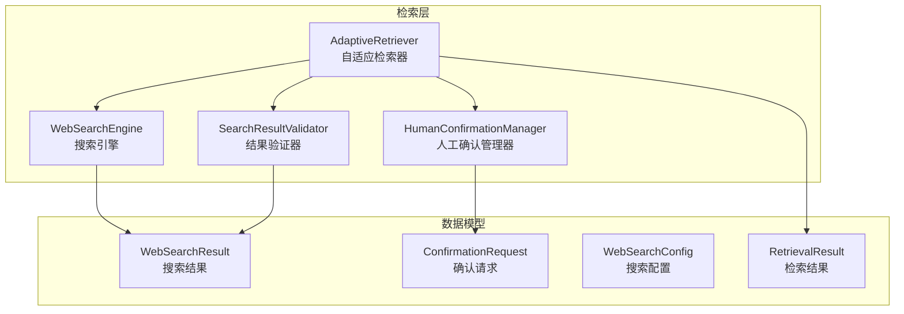
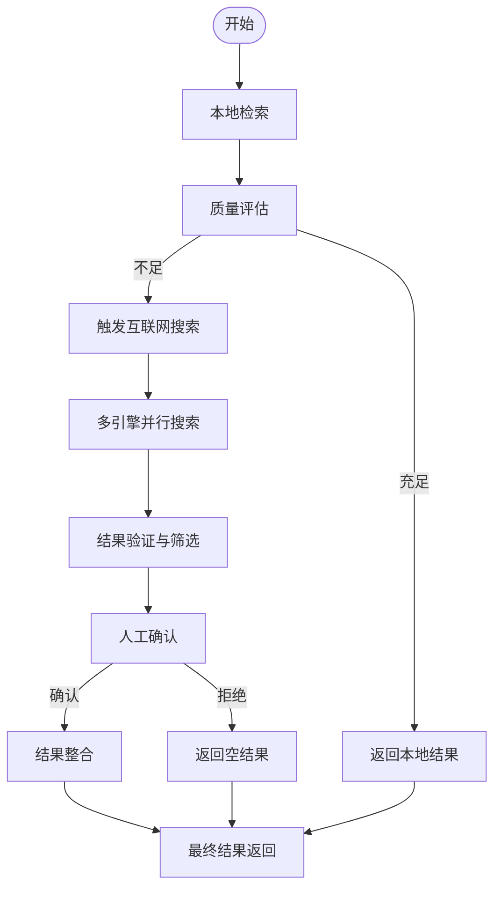
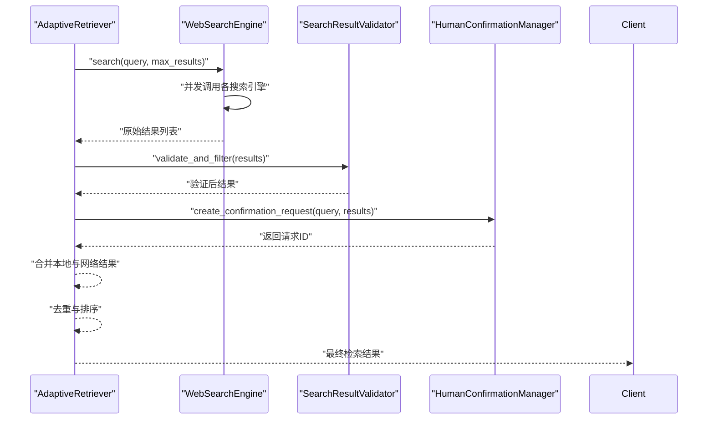
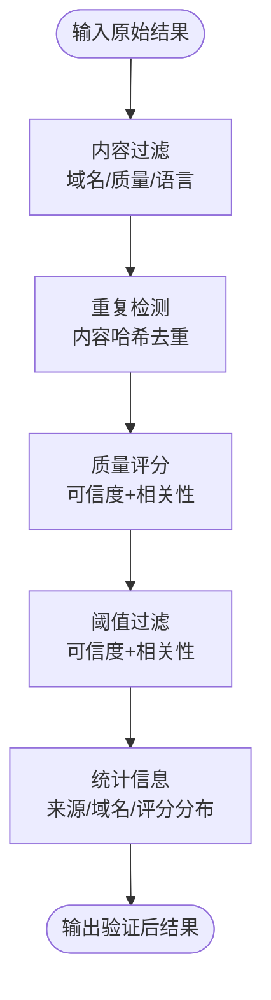
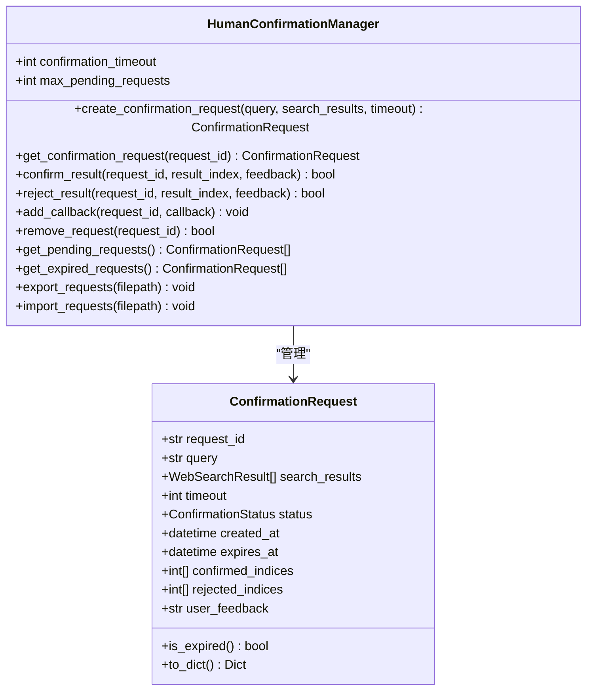
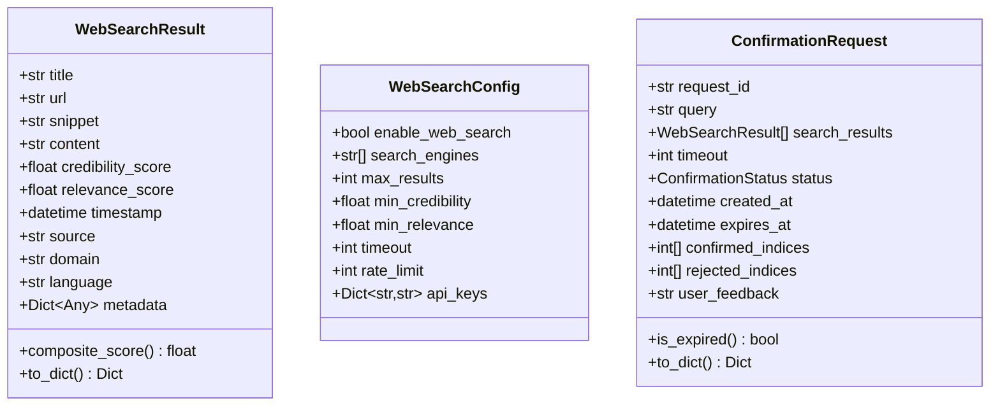
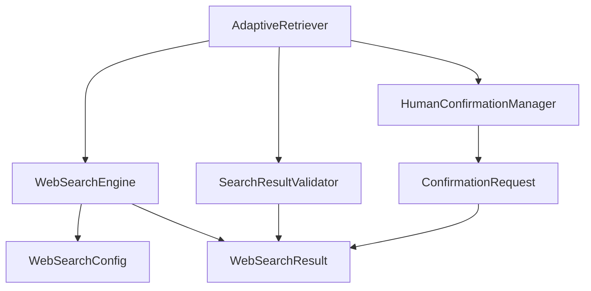

# Web搜索集成

<cite>
**本文档引用的文件**
- [src/retrieval/web_search/__init__.py](file://src/retrieval/web_search/__init__.py)
- [src/retrieval/web_search/engine.py](file://src/retrieval/web_search/engine.py)
- [src/retrieval/web_search/validator.py](file://src/retrieval/web_search/validator.py)
- [src/retrieval/web_search/confirmation.py](file://src/retrieval/web_search/confirmation.py)
- [src/retrieval/web_search/models.py](file://src/retrieval/web_search/models.py)
- [src/retrieval/retriever.py](file://src/retrieval/retriever.py)
- [src/retrieval/models.py](file://src/retrieval/models.py)
- [design/design.md](file://design/design.md)
- [example/example_usage.py](file://example/example_usage.py)
</cite>

## 目录
1. [简介](#简介)
2. [项目结构](#项目结构)
3. [核心组件](#核心组件)
4. [架构总览](#架构总览)
5. [详细组件分析](#详细组件分析)
6. [依赖关系分析](#依赖关系分析)
7. [性能考量](#性能考量)
8. [故障排查指南](#故障排查指南)
9. [结论](#结论)
10. [附录](#附录)

## 简介
本文件面向Web搜索集成功能，系统性阐述互联网搜索回退机制的设计与实现，包括搜索引擎选择策略、结果获取流程、质量控制机制；深入解析搜索结果验证器的可信度评估、相关性过滤与重复内容检测；解释人工确认管理器的交互设计与质量保证流程；并提供完整的配置选项、API接口说明与集成示例，以及安全、性能与故障处理策略。

## 项目结构
Web搜索集成位于检索层的web_search子模块，与自适应检索器紧密协作，在本地检索不足时触发互联网搜索回退，并通过验证器与人工确认流程保障结果质量。

**图表来源**
- [src/retrieval/retriever.py:135-223](file://src/retrieval/retriever.py#L135-L223)
- [src/retrieval/web_search/engine.py:20-46](file://src/retrieval/web_search/engine.py#L20-L46)
- [src/retrieval/web_search/validator.py:17-42](file://src/retrieval/web_search/validator.py#L17-L42)
- [src/retrieval/web_search/confirmation.py:17-40](file://src/retrieval/web_search/confirmation.py#L17-L40)
- [src/retrieval/web_search/models.py:22-84](file://src/retrieval/web_search/models.py#L22-L84)
- [src/retrieval/models.py:9-29](file://src/retrieval/models.py#L9-L29)

**章节来源**
- [src/retrieval/web_search/__init__.py:1-19](file://src/retrieval/web_search/__init__.py#L1-L19)
- [src/retrieval/retriever.py:135-223](file://src/retrieval/retriever.py#L135-L223)

## 核心组件
- WebSearchEngine：多引擎并行搜索、速率限制、缓存与结果去重、质量阈值过滤。
- SearchResultValidator：内容过滤、重复检测、可信度与相关性评分、统计信息。
- HumanConfirmationManager：确认请求生命周期管理、超时处理、回调通知、导入导出。
- WebSearchResult/WebSearchConfig/ConfirmationRequest：统一的数据模型与配置。
- AdaptiveRetriever：触发回退条件、调用Web搜索、合并结果、去重与排序。

**章节来源**
- [src/retrieval/web_search/engine.py:20-186](file://src/retrieval/web_search/engine.py#L20-L186)
- [src/retrieval/web_search/validator.py:17-90](file://src/retrieval/web_search/validator.py#L17-L90)
- [src/retrieval/web_search/confirmation.py:17-95](file://src/retrieval/web_search/confirmation.py#L17-L95)
- [src/retrieval/web_search/models.py:22-262](file://src/retrieval/web_search/models.py#L22-L262)
- [src/retrieval/retriever.py:500-644](file://src/retrieval/retriever.py#L500-L644)

## 架构总览
Web搜索回退机制遵循“本地检索不足即触发”的原则，通过多引擎并行搜索、结果验证与人工确认，最终将高质量结果整合回检索流程。

**图表来源**
- [design/design.md:1358-1400](file://design/design.md#L1358-L1400)
- [src/retrieval/retriever.py:500-644](file://src/retrieval/retriever.py#L500-L644)

## 详细组件分析

### 搜索引擎选择与回退策略
- 选择策略：支持Google、Bing、DuckDuckGo，按配置启用；每个引擎独立速率限制与缓存。
- 并发执行：使用异步并发调用，聚合结果后去重与排序。
- 回退触发：当本地检索结果数量不足或置信度未达阈值时，自动进入Web搜索回退。
- 结果整合：将网络结果转换为检索结果格式，调整分数并去重。

**图表来源**
- [src/retrieval/retriever.py:500-644](file://src/retrieval/retriever.py#L500-L644)
- [src/retrieval/web_search/engine.py:112-186](file://src/retrieval/web_search/engine.py#L112-L186)
- [src/retrieval/web_search/validator.py:56-90](file://src/retrieval/web_search/validator.py#L56-L90)
- [src/retrieval/web_search/confirmation.py:58-95](file://src/retrieval/web_search/confirmation.py#L58-L95)

**章节来源**
- [src/retrieval/retriever.py:500-644](file://src/retrieval/retriever.py#L500-L644)
- [src/retrieval/web_search/engine.py:112-186](file://src/retrieval/web_search/engine.py#L112-L186)

### 搜索结果验证器
- 内容过滤：剔除可疑域名、低质量内容、语言不一致条目。
- 重复检测：基于内容哈希去重，避免重复结果。
- 质量评分：可信度（域名权威性、HTTPS、内容质量）与相关性（标题/摘要长度、完整性）评分。
- 阈值过滤：根据配置的最低可信度与相关性阈值筛选结果。
- 统计信息：提供平均可信度、相关性、来源与域名分布等统计。

**图表来源**
- [src/retrieval/web_search/validator.py:56-90](file://src/retrieval/web_search/validator.py#L56-L90)
- [src/retrieval/web_search/validator.py:127-178](file://src/retrieval/web_search/validator.py#L127-L178)
- [src/retrieval/web_search/validator.py:328-352](file://src/retrieval/web_search/validator.py#L328-L352)

**章节来源**
- [src/retrieval/web_search/validator.py:56-90](file://src/retrieval/web_search/validator.py#L56-L90)
- [src/retrieval/web_search/validator.py:127-178](file://src/retrieval/web_search/validator.py#L127-L178)
- [src/retrieval/web_search/validator.py:328-352](file://src/retrieval/web_search/validator.py#L328-L352)

### 人工确认管理器
- 生命周期管理：创建、查询、确认、拒绝、移除、过期清理。
- 超时处理：定时清理过期请求，支持导出/导入请求数据。
- 回调通知：确认或拒绝后触发回调，便于外部系统联动。
- 状态跟踪：支持部分确认、全部确认、全部拒绝、过期等状态。

**图表来源**
- [src/retrieval/web_search/confirmation.py:17-95](file://src/retrieval/web_search/confirmation.py#L17-L95)
- [src/retrieval/web_search/models.py:86-224](file://src/retrieval/web_search/models.py#L86-L224)

**章节来源**
- [src/retrieval/web_search/confirmation.py:17-95](file://src/retrieval/web_search/confirmation.py#L17-L95)
- [src/retrieval/web_search/models.py:86-224](file://src/retrieval/web_search/models.py#L86-L224)

### 数据模型与配置
- WebSearchResult：统一的搜索结果结构，包含可信度、相关性、来源、语言、元数据等。
- ConfirmationRequest：确认请求结构，包含状态、索引集合、反馈与过期时间。
- WebSearchConfig：搜索引擎配置，包括启用开关、引擎列表、最大结果数、阈值、超时、速率限制与API密钥。

**图表来源**
- [src/retrieval/web_search/models.py:22-84](file://src/retrieval/web_search/models.py#L22-L84)
- [src/retrieval/web_search/models.py:227-262](file://src/retrieval/web_search/models.py#L227-L262)
- [src/retrieval/web_search/models.py:86-224](file://src/retrieval/web_search/models.py#L86-L224)

**章节来源**
- [src/retrieval/web_search/models.py:22-84](file://src/retrieval/web_search/models.py#L22-L84)
- [src/retrieval/web_search/models.py:227-262](file://src/retrieval/web_search/models.py#L227-L262)
- [src/retrieval/web_search/models.py:86-224](file://src/retrieval/web_search/models.py#L86-L224)

## 依赖关系分析
- AdaptiveRetriever依赖WebSearchEngine、SearchResultValidator与HumanConfirmationManager，负责触发回退、调用搜索、验证与确认。
- WebSearchEngine依赖WebSearchConfig与WebSearchResult，内部实现多引擎搜索、缓存与速率限制。
- SearchResultValidator依赖WebSearchResult，提供内容过滤、去重与评分。
- HumanConfirmationManager依赖ConfirmationRequest与WebSearchResult，提供生命周期管理与状态跟踪。

**图表来源**
- [src/retrieval/retriever.py:171-222](file://src/retrieval/retriever.py#L171-L222)
- [src/retrieval/web_search/engine.py:27-46](file://src/retrieval/web_search/engine.py#L27-L46)
- [src/retrieval/web_search/validator.py:12-14](file://src/retrieval/web_search/validator.py#L12-L14)
- [src/retrieval/web_search/confirmation.py:12-14](file://src/retrieval/web_search/confirmation.py#L12-L14)

**章节来源**
- [src/retrieval/retriever.py:171-222](file://src/retrieval/retriever.py#L171-L222)
- [src/retrieval/web_search/engine.py:27-46](file://src/retrieval/web_search/engine.py#L27-L46)
- [src/retrieval/web_search/validator.py:12-14](file://src/retrieval/web_search/validator.py#L12-L14)
- [src/retrieval/web_search/confirmation.py:12-14](file://src/retrieval/web_search/confirmation.py#L12-L14)

## 性能考量
- 并发搜索：多引擎并发执行，显著降低整体延迟。
- 速率限制：每分钟请求数限制，避免被搜索引擎限流。
- 缓存机制：简单内存缓存，减少重复查询开销。
- 结果去重：URL与内容哈希双重去重，避免重复处理。
- 早停机制：本地检索达到足够质量时提前终止，减少不必要的网络搜索。
- 质量阈值：通过可信度与相关性阈值过滤低质量结果，减少后续处理负担。

**章节来源**
- [src/retrieval/web_search/engine.py:72-100](file://src/retrieval/web_search/engine.py#L72-L100)
- [src/retrieval/web_search/engine.py:102-110](file://src/retrieval/web_search/engine.py#L102-L110)
- [src/retrieval/web_search/engine.py:139-151](file://src/retrieval/web_search/engine.py#L139-L151)
- [src/retrieval/retriever.py:43-114](file://src/retrieval/retriever.py#L43-L114)

## 故障排查指南
- API密钥缺失：若Google或Bing密钥未配置，对应引擎将返回空结果并记录警告。请检查WebSearchConfig的api_keys配置。
- 速率限制触发：当一分钟内请求数超过阈值，后续请求会被限制。可通过调整rate_limit或等待窗口结束解决。
- 缓存失效：缓存默认1小时有效期，若出现旧结果，请等待缓存过期或手动清空缓存。
- 人工确认超时：确认请求默认超时时间为5分钟，到期后状态变为EXPIRED。可通过延长confirmation_timeout或及时确认。
- 结果为空：若本地检索结果不足且网络搜索返回空，请检查查询关键词、搜索引擎可用性与网络连接。

**章节来源**
- [src/retrieval/web_search/engine.py:199-204](file://src/retrieval/web_search/engine.py#L199-L204)
- [src/retrieval/web_search/engine.py:250-254](file://src/retrieval/web_search/engine.py#L250-L254)
- [src/retrieval/web_search/engine.py:72-100](file://src/retrieval/web_search/engine.py#L72-L100)
- [src/retrieval/web_search/confirmation.py:243-271](file://src/retrieval/web_search/confirmation.py#L243-L271)

## 结论
Web搜索集成功能通过多引擎并行搜索、严格的质量控制与人工确认流程，实现了在本地检索不足时的可靠回退。配合速率限制、缓存与早停机制，系统在保证结果质量的同时兼顾性能与稳定性。建议根据业务场景调整阈值与超时配置，并结合仪表板监控关键指标以持续优化。

## 附录

### 配置选项说明
- WebSearchConfig
  - enable_web_search：是否启用互联网搜索
  - search_engines：搜索引擎列表（如google、bing、duckduckgo）
  - max_results：最大结果数
  - min_credibility：最低可信度阈值
  - min_relevance：最低相关性阈值
  - timeout：搜索超时时间
  - rate_limit：每分钟请求上限
  - api_keys：搜索引擎API密钥字典

- AdaptiveRetriever（通过set_web_search_config注入）
  - enable_web_search：是否启用Web搜索回退
  - search_engines：搜索引擎列表
  - web_search_max_results：Web搜索最大结果数
  - web_search_min_results：触发回退的最小结果数
  - confirmation_timeout：人工确认超时时间

**章节来源**
- [src/retrieval/web_search/models.py:227-262](file://src/retrieval/web_search/models.py#L227-L262)
- [src/retrieval/retriever.py:195-222](file://src/retrieval/retriever.py#L195-L222)

### API接口文档
- WebSearchEngine.search(query, max_results)
  - 功能：执行互联网搜索，返回WebSearchResult列表
  - 参数：query（查询字符串）、max_results（可选，覆盖配置）
  - 返回：WebSearchResult列表

- SearchResultValidator.validate_and_filter(results)
  - 功能：验证并过滤搜索结果
  - 参数：results（WebSearchResult列表）
  - 返回：过滤后的WebSearchResult列表

- HumanConfirmationManager.create_confirmation_request(query, search_results, timeout)
  - 功能：创建人工确认请求
  - 参数：query（查询）、search_results（WebSearchResult列表）、timeout（可选）
  - 返回：ConfirmationRequest对象

- HumanConfirmationManager.confirm_result(request_id, result_index, feedback)
  - 功能：确认某条结果
  - 返回：布尔值

- HumanConfirmationManager.reject_result(request_id, result_index, feedback)
  - 功能：拒绝某条结果
  - 返回：布尔值

- AdaptiveRetriever.retrieve_async(query, query_vector, top_k, min_score, apply_domain_weight, web_search_config)
  - 功能：异步执行检索，必要时触发Web搜索回退
  - 返回：RetrievalResult列表

**章节来源**
- [src/retrieval/web_search/engine.py:112-186](file://src/retrieval/web_search/engine.py#L112-L186)
- [src/retrieval/web_search/validator.py:56-90](file://src/retrieval/web_search/validator.py#L56-L90)
- [src/retrieval/web_search/confirmation.py:58-161](file://src/retrieval/web_search/confirmation.py#L58-L161)
- [src/retrieval/retriever.py:500-644](file://src/retrieval/retriever.py#L500-L644)

### 集成示例
- 在AdaptiveRetriever中启用Web搜索回退
  - 通过set_web_search_config传入RetrievalConfig，内部会创建WebSearchEngine、SearchResultValidator与HumanConfirmationManager。
  - 在retrieve_async中，当本地结果不足时自动触发_web_search_fallback，合并并去重后返回。

**章节来源**
- [src/retrieval/retriever.py:195-222](file://src/retrieval/retriever.py#L195-L222)
- [src/retrieval/retriever.py:500-644](file://src/retrieval/retriever.py#L500-L644)
- [example/example_usage.py:94-136](file://example/example_usage.py#L94-L136)

### 安全考虑
- API密钥保护：确保api_keys仅在受控环境中配置，避免泄露。
- 速率限制：防止滥用搜索引擎API，避免触发服务端限流。
- 内容过滤：内置可疑域名与垃圾内容特征检测，降低风险内容传播。
- HTTPS优先：优先选择HTTPS链接，提升传输安全性。

**章节来源**
- [src/retrieval/web_search/engine.py:199-204](file://src/retrieval/web_search/engine.py#L199-L204)
- [src/retrieval/web_search/engine.py:250-254](file://src/retrieval/web_search/engine.py#L250-L254)
- [src/retrieval/web_search/validator.py:251-271](file://src/retrieval/web_search/validator.py#L251-L271)
- [src/retrieval/web_search/validator.py:202-204](file://src/retrieval/web_search/validator.py#L202-L204)