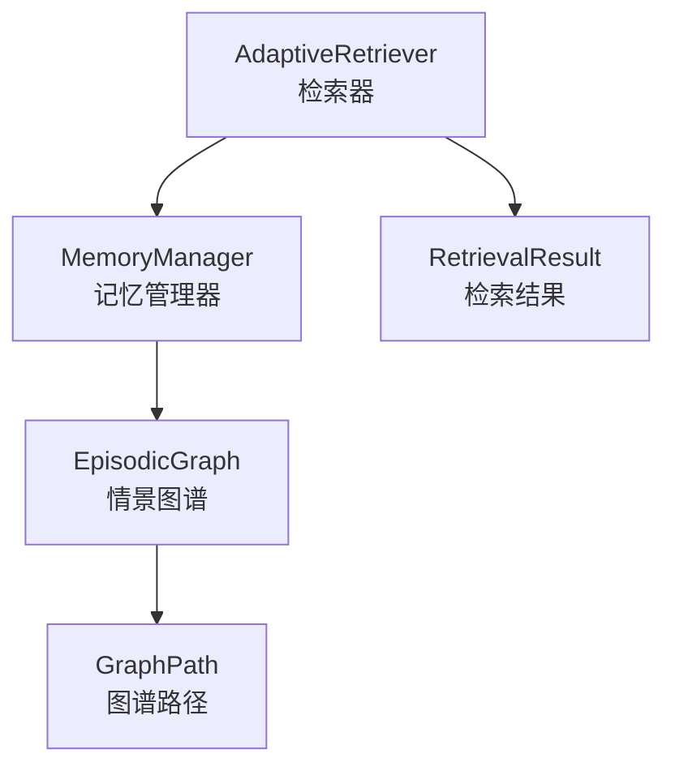
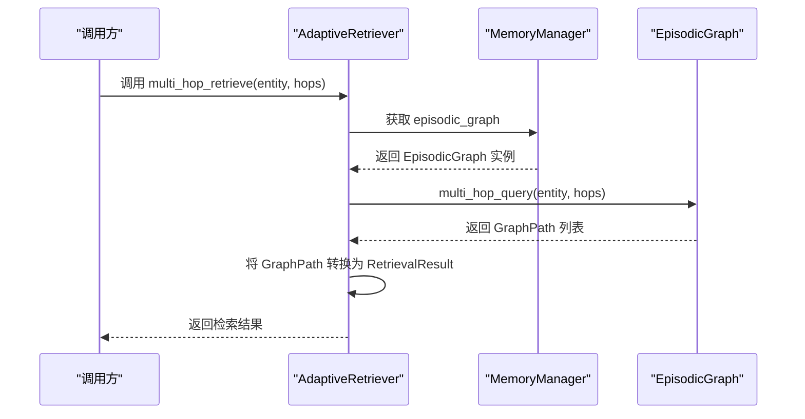
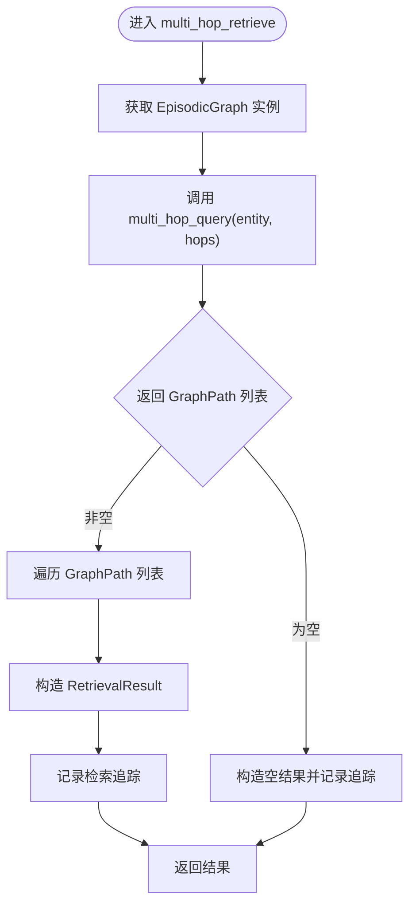
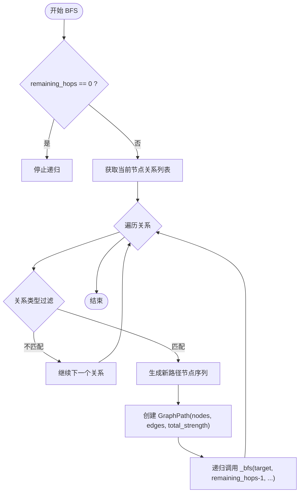
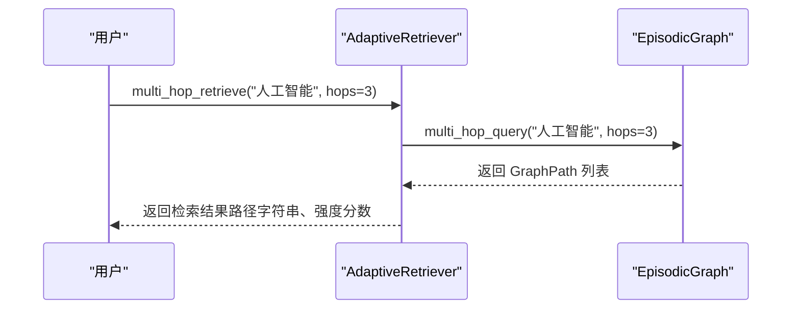
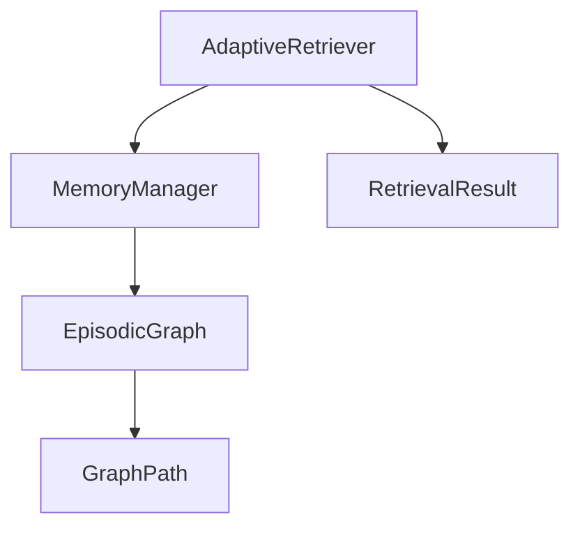

# 多跳检索机制

<cite>
**本文引用的文件**
- [episodic_graph.py](file://src/memory/episodic_graph.py)
- [retriever.py](file://src/retrieval/retriever.py)
- [models.py](file://src/retrieval/models.py)
- [manager.py](file://src/memory/manager.py)
- [README.md](file://src/retrieval/README.md)
- [design.md](file://design/design.md)
- [example_usage.py](file://example/example_usage.py)
</cite>

## 目录
1. [简介](#简介)
2. [项目结构](#项目结构)
3. [核心组件](#核心组件)
4. [架构总览](#架构总览)
5. [详细组件分析](#详细组件分析)
6. [依赖关系分析](#依赖关系分析)
7. [性能考量](#性能考量)
8. [故障排查指南](#故障排查指南)
9. [结论](#结论)
10. [附录](#附录)

## 简介
本文件围绕 NecoRAG 的多跳检索机制展开，系统阐述其理论基础（扩散激活理论）、实现原理（图谱遍历、路径发现与强度计算）、hop 数对检索效果的影响、最优 hop 数选择策略、复杂查询场景下的优势与局限、实际案例分析以及性能优化与调试方法。文档旨在帮助读者从概念到代码层面全面理解多跳检索的设计与落地。

## 项目结构
多跳检索涉及检索层与记忆层的协作：
- 检索层：AdaptiveRetriever 提供 multi_hop_retrieve 方法，委托记忆层进行图谱遍历。
- 记忆层：EpisodicGraph 提供 multi_hop_query，内部以 BFS 为基础进行多跳遍历，生成 GraphPath。
- 数据模型：RetrievalResult、GraphPath 等承载检索结果与路径信息。
- 设计文档：扩散激活理论与检索流程在设计文档中有明确阐述。

**图表来源**
- [retriever.py:334-364](file://src/retrieval/retriever.py#L334-L364)
- [manager.py](file://src/memory/manager.py#L42)
- [episodic_graph.py:71-93](file://src/memory/episodic_graph.py#L71-L93)
- [models.py:9-29](file://src/retrieval/models.py#L9-L29)

**章节来源**
- [retriever.py:123-165](file://src/retrieval/retriever.py#L123-L165)
- [manager.py:16-47](file://src/memory/manager.py#L16-L47)
- [episodic_graph.py:10-32](file://src/memory/episodic_graph.py#L10-L32)
- [models.py:14-34](file://src/retrieval/models.py#L14-L34)

## 核心组件
- AdaptiveRetriever.multi_hop_retrieve：对外暴露的多跳检索入口，接收起始实体与 hop 数，返回检索结果列表。
- EpisodicGraph.multi_hop_query/_bfs：图谱遍历的核心实现，基于 BFS 生成路径集合。
- GraphPath：封装节点序列、边集合与总强度，作为检索路径的载体。
- RetrievalResult：检索结果的数据结构，包含内容、分数、来源与检索路径。

**章节来源**
- [retriever.py:334-364](file://src/retrieval/retriever.py#L334-L364)
- [episodic_graph.py:71-125](file://src/memory/episodic_graph.py#L71-L125)
- [models.py:9-34](file://src/retrieval/models.py#L9-L34)

## 架构总览
多跳检索在检索层与记忆层之间形成清晰的职责划分：
- 检索层负责策略与结果包装，记忆层负责图谱存储与遍历。
- 设计文档强调“扩散激活”作为多跳联想的理论基础，检索流程中体现为“线索匹配 → 扩散激活 → 模式完成”。

**图表来源**
- [retriever.py:334-364](file://src/retrieval/retriever.py#L334-L364)
- [manager.py](file://src/memory/manager.py#L42)
- [episodic_graph.py:71-93](file://src/memory/episodic_graph.py#L71-L93)

**章节来源**
- [design.md:122-144](file://design/design.md#L122-L144)
- [README.md:43-59](file://src/retrieval/README.md#L43-L59)

## 详细组件分析

### 多跳检索方法 multi_hop_retrieve 的实现原理
- 输入：起始实体标识、hop 数（默认 3）。
- 控制流：
  1) 调用记忆层的 EpisodicGraph.multi_hop_query。
  2) 遍历返回的 GraphPath 列表，构造 RetrievalResult。
  3) 记录检索追踪信息。
- 输出：检索结果列表，包含路径字符串、强度分数与来源标记。

**图表来源**
- [retriever.py:334-364](file://src/retrieval/retriever.py#L334-L364)

**章节来源**
- [retriever.py:334-364](file://src/retrieval/retriever.py#L334-L364)

### 图谱遍历算法与路径发现机制
- 算法：BFS（广度优先搜索）。
- 关键点：
  - 递归深度受剩余 hop 数控制，remaining_hops==0 时停止。
  - 从当前节点出发，遍历其关系边，生成新的路径节点序列与边集合。
  - GraphPath 包含 nodes（节点序列）、edges（边集合）与 total_strength（总强度）。
- 关系类型过滤：支持 relation_types 参数，仅保留指定类型的关系。

**图表来源**
- [episodic_graph.py:95-125](file://src/memory/episodic_graph.py#L95-L125)

**章节来源**
- [episodic_graph.py:71-125](file://src/memory/episodic_graph.py#L71-L125)

### 强度计算方法与扩散激活理论
- 当前实现：GraphPath.total_strength 在构造时统一初始化为 1.0（简化实现）。
- 理论基础：扩散激活（Spreading Activation）描述概念激活在网络中的传播，激活值可通过关系强度相乘传递。
- 设计文档指出多跳检索支持“关系强度衰减机制、循环路径检测、动态剪枝优化”，这些优化在当前最小实现中尚未完全体现，但为后续演进预留了空间。

**章节来源**
- [episodic_graph.py:117-121](file://src/memory/episodic_graph.py#L117-L121)
- [README.md:43-59](file://src/retrieval/README.md#L43-L59)
- [design.md:114-121](file://design/design.md#L114-L121)

### hop 数对检索效果的影响与最优选择策略
- 影响：
  - hop 数越大，覆盖范围越广，但也可能引入噪声与冗余。
  - 过小可能导致信息不足，无法完成推理；过大可能带来计算开销与结果稀释。
- 选择策略（结合设计文档与检索流程）：
  - 简单查询：优先向量检索，hop 数较小或不启用图谱。
  - 复杂查询：启用图谱，合理设置 hop 数（如 3），配合重排序与新颖性惩罚。
  - 推理查询：优先图谱多跳，结合 HyDE 增强与领域权重，适当提高 hop 数以获得更广的上下文。
- 参数参考：README 中 max_hops 默认为 3，可按需调整。

**章节来源**
- [README.md:289-303](file://src/retrieval/README.md#L289-L303)
- [README.md:307-313](file://src/retrieval/README.md#L307-L313)

### 多跳检索在复杂查询场景下的优势与局限
- 优势：
  - 支持多跳推理，从实体出发扩展到相关概念，提升复杂问题的理解与回答质量。
  - 与扩散激活理论结合，能够模拟“联想网络”的激活传播。
- 局限：
  - 当前实现为最小可行版本，未体现关系强度衰减、循环检测与动态剪枝等优化。
  - total_strength 未按关系强度累乘，可能影响路径质量排序。

**章节来源**
- [README.md:43-59](file://src/retrieval/README.md#L43-L59)
- [episodic_graph.py:117-121](file://src/memory/episodic_graph.py#L117-L121)

### 实际案例分析：从实体出发的多跳推理过程
- 场景：从“人工智能”实体出发，进行 3 跳检索，得到一系列路径字符串与强度分数。
- 流程：
  1) 调用 AdaptiveRetriever.multi_hop_retrieve。
  2) EpisodicGraph.multi_hop_query 以 BFS 生成 GraphPath 列表。
  3) 转换为 RetrievalResult，路径字段为“ -> ”拼接的节点序列。
- 示例调用参考：README 中的使用示例展示了 multi_hop_retrieve 的典型用法。

**图表来源**
- [retriever.py:334-364](file://src/retrieval/retriever.py#L334-L364)
- [README.md:243-247](file://src/retrieval/README.md#L243-L247)

**章节来源**
- [README.md:223-257](file://src/retrieval/README.md#L223-L257)
- [example_usage.py:94-136](file://example/example_usage.py#L94-L136)

## 依赖关系分析
- AdaptiveRetriever 依赖 MemoryManager，后者持有 EpisodicGraph 实例。
- EpisodicGraph 依赖 GraphPath 数据模型。
- RetrievalResult 作为检索结果载体，贯穿检索层与记忆层之间的数据交换。

**图表来源**
- [retriever.py:148-152](file://src/retrieval/retriever.py#L148-L152)
- [manager.py](file://src/memory/manager.py#L42)
- [episodic_graph.py:21-32](file://src/memory/episodic_graph.py#L21-L32)
- [models.py:9-29](file://src/retrieval/models.py#L9-L29)

**章节来源**
- [retriever.py:123-165](file://src/retrieval/retriever.py#L123-L165)
- [manager.py:16-47](file://src/memory/manager.py#L16-L47)

## 性能考量
- BFS 遍历复杂度：与节点度数和 hop 数呈指数关系，建议：
  - 合理限制 hop 数（如 3），避免路径爆炸。
  - 引入关系类型过滤与动态剪枝，减少无效扩展。
  - 对 GraphPath 的 total_strength 引入关系强度累乘，提升路径质量排序。
- 计算与存储：
  - 优先使用内存图结构（当前实现）进行原型验证，后续可接入 Neo4j/NebulaGraph 以获得更好的查询与索引能力。
- 早停机制：
  - 检索层已有早停控制器，可在多跳检索后结合置信度策略进一步优化。

[本节为通用性能讨论，不直接分析具体文件]

## 故障排查指南
- 常见问题与定位：
  - multi_hop_retrieve 返回空结果：检查起始实体是否存在、关系类型过滤是否过于严格。
  - 结果质量不佳：确认 hop 数是否合适，考虑引入关系强度衰减与动态剪枝。
  - 性能瓶颈：观察 BFS 展开规模，必要时限制最大深度或增加过滤条件。
- 调试方法：
  - 使用检索追踪（get_retrieval_trace）查看检索步骤与中间状态。
  - 在 EpisodicGraph.multi_hop_query 中增加日志，观察路径生成过程。
  - 对比不同 hop 数下的路径数量与质量，确定最优参数。

**章节来源**
- [retriever.py:366-373](file://src/retrieval/retriever.py#L366-L373)
- [episodic_graph.py:71-93](file://src/memory/episodic_graph.py#L71-L93)

## 结论
多跳检索以扩散激活理论为指导，通过图谱 BFS 遍历实现从实体出发的联想推理。当前实现提供了最小可行的多跳检索能力，后续可在关系强度建模、循环检测、动态剪枝等方面进一步优化，以提升检索质量与性能。结合设计文档中的检索流程与意图路由策略，多跳检索在复杂查询与推理场景中具有明显优势，但仍需在实践中持续调参与迭代。

[本节为总结性内容，不直接分析具体文件]

## 附录
- 相关参数与配置参考：
  - max_hops 默认值为 3，可按需调整。
  - 多跳检索返回的强度分数当前为 1.0（简化实现），后续可改为按关系强度累乘。
- 使用示例参考：
  - README 中提供了 multi_hop_retrieve 的使用示例与检索流程说明。

**章节来源**
- [README.md:307-313](file://src/retrieval/README.md#L307-L313)
- [README.md:223-257](file://src/retrieval/README.md#L223-L257)