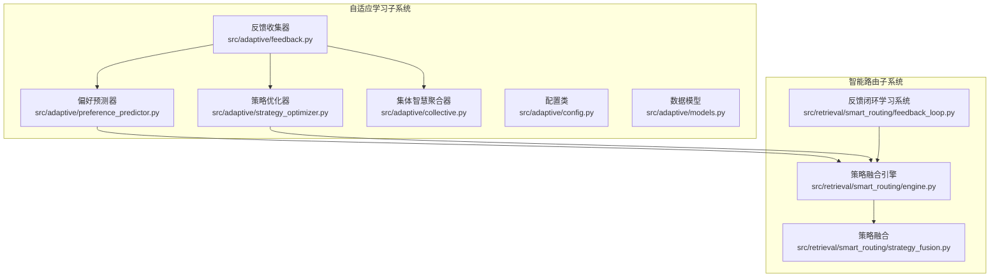
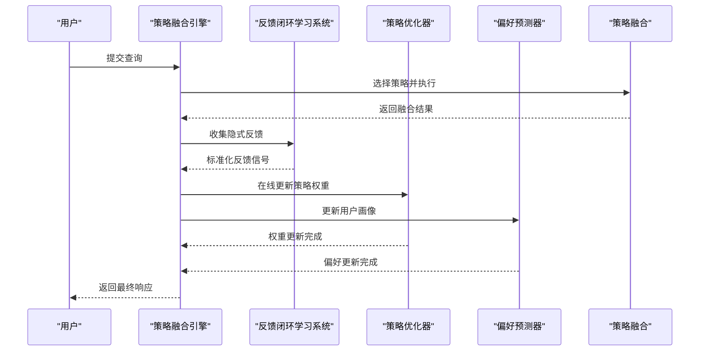
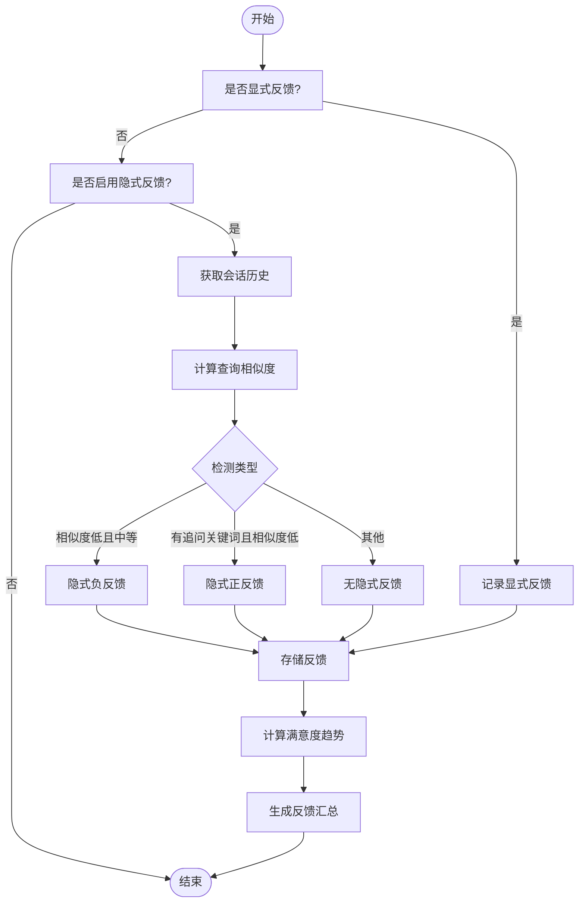
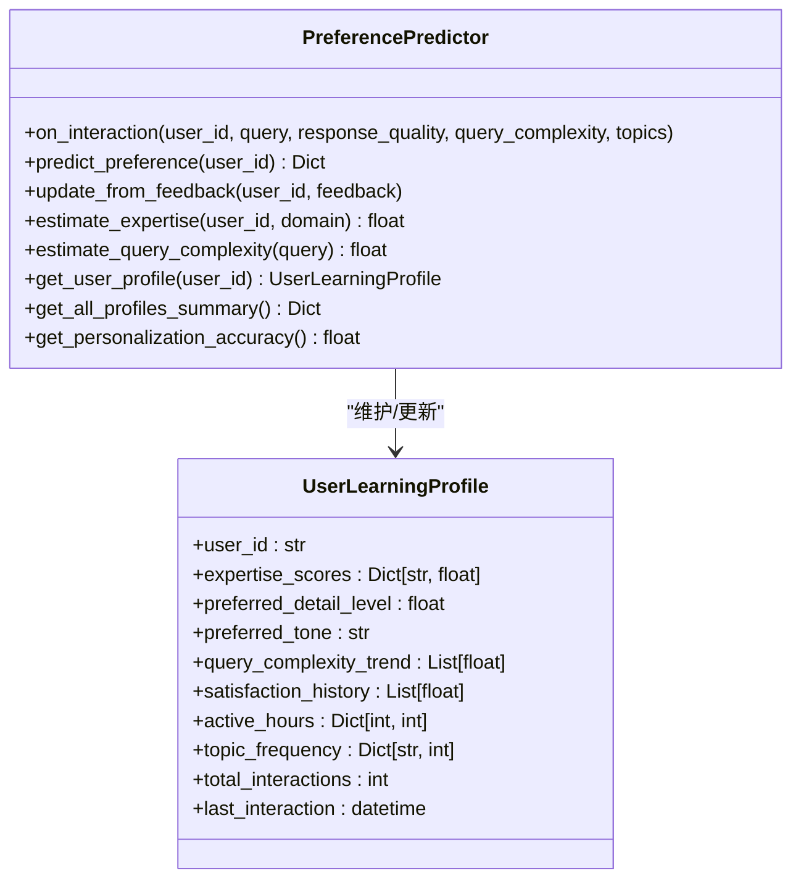
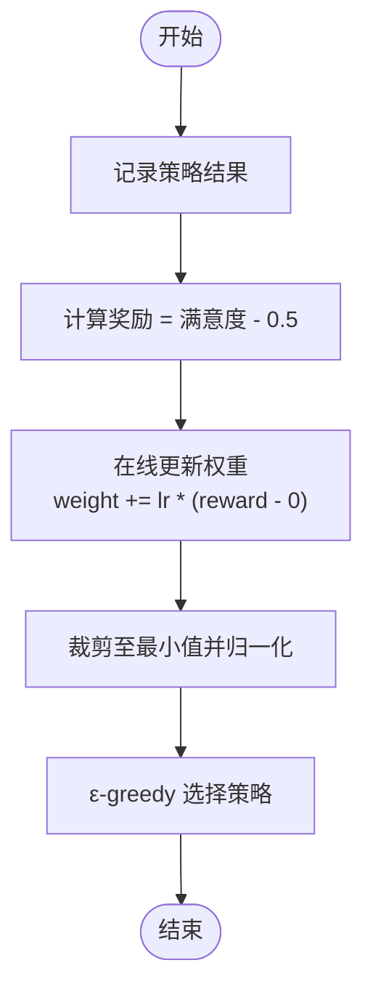
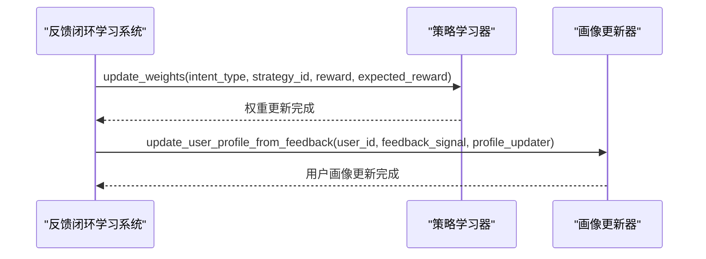
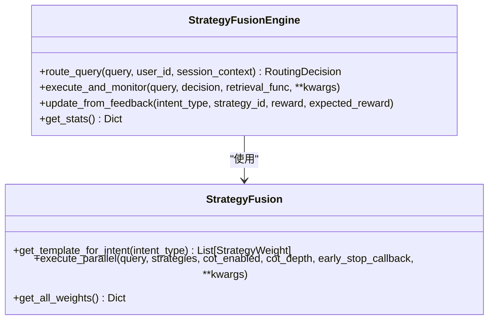
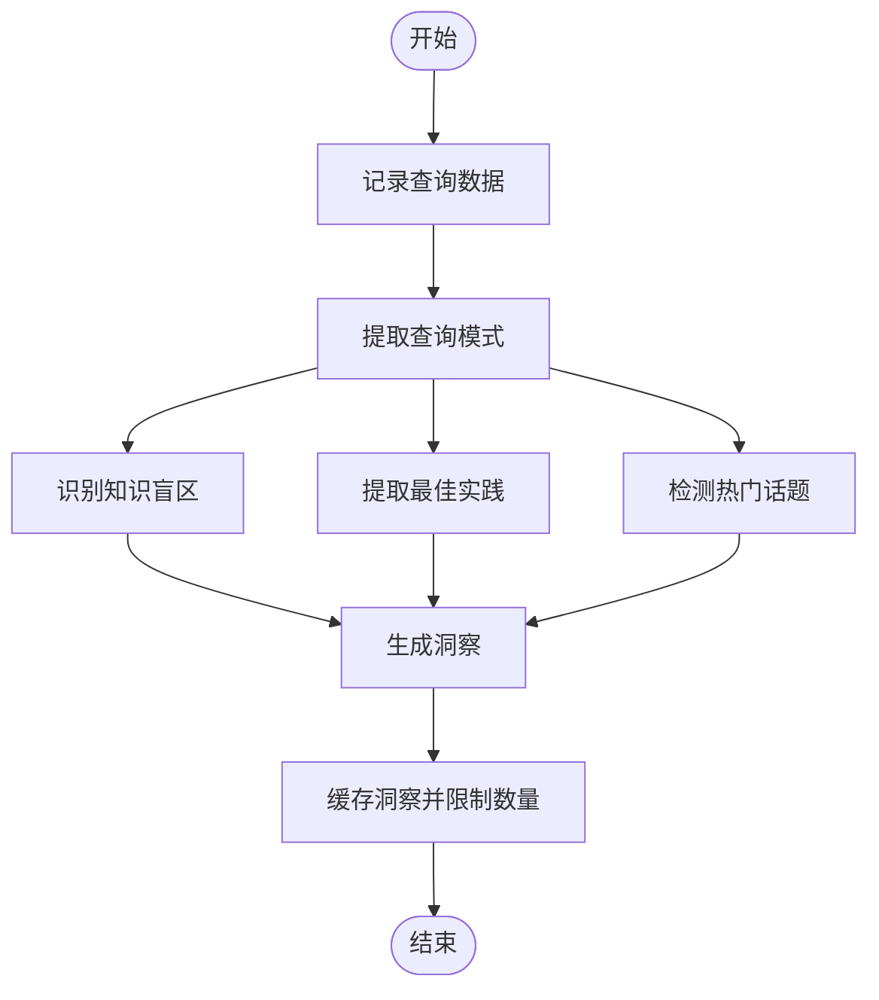
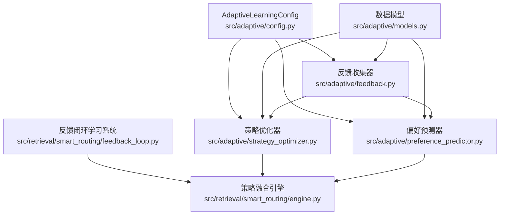

# 反馈循环模块

<cite>
**本文档引用的文件**
- [feedback.py](file://src/adaptive/feedback.py)
- [strategy_optimizer.py](file://src/adaptive/strategy_optimizer.py)
- [preference_predictor.py](file://src/adaptive/preference_predictor.py)
- [config.py](file://src/adaptive/config.py)
- [models.py](file://src/adaptive/models.py)
- [feedback_loop.py](file://src/retrieval/smart_routing/feedback_loop.py)
- [engine.py](file://src/retrieval/smart_routing/engine.py)
- [strategy_fusion.py](file://src/retrieval/smart_routing/strategy_fusion.py)
- [collective.py](file://src/adaptive/collective.py)
</cite>

## 目录
1. [简介](#简介)
2. [项目结构](#项目结构)
3. [核心组件](#核心组件)
4. [架构总览](#架构总览)
5. [详细组件分析](#详细组件分析)
6. [依赖关系分析](#依赖关系分析)
7. [性能考量](#性能考量)
8. [故障排查指南](#故障排查指南)
9. [结论](#结论)
10. [附录](#附录)

## 简介
本文件面向“反馈循环模块”，系统性阐述隐式反馈收集与显式反馈处理机制、策略学习算法与权重更新逻辑、奖励信号设计与学习率调节、在线学习与离线训练的结合方式、反馈配置示例与学习参数设置、与策略融合的协同工作机制，以及学习效果监控与调优方法。文档同时提供可视化架构图与流程图，帮助读者快速理解与落地实施。

## 项目结构
反馈循环模块横跨自适应学习与智能路由两大子系统：
- 自适应学习子系统（src/adaptive）：包含反馈收集、偏好预测、策略优化、集体智慧等核心能力。
- 智能路由子系统（src/retrieval/smart_routing）：包含反馈闭环学习系统、策略融合引擎、意图路由等，负责将反馈转化为策略权重更新与个性化适配。

图表来源
- [feedback.py:19-398](file://src/adaptive/feedback.py#L19-L398)
- [preference_predictor.py:21-426](file://src/adaptive/preference_predictor.py#L21-L426)
- [strategy_optimizer.py:19-401](file://src/adaptive/strategy_optimizer.py#L19-L401)
- [collective.py:26-378](file://src/adaptive/collective.py#L26-L378)
- [feedback_loop.py:13-435](file://src/retrieval/smart_routing/feedback_loop.py#L13-L435)
- [engine.py:34-274](file://src/retrieval/smart_routing/engine.py#L34-L274)
- [strategy_fusion.py:43-349](file://src/retrieval/smart_routing/strategy_fusion.py#L43-L349)

章节来源
- [feedback.py:1-398](file://src/adaptive/feedback.py#L1-L398)
- [preference_predictor.py:1-426](file://src/adaptive/preference_predictor.py#L1-L426)
- [strategy_optimizer.py:1-401](file://src/adaptive/strategy_optimizer.py#L1-L401)
- [collective.py:1-378](file://src/adaptive/collective.py#L1-L378)
- [feedback_loop.py:1-435](file://src/retrieval/smart_routing/feedback_loop.py#L1-L435)
- [engine.py:1-274](file://src/retrieval/smart_routing/engine.py#L1-L274)
- [strategy_fusion.py:1-349](file://src/retrieval/smart_routing/strategy_fusion.py#L1-L349)

## 核心组件
- 反馈收集器（自适应学习）：支持显式反馈（评分、修正）与隐式反馈（查询改写、会话放弃、追问等），并提供满意度趋势、反馈汇总与模式分析。
- 偏好预测器（自适应学习）：基于用户交互历史估计专业度、预测偏好风格与内容深度，支持从反馈中微调偏好。
- 策略优化器（自适应学习）：采用 epsilon-greedy 与在线学习，对不同查询类型的策略权重进行增量更新，结合奖励信号与学习率。
- 反馈闭环学习系统（智能路由）：提供显式/隐式反馈信号采集、标准化与权重配置，并在运行时更新策略权重与用户画像。
- 策略融合引擎（智能路由）：整合意图识别、用户画像适配与策略融合，提供统一的路由决策接口，并与反馈闭环联动。
- 集体智慧聚合器（自适应学习）：从全局用户交互中提炼知识盲区、最佳实践与趋势洞察，辅助策略优化与个性化。

章节来源
- [feedback.py:19-398](file://src/adaptive/feedback.py#L19-L398)
- [preference_predictor.py:21-426](file://src/adaptive/preference_predictor.py#L21-L426)
- [strategy_optimizer.py:19-401](file://src/adaptive/strategy_optimizer.py#L19-L401)
- [feedback_loop.py:30-435](file://src/retrieval/smart_routing/feedback_loop.py#L30-L435)
- [engine.py:34-274](file://src/retrieval/smart_routing/engine.py#L34-L274)
- [collective.py:26-378](file://src/adaptive/collective.py#L26-L378)

## 架构总览
反馈循环模块通过“显式反馈 + 隐式反馈”的双通道收集机制，将用户行为转化为标准化的奖励信号；随后通过策略学习器与偏好预测器进行在线更新，并与策略融合引擎协同，实现“策略权重动态调整 + 个性化偏好适配”的闭环。

图表来源
- [engine.py:68-249](file://src/retrieval/smart_routing/engine.py#L68-L249)
- [feedback_loop.py:57-294](file://src/retrieval/smart_routing/feedback_loop.py#L57-L294)
- [strategy_optimizer.py:93-154](file://src/adaptive/strategy_optimizer.py#L93-L154)
- [preference_predictor.py:64-128](file://src/adaptive/preference_predictor.py#L64-L128)
- [strategy_fusion.py:78-158](file://src/retrieval/smart_routing/strategy_fusion.py#L78-L158)

## 详细组件分析

### 组件A：反馈收集与分析（自适应学习）
- 显式反馈：评分、修正、补充、无关标记等，统一记录并支持按类型/信号维度统计。
- 隐式反馈：基于会话历史与查询相似度检测“查询改写”（reformulation，负反馈）、“追问”（follow-up，正反馈）、“会话放弃”等。
- 满意度趋势：按时间窗口划分前后两段，计算平均满意度差值，反映系统改进/退化趋势。
- 反馈模式分析：按查询类型、小时活跃度、修正模式、低满意度查询等维度进行统计与洞察。

图表来源
- [feedback.py:96-170](file://src/adaptive/feedback.py#L96-L170)
- [feedback.py:198-240](file://src/adaptive/feedback.py#L198-L240)
- [feedback.py:241-350](file://src/adaptive/feedback.py#L241-L350)

章节来源
- [feedback.py:19-398](file://src/adaptive/feedback.py#L19-L398)

### 组件B：偏好预测与个性化（自适应学习）
- 专业度估计：结合查询复杂度趋势、专业术语使用与领域关键词，估计用户在各领域的专业度。
- 偏好预测：根据查询复杂度趋势与领域分布，推断内容详细程度偏好与语言风格偏好。
- 反馈驱动调整：从显式反馈中提取关于“详细程度”“风格”的线索，微调偏好设置。
- 个性化准确度：基于满意度历史计算整体个性化准确度。

图表来源
- [preference_predictor.py:21-426](file://src/adaptive/preference_predictor.py#L21-L426)
- [models.py:124-160](file://src/adaptive/models.py#L124-L160)

章节来源
- [preference_predictor.py:21-426](file://src/adaptive/preference_predictor.py#L21-L426)
- [models.py:124-160](file://src/adaptive/models.py#L124-L160)

### 组件C：策略学习与权重更新（自适应学习）
- 策略模板：内置多种检索策略参数模板，支持按查询类型推荐参数。
- 在线学习：记录策略执行结果（满意度、延迟、命中），计算奖励（满意度-0.5），以学习率增量更新策略权重。
- 探索与利用：采用 epsilon-greedy，在样本不足时默认策略，样本充足时按权重选择最优策略。
- 权重归一化：确保权重非负并归一化，避免策略权重失衡。

图表来源
- [strategy_optimizer.py:93-154](file://src/adaptive/strategy_optimizer.py#L93-L154)
- [strategy_optimizer.py:156-197](file://src/adaptive/strategy_optimizer.py#L156-L197)
- [strategy_optimizer.py:198-263](file://src/adaptive/strategy_optimizer.py#L198-L263)

章节来源
- [strategy_optimizer.py:19-401](file://src/adaptive/strategy_optimizer.py#L19-L401)

### 组件D：反馈闭环学习系统（智能路由）
- 显式反馈：评分标准化到[-1,1]，并赋予固定权重。
- 隐式反馈：查询改写、会话放弃、再次搜索、停留时长、引用行为等，分别映射到不同符号值与权重。
- 在线学习：基于预测误差（reward - expected_reward）更新策略权重，支持用户画像从反馈中更新。
- 统计监控：提供更新次数、总奖励、平均奖励与意图分布统计。

图表来源
- [feedback_loop.py:325-357](file://src/retrieval/smart_routing/feedback_loop.py#L325-L357)
- [feedback_loop.py:358-389](file://src/retrieval/smart_routing/feedback_loop.py#L358-L389)

章节来源
- [feedback_loop.py:30-435](file://src/retrieval/smart_routing/feedback_loop.py#L30-L435)

### 组件E：策略融合与协同（智能路由）
- 策略融合：多策略并行执行、结果融合、多样性控制与重排序。
- 协同机制：引擎根据意图识别与用户画像调节策略权重，执行并监控性能，收集隐式反馈，更新策略权重与用户画像。
- 早停与降级：根据早停管理器与置信度动态调整执行策略与降级等级。

图表来源
- [engine.py:34-274](file://src/retrieval/smart_routing/engine.py#L34-L274)
- [strategy_fusion.py:43-349](file://src/retrieval/smart_routing/strategy_fusion.py#L43-L349)

章节来源
- [engine.py:1-274](file://src/retrieval/smart_routing/engine.py#L1-L274)
- [strategy_fusion.py:1-349](file://src/retrieval/smart_routing/strategy_fusion.py#L1-L349)

### 组件F：集体智慧与洞察（自适应学习）
- 知识盲区识别：统计低满意度主题，识别影响广泛的共同知识盲区。
- 最佳实践提取：基于查询模式与反馈统计，提炼高满意度的查询实践。
- 趋势检测：识别近期查询量上升的热门话题。
- 洞察生成：按类型生成洞察并缓存，支持刷新间隔控制与数量上限。

图表来源
- [collective.py:61-92](file://src/adaptive/collective.py#L61-L92)
- [collective.py:124-153](file://src/adaptive/collective.py#L124-L153)
- [collective.py:155-201](file://src/adaptive/collective.py#L155-L201)
- [collective.py:203-230](file://src/adaptive/collective.py#L203-L230)
- [collective.py:232-322](file://src/adaptive/collective.py#L232-L322)

章节来源
- [collective.py:1-378](file://src/adaptive/collective.py#L1-L378)

## 依赖关系分析
- 配置与模型：自适应学习模块通过配置类统一管理反馈、偏好、策略优化等参数；数据模型定义反馈类型、策略性能、用户画像等核心数据结构。
- 模块耦合：反馈闭环学习系统与策略融合引擎紧密耦合，前者提供反馈信号，后者负责权重更新与个性化适配。
- 外部依赖：策略融合引擎依赖意图路由、用户画像适配、思维链控制与早停管理器，形成完整的三层决策架构。

图表来源
- [config.py:15-200](file://src/adaptive/config.py#L15-L200)
- [models.py:14-258](file://src/adaptive/models.py#L14-L258)
- [feedback.py:27-35](file://src/adaptive/feedback.py#L27-L35)
- [preference_predictor.py:48-57](file://src/adaptive/preference_predictor.py#L48-L57)
- [strategy_optimizer.py:59-76](file://src/adaptive/strategy_optimizer.py#L59-L76)
- [feedback_loop.py:40-56](file://src/retrieval/smart_routing/feedback_loop.py#L40-L56)
- [engine.py:44-62](file://src/retrieval/smart_routing/engine.py#L44-L62)

章节来源
- [config.py:1-200](file://src/adaptive/config.py#L1-L200)
- [models.py:1-258](file://src/adaptive/models.py#L1-L258)
- [feedback.py:1-398](file://src/adaptive/feedback.py#L1-L398)
- [preference_predictor.py:1-426](file://src/adaptive/preference_predictor.py#L1-L426)
- [strategy_optimizer.py:1-401](file://src/adaptive/strategy_optimizer.py#L1-L401)
- [feedback_loop.py:1-435](file://src/retrieval/smart_routing/feedback_loop.py#L1-L435)
- [engine.py:1-274](file://src/retrieval/smart_routing/engine.py#L1-L274)

## 性能考量
- 在线学习平滑：策略优化器与反馈闭环学习系统均采用指数移动平均与平滑裁剪，避免权重剧烈波动。
- 探索与利用平衡：epsilon-greedy 探索率控制新策略尝试频率，样本不足时默认策略，减少过早收敛风险。
- 多策略并行：策略融合引擎支持多策略并行执行与早停回调，兼顾吞吐与延迟。
- 内存与存储：反馈收集器限制历史长度与清理旧数据，避免内存膨胀；偏好预测器定期更新偏好，控制计算开销。

## 故障排查指南
- 反馈未生效
  - 检查配置开关：反馈收集、偏好学习、策略优化是否开启。
  - 检查反馈类型：确认显式/隐式反馈是否正确记录与标准化。
- 策略权重异常
  - 检查学习率与探索率：学习率过高可能导致权重震荡，探索率过高可能影响稳定性。
  - 检查最小样本数：样本不足时默认策略，权重不会更新。
- 偏好预测不准
  - 检查交互频率与更新间隔：更新过于频繁或过慢都会影响准确性。
  - 检查查询复杂度估计：专业术语与问题类型会影响复杂度评估。
- 集体智慧缺失
  - 检查最少用户数阈值与洞察刷新间隔，确保数据足够与缓存有效。

章节来源
- [config.py:157-192](file://src/adaptive/config.py#L157-L192)
- [strategy_optimizer.py:212-263](file://src/adaptive/strategy_optimizer.py#L212-L263)
- [preference_predictor.py:121-128](file://src/adaptive/preference_predictor.py#L121-L128)
- [collective.py:242-247](file://src/adaptive/collective.py#L242-L247)

## 结论
反馈循环模块通过“显式反馈 + 隐式反馈”的双通道收集与“在线学习 + 个性化适配”的协同机制，实现了从用户行为到策略权重与偏好设置的闭环优化。配合策略融合引擎与集体智慧洞察，系统能够在持续交互中不断“变聪明”，提升满意度与个性化水平。建议在生产环境中结合业务场景合理设置学习率、探索率与样本阈值，并建立监控与回滚机制，确保稳定与可控。

## 附录

### 学习参数与配置示例
- 自适应学习配置（节选）
  - 反馈收集：启用反馈收集、隐式反馈、历史长度等。
  - 偏好学习：启用偏好学习、偏好更新间隔、专业度学习速率、满意度窗口等。
  - 策略优化：启用策略优化、学习率、最小样本数、探索率、默认策略集合等。
  - 集体学习：启用集体学习、最少用户数、洞察刷新间隔、最大洞察数等。
- 预设模式
  - 默认模式：启用全部核心功能。
  - 积极学习模式：提高学习速率与探索率，适合快速迭代。
  - 保守学习模式：降低学习速率与探索率，适合稳定场景。
  - 最小配置：禁用集体学习与隐式反馈，仅保留核心功能。

章节来源
- [config.py:15-200](file://src/adaptive/config.py#L15-L200)

### 奖励信号设计与学习率调节
- 奖励信号
  - 显式反馈：评分标准化到[-1,1]，赋予固定权重。
  - 隐式反馈：查询改写、会话放弃、再次搜索、停留时长、引用行为等映射到不同符号值与权重。
- 学习率调节
  - 策略优化器：学习率由配置决定，采用增量更新与裁剪，确保权重稳定。
  - 反馈闭环学习系统：学习率可配置，采用预测误差驱动的权重更新。

章节来源
- [feedback_loop.py:44-51](file://src/retrieval/smart_routing/feedback_loop.py#L44-L51)
- [feedback_loop.py:315-317](file://src/retrieval/smart_routing/feedback_loop.py#L315-L317)
- [strategy_optimizer.py:186-187](file://src/adaptive/strategy_optimizer.py#L186-L187)

### 在线学习与离线训练结合
- 在线学习：实时收集反馈，快速调整策略权重与用户偏好，适合动态变化场景。
- 离线训练：可将交互记录导出，离线训练偏好模型与策略性能预测器，再将结果回灌线上，提升稳定性与可解释性。

### 与策略融合的协同工作机制
- 引擎层：意图识别、用户画像适配、策略融合与早停管理协同，输出路由决策。
- 反馈层：收集隐式反馈，更新策略权重与用户画像，形成闭环。
- 融合层：多策略并行执行与结果融合，保证多样性与质量。

章节来源
- [engine.py:68-249](file://src/retrieval/smart_routing/engine.py#L68-L249)
- [strategy_fusion.py:78-158](file://src/retrieval/smart_routing/strategy_fusion.py#L78-L158)

### 学习效果监控与调优方法
- 指标体系
  - 满意度趋势：改善/退化趋势。
  - 策略优化收益：相对基准的提升。
  - 个性化准确度：基于满意度历史。
  - 知识覆盖增长率：主题多样性增长。
- 调优建议
  - 动态调整学习率与探索率，观察平均奖励与更新次数。
  - 关注策略权重分布与使用频次，避免过度集中。
  - 结合集体智慧洞察，优化策略模板与参数。

章节来源
- [models.py:193-219](file://src/adaptive/models.py#L193-L219)
- [collective.py:358-377](file://src/adaptive/collective.py#L358-L377)