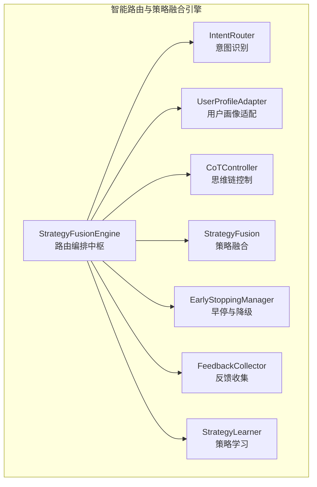
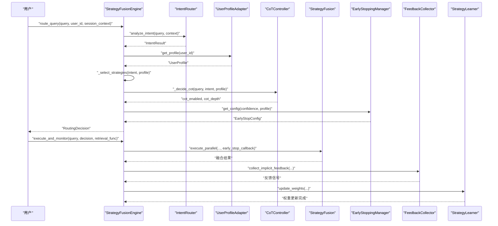
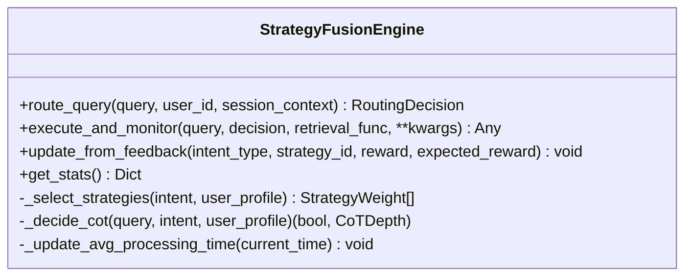
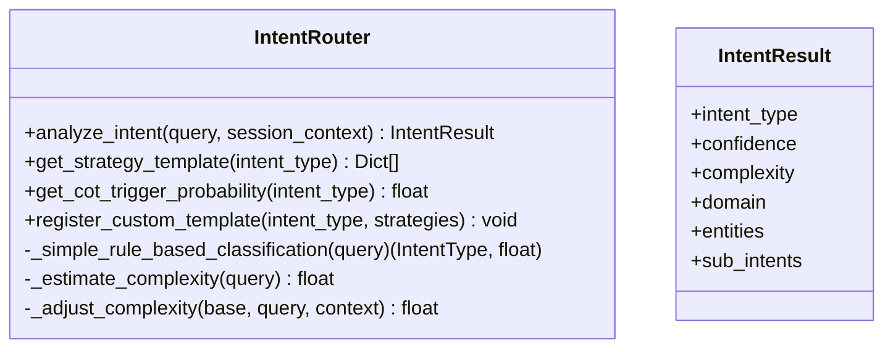
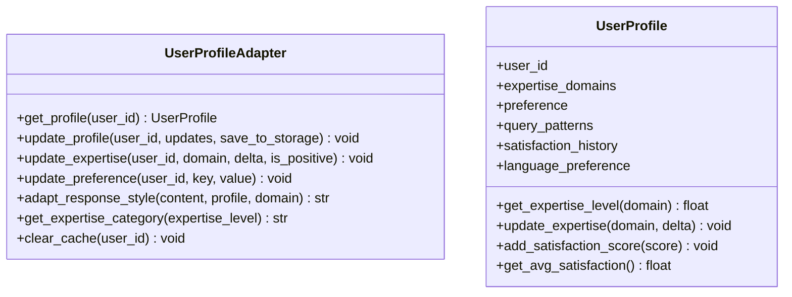
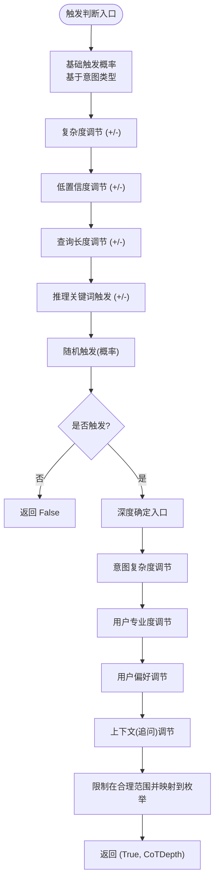
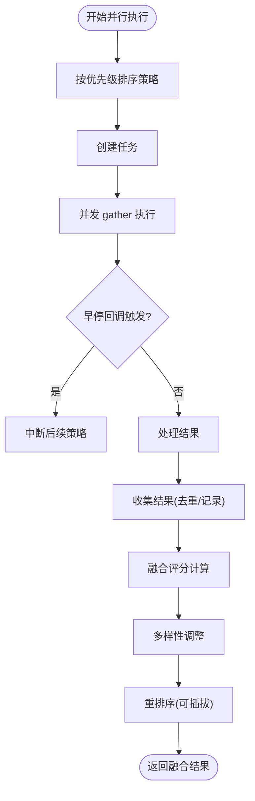
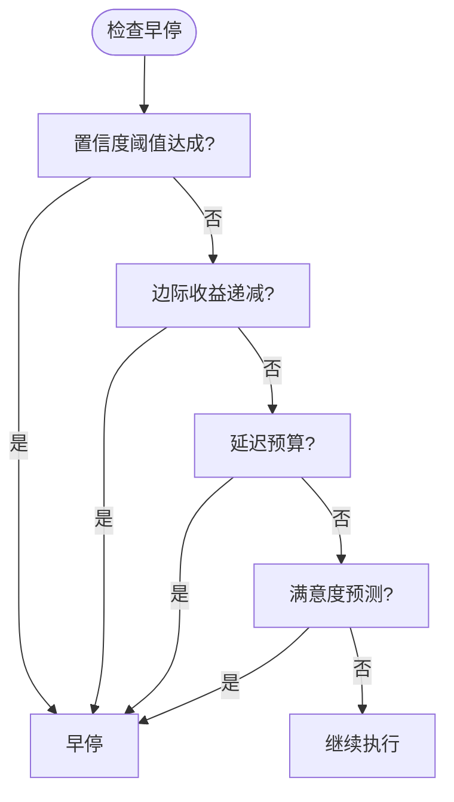
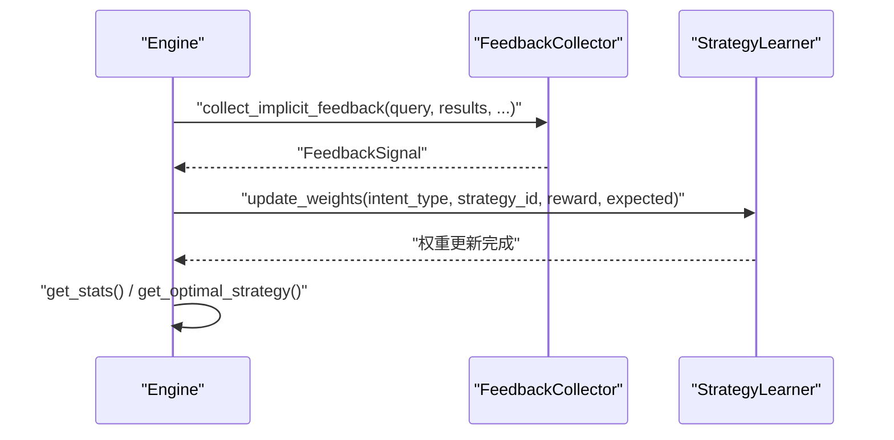
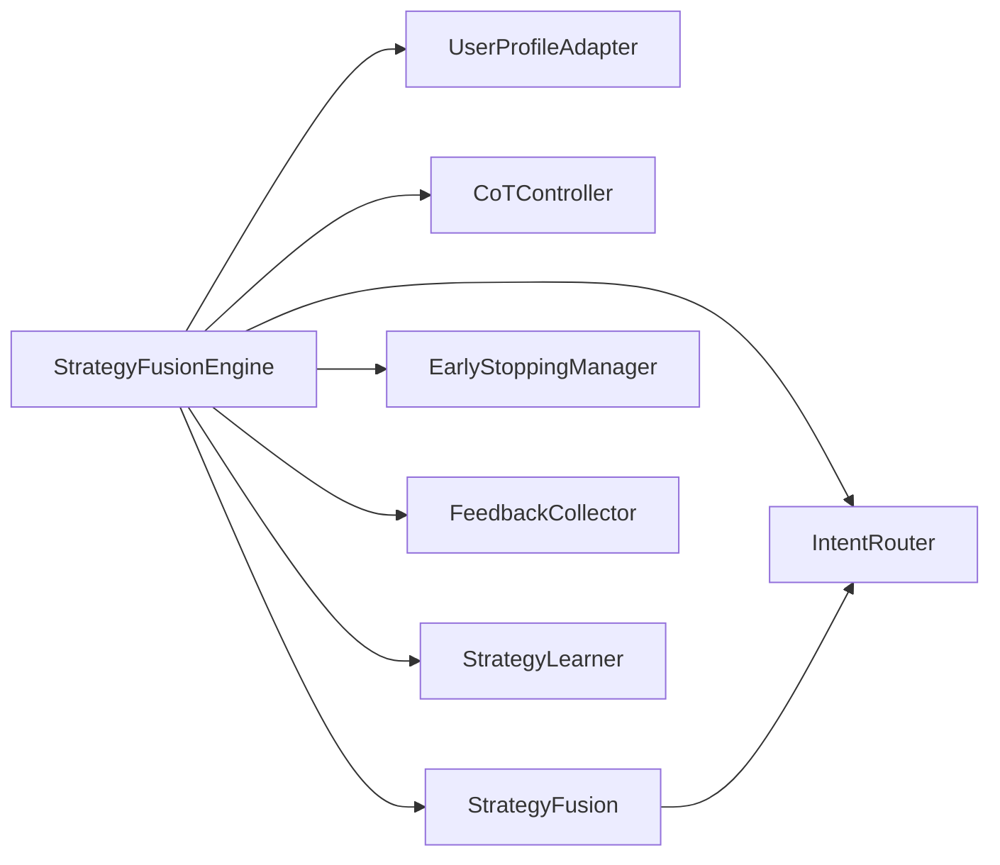

# 引擎核心模块

<cite>
**本文引用的文件**
- [engine.py](file://src/retrieval/smart_routing/engine.py)
- [__init__.py](file://src/retrieval/smart_routing/__init__.py)
- [intent_router.py](file://src/retrieval/smart_routing/intent_router.py)
- [user_adapter.py](file://src/retrieval/smart_routing/user_adapter.py)
- [cot_controller.py](file://src/retrieval/smart_routing/cot_controller.py)
- [strategy_fusion.py](file://src/retrieval/smart_routing/strategy_fusion.py)
- [early_stopping.py](file://src/retrieval/smart_routing/early_stopping.py)
- [feedback_loop.py](file://src/retrieval/smart_routing/feedback_loop.py)
- [example_usage.py](file://src/retrieval/smart_routing/example_usage.py)
- [SMART_ROUTING_FUSION_ENGINE.md](file://design/SMART_ROUTING_FUSION_ENGINE.md)
- [base.py](file://src/core/base.py)
- [config.py](file://src/core/config.py)
- [exceptions.py](file://src/core/exceptions.py)
- [protocols.py](file://src/core/protocols.py)
</cite>

## 目录
1. [引言](#引言)
2. [项目结构](#项目结构)
3. [核心组件](#核心组件)
4. [架构总览](#架构总览)
5. [详细组件分析](#详细组件分析)
6. [依赖分析](#依赖分析)
7. [性能考量](#性能考量)
8. [故障排查指南](#故障排查指南)
9. [结论](#结论)
10. [附录](#附录)

## 引言
本文件面向“智能路由引擎核心模块”，系统化阐述三层决策架构的设计理念与实现细节，包括意图识别层、用户画像层与策略融合层的协作机制、数据流转过程、异步执行与并发控制策略、性能监控与统计收集机制，并提供使用示例、配置指南、错误处理与异常恢复机制，以及性能优化与扩展性建议。

## 项目结构
智能路由引擎位于 src/retrieval/smart_routing 目录，围绕 StrategyFusionEngine 作为编排中枢，整合意图识别、用户画像、CoT 控制、策略融合、早停与降级、反馈学习等子模块；同时在 design 目录提供了完整的设计文档，涵盖三层决策流程、策略权重与 CoT 深度调节、多策略并行与融合、早停与降级、反馈闭环等。

图表来源
- [engine.py:34-129](file://src/retrieval/smart_routing/engine.py#L34-L129)
- [intent_router.py:91-155](file://src/retrieval/smart_routing/intent_router.py#L91-L155)
- [user_adapter.py:98-150](file://src/retrieval/smart_routing/user_adapter.py#L98-L150)
- [cot_controller.py:21-107](file://src/retrieval/smart_routing/cot_controller.py#L21-L107)
- [strategy_fusion.py:43-158](file://src/retrieval/smart_routing/strategy_fusion.py#L43-L158)
- [early_stopping.py:39-109](file://src/retrieval/smart_routing/early_stopping.py#L39-L109)
- [feedback_loop.py:30-149](file://src/retrieval/smart_routing/feedback_loop.py#L30-L149)

章节来源
- [__init__.py:11-30](file://src/retrieval/smart_routing/__init__.py#L11-L30)
- [SMART_ROUTING_FUSION_ENGINE.md:336-425](file://design/SMART_ROUTING_FUSION_ENGINE.md#L336-L425)

## 核心组件
- StrategyFusionEngine：三层决策的编排者，负责路由决策、策略权重选择、CoT 决策、早停配置、执行监控与统计。
- IntentRouter：语义意图分类、复杂度评估、策略模板映射与 CoT 触发概率。
- UserProfileAdapter：用户画像获取与更新、专业度评估、风格偏好适配、个性化响应风格调整。
- CoTController：智能触发判断与动态深度调节，支持 L1-L4 四级深度。
- StrategyFusion：多策略并行执行、结果融合、多样性保证与重排序。
- EarlyStoppingManager：多维度早停判断与降级等级决策。
- FeedbackCollector/StrategyLearner：显式/隐式反馈收集与在线学习，策略权重动态更新。

章节来源
- [engine.py:34-129](file://src/retrieval/smart_routing/engine.py#L34-L129)
- [intent_router.py:91-155](file://src/retrieval/smart_routing/intent_router.py#L91-L155)
- [user_adapter.py:98-150](file://src/retrieval/smart_routing/user_adapter.py#L98-L150)
- [cot_controller.py:21-107](file://src/retrieval/smart_routing/cot_controller.py#L21-L107)
- [strategy_fusion.py:43-158](file://src/retrieval/smart_routing/strategy_fusion.py#L43-L158)
- [early_stopping.py:39-109](file://src/retrieval/smart_routing/early_stopping.py#L39-L109)
- [feedback_loop.py:30-149](file://src/retrieval/smart_routing/feedback_loop.py#L30-L149)

## 架构总览
三层决策架构与数据流如下：

图表来源
- [engine.py:68-129](file://src/retrieval/smart_routing/engine.py#L68-L129)
- [engine.py:205-249](file://src/retrieval/smart_routing/engine.py#L205-L249)
- [strategy_fusion.py:78-158](file://src/retrieval/smart_routing/strategy_fusion.py#L78-L158)
- [early_stopping.py:210-243](file://src/retrieval/smart_routing/early_stopping.py#L210-L243)
- [feedback_loop.py:30-149](file://src/retrieval/smart_routing/feedback_loop.py#L30-L149)

## 详细组件分析

### StrategyFusionEngine：三层编排与执行监控
- 路由决策流程：意图识别 → 用户画像 → 策略选择 → CoT 决策 → 早停配置 → 生成 RoutingDecision。
- 策略权重选择：基于意图模板与用户画像（专家度、偏好）进行加权与归一化。
- CoT 决策：综合意图类型、复杂度、置信度与用户画像动态确定是否启用与深度。
- 执行监控：注入早停回调，记录处理时间并更新平均处理时间；执行后收集隐式反馈并驱动策略学习。
- 统计接口：提供总请求数、平均处理时间、策略权重、CoT 触发率等。

图表来源
- [engine.py:34-274](file://src/retrieval/smart_routing/engine.py#L34-L274)

章节来源
- [engine.py:68-129](file://src/retrieval/smart_routing/engine.py#L68-L129)
- [engine.py:131-196](file://src/retrieval/smart_routing/engine.py#L131-L196)
- [engine.py:205-265](file://src/retrieval/smart_routing/engine.py#L205-L265)
- [engine.py:266-274](file://src/retrieval/smart_routing/engine.py#L266-L274)

### IntentRouter：意图识别与复杂度评估
- 意图类型：7 大类语义意图，提供默认策略模板与 CoT 触发概率。
- 规则与分类：支持基于现有分类器或简单规则匹配；复杂度估算与上下文调整。
- 模板与概率：提供策略模板、CoT 触发概率查询接口，支持自定义模板注册。

图表来源
- [intent_router.py:91-278](file://src/retrieval/smart_routing/intent_router.py#L91-L278)

章节来源
- [intent_router.py:115-155](file://src/retrieval/smart_routing/intent_router.py#L115-L155)
- [intent_router.py:240-246](file://src/retrieval/smart_routing/intent_router.py#L240-L246)
- [intent_router.py:248-277](file://src/retrieval/smart_routing/intent_router.py#L248-L277)

### UserProfileAdapter：用户画像与个性化适配
- 用户画像：包含领域专业度、偏好、查询模式、满意度历史等；支持缓存与持久化。
- 专业度评估：按领域计算平均专业度，提供分类；支持增量更新。
- 偏好适配：根据专业度与偏好调整响应风格（简洁/平衡/详细、正式/随意/幽默、格式偏好等）。
- 缓存与更新：LRU 缓存、按需持久化、偏好更新接口。

图表来源
- [user_adapter.py:98-331](file://src/retrieval/smart_routing/user_adapter.py#L98-L331)

章节来源
- [user_adapter.py:133-150](file://src/retrieval/smart_routing/user_adapter.py#L133-L150)
- [user_adapter.py:176-223](file://src/retrieval/smart_routing/user_adapter.py#L176-L223)
- [user_adapter.py:248-288](file://src/retrieval/smart_routing/user_adapter.py#L248-L288)

### CoTController：智能触发与深度调节
- 触发判断：基于意图类型、复杂度、置信度、查询长度、关键词与随机性综合判定。
- 深度调节：依据意图复杂度、用户专业度、偏好与上下文（追问）动态确定 L1-L4 深度。
- 统计与监控：触发次数、总查询数、触发率；提供重置统计与查询最大步数映射。

图表来源
- [cot_controller.py:55-107](file://src/retrieval/smart_routing/cot_controller.py#L55-L107)
- [cot_controller.py:109-172](file://src/retrieval/smart_routing/cot_controller.py#L109-L172)

章节来源
- [cot_controller.py:55-107](file://src/retrieval/smart_routing/cot_controller.py#L55-L107)
- [cot_controller.py:109-172](file://src/retrieval/smart_routing/cot_controller.py#L109-L172)
- [cot_controller.py:192-196](file://src/retrieval/smart_routing/cot_controller.py#L192-L196)

### StrategyFusion：多策略并行与结果融合
- 并行执行：按优先级排序策略，创建任务并行执行，支持早停回调中断后续策略。
- 结果融合：去重、归一化分数、新颖性加成、多样性惩罚，形成融合评分并排序。
- 多样性控制：限制单一领域占比、跨领域最少数量、来源多样性惩罚。
- 可扩展性：预留向量检索、图谱多跳、HyDE、CoT 推理等策略实现接口。

图表来源
- [strategy_fusion.py:78-158](file://src/retrieval/smart_routing/strategy_fusion.py#L78-L158)
- [strategy_fusion.py:217-271](file://src/retrieval/smart_routing/strategy_fusion.py#L217-L271)
- [strategy_fusion.py:298-322](file://src/retrieval/smart_routing/strategy_fusion.py#L298-L322)

章节来源
- [strategy_fusion.py:78-158](file://src/retrieval/smart_routing/strategy_fusion.py#L78-L158)
- [strategy_fusion.py:217-271](file://src/retrieval/smart_routing/strategy_fusion.py#L217-L271)
- [strategy_fusion.py:298-322](file://src/retrieval/smart_routing/strategy_fusion.py#L298-L322)

### EarlyStoppingManager：早停与降级机制
- 早停判断：置信度阈值、边际收益递减、延迟预算、满意度预测四条件之一满足即早停。
- 降级等级：基于耗时阈值划分 Level 1-4，提供对应降级动作清单。
- 配置动态调整：结合意图置信度与专家用户对延迟敏感度调整阈值。
- 统计与监控：早停触发次数、降级事件分布、触发率等。

图表来源
- [early_stopping.py:57-109](file://src/retrieval/smart_routing/early_stopping.py#L57-L109)
- [early_stopping.py:157-183](file://src/retrieval/smart_routing/early_stopping.py#L157-L183)

章节来源
- [early_stopping.py:57-109](file://src/retrieval/smart_routing/early_stopping.py#L57-L109)
- [early_stopping.py:210-243](file://src/retrieval/smart_routing/early_stopping.py#L210-L243)
- [early_stopping.py:306-325](file://src/retrieval/smart_routing/early_stopping.py#L306-L325)

### FeedbackCollector/StrategyLearner：反馈闭环与在线学习
- 显式反馈：评分标准化到 [-1,1]，权重配置，存储最近反馈。
- 隐式反馈：查询改写、会话放弃、二次检索、停留时长、引用行为等信号处理。
- 在线学习：基于反馈信号更新策略权重（类似 MAB），记录总更新次数与总奖励，提供最优策略选择接口。

图表来源
- [engine.py:242-264](file://src/retrieval/smart_routing/engine.py#L242-L264)
- [feedback_loop.py:30-149](file://src/retrieval/smart_routing/feedback_loop.py#L30-L149)
- [feedback_loop.py:297-435](file://src/retrieval/smart_routing/feedback_loop.py#L297-L435)

章节来源
- [feedback_loop.py:57-149](file://src/retrieval/smart_routing/feedback_loop.py#L57-L149)
- [feedback_loop.py:325-417](file://src/retrieval/smart_routing/feedback_loop.py#L325-L417)

## 依赖分析
- 组件耦合：StrategyFusionEngine 作为编排者，依赖各子模块接口；StrategyFusion 依赖 IntentRouter 的模板；EarlyStoppingManager 依赖意图置信度与用户画像；FeedbackCollector/StrategyLearner 与 Engine 协作进行在线学习。
- 外部依赖：异步并发使用 asyncio；策略执行为占位实现，需对接具体检索器；重排序与多样性控制为可插拔实现。
- 潜在循环依赖：当前模块间通过接口解耦，未见直接循环导入。

图表来源
- [engine.py:44-62](file://src/retrieval/smart_routing/engine.py#L44-L62)
- [strategy_fusion.py:63-76](file://src/retrieval/smart_routing/strategy_fusion.py#L63-L76)

章节来源
- [engine.py:44-62](file://src/retrieval/smart_routing/engine.py#L44-L62)
- [strategy_fusion.py:63-76](file://src/retrieval/smart_routing/strategy_fusion.py#L63-L76)

## 性能考量
- 异步与并发：使用 asyncio.gather 并行执行策略，早停回调在每次结果到达时检查，避免无效计算。
- 资源控制：EarlyStoppingManager 通过置信度阈值、边际收益、延迟预算与满意度预测四条件早停；降级等级按延迟阈值分级，减少计算开销。
- 统计与平滑：平均处理时间采用指数滑动平均，平滑系数可调；策略权重更新采用增量学习与平滑限制，避免剧烈波动。
- 可扩展性：策略与重排序均为可插拔实现，便于接入高性能检索器与重排序模型。

[本节为通用性能讨论，无需特定文件引用]

## 故障排查指南
- 异常类型：统一异常体系覆盖感知层、记忆层、检索层、LLM、配置、知识演化、自适应学习等模块，便于定位与追踪。
- 常见问题：
  - 检索超时或失败：检查 EarlyStopConfig 的 max_allowed_latency_ms 与 latency_budget_ratio，适当放宽阈值或启用降级。
  - CoT 触发异常：检查意图置信度与复杂度，确认用户画像偏好与触发概率配置。
  - 策略权重不收敛：检查反馈信号权重与学习率，确认 update_weights 的 reward 与 expected_reward 输入。
- 建议流程：
  - 启用调试模式，查看 RoutingDecision 与统计信息。
  - 逐步关闭策略或降低并行度，观察早停触发率与平均处理时间变化。
  - 校准用户画像偏好与策略模板权重，结合满意度反馈进行迭代。

章节来源
- [exceptions.py:10-455](file://src/core/exceptions.py#L10-L455)
- [early_stopping.py:210-243](file://src/retrieval/smart_routing/early_stopping.py#L210-L243)
- [feedback_loop.py:325-417](file://src/retrieval/smart_routing/feedback_loop.py#L325-L417)

## 结论
三层决策架构通过意图识别、用户画像与策略融合实现“按需检索、按人适配、按效优化”。Engine 作为编排中枢，结合异步并发、早停与降级、反馈闭环与在线学习，有效平衡效果与延迟，提升用户体验与资源利用率。设计文档提供了详尽的流程、指标与扩展点，便于在实际系统中落地与演进。

[本节为总结性内容，无需特定文件引用]

## 附录

### 使用示例与配置指南
- 基础使用：初始化各子模块，创建 StrategyFusionEngine，调用 route_query 与 execute_and_monitor。
- 用户画像适配：模拟专家与新手用户画像，获取专业度分类与偏好设置。
- 反馈学习：收集显式/隐式反馈，更新策略权重并查询最优策略。
- 早停机制：配置 EarlyStopConfig，检查早停与降级等级。

章节来源
- [example_usage.py:18-58](file://src/retrieval/smart_routing/example_usage.py#L18-L58)
- [example_usage.py:61-96](file://src/retrieval/smart_routing/example_usage.py#L61-L96)
- [example_usage.py:99-138](file://src/retrieval/smart_routing/example_usage.py#L99-L138)
- [example_usage.py:141-173](file://src/retrieval/smart_routing/example_usage.py#L141-L173)

### 设计文档要点
- 三层决策流程、策略权重动态调整、CoT 深度分级与调节、多策略并行与融合、早停与降级、反馈闭环与在线学习。
- 性能指标与预期提升、资源优化效果、预警阈值与监控指标。

章节来源
- [SMART_ROUTING_FUSION_ENGINE.md:11-68](file://design/SMART_ROUTING_FUSION_ENGINE.md#L11-L68)
- [SMART_ROUTING_FUSION_ENGINE.md:43-68](file://design/SMART_ROUTING_FUSION_ENGINE.md#L43-L68)
- [SMART_ROUTING_FUSION_ENGINE.md:109-190](file://design/SMART_ROUTING_FUSION_ENGINE.md#L109-L190)
- [SMART_ROUTING_FUSION_ENGINE.md:192-254](file://design/SMART_ROUTING_FUSION_ENGINE.md#L192-L254)
- [SMART_ROUTING_FUSION_ENGINE.md:256-275](file://design/SMART_ROUTING_FUSION_ENGINE.md#L256-L275)
- [SMART_ROUTING_FUSION_ENGINE.md:276-332](file://design/SMART_ROUTING_FUSION_ENGINE.md#L276-L332)
- [SMART_ROUTING_FUSION_ENGINE.md:429-448](file://design/SMART_ROUTING_FUSION_ENGINE.md#L429-L448)
- [SMART_ROUTING_FUSION_ENGINE.md:580-607](file://design/SMART_ROUTING_FUSION_ENGINE.md#L580-L607)

### 核心抽象与协议
- 抽象基类：感知层、记忆层、检索层、巩固层、LLM 客户端、响应层、意图分类与路由等抽象接口，确保实现一致性与可替换性。
- 数据协议：统一文档、分块、向量、记忆、实体关系、查询、检索结果、生成答案、批判结果、幻觉报告、响应等数据结构与枚举。

章节来源
- [base.py:32-725](file://src/core/base.py#L32-L725)
- [protocols.py:83-298](file://src/core/protocols.py#L83-L298)