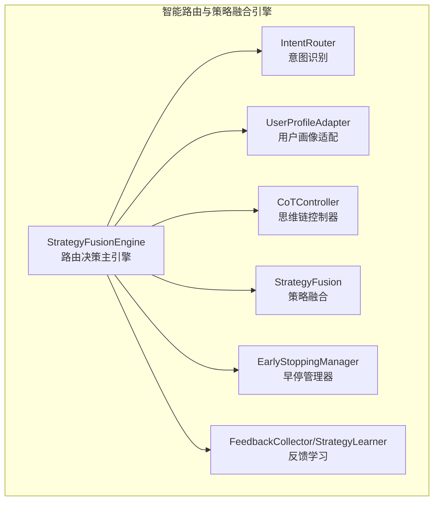
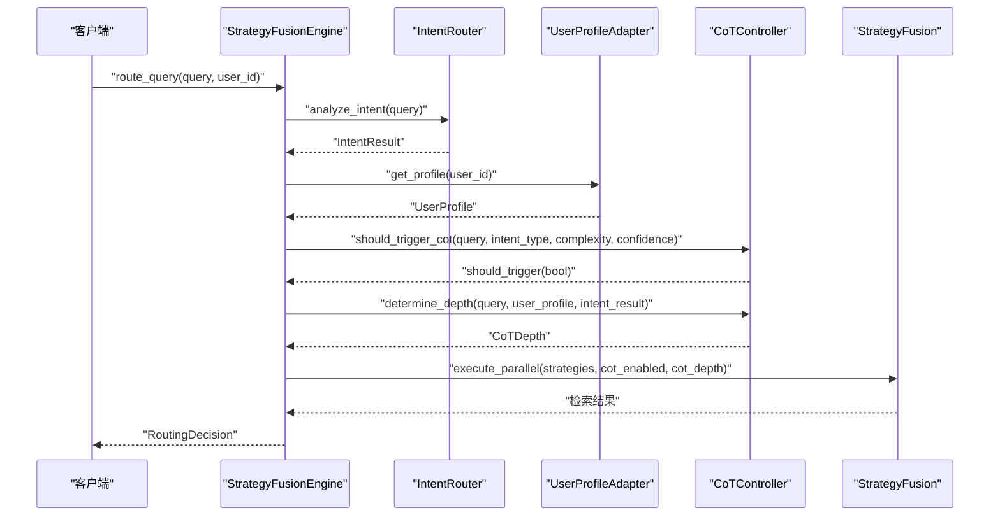
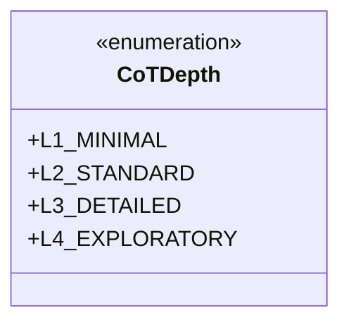
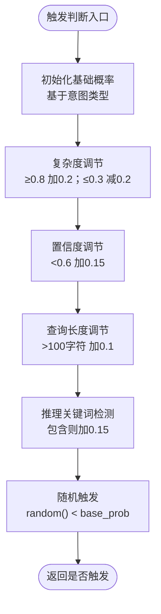
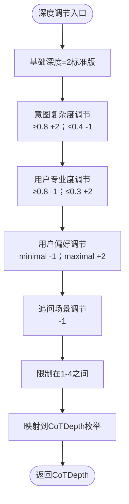
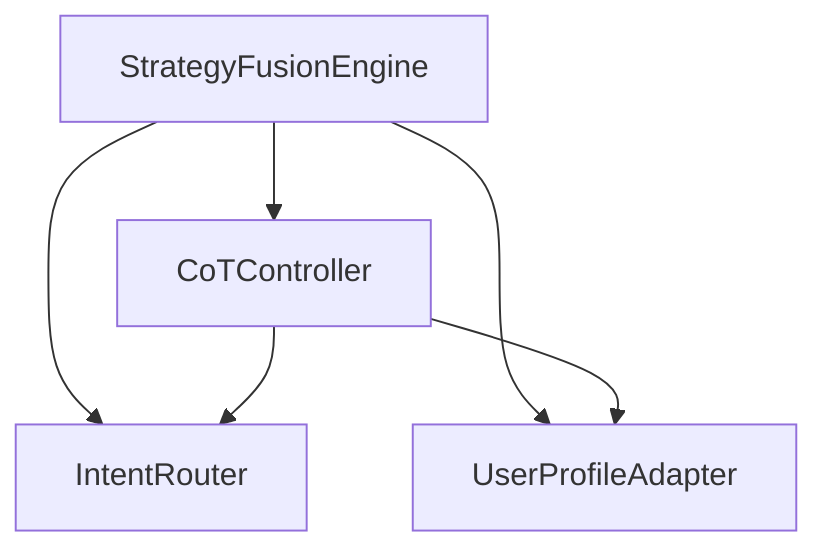

# 思维链控制器模块

<cite>
**本文档引用的文件**
- [cot_controller.py](file://src/retrieval/smart_routing/cot_controller.py)
- [engine.py](file://src/retrieval/smart_routing/engine.py)
- [intent_router.py](file://src/retrieval/smart_routing/intent_router.py)
- [user_adapter.py](file://src/retrieval/smart_routing/user_adapter.py)
- [example_usage.py](file://src/retrieval/smart_routing/example_usage.py)
- [README.md](file://src/retrieval/smart_routing/README.md)
- [test_smart_routing.py](file://tests/test_retrieval/test_smart_routing.py)
- [metrics.py](file://src/monitoring/metrics.py)
</cite>

## 目录
1. [简介](#简介)
2. [项目结构](#项目结构)
3. [核心组件](#核心组件)
4. [架构总览](#架构总览)
5. [详细组件分析](#详细组件分析)
6. [依赖关系分析](#依赖关系分析)
7. [性能考虑](#性能考虑)
8. [故障排查指南](#故障排查指南)
9. [结论](#结论)
10. [附录](#附录)

## 简介
思维链控制器模块是智能路由与策略融合引擎的重要组成部分，负责对查询进行智能触发判断与动态深度调节，结合用户画像与查询复杂度，为不同类型的查询选择合适的CoT（思维链）推理深度。该模块通过概率触发机制、意图类型权重、用户专业度与偏好、查询关键词与长度等多维度因素，实现自适应的CoT启用策略与深度控制，从而在保证响应质量的同时优化性能与资源消耗。

## 项目结构
思维链控制器模块位于检索层的智能路由子系统中，与意图路由器、用户画像适配器、策略融合引擎、早停管理器、反馈闭环等模块协同工作，形成完整的三层决策架构：意图识别层、用户画像层、策略融合层。

图表来源
- [engine.py:34-129](file://src/retrieval/smart_routing/engine.py#L34-L129)
- [intent_router.py:91-155](file://src/retrieval/smart_routing/intent_router.py#L91-L155)
- [user_adapter.py:98-150](file://src/retrieval/smart_routing/user_adapter.py#L98-L150)
- [cot_controller.py:21-107](file://src/retrieval/smart_routing/cot_controller.py#L21-L107)

章节来源
- [README.md:134-148](file://src/retrieval/smart_routing/README.md#L134-L148)

## 核心组件
- CoT深度等级定义：提供四个层级的CoT深度，分别对应精简版、标准版、详细版与探索版，每个层级具有不同的最大推理步骤数与适用场景。
- 触发条件判断：基于意图类型、查询复杂度、置信度、查询长度与推理关键词等特征，计算触发概率并进行随机触发。
- 动态深度调节：综合意图复杂度、用户专业度、用户偏好、追问场景等因素，动态确定最终的CoT深度，并限制在合理范围。
- 性能监控：统计CoT触发次数与总查询数，计算触发率；引擎层面提供平均处理时间与策略权重等统计信息。

章节来源
- [cot_controller.py:13-19](file://src/retrieval/smart_routing/cot_controller.py#L13-L19)
- [cot_controller.py:55-107](file://src/retrieval/smart_routing/cot_controller.py#L55-L107)
- [cot_controller.py:109-172](file://src/retrieval/smart_routing/cot_controller.py#L109-L172)
- [engine.py:266-273](file://src/retrieval/smart_routing/engine.py#L266-L273)

## 架构总览
CoT控制器在路由决策流程中的作用如下：引擎首先进行意图识别与用户画像适配，随后基于策略模板与用户偏好选择策略组合；在此基础上，CoT控制器决定是否启用CoT以及采用何种深度等级，最终将决策结果传递给策略融合引擎执行并监控性能。

图表来源
- [engine.py:68-129](file://src/retrieval/smart_routing/engine.py#L68-L129)
- [engine.py:170-195](file://src/retrieval/smart_routing/engine.py#L170-L195)
- [cot_controller.py:55-107](file://src/retrieval/smart_routing/cot_controller.py#L55-L107)
- [cot_controller.py:109-172](file://src/retrieval/smart_routing/cot_controller.py#L109-L172)

## 详细组件分析

### CoT深度等级定义与映射
- L1_MINIMAL（精简版）：1-2步，适用于简单事实查询或用户偏好精简的场景。
- L2_STANDARD（标准版）：3-4步，适用于一般推理与概念解释等中等复杂度任务。
- L3_DETAILED（详细版）：5-7步，适用于复杂推理、比较分析与探索发散等高复杂度任务。
- L4_EXPLORATORY（探索版）：7+步，适用于高度开放性的探索性问题，鼓励多路径推理。

图表来源
- [cot_controller.py:13-19](file://src/retrieval/smart_routing/cot_controller.py#L13-L19)

章节来源
- [cot_controller.py:13-19](file://src/retrieval/smart_routing/cot_controller.py#L13-L19)
- [cot_controller.py:182-190](file://src/retrieval/smart_routing/cot_controller.py#L182-L190)

### 触发条件判断与概率计算
触发判断综合以下因素：
- 基础触发概率：依据意图类型设定的基础概率，推理类问题概率最高，事实类最低。
- 复杂度调节：高复杂度（≥0.8）提升概率，低复杂度（≤0.3）降低概率。
- 置信度调节：低置信度（<0.6）提升概率，鼓励更多推理以提升可靠性。
- 查询长度调节：长查询（>100字符）提升概率，反映更复杂的推理需求。
- 推理关键词：包含“为什么”、“如何证明”等关键词时提升概率。
- 随机触发：最终以概率与随机数比较决定是否触发。

图表来源
- [cot_controller.py:55-107](file://src/retrieval/smart_routing/cot_controller.py#L55-L107)

章节来源
- [cot_controller.py:55-107](file://src/retrieval/smart_routing/cot_controller.py#L55-L107)

### 动态深度调节机制
深度调节综合以下因素：
- 意图复杂度：高复杂度（≥0.8）增加两层深度，低复杂度（≤0.4）减少一层深度。
- 用户专业度：专家用户（≥0.8）减少一层深度，新手用户（≤0.3）增加两层深度。
- 用户偏好：用户偏好为“minimal”减少一层，“maximal”增加两层。
- 追问场景：追问查询（包含“那”、“那么”等指示词）减少一层深度。
- 范围限制：最终深度限制在1-4之间，并映射到对应的CoTDepth枚举。

图表来源
- [cot_controller.py:109-172](file://src/retrieval/smart_routing/cot_controller.py#L109-L172)

章节来源
- [cot_controller.py:109-172](file://src/retrieval/smart_routing/cot_controller.py#L109-L172)

### 不同查询类型的CoT启用策略
- 推理演绎（reasoning_inference）：高触发概率（0.9），适合多步推理与因果分析。
- 探索发散（exploratory）：中高触发概率（0.7），适合开放式探索与跨领域联想。
- 概念解释（concept_explanation）：中等触发概率（0.5），适合概念澄清与示例生成。
- 比较分析（comparative_analysis）：中等触发概率（0.4），适合对比与权衡分析。
- 摘要总结（summarization）：较低触发概率（0.3），适合信息聚合与要点提取。
- 操作指导（procedural）：较低触发概率（0.2），适合步骤化任务。
- 事实查询（factual_query）：最低触发概率（0.1），适合直接事实检索。

章节来源
- [intent_router.py:79-88](file://src/retrieval/smart_routing/intent_router.py#L79-L88)
- [README.md:29-38](file://src/retrieval/smart_routing/README.md#L29-L38)

### 与用户画像和查询复杂度的关系
- 用户画像影响：
  - 专业度：专家用户倾向于更简洁的CoT深度，新手用户倾向于更详细的CoT深度。
  - 偏好：用户偏好“minimal”或“maximal”直接影响深度调节。
- 查询复杂度：
  - 高复杂度问题更可能触发CoT，且深度更高。
  - 低复杂度问题较少触发CoT，或触发后采用精简深度。
- 追问场景：追问通常更聚焦，因此深度适当降低。

章节来源
- [user_adapter.py:56-96](file://src/retrieval/smart_routing/user_adapter.py#L56-L96)
- [cot_controller.py:135-159](file://src/retrieval/smart_routing/cot_controller.py#L135-L159)
- [intent_router.py:216-238](file://src/retrieval/smart_routing/intent_router.py#L216-L238)

### 配置参数与使用示例
- CoT控制器配置参数：
  - min_complexity：触发CoT的最小复杂度阈值，默认0.7。
  - max_steps：最大推理步骤数，默认7。
  - graph_max_hops：图谱多跳最大跳数，默认3。
  - evidence_min_count：每步最少证据数，默认3。
- 使用示例：
  - 基础使用：初始化各组件并调用路由决策，获取意图、策略与CoT深度。
  - 用户画像适配：模拟专家与新手用户的画像差异，观察深度变化。
  - 反馈学习：收集显式与隐式反馈，驱动策略权重更新。
  - 早停机制：根据置信度、延迟预算等条件进行早停与降级。

章节来源
- [cot_controller.py:31-39](file://src/retrieval/smart_routing/cot_controller.py#L31-L39)
- [README.md:152-193](file://src/retrieval/smart_routing/README.md#L152-L193)
- [example_usage.py:18-58](file://src/retrieval/smart_routing/example_usage.py#L18-L58)
- [example_usage.py:61-96](file://src/retrieval/smart_routing/example_usage.py#L61-L96)
- [example_usage.py:99-138](file://src/retrieval/smart_routing/example_usage.py#L99-L138)
- [example_usage.py:141-173](file://src/retrieval/smart_routing/example_usage.py#L141-L173)

## 依赖关系分析
CoT控制器与引擎、意图路由器、用户画像适配器之间的依赖关系如下：

图表来源
- [engine.py:14-17](file://src/retrieval/smart_routing/engine.py#L14-L17)
- [engine.py:170-195](file://src/retrieval/smart_routing/engine.py#L170-L195)
- [cot_controller.py:55-107](file://src/retrieval/smart_routing/cot_controller.py#L55-L107)
- [cot_controller.py:109-172](file://src/retrieval/smart_routing/cot_controller.py#L109-L172)

章节来源
- [engine.py:14-17](file://src/retrieval/smart_routing/engine.py#L14-L17)
- [engine.py:170-195](file://src/retrieval/smart_routing/engine.py#L170-L195)

## 性能考虑
- 触发率监控：通过统计触发次数与总查询数计算触发率，用于评估策略有效性与调优。
- 平均处理时间：引擎内部平滑计算平均处理时间，便于性能趋势分析。
- 早停与降级：结合置信度阈值、边际收益递减、延迟预算与满意度预测，实现多条件早停与四级降级，确保在性能压力下仍能稳定服务。
- 资源控制：通过max_steps限制单次推理的步骤上限，避免过度计算；通过策略权重与并行执行控制资源消耗。

章节来源
- [cot_controller.py:192-196](file://src/retrieval/smart_routing/cot_controller.py#L192-L196)
- [engine.py:197-203](file://src/retrieval/smart_routing/engine.py#L197-L203)
- [README.md:47-60](file://src/retrieval/smart_routing/README.md#L47-L60)
- [README.md:197-233](file://src/retrieval/smart_routing/README.md#L197-L233)

## 故障排查指南
- 触发率异常：
  - 若触发率过低，可适当降低min_complexity或提高意图类型的触发概率基数。
  - 若触发率过高，可提高min_complexity或减少推理关键词权重。
- 深度调节偏差：
  - 检查用户画像的专业度与偏好设置是否正确；确认domain与expertise_domains匹配。
  - 追问场景的判定逻辑可通过_followup_query方法进行验证。
- 性能问题：
  - 监控平均处理时间与触发率，结合早停统计分析早停触发频率与降级事件。
  - 使用系统指标收集器记录关键指标，定位CPU、内存与网络瓶颈。

章节来源
- [cot_controller.py:31-39](file://src/retrieval/smart_routing/cot_controller.py#L31-L39)
- [engine.py:266-273](file://src/retrieval/smart_routing/engine.py#L266-L273)
- [metrics.py:25-95](file://src/monitoring/metrics.py#L25-L95)

## 结论
思维链控制器模块通过多层次的触发判断与动态深度调节，实现了对不同查询类型的智能CoT启用策略。结合用户画像与查询复杂度，模块能够在保证响应质量的前提下，灵活控制推理深度与资源消耗。配合早停机制与性能监控，系统可在高负载环境下保持稳定与高效。建议在生产环境中持续监控触发率与平均处理时间，结合用户反馈与A/B测试不断优化阈值与权重，以达到最佳的用户体验与资源利用率。

## 附录

### 配置参数一览
- CoT控制器配置
  - min_complexity：触发CoT的最小复杂度阈值，默认0.7。
  - max_steps：最大推理步骤数，默认7。
  - graph_max_hops：图谱多跳最大跳数，默认3。
  - evidence_min_count：每步最少证据数，默认3。
- 早停配置
  - enabled：是否启用早停，默认True。
  - confidence_threshold：置信度阈值，默认0.95。
  - diminishing_returns_threshold：边际收益递减阈值，默认0.02。
  - latency_budget_ratio：延迟预算占比，默认0.8。
  - satisfaction_threshold：满意度阈值，默认4.5。
  - max_allowed_latency_ms：最大允许延迟，默认1000ms。
  - level1/level2/level3/level4_latency_ms：各级降级的延迟阈值。
- 策略融合配置
  - diversity_enabled：是否启用多样性，默认True。
  - novelty_boost：新颖性增强权重，默认0.1。
  - max_same_domain_ratio：同一领域最大比例，默认0.6。
  - min_cross_domain_count：跨领域最小数量，默认2。
  - temporal_diversity：是否启用时间多样性，默认True。
  - source_diversity：是否启用来源多样性，默认True。

章节来源
- [README.md:152-193](file://src/retrieval/smart_routing/README.md#L152-L193)

### 使用示例路径
- 基础使用示例：[example_usage.py:18-58](file://src/retrieval/smart_routing/example_usage.py#L18-L58)
- 用户画像适配示例：[example_usage.py:61-96](file://src/retrieval/smart_routing/example_usage.py#L61-L96)
- 反馈学习示例：[example_usage.py:99-138](file://src/retrieval/smart_routing/example_usage.py#L99-L138)
- 早停机制示例：[example_usage.py:141-173](file://src/retrieval/smart_routing/example_usage.py#L141-L173)

### 测试用例参考
- CoT触发判断测试：[test_smart_routing.py:126-150](file://tests/test_retrieval/test_smart_routing.py#L126-L150)
- 专家用户深度调节测试：[test_smart_routing.py:152-173](file://tests/test_retrieval/test_smart_routing.py#L152-L173)