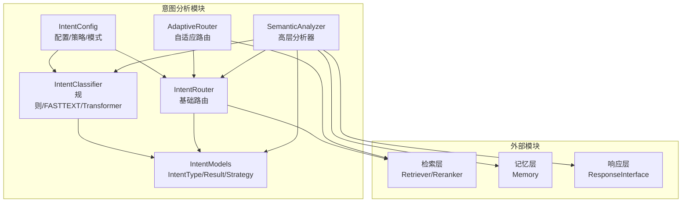
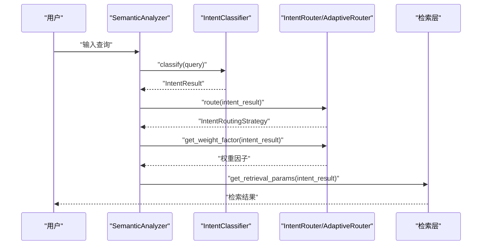
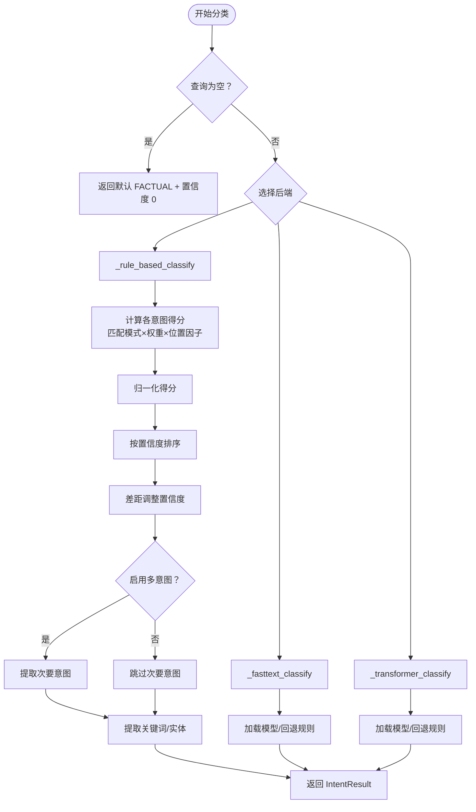
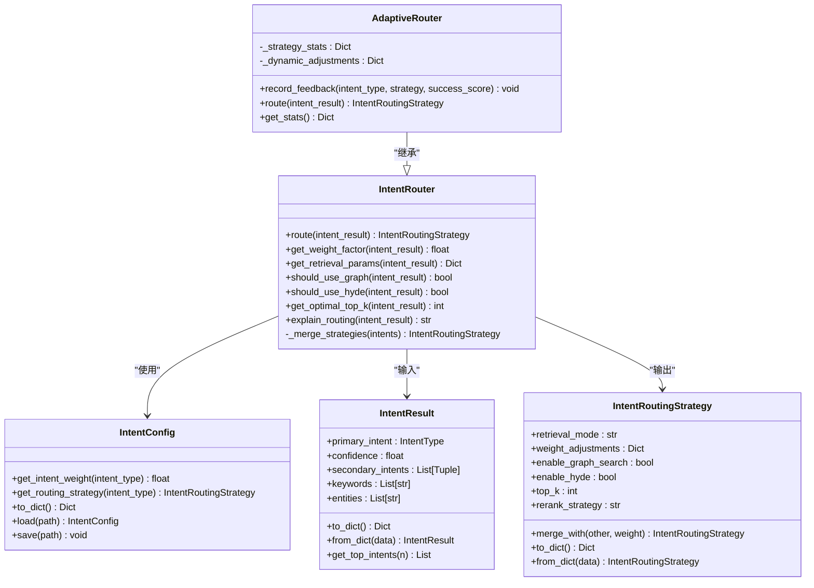
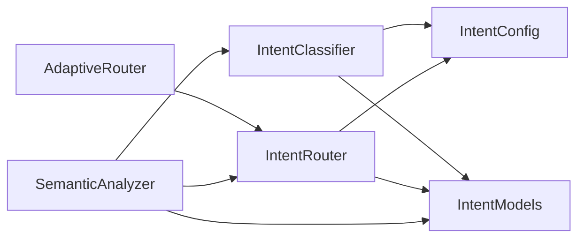

# 意图路由器模块

<cite>
**本文档引用的文件**
- [router.py](file://src/intent/router.py)
- [classifier.py](file://src/intent/classifier.py)
- [models.py](file://src/intent/models.py)
- [config.py](file://src/intent/config.py)
- [semantic_analyzer.py](file://src/intent/semantic_analyzer.py)
- [intent_knowledge.py](file://src/intent/intent_knowledge.py)
- [test_classifier.py](file://tests/test_intent/test_classifier.py)
- [INTENT_SETUP_GUIDE.md](file://src/intent/INTENT_SETUP_GUIDE.md)
- [INTENT_QUICKREF.md](file://src/intent/INTENT_QUICKREF.md)
</cite>

## 目录
1. [简介](#简介)
2. [项目结构](#项目结构)
3. [核心组件](#核心组件)
4. [架构总览](#架构总览)
5. [详细组件分析](#详细组件分析)
6. [依赖关系分析](#依赖关系分析)
7. [性能考虑](#性能考虑)
8. [故障排除指南](#故障排除指南)
9. [结论](#结论)
10. [附录](#附录)

## 简介
本文件面向意图路由器模块，系统性阐述其在 NecoRAG 语义分析流水线中的作用与实现。模块负责将意图分类器输出的意图结果映射为检索层的路由策略，并提供权重因子、检索参数封装、以及可选的自适应调整能力。文档涵盖：
- 意图识别核心算法与置信度计算机制
- 不同类型查询的识别规则与分类标准
- 意图结果数据结构与属性含义
- 配置示例与使用指南
- 与其他模块的交互与数据流
- 性能优化技巧与故障排除方法

## 项目结构
意图路由器模块位于 src/intent 目录，核心文件包括：
- router.py：意图路由器与自适应路由器
- classifier.py：意图分类器（规则/FASTTEXT/Transformer）
- models.py：意图类型、结果、路由策略、语义分析结果等数据模型
- config.py：意图配置（权重、路由策略、关键词模式等）
- semantic_analyzer.py：高层语义分析器，整合分类与路由
- intent_knowledge.py：意图知识库管理（与层次化意图体系相关）

图表来源
- [router.py:18-350](file://src/intent/router.py#L18-L350)
- [classifier.py:20-493](file://src/intent/classifier.py#L20-L493)
- [models.py:12-231](file://src/intent/models.py#L12-L231)
- [config.py:18-333](file://src/intent/config.py#L18-L333)
- [semantic_analyzer.py:24-352](file://src/intent/semantic_analyzer.py#L24-L352)

章节来源
- [router.py:18-350](file://src/intent/router.py#L18-L350)
- [classifier.py:20-493](file://src/intent/classifier.py#L20-L493)
- [models.py:12-231](file://src/intent/models.py#L12-L231)
- [config.py:18-333](file://src/intent/config.py#L18-L333)
- [semantic_analyzer.py:24-352](file://src/intent/semantic_analyzer.py#L24-L352)

## 核心组件
- 意图分类器 IntentClassifier：支持规则、FASTTEXT、Transformer 三种后端；基于关键词模式匹配与可选模型预测，输出 IntentResult（主/次意图、置信度、关键词、实体）。
- 意图路由器 IntentRouter：根据 IntentResult 与配置，返回 IntentRoutingStrategy；支持多意图融合与权重因子计算；提供检索参数封装。
- 自适应路由器 AdaptiveRouter：在基础路由器上增加历史反馈统计与动态调整。
- 语义分析器 SemanticAnalyzer：统一入口，串联分类与路由，输出完整分析结果。
- 配置 IntentConfig：定义意图权重、路由策略、关键词模式、后端选择等。
- 数据模型：IntentType、IntentResult、IntentRoutingStrategy、SemanticAnalysisResult。

章节来源
- [classifier.py:20-493](file://src/intent/classifier.py#L20-L493)
- [router.py:18-350](file://src/intent/router.py#L18-L350)
- [semantic_analyzer.py:24-352](file://src/intent/semantic_analyzer.py#L24-L352)
- [config.py:18-333](file://src/intent/config.py#L18-L333)
- [models.py:12-231](file://src/intent/models.py#L12-L231)

## 架构总览
意图路由器在整体流水线中的位置如下：
- 输入：用户查询字符串
- 经过：IntentClassifier（规则/FASTTEXT/Transformer）→ IntentResult
- 路由：IntentRouter/AdaptiveRouter → IntentRoutingStrategy + 权重因子
- 输出：检索参数字典（供检索层使用）与可解释的路由说明

图表来源
- [semantic_analyzer.py:69-122](file://src/intent/semantic_analyzer.py#L69-L122)
- [classifier.py:85-113](file://src/intent/classifier.py#L85-L113)
- [router.py:55-197](file://src/intent/router.py#L55-L197)

## 详细组件分析

### 意图识别核心算法与置信度计算
- 规则分类（默认）：编译关键词模式（中英文），对匹配到的模式按权重累加得分，结合开头匹配加权、得分归一化、主次意图排序与置信度差距调整，得到主意图与置信度，并可选提取关键词与实体。
- FASTTEXT/Transformer：加载对应模型，执行预测，解析标签与概率，转换为 IntentResult。
- 置信度范围约束与多意图阈值：置信度限制在 0~1，主次意图差距小则降低置信度，次要意图阈值相对更低。

图表来源
- [classifier.py:85-206](file://src/intent/classifier.py#L85-L206)
- [classifier.py:325-383](file://src/intent/classifier.py#L325-L383)
- [classifier.py:385-458](file://src/intent/classifier.py#L385-L458)

章节来源
- [classifier.py:85-206](file://src/intent/classifier.py#L85-L206)
- [classifier.py:325-383](file://src/intent/classifier.py#L325-L383)
- [classifier.py:385-458](file://src/intent/classifier.py#L385-L458)

### 不同类型查询的识别规则与分类标准
- EXPLANATION（概念解释）：关键词模式偏向“什么是/定义/解释”等，强调语义理解与定义澄清。
- PROCEDURAL（操作指导）：关键词模式偏向“如何/怎么/步骤/配置/安装/设置/教程/指南”等，强调步骤与实操。
- COMPARATIVE（比较分析）：关键词模式偏向“区别/差异/不同/对比/比较/哪个好/优缺点/相比”等，强调对比与差异。
- REASONING（推理演绎）：关键词模式偏向“为什么/原因/因为/所以/因此/推导/推理/分析/原理/机制”等，强调因果与逻辑。
- SUMMARIZATION（摘要总结）：关键词模式偏向“总结/概括/归纳/要点/摘要/概述/提炼/核心/关键点/重点”等，强调信息整合。
- EXPLORATORY（探索发散）：关键词模式偏向“有哪些/有什么/列出/列举/都有/包括/种类/类型/分类/例子/案例/推荐/建议”等，强调开放性与列举。
- FACTUAL（事实查询）：关键词模式偏向“是多少/多少/哪里/哪个/谁/什么时候/时间/地点/数量/日期/版本”等，强调具体事实与数据。

章节来源
- [config.py:155-244](file://src/intent/config.py#L155-L244)

### 意图结果的数据结构与属性含义
- IntentType：枚举类型，包含 FACTUAL、COMPARATIVE、REASONING、EXPLANATION、SUMMARIZATION、PROCEDURAL、EXPLORATORY。
- IntentResult：包含主意图、置信度、次要意图列表（意图类型+置信度）、关键词列表、实体列表；提供字典序列化/反序列化与 top 意图提取。
- IntentRoutingStrategy：包含检索模式（vector/graph/hybrid/hyde）、权重调整字典、是否启用图谱搜索、是否启用 HyDE、top_k、重排序策略；提供策略合并能力。
- SemanticAnalysisResult：整合 IntentResult、路由策略、查询归一化、意图权重因子与元数据。

章节来源
- [models.py:12-231](file://src/intent/models.py#L12-L231)

### 路由策略与权重因子计算
- 基础路由：根据主意图类型从配置中获取对应策略；若置信度高或未启用多意图，则直接返回主策略；否则进行多意图加权融合。
- 多意图融合：按置信度归一化权重，逐个策略累积融合，保留策略的关键属性（检索模式、布尔开关、top_k、重排序策略）。
- 权重因子：基础权重来自配置，结合置信度进行线性调整；若有次要意图，按次要意图权重与置信度加权平均，占次要贡献比例；最终限制在合理范围。

图表来源
- [router.py:18-350](file://src/intent/router.py#L18-L350)
- [config.py:246-256](file://src/intent/config.py#L246-L256)
- [models.py:27-187](file://src/intent/models.py#L27-L187)

章节来源
- [router.py:55-197](file://src/intent/router.py#L55-L197)
- [router.py:199-236](file://src/intent/router.py#L199-L236)
- [router.py:238-269](file://src/intent/router.py#L238-L269)
- [router.py:80-121](file://src/intent/router.py#L80-L121)
- [config.py:246-256](file://src/intent/config.py#L246-L256)

### 与检索层的交互与数据流转
- 检索参数封装：get_retrieval_params 将路由策略与权重因子打包为字典，便于直接传递给检索模块。
- 关键字段：检索模式、top_k、图谱搜索开关、HyDE 开关、重排序策略、权重调整、意图类型与置信度、关键词与实体。
- 语义分析器提供统一入口，返回包含查询归一化、路由策略、权重因子与检索参数的完整结果。

章节来源
- [router.py:166-197](file://src/intent/router.py#L166-L197)
- [semantic_analyzer.py:69-122](file://src/intent/semantic_analyzer.py#L69-L122)

### 配置示例与使用指南
- 默认配置：规则分类、多意图开启、最大意图数 3、默认关键词模式与路由策略。
- 最小配置：仅规则分类、禁用多意图、最大意图数 1。
- 高级配置：Transformer 分类、多意图开启、置信度阈值下调。
- 使用示例：通过 SemanticAnalyzer.analyze 或 IntentRouter.route 获取路由策略与检索参数；通过 AdaptiveRouter.record_feedback 记录反馈以进行动态调整。

章节来源
- [config.py:310-332](file://src/intent/config.py#L310-L332)
- [semantic_analyzer.py:33-53](file://src/intent/semantic_analyzer.py#L33-L53)
- [router.py:289-342](file://src/intent/router.py#L289-L342)

### 与层次化意图体系的关系
- 意图知识库管理器支持意图树的创建、保存、版本管理、学习数据导入导出与相似意图搜索。
- 与语义分析器配合，可在实际业务场景中构建与维护三级意图体系（L1/L2/L3），并通过 AI 自动填充 L3。

章节来源
- [intent_knowledge.py:25-407](file://src/intent/intent_knowledge.py#L25-L407)
- [INTENT_SETUP_GUIDE.md:1-449](file://src/intent/INTENT_SETUP_GUIDE.md#L1-L449)
- [INTENT_QUICKREF.md:1-270](file://src/intent/INTENT_QUICKREF.md#L1-L270)

## 依赖关系分析
- 模块内依赖：router 依赖 models 与 config；classifier 依赖 models 与 config；semantic_analyzer 组合 classifier 与 router。
- 外部依赖：FASTTEXT 与 Transformers 为可选依赖，未安装时自动回退至规则分类。
- 配置耦合：路由策略与意图权重集中于 IntentConfig，便于统一管理与热更新。

图表来源
- [classifier.py:12-14](file://src/intent/classifier.py#L12-L14)
- [router.py:10-12](file://src/intent/router.py#L10-L12)
- [semantic_analyzer.py:16-18](file://src/intent/semantic_analyzer.py#L16-L18)

章节来源
- [classifier.py:12-14](file://src/intent/classifier.py#L12-L14)
- [router.py:10-12](file://src/intent/router.py#L10-L12)
- [semantic_analyzer.py:16-18](file://src/intent/semantic_analyzer.py#L16-L18)

## 性能考虑
- 规则分类：正则编译与匹配开销可控，适合低依赖部署；关键词模式建议精简与去重，避免重复匹配。
- 模型分类：FASTTEXT/Transformer 首次加载成本较高，建议在进程内复用模型实例；批处理分类可提升吞吐。
- 多意图融合：策略合并为线性复杂度，注意 top_k 的加权取整与布尔属性的选择策略。
- 关键词/实体提取：jieba 可选依赖，缺失时使用简单实现，性能更稳定但精度下降。
- 自适应调整：反馈统计与动态调整会引入少量内存占用，建议在生产环境按需启用。

[本节为通用性能建议，不直接分析具体文件]

## 故障排除指南
- 分类后端不可用：检查后端名称与依赖安装；FASTTEXT/Transformer 未安装时会自动回退规则分类。
- 空查询或空白查询：返回默认 FACTUAL 且置信度为 0，关键词为空。
- 关键词/实体提取异常：依赖 jieba 时若导入失败，将使用简单实现；可降级但仍能返回基本结果。
- 多意图未生效：确认配置 enable_multi_intent 与 max_intents；次要意图阈值相对主意图更低。
- 路由策略不符合预期：检查配置中的路由策略字典与关键词模式；必要时自定义策略或调整权重。
- 自适应路由未生效：确认 record_feedback 已调用并有足够的历史样本；动态调整仅在历史效果不佳或较好时触发。

章节来源
- [classifier.py:325-383](file://src/intent/classifier.py#L325-L383)
- [classifier.py:385-458](file://src/intent/classifier.py#L385-L458)
- [classifier.py:95-112](file://src/intent/classifier.py#L95-L112)
- [classifier.py:208-230](file://src/intent/classifier.py#L208-L230)
- [classifier.py:271-296](file://src/intent/classifier.py#L271-L296)
- [router.py:289-342](file://src/intent/router.py#L289-L342)
- [test_classifier.py:354-373](file://tests/test_intent/test_classifier.py#L354-L373)

## 结论
意图路由器模块通过规则与模型双通道的意图识别，结合可配置的路由策略与权重因子，为检索层提供精准的检索参数与策略建议。模块具备良好的扩展性与可维护性，支持多意图融合、自适应调整与层次化意图体系的集成。在实际部署中，建议根据业务场景选择合适的后端与配置，并结合自适应反馈持续优化路由效果。

[本节为总结性内容，不直接分析具体文件]

## 附录
- 快速开始示例：通过 SemanticAnalyzer.analyze 获取完整分析结果；或使用 IntentRouter.route 获取路由策略。
- 配置管理：使用 IntentConfig.default/minimal/advanced 获取不同配置；支持保存/加载 JSON。
- 层次化意图：结合 IntentInitializer 与 IntentKnowledgeManager 构建与维护三级意图体系。

章节来源
- [semantic_analyzer.py:33-53](file://src/intent/semantic_analyzer.py#L33-L53)
- [config.py:310-332](file://src/intent/config.py#L310-L332)
- [INTENT_SETUP_GUIDE.md:26-46](file://src/intent/INTENT_SETUP_GUIDE.md#L26-L46)
- [INTENT_QUICKREF.md:5-20](file://src/intent/INTENT_QUICKREF.md#L5-L20)