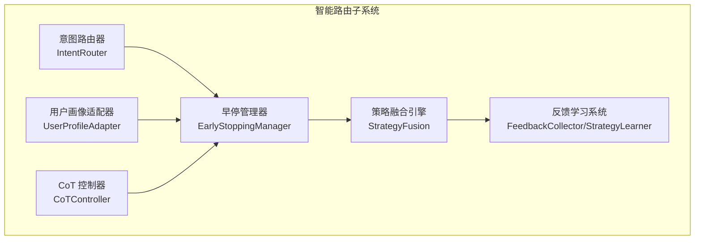
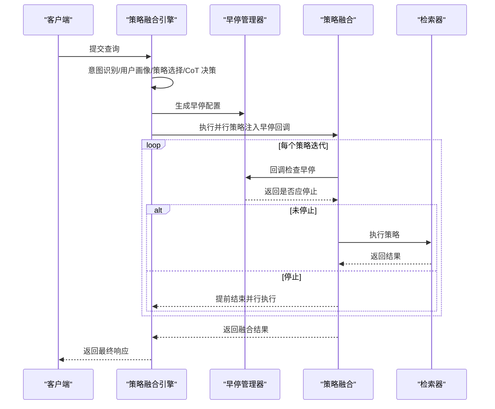
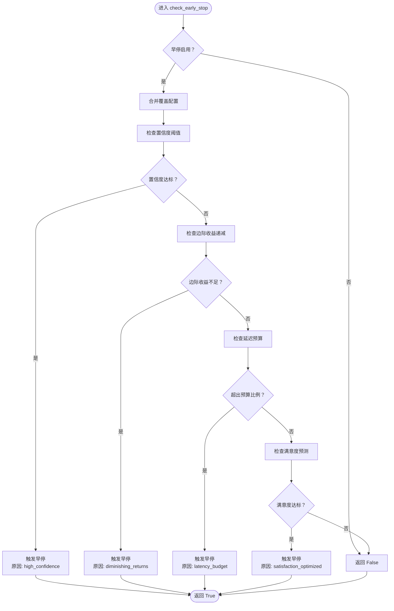
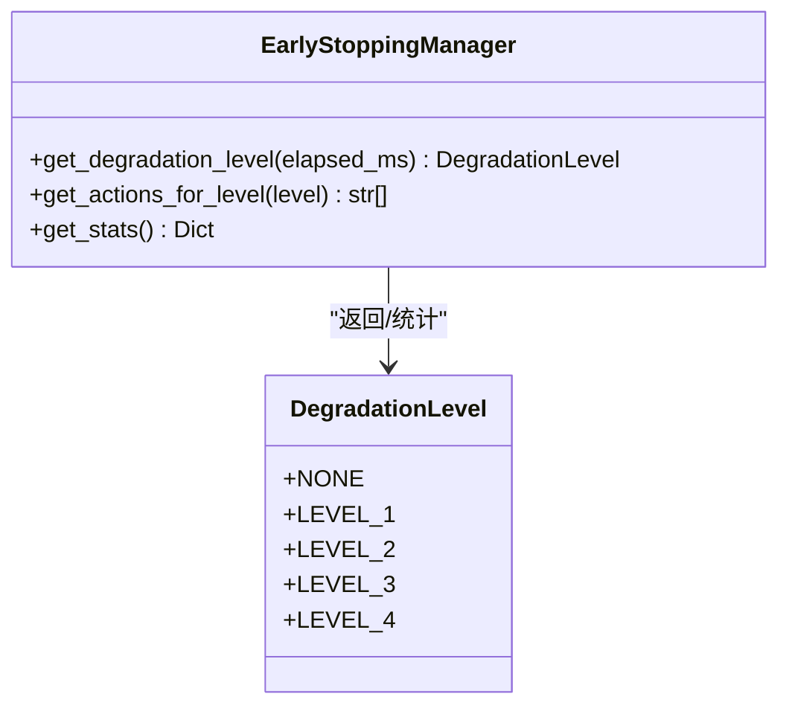
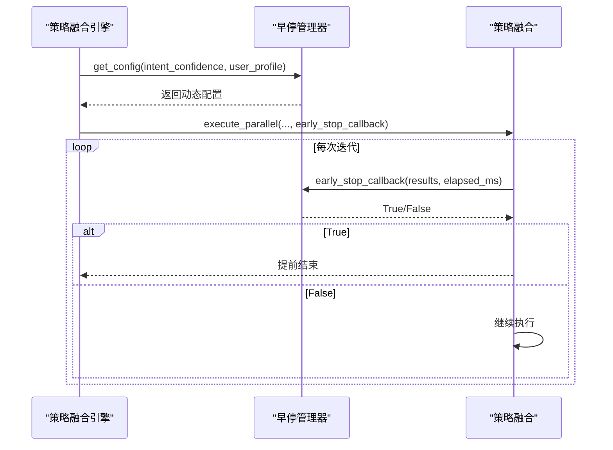
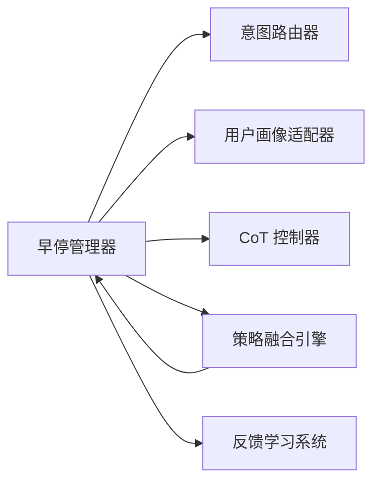

# 早停管理模块

<cite>
**本文档引用的文件**
- [early_stopping.py](file://src/retrieval/smart_routing/early_stopping.py)
- [engine.py](file://src/retrieval/smart_routing/engine.py)
- [example_usage.py](file://src/retrieval/smart_routing/example_usage.py)
- [strategy_fusion.py](file://src/retrieval/smart_routing/strategy_fusion.py)
- [intent_router.py](file://src/retrieval/smart_routing/intent_router.py)
- [user_adapter.py](file://src/retrieval/smart_routing/user_adapter.py)
- [cot_controller.py](file://src/retrieval/smart_routing/cot_controller.py)
- [feedback_loop.py](file://src/retrieval/smart_routing/feedback_loop.py)
- [metrics.py](file://src/monitoring/metrics.py)
- [config_manager.py](file://src/dashboard/config_manager.py)
- [PerformanceDashboard.html](file://src/dashboard/components/PerformanceDashboard.html)
- [performance.py](file://src/dashboard/debug/performance.py)
- [models.py](file://src/dashboard/models.py)
</cite>

## 目录
1. [引言](#引言)
2. [项目结构](#项目结构)
3. [核心组件](#核心组件)
4. [架构总览](#架构总览)
5. [详细组件分析](#详细组件分析)
6. [依赖关系分析](#依赖关系分析)
7. [性能考量](#性能考量)
8. [故障排除指南](#故障排除指南)
9. [结论](#结论)
10. [附录](#附录)

## 引言
本文件针对智能路由与策略融合引擎中的早停管理模块进行全面的技术文档梳理。该模块负责在多策略并行检索过程中，基于置信度、边际收益、延迟预算与用户满意度预测等多个维度进行早停判断，并在必要时触发降级策略，以在保证用户体验的前提下最大化系统吞吐与稳定性。文档将深入解释早停机制的设计原理、判断逻辑、降级等级定义与触发条件、性能监控与资源控制策略，并提供不同场景下的配置与调优方法、监控指标与故障排除指南。

## 项目结构
早停管理模块位于检索层的智能路由子系统中，与意图识别、用户画像适配、CoT 控制器、策略融合引擎、反馈学习系统协同工作，形成完整的检索-响应决策链路。

**图表来源**
- [engine.py:34-129](file://src/retrieval/smart_routing/engine.py#L34-L129)
- [early_stopping.py:39-183](file://src/retrieval/smart_routing/early_stopping.py#L39-L183)
- [strategy_fusion.py:78-158](file://src/retrieval/smart_routing/strategy_fusion.py#L78-L158)

**章节来源**
- [engine.py:34-129](file://src/retrieval/smart_routing/engine.py#L34-L129)
- [early_stopping.py:39-183](file://src/retrieval/smart_routing/early_stopping.py#L39-L183)
- [strategy_fusion.py:78-158](file://src/retrieval/smart_routing/strategy_fusion.py#L78-L158)

## 核心组件
- 早停管理器（EarlyStoppingManager）：负责多维度早停判断、降级等级评估、动态配置调整与统计信息维护。
- 早停配置（EarlyStopConfig）：集中定义早停与降级相关的关键阈值与参数。
- 降级等级（DegradationLevel）：定义从轻微到较大的四个降级等级及其对应的动作集合。
- 策略融合引擎（StrategyFusionEngine）：在路由决策阶段生成早停配置，并在执行阶段注入早停回调。
- 策略融合（StrategyFusion）：在并行执行策略时调用早停回调，实现早停控制。

**章节来源**
- [early_stopping.py:12-37](file://src/retrieval/smart_routing/early_stopping.py#L12-L37)
- [early_stopping.py:39-183](file://src/retrieval/smart_routing/early_stopping.py#L39-L183)
- [engine.py:108-129](file://src/retrieval/smart_routing/engine.py#L108-L129)
- [strategy_fusion.py:78-158](file://src/retrieval/smart_routing/strategy_fusion.py#L78-L158)

## 架构总览
早停管理模块在系统中的位置如下：

**图表来源**
- [engine.py:205-249](file://src/retrieval/smart_routing/engine.py#L205-L249)
- [strategy_fusion.py:78-158](file://src/retrieval/smart_routing/strategy_fusion.py#L78-L158)
- [early_stopping.py:57-109](file://src/retrieval/smart_routing/early_stopping.py#L57-L109)

## 详细组件分析

### 早停管理器（EarlyStoppingManager）
- 多维度早停判断
  - 置信度阈值达成：当最佳结果置信度达到阈值时立即停止。
  - 边际收益递减：比较最近两次迭代的改进幅度，低于阈值则停止。
  - 资源约束（延迟预算）：已耗时超过允许上限的一定比例时停止。
  - 用户满意度预测：基于结果数量与质量预测满意度，达到阈值时停止。
- 降级等级评估
  - 基于已耗时与预设阈值，确定降级等级（NONE/L1/L2/L3/L4），并统计事件次数。
- 动态配置调整
  - 根据意图置信度与用户画像（如专家度）动态调整阈值与超时限制。
- 统计与可观测性
  - 记录总检查次数、早停触发次数、各降级等级事件数，便于性能分析与调优。

**图表来源**
- [early_stopping.py:57-109](file://src/retrieval/smart_routing/early_stopping.py#L57-L109)
- [early_stopping.py:111-155](file://src/retrieval/smart_routing/early_stopping.py#L111-L155)

**章节来源**
- [early_stopping.py:39-183](file://src/retrieval/smart_routing/early_stopping.py#L39-L183)

### 降级等级与触发条件
- 降级等级定义
  - NONE：无降级，正常执行。
  - LEVEL_1：轻微降级，减少并行策略数、降低多样性要求。
  - LEVEL_2：中等降级，跳过 CoT 推理，采用直接回答模式。
  - LEVEL_3：显著降级，仅执行向量检索，跳过图谱多跳与复杂重排序。
  - LEVEL_4：较大降级，返回缓存结果，使用简化答案，降级为基本检索。
- 触发条件
  - 依据已耗时与预设阈值（level1~level4）逐级判定，统计各级事件次数，便于监控与调优。

**图表来源**
- [early_stopping.py:12-19](file://src/retrieval/smart_routing/early_stopping.py#L12-L19)
- [early_stopping.py:157-208](file://src/retrieval/smart_routing/early_stopping.py#L157-L208)

**章节来源**
- [early_stopping.py:12-19](file://src/retrieval/smart_routing/early_stopping.py#L12-L19)
- [early_stopping.py:157-208](file://src/retrieval/smart_routing/early_stopping.py#L157-L208)

### 动态配置与用户画像适配
- 动态配置
  - 高置信度意图：放宽置信度阈值，提升早停灵活性。
  - 专家用户：缩短最大允许延迟，提高响应速度优先级。
- 用户画像适配
  - 专业度与偏好直接影响策略权重与 CoT 深度，间接影响早停时机与降级策略。

**章节来源**
- [early_stopping.py:210-243](file://src/retrieval/smart_routing/early_stopping.py#L210-L243)
- [user_adapter.py:68-95](file://src/retrieval/smart_routing/user_adapter.py#L68-L95)
- [intent_router.py:149-155](file://src/retrieval/smart_routing/intent_router.py#L149-L155)

### 与策略融合引擎的集成
- 路由阶段
  - 引擎根据意图识别与用户画像生成早停配置，并在执行阶段注入早停回调。
- 执行阶段
  - 策略融合引擎在并行执行策略时，定时调用早停回调，若返回应停止，则提前结束后续策略执行，融合已有结果。

**图表来源**
- [engine.py:108-129](file://src/retrieval/smart_routing/engine.py#L108-L129)
- [engine.py:224-240](file://src/retrieval/smart_routing/engine.py#L224-L240)
- [strategy_fusion.py:129-132](file://src/retrieval/smart_routing/strategy_fusion.py#L129-L132)

**章节来源**
- [engine.py:108-129](file://src/retrieval/smart_routing/engine.py#L108-L129)
- [engine.py:224-240](file://src/retrieval/smart_routing/engine.py#L224-L240)
- [strategy_fusion.py:129-132](file://src/retrieval/smart_routing/strategy_fusion.py#L129-L132)

### 与反馈学习系统的联动
- 早停触发与降级事件可作为反馈信号的一部分，用于优化策略权重与用户画像偏好，形成闭环学习。
- 反馈收集器支持显式与隐式反馈，策略学习器据此更新权重，提升系统长期性能与稳定性。

**章节来源**
- [feedback_loop.py:30-294](file://src/retrieval/smart_routing/feedback_loop.py#L30-L294)
- [feedback_loop.py:297-434](file://src/retrieval/smart_routing/feedback_loop.py#L297-L434)

## 依赖关系分析
早停管理模块与以下模块存在直接依赖关系：

**图表来源**
- [engine.py:16-61](file://src/retrieval/smart_routing/engine.py#L16-L61)
- [early_stopping.py:39-50](file://src/retrieval/smart_routing/early_stopping.py#L39-L50)

**章节来源**
- [engine.py:16-61](file://src/retrieval/smart_routing/engine.py#L16-L61)
- [early_stopping.py:39-50](file://src/retrieval/smart_routing/early_stopping.py#L39-L50)

## 性能考量
- 早停目标
  - 在满足效果与延迟约束之间取得平衡，避免无效的策略执行，提升吞吐与响应速度。
- 降级策略
  - 在高延迟风险下，逐步降低策略复杂度与计算开销，确保系统稳定运行。
- 监控与告警
  - 结合系统指标与应用指标，设置合理的阈值，及时发现性能退化与异常。
- 配置调优建议
  - 置信度阈值：根据业务容忍度与召回质量权衡；边际收益阈值：结合结果稳定性设定；延迟预算比例：根据 SLA 要求调整；满意度阈值：基于用户反馈与 A/B 测试优化。
  - 专家用户与普通用户的阈值差异化：对专家用户更严格，提升响应速度；对新手用户更宽松，保证质量。

**章节来源**
- [metrics.py:25-95](file://src/monitoring/metrics.py#L25-L95)
- [metrics.py:177-203](file://src/monitoring/metrics.py#L177-L203)
- [performance.py:103-329](file://src/dashboard/debug/performance.py#L103-L329)

## 故障排除指南
- 常见问题
  - 早停过于激进导致召回不足：检查置信度与满意度阈值，适当放宽或引入动态调整。
  - 早停不触发导致延迟过高：检查延迟预算比例与边际收益阈值，确保在合理范围内。
  - 降级频繁影响体验：核查降级阈值设置，结合用户画像与偏好进行差异化配置。
- 诊断步骤
  - 查看早停统计：总检查次数、早停触发次数、各降级等级事件数。
  - 对比策略执行时间与早停触发时机，确认回调是否正确注入。
  - 结合系统指标（CPU、内存、网络、磁盘）与应用指标（响应时间、错误率）定位瓶颈。
- 建议措施
  - 通过仪表板监控关键指标，设置阈值告警，及时发现异常。
  - 使用配置管理器保存与切换不同场景的配置，便于快速回滚与对比测试。
  - 借助反馈学习系统持续优化策略权重与早停阈值，提升长期稳定性。

**章节来源**
- [early_stopping.py:306-325](file://src/retrieval/smart_routing/early_stopping.py#L306-L325)
- [PerformanceDashboard.html:318-558](file://src/dashboard/components/PerformanceDashboard.html#L318-L558)
- [performance.py:103-329](file://src/dashboard/debug/performance.py#L103-L329)
- [config_manager.py:14-41](file://src/dashboard/config_manager.py#L14-L41)

## 结论
早停管理模块通过多维度早停判断与渐进式降级策略，在保证检索质量的同时显著提升了系统的响应速度与稳定性。其与意图识别、用户画像、CoT 控制器、策略融合与反馈学习系统的紧密协作，形成了完整的智能决策闭环。通过合理的配置与持续的监控调优，可在不同业务场景下实现性能与体验的最佳平衡。

## 附录

### 配置参数与使用示例
- 配置参数（EarlyStopConfig）
  - enabled：是否启用早停
  - confidence_threshold：置信度阈值
  - diminishing_returns_threshold：边际收益递减阈值
  - latency_budget_ratio：延迟预算比例
  - satisfaction_threshold：满意度阈值
  - max_allowed_latency_ms：最大允许延迟（毫秒）
  - degradation_enabled：是否启用降级
  - level1~level4_latency_ms：各级降级的延迟阈值（毫秒）
- 使用示例
  - 基础使用：初始化早停管理器与策略融合引擎，生成路由决策并执行检索。
  - 用户画像适配：根据专家度与偏好动态调整阈值与延迟限制。
  - 早停机制示例：模拟检查早停条件与获取降级等级与动作。

**章节来源**
- [early_stopping.py:22-37](file://src/retrieval/smart_routing/early_stopping.py#L22-L37)
- [example_usage.py:14-173](file://src/retrieval/smart_routing/example_usage.py#L14-L173)

### 监控指标与仪表板
- 系统指标（SystemMetrics）
  - CPU、内存、磁盘、网络、进程、负载等系统级指标。
- 应用指标（ApplicationMetrics）
  - RAG 响应时间、API 调用、缓存操作、模型推理时间等应用级指标。
- 仪表板（PerformanceDashboard）
  - 实时展示关键指标与告警，支持 WebSocket 实时推送与手动刷新。

**章节来源**
- [metrics.py:25-95](file://src/monitoring/metrics.py#L25-L95)
- [metrics.py:177-203](file://src/monitoring/metrics.py#L177-L203)
- [PerformanceDashboard.html:318-558](file://src/dashboard/components/PerformanceDashboard.html#L318-L558)