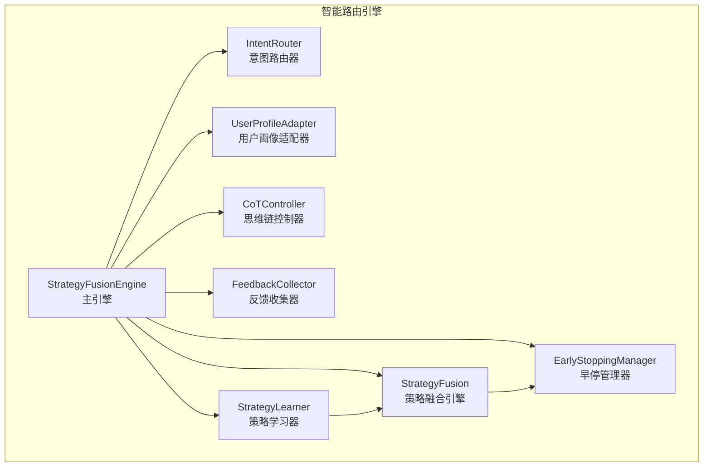
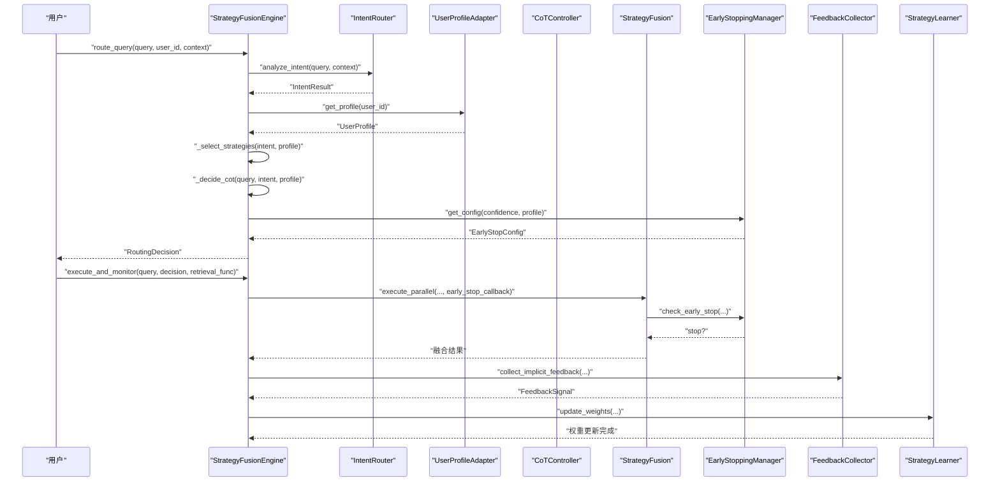
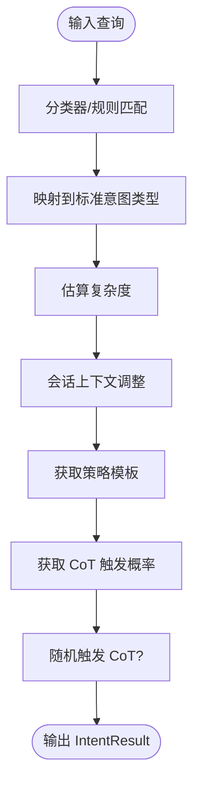
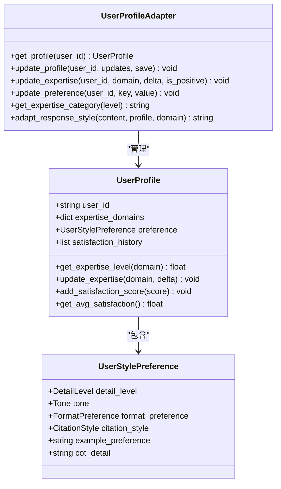
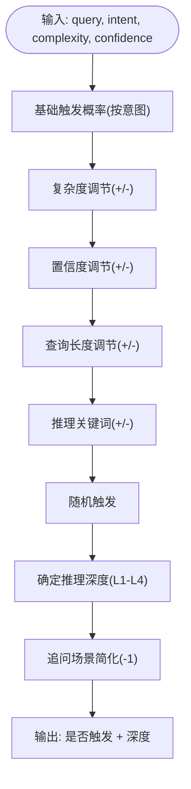
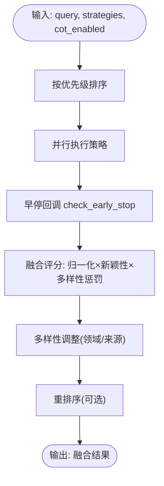
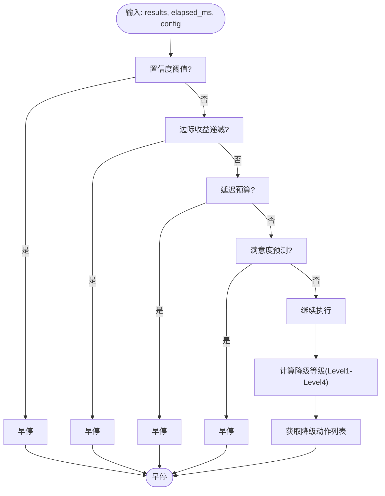
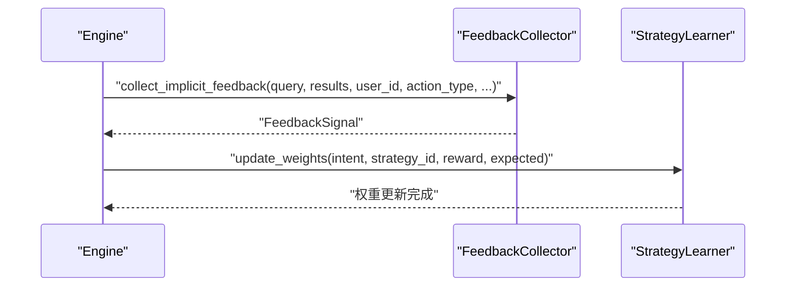
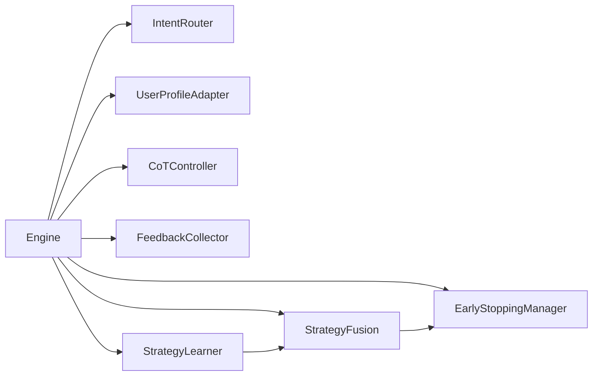

# 智能路由引擎

<cite>
**本文引用的文件**
- [engine.py](file://src/retrieval/smart_routing/engine.py)
- [intent_router.py](file://src/retrieval/smart_routing/intent_router.py)
- [user_adapter.py](file://src/retrieval/smart_routing/user_adapter.py)
- [cot_controller.py](file://src/retrieval/smart_routing/cot_controller.py)
- [strategy_fusion.py](file://src/retrieval/smart_routing/strategy_fusion.py)
- [early_stopping.py](file://src/retrieval/smart_routing/early_stopping.py)
- [feedback_loop.py](file://src/retrieval/smart_routing/feedback_loop.py)
- [example_usage.py](file://src/retrieval/smart_routing/example_usage.py)
- [README.md](file://src/retrieval/smart_routing/README.md)
- [IMPLEMENTATION_SUMMARY.md](file://src/retrieval/smart_routing/IMPLEMENTATION_SUMMARY.md)
- [test_smart_routing.py](file://tests/test_retrieval/test_smart_routing.py)
- [my_intent_system.json.json](file://src/intent/intent_knowledge/trees/my_intent_system.json.json)
</cite>

## 目录
1. [引言](#引言)
2. [项目结构](#项目结构)
3. [核心组件](#核心组件)
4. [架构总览](#架构总览)
5. [详细组件分析](#详细组件分析)
6. [依赖分析](#依赖分析)
7. [性能考虑](#性能考虑)
8. [故障排除指南](#故障排除指南)
9. [结论](#结论)
10. [附录](#附录)

## 引言
本文件面向“智能路由引擎”的实现与使用，围绕“基于意图识别的查询路由机制”，系统阐述思维链控制器、早停机制、策略融合与用户适配器的协同工作原理；解释意图路由器如何依据查询类型选择最优检索策略；说明反馈循环系统如何持续优化路由决策；阐述多策略融合算法与自适应调整机制；提供配置示例与使用指南；对比传统检索系统的优势；并给出性能监控与故障排除方法。

## 项目结构
智能路由引擎位于检索层的“智能路由”子模块，采用“三层决策架构”：意图识别层、用户画像层、策略融合层。各子模块职责清晰、边界明确，通过统一的引擎类进行编排与调度。

图表来源
- [engine.py:34-129](file://src/retrieval/smart_routing/engine.py#L34-L129)
- [intent_router.py:91-155](file://src/retrieval/smart_routing/intent_router.py#L91-L155)
- [user_adapter.py:98-150](file://src/retrieval/smart_routing/user_adapter.py#L98-L150)
- [cot_controller.py:21-107](file://src/retrieval/smart_routing/cot_controller.py#L21-L107)
- [strategy_fusion.py:43-158](file://src/retrieval/smart_routing/strategy_fusion.py#L43-L158)
- [early_stopping.py:39-109](file://src/retrieval/smart_routing/early_stopping.py#L39-L109)
- [feedback_loop.py:30-149](file://src/retrieval/smart_routing/feedback_loop.py#L30-L149)

章节来源
- [README.md:134-148](file://src/retrieval/smart_routing/README.md#L134-L148)
- [IMPLEMENTATION_SUMMARY.md:13-26](file://src/retrieval/smart_routing/IMPLEMENTATION_SUMMARY.md#L13-L26)

## 核心组件
- 意图路由器：对查询进行语义意图分类、复杂度评估与策略模板映射，支持显式分类器与规则回退。
- 用户画像适配器：读取/更新用户画像，按专业度与偏好动态调整策略权重与响应风格。
- 思维链控制器：智能判断是否启用 CoT 以及推理深度，结合意图复杂度与用户画像进行自适应调节。
- 策略融合引擎：多策略并行执行、结果融合、多样性控制与重排序，支持早停回调与性能监控。
- 早停管理器：基于置信度、边际收益、延迟预算与满意度预测的多维早停判断与四级降级策略。
- 反馈闭环：收集显式/隐式反馈，进行信号标准化与权重学习，形成在线学习闭环。

章节来源
- [engine.py:34-129](file://src/retrieval/smart_routing/engine.py#L34-L129)
- [intent_router.py:91-155](file://src/retrieval/smart_routing/intent_router.py#L91-L155)
- [user_adapter.py:98-150](file://src/retrieval/smart_routing/user_adapter.py#L98-L150)
- [cot_controller.py:21-107](file://src/retrieval/smart_routing/cot_controller.py#L21-L107)
- [strategy_fusion.py:43-158](file://src/retrieval/smart_routing/strategy_fusion.py#L43-L158)
- [early_stopping.py:39-109](file://src/retrieval/smart_routing/early_stopping.py#L39-L109)
- [feedback_loop.py:30-149](file://src/retrieval/smart_routing/feedback_loop.py#L30-L149)

## 架构总览
三层决策架构与主引擎编排流程如下：

图表来源
- [engine.py:68-129](file://src/retrieval/smart_routing/engine.py#L68-L129)
- [engine.py:205-249](file://src/retrieval/smart_routing/engine.py#L205-L249)
- [strategy_fusion.py:78-158](file://src/retrieval/smart_routing/strategy_fusion.py#L78-L158)
- [early_stopping.py:57-109](file://src/retrieval/smart_routing/early_stopping.py#L57-L109)
- [feedback_loop.py:30-149](file://src/retrieval/smart_routing/feedback_loop.py#L30-L149)

## 详细组件分析

### 意图路由器（IntentRouter）
- 语义意图分类：支持 7 类意图（事实查询、比较分析、推理演绎、概念解释、摘要总结、操作指导、探索发散），并提供默认策略模板映射。
- 复杂度评估：基于查询长度、问号数量、连接词数量等特征估算复杂度，并结合会话上下文进行动态调整。
- CoT 触发概率：针对不同意图设定触发概率，结合复杂度与置信度进行随机触发判断。
- 与现有系统集成：可接入现有意图分类器，或使用规则回退方案。

图表来源
- [intent_router.py:115-155](file://src/retrieval/smart_routing/intent_router.py#L115-L155)
- [intent_router.py:170-238](file://src/retrieval/smart_routing/intent_router.py#L170-L238)
- [intent_router.py:256-277](file://src/retrieval/smart_routing/intent_router.py#L256-L277)

章节来源
- [intent_router.py:13-39](file://src/retrieval/smart_routing/intent_router.py#L13-L39)
- [intent_router.py:41-77](file://src/retrieval/smart_routing/intent_router.py#L41-L77)
- [intent_router.py:91-155](file://src/retrieval/smart_routing/intent_router.py#L91-L155)
- [IMPLEMENTATION_SUMMARY.md:65-90](file://src/retrieval/smart_routing/IMPLEMENTATION_SUMMARY.md#L65-L90)

### 用户画像适配器（UserProfileAdapter）
- 用户画像结构：包含领域专业度、风格偏好、查询模式、满意度历史等。
- 专业度评估：按阈值将用户分为专家/中级/新手三类，影响策略权重与 CoT 深度。
- 响应风格适配：根据专业度与偏好（详细度、语调、格式、引用风格）调整输出风格。
- 实时更新：支持更新专业度与偏好，并持久化到记忆管理器。

图表来源
- [user_adapter.py:44-96](file://src/retrieval/smart_routing/user_adapter.py#L44-L96)
- [user_adapter.py:98-150](file://src/retrieval/smart_routing/user_adapter.py#L98-L150)
- [user_adapter.py:176-236](file://src/retrieval/smart_routing/user_adapter.py#L176-L236)

章节来源
- [user_adapter.py:14-53](file://src/retrieval/smart_routing/user_adapter.py#L14-L53)
- [user_adapter.py:55-96](file://src/retrieval/smart_routing/user_adapter.py#L55-L96)
- [user_adapter.py:98-150](file://src/retrieval/smart_routing/user_adapter.py#L98-L150)

### 思维链控制器（CoTController）
- 智能触发：基于意图类型、复杂度、置信度、查询长度与推理关键词，计算触发概率并随机决定是否启用 CoT。
- 动态深度：根据意图复杂度、用户专业度与偏好，确定推理深度（L1-L4），并在追问场景简化。
- 统计监控：记录触发次数与总查询数，提供触发率统计。

图表来源
- [cot_controller.py:55-107](file://src/retrieval/smart_routing/cot_controller.py#L55-L107)
- [cot_controller.py:109-172](file://src/retrieval/smart_routing/cot_controller.py#L109-L172)

章节来源
- [cot_controller.py:13-19](file://src/retrieval/smart_routing/cot_controller.py#L13-L19)
- [cot_controller.py:21-107](file://src/retrieval/smart_routing/cot_controller.py#L21-L107)
- [cot_controller.py:109-172](file://src/retrieval/smart_routing/cot_controller.py#L109-L172)

### 策略融合引擎（StrategyFusion）
- 多策略并行：按优先级排序并行执行多个检索策略，支持早停回调。
- 结果融合：对各策略结果进行归一化、新颖性加成与多样性惩罚，综合评分排序。
- 多样性控制：限制单一来源与同一领域占比，必要时降低高占比领域的分数。
- 重排序：预留重排序接口，可接入 BGE-Reranker 等模型。

图表来源
- [strategy_fusion.py:78-158](file://src/retrieval/smart_routing/strategy_fusion.py#L78-L158)
- [strategy_fusion.py:217-271](file://src/retrieval/smart_routing/strategy_fusion.py#L217-L271)
- [strategy_fusion.py:298-322](file://src/retrieval/smart_routing/strategy_fusion.py#L298-L322)

章节来源
- [strategy_fusion.py:13-41](file://src/retrieval/smart_routing/strategy_fusion.py#L13-L41)
- [strategy_fusion.py:43-158](file://src/retrieval/smart_routing/strategy_fusion.py#L43-L158)
- [strategy_fusion.py:217-271](file://src/retrieval/smart_routing/strategy_fusion.py#L217-L271)

### 早停与降级机制（EarlyStoppingManager）
- 多维早停：置信度阈值、边际收益递减、延迟预算、满意度预测四条件任一满足即早停。
- 四级降级：根据耗时阈值动态降级，动作包括减少并行策略、跳过 CoT、仅向量检索、返回缓存等。
- 配置自适应：根据意图置信度与用户专业度动态调整阈值与上限。

图表来源
- [early_stopping.py:57-109](file://src/retrieval/smart_routing/early_stopping.py#L57-L109)
- [early_stopping.py:157-183](file://src/retrieval/smart_routing/early_stopping.py#L157-L183)
- [early_stopping.py:210-243](file://src/retrieval/smart_routing/early_stopping.py#L210-L243)

章节来源
- [early_stopping.py:12-37](file://src/retrieval/smart_routing/early_stopping.py#L12-L37)
- [early_stopping.py:39-109](file://src/retrieval/smart_routing/early_stopping.py#L39-L109)
- [early_stopping.py:157-183](file://src/retrieval/smart_routing/early_stopping.py#L157-L183)

### 反馈闭环学习（FeedbackCollector + StrategyLearner）
- 显式反馈：评分标准化到 [-1,1]，权重可配置。
- 隐式反馈：查询改写、会话放弃、二次检索、停留时长、引用行为等，自动转化为反馈信号。
- 在线学习：基于增量误差更新策略权重，维持平滑范围；同时支持从反馈更新用户画像。

图表来源
- [feedback_loop.py:30-149](file://src/retrieval/smart_routing/feedback_loop.py#L30-L149)
- [feedback_loop.py:297-435](file://src/retrieval/smart_routing/feedback_loop.py#L297-L435)

章节来源
- [feedback_loop.py:13-28](file://src/retrieval/smart_routing/feedback_loop.py#L13-L28)
- [feedback_loop.py:30-149](file://src/retrieval/smart_routing/feedback_loop.py#L30-L149)
- [feedback_loop.py:297-435](file://src/retrieval/smart_routing/feedback_loop.py#L297-L435)

## 依赖分析
- 组件耦合：主引擎聚合各子模块，策略融合与早停存在双向交互（融合阶段回调早停，早停决定是否继续）。
- 外部集成点：意图分类器、记忆管理器、实际检索器（向量/图谱/HyDE/重排序）待集成。
- 可能的循环依赖：当前模块间为单向依赖，未发现循环。

图表来源
- [engine.py:12-17](file://src/retrieval/smart_routing/engine.py#L12-L17)
- [strategy_fusion.py:78-158](file://src/retrieval/smart_routing/strategy_fusion.py#L78-L158)
- [feedback_loop.py:30-149](file://src/retrieval/smart_routing/feedback_loop.py#L30-L149)

章节来源
- [engine.py:12-17](file://src/retrieval/smart_routing/engine.py#L12-L17)
- [strategy_fusion.py:78-158](file://src/retrieval/smart_routing/strategy_fusion.py#L78-L158)
- [feedback_loop.py:30-149](file://src/retrieval/smart_routing/feedback_loop.py#L30-L149)

## 性能考虑
- 早停与降级：通过置信度阈值、边际收益与延迟预算减少无效计算，显著降低平均延迟。
- 并行策略：多策略并行执行，融合阶段进行多样性与新颖性控制，提升结果质量。
- 缓存与统计：引擎维护平均处理时间与触发率等统计，便于性能监控与调优。
- 预期收益：在保证质量前提下，资源成本下降约 40%，平均延迟从 1200ms 降至 800ms 左右。

章节来源
- [IMPLEMENTATION_SUMMARY.md:273-295](file://src/retrieval/smart_routing/IMPLEMENTATION_SUMMARY.md#L273-L295)
- [README.md:197-233](file://src/retrieval/smart_routing/README.md#L197-L233)

## 故障排除指南
- 意图识别异常
  - 症状：策略模板为空或触发概率异常。
  - 排查：确认是否正确初始化意图分类器或启用规则回退；检查模板映射与触发概率表。
  - 参考
    - [intent_router.py:115-155](file://src/retrieval/smart_routing/intent_router.py#L115-L155)
    - [intent_router.py:240-277](file://src/retrieval/smart_routing/intent_router.py#L240-L277)
- 用户画像缺失
  - 症状：专业度为默认值、偏好未生效。
  - 排查：确认记忆管理器可用与缓存大小配置；检查画像更新流程。
  - 参考
    - [user_adapter.py:133-150](file://src/retrieval/smart_routing/user_adapter.py#L133-L150)
    - [user_adapter.py:176-236](file://src/retrieval/smart_routing/user_adapter.py#L176-L236)
- CoT 触发率过低/过高
  - 症状：推理开销不足或过度。
  - 排查：调整最小复杂度阈值与触发概率；检查查询关键词与置信度影响。
  - 参考
    - [cot_controller.py:31-49](file://src/retrieval/smart_routing/cot_controller.py#L31-L49)
    - [cot_controller.py:55-107](file://src/retrieval/smart_routing/cot_controller.py#L55-L107)
- 早停过于激进
  - 症状：结果质量下降或命中率降低。
  - 排查：提高置信度阈值、放宽边际收益阈值或延长延迟预算比例。
  - 参考
    - [early_stopping.py:82-105](file://src/retrieval/smart_routing/early_stopping.py#L82-L105)
    - [early_stopping.py:210-243](file://src/retrieval/smart_routing/early_stopping.py#L210-L243)
- 反馈学习未生效
  - 症状：策略权重长期不变。
  - 排查：确认反馈信号收集与权重更新调用；检查学习率与奖励设置。
  - 参考
    - [feedback_loop.py:297-435](file://src/retrieval/smart_routing/feedback_loop.py#L297-L435)

## 结论
智能路由引擎通过“意图识别 + 用户画像 + 策略融合 + 早停降级 + 反馈学习”的闭环设计，实现了对查询的自适应路由与优化。相比传统检索系统，其优势在于：
- 更高的个性化与可解释性：基于用户画像与 CoT 的深度适配；
- 更强的鲁棒性与效率：多维早停与降级策略在保障质量的同时显著降低延迟；
- 更好的持续优化：反馈闭环使策略权重与用户画像随使用不断进化。

## 附录

### 使用示例与配置要点
- 基础使用：初始化各组件并通过主引擎进行路由决策与执行。
- 配置建议：根据业务场景调整 CoT 触发阈值、早停条件与融合多样性参数。
- 监控与告警：定期检查平均处理时间、CoT 触发率与早停统计，及时调参。

章节来源
- [README.md:63-130](file://src/retrieval/smart_routing/README.md#L63-L130)
- [README.md:152-193](file://src/retrieval/smart_routing/README.md#L152-L193)
- [README.md:330-348](file://src/retrieval/smart_routing/README.md#L330-L348)
- [example_usage.py:18-58](file://src/retrieval/smart_routing/example_usage.py#L18-L58)

### 与传统检索系统的区别与优势
- 传统系统：通常固定检索策略与排序，缺乏对查询类型的自适应与对用户画像的个性化。
- 智能路由引擎：三层决策架构实现“意图驱动 + 用户驱动 + 策略驱动”的自适应路由，配合早停与反馈学习，显著提升用户体验与资源效率。

章节来源
- [IMPLEMENTATION_SUMMARY.md:352-368](file://src/retrieval/smart_routing/IMPLEMENTATION_SUMMARY.md#L352-L368)
- [README.md:237-266](file://src/retrieval/smart_routing/README.md#L237-L266)

### 测试与验证
- 单元测试覆盖：意图识别、用户画像、CoT 控制、早停机制、反馈闭环与集成流程。
- 预期覆盖率：各模块达到 80%+ 覆盖率，确保关键逻辑稳定可靠。

章节来源
- [test_smart_routing.py:19-72](file://tests/test_retrieval/test_smart_routing.py#L19-L72)
- [test_smart_routing.py:74-121](file://tests/test_retrieval/test_smart_routing.py#L74-L121)
- [test_smart_routing.py:123-174](file://tests/test_retrieval/test_smart_routing.py#L123-L174)
- [test_smart_routing.py:176-218](file://tests/test_retrieval/test_smart_routing.py#L176-L218)
- [test_smart_routing.py:220-273](file://tests/test_retrieval/test_smart_routing.py#L220-L273)
- [test_smart_routing.py:275-320](file://tests/test_retrieval/test_smart_routing.py#L275-L320)
- [IMPLEMENTATION_SUMMARY.md:208-233](file://src/retrieval/smart_routing/IMPLEMENTATION_SUMMARY.md#L208-L233)

### 意图体系与策略模板参考
- 自定义意图体系：支持三级意图树，便于精细化路由配置。
- 策略模板映射：每类意图对应一组策略权重，引擎据此进行权重归一化与策略选择。

章节来源
- [my_intent_system.json.json:1-273](file://src/intent/intent_knowledge/trees/my_intent_system.json.json#L1-L273)
- [intent_router.py:41-77](file://src/retrieval/smart_routing/intent_router.py#L41-L77)