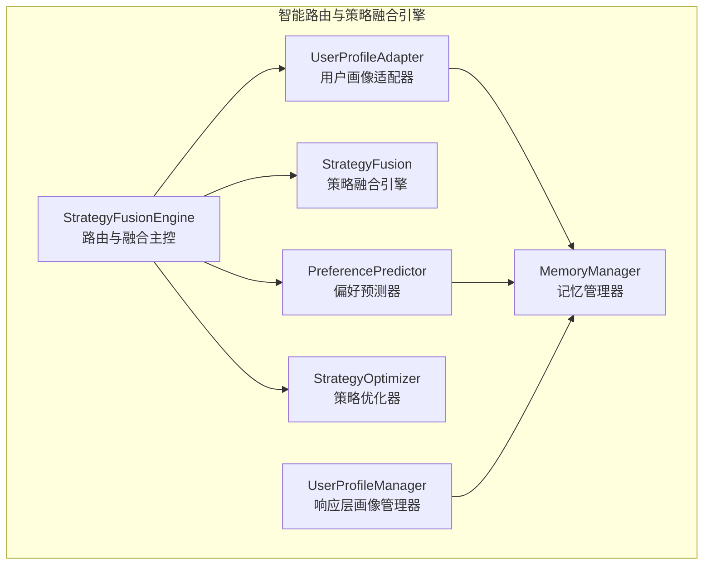
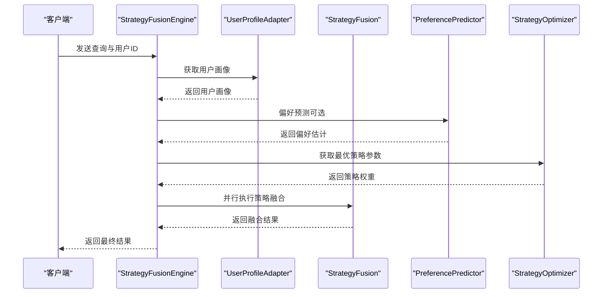
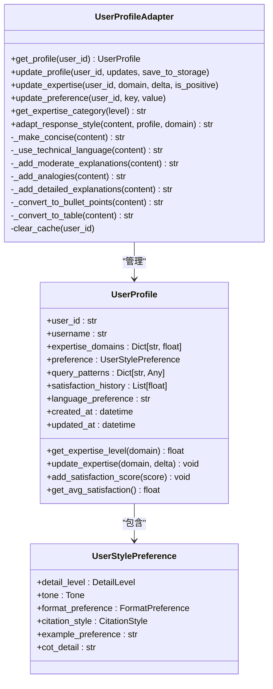
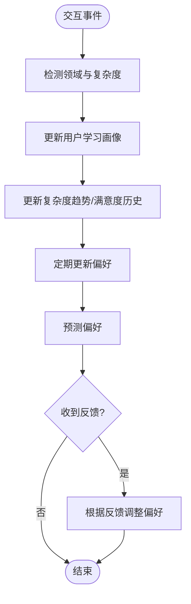
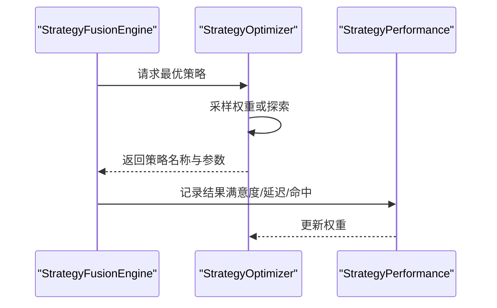
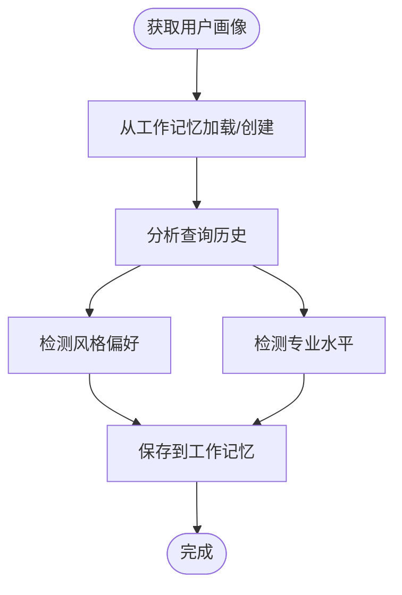
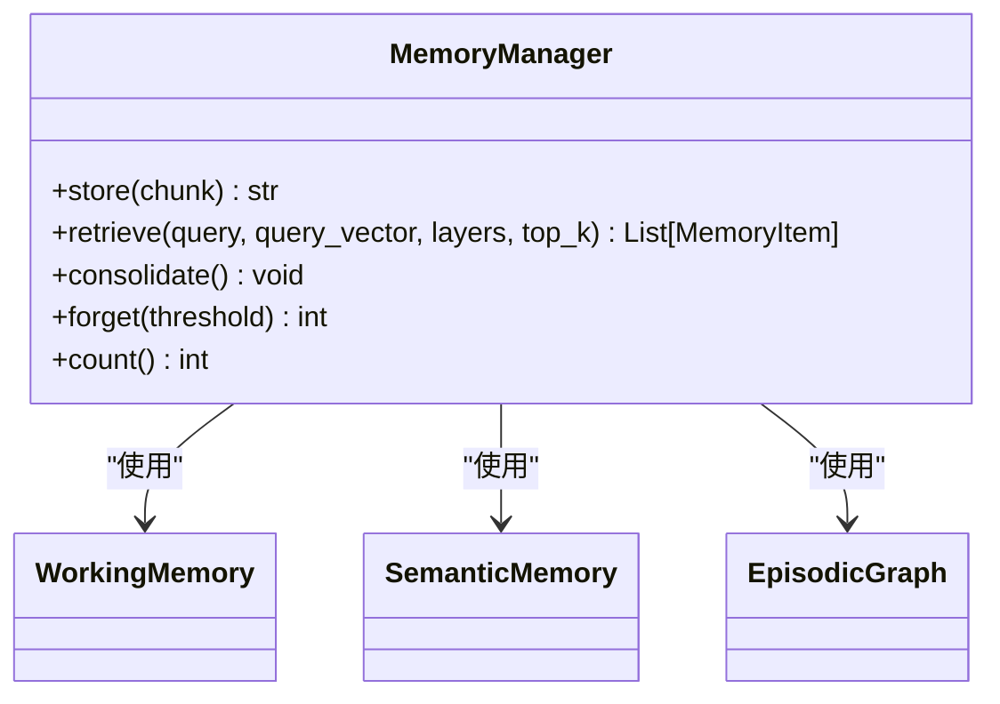
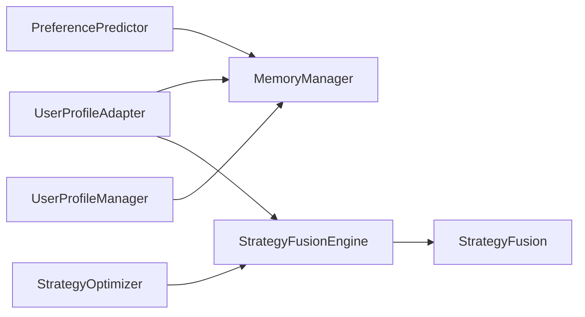

# 用户适配器模块

<cite>
**本文引用的文件**
- [user_adapter.py](file://src/retrieval/smart_routing/user_adapter.py)
- [engine.py](file://src/retrieval/smart_routing/engine.py)
- [strategy_fusion.py](file://src/retrieval/smart_routing/strategy_fusion.py)
- [preference_predictor.py](file://src/adaptive/preference_predictor.py)
- [strategy_optimizer.py](file://src/adaptive/strategy_optimizer.py)
- [config.py](file://src/adaptive/config.py)
- [models.py](file://src/adaptive/models.py)
- [profile_manager.py](file://src/response/profile_manager.py)
- [manager.py](file://src/workspace/user/manager.py)
- [models.py](file://src/workspace/user/models.py)
- [manager.py](file://src/memory/manager.py)
- [test_multi_user_system.py](file://tests/test_user/test_multi_user_system.py)
</cite>

## 目录
1. [简介](#简介)
2. [项目结构](#项目结构)
3. [核心组件](#核心组件)
4. [架构总览](#架构总览)
5. [详细组件分析](#详细组件分析)
6. [依赖分析](#依赖分析)
7. [性能考虑](#性能考虑)
8. [故障排查指南](#故障排查指南)
9. [结论](#结论)
10. [附录](#附录)

## 简介
本文件面向“用户适配器模块”，系统性阐述用户画像系统与偏好识别机制、专家级别评估与风格偏好分析、用户配置的动态调整与个性化推荐、不同用户类型的策略适配逻辑、用户配置示例与适配规则，以及与策略融合的交互方式。同时提供用户画像管理与优化建议，帮助开发者与产品人员高效落地个性化体验。

## 项目结构
用户适配器模块位于检索智能路由子系统中，与意图识别、策略融合、思维链控制、反馈学习等模块协同工作，形成“意图识别—用户画像—策略融合”的三层决策闭环。

**图表来源**
- [engine.py:34-129](file://src/retrieval/smart_routing/engine.py#L34-L129)
- [user_adapter.py:98-144](file://src/retrieval/smart_routing/user_adapter.py#L98-L144)
- [strategy_fusion.py:43-76](file://src/retrieval/smart_routing/strategy_fusion.py#L43-L76)
- [preference_predictor.py:21-57](file://src/adaptive/preference_predictor.py#L21-L57)
- [strategy_optimizer.py:19-75](file://src/adaptive/strategy_optimizer.py#L19-L75)
- [profile_manager.py:20-100](file://src/response/profile_manager.py#L20-L100)
- [manager.py:20-51](file://src/memory/manager.py#L20-L51)

**章节来源**
- [engine.py:34-129](file://src/retrieval/smart_routing/engine.py#L34-L129)
- [user_adapter.py:98-144](file://src/retrieval/smart_routing/user_adapter.py#L98-L144)
- [strategy_fusion.py:43-76](file://src/retrieval/smart_routing/strategy_fusion.py#L43-L76)
- [preference_predictor.py:21-57](file://src/adaptive/preference_predictor.py#L21-L57)
- [strategy_optimizer.py:19-75](file://src/adaptive/strategy_optimizer.py#L19-L75)
- [profile_manager.py:20-100](file://src/response/profile_manager.py#L20-L100)
- [manager.py:20-51](file://src/memory/manager.py#L20-L51)

## 核心组件
- 用户画像适配器（UserProfileAdapter）：负责用户画像的获取、更新、专家度评估与风格偏好适配，并与记忆管理器交互持久化。
- 偏好预测器（PreferencePredictor）：基于交互历史与反馈，估计用户专业度、偏好风格与内容深度，提供个性化推荐依据。
- 策略优化器（StrategyOptimizer）：对检索策略进行在线学习与权重更新，结合用户画像实现动态策略适配。
- 响应层画像管理器（UserProfileManager）：在响应层对用户风格与专业度进行规则/LLM检测，补充用户画像。
- 记忆管理器（MemoryManager）：统一管理三层记忆，为用户画像提供持久化与跨层检索能力。

**章节来源**
- [user_adapter.py:98-144](file://src/retrieval/smart_routing/user_adapter.py#L98-L144)
- [preference_predictor.py:21-57](file://src/adaptive/preference_predictor.py#L21-L57)
- [strategy_optimizer.py:19-75](file://src/adaptive/strategy_optimizer.py#L19-L75)
- [profile_manager.py:20-100](file://src/response/profile_manager.py#L20-L100)
- [manager.py:20-51](file://src/memory/manager.py#L20-L51)

## 架构总览
用户适配器模块在“智能路由与策略融合引擎”中承担“用户画像层”的职责，与意图识别、策略融合、思维链控制、反馈学习共同构成三层决策架构。

**图表来源**
- [engine.py:68-129](file://src/retrieval/smart_routing/engine.py#L68-L129)
- [user_adapter.py:133-150](file://src/retrieval/smart_routing/user_adapter.py#L133-L150)
- [preference_predictor.py:174-223](file://src/adaptive/preference_predictor.py#L174-L223)
- [strategy_optimizer.py:198-232](file://src/adaptive/strategy_optimizer.py#L198-L232)
- [strategy_fusion.py:78-158](file://src/retrieval/smart_routing/strategy_fusion.py#L78-L158)

**章节来源**
- [engine.py:68-129](file://src/retrieval/smart_routing/engine.py#L68-L129)
- [user_adapter.py:133-150](file://src/retrieval/smart_routing/user_adapter.py#L133-L150)
- [preference_predictor.py:174-223](file://src/adaptive/preference_predictor.py#L174-L223)
- [strategy_optimizer.py:198-232](file://src/adaptive/strategy_optimizer.py#L198-L232)
- [strategy_fusion.py:78-158](file://src/retrieval/smart_routing/strategy_fusion.py#L78-L158)

## 详细组件分析

### 用户画像适配器（UserProfileAdapter）
- 职责
  - 获取与管理用户画像（含专业度、偏好、满意度历史、语言偏好等）
  - 专业度评估与调节（基于领域与反馈）
  - 风格偏好适配（根据专业度与偏好调整内容风格）
  - 实时更新与缓存管理
- 关键数据结构
  - 用户风格偏好（详细度、语调、格式偏好、引用风格、示例偏好、思维链详细度）
  - 用户画像（用户ID、用户名、专业度、偏好、查询模式、满意度历史、语言偏好、时间戳）
- 专家级别评估
  - 通过领域专业度阈值（专家/中级/新手/入门）进行分类
  - 结合偏好与查询复杂度趋势进行综合评估
- 响应风格适配
  - 专家：简洁、技术术语
  - 中级：平衡解释
  - 新手：类比、详细解释
  - 格式偏好：列表/表格等
- 动态调整与持久化
  - 支持更新专业度、偏好、满意度历史
  - 与记忆管理器交互进行持久化与缓存

**图表来源**
- [user_adapter.py:98-331](file://src/retrieval/smart_routing/user_adapter.py#L98-L331)

**章节来源**
- [user_adapter.py:98-331](file://src/retrieval/smart_routing/user_adapter.py#L98-L331)

### 偏好预测器（PreferencePredictor）
- 职责
  - 基于交互历史与反馈，估计用户专业度与偏好
  - 维护用户学习画像（领域专业度、查询复杂度趋势、满意度历史、主题频率、活跃时段等）
  - 根据反馈（显式/隐式）调整偏好
- 关键机制
  - 领域关键词映射与专业术语识别
  - 查询复杂度估计（长度、术语、问题类型）
  - 偏好更新（详情/语调/格式偏好）
  - 个性化准确度与群体洞察统计

**图表来源**
- [preference_predictor.py:64-129](file://src/adaptive/preference_predictor.py#L64-L129)
- [preference_predictor.py:151-223](file://src/adaptive/preference_predictor.py#L151-L223)
- [preference_predictor.py:225-268](file://src/adaptive/preference_predictor.py#L225-L268)

**章节来源**
- [preference_predictor.py:64-129](file://src/adaptive/preference_predictor.py#L64-L129)
- [preference_predictor.py:151-223](file://src/adaptive/preference_predictor.py#L151-L223)
- [preference_predictor.py:225-268](file://src/adaptive/preference_predictor.py#L225-L268)

### 策略优化器（StrategyOptimizer）
- 职责
  - 为不同查询类型选择最优检索策略参数组合
  - 基于满意度与延迟进行在线权重更新
  - 采用 epsilon-greedy 平衡探索与利用
- 关键机制
  - 默认策略模板（向量搜索、混合搜索、图增强、HyDE增强）
  - 策略表现记录与权重归一化
  - 查询类型微调（事实型/复杂型/探索型等）

**图表来源**
- [strategy_optimizer.py:198-232](file://src/adaptive/strategy_optimizer.py#L198-L232)
- [strategy_optimizer.py:93-154](file://src/adaptive/strategy_optimizer.py#L93-L154)

**章节来源**
- [strategy_optimizer.py:198-232](file://src/adaptive/strategy_optimizer.py#L198-L232)
- [strategy_optimizer.py:93-154](file://src/adaptive/strategy_optimizer.py#L93-L154)

### 响应层画像管理器（UserProfileManager）
- 职责
  - 基于查询历史检测用户风格与专业度
  - 支持规则与LLM两种检测模式
  - 维护查询历史与偏好分析
- 关键机制
  - 规则关键词匹配（专家/中级/初学者）
  - 风格模式检测（简洁/详细/技术/通俗）
  - LLM增强检测（失败时退化）

**图表来源**
- [profile_manager.py:115-174](file://src/response/profile_manager.py#L115-L174)
- [profile_manager.py:236-284](file://src/response/profile_manager.py#L236-L284)
- [profile_manager.py:366-420](file://src/response/profile_manager.py#L366-L420)

**章节来源**
- [profile_manager.py:115-174](file://src/response/profile_manager.py#L115-L174)
- [profile_manager.py:236-284](file://src/response/profile_manager.py#L236-L284)
- [profile_manager.py:366-420](file://src/response/profile_manager.py#L366-L420)

### 记忆管理器（MemoryManager）
- 职责
  - 统一管理三层记忆（工作记忆、语义记忆、情节图谱）
  - 为用户画像提供持久化与跨层检索能力
- 关键机制
  - 存储知识到语义记忆与图谱
  - 记忆巩固与主动遗忘
  - 统一存储与检索

**图表来源**
- [manager.py:20-212](file://src/memory/manager.py#L20-L212)

**章节来源**
- [manager.py:20-212](file://src/memory/manager.py#L20-L212)

## 依赖分析
- 用户画像适配器依赖记忆管理器进行画像持久化与缓存；与策略融合引擎协同进行策略权重调节。
- 偏好预测器与策略优化器共同驱动个性化与策略优化；响应层画像管理器提供互补的风格与专业度检测。
- 记忆管理器为三层记忆提供统一后端，支撑用户画像与知识检索。

**图表来源**
- [user_adapter.py:119-124](file://src/retrieval/smart_routing/user_adapter.py#L119-L124)
- [engine.py:54-62](file://src/retrieval/smart_routing/engine.py#L54-L62)
- [preference_predictor.py:55-56](file://src/adaptive/preference_predictor.py#L55-L56)
- [strategy_optimizer.py:66-75](file://src/adaptive/strategy_optimizer.py#L66-L75)
- [profile_manager.py:93-96](file://src/response/profile_manager.py#L93-L96)

**章节来源**
- [user_adapter.py:119-124](file://src/retrieval/smart_routing/user_adapter.py#L119-L124)
- [engine.py:54-62](file://src/retrieval/smart_routing/engine.py#L54-L62)
- [preference_predictor.py:55-56](file://src/adaptive/preference_predictor.py#L55-L56)
- [strategy_optimizer.py:66-75](file://src/adaptive/strategy_optimizer.py#L66-L75)
- [profile_manager.py:93-96](file://src/response/profile_manager.py#L93-L96)

## 性能考虑
- 缓存策略：用户画像适配器内置本地缓存，建议合理设置缓存大小与TTL，避免内存膨胀。
- 异步与并行：策略融合引擎支持并行执行多策略，建议结合早停机制与权重裁剪，降低整体延迟。
- 记忆管理：记忆巩固与主动遗忘有助于维持检索效率，建议根据业务场景调整衰减参数。
- 偏好学习：偏好预测器与策略优化器的更新频率需平衡个性化效果与系统开销，可通过配置项调节。

[本节为通用指导，无需特定文件引用]

## 故障排查指南
- 用户画像为空或异常
  - 检查记忆管理器是否正确持久化用户画像
  - 确认用户ID是否一致，缓存是否被清理
- 专家级别误判
  - 检查领域关键词映射与专业术语识别是否覆盖目标领域
  - 调整专业度阈值与学习速率
- 偏好预测不准
  - 确认交互历史是否足够，满意度窗口与复杂度历史长度是否合理
  - 检查反馈收集与隐式反馈开关
- 策略权重不收敛
  - 检查探索率与学习速率配置
  - 确认最小样本数是否满足优化条件

**章节来源**
- [user_adapter.py:133-150](file://src/retrieval/smart_routing/user_adapter.py#L133-L150)
- [preference_predictor.py:352-401](file://src/adaptive/preference_predictor.py#L352-L401)
- [strategy_optimizer.py:387-400](file://src/adaptive/strategy_optimizer.py#L387-L400)

## 结论
用户适配器模块通过“用户画像+偏好预测+策略优化”的闭环，实现了对不同用户类型的动态适配与个性化推荐。结合记忆管理与响应层画像管理，系统能够在保证性能的同时持续提升个性化体验。建议在生产环境中结合业务场景调优配置参数，并建立完善的监控与回滚机制。

[本节为总结性内容，无需特定文件引用]

## 附录

### 不同用户类型的策略适配逻辑
- 专家用户
  - 专业度阈值较高，偏好简洁与技术性内容
  - 策略权重向深度检索倾斜，减少思维链与假设答案权重
- 中级用户
  - 平衡解释与实用信息
  - 策略权重按默认模板分配
- 新手用户
  - 偏好通俗易懂与详细解释
  - 策略权重向增强检索与思维链倾斜

**章节来源**
- [engine.py:131-168](file://src/retrieval/smart_routing/engine.py#L131-L168)
- [user_adapter.py:269-288](file://src/retrieval/smart_routing/user_adapter.py#L269-L288)

### 用户配置示例与适配规则
- 专家级别评估
  - 阈值：专家≥0.8，中级≥0.5，新手≥0.3，入门<0.3
  - 评估依据：领域专业度与查询复杂度趋势
- 风格偏好适配
  - 专家：简洁、技术术语
  - 中级：平衡解释
  - 新手：类比、详细解释
  - 格式偏好：列表/表格等
- 偏好预测
  - 基于交互历史与反馈，定期更新详情/语调/格式偏好
  - 个性化准确度用于衡量适配效果

**章节来源**
- [user_adapter.py:127-131](file://src/retrieval/smart_routing/user_adapter.py#L127-L131)
- [user_adapter.py:269-288](file://src/retrieval/smart_routing/user_adapter.py#L269-L288)
- [preference_predictor.py:151-223](file://src/adaptive/preference_predictor.py#L151-L223)

### 与策略融合的交互方式
- 引擎在路由阶段获取用户画像与偏好预测，结合查询意图选择策略模板
- 策略优化器根据满意度与延迟在线更新策略权重
- 策略融合引擎并行执行多策略，进行结果融合与多样性保证

**章节来源**
- [engine.py:68-129](file://src/retrieval/smart_routing/engine.py#L68-L129)
- [strategy_fusion.py:78-158](file://src/retrieval/smart_routing/strategy_fusion.py#L78-L158)
- [strategy_optimizer.py:198-232](file://src/adaptive/strategy_optimizer.py#L198-L232)

### 用户画像管理与优化建议
- 数据模型
  - 用户画像包含专业度、偏好、查询模式、满意度历史、语言偏好等
  - 响应层画像管理器提供风格与专业度检测
- 生命周期管理
  - 创建：若工作记忆中不存在则创建
  - 更新：追加查询历史，限制最大长度，更新时间戳
  - 持久化：工作记忆作为L1临时存储，适合会话内复用
  - 清理：工作记忆支持TTL与条目上限，避免无限增长
- 优化建议
  - 合理设置缓存大小与TTL
  - 增加隐式反馈与满意度窗口
  - 结合业务场景调优探索率与学习速率

**章节来源**
- [models.py:124-202](file://src/workspace/user/models.py#L124-L202)
- [profile_manager.py:115-174](file://src/response/profile_manager.py#L115-L174)
- [test_multi_user_system.py:165-236](file://tests/test_user/test_multi_user_system.py#L165-L236)