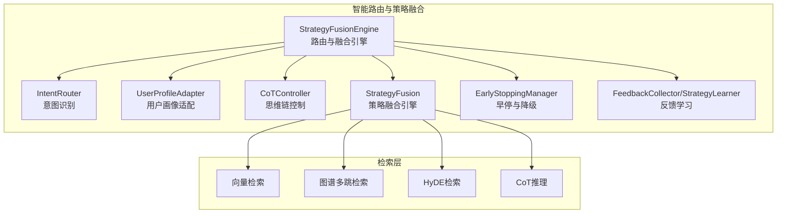
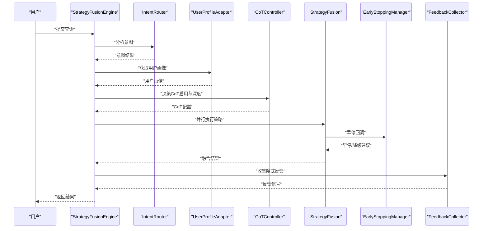
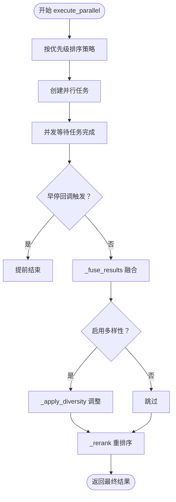
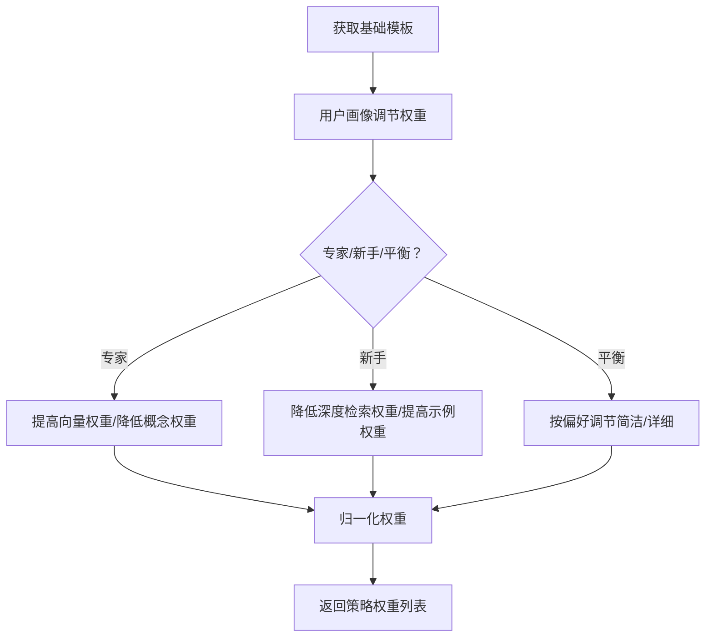
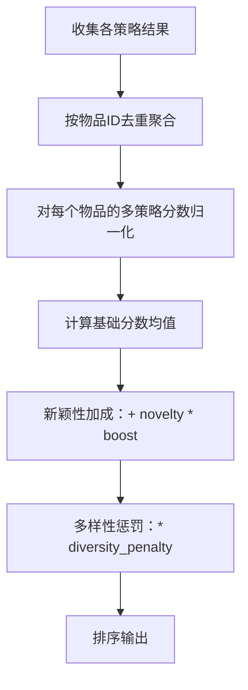
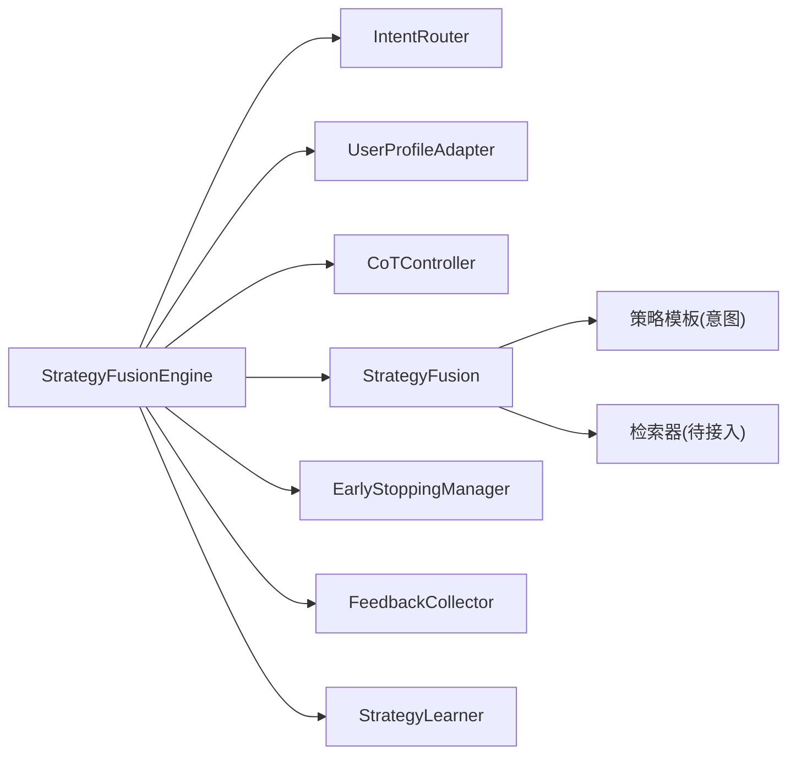

# 策略融合模块

<cite>
**本文档引用的文件**
- [src/retrieval/smart_routing/strategy_fusion.py](file://src/retrieval/smart_routing/strategy_fusion.py)
- [src/retrieval/smart_routing/engine.py](file://src/retrieval/smart_routing/engine.py)
- [src/retrieval/smart_routing/intent_router.py](file://src/retrieval/smart_routing/intent_router.py)
- [src/retrieval/smart_routing/user_adapter.py](file://src/retrieval/smart_routing/user_adapter.py)
- [src/retrieval/smart_routing/cot_controller.py](file://src/retrieval/smart_routing/cot_controller.py)
- [src/retrieval/smart_routing/early_stopping.py](file://src/retrieval/smart_routing/early_stopping.py)
- [src/retrieval/smart_routing/feedback_loop.py](file://src/retrieval/smart_routing/feedback_loop.py)
- [src/retrieval/fusion.py](file://src/retrieval/fusion.py)
- [src/adaptive/strategy_optimizer.py](file://src/adaptive/strategy_optimizer.py)
- [src/adaptive/collective.py](file://src/adaptive/collective.py)
- [src/adaptive/models.py](file://src/adaptive/models.py)
- [src/adaptive/config.py](file://src/adaptive/config.py)
- [src/retrieval/smart_routing/example_usage.py](file://src/retrieval/smart_routing/example_usage.py)
</cite>

## 目录
1. [引言](#引言)
2. [项目结构](#项目结构)
3. [核心组件](#核心组件)
4. [架构总览](#架构总览)
5. [详细组件分析](#详细组件分析)
6. [依赖分析](#依赖分析)
7. [性能考虑](#性能考虑)
8. [故障排查指南](#故障排查指南)
9. [结论](#结论)
10. [附录](#附录)

## 引言
本文件面向“策略融合模块”，系统化阐述多策略并行检索与结果融合的算法与实现，包括：
- 多策略并行执行与结果聚合
- 权重分配与归一化机制
- 策略模板系统与动态调整逻辑
- 与意图识别、用户画像的联动机制
- 早停与降级策略
- 反馈闭环与在线学习
- 性能优化与故障诊断方法

目标读者既包括工程实现人员，也包括产品与运营人员，帮助快速理解与正确配置策略融合模块。

## 项目结构
策略融合模块位于检索层的“智能路由”子系统中，围绕“意图识别-用户画像-策略融合”的三层决策架构展开，同时与自适应学习、反馈闭环、早停降级等模块协同工作。

图表来源
- [src/retrieval/smart_routing/engine.py:34-129](file://src/retrieval/smart_routing/engine.py#L34-L129)
- [src/retrieval/smart_routing/strategy_fusion.py:43-158](file://src/retrieval/smart_routing/strategy_fusion.py#L43-L158)

章节来源
- [src/retrieval/smart_routing/engine.py:34-129](file://src/retrieval/smart_routing/engine.py#L34-L129)
- [src/retrieval/smart_routing/strategy_fusion.py:43-158](file://src/retrieval/smart_routing/strategy_fusion.py#L43-L158)

## 核心组件
- 意图识别层：识别查询类型、复杂度与领域，提供策略模板映射与触发概率。
- 用户画像层：根据用户专业度与偏好动态调整策略权重与响应风格。
- 策略融合层：并行执行多个检索策略，融合结果并进行多样性与重排序处理。
- 早停与降级：在满足质量阈值前提下，尽可能缩短延迟并提供可控降级方案。
- 反馈学习：收集显式/隐式反馈，更新策略权重与用户画像，形成闭环。

章节来源
- [src/retrieval/smart_routing/intent_router.py:91-155](file://src/retrieval/smart_routing/intent_router.py#L91-L155)
- [src/retrieval/smart_routing/user_adapter.py:98-150](file://src/retrieval/smart_routing/user_adapter.py#L98-L150)
- [src/retrieval/smart_routing/strategy_fusion.py:43-158](file://src/retrieval/smart_routing/strategy_fusion.py#L43-L158)
- [src/retrieval/smart_routing/early_stopping.py:39-109](file://src/retrieval/smart_routing/early_stopping.py#L39-L109)
- [src/retrieval/smart_routing/feedback_loop.py:30-96](file://src/retrieval/smart_routing/feedback_loop.py#L30-L96)

## 架构总览
策略融合模块采用“三层决策 + 多模块协同”的架构：
- 第一层：意图识别，决定策略模板与触发概率
- 第二层：用户画像适配，动态调节策略权重与响应风格
- 第三层：策略融合，执行并行检索、融合、多样性与重排序
- 辅助模块：早停降级保障性能；反馈学习持续优化权重与画像

图表来源
- [src/retrieval/smart_routing/engine.py:68-129](file://src/retrieval/smart_routing/engine.py#L68-L129)
- [src/retrieval/smart_routing/strategy_fusion.py:78-158](file://src/retrieval/smart_routing/strategy_fusion.py#L78-L158)
- [src/retrieval/smart_routing/early_stopping.py:57-109](file://src/retrieval/smart_routing/early_stopping.py#L57-L109)
- [src/retrieval/smart_routing/feedback_loop.py:30-96](file://src/retrieval/smart_routing/feedback_loop.py#L30-L96)

## 详细组件分析

### 组件A：策略融合引擎（StrategyFusion）
职责与能力：
- 多策略并行执行与结果聚合
- 融合评分公式与归一化
- 多样性惩罚与领域分布控制
- 重排序占位（可扩展）

关键流程（并行执行与融合）：

图表来源
- [src/retrieval/smart_routing/strategy_fusion.py:78-158](file://src/retrieval/smart_routing/strategy_fusion.py#L78-L158)
- [src/retrieval/smart_routing/strategy_fusion.py:217-271](file://src/retrieval/smart_routing/strategy_fusion.py#L217-L271)
- [src/retrieval/smart_routing/strategy_fusion.py:298-322](file://src/retrieval/smart_routing/strategy_fusion.py#L298-L322)

章节来源
- [src/retrieval/smart_routing/strategy_fusion.py:43-158](file://src/retrieval/smart_routing/strategy_fusion.py#L43-L158)
- [src/retrieval/smart_routing/strategy_fusion.py:217-322](file://src/retrieval/smart_routing/strategy_fusion.py#L217-L322)

### 组件B：策略模板系统与动态调整
- 模板来源：意图识别模块提供默认策略模板
- 动态调整：结合用户画像（专业度、偏好）对策略权重进行放大/缩小
- 归一化：调整后按总权重归一化，确保概率意义

图表来源
- [src/retrieval/smart_routing/engine.py:131-168](file://src/retrieval/smart_routing/engine.py#L131-L168)
- [src/retrieval/smart_routing/intent_router.py:42-77](file://src/retrieval/smart_routing/intent_router.py#L42-L77)
- [src/retrieval/smart_routing/user_adapter.py:56-96](file://src/retrieval/smart_routing/user_adapter.py#L56-L96)

章节来源
- [src/retrieval/smart_routing/engine.py:131-168](file://src/retrieval/smart_routing/engine.py#L131-L168)
- [src/retrieval/smart_routing/intent_router.py:42-77](file://src/retrieval/smart_routing/intent_router.py#L42-L77)
- [src/retrieval/smart_routing/user_adapter.py:56-96](file://src/retrieval/smart_routing/user_adapter.py#L56-L96)

### 组件C：权重分配与归一化机制
- 权重来源：策略模板权重 + 用户画像动态调节
- 归一化：总权重非零时按比例缩放，使策略权重和为1
- 归一化公式：对每个策略权重 w_i 除以 Σw_i

章节来源
- [src/retrieval/smart_routing/engine.py:162-168](file://src/retrieval/smart_routing/engine.py#L162-L168)

### 组件D：并行执行与结果聚合
- 并行执行：按优先级排序后并发调度各策略
- 结果聚合：去重合并相同物品，记录来源策略与原始分数
- 融合评分：对同一物品来自不同策略的分数进行归一化，计算基础分数，叠加新颖性加成与多样性惩罚

图表来源
- [src/retrieval/smart_routing/strategy_fusion.py:217-271](file://src/retrieval/smart_routing/strategy_fusion.py#L217-L271)
- [src/retrieval/smart_routing/strategy_fusion.py:273-284](file://src/retrieval/smart_routing/strategy_fusion.py#L273-L284)
- [src/retrieval/smart_routing/strategy_fusion.py:286-296](file://src/retrieval/smart_routing/strategy_fusion.py#L286-L296)

章节来源
- [src/retrieval/smart_routing/strategy_fusion.py:217-296](file://src/retrieval/smart_routing/strategy_fusion.py#L217-L296)

### 组件E：多样性与领域分布控制
- 多样性惩罚：若单一策略贡献过多，降低其对最终分数的影响
- 领域分布检查：超过阈值的领域占比会被降低分数，避免“信息茧房”
- 重排序：按最终分数降序排列

章节来源
- [src/retrieval/smart_routing/strategy_fusion.py:298-322](file://src/retrieval/smart_routing/strategy_fusion.py#L298-L322)

### 组件F：与意图识别和用户画像的联动
- 意图识别：提供策略模板与触发概率，影响策略选择与CoT启用
- 用户画像：影响权重放大/缩小与响应风格
- CoT控制：根据意图复杂度与用户偏好动态确定推理深度

章节来源
- [src/retrieval/smart_routing/intent_router.py:91-155](file://src/retrieval/smart_routing/intent_router.py#L91-L155)
- [src/retrieval/smart_routing/user_adapter.py:98-150](file://src/retrieval/smart_routing/user_adapter.py#L98-L150)
- [src/retrieval/smart_routing/cot_controller.py:21-107](file://src/retrieval/smart_routing/cot_controller.py#L21-L107)

### 组件G：早停与降级机制
- 早停条件：置信度阈值、边际收益递减、延迟预算、满意度预测
- 降级等级：从轻微到较大，逐步减少并行策略、跳过CoT、仅执行基础检索
- 动态配置：根据意图置信度与用户画像调整阈值与预算

章节来源
- [src/retrieval/smart_routing/early_stopping.py:39-109](file://src/retrieval/smart_routing/early_stopping.py#L39-L109)
- [src/retrieval/smart_routing/early_stopping.py:157-208](file://src/retrieval/smart_routing/early_stopping.py#L157-L208)
- [src/retrieval/smart_routing/early_stopping.py:210-243](file://src/retrieval/smart_routing/early_stopping.py#L210-L243)

### 组件H：反馈闭环与在线学习
- 显式反馈：评分标准化到[-1,1]，加权存储
- 隐式反馈：查询改写、会话放弃、再次搜索、停留时长、引用行为等
- 在线学习：基于奖励误差更新策略权重，支持用户画像更新

章节来源
- [src/retrieval/smart_routing/feedback_loop.py:30-96](file://src/retrieval/smart_routing/feedback_loop.py#L30-L96)
- [src/retrieval/smart_routing/feedback_loop.py:297-356](file://src/retrieval/smart_routing/feedback_loop.py#L297-L356)
- [src/retrieval/smart_routing/feedback_loop.py:358-416](file://src/retrieval/smart_routing/feedback_loop.py#L358-L416)

### 组件I：自适应学习与集体智慧
- 策略优化器：基于epsilon-greedy探索与利用，按满意度奖励更新策略权重并归一化
- 集体智慧：识别知识盲区、提取最佳实践、检测趋势，生成洞察报告
- 数据模型与配置：统一的数据结构与可调参数

章节来源
- [src/adaptive/strategy_optimizer.py:19-196](file://src/adaptive/strategy_optimizer.py#L19-L196)
- [src/adaptive/strategy_optimizer.py:198-290](file://src/adaptive/strategy_optimizer.py#L198-L290)
- [src/adaptive/collective.py:26-322](file://src/adaptive/collective.py#L26-L322)
- [src/adaptive/models.py:84-121](file://src/adaptive/models.py#L84-L121)
- [src/adaptive/config.py:15-93](file://src/adaptive/config.py#L15-L93)

### 组件J：结果融合策略（RRF与加权融合）
- RRF：基于倒数排名累加，适合跨策略结果融合
- 加权融合：对不同策略结果按权重累加，需保证权重归一化

章节来源
- [src/retrieval/fusion.py:9-127](file://src/retrieval/fusion.py#L9-L127)

## 依赖分析
策略融合模块内部耦合度低，通过清晰的接口与数据结构解耦：
- StrategyFusionEngine 依赖 IntentRouter、UserProfileAdapter、CoTController、StrategyFusion、EarlyStoppingManager、FeedbackCollector、StrategyLearner
- StrategyFusion 依赖 FusionConfig 与策略模板（来自意图识别），并预留检索器接入点
- 早停与反馈模块独立，通过回调与信号与主流程解耦

图表来源
- [src/retrieval/smart_routing/engine.py:44-62](file://src/retrieval/smart_routing/engine.py#L44-L62)
- [src/retrieval/smart_routing/strategy_fusion.py:61-76](file://src/retrieval/smart_routing/strategy_fusion.py#L61-L76)

章节来源
- [src/retrieval/smart_routing/engine.py:44-62](file://src/retrieval/smart_routing/engine.py#L44-L62)
- [src/retrieval/smart_routing/strategy_fusion.py:61-76](file://src/retrieval/smart_routing/strategy_fusion.py#L61-L76)

## 性能考虑
- 并行化：按优先级并行执行，显著降低尾延迟
- 早停与降级：在满足质量阈值前提下提前终止，或降级到低成本策略
- 归一化与多样性：避免单一策略主导，提升稳定性与覆盖率
- 缓存与统计：引擎维护平均处理时间等指标，便于容量与阈值调优

章节来源
- [src/retrieval/smart_routing/engine.py:197-203](file://src/retrieval/smart_routing/engine.py#L197-L203)
- [src/retrieval/smart_routing/early_stopping.py:273-304](file://src/retrieval/smart_routing/early_stopping.py#L273-L304)

## 故障排查指南
常见问题与定位思路：
- 融合结果为空
  - 检查策略模板是否正确加载与权重是否被清零
  - 检查并行执行是否异常（返回异常被忽略）
- 融合分数异常
  - 检查归一化逻辑与多样性惩罚参数
  - 检查新颖性加成与领域占比阈值
- 性能不达预期
  - 检查早停阈值与降级策略是否生效
  - 检查策略数量与优先级设置
- 反馈未生效
  - 检查反馈收集器权重与信号类型
  - 检查策略学习器的学习率与权重边界

章节来源
- [src/retrieval/smart_routing/strategy_fusion.py:125-140](file://src/retrieval/smart_routing/strategy_fusion.py#L125-L140)
- [src/retrieval/smart_routing/strategy_fusion.py:273-284](file://src/retrieval/smart_routing/strategy_fusion.py#L273-L284)
- [src/retrieval/smart_routing/early_stopping.py:57-109](file://src/retrieval/smart_routing/early_stopping.py#L57-L109)
- [src/retrieval/smart_routing/feedback_loop.py:325-356](file://src/retrieval/smart_routing/feedback_loop.py#L325-L356)

## 结论
策略融合模块通过“意图识别-用户画像-策略融合”的三层架构，结合并行执行、多样性控制、早停降级与反馈学习，实现了高效、稳定且可自适应的检索决策系统。建议在生产环境中：
- 明确策略模板与权重基线，结合业务场景进行微调
- 启用早停与降级，配合监控指标动态调整阈值
- 建立反馈闭环，持续优化策略权重与用户画像
- 通过多样性与领域分布控制，提升结果的覆盖面与稳定性

## 附录

### 策略配置示例与权重调优指南
- 基础配置
  - 使用策略模板：依据意图类型选择初始权重
  - 用户画像调节：专家用户提高向量权重，新手用户降低深度策略权重
  - 归一化：确保策略权重之和为1
- 权重调优建议
  - 以满意度与命中率为指标，观察策略权重变化趋势
  - 对高成本策略（如CoT）设置更严格的早停阈值
  - 通过多样性惩罚与领域占比阈值，避免单一来源主导
- 与意图识别联动
  - 不同意图类型的触发概率不同，应结合复杂度与置信度动态调整
- 与用户画像联动
  - 专业度与偏好直接影响策略权重与响应风格
- 与反馈学习联动
  - 基于奖励误差更新策略权重，注意平滑与边界控制

章节来源
- [src/retrieval/smart_routing/intent_router.py:42-77](file://src/retrieval/smart_routing/intent_router.py#L42-L77)
- [src/retrieval/smart_routing/user_adapter.py:133-150](file://src/retrieval/smart_routing/user_adapter.py#L133-L150)
- [src/retrieval/smart_routing/engine.py:131-168](file://src/retrieval/smart_routing/engine.py#L131-L168)
- [src/retrieval/smart_routing/feedback_loop.py:325-356](file://src/retrieval/smart_routing/feedback_loop.py#L325-L356)

### 使用示例与集成要点
- 基础使用：初始化各子模块，创建引擎，执行路由决策与检索
- 用户画像适配：根据专家/新手与偏好调整响应风格
- 早停与降级：根据延迟预算与置信度阈值动态调整
- 反馈学习：收集显式/隐式反馈，更新策略权重与用户画像

章节来源
- [src/retrieval/smart_routing/example_usage.py:18-58](file://src/retrieval/smart_routing/example_usage.py#L18-L58)
- [src/retrieval/smart_routing/example_usage.py:61-96](file://src/retrieval/smart_routing/example_usage.py#L61-L96)
- [src/retrieval/smart_routing/example_usage.py:141-173](file://src/retrieval/smart_routing/example_usage.py#L141-L173)
- [src/retrieval/smart_routing/example_usage.py:99-138](file://src/retrieval/smart_routing/example_usage.py#L99-L138)