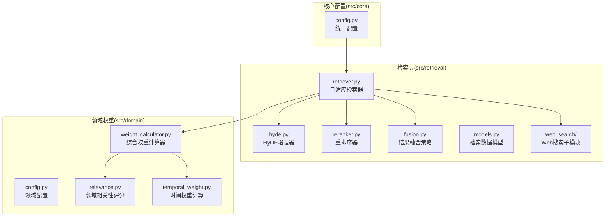
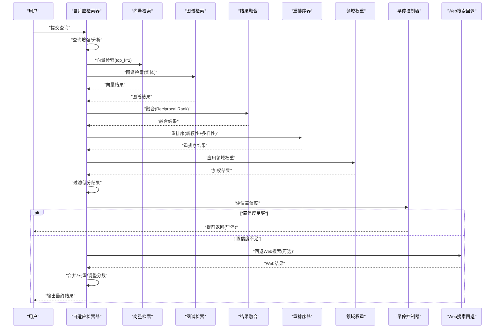
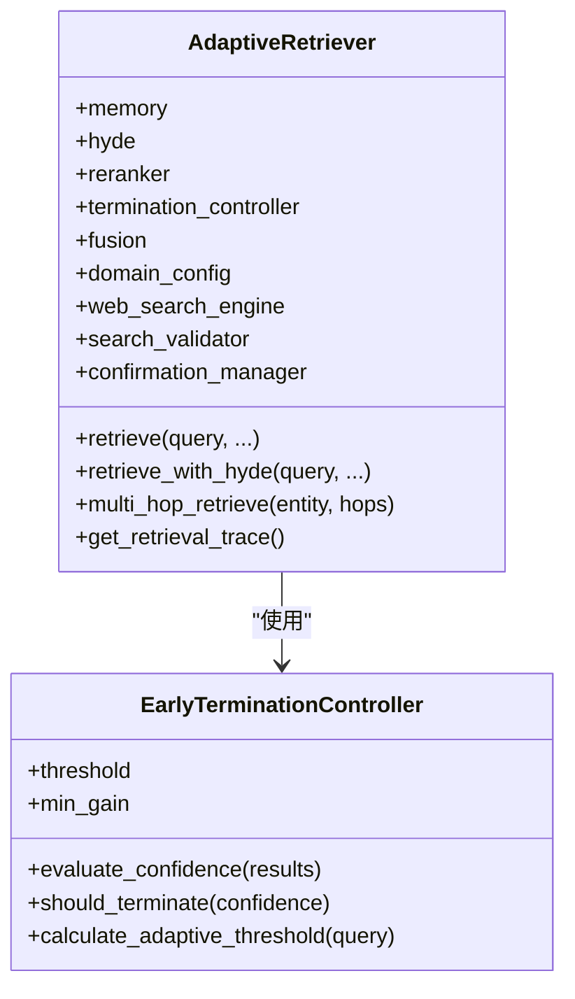
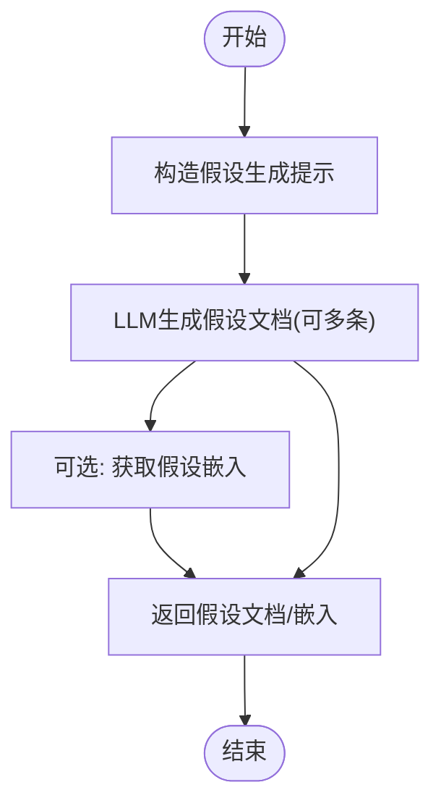
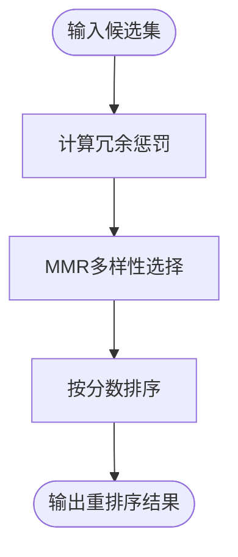
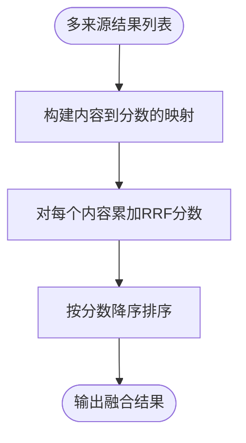
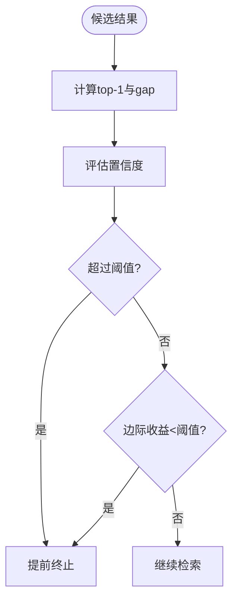
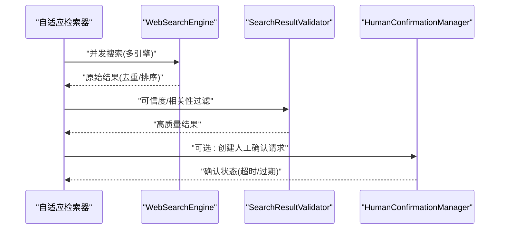
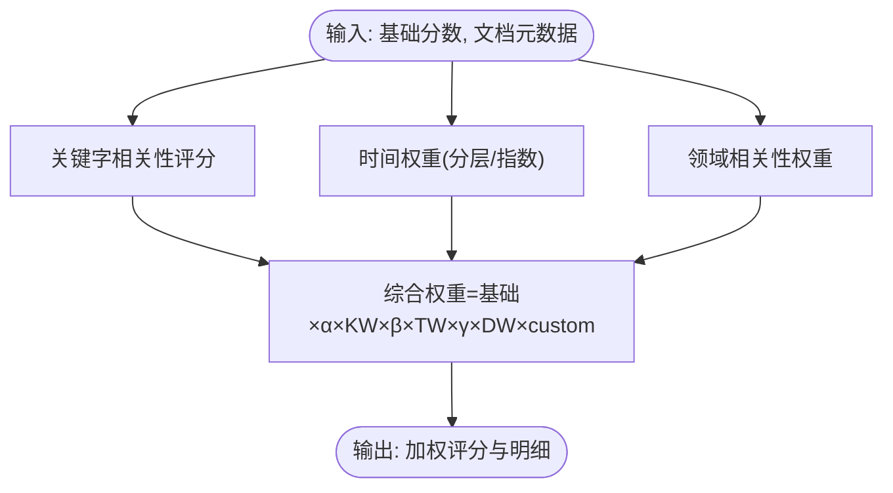
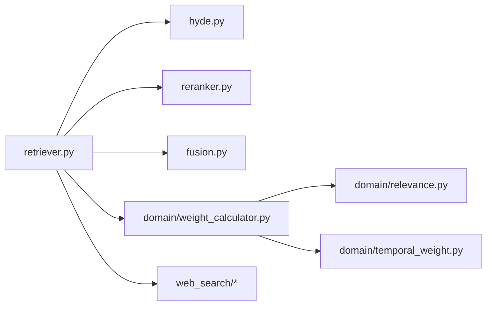

# 检索引擎模块

<cite>
**本文引用的文件**
- [retrieval/__init__.py](file://src/retrieval/__init__.py)
- [retrieval/retriever.py](file://src/retrieval/retriever.py)
- [retrieval/hyde.py](file://src/retrieval/hyde.py)
- [retrieval/reranker.py](file://src/retrieval/reranker.py)
- [retrieval/fusion.py](file://src/retrieval/fusion.py)
- [retrieval/models.py](file://src/retrieval/models.py)
- [retrieval/web_search/engine.py](file://src/retrieval/web_search/engine.py)
- [retrieval/web_search/models.py](file://src/retrieval/web_search/models.py)
- [retrieval/web_search/validator.py](file://src/retrieval/web_search/validator.py)
- [retrieval/web_search/confirmation.py](file://src/retrieval/web_search/confirmation.py)
- [domain/config.py](file://src/domain/config.py)
- [domain/weight_calculator.py](file://src/domain/weight_calculator.py)
- [domain/relevance.py](file://src/domain/relevance.py)
- [domain/temporal_weight.py](file://src/domain/temporal_weight.py)
- [core/config.py](file://src/core/config.py)
- [tests/test_retrieval/test_retriever.py](file://tests/test_retrieval/test_retriever.py)
</cite>

## 目录
1. [简介](#简介)
2. [项目结构](#项目结构)
3. [核心组件](#核心组件)
4. [架构总览](#架构总览)
5. [详细组件分析](#详细组件分析)
6. [依赖分析](#依赖分析)
7. [性能考量](#性能考量)
8. [故障排查指南](#故障排查指南)
9. [结论](#结论)
10. [附录](#附录)

## 简介
本文件面向检索引擎模块，系统性阐述基于扩散激活理论的混合检索算法、HyDE增强技术、Novelty重排序策略、多跳联想检索、早停机制与结果融合策略，并给出向量检索、图谱推理与全文搜索的集成方案、置信度计算方法与检索质量评估指标。同时覆盖Web搜索集成、跨模态检索的挑战与对策、配置参数说明、性能调优建议与典型应用场景，帮助开发者理解并扩展检索系统的优化策略。

## 项目结构
检索引擎模块位于 src/retrieval 目录下，围绕自适应检索器 AdaptiveRetriever 构建，集成了 HyDE 增强、重排序、结果融合、Web 搜索回退与人工确认、领域权重计算等能力。Web 搜索子模块独立封装，便于替换与扩展。

图表来源
- [retriever.py:135-644](file://src/retrieval/retriever.py#L135-L644)
- [hyde.py:17-213](file://src/retrieval/hyde.py#L17-L213)
- [reranker.py:11-186](file://src/retrieval/reranker.py#L11-L186)
- [fusion.py:9-128](file://src/retrieval/fusion.py#L9-L128)
- [models.py:9-29](file://src/retrieval/models.py#L9-L29)
- [web_search/engine.py:20-362](file://src/retrieval/web_search/engine.py#L20-L362)
- [domain/weight_calculator.py:56-318](file://src/domain/weight_calculator.py#L56-L318)
- [domain/config.py:54-129](file://src/domain/config.py#L54-L129)
- [domain/relevance.py:29-328](file://src/domain/relevance.py#L29-L328)
- [domain/temporal_weight.py:47-271](file://src/domain/temporal_weight.py#L47-L271)
- [core/config.py:160-193](file://src/core/config.py#L160-L193)

章节来源
- [retrieval/__init__.py:1-33](file://src/retrieval/__init__.py#L1-L33)
- [core/config.py:160-193](file://src/core/config.py#L160-L193)

## 核心组件
- 自适应检索器 AdaptiveRetriever：负责多路检索、结果融合、重排序、领域权重应用、早停控制与Web搜索回退。
- HyDE增强器 HyDEEnhancer：通过生成假设文档增强检索语义，提升召回质量。
- 重排序器 ReRanker：基于新颖性惩罚与多样性策略进行精排。
- 结果融合策略 FusionStrategy：支持RRF与加权融合，统一多源结果。
- Web搜索子系统：集成多引擎、结果验证、人工确认与缓存限流。
- 领域权重系统：关键字、时间与领域相关性三维度加权，形成综合评分。

章节来源
- [retriever.py:135-644](file://src/retrieval/retriever.py#L135-L644)
- [hyde.py:17-213](file://src/retrieval/hyde.py#L17-L213)
- [reranker.py:11-186](file://src/retrieval/reranker.py#L11-L186)
- [fusion.py:9-128](file://src/retrieval/fusion.py#L9-L128)
- [web_search/engine.py:20-362](file://src/retrieval/web_search/engine.py#L20-L362)
- [domain/weight_calculator.py:56-318](file://src/domain/weight_calculator.py#L56-L318)

## 架构总览
检索流程从查询输入开始，依次执行查询增强、多路检索（向量/图谱）、结果融合、重排序、领域权重应用、过滤与早停判断；若开启Web搜索且本地结果不足，则触发回退流程，合并并再次排序输出。

图表来源
- [retriever.py:224-308](file://src/retrieval/retriever.py#L224-L308)
- [retriever.py:500-546](file://src/retrieval/retriever.py#L500-L546)
- [fusion.py:18-70](file://src/retrieval/fusion.py#L18-L70)
- [reranker.py:42-77](file://src/retrieval/reranker.py#L42-L77)
- [domain/weight_calculator.py:81-146](file://src/domain/weight_calculator.py#L81-L146)
- [web_search/engine.py:112-186](file://src/retrieval/web_search/engine.py#L112-L186)

## 详细组件分析

### 自适应检索器 AdaptiveRetriever
- 多路检索：向量检索与图谱检索并行，结果统一进入融合阶段。
- 结果融合：采用倒数排名融合（RRF）统一不同来源的排序信号。
- 重排序：应用新颖性惩罚与多样性策略，抑制重复并提升覆盖。
- 领域权重：结合关键字、时间与领域相关性，计算综合权重并重排。
- 早停机制：基于置信度阈值与边际收益递减策略，避免冗余计算。
- Web搜索回退：当本地结果不足时，自动发起网络搜索并合并结果。

图表来源
- [retriever.py:135-182](file://src/retrieval/retriever.py#L135-L182)
- [retriever.py:43-133](file://src/retrieval/retriever.py#L43-L133)

章节来源
- [retriever.py:135-644](file://src/retrieval/retriever.py#L135-L644)

### HyDE增强技术
- 通过LLM生成假设性答案文档，模拟真实文档风格，提升检索语义表达。
- 支持多假设生成与嵌入获取，便于后续向量检索。
- 回退到规则生成，确保在无LLM时仍可运行。

图表来源
- [hyde.py:58-121](file://src/retrieval/hyde.py#L58-L121)

章节来源
- [hyde.py:17-213](file://src/retrieval/hyde.py#L17-L213)

### 重排序系统 ReRanker
- 新颖性惩罚：对与已选结果重复的内容施加惩罚，降低冗余。
- 多样性策略：基于MMR思想选择相关性高且与已选差异大的候选。
- 相似度计算：采用Jaccard相似度衡量文本重复度。

图表来源
- [reranker.py:79-160](file://src/retrieval/reranker.py#L79-L160)

章节来源
- [reranker.py:11-186](file://src/retrieval/reranker.py#L11-L186)

### 结果融合策略 FusionStrategy
- RRF：对同一内容在不同来源中的排名取倒数并求和，再按分数排序。
- 加权融合：对不同来源结果按权重累加分数，适合已知来源重要性的情况。

图表来源
- [fusion.py:18-70](file://src/retrieval/fusion.py#L18-L70)

章节来源
- [fusion.py:9-128](file://src/retrieval/fusion.py#L9-L128)

### 多跳联想检索
- 基于情景图谱的多跳查询，返回路径强度与节点序列，便于溯源与可视化。
- 当前图谱检索实现为空，保留扩展接口以接入实际图数据库。

章节来源
- [retriever.py:390-422](file://src/retrieval/retriever.py#L390-L422)

### 早停机制 EarlyTerminationController
- 置信度评估：基于top-1分数与分数差距，结合结果数量进行缩放。
- 终止策略：固定阈值与边际收益递减双策略，支持自适应阈值随查询长度变化。

图表来源
- [retriever.py:68-114](file://src/retrieval/retriever.py#L68-L114)

章节来源
- [retriever.py:43-133](file://src/retrieval/retriever.py#L43-L133)

### Web搜索集成
- 多引擎聚合：支持Google、Bing、DuckDuckGo，异步并发搜索并去重。
- 结果验证：可信度与相关性双重阈值过滤，域名信誉与内容质量检查。
- 人工确认：提供确认请求生命周期管理，支持超时处理与回调。
- 缓存与限流：基于内存缓存与每分钟请求数限制，提升稳定性与合规性。

图表来源
- [retriever.py:548-602](file://src/retrieval/retriever.py#L548-L602)
- [web_search/engine.py:112-186](file://src/retrieval/web_search/engine.py#L112-L186)
- [web_search/validator.py:56-90](file://src/retrieval/web_search/validator.py#L56-L90)
- [web_search/confirmation.py:58-95](file://src/retrieval/web_search/confirmation.py#L58-L95)

章节来源
- [web_search/engine.py:20-362](file://src/retrieval/web_search/engine.py#L20-L362)
- [web_search/models.py:22-83](file://src/retrieval/web_search/models.py#L22-L83)
- [web_search/validator.py:17-352](file://src/retrieval/web_search/validator.py#L17-L352)
- [web_search/confirmation.py:17-391](file://src/retrieval/web_search/confirmation.py#L17-L391)

### 领域权重系统
- 综合权重公式：综合基础相似度与关键字、时间、领域权重，辅以自定义权重。
- 关键字权重：基于领域配置的关键字等级与别名，计算关键字得分与密度。
- 时间权重：分层权重或指数衰减，支持常青内容豁免。
- 领域相关性：根据关键字得分与密度判定领域等级并映射权重乘数。

图表来源
- [domain/weight_calculator.py:81-146](file://src/domain/weight_calculator.py#L81-L146)
- [domain/relevance.py:198-241](file://src/domain/relevance.py#L198-L241)
- [domain/temporal_weight.py:160-195](file://src/domain/temporal_weight.py#L160-L195)

章节来源
- [domain/config.py:54-129](file://src/domain/config.py#L54-L129)
- [domain/weight_calculator.py:56-318](file://src/domain/weight_calculator.py#L56-L318)
- [domain/relevance.py:29-328](file://src/domain/relevance.py#L29-L328)
- [domain/temporal_weight.py:47-271](file://src/domain/temporal_weight.py#L47-L271)

## 依赖分析
- 模块内聚：检索器内部组合 HyDE、重排序、融合、领域权重与Web搜索组件，职责清晰。
- 外部依赖：Web搜索依赖第三方API密钥配置；领域权重依赖领域配置与时间权重模块。
- 可能的循环依赖：当前未见循环导入；Web搜索子模块独立，便于替换。

图表来源
- [retriever.py:14-24](file://src/retrieval/retriever.py#L14-L24)
- [domain/weight_calculator.py:11-14](file://src/domain/weight_calculator.py#L11-L14)

章节来源
- [retriever.py:135-182](file://src/retrieval/retriever.py#L135-L182)
- [domain/weight_calculator.py:56-80](file://src/domain/weight_calculator.py#L56-L80)

## 性能考量
- 并发与缓存：Web搜索采用异步并发与内存缓存，减少重复请求与网络开销。
- 早停策略：通过置信度阈值与边际收益递减显著减少重排序与领域权重计算成本。
- 融合与重排序：RRF与MMR策略在精度与多样性间平衡，建议根据业务调参。
- 向量与图谱：向量检索建议使用高效向量库，图谱检索建议预热热点实体邻接表。
- 领域权重：批处理与缓存关键词匹配结果可降低重复计算。

## 故障排查指南
- Web搜索失败：检查API密钥配置、速率限制与缓存命中；查看验证器过滤日志。
- 结果重复：确认去重策略与相似度阈值；检查内容哈希生成逻辑。
- 早停过早：调整置信度阈值与最小边际收益；对短查询使用自适应阈值。
- 领域权重异常：核对关键字权重范围与领域等级映射；检查时间衰减配置。

章节来源
- [web_search/validator.py:56-90](file://src/retrieval/web_search/validator.py#L56-L90)
- [web_search/engine.py:72-100](file://src/retrieval/web_search/engine.py#L72-L100)
- [retriever.py:94-114](file://src/retrieval/retriever.py#L94-L114)
- [domain/weight_calculator.py:103-129](file://src/domain/weight_calculator.py#L103-L129)

## 结论
检索引擎模块通过多路检索、融合、重排序与领域权重的协同，实现了高召回与高精度的平衡；HyDE增强与Web搜索回退进一步提升了复杂查询的覆盖与实时性；早停机制有效降低了计算成本。建议在生产环境中结合业务场景对阈值与权重进行调优，并持续完善图谱检索与跨模态能力。

## 附录

### 配置参数说明（检索层）
- default_top_k：默认返回数量
- vector_weight/graph_weight：向量与图谱来源权重（融合时使用）
- enable_early_termination/confidence_threshold/min_results：早停开关与阈值
- enable_hyde/hyde_temperature：HyDE开关与生成温度
- enable_rerank/rerank_top_k/novelty_penalty：重排序开关、TopK与新颖性惩罚
- enable_web_search/web_search_min_results/web_search_max_results/web_search_confidence_threshold：Web搜索开关与回退阈值
- confirmation_timeout/search_engines：人工确认超时与搜索引擎列表

章节来源
- [core/config.py:160-193](file://src/core/config.py#L160-L193)

### 置信度与评估指标
- 置信度：基于top-1分数与分数差距，结合结果数量进行缩放。
- 评估指标：可基于检索任务定义Precision@K、Recall@K、NDCG、MRR等，结合领域权重与重排序效果进行对比。

章节来源
- [retriever.py:68-92](file://src/retrieval/retriever.py#L68-L92)

### 测试要点
- 早停控制器：默认阈值、边际收益递减、自适应阈值。
- 检索器：基本检索、TopK、最低分数过滤、查询向量、检索追踪。
- 多跳检索：返回类型与追踪记录。
- 边界情况：空查询、超长查询、Unicode查询、TopK=0、负最低分数。

章节来源
- [tests/test_retrieval/test_retriever.py:19-410](file://tests/test_retrieval/test_retriever.py#L19-L410)