# 检索引擎模块

<cite>
**本文引用的文件**
- [src/retrieval/__init__.py](file://src/retrieval/__init__.py)
- [src/retrieval/retriever.py](file://src/retrieval/retriever.py)
- [src/retrieval/hyde.py](file://src/retrieval/hyde.py)
- [src/retrieval/reranker.py](file://src/retrieval/reranker.py)
- [src/retrieval/fusion.py](file://src/retrieval/fusion.py)
- [src/retrieval/models.py](file://src/retrieval/models.py)
- [src/retrieval/smart_routing/engine.py](file://src/retrieval/smart_routing/engine.py)
- [src/retrieval/smart_routing/intent_router.py](file://src/retrieval/smart_routing/intent_router.py)
- [src/retrieval/smart_routing/strategy_fusion.py](file://src/retrieval/smart_routing/strategy_fusion.py)
- [src/retrieval/smart_routing/early_stopping.py](file://src/retrieval/smart_routing/early_stopping.py)
- [src/retrieval/smart_routing/example_usage.py](file://src/retrieval/smart_routing/example_usage.py)
- [src/memory/manager.py](file://src/memory/manager.py)
- [src/memory/semantic_memory.py](file://src/memory/semantic_memory.py)
- [src/memory/episodic_graph.py](file://src/memory/episodic_graph.py)
- [src/domain/config.py](file://src/domain/config.py)
- [src/domain/weight_calculator.py](file://src/domain/weight_calculator.py)
- [src/response/visualizer.py](file://src/response/visualizer.py)
- [src/perception/engine.py](file://src/perception/engine.py)
- [src/core/llm/base.py](file://src/core/llm/base.py)
- [src/core/llm/mock.py](file://src/core/llm/mock.py)
- [src/retrieval/README.md](file://src/retrieval/README.md)
- [wiki/wiki/检索引擎模块/检索引擎模块.md](file://wiki/wiki/检索引擎模块/检索引擎模块.md)
- [wiki/wiki/检索引擎模块/自适应检索算法.md](file://wiki/wiki/检索引擎模块/自适应检索算法.md)
- [wiki/wiki/检索引擎模块/HyDE增强技术.md](file://wiki/wiki/检索引擎模块/HyDE增强技术.md)
- [design/SMART_ROUTING_FUSION_ENGINE.md](file://design/SMART_ROUTING_FUSION_ENGINE.md)
</cite>

## 目录
1. [简介](#简介)
2. [项目结构](#项目结构)
3. [核心组件](#核心组件)
4. [架构总览](#架构总览)
5. [详细组件分析](#详细组件分析)
6. [依赖分析](#依赖分析)
7. [性能考量](#性能考量)
8. [故障排查指南](#故障排查指南)
9. [结论](#结论)
10. [附录](#附录)

## 简介
本模块围绕“自适应检索”构建，融合多路检索、结果融合、重排序、早停机制与 HyDE 增强，并引入扩散激活理论支持联想检索与路径发现。模块同时提供检索路径追踪与可视化能力，便于用户理解检索过程。此外，模块与记忆层紧密集成，支持向量检索、图谱检索与领域权重计算，形成从感知、记忆到检索的闭环。

## 项目结构
检索引擎位于 src/retrieval 目录，核心文件包括：
- 检索器：AdaptiveRetriever（主流程编排）
- 增强器：HyDEEnhancer（假设文档嵌入）
- 重排序器：ReRanker（新颖性惩罚与多样性）
- 融合策略：FusionStrategy（RRF/加权融合）
- 数据模型：RetrievalResult、QueryAnalysis
- 与记忆层集成：MemoryManager、SemanticMemory、EpisodicGraph
- 领域权重：DomainConfig、CompositeWeightCalculator
- 可视化：ThinkingChainVisualizer
- 感知与编码：PerceptionEngine（为检索提供向量与实体）

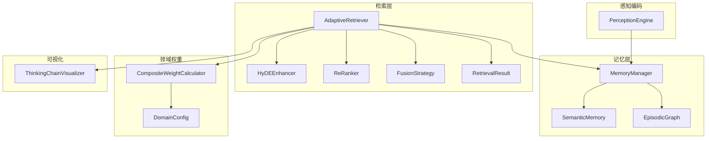

图表来源
- [src/retrieval/retriever.py:122-440](file://src/retrieval/retriever.py#L122-L440)
- [src/retrieval/hyde.py:17-213](file://src/retrieval/hyde.py#L17-L213)
- [src/retrieval/reranker.py:10-179](file://src/retrieval/reranker.py#L10-L179)
- [src/retrieval/fusion.py:9-128](file://src/retrieval/fusion.py#L9-L128)
- [src/retrieval/models.py:9-29](file://src/retrieval/models.py#L9-L29)
- [src/memory/manager.py:16-195](file://src/memory/manager.py#L16-L195)
- [src/memory/semantic_memory.py:21-179](file://src/memory/semantic_memory.py#L21-L179)
- [src/memory/episodic_graph.py:10-194](file://src/memory/episodic_graph.py#L10-L194)
- [src/domain/config.py:54-285](file://src/domain/config.py#L54-L285)
- [src/domain/weight_calculator.py:56-318](file://src/domain/weight_calculator.py#L56-L318)
- [src/response/visualizer.py:9-150](file://src/response/visualizer.py#L9-L150)
- [src/perception/engine.py:15-174](file://src/perception/engine.py#L15-L174)

章节来源
- [src/retrieval/__init__.py:1-19](file://src/retrieval/__init__.py#L1-L19)
- [src/retrieval/README.md:1-352](file://src/retrieval/README.md#L1-L352)

## 核心组件
- AdaptiveRetriever：主检索编排器，负责查询分析、多路检索、结果融合、重排序、领域权重应用、早停判断与多跳检索。
- HyDEEnhancer：生成假设文档并可提供向量表示，增强模糊查询的检索效果。
- ReRanker：对候选结果进行新颖性惩罚与多样性保证，提升排序质量。
- FusionStrategy：提供 RRF 与加权融合策略，整合多路检索结果。
- RetrievalResult/QueryAnalysis：检索结果与查询分析的数据模型。
- MemoryManager/SemanticMemory/EpisodicGraph：记忆层支撑，提供向量检索与图谱多跳。
- DomainConfig/CompositeWeightCalculator：领域配置与综合权重计算，结合关键字、时间与领域相关性。
- ThinkingChainVisualizer：检索路径、证据来源与推理过程的可视化输出。
- PerceptionEngine：文档解析、分块与向量化编码，为检索提供高质量输入。
- StrategyFusionEngine（智能路由）：v3.3.0-alpha 新增，整合意图识别、用户画像与策略融合，提供统一的智能路由决策接口。
- IntentRouter：基于语义意图分类系统，将查询路由到对应的策略模板。
- StrategyFusion：多策略并行检索与结果融合。
- EarlyStoppingManager：早停与降级机制，平衡效果和延迟。
- CoTController：思维链推理的智能触发与深度调节。

章节来源
- [src/retrieval/retriever.py:122-440](file://src/retrieval/retriever.py#L122-L440)
- [src/retrieval/hyde.py:17-213](file://src/retrieval/hyde.py#L17-L213)
- [src/retrieval/reranker.py:10-179](file://src/retrieval/reranker.py#L10-L179)
- [src/retrieval/fusion.py:9-128](file://src/retrieval/fusion.py#L9-L128)
- [src/retrieval/models.py:9-29](file://src/retrieval/models.py#L9-L29)
- [src/memory/manager.py:16-195](file://src/memory/manager.py#L16-L195)
- [src/memory/semantic_memory.py:21-179](file://src/memory/semantic_memory.py#L21-L179)
- [src/memory/episodic_graph.py:10-194](file://src/memory/episodic_graph.py#L10-L194)
- [src/domain/config.py:54-285](file://src/domain/config.py#L54-L285)
- [src/domain/weight_calculator.py:56-318](file://src/domain/weight_calculator.py#L56-L318)
- [src/response/visualizer.py:9-150](file://src/response/visualizer.py#L9-L150)
- [src/perception/engine.py:15-174](file://src/perception/engine.py#L15-L174)
- [src/retrieval/smart_routing/engine.py:34-274](file://src/retrieval/smart_routing/engine.py#L34-L274)
- [src/retrieval/smart_routing/intent_router.py:91-278](file://src/retrieval/smart_routing/intent_router.py#L91-L278)
- [src/retrieval/smart_routing/strategy_fusion.py:43-349](file://src/retrieval/smart_routing/strategy_fusion.py#L43-L349)
- [src/retrieval/smart_routing/early_stopping.py:39-326](file://src/retrieval/smart_routing/early_stopping.py#L39-L326)

## 架构总览
检索引擎采用“多路并行检索 + 结果融合 + 精排 + 早停”的流水线式架构。HyDE 增强与领域权重作为可插拔模块融入主流程；记忆层提供向量与图谱两种检索通道；可视化模块贯穿全程，帮助用户理解检索路径与证据来源。

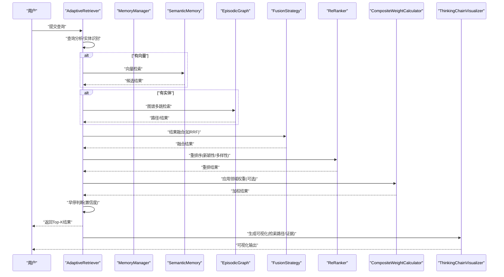

图表来源
- [src/retrieval/retriever.py:177-253](file://src/retrieval/retriever.py#L177-L253)
- [src/retrieval/fusion.py:18-70](file://src/retrieval/fusion.py#L18-L70)
- [src/retrieval/reranker.py:41-70](file://src/retrieval/reranker.py#L41-L70)
- [src/domain/weight_calculator.py:81-146](file://src/domain/weight_calculator.py#L81-L146)
- [src/response/visualizer.py:37-71](file://src/response/visualizer.py#L37-L71)

## 详细组件分析

### AdaptiveRetriever（自适应检索器）
- 查询增强与分析：可选地识别领域关键字并提升查询权重；记录查询类型与复杂度。
- 多路检索：向量检索（基于语义记忆）、图谱检索（基于情景图谱），HyDE 增强检索（可选）。
- 结果融合：支持 RRF 与加权融合，统一不同来源的排序信号。
- 重排序：新颖性惩罚抑制重复，多样性保证提升覆盖度。
- 领域权重：基于关键字、时间与领域相关性综合加权，更新结果分数与元数据。
- 早停机制：基于置信度阈值与边际收益递减策略，快速终止冗余计算。
- 多跳检索：基于扩散激活理论，沿关系边传播激活值，发现路径与关联实体。
- 可视化追踪：记录检索步骤，便于调试与用户理解。

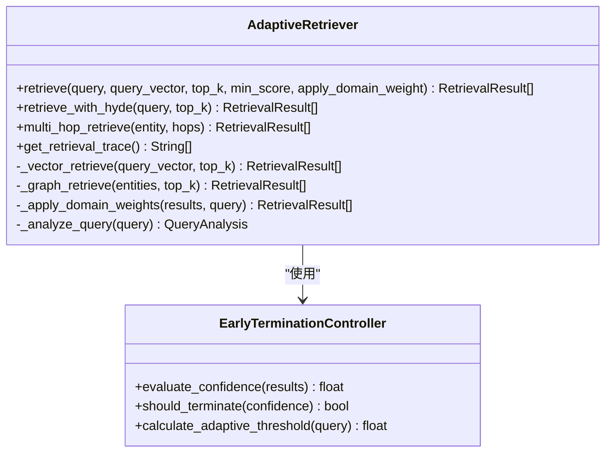

图表来源
- [src/retrieval/retriever.py:30-120](file://src/retrieval/retriever.py#L30-L120)
- [src/retrieval/retriever.py:122-440](file://src/retrieval/retriever.py#L122-L440)

章节来源
- [src/retrieval/retriever.py:122-440](file://src/retrieval/retriever.py#L122-L440)

### HyDEEnhancer（假设文档嵌入增强）
- 生成假设文档：通过 LLM 生成与查询相关的假设性答案，或回退到规则模板。
- 多假设生成：支持多变体生成以提升多样性。
- 向量表示：可直接获取假设文档的嵌入向量，用于后续检索。
- 查询增强：返回原始查询与若干假设组成的查询集合，提升检索覆盖面。

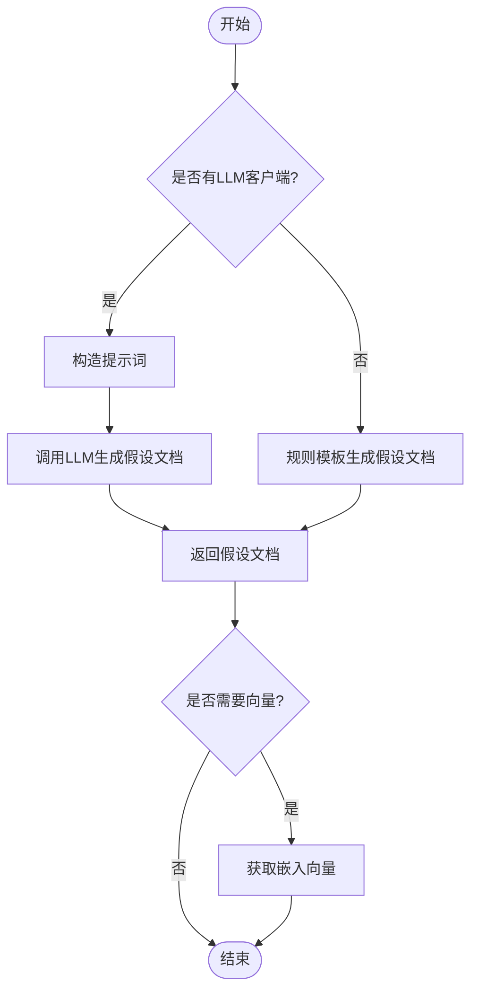

图表来源
- [src/retrieval/hyde.py:58-142](file://src/retrieval/hyde.py#L58-L142)

章节来源
- [src/retrieval/hyde.py:17-213](file://src/retrieval/hyde.py#L17-L213)

### ReRanker（重排序器）
- 新颖性惩罚：计算候选与已选结果的重复度，按比例降低分数，抑制冗余。
- 多样性保证：采用类似 MMR 的贪心策略，最大化相关性与最小化最大相似度的折衷。
- 相似度计算：当前实现为 Jaccard 相似度，未来可替换为更精确的度量。

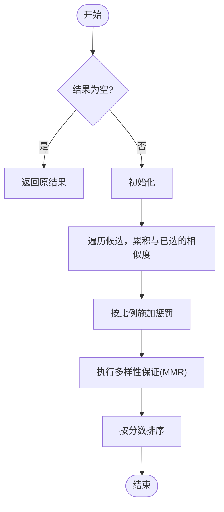

图表来源
- [src/retrieval/reranker.py:41-154](file://src/retrieval/reranker.py#L41-L154)

章节来源
- [src/retrieval/reranker.py:10-179](file://src/retrieval/reranker.py#L10-L179)

### FusionStrategy（结果融合策略）
- RRF：对同一文档在不同来源中的排名位置进行倒数加权求和，再按融合分数排序。
- 加权融合：按权重对各来源分数求和，适合不同来源的重要性差异。

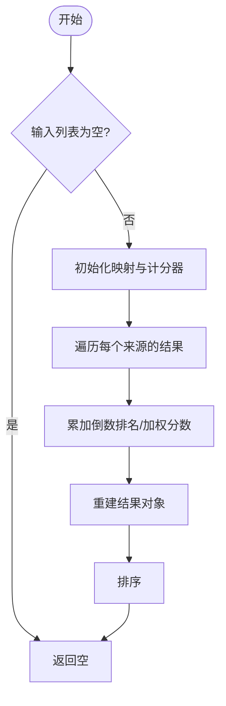

图表来源
- [src/retrieval/fusion.py:18-70](file://src/retrieval/fusion.py#L18-L70)
- [src/retrieval/fusion.py:72-127](file://src/retrieval/fusion.py#L72-L127)

章节来源
- [src/retrieval/fusion.py:9-128](file://src/retrieval/fusion.py#L9-L128)

### 扩散激活理论与多跳检索
- 理论基础：模拟联想记忆中的激活传播，激活值沿关系边衰减累计，形成路径强度。
- 实现方式：基于 EpisodicGraph 的 BFS/DFS 搜索，记录节点序列与边集合，计算路径强度。
- 应用场景：从起始实体出发，探索多跳关系，发现潜在关联与因果链条。

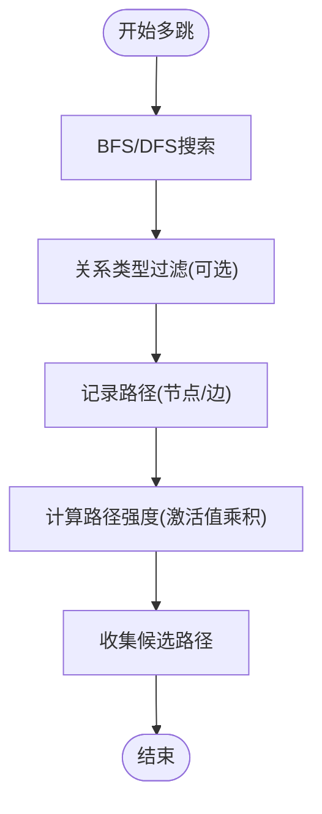

图表来源
- [src/memory/episodic_graph.py:71-126](file://src/memory/episodic_graph.py#L71-L126)

章节来源
- [src/memory/episodic_graph.py:10-194](file://src/memory/episodic_graph.py#L10-L194)

### 领域权重与扩散激活的结合
- 关键字权重：基于 DomainConfig 中的关键字等级与权重，衡量内容相关性。
- 时间权重：基于文档创建/更新时间与衰减系数，体现时效性。
- 领域权重：根据文档来源领域与相关性等级，动态调整权重倍数。
- 综合评分：将基础相似度与三类权重相乘，得到最终排序分数，并记录权重明细。

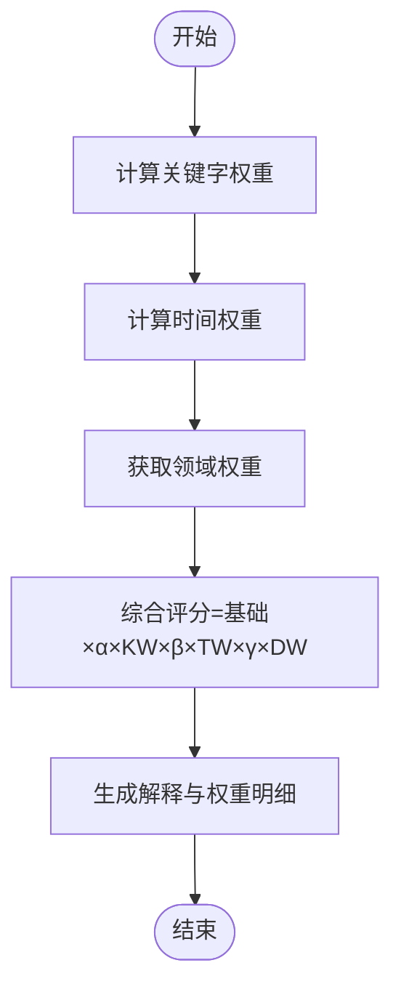

图表来源
- [src/domain/weight_calculator.py:81-146](file://src/domain/weight_calculator.py#L81-L146)
- [src/domain/config.py:54-161](file://src/domain/config.py#L54-L161)

章节来源
- [src/domain/weight_calculator.py:56-318](file://src/domain/weight_calculator.py#L56-L318)
- [src/domain/config.py:14-285](file://src/domain/config.py#L14-L285)

### 检索结果可视化与追踪
- 检索路径：记录每一步骤（查询分析、向量/图谱检索、融合、重排、领域权重、早停等）。
- 证据来源：展示每个结果的来源与相关度，便于溯源。
- 推理过程：在更高层的思维链模块中呈现，此处提供检索路径可视化。

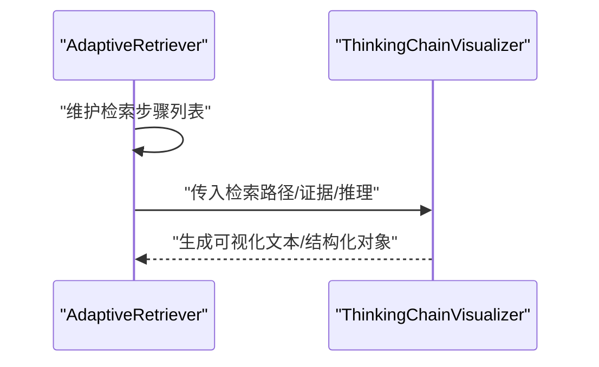

图表来源
- [src/retrieval/retriever.py:365-372](file://src/retrieval/retriever.py#L365-L372)
- [src/response/visualizer.py:37-150](file://src/response/visualizer.py#L37-L150)

章节来源
- [src/response/visualizer.py:9-150](file://src/response/visualizer.py#L9-L150)

### 智能路由引擎（v3.3.0-alpha 新增）
- 三层决策架构：意图识别层、用户画像层、策略融合层。
- 意图识别：基于语义意图分类系统，将查询路由到对应的策略模板。
- 用户画像：匹配用户专业度和偏好，动态调整策略权重。
- 策略融合：多策略并行执行与结果融合，支持多样性与新颖性控制。
- 早停与降级：平衡效果和延迟的智能决策，支持多维度早停判断与降级动作。
- CoT 推理：智能触发与深度调节，根据用户专业度自适应调整推理深度。

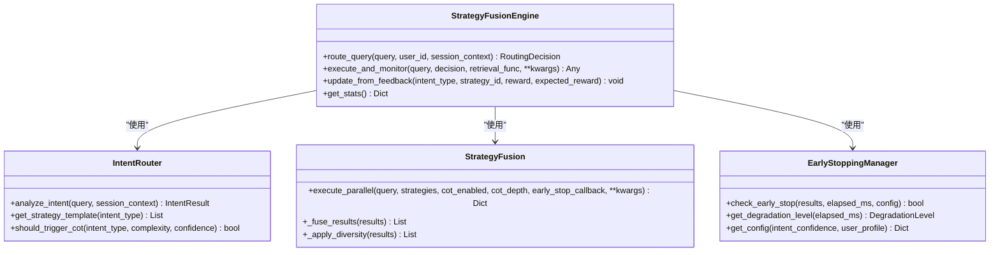

图表来源
- [src/retrieval/smart_routing/engine.py:34-274](file://src/retrieval/smart_routing/engine.py#L34-L274)
- [src/retrieval/smart_routing/intent_router.py:91-278](file://src/retrieval/smart_routing/intent_router.py#L91-L278)
- [src/retrieval/smart_routing/strategy_fusion.py:43-349](file://src/retrieval/smart_routing/strategy_fusion.py#L43-L349)
- [src/retrieval/smart_routing/early_stopping.py:39-326](file://src/retrieval/smart_routing/early_stopping.py#L39-L326)

章节来源
- [src/retrieval/smart_routing/engine.py:34-274](file://src/retrieval/smart_routing/engine.py#L34-L274)
- [src/retrieval/smart_routing/intent_router.py:91-278](file://src/retrieval/smart_routing/intent_router.py#L91-L278)
- [src/retrieval/smart_routing/strategy_fusion.py:43-349](file://src/retrieval/smart_routing/strategy_fusion.py#L43-L349)
- [src/retrieval/smart_routing/early_stopping.py:39-326](file://src/retrieval/smart_routing/early_stopping.py#L39-L326)

## 依赖分析
- 模块内聚：检索层内部职责清晰，HyDE、融合、重排、早停与多跳相互独立又可组合。
- 外部依赖：与记忆层（SemanticMemory、EpisodicGraph）耦合，与领域权重模块（DomainConfig、CompositeWeightCalculator）松耦合。
- 可视化与感知：与响应层可视化与感知编码解耦，通过数据模型对接。
- 智能路由：与意图分析、用户画像、策略融合、早停管理器等模块协同工作。

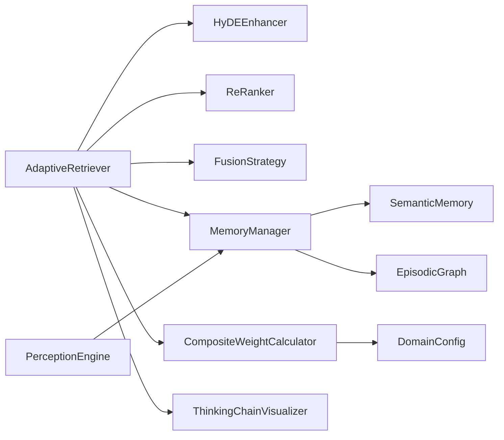

图表来源
- [src/retrieval/retriever.py:122-161](file://src/retrieval/retriever.py#L122-L161)
- [src/memory/manager.py:16-47](file://src/memory/manager.py#L16-L47)
- [src/domain/weight_calculator.py:56-80](file://src/domain/weight_calculator.py#L56-L80)
- [src/response/visualizer.py:9-36](file://src/response/visualizer.py#L9-L36)
- [src/perception/engine.py:15-71](file://src/perception/engine.py#L15-L71)

章节来源
- [src/retrieval/retriever.py:122-161](file://src/retrieval/retriever.py#L122-L161)
- [src/memory/manager.py:16-47](file://src/memory/manager.py#L16-L47)
- [src/domain/weight_calculator.py:56-80](file://src/domain/weight_calculator.py#L56-L80)
- [src/response/visualizer.py:9-36](file://src/response/visualizer.py#L9-L36)
- [src/perception/engine.py:15-71](file://src/perception/engine.py#L15-L71)

## 性能考量
- 早停机制：通过置信度阈值与边际收益递减策略，避免不必要的重排与领域权重计算，显著降低延迟。
- 并行处理：多路检索（向量/图谱/HyDE）可并行执行，融合与重排阶段亦可并行化。
- 缓存策略：建议缓存查询向量与常用实体的图谱路径；对领域权重中间结果进行短期缓存。
- 参数调优：
  - top_k：融合与重排前扩大采样，早停后截断。
  - novelty_weight/diversity_weight/redundancy_penalty：平衡新颖性与多样性。
  - confidence_threshold/min_gain：根据业务目标调整早停灵敏度。
- 向量检索优化：使用近似最近邻索引（如 HNSW）与向量数据库（如 Qdrant）替代纯内存实现，提升吞吐与延迟表现。
- 智能路由：通过多策略并行与早停机制，显著降低简单问题的延迟，复杂问题通过并行化保持延迟可控。

## 故障排查指南
- 检索路径追踪：通过检索器提供的追踪接口获取每一步骤，定位瓶颈（如融合前无结果、重排后分数异常等）。
- HyDE 未生效：确认 LLM 客户端可用；若不可用则回退到规则模板，需检查模板质量。
- 领域权重无效：确认 DomainConfig 正确加载且权重因子合理；检查文档元数据字段（创建时间、是否常青、来源领域）。
- 图谱检索为空：检查实体识别与图谱构建流程；确认关系类型过滤条件过于严格。
- 重排结果异常：检查相似度计算与惩罚参数；必要时简化策略或提高阈值。
- 智能路由异常：检查意图识别准确性、用户画像配置、策略权重设置与早停配置；通过 get_stats() 获取引擎统计信息进行诊断。

章节来源
- [src/retrieval/retriever.py:365-372](file://src/retrieval/retriever.py#L365-L372)
- [src/retrieval/hyde.py:172-213](file://src/retrieval/hyde.py#L172-L213)
- [src/domain/weight_calculator.py:103-146](file://src/domain/weight_calculator.py#L103-L146)
- [src/memory/episodic_graph.py:71-93](file://src/memory/episodic_graph.py#L71-L93)
- [src/retrieval/smart_routing/engine.py:266-274](file://src/retrieval/smart_routing/engine.py#L266-L274)

## 结论
本模块以"自适应检索"为核心，融合 HyDE 增强、扩散激活理论、领域权重与早停机制，形成高效、可解释、可扩展的检索体系。通过结果融合与重排序提升质量，借助可视化与追踪帮助用户理解检索过程。与记忆层与感知编码的集成，使系统具备从感知到检索的全链路能力。v3.3.0-alpha 新增的智能路由引擎进一步提升了系统的智能化水平，通过意图识别、用户画像与策略融合实现按需检索与个性化响应。

## 附录
- 使用示例与流程参考：检索层 README 提供了完整的使用流程与参数说明。
- 依赖组件：BGE-Reranker-v2、BGE-M3、Qdrant、Neo4j 等（详见 README）。
- 智能路由设计文档：详细描述了三层决策架构、策略融合机制与性能优化方案。
- 配置参数参考：HyDEEnhancer 的 temperature、num_hypotheses；ReRanker 的 novelty_weight、diversity_weight、redundancy_penalty；EarlyTerminationController 的 confidence_threshold、min_gain；智能路由的早停阈值与降级配置。

章节来源
- [src/retrieval/README.md:223-352](file://src/retrieval/README.md#L223-L352)
- [design/SMART_ROUTING_FUSION_ENGINE.md:1-646](file://design/SMART_ROUTING_FUSION_ENGINE.md#L1-L646)
- [wiki/wiki/检索引擎模块/检索引擎模块.md:408-412](file://wiki/wiki/检索引擎模块/检索引擎模块.md#L408-L412)