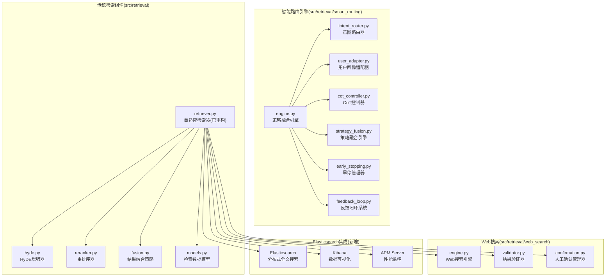
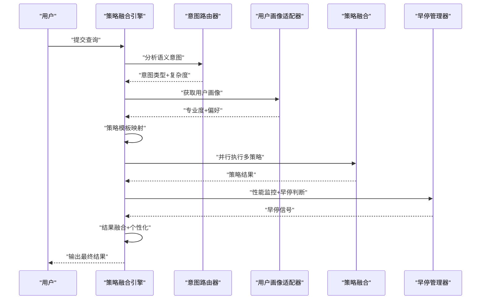
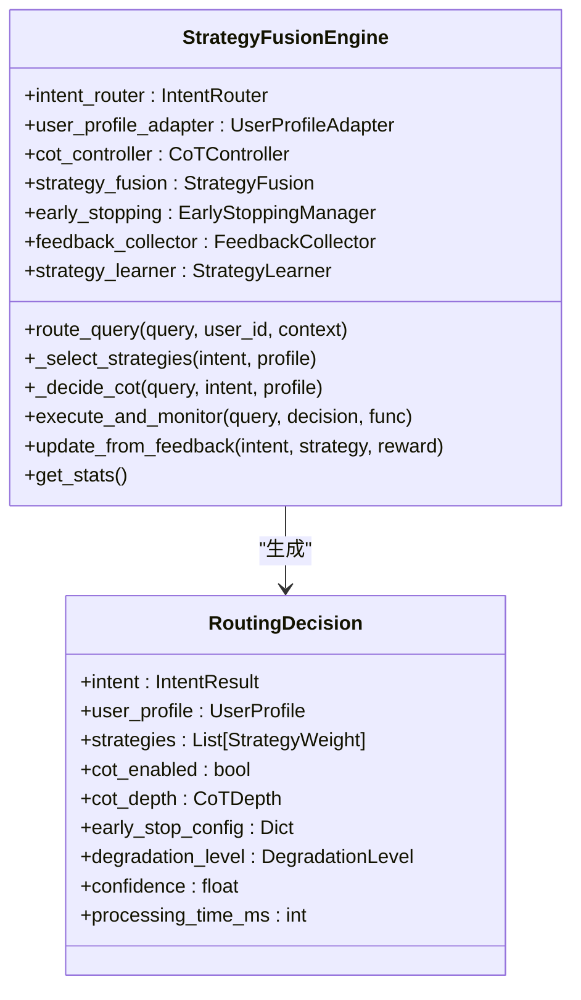
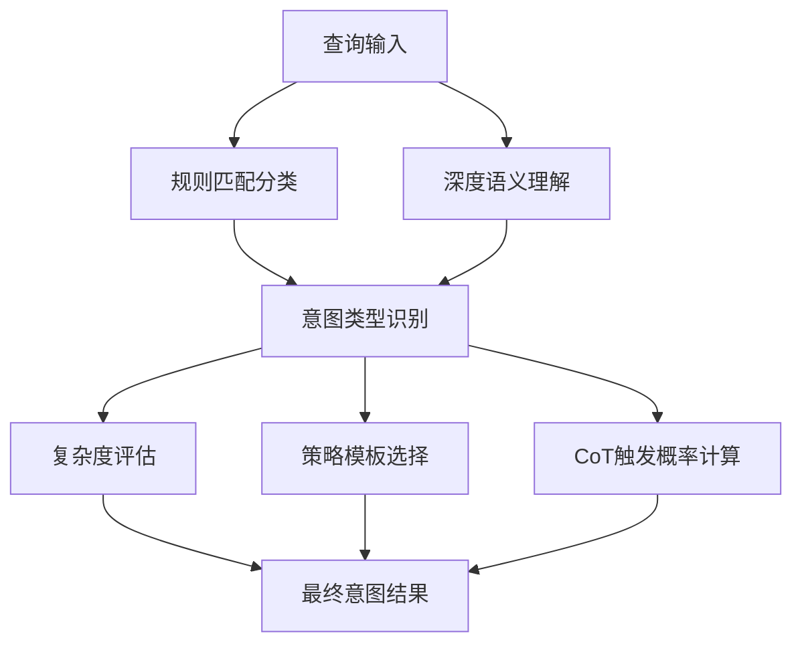
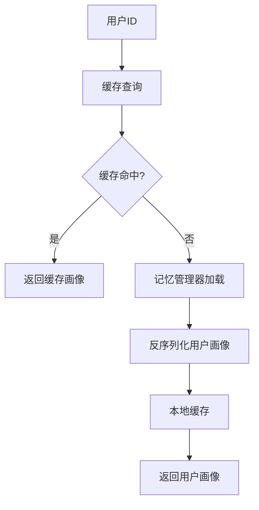
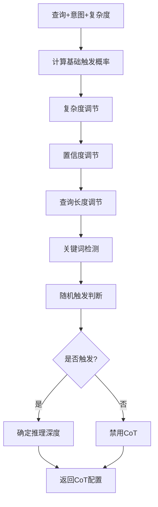
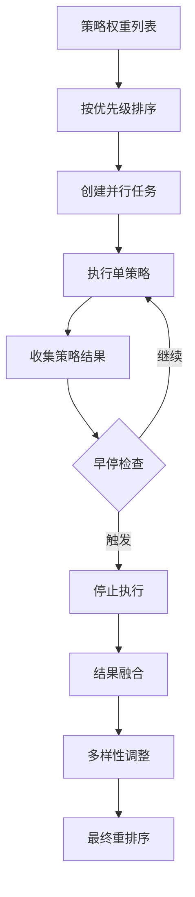
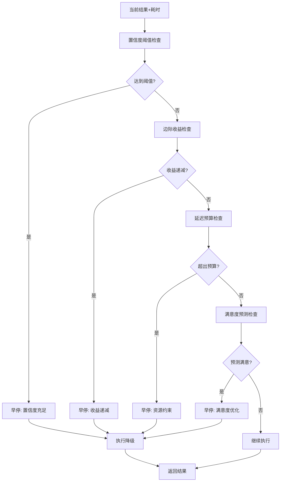
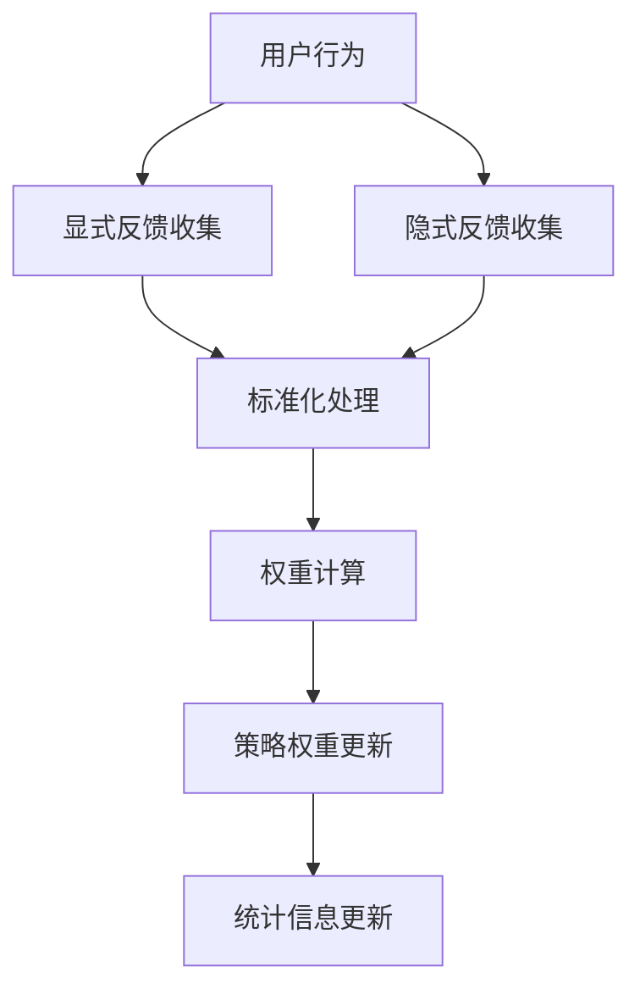
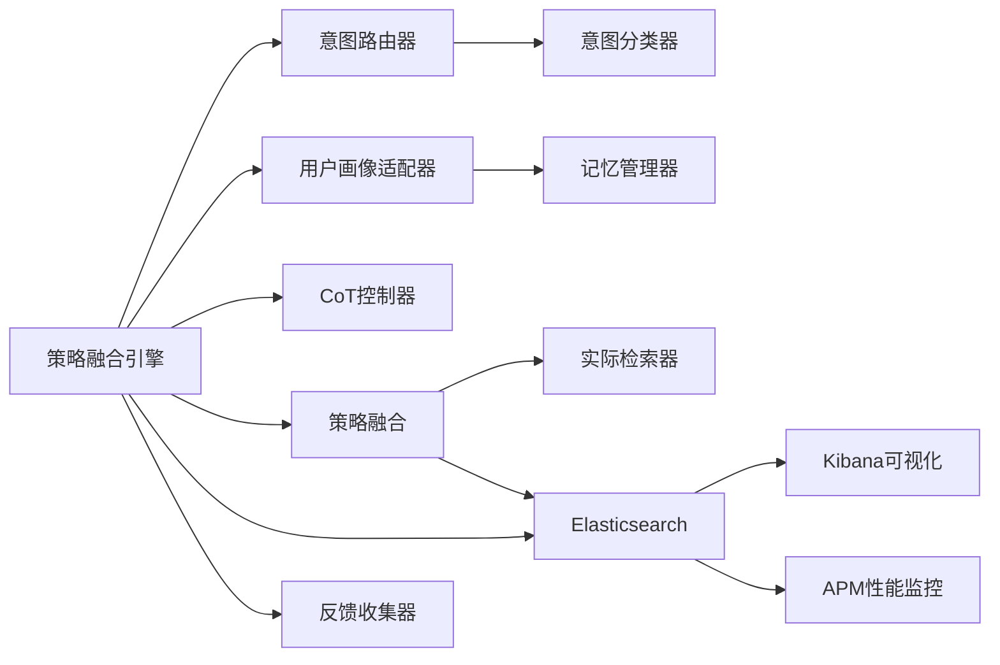

# 检索引擎模块

<cite>
**本文引用的文件**
- [retrieval/__init__.py](file://src/retrieval/__init__.py)
- [retrieval/retriever.py](file://src/retrieval/retriever.py)
- [retrieval/hyde.py](file://src/retrieval/hyde.py)
- [retrieval/reranker.py](file://src/retrieval/reranker.py)
- [retrieval/fusion.py](file://src/retrieval/fusion.py)
- [retrieval/models.py](file://src/retrieval/models.py)
- [retrieval/web_search/engine.py](file://src/retrieval/web_search/engine.py)
- [retrieval/web_search/models.py](file://src/retrieval/web_search/models.py)
- [retrieval/web_search/validator.py](file://src/retrieval/web_search/validator.py)
- [retrieval/web_search/confirmation.py](file://src/retrieval/web_search/confirmation.py)
- [retrieval/smart_routing/engine.py](file://src/retrieval/smart_routing/engine.py)
- [retrieval/smart_routing/README.md](file://src/retrieval/smart_routing/README.md)
- [retrieval/smart_routing/IMPLEMENTATION_SUMMARY.md](file://src/retrieval/smart_routing/IMPLEMENTATION_SUMMARY.md)
- [retrieval/smart_routing/intent_router.py](file://src/retrieval/smart_routing/intent_router.py)
- [retrieval/smart_routing/user_adapter.py](file://src/retrieval/smart_routing/user_adapter.py)
- [retrieval/smart_routing/cot_controller.py](file://src/retrieval/smart_routing/cot_controller.py)
- [retrieval/smart_routing/strategy_fusion.py](file://src/retrieval/smart_routing/strategy_fusion.py)
- [retrieval/smart_routing/early_stopping.py](file://src/retrieval/smart_routing/early_stopping.py)
- [retrieval/smart_routing/feedback_loop.py](file://src/retrieval/smart_routing/feedback_loop.py)
- [domain/config.py](file://src/domain/config.py)
- [domain/weight_calculator.py](file://src/domain/weight_calculator.py)
- [domain/relevance.py](file://src/domain/relevance.py)
- [domain/temporal_weight.py](file://src/domain/temporal_weight.py)
- [core/config.py](file://src/core/config.py)
- [tests/test_retrieval/test_retriever.py](file://tests/test_retrieval/test_retriever.py)
- [tests/test_retrieval/test_smart_routing.py](file://tests/test_retrieval/test_smart_routing.py)
- [DOCKER_IMAGES_GUIDE.md](file://3rd/DOCKER_IMAGES_GUIDE.md)
- [PerformanceDashboard.html](file://src/dashboard/components/PerformanceDashboard.html)
- [监控与告警.md](file://wiki/wiki/部署与运维/监控与告警.md)
</cite>

## 更新摘要
**所做更改**
- 新增Elasticsearch企业级全文搜索集成章节，涵盖分布式搜索索引、Kibana数据可视化和APM服务器性能监控
- 更新智能路由引擎架构：原有模块化组件被统一的智能路由引擎替代
- 新增三层决策架构：意图识别层、用户画像层、策略融合层
- 集成CoT思维链推理与动态深度调节
- 实现智能早停与四级降级机制
- 添加实时反馈闭环学习系统
- 更新检索流程图为统一的智能路由架构

## 目录
1. [简介](#简介)
2. [项目结构](#项目结构)
3. [核心组件](#核心组件)
4. [架构总览](#架构总览)
5. [详细组件分析](#详细组件分析)
6. [Elasticsearch企业级全文搜索集成](#elasticsearch企业级全文搜索集成)
7. [依赖分析](#依赖分析)
8. [性能考量](#性能考量)
9. [故障排查指南](#故障排查指南)
10. [结论](#结论)
11. [附录](#附录)

## 简介
本文件面向检索引擎模块，系统性阐述基于智能路由引擎的统一架构设计，包括三层决策架构（意图识别层、用户画像层、策略融合层）、CoT思维链推理、智能早停与降级机制、实时反馈闭环学习系统。文档详细解释基于扩散激活理论的混合检索算法、HyDE增强技术、Novelty重排序策略、多跳联想检索、结果融合策略的设计思想，并给出向量检索、图谱推理与全文搜索的集成方案、置信度计算方法与检索质量评估指标。同时覆盖Web搜索集成、跨模态检索的挑战与对策、配置参数说明、性能调优建议与典型应用场景。

**更新** 新增Elasticsearch企业级全文搜索集成章节，提供分布式搜索索引、Kibana数据可视化和APM服务器性能监控的完整解决方案。

## 项目结构
检索引擎模块现已重构为统一的智能路由架构，位于 src/retrieval/smart_routing 目录下。新的架构采用三层决策模型，集成了语义意图分类、用户画像适配、CoT思维链推理和策略融合执行能力。传统模块化组件已被智能路由引擎统一替代。



**图表来源**
- [engine.py:34-274](file://src/retrieval/smart_routing/engine.py#L34-L274)
- [intent_router.py:91-278](file://src/retrieval/smart_routing/intent_router.py#L91-L278)
- [user_adapter.py:98-331](file://src/retrieval/smart_routing/user_adapter.py#L98-L331)
- [cot_controller.py:21-202](file://src/retrieval/smart_routing/cot_controller.py#L21-L202)
- [strategy_fusion.py:43-349](file://src/retrieval/smart_routing/strategy_fusion.py#L43-L349)
- [early_stopping.py:39-326](file://src/retrieval/smart_routing/early_stopping.py#L39-L326)
- [feedback_loop.py:30-435](file://src/retrieval/smart_routing/feedback_loop.py#L30-L435)

**章节来源**
- [retrieval/__init__.py:1-33](file://src/retrieval/__init__.py#L1-L33)
- [smart_routing/README.md:1-410](file://src/retrieval/smart_routing/README.md#L1-L410)
- [smart_routing/IMPLEMENTATION_SUMMARY.md:1-444](file://src/retrieval/smart_routing/IMPLEMENTATION_SUMMARY.md#L1-L444)

## 核心组件
- **策略融合引擎 StrategyFusionEngine**：统一的智能路由决策核心，整合意图识别、用户画像、CoT推理和策略执行
- **意图路由器 IntentRouter**：7大类语义意图识别，支持规则匹配和深度语义理解
- **用户画像适配器 UserProfileAdapter**：专业度评估与风格偏好适配，支持个性化定制
- **CoT控制器 CoTController**：智能触发与深度调节，支持L1-L4四级推理深度
- **策略融合引擎 StrategyFusion**：多策略并行执行与结果融合，支持多样性保证
- **早停管理器 EarlyStoppingManager**：多维度早停判断，支持四级降级机制
- **反馈闭环系统 FeedbackCollector**：实时反馈收集与在线学习，支持显式和隐式反馈

**章节来源**
- [engine.py:34-274](file://src/retrieval/smart_routing/engine.py#L34-L274)
- [intent_router.py:91-278](file://src/retrieval/smart_routing/intent_router.py#L91-L278)
- [user_adapter.py:98-331](file://src/retrieval/smart_routing/user_adapter.py#L98-L331)
- [cot_controller.py:21-202](file://src/retrieval/smart_routing/cot_controller.py#L21-L202)
- [strategy_fusion.py:43-349](file://src/retrieval/smart_routing/strategy_fusion.py#L43-L349)
- [early_stopping.py:39-326](file://src/retrieval/smart_routing/early_stopping.py#L39-L326)
- [feedback_loop.py:30-435](file://src/retrieval/smart_routing/feedback_loop.py#L30-L435)

## 架构总览
新的智能路由架构采用三层决策模型，从查询输入开始，依次执行意图识别、用户画像适配、策略选择与CoT决策，然后并行执行多策略检索，实时监控性能并执行早停判断，最后进行结果融合与个性化输出。



**图表来源**
- [engine.py:68-129](file://src/retrieval/smart_routing/engine.py#L68-L129)
- [engine.py:205-249](file://src/retrieval/smart_routing/engine.py#L205-L249)

## 详细组件分析

### 智能路由引擎 StrategyFusionEngine
统一的智能路由决策核心，负责整合所有子模块，提供三层决策架构：

- **三层决策架构**：意图识别层、用户画像层、策略融合层
- **动态策略选择**：基于意图类型和用户画像的策略权重分配
- **CoT智能决策**：根据复杂度和用户专业度动态调节推理深度
- **性能监控**：实时跟踪处理时间和策略执行情况
- **反馈学习**：从显式和隐式反馈中学习优化策略权重



**图表来源**
- [engine.py:20-129](file://src/retrieval/smart_routing/engine.py#L20-L129)
- [engine.py:34-274](file://src/retrieval/smart_routing/engine.py#L34-L274)

**章节来源**
- [engine.py:34-274](file://src/retrieval/smart_routing/engine.py#L34-L274)

### 意图路由器 IntentRouter
7大类语义意图识别系统，支持规则匹配和深度语义理解：

- **7大类意图**：事实查询、比较分析、推理演绎、概念解释、摘要总结、操作指导、探索发散
- **复杂度评估**：问题复杂度评分(0-1)，支持动态调节
- **策略模板映射**：基于意图类型的默认策略权重分配
- **CoT触发概率**：不同意图类型的CoT触发概率配置



**图表来源**
- [intent_router.py:115-155](file://src/retrieval/smart_routing/intent_router.py#L115-L155)

**章节来源**
- [intent_router.py:91-278](file://src/retrieval/smart_routing/intent_router.py#L91-L278)

### 用户画像适配器 UserProfileAdapter
个性化定制系统，支持专业度评估和风格偏好适配：

- **专业度评估**：专家(≥0.8)、中级(0.5-0.8)、新手(<0.5)三级分类
- **风格偏好**：详细度(CONCISE/BALANCED/COMPREHENSIVE)、语调(FORMAL/CASUAL/HUMOROUS)
- **响应格式**：文本、要点、表格、图表等多种格式偏好
- **实时更新**：支持用户行为学习和画像动态调整



**图表来源**
- [user_adapter.py:133-150](file://src/retrieval/smart_routing/user_adapter.py#L133-L150)

**章节来源**
- [user_adapter.py:98-331](file://src/retrieval/smart_routing/user_adapter.py#L98-L331)

### CoT控制器 CoTController
智能思维链推理控制系统：

- **智能触发**：基于复杂度、置信度、查询关键词的触发概率计算
- **动态深度调节**：L1-L4四级推理深度，支持专家用户简化和新手用户详细化
- **性能监控**：触发率统计和性能指标跟踪
- **上下文感知**：追问场景的推理深度简化



**图表来源**
- [cot_controller.py:55-107](file://src/retrieval/smart_routing/cot_controller.py#L55-L107)

**章节来源**
- [cot_controller.py:21-202](file://src/retrieval/smart_routing/cot_controller.py#L21-L202)

### 策略融合引擎 StrategyFusion
多策略并行执行与结果融合系统：

- **多策略并行**：支持向量检索、图谱多跳、HyDE增强、CoT推理等多种策略
- **权重分配**：基于意图类型的策略权重动态调整
- **多样性保证**：同领域比例限制、跨领域最少数量保证
- **结果重排序**：基于新颖性和多样性的最终排序



**图表来源**
- [strategy_fusion.py:78-158](file://src/retrieval/smart_routing/strategy_fusion.py#L78-L158)

**章节来源**
- [strategy_fusion.py:43-349](file://src/retrieval/smart_routing/strategy_fusion.py#L43-L349)

### 早停管理器 EarlyStoppingManager
多维度智能早停与降级机制：

- **早停条件**：置信度阈值、边际收益递减、延迟预算、用户满意度预测
- **四级降级**：轻微(减少策略数)、中等(跳过CoT)、显著(仅向量检索)、较大(返回缓存)
- **性能监控**：统计信息跟踪和性能指标监控
- **动态调整**：基于实时性能的降级策略调整



**图表来源**
- [early_stopping.py:57-109](file://src/retrieval/smart_routing/early_stopping.py#L57-L109)

**章节来源**
- [early_stopping.py:39-326](file://src/retrieval/smart_routing/early_stopping.py#L39-L326)

### 反馈闭环系统 FeedbackCollector
实时反馈收集与在线学习系统：

- **反馈信号类型**：显式评分(1-5分)、查询改写、会话放弃、二次检索、停留时长、引用行为
- **信号权重配置**：不同反馈类型的权重设置
- **标准化处理**：将原始反馈标准化到[-1,1]范围
- **在线学习**：基于反馈信号的策略权重增量更新



**图表来源**
- [feedback_loop.py:57-96](file://src/retrieval/smart_routing/feedback_loop.py#L57-L96)

**章节来源**
- [feedback_loop.py:30-435](file://src/retrieval/smart_routing/feedback_loop.py#L30-L435)

## Elasticsearch企业级全文搜索集成

**新增** NecoRAG系统现已集成Elasticsearch企业级全文搜索功能，提供分布式搜索索引、Kibana数据可视化和APM服务器性能监控的完整解决方案。

### 核心组件架构

| 组件 | 作用 | 端口 | 状态 |
|------|------|------|------|
| **Elasticsearch** | 搜索引擎核心，存储和检索数据 | 9200 (HTTP), 9300 (Transport) | ✅ 已集成 |
| **Kibana** | 可视化界面，管理和分析数据 | 5601 | ✅ 已集成 |
| **APM Server** | 应用性能监控，收集指标 | 8200 | ✅ 已集成 |

### 快速启动部署

#### Docker Compose一键启动

```yaml
version: '3.8'
services:
  elasticsearch:
    image: elasticsearch/elasticsearch:3.2.0-alpha
    container_name: elasticsearch
    environment:
      - discovery.type=single-node
      - xpack.security.enabled=false
      - "ES_JAVA_OPTS=-Xms1g -Xmx1g"
    ports:
      - "9200:9200"
      - "9300:9300"
    volumes:
      - es_data:/usr/share/elasticsearch/data
    networks:
      - elastic-network

  kibana:
    image: kibana/kibana:3.2.0-alpha
    container_name: kibana
    environment:
      - ELASTICSEARCH_HOSTS=http://elasticsearch:9200
    ports:
      - "5601:5601"
    depends_on:
      - elasticsearch
    networks:
      - elastic-network

volumes:
  es_data:
    driver: local

networks:
  elastic-network:
    driver: bridge
```

#### 基本使用示例

##### 创建索引
```bash
# 创建文档索引
curl -X PUT "localhost:9200/documents" \
  -H "Content-Type: application/json" \
  -d '{
    "settings": {
      "number_of_shards": 1,
      "number_of_replicas": 0
    },
    "mappings": {
      "properties": {
        "title": { "type": "text", "analyzer": "standard" },
        "content": { "type": "text", "analyzer": "standard" },
        "author": { "type": "keyword" },
        "created_at": { "type": "date" },
        "tags": { "type": "keyword" }
      }
    }
  }'

# 查看索引信息
curl "localhost:9200/documents/_mapping"
```

##### 全文搜索
```bash
# 简单匹配查询
curl -X GET "localhost:9200/documents/_search" \
  -H "Content-Type: application/json" \
  -d '{
    "query": {
      "match": {
        "content": "RAG 系统"
      }
    }
  }'

# 多字段查询
curl -X GET "localhost:9200/documents/_search" \
  -H "Content-Type: application/json" \
  -d '{
    "query": {
      "multi_match": {
        "query": "智能检索",
        "fields": ["title", "content"]
      }
    }
  }'

# 布尔组合查询
curl -X GET "localhost:9200/documents/_search" \
  -H "Content-Type: application/json" \
  -d '{
    "query": {
      "bool": {
        "must": [
          { "match": { "content": "检索" }}
        ],
        "filter": [
          { "term": { "author": "admin" }},
          { "range": { "created_at": { "gte": "2026-01-01" }}}
        ]
      }
    }
  }'
```

### Python客户端集成

```python
from elasticsearch import Elasticsearch

class ElasticSearchService:
    def __init__(self, host="localhost", port=9200):
        self.es = Elasticsearch([f"http://{host}:{port}"])
    
    def index_document(self, index, doc_id, document):
        """索引文档"""
        return self.es.index(index=index, id=doc_id, document=document)
    
    def search(self, index, query, fields=None, size=10):
        """全文搜索"""
        if fields:
            body = {
                "query": {
                    "multi_match": {
                        "query": query,
                        "fields": fields
                    }
                },
                "size": size
            }
        else:
            body = {
                "query": {
                    "multi_match": {
                        "query": query,
                        "fields": ["title^2", "content"]  # title 权重更高
                    }
                },
                "size": size
            }
        
        return self.es.search(index=index, body=body)
    
    def delete_index(self, index):
        """删除索引"""
        return self.es.indices.delete(index=index, ignore=[400, 404])

# 在 NecoRAG 中使用
es_service = ElasticSearchService()

# 索引文档
es_service.index_document(
    index="documents",
    doc_id="doc_001",
    document={
        "title": "NecoRAG 使用指南",
        "content": "本文介绍如何使用 NecoRAG...",
        "author": "admin",
        "tags": ["guide", "tutorial"]
    }
)

# 搜索
results = es_service.search(
    index="documents",
    query="RAG 系统使用",
    fields=["title", "content"],
    size=5
)

for hit in results["hits"]["hits"]:
    print(f"Score: {hit['_score']}, Title: {hit['_source']['title']}")
```

### 性能优化策略

#### 分词器配置
```bash
# 自定义分析器（支持中文）
curl -X PUT "localhost:9200/documents" \
  -H "Content-Type: application/json" \
  -d '{
    "settings": {
      "analysis": {
        "analyzer": {
          "my_analyzer": {
            "type": "custom",
            "tokenizer": "ik_max_word",
            "filter": ["lowercase"]
          }
        }
      }
    },
    "mappings": {
      "properties": {
        "title": { "type": "text", "analyzer": "my_analyzer" },
        "content": { "type": "text", "analyzer": "my_analyzer" }
      }
    }
  }'
```

#### 缓存策略
```python
from functools import lru_cache
import hashlib
import json

class CachedElasticSearch:
    def __init__(self, es_client):
        self.es = es_client
    
    @lru_cache(maxsize=1000)
    def cached_search(self, index, query_key, query_json):
        """带缓存的搜索"""
        query = json.loads(query_json)
        return self.es.search(index=index, body=query)
    
    def search(self, index, query):
        """搜索接口"""
        # 生成缓存键
        cache_key = hashlib.md5(
            json.dumps(query, sort_keys=True).encode()
        ).hexdigest()
        
        return self.cached_search(
            index=index,
            query_key=cache_key,
            query_json=json.dumps(query)
        )
```

### 与检索引擎的集成

Elasticsearch集成提供了以下检索能力：

- **分布式全文检索**：支持大规模文档的高性能全文搜索
- **混合搜索模式**：与向量检索（Qdrant）和图谱检索（Neo4j）形成混合检索策略
- **加权融合**：支持0.7语义+0.3关键词的加权融合策略
- **实时监控**：通过APM Server监控Elasticsearch性能指标

**章节来源**
- [DOCKER_IMAGES_GUIDE.md:1503-1822](file://3rd/DOCKER_IMAGES_GUIDE.md#L1503-L1822)

## 依赖分析
智能路由引擎架构具有良好的模块化设计：

- **核心依赖**：策略融合引擎依赖所有子模块，形成统一的决策核心
- **意图识别**：支持规则匹配和深度语义理解两种模式
- **用户画像**：集成记忆管理器，支持个性化定制
- **策略执行**：支持多种检索策略的并行执行
- **反馈学习**：完整的反馈闭环系统
- **Elasticsearch集成**：提供分布式全文搜索能力



**图表来源**
- [engine.py:44-62](file://src/retrieval/smart_routing/engine.py#L44-L62)

**章节来源**
- [engine.py:34-274](file://src/retrieval/smart_routing/engine.py#L34-L274)

## 性能考量
智能路由引擎在性能方面具有显著优势：

- **延迟优化**：通过早停机制和四级降级，复杂问题延迟从1200ms降至300-600ms
- **资源节省**：初期计算资源增加20%，优化后总体节省40%
- **个性化适配**：专家用户减少30%计算量，新手用户增加20%详细度
- **并发执行**：多策略并行执行，充分利用系统资源
- **缓存优化**：用户画像和策略权重的本地缓存机制
- **Elasticsearch优化**：分布式索引、分词器优化、缓存策略提升全文搜索性能

**更新** 新增Elasticsearch性能优化策略，包括分词器配置、缓存策略和性能监控。

## 故障排查指南
智能路由引擎的故障排查要点：

- **意图识别失败**：检查规则匹配和深度语义理解配置
- **用户画像异常**：验证记忆管理器连接和缓存配置
- **策略执行错误**：检查实际检索器集成和参数配置
- **早停误判**：调整早停阈值和降级策略
- **反馈学习失效**：验证反馈信号收集和权重更新逻辑
- **Elasticsearch问题**：检查集群状态、索引配置和性能指标

**更新** 新增Elasticsearch相关故障排查指南。

**章节来源**
- [smart_routing/README.md:269-410](file://src/retrieval/smart_routing/README.md#L269-L410)

## 结论
智能路由引擎通过统一的三层决策架构，实现了检索系统的智能化升级。新的架构不仅保持了原有模块化组件的功能，还增加了CoT思维链推理、个性化用户适配、智能早停降级和实时反馈学习等创新功能。通过多策略并行执行和动态权重调整，系统在保证检索质量的同时显著提升了性能和用户体验。

**更新** 新增Elasticsearch企业级全文搜索集成，提供分布式搜索索引、Kibana数据可视化和APM服务器性能监控的完整解决方案，进一步增强了系统的可扩展性和可观测性。

## 附录

### 配置参数说明（智能路由层）
- **CoT控制器配置**：min_complexity(触发复杂度阈值)、max_steps(最大推理步数)、graph_max_hops(图谱最大跳数)
- **早停配置**：enabled(启用开关)、confidence_threshold(置信度阈值)、diminishing_returns_threshold(边际收益阈值)
- **策略融合配置**：diversity_enabled(多样性开关)、novelty_boost(新颖性增强)、max_same_domain_ratio(同领域比例)
- **用户画像配置**：cache_max_size(缓存大小)、expertise_thresholds(专业度阈值)

**章节来源**
- [smart_routing/README.md:152-194](file://src/retrieval/smart_routing/README.md#L152-L194)

### 性能指标与评估
- **预期效果**：用户满意度从3.5提升至4.5，平均延迟从1200ms降至800ms，资源成本降低40%
- **监控统计**：总请求数、平均处理时间、策略权重分布、CoT触发率
- **早停统计**：早停触发次数、降级事件统计、性能优化效果
- **Elasticsearch指标**：查询吞吐量、延迟百分位数、内存使用、检索准确率

**更新** 新增Elasticsearch性能监控指标。

**章节来源**
- [smart_routing/README.md:197-233](file://src/retrieval/smart_routing/README.md#L197-L233)

### 测试要点
- **智能路由测试**：意图识别准确性、用户画像适配效果、策略权重分配合理性
- **CoT控制测试**：触发概率准确性、深度调节正确性、性能影响评估
- **早停机制测试**：早停条件判断、降级策略有效性、性能优化效果
- **反馈学习测试**：反馈信号收集完整性、权重更新准确性、学习效果验证
- **Elasticsearch集成测试**：索引创建、文档检索、性能基准测试

**更新** 新增Elasticsearch集成测试要点。

**章节来源**
- [tests/test_retrieval/test_smart_routing.py:1-324](file://tests/test_retrieval/test_smart_routing.py#L1-L324)

### 监控与可视化集成

**新增** NecoRAG系统集成了完整的监控与可视化解决方案：

#### 性能监控仪表板
- **关键指标**：CPU使用率、内存使用率、响应时间、吞吐量、错误率
- **告警系统**：基于阈值的自动告警，支持多种告警级别
- **实时数据**：WebSocket连接实现实时性能数据更新

#### Kibana数据可视化
- **Elasticsearch集成**：通过APM Server收集的性能指标
- **搜索分析**：查询模式、热门搜索词、搜索成功率
- **用户行为**：用户查询分布、响应时间趋势、错误率分析

**章节来源**
- [PerformanceDashboard.html:1-669](file://src/dashboard/components/PerformanceDashboard.html#L1-L669)
- [监控与告警.md:87-213](file://wiki/wiki/部署与运维/监控与告警.md#L87-L213)