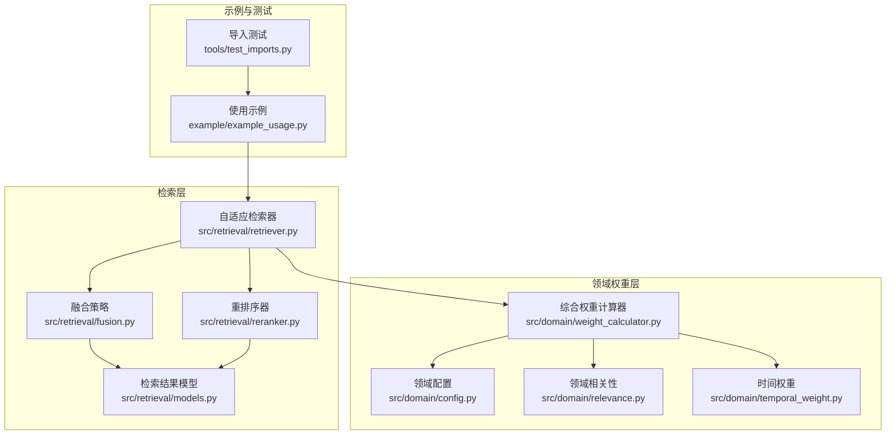
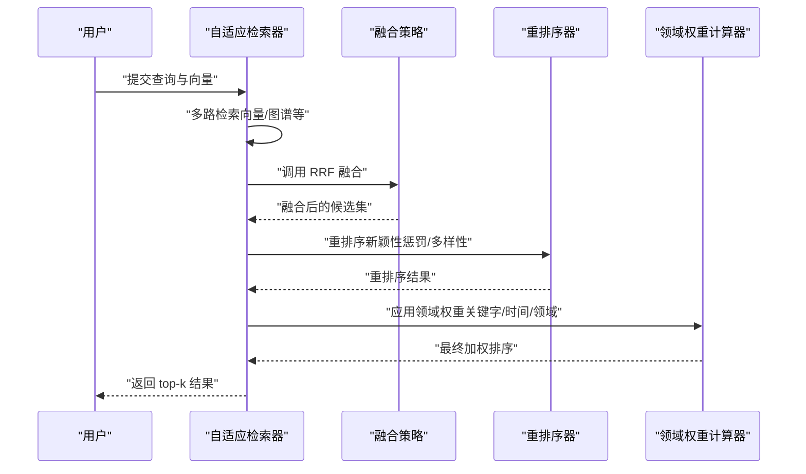
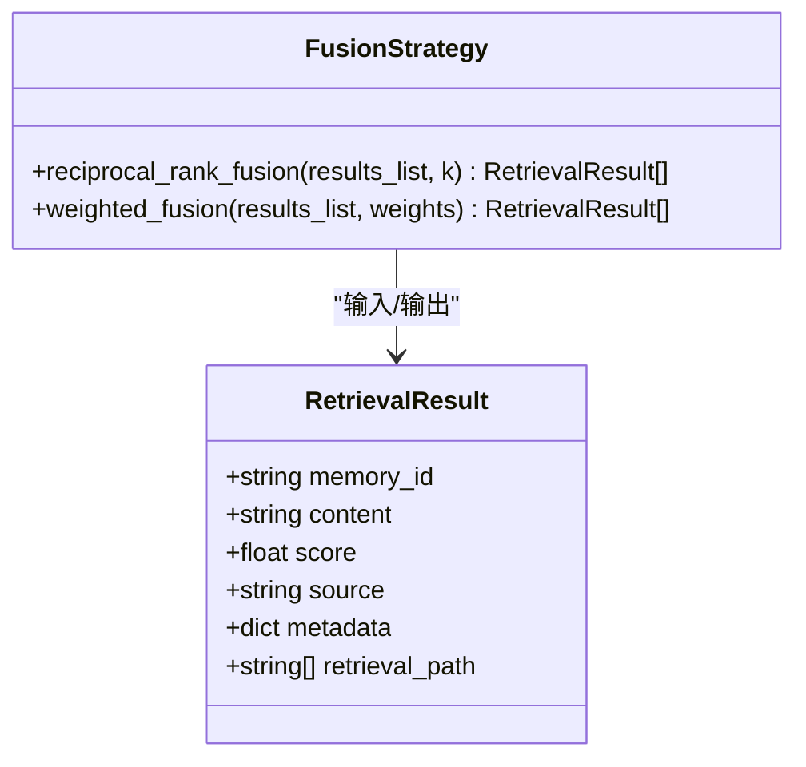
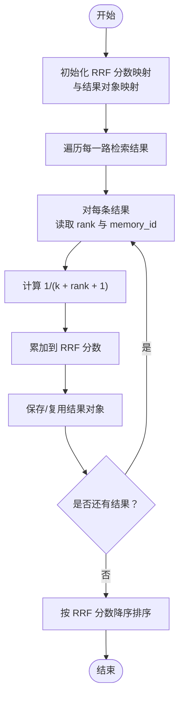
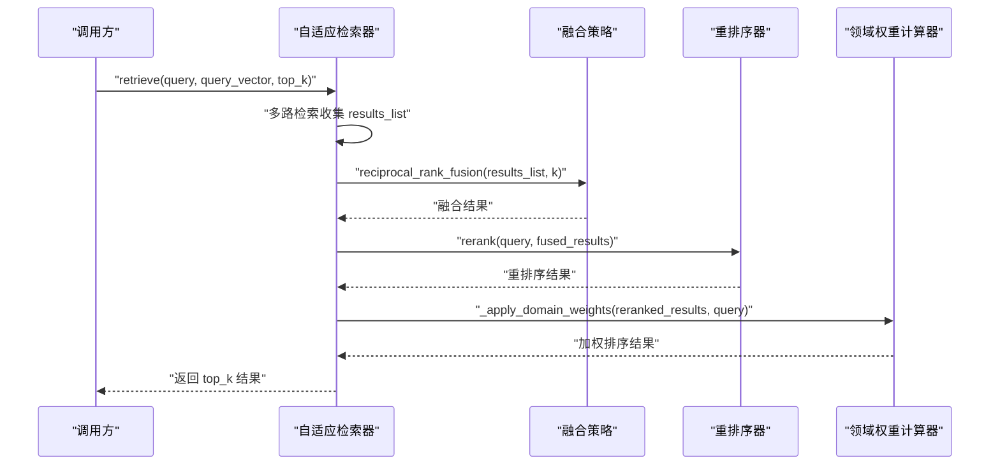
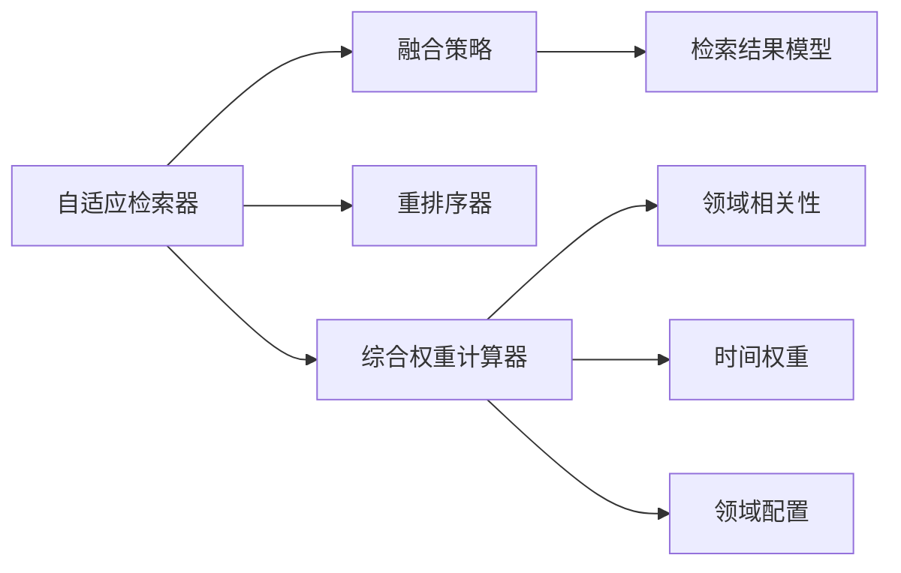

# 结果融合策略

<cite>
**本文引用的文件**
- [fusion.py](file://src/retrieval/fusion.py)
- [models.py](file://src/retrieval/models.py)
- [retriever.py](file://src/retrieval/retriever.py)
- [reranker.py](file://src/retrieval/reranker.py)
- [weight_calculator.py](file://src/domain/weight_calculator.py)
- [config.py](file://src/domain/config.py)
- [relevance.py](file://src/domain/relevance.py)
- [temporal_weight.py](file://src/domain/temporal_weight.py)
- [example_usage.py](file://example/example_usage.py)
- [test_imports.py](file://tools/test_imports.py)
</cite>

## 目录
1. [简介](#简介)
2. [项目结构](#项目结构)
3. [核心组件](#核心组件)
4. [架构总览](#架构总览)
5. [详细组件分析](#详细组件分析)
6. [依赖分析](#依赖分析)
7. [性能考量](#性能考量)
8. [故障排查指南](#故障排查指南)
9. [结论](#结论)
10. [附录](#附录)

## 简介
本文件围绕 NecoRAG 的“结果融合策略”展开，系统阐述融合策略类的实现原理，重点解析倒数秩融合（Reciprocal Rank Fusion, RRF）算法的工作机制与数学原理，并深入分析多路检索结果的融合方法（权重分配、排名聚合与最终排序）。同时，给出不同融合策略的优缺点与适用场景、融合参数调优建议、融合前后检索效果对比思路与量化分析方法，并提供实际使用示例与性能基准测试建议。

## 项目结构
与“结果融合策略”直接相关的代码主要分布在检索层与领域权重层：
- 检索层：融合策略、检索器、重排序器
- 领域权重层：关键字相关性、时间权重、综合权重计算

图表来源
- [fusion.py:1-128](file://src/retrieval/fusion.py#L1-L128)
- [retriever.py:1-440](file://src/retrieval/retriever.py#L1-L440)
- [reranker.py:1-179](file://src/retrieval/reranker.py#L1-L179)
- [models.py:1-29](file://src/retrieval/models.py#L1-L29)
- [weight_calculator.py:1-318](file://src/domain/weight_calculator.py#L1-L318)
- [config.py:1-285](file://src/domain/config.py#L1-L285)
- [relevance.py:1-328](file://src/domain/relevance.py#L1-L328)
- [temporal_weight.py:1-271](file://src/domain/temporal_weight.py#L1-L271)
- [example_usage.py:1-252](file://example/example_usage.py#L1-L252)
- [test_imports.py:1-64](file://tools/test_imports.py#L1-L64)

章节来源
- [fusion.py:1-128](file://src/retrieval/fusion.py#L1-L128)
- [retriever.py:1-440](file://src/retrieval/retriever.py#L1-L440)
- [reranker.py:1-179](file://src/retrieval/reranker.py#L1-L179)
- [models.py:1-29](file://src/retrieval/models.py#L1-L29)
- [weight_calculator.py:1-318](file://src/domain/weight_calculator.py#L1-L318)
- [config.py:1-285](file://src/domain/config.py#L1-L285)
- [relevance.py:1-328](file://src/domain/relevance.py#L1-L328)
- [temporal_weight.py:1-271](file://src/domain/temporal_weight.py#L1-L271)
- [example_usage.py:1-252](file://example/example_usage.py#L1-L252)
- [test_imports.py:1-64](file://tools/test_imports.py#L1-L64)

## 核心组件
- 融合策略类（FusionStrategy）
  - 提供两种融合方法：RRF（倒数秩融合）、加权融合
  - 输入为多路检索结果列表，输出为融合后的排序结果
- 检索器（AdaptiveRetriever）
  - 在检索流程中调用融合策略，随后进行重排序与领域权重应用
- 重排序器（ReRanker）
  - 提供新颖性惩罚与多样性保障，作为融合后的二次排序
- 领域权重计算器（CompositeWeightCalculator）
  - 将关键字相关性、时间权重、领域权重综合，对融合后结果进行再打分

章节来源
- [fusion.py:9-128](file://src/retrieval/fusion.py#L9-L128)
- [retriever.py:122-254](file://src/retrieval/retriever.py#L122-L254)
- [reranker.py:10-179](file://src/retrieval/reranker.py#L10-L179)
- [weight_calculator.py:56-223](file://src/domain/weight_calculator.py#L56-L223)

## 架构总览
下图展示了“检索-融合-重排序-领域权重”的端到端流程，以及融合策略在其中的位置。

图表来源
- [retriever.py:177-254](file://src/retrieval/retriever.py#L177-L254)
- [fusion.py:18-70](file://src/retrieval/fusion.py#L18-L70)
- [reranker.py:41-70](file://src/retrieval/reranker.py#L41-L70)
- [weight_calculator.py:81-146](file://src/domain/weight_calculator.py#L81-L146)

## 详细组件分析

### 融合策略类（FusionStrategy）
- 支持的方法
  - RRF（倒数秩融合）：对每个结果按其在各路结果中的排名位置计算分数，累加后排序
  - 加权融合：对每路结果按给定权重进行加权累加，再排序
- 关键实现要点
  - RRF：以 k 为平滑参数，rank 从 0 开始，RRF 分数为 1/(k+rank+1)，累加相同 memory_id 的分数
  - 加权融合：先归一化权重，再按结果原始分数乘以对应权重累加
  - 输出统一为按分数降序的检索结果列表

图表来源
- [fusion.py:9-128](file://src/retrieval/fusion.py#L9-L128)
- [models.py:9-18](file://src/retrieval/models.py#L9-L18)

章节来源
- [fusion.py:18-127](file://src/retrieval/fusion.py#L18-L127)
- [models.py:9-18](file://src/retrieval/models.py#L9-L18)

### RRF 算法工作机制与数学原理
- 数学公式
  - 对于某条记忆项 m，来自第 i 路检索结果的排名为 rank_i，则其 RRF 分数为：
    - RRF(m) = Σ_i 1/(k + rank_i + 1)
  - k 控制“早期排名”的权重衰减速度：k 越大，排名靠后的影响越小
- 算法流程
  - 遍历每一路结果，记录每条结果的 memory_id 与其在该路的 rank
  - 计算每个 memory_id 的 RRF 分数并累加
  - 以分数降序排序，得到融合结果
- 优点
  - 不依赖绝对分数尺度，适合跨模型/跨来源的结果融合
  - 对“谁排得更前”敏感，能有效整合多路互补信息
- 局限
  - 对绝对相似度不敏感，可能弱化高分但晚出的结果
  - k 需要调优；过大可能抑制长尾，过小可能导致噪声放大

图表来源
- [fusion.py:36-70](file://src/retrieval/fusion.py#L36-L70)

章节来源
- [fusion.py:18-70](file://src/retrieval/fusion.py#L18-L70)

### 加权融合方法
- 方法说明
  - 对每一路检索结果，按给定权重对原始分数加权累加
  - 权重需与结果路数一致，内部会做归一化
- 适用场景
  - 当不同检索来源的分数尺度可比，且你希望强调某一路（如向量检索 vs 图谱检索）
- 注意事项
  - 权重设置需谨慎，避免过度偏向某一来源
  - 若来源质量差异较大，建议使用 RRF 或领域权重再打分

章节来源
- [fusion.py:72-127](file://src/retrieval/fusion.py#L72-L127)

### 多路检索与融合在检索器中的集成
- AdaptiveRetriever 在检索流程中：
  - 多路检索（向量/图谱等）
  - 调用融合策略（默认使用 RRF）
  - 重排序（新颖性惩罚/多样性）
  - 应用领域权重（关键字/时间/领域）
  - 过滤低分并早停判断
- 融合参数
  - RRF 的 k 值可通过融合策略接口传入
  - 重排序器的多项参数（新颖性/多样性/冗余惩罚）可在初始化时设置

图表来源
- [retriever.py:177-254](file://src/retrieval/retriever.py#L177-L254)
- [fusion.py:18-70](file://src/retrieval/fusion.py#L18-L70)
- [reranker.py:41-70](file://src/retrieval/reranker.py#L41-L70)
- [weight_calculator.py:255-305](file://src/domain/weight_calculator.py#L255-L305)

章节来源
- [retriever.py:177-254](file://src/retrieval/retriever.py#L177-L254)

### 领域权重与融合后的再打分
- 综合权重由三部分构成：
  - 关键字相关性权重（基于领域关键字匹配）
  - 时间权重（基于文档创建/更新时间与衰减策略）
  - 领域权重（基于文档与目标领域的相关性等级）
- 公式示意
  - final_score ∝ base_score × α × keyword_weight × β × temporal_weight × γ × domain_weight × custom_weight
- 作用
  - 在融合后的结果上进一步细化排序，突出高质量、时效性强、领域相关的内容

章节来源
- [weight_calculator.py:81-146](file://src/domain/weight_calculator.py#L81-L146)
- [relevance.py:198-241](file://src/domain/relevance.py#L198-L241)
- [temporal_weight.py:160-195](file://src/domain/temporal_weight.py#L160-L195)
- [config.py:54-129](file://src/domain/config.py#L54-L129)

## 依赖分析
- 融合策略依赖检索结果模型（RetrievalResult）
- 检索器依赖融合策略、重排序器与领域权重计算器
- 领域权重计算器依赖领域配置、相关性与时间权重模块

图表来源
- [fusion.py:5-6](file://src/retrieval/fusion.py#L5-L6)
- [retriever.py:11-14](file://src/retrieval/retriever.py#L11-L14)
- [weight_calculator.py:11-13](file://src/domain/weight_calculator.py#L11-L13)

章节来源
- [fusion.py:5-6](file://src/retrieval/fusion.py#L5-L6)
- [retriever.py:11-14](file://src/retrieval/retriever.py#L11-L14)
- [weight_calculator.py:11-13](file://src/domain/weight_calculator.py#L11-L13)

## 性能考量
- RRF 的时间复杂度约为 O(Σ n_i)，其中 n_i 为第 i 路结果数量；空间复杂度 O(N)，N 为去重后的记忆项数
- 加权融合的时间复杂度与 RRF 类似，但额外有权重归一化开销
- 重排序器的相似度计算与多样性选择在最坏情况下为 O(M^2)，M 为候选数
- 建议
  - 在融合前控制每路 top_k，避免融合阶段处理过多冗余结果
  - 合理设置 k 值，平衡“早期排名”与“长尾覆盖”
  - 对重排序器参数进行缓存与增量更新，减少重复计算

## 故障排查指南
- 融合后结果为空
  - 检查多路检索是否返回空列表
  - 确认 memory_id 是否一致（融合以 memory_id 去重）
- RRF 分数异常
  - 检查 k 值是否过大导致排名靠后项被抑制
  - 确认 rank 从 0 开始，且未被截断
- 加权融合报错
  - 确认 weights 与结果路数一致，且总和非零
- 重排序效果不佳
  - 调整新颖性惩罚与多样性权重，观察重复抑制与多样性之间的平衡
- 领域权重未生效
  - 确认领域配置已正确加载，且文档元数据包含必要字段

章节来源
- [fusion.py:33-34](file://src/retrieval/fusion.py#L33-L34)
- [fusion.py:87-88](file://src/retrieval/fusion.py#L87-L88)
- [reranker.py:72-107](file://src/retrieval/reranker.py#L72-L107)
- [weight_calculator.py:255-305](file://src/domain/weight_calculator.py#L255-L305)

## 结论
NecoRAG 的融合策略以 RRF 为核心，结合重排序与领域权重，形成“多路互补—全局聚合—再打分”的闭环。RRF 通过排名位置的倒数累加，有效整合多来源信息；重排序器进一步提升结果质量；领域权重则在语义与时效层面精细化排序。实践中应根据业务场景选择合适的融合方式与参数，并结合领域配置持续优化。

## 附录

### 融合参数调优指南
- RRF
  - k：默认值可参考实现中的默认参数；若召回较浅、长尾不足，可适当降低；若噪声较多，可适当提高
- 加权融合
  - 权重：建议先固定为均值，再依据各路质量差异微调；注意归一化
- 重排序器
  - novelity_weight、diversity_weight、redundancy_penalty：先固定为默认值，再根据重复率与多样性需求调整
- 领域权重
  - 关键字因子、时间因子、领域因子：根据领域特性与时效要求设定；时间衰减系数可按领域变化速率选择

章节来源
- [fusion.py:18-22](file://src/retrieval/fusion.py#L18-L22)
- [reranker.py:20-39](file://src/retrieval/reranker.py#L20-L39)
- [weight_calculator.py:59-80](file://src/domain/weight_calculator.py#L59-L80)
- [temporal_weight.py:25-44](file://src/domain/temporal_weight.py#L25-L44)

### 融合前后效果对比与量化分析
- 指标建议
  - 精度（Precision@K）：关注融合后高分段的准确性
  - 召回（Recall@K）：关注融合后覆盖更多相关结果的能力
  - 多样性（Distinct@K）：避免融合后高度重复
  - 平均互信息（Avg NPMI）：衡量关键词共现强度（可选）
- 实施步骤
  - 保留同一组查询与人工标注的基准集
  - 分别统计“仅向量检索”、“仅图谱检索”、“RRF 融合”、“加权融合”、“RRF+重排序”、“RRF+重排序+领域权重”等方案的上述指标
  - 使用显著性检验比较方案间差异
- 注意
  - 指标计算需保持相同的 K 与抽样策略
  - 多样性与准确性之间需权衡，避免过度去重导致漏检

### 实际使用示例
- 完整工作流示例（感知-记忆-检索-精炼-交互）
  - 示例脚本展示了如何初始化感知引擎、存储与检索记忆、执行智能检索、生成答案并生成交互响应
  - 检索阶段即体现了融合策略在检索器中的应用

章节来源
- [example_usage.py:94-136](file://example/example_usage.py#L94-L136)

### 性能基准测试建议
- 测试环境
  - 固定数据集与查询集合，使用相同硬件与运行时配置
- 测试指标
  - 延迟：检索-融合-重排序-权重全流程耗时
  - 吞吐：单位时间内处理的查询数
  - 内存占用：融合阶段中间结果与排序内存峰值
- 基准方法
  - 对比“仅融合”与“融合+重排序+领域权重”的延迟与吞吐差异
  - 对比不同 k 值与权重设置下的性能与质量权衡

章节来源
- [test_imports.py:7-63](file://tools/test_imports.py#L7-L63)
- [retriever.py:177-254](file://src/retrieval/retriever.py#L177-L254)