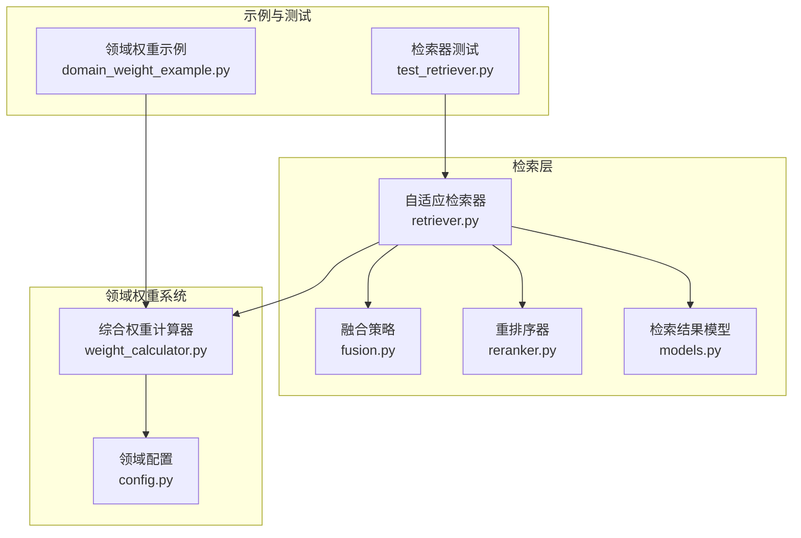
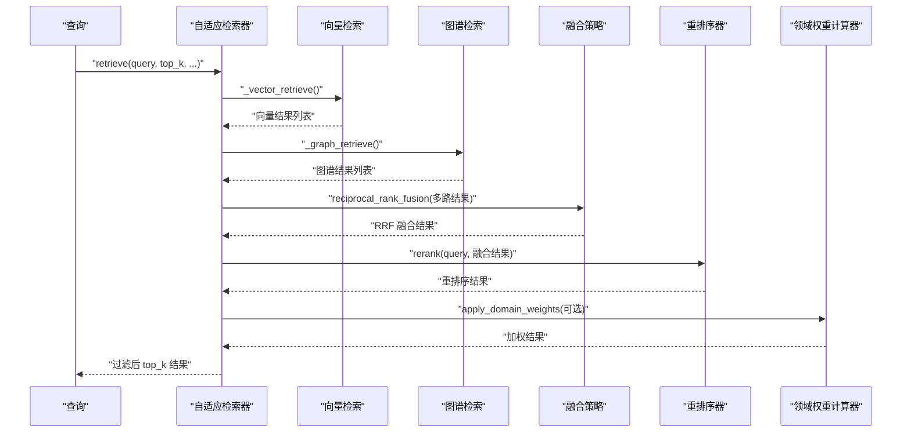
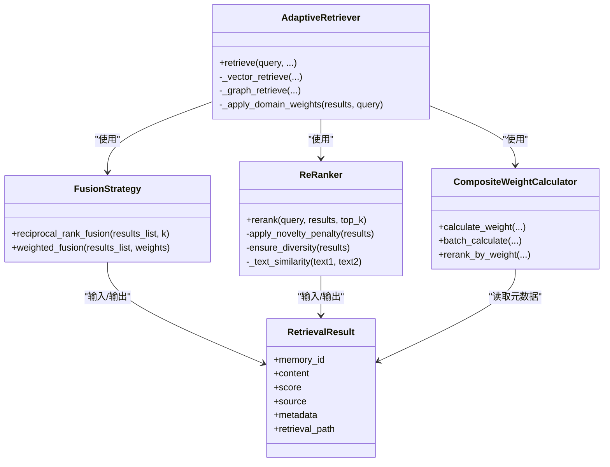

# 结果融合策略

<cite>
**本文引用的文件**
- [fusion.py](file://src/retrieval/fusion.py)
- [models.py](file://src/retrieval/models.py)
- [reranker.py](file://src/retrieval/reranker.py)
- [retriever.py](file://src/retrieval/retriever.py)
- [weight_calculator.py](file://src/domain/weight_calculator.py)
- [config.py](file://src/domain/config.py)
- [domain_weight_example.py](file://example/domain_weight_example.py)
- [自适应检索算法.md](file://wiki/wiki/检索引擎模块/自适应检索算法.md)
- [结果融合策略.md](file://wiki/wiki/检索引擎模块/结果融合策略.md)
- [test_retriever.py](file://tests/test_retrieval/test_retriever.py)
</cite>

## 目录
1. [简介](#简介)
2. [项目结构](#项目结构)
3. [核心组件](#核心组件)
4. [架构总览](#架构总览)
5. [详细组件分析](#详细组件分析)
6. [依赖关系分析](#依赖关系分析)
7. [性能考量](#性能考量)
8. [故障排查指南](#故障排查指南)
9. [结论](#结论)
10. [附录](#附录)

## 简介
本文件围绕“结果融合策略”展开，系统阐述倒数排名融合（Reciprocal Rank Fusion, RRF）的数学原理与实现细节，覆盖权重分配机制、排名稳定性与收敛性分析，并给出多源检索（向量检索、图谱检索、全文搜索/网络检索）的统一处理方案。文档还包含去重算法、相似度计算与最终排序规则，以及不同融合策略的性能对比、适用场景与配置优化建议，并提供实际应用案例与效果评估方法。

## 项目结构
与结果融合策略直接相关的代码主要分布在以下模块：
- 检索层：融合策略、重排序器、检索器
- 领域权重系统：综合权重计算器、领域配置与权重因子
- 示例与测试：领域权重使用示例、检索器单元测试

图表来源
- [fusion.py:1-128](file://src/retrieval/fusion.py#L1-L128)
- [reranker.py:1-186](file://src/retrieval/reranker.py#L1-L186)
- [retriever.py:1-644](file://src/retrieval/retriever.py#L1-L644)
- [models.py:1-29](file://src/retrieval/models.py#L1-L29)
- [weight_calculator.py:1-318](file://src/domain/weight_calculator.py#L1-L318)
- [config.py:1-285](file://src/domain/config.py#L1-L285)
- [domain_weight_example.py:1-267](file://example/domain_weight_example.py#L1-L267)
- [test_retriever.py:1-410](file://tests/test_retrieval/test_retriever.py#L1-L410)

章节来源
- [fusion.py:1-128](file://src/retrieval/fusion.py#L1-L128)
- [reranker.py:1-186](file://src/retrieval/reranker.py#L1-L186)
- [retriever.py:1-644](file://src/retrieval/retriever.py#L1-L644)
- [models.py:1-29](file://src/retrieval/models.py#L1-L29)
- [weight_calculator.py:1-318](file://src/domain/weight_calculator.py#L1-L318)
- [config.py:1-285](file://src/domain/config.py#L1-L285)
- [domain_weight_example.py:1-267](file://example/domain_weight_example.py#L1-L267)
- [test_retriever.py:1-410](file://tests/test_retrieval/test_retriever.py#L1-L410)

## 核心组件
- 融合策略（FusionStrategy）
  - 提供 RRF 与加权融合两种方法，统一处理多路检索结果的合并与排序。
- 重排序器（ReRanker）
  - 基于新颖性惩罚与多样性保障，对融合后的候选集进行精排。
- 自适应检索器（AdaptiveRetriever）
  - 集成多路检索、融合、重排序、领域权重与早停控制，形成完整的检索流水线。
- 领域权重系统（CompositeWeightCalculator）
  - 综合关键字权重、时间权重与领域权重，计算最终加权分数。
- 检索结果模型（RetrievalResult）
  - 统一承载检索结果的标识、内容、分数、来源与元数据。

章节来源
- [fusion.py:9-128](file://src/retrieval/fusion.py#L9-L128)
- [reranker.py:11-186](file://src/retrieval/reranker.py#L11-L186)
- [retriever.py:135-361](file://src/retrieval/retriever.py#L135-L361)
- [weight_calculator.py:56-206](file://src/domain/weight_calculator.py#L56-L206)
- [models.py:9-18](file://src/retrieval/models.py#L9-L18)

## 架构总览
下图展示检索器在检索流程中如何调用融合策略与重排序器，并在必要时应用领域权重与早停控制。

图表来源
- [retriever.py:224-308](file://src/retrieval/retriever.py#L224-L308)
- [fusion.py:18-70](file://src/retrieval/fusion.py#L18-L70)
- [reranker.py:42-77](file://src/retrieval/reranker.py#L42-L77)
- [weight_calculator.py:81-146](file://src/domain/weight_calculator.py#L81-L146)

## 详细组件分析

### 倒数排名融合（RRF）算法
- 数学原理
  - 对于某条记忆项 m，来自第 i 路检索结果的排名为 rank_i，则其 RRF 分数为：RRF(m) = Σ_i 1/(k + rank_i + 1)。k 控制“早期排名”的权重衰减速度：k 越大，排名靠后的影响越小。
- 算法流程
  - 遍历每一路结果，记录每条结果的 memory_id 与其在该路的 rank。
  - 计算每个 memory_id 的 RRF 分数并累加。
  - 以分数降序排序，得到融合结果。
- 优点
  - 不依赖绝对分数尺度，适合跨模型/跨来源的结果融合。
  - 对“谁排得更前”敏感，能有效整合多路互补信息。
- 局限
  - 对绝对相似度不敏感，可能弱化高分但晚出的结果。
  - k 需要调优；过大可能抑制长尾，过小可能导致噪声放大。

图表来源
- [fusion.py:36-70](file://src/retrieval/fusion.py#L36-L70)

章节来源
- [fusion.py:18-70](file://src/retrieval/fusion.py#L18-L70)
- [结果融合策略.md:171-187](file://wiki/wiki/检索引擎模块/结果融合策略.md#L171-L187)

### 加权融合方法
- 方法说明
  - 对每一路检索结果，按给定权重对原始分数加权累加。
  - 权重需与结果路数一致，内部会做归一化。
- 适用场景
  - 当不同检索来源的分数尺度可比，且你希望强调某一路（如向量检索 vs 图谱检索）。
- 注意事项
  - 权重设置需谨慎，避免过度偏向某一来源。
  - 若来源质量差异较大，建议使用 RRF 或领域权重再打分。

章节来源
- [fusion.py:72-127](file://src/retrieval/fusion.py#L72-L127)
- [结果融合策略.md:207-216](file://wiki/wiki/检索引擎模块/结果融合策略.md#L207-L216)

### 多源检索与融合在检索器中的集成
- AdaptiveRetriever 在检索流程中：
  - 多路检索（向量/图谱等）
  - 调用融合策略（默认使用 RRF）
  - 重排序（新颖性惩罚/多样性）
  - 应用领域权重（关键字/时间/领域）
  - 过滤低分并早停判断
- 融合参数
  - RRF 的 k 值可通过融合策略接口传入
  - 重排序器的多项参数（新颖性/多样性/冗余惩罚）可在初始化时设置

章节来源
- [retriever.py:224-308](file://src/retrieval/retriever.py#L224-L308)
- [自适应检索算法.md:222-247](file://wiki/wiki/检索引擎模块/自适应检索算法.md#L222-L247)

### 去重算法与相似度计算
- 去重
  - 基于内容哈希（小写去空白）进行集合去重，确保融合后结果唯一。
- 相似度计算
  - 重排序器采用 Jaccard 相似度（词集交并比）作为文本相似度指标，用于新颖性惩罚与多样性保障。
  - 该实现为简化版本，后续可替换为更精确的相似度计算（如向量相似度或语义相似度）。

章节来源
- [retriever.py:604-644](file://src/retrieval/retriever.py#L604-L644)
- [reranker.py:162-186](file://src/retrieval/reranker.py#L162-L186)

### 最终排序规则
- RRF 融合后按 RRF 分数降序排序。
- 重排序阶段按新颖性惩罚与多样性策略调整分数后再次降序排序。
- 领域权重阶段按综合权重 final_score 降序排序。
- 过滤低分并截取 top_k 输出。

章节来源
- [fusion.py:67-68](file://src/retrieval/fusion.py#L67-L68)
- [reranker.py:70-71](file://src/retrieval/reranker.py#L70-L71)
- [weight_calculator.py:199-200](file://src/domain/weight_calculator.py#L199-L200)

### 领域权重系统
- 综合权重公式
  - final_score = base_score × (α × keyword_weight) × (β × temporal_weight) × (γ × domain_weight) × custom_weight
- 关键字权重
  - 基于关键字等级与密度计算，限制在合理区间。
- 时间权重
  - 支持分层权重与指数衰减两种策略，常青内容不受衰减影响。
- 领域权重
  - 基于关键字匹配与领域等级映射得到权重乘数。
- 权重明细
  - 将关键字、时间、领域权重与基础分数写入结果元数据，便于调试与可视化。

章节来源
- [weight_calculator.py:81-146](file://src/domain/weight_calculator.py#L81-L146)
- [自适应检索算法.md:252-262](file://wiki/wiki/检索引擎模块/自适应检索算法.md#L252-L262)

## 依赖关系分析
- 组件耦合
  - AdaptiveRetriever 依赖 FusionStrategy、ReRanker、CompositeWeightCalculator 与 RetrievalResult。
  - FusionStrategy 仅依赖 RetrievalResult。
  - ReRanker 依赖 RetrievalResult 与基础重排序接口。
  - CompositeWeightCalculator 依赖领域配置与相关计算模块。
- 外部依赖
  - 重排序器预留 BGE-Reranker 模型集成点（待实现）。
  - 网络搜索回退功能依赖 WebSearchEngine、SearchResultValidator、HumanConfirmationManager。

图表来源
- [fusion.py:9-128](file://src/retrieval/fusion.py#L9-L128)
- [reranker.py:11-186](file://src/retrieval/reranker.py#L11-L186)
- [retriever.py:135-361](file://src/retrieval/retriever.py#L135-L361)
- [weight_calculator.py:56-206](file://src/domain/weight_calculator.py#L56-L206)
- [models.py:9-18](file://src/retrieval/models.py#L9-L18)

## 性能考量
- 时间复杂度
  - RRF：O(Σ n_i)，其中 n_i 为第 i 路结果数量；空间复杂度 O(N)，N 为去重后的记忆项数。
  - 加权融合：与 RRF 类似，但额外有权重归一化开销。
  - 重排序器的相似度计算与多样性选择在最坏情况下为 O(M^2)，M 为候选数。
- 建议
  - 在融合前控制每路 top_k，避免融合阶段处理过多冗余结果。
  - 合理设置 k 值，平衡“早期排名”与“长尾覆盖”。
  - 对重排序器参数进行缓存与增量更新，减少重复计算。
  - 重排序器的相似度计算可替换为更高效的方法（如向量相似度）。

章节来源
- [结果融合策略.md:300-308](file://wiki/wiki/检索引擎模块/结果融合策略.md#L300-L308)

## 故障排查指南
- 融合后结果为空
  - 检查多路检索是否返回空列表。
  - 确认 memory_id 是否一致（融合以 memory_id 去重）。
- RRF 分数异常
  - 检查 k 值是否过大导致排名靠后项被抑制。
  - 确认 rank 从 0 开始，且未被截断。
- 加权融合报错
  - 确认 weights 与结果路数一致，且总和非零。
- 重排序效果不佳
  - 调整新颖性惩罚与多样性权重，观察重复抑制与多样性之间的平衡。
- 领域权重未生效
  - 确认领域配置已正确加载，且文档元数据包含必要字段。

章节来源
- [结果融合策略.md:309-322](file://wiki/wiki/检索引擎模块/结果融合策略.md#L309-L322)

## 结论
本策略通过 RRF 实现跨来源、跨尺度的稳健融合，结合重排序器的新颖性惩罚与多样性保障，以及领域权重系统的综合评分，形成从“多源互补”到“高质量排序”的完整闭环。实践中应根据业务场景选择合适的融合方法与参数，并持续评估与优化。

## 附录

### 实际应用案例与效果评估
- 领域权重示例
  - 展示了如何配置领域、计算时间权重、相关性评分与综合权重，并输出排序结果。
- 检索器测试
  - 覆盖早停控制器、检索流程、查询分析与边界情况，可用于回归与性能评估。

章节来源
- [domain_weight_example.py:1-267](file://example/domain_weight_example.py#L1-L267)
- [test_retriever.py:1-410](file://tests/test_retrieval/test_retriever.py#L1-L410)