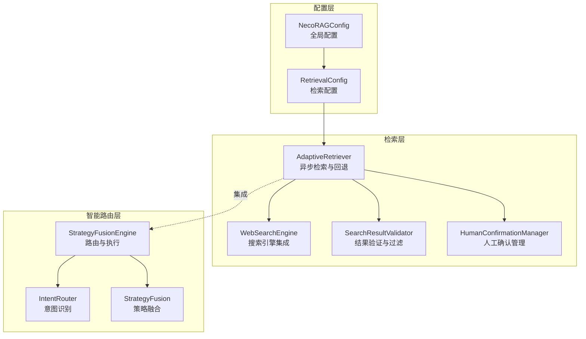
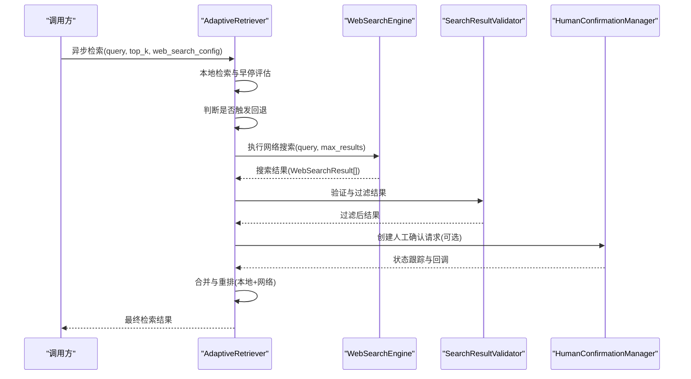
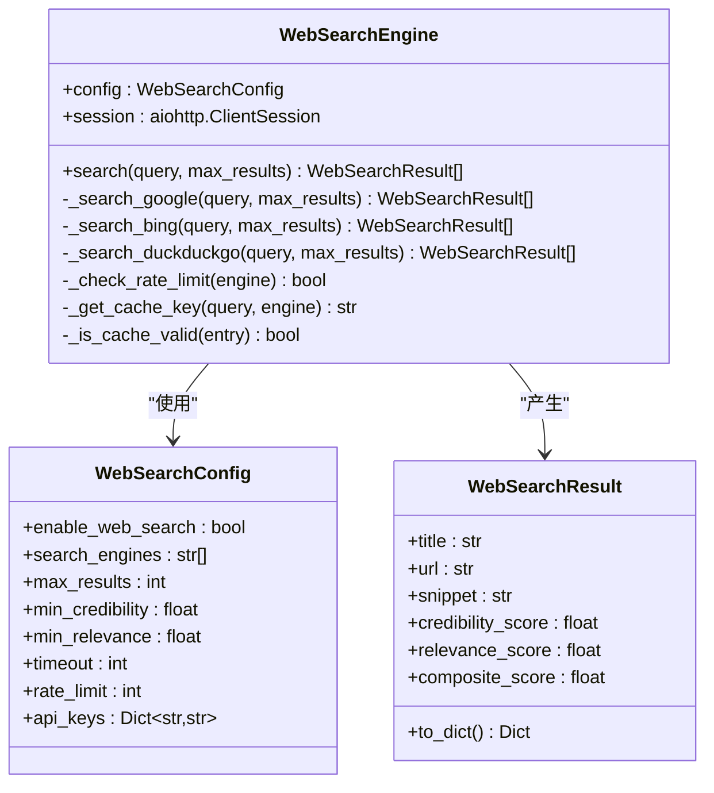
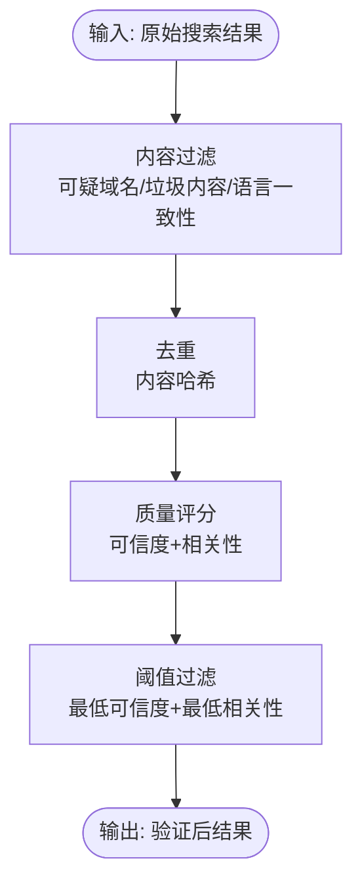
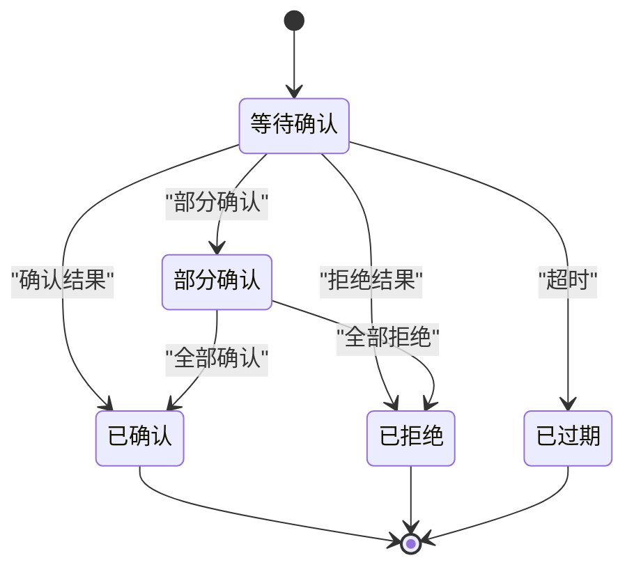
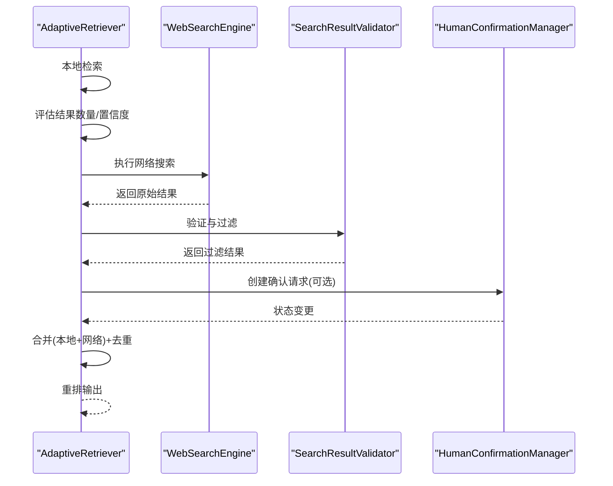
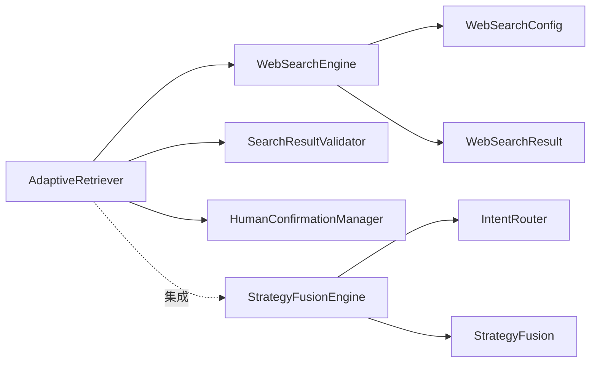

# 网络搜索集成

<cite>
**本文档引用的文件**
- [engine.py](file://src/retrieval/web_search/engine.py)
- [confirmation.py](file://src/retrieval/web_search/confirmation.py)
- [models.py](file://src/retrieval/web_search/models.py)
- [validator.py](file://src/retrieval/web_search/validator.py)
- [retriever.py](file://src/retrieval/retriever.py)
- [config.py](file://src/core/config.py)
- [intent_router.py](file://src/retrieval/smart_routing/intent_router.py)
- [strategy_fusion.py](file://src/retrieval/smart_routing/strategy_fusion.py)
- [engine.py](file://src/retrieval/smart_routing/engine.py)
- [fusion.py](file://src/retrieval/fusion.py)
- [example_usage.py](file://example/example_usage.py)
- [test_retriever.py](file://tests/test_retrieval/test_retriever.py)
</cite>

## 目录
1. [简介](#简介)
2. [项目结构](#项目结构)
3. [核心组件](#核心组件)
4. [架构总览](#架构总览)
5. [详细组件分析](#详细组件分析)
6. [依赖关系分析](#依赖关系分析)
7. [性能考量](#性能考量)
8. [故障排查指南](#故障排查指南)
9. [结论](#结论)
10. [附录](#附录)

## 简介
本文件面向网络搜索集成功能，系统性阐述以下内容：
- 本地检索失败时的互联网搜索回退机制
- 网络搜索引擎的集成方式与并发搜索策略
- 搜索结果验证与人工确认流程
- 可信度评估与相关性过滤机制
- 网络搜索与本地检索的合并策略与权重调整
- 配置参数说明与使用示例
- 对系统整体性能的影响与优化建议
- 安全考虑与隐私保护措施

## 项目结构
网络搜索功能主要分布在检索层的 web_search 子模块，并与 AdaptiveRetriever 的异步检索流程集成，形成“本地检索不足即回退”的闭环。

**图表来源**
- [retriever.py:500-644](file://src/retrieval/retriever.py#L500-L644)
- [engine.py:112-186](file://src/retrieval/web_search/engine.py#L112-L186)
- [validator.py:56-90](file://src/retrieval/web_search/validator.py#L56-L90)
- [confirmation.py:58-95](file://src/retrieval/web_search/confirmation.py#L58-L95)
- [intent_router.py:115-155](file://src/retrieval/smart_routing/intent_router.py#L115-L155)
- [strategy_fusion.py:78-158](file://src/retrieval/smart_routing/strategy_fusion.py#L78-L158)
- [engine.py:68-129](file://src/retrieval/smart_routing/engine.py#L68-L129)
- [config.py:160-193](file://src/core/config.py#L160-L193)

**章节来源**
- [retriever.py:500-644](file://src/retrieval/retriever.py#L500-L644)
- [engine.py:112-186](file://src/retrieval/web_search/engine.py#L112-L186)
- [config.py:160-193](file://src/core/config.py#L160-L193)

## 核心组件
- WebSearchEngine：统一的搜索引擎接口，支持 Google、Bing、DuckDuckGo，具备并发搜索、结果去重、缓存与限流能力。
- SearchResultValidator：对搜索结果进行内容过滤、去重、可信度与相关性评分。
- HumanConfirmationManager：管理人工确认请求的生命周期，支持超时处理与回调通知。
- AdaptiveRetriever：在本地检索不足时触发网络搜索回退，合并并重排结果。
- 配置系统：通过 RetrievalConfig 控制网络搜索开关、结果数量、阈值与搜索引擎列表。

**章节来源**
- [engine.py:20-186](file://src/retrieval/web_search/engine.py#L20-L186)
- [validator.py:17-90](file://src/retrieval/web_search/validator.py#L17-L90)
- [confirmation.py:17-95](file://src/retrieval/web_search/confirmation.py#L17-L95)
- [retriever.py:195-223](file://src/retrieval/retriever.py#L195-L223)
- [config.py:160-193](file://src/core/config.py#L160-L193)

## 架构总览
网络搜索集成遵循“本地优先、回退至网络”的策略。当本地检索结果数量不足或置信度较低时，系统自动触发网络搜索，并通过验证器与人工确认流程确保结果质量，最终与本地结果合并输出。

**图表来源**
- [retriever.py:500-644](file://src/retrieval/retriever.py#L500-L644)
- [engine.py:112-186](file://src/retrieval/web_search/engine.py#L112-L186)
- [validator.py:56-90](file://src/retrieval/web_search/validator.py#L56-L90)
- [confirmation.py:58-95](file://src/retrieval/web_search/confirmation.py#L58-L95)

## 详细组件分析

### WebSearchEngine（搜索引擎集成）
- 并发搜索：对多个搜索引擎并发发起请求，聚合后去重与排序。
- 结果验证：内置可信度与相关性阈值过滤。
- 缓存与限流：基于内存的简单缓存与每引擎每分钟请求限制。
- 处理器映射：Google、Bing、DuckDuckGo 三种实现，分别对应不同 API 与认证方式。

**图表来源**
- [engine.py:20-186](file://src/retrieval/web_search/engine.py#L20-L186)
- [models.py:22-83](file://src/retrieval/web_search/models.py#L22-L83)
- [models.py:228-262](file://src/retrieval/web_search/models.py#L228-L262)

**章节来源**
- [engine.py:112-186](file://src/retrieval/web_search/engine.py#L112-L186)
- [models.py:22-83](file://src/retrieval/web_search/models.py#L22-L83)
- [models.py:228-262](file://src/retrieval/web_search/models.py#L228-L262)

### SearchResultValidator（结果验证与过滤）
- 内容过滤：剔除可疑域名、低质量内容与垃圾内容特征。
- 去重：基于内容哈希的去重策略。
- 质量评分：可信度与相关性评分，结合域名可信度、HTTPS、内容长度与完整性等启发式因素。
- 阈值过滤：依据配置的最低可信度与相关性阈值进行二次过滤。

**图表来源**
- [validator.py:56-90](file://src/retrieval/web_search/validator.py#L56-L90)
- [validator.py:127-151](file://src/retrieval/web_search/validator.py#L127-L151)
- [validator.py:153-178](file://src/retrieval/web_search/validator.py#L153-L178)
- [validator.py:180-239](file://src/retrieval/web_search/validator.py#L180-L239)

**章节来源**
- [validator.py:56-90](file://src/retrieval/web_search/validator.py#L56-L90)
- [validator.py:127-151](file://src/retrieval/web_search/validator.py#L127-L151)
- [validator.py:153-178](file://src/retrieval/web_search/validator.py#L153-L178)
- [validator.py:180-239](file://src/retrieval/web_search/validator.py#L180-L239)

### HumanConfirmationManager（人工确认流程）
- 生命周期管理：创建、跟踪、超时处理与回调通知。
- 状态机：PENDING → CONFIRMED/REJECTED/PARTIAL/EXPIRED。
- 超时清理：定时清理过期请求，防止内存泄漏。
- 导入导出：支持请求数据的导入导出，便于审计与恢复。

**图表来源**
- [confirmation.py:17-227](file://src/retrieval/web_search/confirmation.py#L17-L227)
- [models.py:13-20](file://src/retrieval/web_search/models.py#L13-L20)

**章节来源**
- [confirmation.py:17-227](file://src/retrieval/web_search/confirmation.py#L17-L227)
- [models.py:13-20](file://src/retrieval/web_search/models.py#L13-L20)

### AdaptiveRetriever（回退与合并策略）
- 回退触发：当本地检索结果数量小于阈值时，触发网络搜索回退。
- 结果合并：为网络结果适当提升分数权重，去重后合并。
- 与智能路由协作：通过 StrategyFusionEngine 的路由决策，决定何时启用网络搜索。

**图表来源**
- [retriever.py:500-644](file://src/retrieval/retriever.py#L500-L644)
- [engine.py:112-186](file://src/retrieval/web_search/engine.py#L112-L186)
- [validator.py:56-90](file://src/retrieval/web_search/validator.py#L56-L90)
- [confirmation.py:58-95](file://src/retrieval/web_search/confirmation.py#L58-L95)

**章节来源**
- [retriever.py:500-644](file://src/retrieval/retriever.py#L500-L644)

### 配置参数与使用示例
- 检索配置（RetrievalConfig）：
  - enable_web_search：是否启用网络搜索
  - web_search_min_results：触发回退的最小本地结果数
  - web_search_max_results：网络搜索最大结果数
  - web_search_confidence_threshold：网络搜索置信度阈值
  - confirmation_timeout：人工确认超时时间
  - search_engines：搜索引擎列表（默认 google、bing）

- 全局配置（NecoRAGConfig）：
  - 通过环境变量或配置文件覆盖关键参数，如向量数据库、图数据库等。

- 使用示例：
  - 在示例脚本中展示如何初始化各模块并执行检索流程。
  - 测试用例覆盖了检索器的基本行为与边界情况。

**章节来源**
- [config.py:160-193](file://src/core/config.py#L160-L193)
- [config.py:278-334](file://src/core/config.py#L278-L334)
- [example_usage.py:94-136](file://example/example_usage.py#L94-L136)
- [test_retriever.py:147-201](file://tests/test_retrieval/test_retriever.py#L147-L201)

## 依赖关系分析
- 模块耦合：
  - AdaptiveRetriever 依赖 WebSearchEngine、SearchResultValidator、HumanConfirmationManager。
  - WebSearchEngine 依赖 WebSearchConfig 与 WebSearchResult。
  - 智能路由层通过 StrategyFusionEngine 与 IntentRouter 协同，间接影响网络搜索的触发时机。
- 外部依赖：
  - aiohttp 用于异步 HTTP 请求。
  - Google、Bing、DuckDuckGo API（需配置相应密钥）。
- 潜在循环依赖：
  - 模块间通过显式导入与延迟初始化避免循环依赖。

**图表来源**
- [retriever.py:195-223](file://src/retrieval/retriever.py#L195-L223)
- [engine.py:27-45](file://src/retrieval/web_search/engine.py#L27-L45)
- [models.py:228-262](file://src/retrieval/web_search/models.py#L228-L262)
- [engine.py:68-129](file://src/retrieval/smart_routing/engine.py#L68-L129)
- [intent_router.py:115-155](file://src/retrieval/smart_routing/intent_router.py#L115-L155)
- [strategy_fusion.py:78-158](file://src/retrieval/smart_routing/strategy_fusion.py#L78-L158)

**章节来源**
- [retriever.py:195-223](file://src/retrieval/retriever.py#L195-L223)
- [engine.py:27-45](file://src/retrieval/web_search/engine.py#L27-L45)
- [engine.py:68-129](file://src/retrieval/smart_routing/engine.py#L68-L129)

## 性能考量
- 并发与限流：
  - WebSearchEngine 对多个搜索引擎并发请求，同时通过每引擎每分钟限流避免被封禁。
- 缓存策略：
  - 内存缓存减少重复请求，缓存 TTL 为 1 小时。
- 结果合并与重排：
  - AdaptiveRetriever 对网络结果进行分数调整与去重，避免重复内容影响体验。
- 早停机制：
  - 本地检索阶段采用早停控制器，减少不必要的计算。
- 异步执行：
  - 整体检索流程支持异步，提升吞吐与响应速度。

**章节来源**
- [engine.py:72-100](file://src/retrieval/web_search/engine.py#L72-L100)
- [engine.py:102-111](file://src/retrieval/web_search/engine.py#L102-L111)
- [retriever.py:43-114](file://src/retrieval/retriever.py#L43-L114)
- [retriever.py:500-644](file://src/retrieval/retriever.py#L500-L644)

## 故障排查指南
- 网络搜索未生效：
  - 检查 RetrievalConfig.enable_web_search 是否开启。
  - 确认本地检索结果数量是否达到回退阈值。
- API 密钥问题：
  - Google/Bing 需要正确配置 API Key；DuckDuckGo 无需密钥。
- 结果质量差：
  - 调整 SearchResultValidator 的可信度与相关性阈值。
  - 检查域名白名单/黑名单配置。
- 人工确认超时：
  - 调整 confirmation_timeout；检查回调是否正常触发。
- 性能瓶颈：
  - 增加并发度与限流阈值；启用缓存；优化重排策略。

**章节来源**
- [config.py:182-193](file://src/core/config.py#L182-L193)
- [engine.py:188-343](file://src/retrieval/web_search/engine.py#L188-L343)
- [validator.py:24-54](file://src/retrieval/web_search/validator.py#L24-L54)
- [confirmation.py:24-38](file://src/retrieval/web_search/confirmation.py#L24-L38)

## 结论
网络搜索集成功能通过“本地优先、回退至网络”的策略，在保证检索质量的同时提升了系统的鲁棒性。借助并发搜索、结果验证、人工确认与智能路由的协同，系统能够在复杂场景下提供高质量、可追溯的检索结果。合理的配置与性能优化能够进一步提升用户体验与系统稳定性。

## 附录

### 配置参数一览
- RetrievalConfig
  - enable_web_search：是否启用网络搜索
  - web_search_min_results：触发回退的最小本地结果数
  - web_search_max_results：网络搜索最大结果数
  - web_search_confidence_threshold：网络搜索置信度阈值
  - confirmation_timeout：人工确认超时时间
  - search_engines：搜索引擎列表（默认 ["google", "bing"]）

- WebSearchConfig
  - enable_web_search：是否启用网络搜索
  - search_engines：搜索引擎列表
  - max_results：最大结果数
  - min_credibility：最低可信度阈值
  - min_relevance：最低相关性阈值
  - timeout：搜索超时时间
  - rate_limit：请求频率限制（次/分钟）
  - api_keys：API 密钥字典

**章节来源**
- [config.py:160-193](file://src/core/config.py#L160-L193)
- [models.py:228-262](file://src/retrieval/web_search/models.py#L228-L262)

### 使用示例路径
- 完整工作流示例：[example_usage.py:94-136](file://example/example_usage.py#L94-L136)
- 检索器测试用例：[test_retriever.py:147-201](file://tests/test_retrieval/test_retriever.py#L147-L201)

**章节来源**
- [example_usage.py:94-136](file://example/example_usage.py#L94-L136)
- [test_retriever.py:147-201](file://tests/test_retrieval/test_retriever.py#L147-L201)