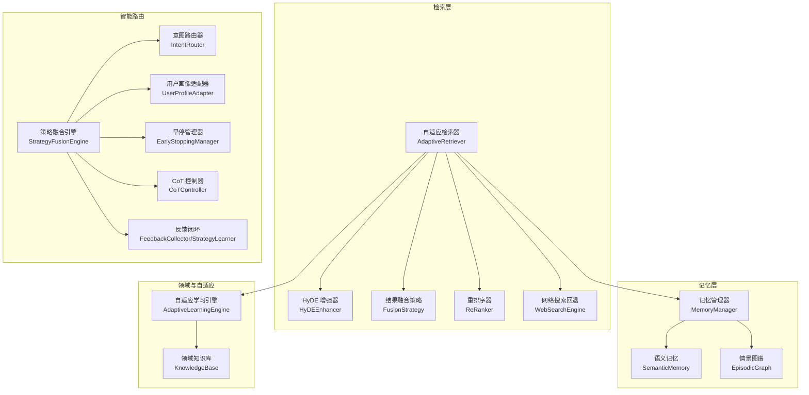
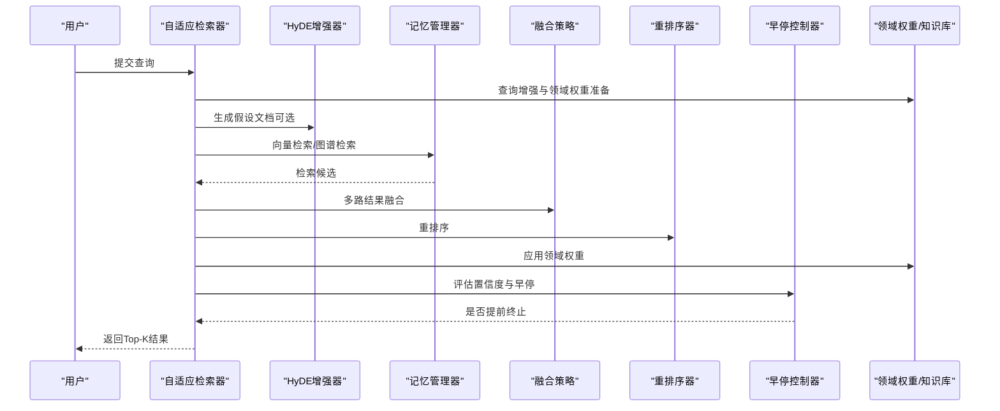
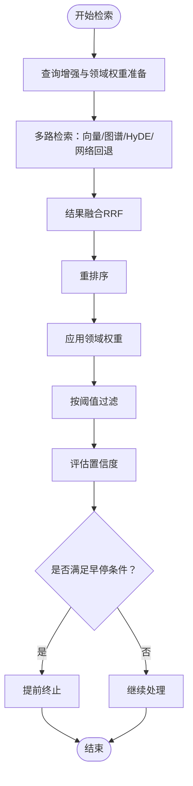
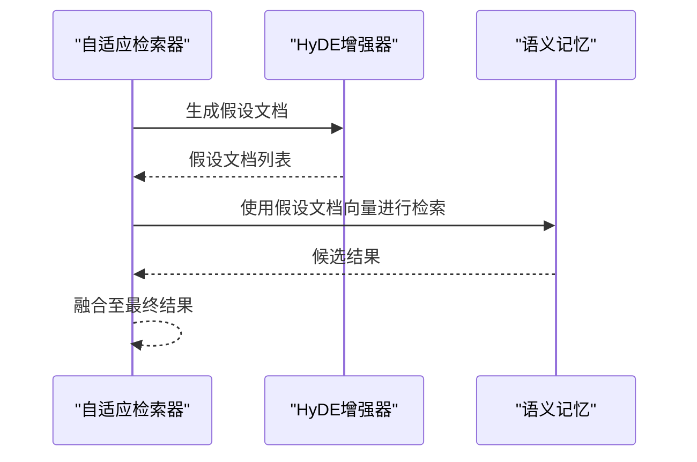
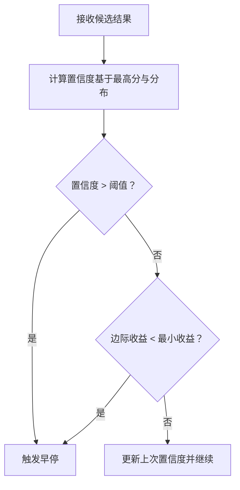
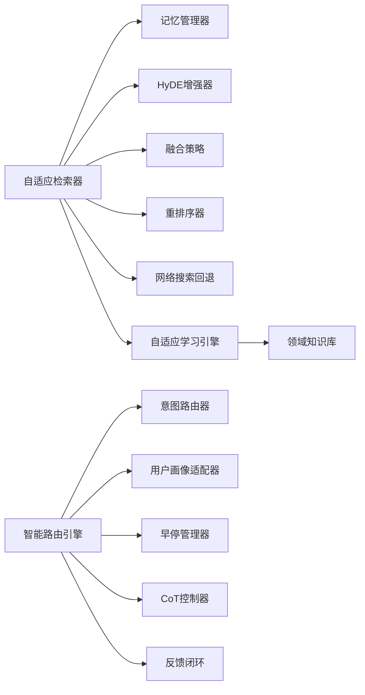

# 自适应检索器

<cite>
**本文引用的文件**
- [src/retrieval/retriever.py](file://src/retrieval/retriever.py)
- [src/retrieval/hyde.py](file://src/retrieval/hyde.py)
- [src/retrieval/fusion.py](file://src/retrieval/fusion.py)
- [src/retrieval/reranker.py](file://src/retrieval/reranker.py)
- [src/retrieval/web_search/engine.py](file://src/retrieval/web_search/engine.py)
- [src/retrieval/web_search/validator.py](file://src/retrieval/web_search/validator.py)
- [src/retrieval/web_search/confirmation.py](file://src/retrieval/web_search/confirmation.py)
- [src/retrieval/models.py](file://src/retrieval/models.py)
- [src/memory/models.py](file://src/memory/models.py)
- [src/domain/knowledge_base.py](file://src/domain/knowledge_base.py)
- [src/adaptive/engine.py](file://src/adaptive/engine.py)
- [src/adaptive/config.py](file://src/adaptive/config.py)
- [src/retrieval/smart_routing/engine.py](file://src/retrieval/smart_routing/engine.py)
- [src/retrieval/smart_routing/early_stopping.py](file://src/retrieval/smart_routing/early_stopping.py)
- [src/retrieval/smart_routing/intent_router.py](file://src/retrieval/smart_routing/intent_router.py)
- [src/retrieval/smart_routing/user_adapter.py](file://src/retrieval/smart_routing/user_adapter.py)
- [src/retrieval/smart_routing/cot_controller.py](file://src/retrieval/smart_routing/cot_controller.py)
- [src/retrieval/smart_routing/strategy_fusion.py](file://src/retrieval/smart_routing/strategy_fusion.py)
- [src/retrieval/smart_routing/feedback_loop.py](file://src/retrieval/smart_routing/feedback_loop.py)
</cite>

## 目录
1. [简介](#简介)
2. [项目结构](#项目结构)
3. [核心组件](#核心组件)
4. [架构总览](#架构总览)
5. [详细组件分析](#详细组件分析)
6. [依赖关系分析](#依赖关系分析)
7. [性能考量](#性能考量)
8. [故障排除指南](#故障排除指南)
9. [结论](#结论)
10. [附录](#附录)

## 简介
本文件面向“自适应检索器”的实现与使用，系统性阐述其核心能力与工作机制，包括：
- 多路检索策略：向量检索、图谱检索、HyDE 增强、推理链（CoT）与网络搜索回退
- 早停机制：基于置信度与边际收益的智能终止策略
- HyDE 增强技术：通过假设性文档嵌入提升检索质量
- 领域权重计算：结合关键字、时效性与领域相关性进行加权
- 智能路由与策略融合：意图识别、用户画像适配、策略权重动态调整
- 与记忆层的集成：工作记忆、语义记忆与情景图谱的数据交互
- 性能优化与故障排除建议

## 项目结构
自适应检索器位于检索层，围绕“查询分析—多路检索—结果融合—重排序—领域权重—早停—过滤”的完整流程组织代码。同时，智能路由子系统提供意图识别、用户画像适配、策略融合与早停控制；自适应学习引擎负责反馈收集、偏好预测与策略优化；领域知识库与权重计算模块提供领域增强能力。

图表来源
- [src/retrieval/retriever.py:135-644](file://src/retrieval/retriever.py#L135-L644)
- [src/retrieval/hyde.py:17-213](file://src/retrieval/hyde.py#L17-L213)
- [src/retrieval/fusion.py:9-128](file://src/retrieval/fusion.py#L9-L128)
- [src/retrieval/reranker.py](file://src/retrieval/reranker.py)
- [src/retrieval/web_search/engine.py](file://src/retrieval/web_search/engine.py)
- [src/retrieval/smart_routing/engine.py:34-274](file://src/retrieval/smart_routing/engine.py#L34-L274)
- [src/retrieval/smart_routing/early_stopping.py:39-326](file://src/retrieval/smart_routing/early_stopping.py#L39-L326)
- [src/retrieval/smart_routing/intent_router.py:91-278](file://src/retrieval/smart_routing/intent_router.py#L91-L278)
- [src/retrieval/smart_routing/user_adapter.py:98-331](file://src/retrieval/smart_routing/user_adapter.py#L98-L331)
- [src/retrieval/smart_routing/cot_controller.py:21-202](file://src/retrieval/smart_routing/cot_controller.py#L21-L202)
- [src/retrieval/smart_routing/strategy_fusion.py:43-349](file://src/retrieval/smart_routing/strategy_fusion.py#L43-L349)
- [src/retrieval/smart_routing/feedback_loop.py:30-435](file://src/retrieval/smart_routing/feedback_loop.py#L30-L435)
- [src/memory/models.py:14-43](file://src/memory/models.py#L14-L43)
- [src/domain/knowledge_base.py:65-564](file://src/domain/knowledge_base.py#L65-L564)
- [src/adaptive/engine.py:30-598](file://src/adaptive/engine.py#L30-L598)
- [src/adaptive/config.py:15-200](file://src/adaptive/config.py#L15-L200)

章节来源
- [src/retrieval/retriever.py:135-644](file://src/retrieval/retriever.py#L135-L644)
- [src/retrieval/smart_routing/engine.py:34-274](file://src/retrieval/smart_routing/engine.py#L34-L274)

## 核心组件
- 自适应检索器（AdaptiveRetriever）：实现查询分析、多路检索、融合、重排序、领域权重、早停与过滤的完整流程。
- HyDE 增强器：生成假设性文档并进行向量化，辅助检索。
- 结果融合策略：支持倒数排名融合（RRF）与加权融合。
- 重排序器：对融合后的候选进行重排序。
- 网络搜索回退：在本地检索不足时发起网络搜索并合并结果。
- 智能路由引擎：意图识别、用户画像适配、策略融合、早停与反馈闭环。
- 早停管理器：基于置信度阈值、边际收益、延迟预算与满意度预测的早停决策。
- 用户画像适配器：维护用户专业度、偏好风格与满意度历史。
- 自适应学习引擎：反馈收集、偏好预测、策略优化与集体智慧聚合。
- 领域知识库与权重计算：关键字、FAQ、关键词抽取与领域权重计算。

章节来源
- [src/retrieval/retriever.py:135-644](file://src/retrieval/retriever.py#L135-L644)
- [src/retrieval/hyde.py:17-213](file://src/retrieval/hyde.py#L17-L213)
- [src/retrieval/fusion.py:9-128](file://src/retrieval/fusion.py#L9-L128)
- [src/retrieval/reranker.py](file://src/retrieval/reranker.py)
- [src/retrieval/web_search/engine.py](file://src/retrieval/web_search/engine.py)
- [src/retrieval/smart_routing/engine.py:34-274](file://src/retrieval/smart_routing/engine.py#L34-L274)
- [src/retrieval/smart_routing/early_stopping.py:39-326](file://src/retrieval/smart_routing/early_stopping.py#L39-L326)
- [src/retrieval/smart_routing/user_adapter.py:98-331](file://src/retrieval/smart_routing/user_adapter.py#L98-L331)
- [src/adaptive/engine.py:30-598](file://src/adaptive/engine.py#L30-L598)
- [src/domain/knowledge_base.py:65-564](file://src/domain/knowledge_base.py#L65-L564)

## 架构总览
自适应检索器采用“查询增强—多路检索—融合—重排序—领域权重—早停—过滤”的流水线式处理，并与智能路由、自适应学习、领域知识库和记忆层形成松耦合集成。

图表来源
- [src/retrieval/retriever.py:224-308](file://src/retrieval/retriever.py#L224-L308)
- [src/retrieval/hyde.py:123-170](file://src/retrieval/hyde.py#L123-L170)
- [src/retrieval/fusion.py:18-70](file://src/retrieval/fusion.py#L18-L70)
- [src/retrieval/reranker.py](file://src/retrieval/reranker.py)
- [src/retrieval/smart_routing/early_stopping.py:57-110](file://src/retrieval/smart_routing/early_stopping.py#L57-L110)
- [src/domain/knowledge_base.py:146-200](file://src/domain/knowledge_base.py#L146-L200)

## 详细组件分析

### 自适应检索器（AdaptiveRetriever）
- 查询分析：识别查询类型与复杂度，为后续策略选择提供依据。
- 多路检索：向量检索（语义记忆）、图谱检索（实体）、HyDE 假设检索（可选）、网络搜索回退（可选）。
- 结果融合：采用 RRF 融合不同来源的候选，兼顾多样性与一致性。
- 重排序：使用重排序模型对融合后的候选进行细粒度排序。
- 领域权重：结合关键字、时效性与领域相关性，对候选进行加权并重排。
- 早停机制：基于置信度阈值与边际收益递减，避免冗余计算。
- 过滤：按最低分数阈值过滤低质量结果。
- 多跳检索：基于情景图谱进行多跳路径查询，返回路径强度作为得分。

图表来源
- [src/retrieval/retriever.py:224-308](file://src/retrieval/retriever.py#L224-L308)
- [src/retrieval/fusion.py:18-70](file://src/retrieval/fusion.py#L18-L70)
- [src/retrieval/reranker.py](file://src/retrieval/reranker.py)
- [src/retrieval/smart_routing/early_stopping.py:57-110](file://src/retrieval/smart_routing/early_stopping.py#L57-L110)

章节来源
- [src/retrieval/retriever.py:135-644](file://src/retrieval/retriever.py#L135-L644)
- [src/retrieval/models.py:9-29](file://src/retrieval/models.py#L9-L29)
- [src/memory/models.py:14-43](file://src/memory/models.py#L14-L43)

### HyDE 增强技术
- 通过 LLM 生成假设性答案文档，作为检索查询的增强变体，提升召回质量。
- 支持单条与多条假设生成，温度扰动以增加多样性。
- 提供假设文档向量表示，便于与向量检索结合。

图表来源
- [src/retrieval/retriever.py:362-388](file://src/retrieval/retriever.py#L362-L388)
- [src/retrieval/hyde.py:58-121](file://src/retrieval/hyde.py#L58-L121)

章节来源
- [src/retrieval/hyde.py:17-213](file://src/retrieval/hyde.py#L17-L213)

### 结果融合策略（FusionStrategy）
- 支持 RRF 与加权融合两种策略，对来自不同检索器的候选进行去重、打分聚合与排序。
- 提供多样性惩罚与新颖性加成，避免单一来源主导。

章节来源
- [src/retrieval/fusion.py:9-128](file://src/retrieval/fusion.py#L9-L128)

### 重排序系统
- 使用重排序模型对候选进行细粒度排序，提升最终排序质量。
- 与融合策略配合，进一步优化排序稳定性与准确性。

章节来源
- [src/retrieval/reranker.py](file://src/retrieval/reranker.py)

### 早停控制器（EarlyTerminationController）
- 置信度评估：基于 top-1 与 top-2 分数差、结果数量等综合计算置信度。
- 早停判断：固定阈值与边际收益递减双策略，避免冗余检索。
- 自适应阈值：基于查询长度等特征动态调整阈值，兼顾简单与复杂查询。

图表来源
- [src/retrieval/retriever.py:43-133](file://src/retrieval/retriever.py#L43-L133)

章节来源
- [src/retrieval/retriever.py:43-133](file://src/retrieval/retriever.py#L43-L133)

### 多跳检索（Graph Multi-Hop）
- 基于情景图谱进行多跳查询，返回路径节点序列与路径强度作为得分。
- 适用于需要跨实体关联的知识推理场景。

章节来源
- [src/retrieval/retriever.py:390-422](file://src/retrieval/retriever.py#L390-L422)
- [src/memory/models.py:28-43](file://src/memory/models.py#L28-L43)

### 智能路由与策略融合
- 意图识别：将查询映射到七类语义意图，评估复杂度与置信度。
- 用户画像适配：根据用户专业度与偏好风格调节策略权重。
- 策略融合：并行执行多策略，使用融合配置保证多样性与新颖性。
- 早停与降级：根据延迟预算与置信度动态调整策略与降级等级。
- 反馈闭环：收集显式与隐式反馈，更新策略权重与用户画像。

```mermaid
classDiagram
class StrategyFusionEngine {
+route_query(query,user_id,context) RoutingDecision
+execute_and_monitor(query,decision,retrieval_func,**kwargs)
+update_from_feedback(intent,strategy,reward,expected)
+get_stats() Dict
}
class StrategyFusion {
+get_template_for_intent(intent_type) StrategyWeight[]
+execute_parallel(query,strategies,cot_enabled,cot_depth,early_stop_callback,**kwargs)
-_fuse_results(results) List
-_rerank(results,query) List
}
class EarlyStoppingManager {
+check_early_stop(results,elapsed_ms,config) bool
+get_degradation_level(elapsed_ms) DegradationLevel
+get_config(intent_confidence,user_profile) Dict
}
class IntentRouter {
+analyze_intent(query,context) IntentResult
+should_trigger_cot(intent,complexity,confidence) bool
}
class UserProfileAdapter {
+get_profile(user_id) UserProfile
+adapt_response_style(content,profile,domain) str
}
class CoTController {
+should_trigger_cot(query,intent,complexity,confidence) bool
+determine_depth(query,user_profile,intent) CoTDepth
}
class FeedbackCollector {
+collect_implicit_feedback(query,results,user_id,action_type,**kwargs)
}
class StrategyLearner {
+update_weights(intent,strategy,reward,expected)
+get_optimal_strategy(intent,candidates) str
}
StrategyFusionEngine --> StrategyFusion : "使用"
StrategyFusionEngine --> EarlyStoppingManager : "使用"
StrategyFusionEngine --> IntentRouter : "使用"
StrategyFusionEngine --> UserProfileAdapter : "使用"
StrategyFusionEngine --> CoTController : "使用"
StrategyFusionEngine --> FeedbackCollector : "使用"
StrategyFusionEngine --> StrategyLearner : "使用"
```

图表来源
- [src/retrieval/smart_routing/engine.py:34-274](file://src/retrieval/smart_routing/engine.py#L34-L274)
- [src/retrieval/smart_routing/strategy_fusion.py:43-349](file://src/retrieval/smart_routing/strategy_fusion.py#L43-L349)
- [src/retrieval/smart_routing/early_stopping.py:39-326](file://src/retrieval/smart_routing/early_stopping.py#L39-L326)
- [src/retrieval/smart_routing/intent_router.py:91-278](file://src/retrieval/smart_routing/intent_router.py#L91-L278)
- [src/retrieval/smart_routing/user_adapter.py:98-331](file://src/retrieval/smart_routing/user_adapter.py#L98-L331)
- [src/retrieval/smart_routing/cot_controller.py:21-202](file://src/retrieval/smart_routing/cot_controller.py#L21-L202)
- [src/retrieval/smart_routing/feedback_loop.py:30-435](file://src/retrieval/smart_routing/feedback_loop.py#L30-L435)

章节来源
- [src/retrieval/smart_routing/engine.py:34-274](file://src/retrieval/smart_routing/engine.py#L34-L274)
- [src/retrieval/smart_routing/strategy_fusion.py:43-349](file://src/retrieval/smart_routing/strategy_fusion.py#L43-L349)
- [src/retrieval/smart_routing/early_stopping.py:39-326](file://src/retrieval/smart_routing/early_stopping.py#L39-L326)
- [src/retrieval/smart_routing/intent_router.py:91-278](file://src/retrieval/smart_routing/intent_router.py#L91-L278)
- [src/retrieval/smart_routing/user_adapter.py:98-331](file://src/retrieval/smart_routing/user_adapter.py#L98-L331)
- [src/retrieval/smart_routing/cot_controller.py:21-202](file://src/retrieval/smart_routing/cot_controller.py#L21-L202)
- [src/retrieval/smart_routing/feedback_loop.py:30-435](file://src/retrieval/smart_routing/feedback_loop.py#L30-L435)

### 自适应学习引擎
- 子系统：反馈收集、偏好预测、策略优化、集体智慧。
- 学习闭环：查询完成后记录策略效果与用户反馈，更新用户画像与策略权重，周期性生成洞察。
- 个性化配置：综合用户偏好与最优策略，动态调整 top_k 与置信度阈值等参数。

章节来源
- [src/adaptive/engine.py:30-598](file://src/adaptive/engine.py#L30-L598)
- [src/adaptive/config.py:15-200](file://src/adaptive/config.py#L15-L200)

### 领域权重与知识库
- 关键字与 FAQ 管理：支持导入、建议新增关键字、FAQ 搜索。
- 查询增强：从文本中抽取关键字并计算查询增强倍数。
- 权重计算：结合关键字权重、时效性与领域相关性，对候选进行加权。

章节来源
- [src/domain/knowledge_base.py:65-564](file://src/domain/knowledge_base.py#L65-L564)

## 依赖关系分析
- 自适应检索器依赖记忆层（语义记忆与情景图谱）、HyDE 增强器、融合策略、重排序器与网络搜索回退。
- 智能路由引擎依赖意图识别、用户画像、策略融合、早停与反馈闭环。
- 自适应学习引擎与智能路由联动，通过反馈闭环持续优化策略权重与用户画像。
- 领域知识库为检索器提供查询增强与领域权重计算支撑。

图表来源
- [src/retrieval/retriever.py:135-644](file://src/retrieval/retriever.py#L135-L644)
- [src/retrieval/smart_routing/engine.py:34-274](file://src/retrieval/smart_routing/engine.py#L34-L274)
- [src/adaptive/engine.py:30-598](file://src/adaptive/engine.py#L30-L598)
- [src/domain/knowledge_base.py:65-564](file://src/domain/knowledge_base.py#L65-L564)

章节来源
- [src/retrieval/retriever.py:135-644](file://src/retrieval/retriever.py#L135-L644)
- [src/retrieval/smart_routing/engine.py:34-274](file://src/retrieval/smart_routing/engine.py#L34-L274)
- [src/adaptive/engine.py:30-598](file://src/adaptive/engine.py#L30-L598)

## 性能考量
- 并行策略执行：策略融合引擎按优先级并行执行，显著缩短端到端延迟。
- 早停机制：在置信度达标或边际收益递减时提前终止，避免无效计算。
- 多样性与新颖性：融合策略引入新颖性加成与多样性惩罚，提升结果质量与覆盖率。
- 重排序与领域权重：在融合后进行重排序与领域加权，减少低质量结果进入下游。
- 缓存与回退：用户画像适配器提供本地缓存，网络搜索回退在本地不足时补充高质量外部信息。
- 配置调优：通过自适应学习引擎与智能路由的配置模式（默认/积极/保守/最小），平衡学习速度与稳定性。

## 故障排除指南
- HyDE 未启用或 LLM 客户端缺失：HyDE 增强器将回退到规则生成，确保检索可用但质量可能下降。
- 重排序模型不可用：重排序器需正确初始化，否则将保持原顺序。
- 网络搜索回退失败：捕获异常并记录错误日志，不影响本地检索结果。
- 早停误判：若结果质量不佳，可适当降低置信度阈值或放宽早停条件。
- 用户画像缓存异常：清理缓存或调整缓存大小，确保画像及时更新。
- 领域权重未生效：确认领域配置与权重计算器已正确初始化。

章节来源
- [src/retrieval/hyde.py:42-49](file://src/retrieval/hyde.py#L42-L49)
- [src/retrieval/retriever.py:500-602](file://src/retrieval/retriever.py#L500-L602)
- [src/retrieval/smart_routing/user_adapter.py:325-331](file://src/retrieval/smart_routing/user_adapter.py#L325-L331)

## 结论
自适应检索器通过“多路检索 + 融合 + 重排序 + 领域权重 + 早停 + 过滤”的流水线，实现了高效、稳定且可扩展的检索能力。智能路由与自适应学习引擎进一步增强了系统的个性化与自进化能力。结合记忆层与领域知识库，系统在复杂查询与跨域场景下具备更强的鲁棒性与可解释性。

## 附录

### 配置参数说明（节选）
- 自适应学习配置（AdaptiveLearningConfig）
  - 反馈收集开关、隐式反馈开关、偏好学习间隔、专业度学习速率、满意度窗口、策略学习速率、探索率、默认策略集合、集体学习开关与洞察刷新间隔等。
- 早停配置（EarlyStopConfig）
  - 置信度阈值、边际收益阈值、延迟预算比例、满意度阈值、最大允许延迟、降级阈值层级等。
- 策略融合配置（FusionConfig）
  - 多样性开关、新颖性加成系数、同领域最大比例、跨领域最少数量、时间多样性与来源多样性开关等。
- 用户画像配置（UserProfileAdapter）
  - 专业度阈值、缓存大小、偏好风格（详细度、语调、格式、引用风格、示例偏好、CoT详细度）等。

章节来源
- [src/adaptive/config.py:15-200](file://src/adaptive/config.py#L15-L200)
- [src/retrieval/smart_routing/early_stopping.py:21-37](file://src/retrieval/smart_routing/early_stopping.py#L21-L37)
- [src/retrieval/smart_routing/strategy_fusion.py:33-41](file://src/retrieval/smart_routing/strategy_fusion.py#L33-L41)
- [src/retrieval/smart_routing/user_adapter.py:126-131](file://src/retrieval/smart_routing/user_adapter.py#L126-L131)

### 使用示例（路径指引）
- 自适应检索器检索
  - [src/retrieval/retriever.py:224-308](file://src/retrieval/retriever.py#L224-L308)
- HyDE 增强检索
  - [src/retrieval/retriever.py:362-388](file://src/retrieval/retriever.py#L362-L388)
- 多跳检索
  - [src/retrieval/retriever.py:390-422](file://src/retrieval/retriever.py#L390-L422)
- 智能路由与策略融合
  - [src/retrieval/smart_routing/engine.py:68-129](file://src/retrieval/smart_routing/engine.py#L68-L129)
- 自适应学习引擎
  - [src/adaptive/engine.py:122-196](file://src/adaptive/engine.py#L122-L196)