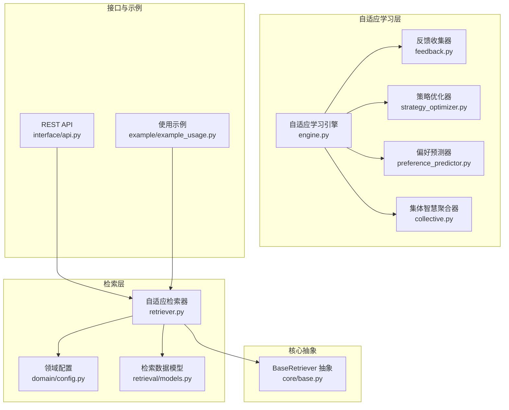
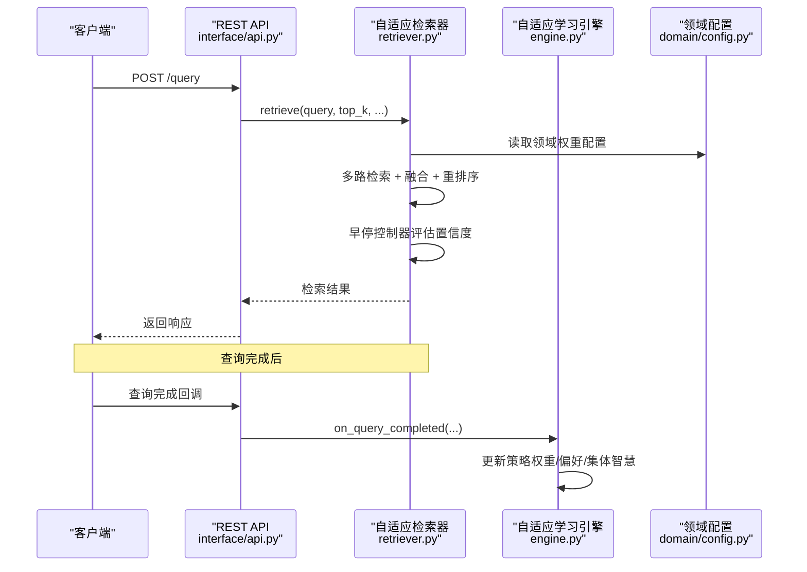
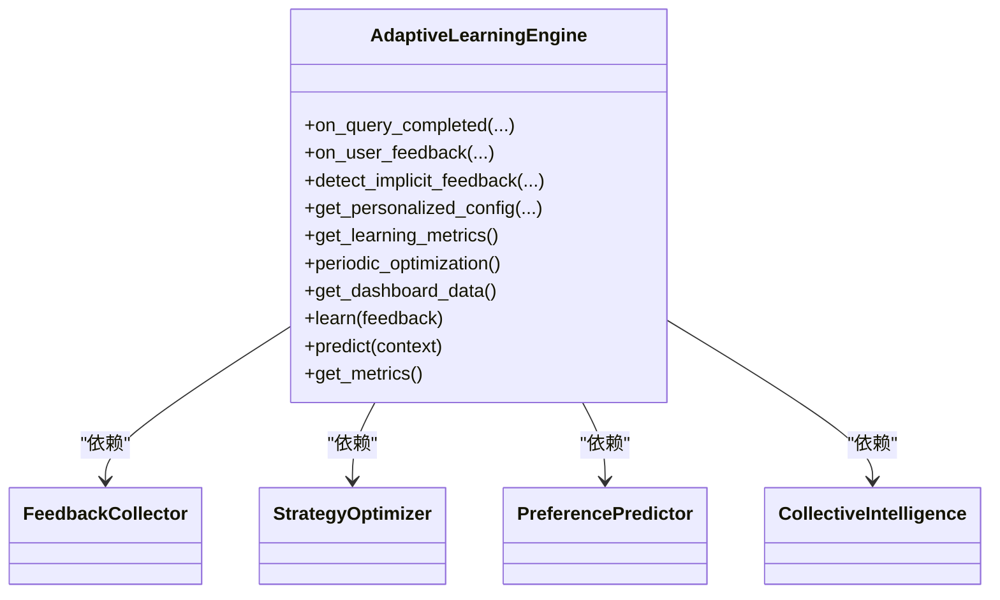
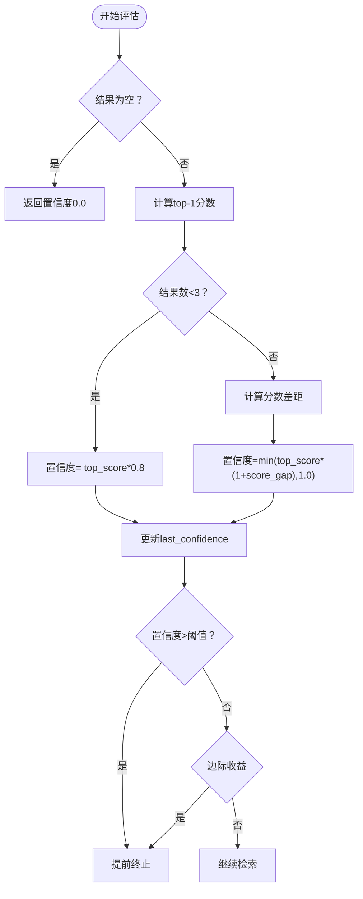
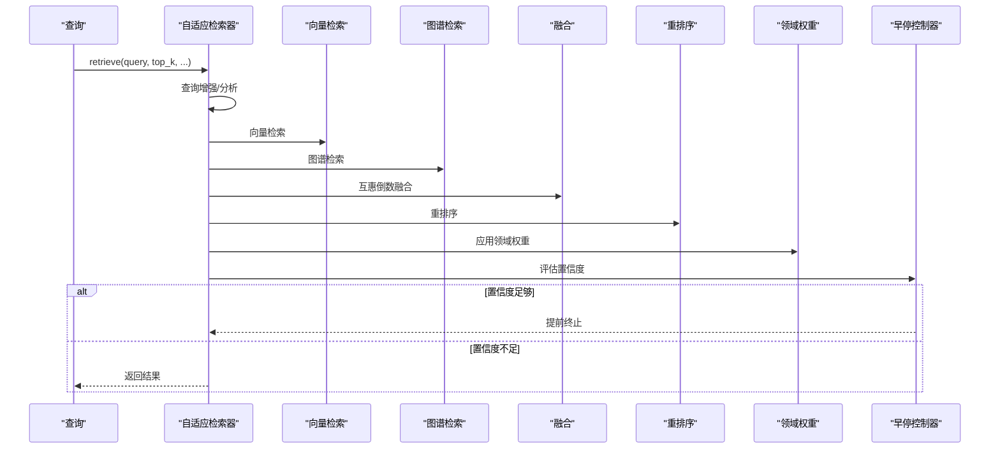
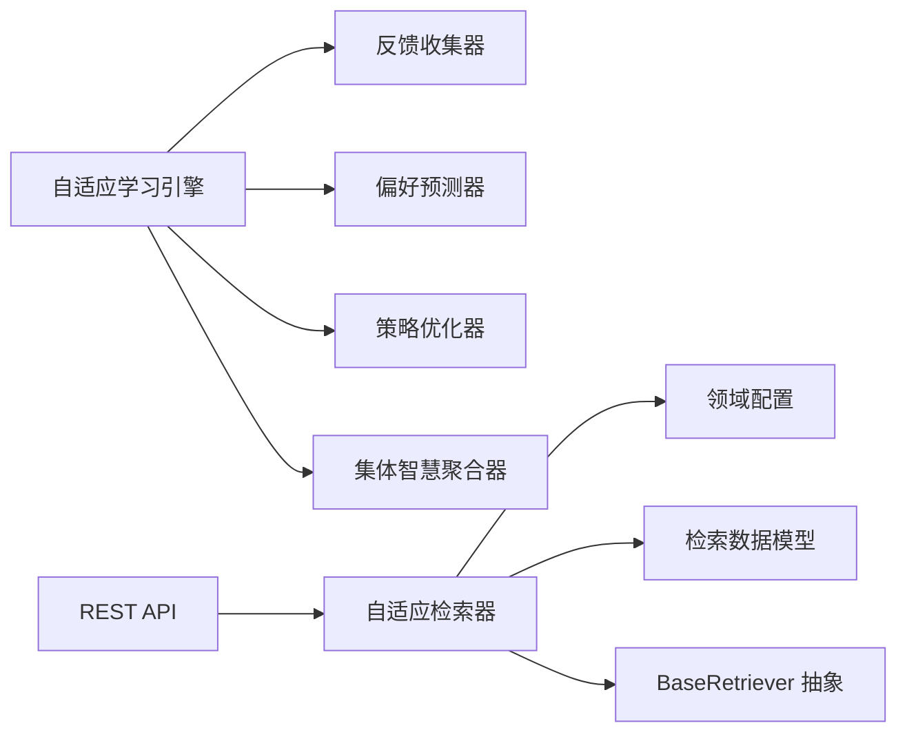

# 自适应检索器核心

<cite>
**本文档引用的文件**
- [engine.py](file://src/adaptive/engine.py)
- [collective.py](file://src/adaptive/collective.py)
- [config.py](file://src/adaptive/config.py)
- [models.py](file://src/adaptive/models.py)
- [feedback.py](file://src/adaptive/feedback.py)
- [strategy_optimizer.py](file://src/adaptive/strategy_optimizer.py)
- [preference_predictor.py](file://src/adaptive/preference_predictor.py)
- [retriever.py](file://src/retrieval/retriever.py)
- [models.py](file://src/retrieval/models.py)
- [config.py](file://src/domain/config.py)
- [base.py](file://src/core/base.py)
- [api.py](file://interface/api.py)
- [example_usage.py](file://example/example_usage.py)
</cite>

## 目录
1. [简介](#简介)
2. [项目结构](#项目结构)
3. [核心组件](#核心组件)
4. [架构总览](#架构总览)
5. [详细组件分析](#详细组件分析)
6. [依赖关系分析](#依赖关系分析)
7. [性能考量](#性能考量)
8. [故障排查指南](#故障排查指南)
9. [结论](#结论)
10. [附录](#附录)

## 简介
本文件面向“自适应检索器核心”组件，系统性阐述基于扩散激活理论的混合检索算法实现，重点包括：
- 多路检索策略（向量检索、图谱检索、全文搜索）的协调机制
- 早停控制器的智能终止策略（置信度评估、边际收益递减判断、自适应阈值）
- 查询分析器、检索路径追踪与性能优化策略
- 完整的API接口说明、配置参数详解与实际使用示例
- 错误处理机制、调试工具与性能调优指南

## 项目结构
自适应检索器位于检索层，围绕“自适应学习引擎”提供策略推荐、偏好预测与集体智慧洞察，并与感知层、记忆层、巩固层、交互层协同工作。核心文件组织如下：
- 自适应学习引擎：协调反馈收集、偏好预测、策略优化、集体智慧
- 检索器：实现多路检索、融合、重排序、领域权重、早停控制与回退搜索
- 领域配置：提供关键字、领域权重与时间衰减配置
- 接口与示例：提供REST API与使用示例

图表来源
- [engine.py:1-598](file://src/adaptive/engine.py#L1-L598)
- [retriever.py:1-644](file://src/retrieval/retriever.py#L1-L644)
- [config.py:1-285](file://src/domain/config.py#L1-L285)
- [base.py:398-444](file://src/core/base.py#L398-L444)
- [api.py:1-162](file://interface/api.py#L1-L162)
- [example_usage.py:1-252](file://example/example_usage.py#L1-L252)

章节来源
- [engine.py:1-598](file://src/adaptive/engine.py#L1-L598)
- [retriever.py:1-644](file://src/retrieval/retriever.py#L1-L644)
- [config.py:1-285](file://src/domain/config.py#L1-L285)
- [base.py:398-444](file://src/core/base.py#L398-L444)
- [api.py:1-162](file://interface/api.py#L1-L162)
- [example_usage.py:1-252](file://example/example_usage.py#L1-L252)

## 核心组件
- 自适应学习引擎：统一协调反馈收集、偏好预测、策略优化、集体智慧，提供个性化配置与学习指标
- 反馈收集器：显式/隐式反馈采集与分析，支持满意度趋势与模式识别
- 策略优化器：基于epsilon-greedy的在线策略权重学习，针对查询类型推荐最优参数
- 偏好预测器：基于用户交互历史估计专业度、兴趣领域与偏好风格
- 集体智慧聚合器：从全量用户交互中提炼知识盲区、最佳实践与趋势洞察
- 自适应检索器：多路检索、融合、重排序、领域权重、早停控制与回退搜索
- 领域配置：关键字权重、领域权重、时间衰减与相关性等级

章节来源
- [engine.py:30-598](file://src/adaptive/engine.py#L30-L598)
- [feedback.py:19-398](file://src/adaptive/feedback.py#L19-L398)
- [strategy_optimizer.py:19-401](file://src/adaptive/strategy_optimizer.py#L19-L401)
- [preference_predictor.py:21-426](file://src/adaptive/preference_predictor.py#L21-L426)
- [collective.py:26-378](file://src/adaptive/collective.py#L26-L378)
- [retriever.py:135-644](file://src/retrieval/retriever.py#L135-L644)
- [config.py:14-285](file://src/domain/config.py#L14-L285)

## 架构总览
自适应检索器通过“策略推荐 + 偏好适配 + 早停控制 + 多路融合”的闭环实现“越用越智能”。其关键流程：
- 自适应学习引擎根据查询完成事件与用户反馈，更新策略权重与用户画像
- 检索器依据个性化配置选择策略参数，执行多路检索与融合重排序
- 早停控制器基于置信度与边际收益判断是否提前终止
- 领域权重对融合结果进行加权，提升相关性
- 回退搜索在本地检索不足时自动触发网络搜索

图表来源
- [api.py:73-84](file://interface/api.py#L73-L84)
- [retriever.py:224-308](file://src/retrieval/retriever.py#L224-L308)
- [engine.py:122-196](file://src/adaptive/engine.py#L122-L196)
- [config.py:54-75](file://src/domain/config.py#L54-L75)

## 详细组件分析

### 自适应学习引擎（AdaptiveLearningEngine）
- 统一协调四个子系统：反馈收集、偏好预测、策略优化、集体智慧
- 提供查询完成学习、用户反馈处理、隐式反馈检测、个性化配置生成、学习指标与周期性优化
- 通过配置模式（默认/积极/保守/最小）快速切换学习强度

图表来源
- [engine.py:30-598](file://src/adaptive/engine.py#L30-L598)
- [feedback.py:19-398](file://src/adaptive/feedback.py#L19-L398)
- [strategy_optimizer.py:19-401](file://src/adaptive/strategy_optimizer.py#L19-L401)
- [preference_predictor.py:21-426](file://src/adaptive/preference_predictor.py#L21-L426)
- [collective.py:26-378](file://src/adaptive/collective.py#L26-L378)

章节来源
- [engine.py:30-598](file://src/adaptive/engine.py#L30-L598)

### 早停控制器（EarlyTerminationController）
- 置信度评估：基于top-1分数与分数差距，结合结果数量进行归一化
- 早停判断：固定阈值 + 边际收益递减（last_confidence递增缓慢即停止）
- 自适应阈值：根据查询长度动态调整阈值，短查询降低阈值以避免过早终止

图表来源
- [retriever.py:43-133](file://src/retrieval/retriever.py#L43-L133)

章节来源
- [retriever.py:43-133](file://src/retrieval/retriever.py#L43-L133)

### 自适应检索器（AdaptiveRetriever）
- 多路检索：向量检索、图谱检索（占位）、融合、重排序、领域权重、过滤、早停
- HyDE增强检索：生成假设文档并检索（占位）
- 多跳检索：基于图谱的多跳路径查询
- 异步检索：本地不足时触发网络搜索回退，合并去重并重新排序
- 检索路径追踪：记录每一步骤，便于调试与可视化

图表来源
- [retriever.py:224-308](file://src/retrieval/retriever.py#L224-L308)
- [retriever.py:310-360](file://src/retrieval/retriever.py#L310-L360)
- [retriever.py:43-133](file://src/retrieval/retriever.py#L43-L133)

章节来源
- [retriever.py:135-644](file://src/retrieval/retriever.py#L135-L644)

### 反馈收集器（FeedbackCollector）
- 显式反馈：点赞/踩/修正/补充/无关
- 隐式反馈：查询改写（reformulation）、连续追问（follow-up）、会话放弃
- 满意度趋势：按时间窗口前后两段对比
- 反馈模式分析：查询类型满意度、小时活跃度、修正模式、低满意度查询

章节来源
- [feedback.py:19-398](file://src/adaptive/feedback.py#L19-L398)

### 策略优化器（StrategyOptimizer）
- 默认策略模板：向量检索、混合检索、图谱增强、HyDE增强
- 在线权重更新：基于奖励（满意度-0.5）与学习率更新策略权重
- epsilon-greedy：探索率控制随机探索与利用最优策略
- 参数推荐：按查询类型微调top_k、置信度阈值、是否启用HyDE

章节来源
- [strategy_optimizer.py:19-401](file://src/adaptive/strategy_optimizer.py#L19-L401)

### 偏好预测器（PreferencePredictor）
- 专业度估计：基于查询复杂度趋势与专业术语使用
- 偏好风格：详细程度、语气（专业/友好/平衡）、兴趣领域
- 反馈驱动：根据用户评论与反馈类型调整偏好

章节来源
- [preference_predictor.py:21-426](file://src/adaptive/preference_predictor.py#L21-L426)

### 集体智慧聚合器（CollectiveIntelligence）
- 知识盲区：低满意度主题统计
- 最佳实践：高满意度查询模式与常用查询模式
- 趋势洞察：热门主题与上升趋势
- 用户画像洞察：用户群体专业度分布

章节来源
- [collective.py:26-378](file://src/adaptive/collective.py#L26-L378)

### 领域配置（DomainConfig）
- 关键字等级与权重：核心/重要/普通/边缘
- 领域相关性等级：核心/相关/边缘/领域外
- 权重系数与时间衰减：关键字、时间、领域三类因子
- 领域权重：核心/相关/边缘/领域外权重

章节来源
- [config.py:14-285](file://src/domain/config.py#L14-L285)

## 依赖关系分析
- 自适应学习引擎依赖反馈收集、偏好预测、策略优化、集体智慧模块
- 自适应检索器依赖领域配置、检索数据模型、重排序器、融合策略、HyDE增强器
- 检索器抽象接口定义于核心基类，保证实现一致性
- REST API对接知识服务，提供查询、插入、更新、删除与健康检查

图表来源
- [engine.py:30-598](file://src/adaptive/engine.py#L30-L598)
- [retriever.py:135-644](file://src/retrieval/retriever.py#L135-L644)
- [base.py:398-444](file://src/core/base.py#L398-L444)
- [api.py:1-162](file://interface/api.py#L1-162)

章节来源
- [engine.py:30-598](file://src/adaptive/engine.py#L30-L598)
- [retriever.py:135-644](file://src/retrieval/retriever.py#L135-L644)
- [base.py:398-444](file://src/core/base.py#L398-L444)
- [api.py:1-162](file://interface/api.py#L1-162)

## 性能考量
- 早停控制显著减少冗余检索成本，提高吞吐
- 多路融合与重排序在保证相关性的前提下控制输出规模
- 领域权重与时间衰减提升长期稳定性
- 异步回退搜索在本地不足时补充结果，避免阻塞
- 建议：
  - 合理设置置信度阈值与最小边际收益，避免过早或过晚终止
  - 根据查询类型动态调整top_k与阈值，提升个性化效率
  - 定期清理旧反馈与交互记录，维持内存与计算效率

[本节为通用指导，无需特定文件引用]

## 故障排查指南
- 早停过早：检查置信度评估与阈值设置；确认结果数量充足
- 结果质量差：检查融合与重排序参数；开启HyDE增强；调整领域权重
- 性能瓶颈：观察检索路径追踪；定位耗时步骤；优化top_k与阈值
- 反馈学习异常：核对反馈收集开关与历史容量；检查满意度趋势与模式分析
- 集体智慧缺失：确认洞察生成间隔与最小用户数；检查偏好预测器连接

章节来源
- [retriever.py:224-308](file://src/retrieval/retriever.py#L224-L308)
- [feedback.py:198-240](file://src/adaptive/feedback.py#L198-L240)
- [collective.py:232-322](file://src/adaptive/collective.py#L232-L322)

## 结论
自适应检索器通过“策略推荐 + 偏好适配 + 早停控制 + 多路融合 + 领域权重 + 回退搜索”的闭环，实现了高效、智能、可扩展的检索体验。配合自适应学习引擎的持续优化，系统能够不断学习用户偏好与查询模式，逐步提升检索质量与用户体验。

[本节为总结，无需特定文件引用]

## 附录

### API接口说明
- GET /health：健康检查，返回组件状态与运行时信息
- POST /query：知识查询接口，返回查询结果与证据
- POST /insert：知识插入接口
- PUT /update：知识更新接口
- DELETE /delete：知识删除接口
- GET /stats：获取知识库统计信息
- GET /suggestions/{query}：获取查询建议

章节来源
- [api.py:49-151](file://interface/api.py#L49-L151)

### 配置参数详解
- 自适应学习配置（AdaptiveLearningConfig）
  - 反馈收集：enable_feedback_collection、feedback_history_size、implicit_feedback_enabled
  - 偏好学习：enable_preference_learning、preference_update_interval、expertise_learning_rate、satisfaction_window、max_complexity_history
  - 策略优化：enable_strategy_optimization、strategy_learning_rate、min_samples_for_optimization、exploration_rate、default_strategies
  - 集体智慧：enable_collective_learning、min_users_for_insight、insight_refresh_interval、max_insights
  - 指标与交互：metrics_window_days、trend_comparison_ratio、max_interaction_history、interaction_retention_days
- 领域配置（DomainConfig）
  - 关键字等级与权重：KeywordLevel、KeywordConfig
  - 领域相关性等级：DomainLevel
  - 权重系数：keyword_factor、temporal_factor、domain_factor
  - 时间衰减：decay_rate、enable_temporal_decay
  - 领域权重：core_domain_weight、related_domain_weight、peripheral_domain_weight、out_of_domain_weight

章节来源
- [config.py:15-193](file://src/adaptive/config.py#L15-L193)
- [config.py:54-161](file://src/domain/config.py#L54-L161)

### 实际使用示例
- 完整工作流程示例：感知层编码 → 记忆层存储 → 检索层检索 → 巩固层生成与验证 → 交互层响应
- 自适应检索器使用：初始化检索器 → 执行检索 → 查看检索路径追踪

章节来源
- [example_usage.py:12-252](file://example/example_usage.py#L12-L252)