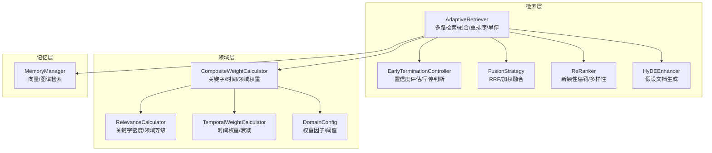
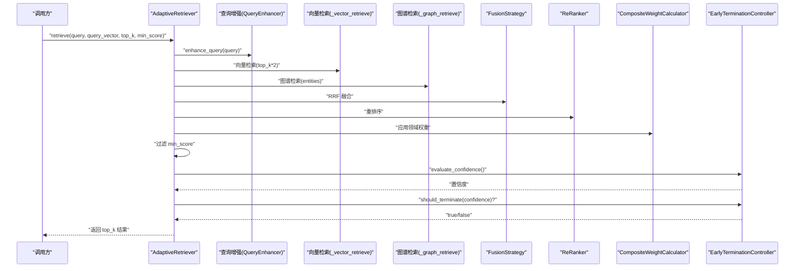
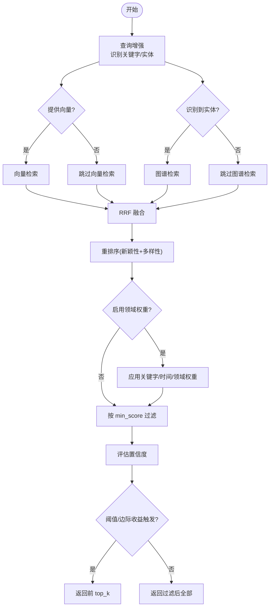
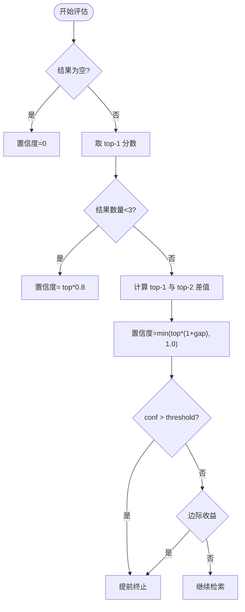
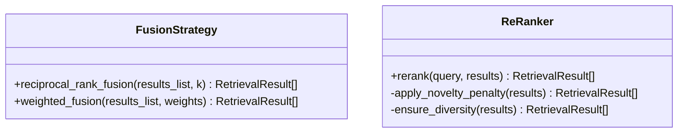
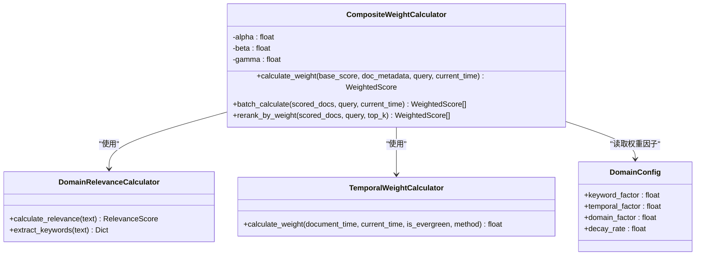
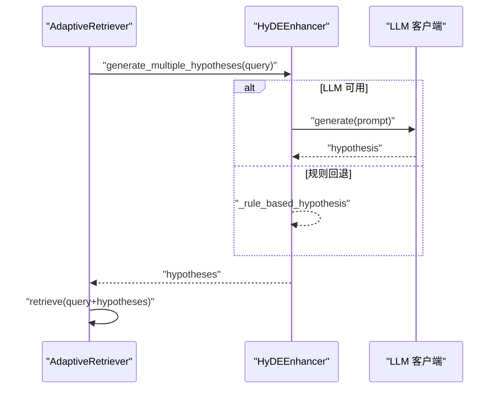
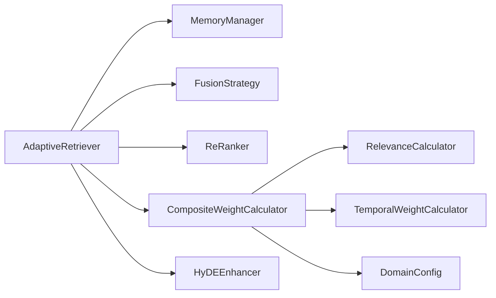

# 自适应检索算法

<cite>
**本文引用的文件**
- [retriever.py](file://src/retrieval/retriever.py)
- [fusion.py](file://src/retrieval/fusion.py)
- [reranker.py](file://src/retrieval/reranker.py)
- [models.py](file://src/retrieval/models.py)
- [weight_calculator.py](file://src/domain/weight_calculator.py)
- [config.py](file://src/domain/config.py)
- [relevance.py](file://src/domain/relevance.py)
- [temporal_weight.py](file://src/domain/temporal_weight.py)
- [hyde.py](file://src/retrieval/hyde.py)
- [models.py](file://src/memory/models.py)
- [example_usage.py](file://example/example_usage.py)
</cite>

## 目录
1. [简介](#简介)
2. [项目结构](#项目结构)
3. [核心组件](#核心组件)
4. [架构总览](#架构总览)
5. [详细组件分析](#详细组件分析)
6. [依赖关系分析](#依赖关系分析)
7. [性能考量](#性能考量)
8. [故障排查指南](#故障排查指南)
9. [结论](#结论)
10. [附录](#附录)

## 简介
本文件面向“自适应检索算法”的使用者与开发者，系统化阐述 AdaptiveRetriever 的实现与工作机制，覆盖多路检索策略（向量检索、图谱检索）、查询分析机制、结果融合与重排序、领域权重计算、以及早停机制（EarlyTerminationController）。同时给出检索参数调优建议、自适应阈值计算思路、边际收益递减策略说明，并提供检索路径追踪的使用方法与调试技巧。

## 项目结构
与自适应检索相关的核心模块位于 src/retrieval 与 src/domain，配合 src/memory 提供底层存储与检索能力。整体采用“分层职责”组织：感知层负责文本编码与向量化；记忆层提供向量与图谱检索；检索层实现多路融合、重排序与早停；领域层提供关键字、时间与领域相关性权重计算。

图表来源
- [retriever.py:122-254](file://src/retrieval/retriever.py#L122-L254)
- [fusion.py:9-71](file://src/retrieval/fusion.py#L9-L71)
- [reranker.py:10-71](file://src/retrieval/reranker.py#L10-L71)
- [weight_calculator.py:56-147](file://src/domain/weight_calculator.py#L56-L147)
- [relevance.py:29-242](file://src/domain/relevance.py#L29-L242)
- [temporal_weight.py:47-196](file://src/domain/temporal_weight.py#L47-L196)
- [config.py:54-161](file://src/domain/config.py#L54-L161)
- [models.py:19-31](file://src/memory/models.py#L19-L31)

章节来源
- [retriever.py:122-254](file://src/retrieval/retriever.py#L122-L254)
- [fusion.py:9-71](file://src/retrieval/fusion.py#L9-L71)
- [reranker.py:10-71](file://src/retrieval/reranker.py#L10-L71)
- [weight_calculator.py:56-147](file://src/domain/weight_calculator.py#L56-L147)
- [relevance.py:29-242](file://src/domain/relevance.py#L29-L242)
- [temporal_weight.py:47-196](file://src/domain/temporal_weight.py#L47-L196)
- [config.py:54-161](file://src/domain/config.py#L54-L161)
- [models.py:19-31](file://src/memory/models.py#L19-L31)

## 核心组件
- AdaptiveRetriever：自适应检索器，集成多路检索、结果融合、重排序、领域权重与早停控制。
- EarlyTerminationController：早停控制器，基于置信度阈值与边际收益递减策略决定是否提前返回。
- FusionStrategy：结果融合策略，支持 RRF 与加权融合。
- ReRanker：重排序器，应用新颖性惩罚与多样性保障。
- CompositeWeightCalculator：综合权重计算器，整合关键字、时间与领域权重。
- DomainConfig/DomainRelevanceCalculator/TemporalWeightCalculator：领域配置与相关性、时间权重计算。
- HyDEEnhancer：假设文档增强器，生成假设性文档以提升检索质量。
- RetrievalResult/QueryAnalysis：检索结果与查询分析的数据模型。

章节来源
- [retriever.py:122-254](file://src/retrieval/retriever.py#L122-L254)
- [models.py:9-29](file://src/retrieval/models.py#L9-L29)
- [weight_calculator.py:56-147](file://src/domain/weight_calculator.py#L56-L147)
- [config.py:54-161](file://src/domain/config.py#L54-L161)
- [relevance.py:29-242](file://src/domain/relevance.py#L29-L242)
- [temporal_weight.py:47-196](file://src/domain/temporal_weight.py#L47-L196)
- [hyde.py:17-84](file://src/retrieval/hyde.py#L17-L84)

## 架构总览
AdaptiveRetriever 的检索流程由“查询增强—查询分析—多路检索—结果融合—重排序—领域权重—过滤—早停判断—返回结果”构成。其中：
- 多路检索：向量检索（基于语义记忆）与图谱检索（基于实体识别）。
- 融合：采用 RRF（倒数排名融合）统一不同来源的排序信号。
- 重排序：应用新颖性惩罚与多样性策略，避免重复与单调。
- 领域权重：根据关键字相关性、时间衰减与领域权重综合调整分数。
- 早停：基于置信度阈值与边际收益递减策略，减少不必要的计算。

图表来源
- [retriever.py:177-254](file://src/retrieval/retriever.py#L177-L254)
- [fusion.py:18-71](file://src/retrieval/fusion.py#L18-L71)
- [reranker.py:41-71](file://src/retrieval/reranker.py#L41-L71)
- [weight_calculator.py:81-147](file://src/domain/weight_calculator.py#L81-L147)
- [relevance.py:276-306](file://src/domain/relevance.py#L276-L306)
- [temporal_weight.py:160-196](file://src/domain/temporal_weight.py#L160-L196)

## 详细组件分析

### AdaptiveRetriever 类
- 多路检索策略
  - 向量检索：当提供 query_vector 时，调用语义记忆进行相似度搜索，返回候选结果。
  - 图谱检索：当查询分析识别出实体时，调用图谱进行实体关联检索。
- 结果融合：采用 RRF 将不同来源的结果按排名位置加权融合，再按融合分数排序。
- 重排序：应用新颖性惩罚（抑制与已选结果重复的内容）与多样性策略（MMR-like），提升结果丰富度。
- 领域权重：若启用且可用，对每个候选结果计算关键字相关性、时间权重与领域权重，综合调整分数并记录权重明细。
- 过滤与早停：先按 min_score 过滤，再评估置信度，若达到阈值或边际收益过低则提前返回，否则返回完整候选集的前 top_k。

图表来源
- [retriever.py:177-254](file://src/retrieval/retriever.py#L177-L254)
- [fusion.py:18-71](file://src/retrieval/fusion.py#L18-L71)
- [reranker.py:41-71](file://src/retrieval/reranker.py#L41-L71)
- [weight_calculator.py:81-147](file://src/domain/weight_calculator.py#L81-L147)

章节来源
- [retriever.py:122-254](file://src/retrieval/retriever.py#L122-L254)
- [models.py:9-29](file://src/retrieval/models.py#L9-L29)

### EarlyTerminationController 早停机制
- 置信度评估
  - 基于 top-1 与 top-2 分数差、结果数量等综合计算置信度，避免样本过少导致误判。
- 早停条件
  - 固定阈值：置信度超过阈值即提前终止。
  - 边际收益递减：若连续两次置信度提升幅度低于阈值，则认为边际收益不足，提前终止。
- 自适应阈值
  - 基于查询长度动态调整阈值，短查询降低阈值以避免过早终止。

图表来源
- [retriever.py:55-101](file://src/retrieval/retriever.py#L55-L101)

章节来源
- [retriever.py:30-120](file://src/retrieval/retriever.py#L30-L120)

### 结果融合与重排序
- RRF 融合
  - 对每个 memory_id 的排名位置进行倒数加权求和，再按融合分数排序。
- 加权融合
  - 支持为不同来源结果列表分配权重，按分数加权累加后排序。
- 重排序
  - 新颖性惩罚：与已选结果的重复度越高，分数越低。
  - 多样性保障：采用类似 MMR 的策略，在相关性与与已选结果相似度之间折中选择。

图表来源
- [fusion.py:9-128](file://src/retrieval/fusion.py#L9-L128)
- [reranker.py:10-179](file://src/retrieval/reranker.py#L10-L179)

章节来源
- [fusion.py:9-128](file://src/retrieval/fusion.py#L9-L128)
- [reranker.py:10-179](file://src/retrieval/reranker.py#L10-L179)

### 领域权重计算
- 综合权重公式
  - final_score = base_score × (α × keyword_weight) × (β × temporal_weight) × (γ × domain_weight) × custom_weight
- 关键字权重
  - 基于关键字等级与密度计算，限制在合理区间。
- 时间权重
  - 支持分层权重与指数衰减两种策略，常青内容不受衰减影响。
- 领域权重
  - 基于关键字匹配与领域等级映射得到权重乘数。
- 权重明细
  - 将关键字、时间、领域权重与基础分数写入结果元数据，便于调试与可视化。

图表来源
- [weight_calculator.py:56-147](file://src/domain/weight_calculator.py#L56-L147)
- [relevance.py:29-242](file://src/domain/relevance.py#L29-L242)
- [temporal_weight.py:47-196](file://src/domain/temporal_weight.py#L47-L196)
- [config.py:54-161](file://src/domain/config.py#L54-L161)

章节来源
- [weight_calculator.py:56-147](file://src/domain/weight_calculator.py#L56-L147)
- [relevance.py:29-242](file://src/domain/relevance.py#L29-L242)
- [temporal_weight.py:47-196](file://src/domain/temporal_weight.py#L47-L196)
- [config.py:54-161](file://src/domain/config.py#L54-L161)

### HyDE 增强检索
- 功能概述
  - 通过 LLM 生成假设性答案文档，作为检索目标，提升检索质量。
- 关键流程
  - 生成假设文档（可多条）。
  - 可选获取假设文档向量（需 LLM 客户端）。
  - 将原始查询与假设文档组合参与检索。
- 回退机制
  - 若未提供 LLM 客户端，使用规则模板生成假设文档。

图表来源
- [hyde.py:58-171](file://src/retrieval/hyde.py#L58-L171)
- [retriever.py:307-332](file://src/retrieval/retriever.py#L307-L332)

章节来源
- [hyde.py:17-213](file://src/retrieval/hyde.py#L17-L213)
- [retriever.py:307-332](file://src/retrieval/retriever.py#L307-L332)

### 查询分析与实体识别
- 当前实现
  - 最小实现：返回查询类型与复杂度，实体列表为空。
- 建议扩展
  - 引入意图分类与命名实体识别（NER），抽取实体并增强查询关键词，提高图谱检索命中率。

章节来源
- [retriever.py:374-392](file://src/retrieval/retriever.py#L374-L392)

### 检索路径追踪与调试
- 追踪功能
  - 每次检索会记录关键步骤（如向量/图谱检索结果数、融合、重排序、领域权重应用、早停决策等）。
- 使用方法
  - 调用 get_retrieval_trace() 获取步骤列表，逐条检查各阶段结果规模与置信度变化，定位瓶颈或异常。
- 调试技巧
  - 逐步缩小范围：先确认向量检索是否返回足够候选，再检查图谱检索与融合效果。
  - 关注置信度曲线：若置信度持续低且边际收益递减，可适当放宽阈值或增加 top_k 倍数。

章节来源
- [retriever.py:162-164](file://src/retrieval/retriever.py#L162-L164)
- [retriever.py:365-373](file://src/retrieval/retriever.py#L365-L373)

## 依赖关系分析
- 组件耦合
  - AdaptiveRetriever 依赖 MemoryManager（向量检索）、FusionStrategy（融合）、ReRanker（重排序）、CompositeWeightCalculator（领域权重）、HyDEEnhancer（可选）。
  - 领域权重模块内部依赖 DomainConfig、DomainRelevanceCalculator、TemporalWeightCalculator。
- 外部依赖
  - ReRanker 与 HyDEEnhancer 的具体实现留有 TODO，当前为占位逻辑，实际部署需接入相应模型或客户端。
- 循环依赖
  - 模块间采用单向依赖，无循环导入风险。

图表来源
- [retriever.py:129-161](file://src/retrieval/retriever.py#L129-L161)
- [weight_calculator.py:56-80](file://src/domain/weight_calculator.py#L56-L80)

章节来源
- [retriever.py:129-161](file://src/retrieval/retriever.py#L129-L161)
- [weight_calculator.py:56-80](file://src/domain/weight_calculator.py#L56-L80)

## 性能考量
- 多路检索成本
  - 向量检索与图谱检索均可能产生大量候选，建议在向量检索阶段使用 top_k 的倍数扩大候选池，再通过融合与重排序筛选高质量结果。
- 融合与重排序开销
  - RRF 的时间复杂度与候选数量线性相关；重排序中的新颖性惩罚与多样性策略会引入额外计算，建议在 top_k 较小时优先保证质量。
- 早停收益
  - 早停可显著减少后续重排序与领域权重计算的成本，尤其在置信度较高时效果明显。
- 领域权重计算
  - 关键字匹配与时间权重计算为 O(N) 级别，通常可忽略；若文档数量极大，建议在上游阶段先做粗筛。

[本节为通用性能讨论，无需章节来源]

## 故障排查指南
- 症状：检索结果为空或极少
  - 检查向量检索是否传入 query_vector；确认 MemoryManager 的语义记忆是否已填充。
  - 检查图谱检索是否识别到实体；若实体为空，图谱检索会被跳过。
- 症状：置信度始终偏低
  - 降低 EarlyTerminationController 的阈值或最小边际收益；检查融合与重排序参数。
  - 检查领域权重配置是否过于保守（如 domain_factor、temporal_factor 过小）。
- 症状：结果重复或缺乏多样性
  - 调整 ReRanker 的新颖性惩罚与多样性权重；适当增大 top_k 倍数以提供更多候选。
- 症状：HyDE 未生效
  - 确认 enable_hyde 与 LLM 客户端可用；若不可用，HyDEEnhancer 将回退到规则生成，效果有限。

章节来源
- [retriever.py:177-254](file://src/retrieval/retriever.py#L177-L254)
- [reranker.py:41-71](file://src/retrieval/reranker.py#L41-L71)
- [weight_calculator.py:81-147](file://src/domain/weight_calculator.py#L81-L147)
- [hyde.py:38-49](file://src/retrieval/hyde.py#L38-L49)

## 结论
AdaptiveRetriever 通过“多路检索 + 融合 + 重排序 + 领域权重 + 早停”的流水线设计，实现了在保证质量的同时高效利用计算资源的目标。EarlyTerminationController 的置信度评估与边际收益递减策略有效降低了无效计算；领域权重计算提供了可解释、可调的加权机制；HyDE 增强进一步提升了检索质量。建议在生产环境中结合检索路径追踪与参数调优，持续监控置信度与结果质量，以获得最佳平衡。

[本节为总结性内容，无需章节来源]

## 附录

### 检索参数调优指南
- top_k
  - 控制最终返回数量；建议与融合/重排序阶段的候选池大小（如 top_k*2）配合使用，确保高质量候选充足。
- min_score
  - 过滤低质量候选，建议结合领域权重与重排序后的分数分布设定。
- confidence_threshold
  - 早停阈值，建议从 0.85 开始，根据置信度曲线与业务需求调整。
- min_gain
  - 边际收益阈值，用于防止过早终止；建议从 0.05 开始，观察置信度提升趋势。
- novelty_weight/diversity_weight/redundancy_penalty
  - 重排序参数，建议从默认值开始，逐步调整以平衡新颖性与多样性。
- domain_factor/temporal_factor/keyword_factor
  - 领域权重因子，建议通过 A/B 测试对比不同组合的效果。

章节来源
- [retriever.py:129-151](file://src/retrieval/retriever.py#L129-L151)
- [reranker.py:20-39](file://src/retrieval/reranker.py#L20-L39)
- [weight_calculator.py:76-80](file://src/domain/weight_calculator.py#L76-L80)

### 使用示例与最佳实践
- 基本使用
  - 参考示例脚本，初始化 AdaptiveRetriever 并传入 MemoryManager、查询向量与 top_k。
- 检索路径追踪
  - 使用 get_retrieval_trace() 输出每一步骤的统计信息，辅助定位问题。
- HyDE 增强
  - 在复杂查询或模糊查询场景下启用 HyDE，提升检索召回。

章节来源
- [example_usage.py:94-136](file://example/example_usage.py#L94-L136)
- [retriever.py:365-373](file://src/retrieval/retriever.py#L365-L373)
- [hyde.py:17-84](file://src/retrieval/hyde.py#L17-L84)