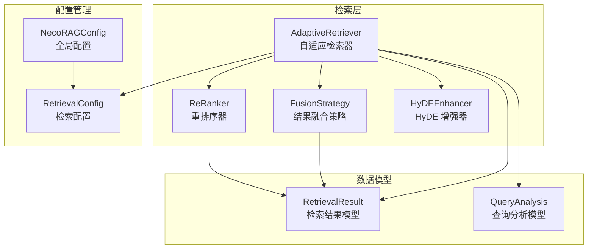
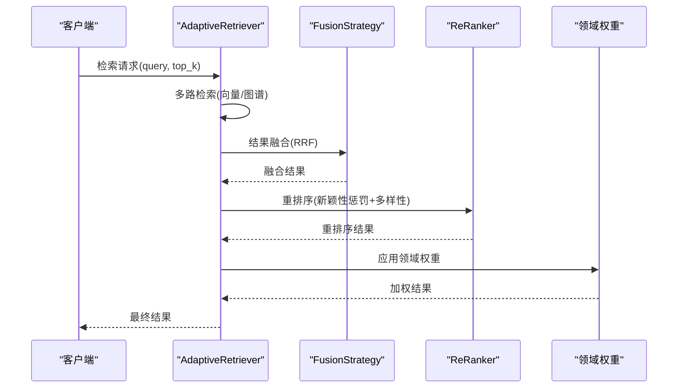
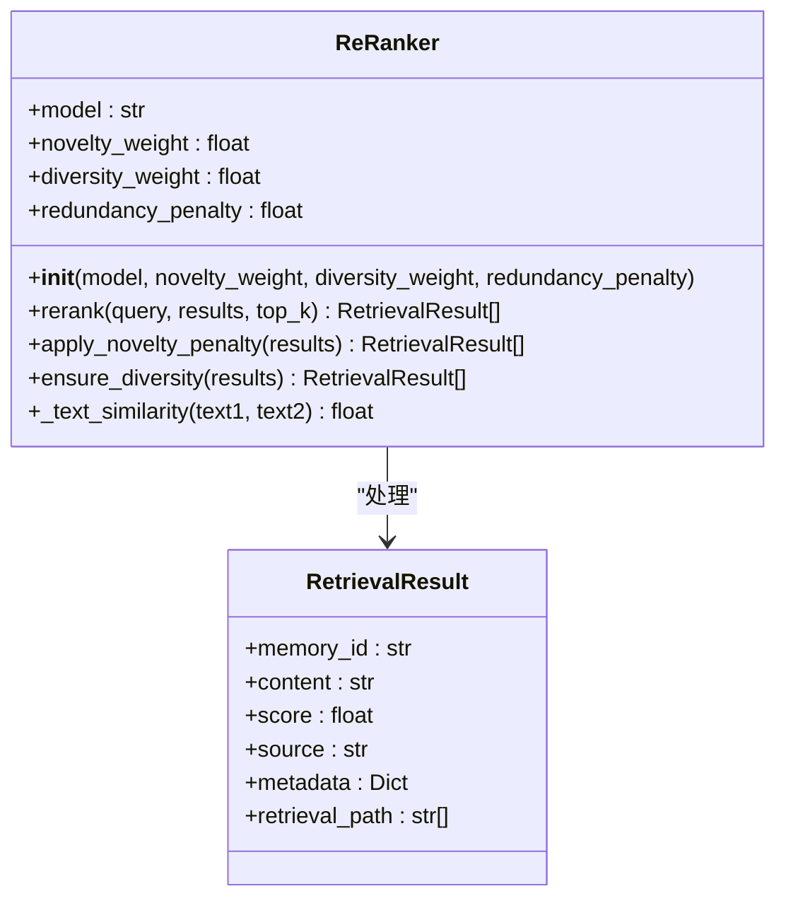
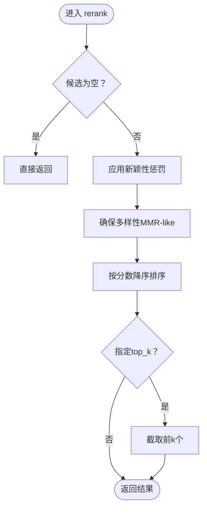
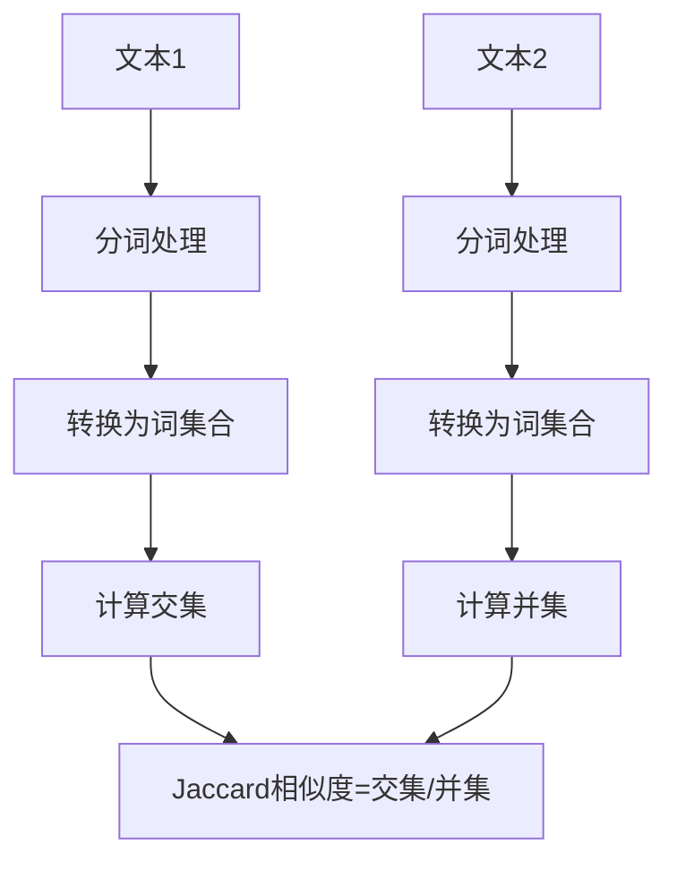
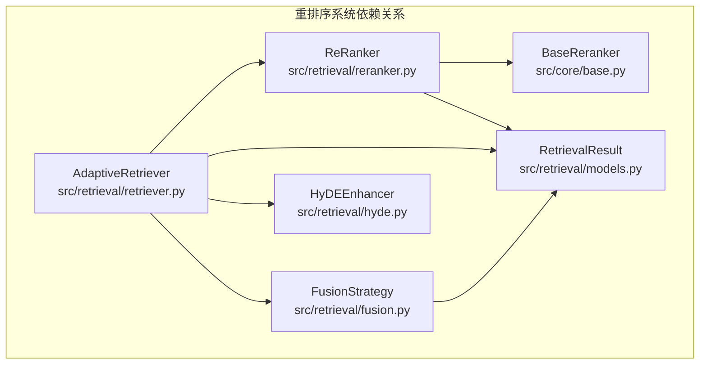
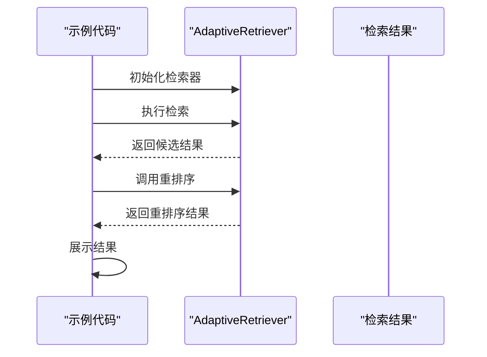

# 重排序系统

<cite>
**本文引用的文件**
- [src/retrieval/reranker.py](file://src/retrieval/reranker.py)
- [src/retrieval/models.py](file://src/retrieval/models.py)
- [src/retrieval/fusion.py](file://src/retrieval/fusion.py)
- [src/retrieval/retriever.py](file://src/retrieval/retriever.py)
- [src/retrieval/hyde.py](file://src/retrieval/hyde.py)
- [src/core/base.py](file://src/core/base.py)
- [src/core/config.py](file://src/core/config.py)
- [example/example_usage.py](file://example/example_usage.py)
- [wiki/wiki/检索引擎模块/重排序系统.md](file://wiki/wiki/检索引擎模块/重排序系统.md)
</cite>

## 目录
1. [简介](#简介)
2. [项目结构](#项目结构)
3. [核心组件](#核心组件)
4. [架构总览](#架构总览)
5. [详细组件分析](#详细组件分析)
6. [依赖关系分析](#依赖关系分析)
7. [性能考量](#性能考量)
8. [故障排查指南](#故障排查指南)
9. [结论](#结论)
10. [附录](#附录)

## 简介
本文件围绕重排序系统展开，重点解释 ReRanker 类的实现原理与使用方式，涵盖以下方面：
- 重排序模型的选择与配置（如 BGE-Reranker-v2 的集成现状与参数）
- 相似度计算方法与排序算法（新颖性惩罚、多样性保障、排序策略）
- 不同重排序模型的特点与适用场景（结合现有实现与参数说明）
- 特征工程与分数计算逻辑（基于文本相似度与 MMR-like 策略）
- 参数调优指南（模型选择策略、阈值设置、性能优化技巧）
- 重排序前后结果对比的可视化示例与效果评估方法

## 项目结构
重排序系统位于检索层，与融合策略、检索器、HyDE 增强器共同组成完整的检索管线。核心文件包括：
- 重排序器实现：src/retrieval/reranker.py
- 数据模型定义：src/retrieval/models.py
- 结果融合策略：src/retrieval/fusion.py
- 自适应检索器：src/retrieval/retriever.py
- HyDE 增强器：src/retrieval/hyde.py
- 抽象基类定义：src/core/base.py
- 配置管理：src/core/config.py
- 使用示例：example/example_usage.py



**图表来源**
- [src/retrieval/retriever.py:135-182](file://src/retrieval/retriever.py#L135-L182)
- [src/retrieval/fusion.py:9-128](file://src/retrieval/fusion.py#L9-L128)
- [src/retrieval/reranker.py:11-186](file://src/retrieval/reranker.py#L11-L186)
- [src/retrieval/models.py:9-29](file://src/retrieval/models.py#L9-L29)
- [src/core/config.py:160-193](file://src/core/config.py#L160-L193)

**章节来源**
- [src/retrieval/retriever.py:135-182](file://src/retrieval/retriever.py#L135-L182)
- [src/retrieval/fusion.py:9-128](file://src/retrieval/fusion.py#L9-L128)
- [src/retrieval/reranker.py:11-186](file://src/retrieval/reranker.py#L11-L186)
- [src/retrieval/models.py:9-29](file://src/retrieval/models.py#L9-L29)
- [src/core/config.py:160-193](file://src/core/config.py#L160-L193)

## 核心组件
重排序系统的核心组件包括：
- ReRanker：重排序器，负责新颖性惩罚、多样性保障与最终排序
- FusionStrategy：结果融合策略，支持 RRF 和加权融合
- AdaptiveRetriever：自适应检索器，整合多路检索与重排序
- RetrievalResult：检索结果数据模型
- HyDEEnhancer：假设文档嵌入增强器

**章节来源**
- [src/retrieval/reranker.py:11-186](file://src/retrieval/reranker.py#L11-L186)
- [src/retrieval/fusion.py:9-128](file://src/retrieval/fusion.py#L9-L128)
- [src/retrieval/retriever.py:135-182](file://src/retrieval/retriever.py#L135-L182)
- [src/retrieval/models.py:9-29](file://src/retrieval/models.py#L9-L29)
- [src/retrieval/hyde.py:17-213](file://src/retrieval/hyde.py#L17-L213)

## 架构总览
重排序系统在检索流程中的位置与作用机制：



**图表来源**
- [src/retrieval/retriever.py:224-308](file://src/retrieval/retriever.py#L224-L308)
- [src/retrieval/fusion.py:18-70](file://src/retrieval/fusion.py#L18-L70)
- [src/retrieval/reranker.py:42-77](file://src/retrieval/reranker.py#L42-L77)

重排序系统的核心价值在于：
- **提升检索质量**：通过新颖性惩罚避免重复，通过多样性保障提供丰富视角
- **优化用户体验**：减少用户在结果中的重复阅读，提高信息获取效率
- **增强系统鲁棒性**：对噪声输入具有更好的稳定性

## 详细组件分析

### ReRanker 类详解
ReRanker 是重排序系统的核心，负责对候选集进行新颖性惩罚、多样性保障与最终排序。其主要方法包括：
- 初始化：接收模型名称、新颖性权重、多样性权重与冗余惩罚系数
- rerank：主流程，依次应用新颖性惩罚、多样性保障，再按分数排序
- apply_novelty_penalty：基于文本相似度计算冗余度，对候选分数施加惩罚
- ensure_diversity：采用类似 MMR 的贪心策略，最大化相关性与多样性的平衡
- _text_similarity：当前实现为 Jaccard 相似度，未来可替换为更精确的语义相似度



**图表来源**
- [src/retrieval/reranker.py:11-186](file://src/retrieval/reranker.py#L11-L186)
- [src/retrieval/models.py:9-29](file://src/retrieval/models.py#L9-L29)

重排序算法流程：



**图表来源**
- [src/retrieval/reranker.py:42-77](file://src/retrieval/reranker.py#L42-L77)

**章节来源**
- [src/retrieval/reranker.py:11-186](file://src/retrieval/reranker.py#L11-L186)
- [src/retrieval/models.py:9-29](file://src/retrieval/models.py#L9-L29)

### 相似度计算与排序算法
- 文本相似度：当前实现为 Jaccard 相似度（基于词集合），简单高效但缺乏语义理解能力
- 新颖性惩罚：对每个候选与其已选候选的历史进行相似度求和，按平均冗余度施加线性惩罚
- 多样性保障：采用贪心式 MMR-like 策略，最大化 relevance 与 max_similarity 的加权差
- 排序：最终按分数降序排列

相似度计算流程：



**图表来源**
- [src/retrieval/reranker.py:162-185](file://src/retrieval/reranker.py#L162-L185)

**章节来源**
- [src/retrieval/reranker.py:79-185](file://src/retrieval/reranker.py#L79-L185)

### 配置参数与调优指南
重排序系统的关键配置参数：

| 参数类别 | 参数名 | 默认值 | 说明 |
|---------|--------|--------|------|
| 重排序器 | model | "BGE-Reranker-v2" | 模型名称 |
| 重排序器 | novelty_weight | 0.3 | 新颖性权重 |
| 重排序器 | diversity_weight | 0.2 | 多样性权重 |
| 重排序器 | redundancy_penalty | 0.4 | 冗余惩罚系数 |
| 检索配置 | enable_rerank | True | 是否启用重排序 |
| 检索配置 | rerank_top_k | 20 | 重排序候选数量 |
| 检索配置 | novelty_penalty | 0.1 | 新颖性惩罚强度 |

参数调优建议：
- **新颖性权重**：对于重复敏感场景（如问答系统）可适当提高
- **多样性权重**：对于探索性查询（如研究综述）可适当提高
- **冗余惩罚**：对于短查询可适当降低，避免过度惩罚

**章节来源**
- [src/retrieval/reranker.py:21-40](file://src/retrieval/reranker.py#L21-L40)
- [src/core/config.py:177-181](file://src/core/config.py#L177-L181)

### 与传统 BM25 算法的对比分析
重排序系统与传统 BM25 算法的对比：

| 特性 | BM25 | 重排序系统 |
|------|------|------------|
| 相似度计算 | 基于词频统计 | 基于语义相似度 |
| 上下文理解 | 有限 | 更好 |
| 多样性控制 | 需要额外策略 | 内置 MMR-like 策略 |
| 计算复杂度 | 低 | 中等 |
| 个性化能力 | 有限 | 更强 |
| 集成难度 | 简单 | 需要额外组件 |

迁移指南：
1. **从 BM25 迁移到重排序系统**：
   - 保留 BM25 的基础分数作为初始分数
   - 在重排序阶段应用新颖性惩罚和多样性策略
   - 根据业务需求调整权重参数

2. **混合策略**：
   ```python
   # 保留 BM25 分数作为基础分数
   base_score = bm25_score
   
   # 应用重排序器的改进
   improved_score = base_score * (1 + diversity_bonus) * (1 - novelty_penalty)
   ```

**章节来源**
- [src/retrieval/reranker.py:162-185](file://src/retrieval/reranker.py#L162-L185)
- [src/retrieval/retriever.py:224-308](file://src/retrieval/retriever.py#L224-L308)

## 依赖关系分析



**图表来源**
- [src/retrieval/reranker.py:6-8](file://src/retrieval/reranker.py#L6-L8)
- [src/core/base.py:422-443](file://src/core/base.py#L422-L443)
- [src/retrieval/retriever.py:14-24](file://src/retrieval/retriever.py#L14-L24)

依赖关系特点：
- **低耦合**：ReRanker 仅依赖抽象基类和数据模型
- **高内聚**：重排序逻辑集中在单一类中
- **可替换性**：通过 BaseReranker 抽象基类支持模型替换

**章节来源**
- [src/retrieval/reranker.py:6-8](file://src/retrieval/reranker.py#L6-L8)
- [src/core/base.py:422-443](file://src/core/base.py#L422-L443)
- [src/retrieval/retriever.py:14-24](file://src/retrieval/retriever.py#L14-L24)

## 性能考量
重排序系统的性能特征与优化建议：

### 时间复杂度分析
- **新颖性惩罚**：O(n²)，其中 n 为候选数量
- **多样性保障**：O(n²)，MMR-like 贪心策略
- **整体复杂度**：O(n²)

### 优化策略
1. **早期停止**：当候选数量较少时跳过重排序
2. **近似相似度**：使用哈希签名或局部敏感哈希加速相似度计算
3. **批处理优化**：对相似度矩阵进行向量化计算
4. **缓存机制**：缓存已计算的相似度值

### 性能监控
- **重排序耗时**：监控重排序阶段的执行时间
- **候选数量**：跟踪输入候选数量对性能的影响
- **相似度计算频率**：监控相似度计算的调用频率

**章节来源**
- [src/retrieval/reranker.py:95-114](file://src/retrieval/reranker.py#L95-L114)
- [src/retrieval/reranker.py:136-160](file://src/retrieval/reranker.py#L136-L160)

## 故障排查指南
常见问题与解决方案：

### 重排序结果异常
1. **重复结果过多**
   - 检查 novelty_weight 参数设置
   - 确认 _text_similarity 实现正确
   - 验证候选去重逻辑

2. **多样性不足**
   - 提高 diversity_weight 参数
   - 检查相似度计算准确性
   - 调整 MMR 策略参数

### 性能问题
1. **重排序耗时过长**
   - 减少候选数量（rerank_top_k）
   - 实施早期停止策略
   - 考虑近似相似度算法

2. **内存使用过高**
   - 限制候选数量
   - 实施结果截断
   - 优化相似度计算缓存

### 配置问题
1. **模型参数不生效**
   - 检查配置文件加载顺序
   - 验证环境变量覆盖
   - 确认参数传递链路

**章节来源**
- [src/retrieval/reranker.py:21-40](file://src/retrieval/reranker.py#L21-L40)
- [src/core/config.py:338-377](file://src/core/config.py#L338-L377)

## 结论
重排序系统通过新颖性惩罚和多样性保障，在保持检索质量的同时显著提升了用户体验。其基于 Jaccard 相似度的实现虽然简单，但在大多数场景下能够提供良好的效果。随着业务需求的发展，系统具备良好的扩展性，可以通过以下方式进一步优化：

1. **模型升级**：从 Jaccard 相似度升级到语义相似度计算
2. **算法优化**：引入更高效的相似度计算算法
3. **性能优化**：实施批处理和缓存机制
4. **智能调参**：基于历史数据自动调整参数

重排序系统作为检索流程中的关键环节，为整个 NecoRAG 框架提供了强大的质量保障能力。

## 附录

### 使用示例
完整的重排序系统使用流程：



**图表来源**
- [example/example_usage.py:94-136](file://example/example_usage.py#L94-L136)
- [src/retrieval/retriever.py:224-308](file://src/retrieval/retriever.py#L224-L308)

### 配置示例
重排序相关配置的关键参数：
- enable_rerank：控制是否启用重排序功能
- rerank_top_k：控制重排序阶段的候选数量
- novelty_penalty：控制新颖性惩罚强度
- diversity_weight：控制多样性权重

这些配置参数直接影响重排序的效果和性能表现，需要根据具体业务场景进行调优。

**章节来源**
- [example/example_usage.py:94-136](file://example/example_usage.py#L94-L136)
- [src/core/config.py:177-181](file://src/core/config.py#L177-L181)