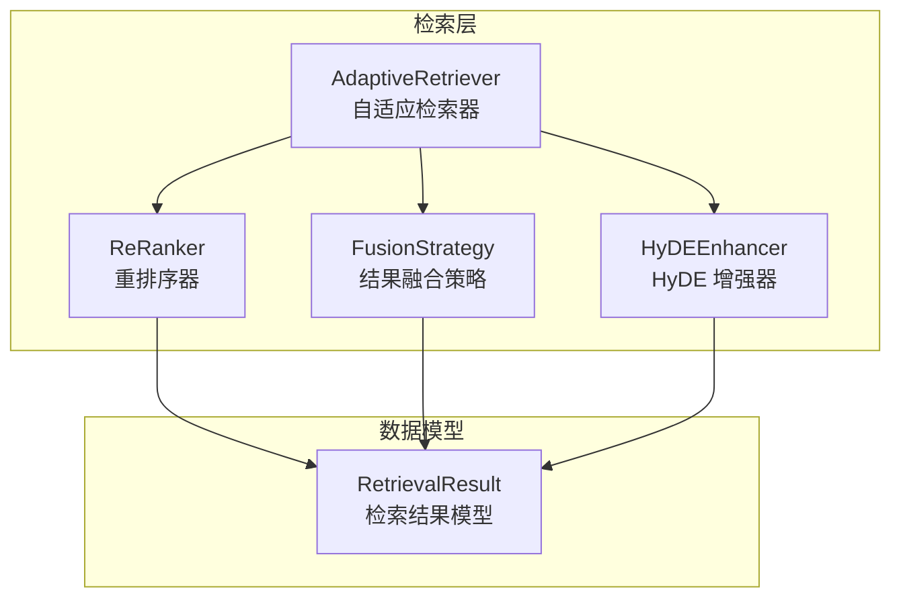
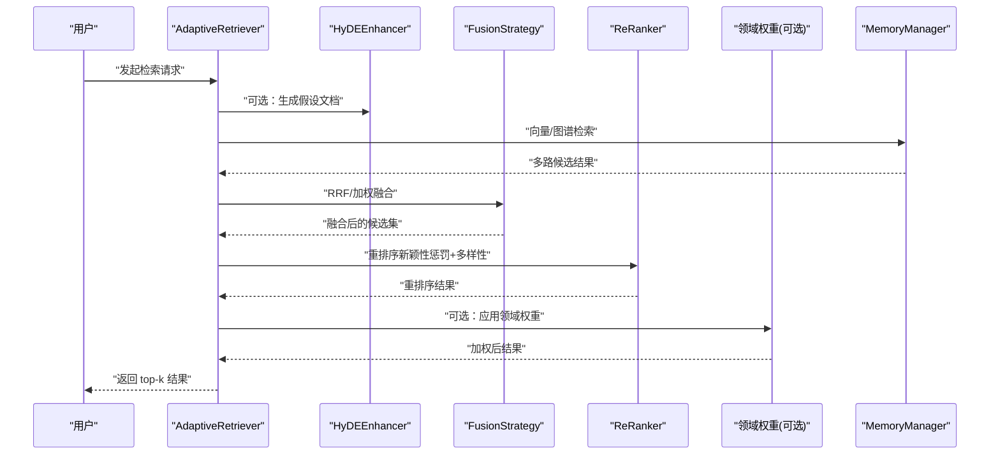
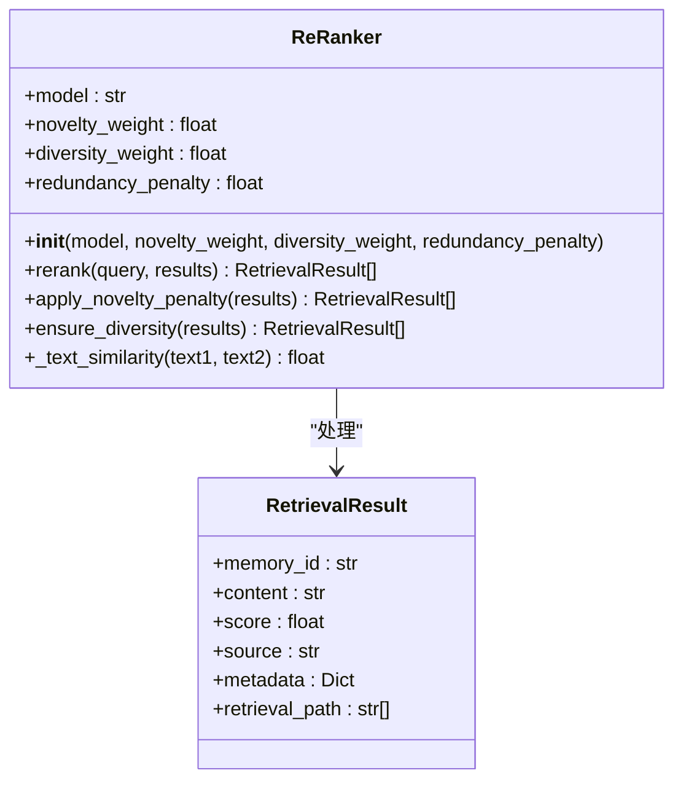
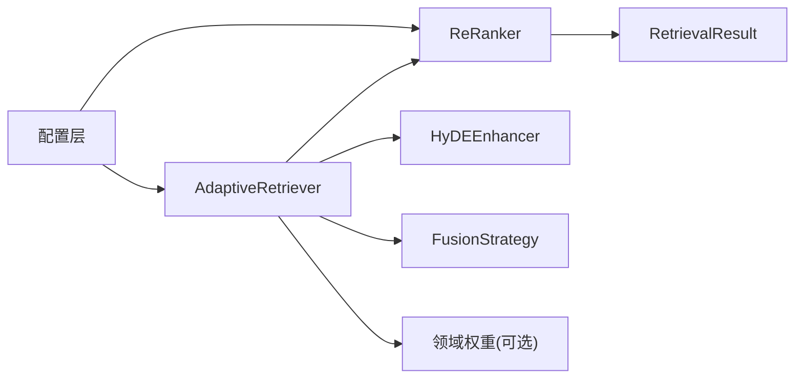

# 重排序系统

<cite>
**本文引用的文件**
- [src/retrieval/reranker.py](file://src/retrieval/reranker.py)
- [src/retrieval/models.py](file://src/retrieval/models.py)
- [src/retrieval/fusion.py](file://src/retrieval/fusion.py)
- [src/retrieval/retriever.py](file://src/retrieval/retriever.py)
- [src/retrieval/hyde.py](file://src/retrieval/hyde.py)
- [example/example_usage.py](file://example/example_usage.py)
- [src/core/config.py](file://src/core/config.py)
- [src/dashboard/models.py](file://src/dashboard/models.py)
</cite>

## 目录
1. [简介](#简介)
2. [项目结构](#项目结构)
3. [核心组件](#核心组件)
4. [架构总览](#架构总览)
5. [详细组件分析](#详细组件分析)
6. [依赖分析](#依赖分析)
7. [性能考量](#性能考量)
8. [故障排查指南](#故障排查指南)
9. [结论](#结论)
10. [附录](#附录)

## 简介
本文件围绕重排序系统展开，重点解释 ReRanker 类的实现原理与使用方式，涵盖以下方面：
- 重排序模型的选择与配置（如 BGE-Reranker-v2 的集成现状与参数）
- 相似度计算方法与排序算法（新颖性惩罚、多样性保障、排序策略）
- 不同重排序模型的特点与适用场景（结合现有实现与参数说明）
- 特征工程与分数计算逻辑（基于文本相似度与 MMR-like 策略）
- 参数调优指南（模型选择策略、阈值设置、性能优化技巧）
- 重排序前后结果对比的可视化示例与效果评估方法

## 项目结构
重排序系统位于检索层，与融合策略、HyDE 增强、领域权重等模块协同工作，形成“多路检索 → 结果融合 → 重排序 → 领域权重 → 过滤与早停”的完整流水线。

图表来源
- [src/retrieval/retriever.py:122-254](file://src/retrieval/retriever.py#L122-L254)
- [src/retrieval/fusion.py:9-128](file://src/retrieval/fusion.py#L9-L128)
- [src/retrieval/reranker.py:10-179](file://src/retrieval/reranker.py#L10-L179)
- [src/retrieval/hyde.py:17-213](file://src/retrieval/hyde.py#L17-L213)
- [src/retrieval/models.py:9-29](file://src/retrieval/models.py#L9-L29)

章节来源
- [src/retrieval/retriever.py:122-254](file://src/retrieval/retriever.py#L122-L254)
- [src/retrieval/fusion.py:9-128](file://src/retrieval/fusion.py#L9-L128)
- [src/retrieval/reranker.py:10-179](file://src/retrieval/reranker.py#L10-L179)
- [src/retrieval/hyde.py:17-213](file://src/retrieval/hyde.py#L17-L213)
- [src/retrieval/models.py:9-29](file://src/retrieval/models.py#L9-L29)

## 核心组件
- ReRanker：负责对融合后的候选集进行重排序，包含新颖性惩罚、多样性保障与排序逻辑。
- FusionStrategy：提供 RRF 与加权融合两种策略，用于整合多路检索结果。
- AdaptiveRetriever：编排检索流程，串联 HyDE、融合与重排序，并支持早停与领域权重。
- HyDEEnhancer：生成假设文档以增强检索质量（当前在检索流程中预留接入点）。
- RetrievalResult：统一的检索结果数据结构，承载内容、分数、来源与元数据。

章节来源
- [src/retrieval/reranker.py:10-179](file://src/retrieval/reranker.py#L10-L179)
- [src/retrieval/fusion.py:9-128](file://src/retrieval/fusion.py#L9-L128)
- [src/retrieval/retriever.py:122-254](file://src/retrieval/retriever.py#L122-L254)
- [src/retrieval/hyde.py:17-213](file://src/retrieval/hyde.py#L17-L213)
- [src/retrieval/models.py:9-29](file://src/retrieval/models.py#L9-L29)

## 架构总览
下图展示了检索与重排序的整体流程，以及各模块之间的调用关系。

图表来源
- [src/retrieval/retriever.py:177-254](file://src/retrieval/retriever.py#L177-L254)
- [src/retrieval/fusion.py:18-128](file://src/retrieval/fusion.py#L18-L128)
- [src/retrieval/reranker.py:41-107](file://src/retrieval/reranker.py#L41-L107)
- [src/retrieval/hyde.py:58-171](file://src/retrieval/hyde.py#L58-L171)

## 详细组件分析

### ReRanker 类详解
ReRanker 是重排序系统的核心，负责对候选集进行新颖性惩罚、多样性保障与最终排序。其主要方法包括：
- 初始化：接收模型名称、新颖性权重、多样性权重与冗余惩罚系数。
- rerank：主流程，依次应用新颖性惩罚、多样性保障，再按分数排序。
- apply_novelty_penalty：基于文本相似度计算冗余度，对候选分数施加惩罚。
- ensure_diversity：采用类似 MMR 的贪心策略，最大化相关性与多样性的平衡。
- _text_similarity：当前实现为 Jaccard 相似度，未来可替换为更精确的语义相似度。

图表来源
- [src/retrieval/reranker.py:10-179](file://src/retrieval/reranker.py#L10-L179)
- [src/retrieval/models.py:9-29](file://src/retrieval/models.py#L9-L29)

章节来源
- [src/retrieval/reranker.py:10-179](file://src/retrieval/reranker.py#L10-L179)
- [src/retrieval/models.py:9-29](file://src/retrieval/models.py#L9-L29)

### 相似度计算与排序算法
- 文本相似度：当前实现为 Jaccard 相似度（基于词集合），简单高效但缺乏语义理解能力。
- 新颖性惩罚：对每个候选与其已选候选的历史进行相似度求和，按平均冗余度施加线性惩罚。
- 多样性保障：采用贪心式 MMR-like 策略，最大化 relevance 与 max_similarity 的加权差。
- 排序：最终按分数降序排列。

图表来源
- [src/retrieval/reranker.py:41-107](file://src/retrieval/reranker.py#L41-L107)

章节来源
- [src/retrieval/reranker.py:41-107](file://src/retrieval/reranker.py#L41-L107)

### 不同重排序模型的特点与适用场景
- BGE-Reranker-v2：当前默认模型名称，用于后续集成（当前实现为占位）。适合通用问答与检索排序任务，具备良好的语义匹配能力。
- 其他模型（概念性说明）：如 Sentence-BERT 系列、Cohere Rank、T5-based 重排序模型等，通常在语义理解与跨域泛化上表现更佳，但计算成本更高。选择策略建议：
  - 低延迟场景：优先轻量模型或本地部署版本。
  - 高精度场景：优先语义更强的模型，配合缓存与批处理优化。
  - 多样性需求：结合 MMR-like 策略，避免过度集中。

章节来源
- [src/retrieval/reranker.py:20-40](file://src/retrieval/reranker.py#L20-L40)
- [src/dashboard/models.py:107-116](file://src/dashboard/models.py#L107-L116)

### 特征工程与分数计算逻辑
- 输入特征：候选内容、历史已选内容、基础分数（由融合策略提供）。
- 特征工程：
  - 文本预处理：分词与集合化（Jaccard 相似度）。
  - 相关性分数：来自融合阶段的累积分数。
  - 多样性度量：与已选候选的最大相似度。
- 分数计算：
  - 新颖性惩罚：score ← score × (1 − η × 平均冗余度)，η 为冗余惩罚系数。
  - 多样性保障：MMR-like 分数 = α×相关性 − (1−α)×max_similarity，α 为多样性权重。
  - 最终排序：按重排序后分数降序。

章节来源
- [src/retrieval/reranker.py:72-153](file://src/retrieval/reranker.py#L72-L153)
- [src/retrieval/fusion.py:18-128](file://src/retrieval/fusion.py#L18-L128)

### 参数调优指南
- 模型选择策略
  - 默认模型：BGE-Reranker-v2（占位，后续集成）。
  - 替代模型：根据延迟与精度要求选择，结合缓存与批处理。
- 阈值设置
  - 冗余惩罚（redundancy_penalty）：控制重复抑制强度，过高会过度惩罚。
  - 多样性权重（diversity_weight）：平衡相关性与多样性，偏高提升多样性。
  - 新颖性权重（novelty_weight）：当前未直接使用，保留以扩展新颖性策略。
- 性能优化技巧
  - 相似度计算：可替换为更高效的近似方法（如 MinHash、SimHash）或语义相似度。
  - 排序前剪枝：过滤低分候选，减少后续计算。
  - 批处理与缓存：对相似度矩阵与重排序结果进行缓存复用。
  - 早停：结合置信度阈值与边际收益，避免无效计算。

章节来源
- [src/retrieval/reranker.py:20-40](file://src/retrieval/reranker.py#L20-L40)
- [src/retrieval/retriever.py:39-120](file://src/retrieval/retriever.py#L39-L120)
- [src/core/config.py:177-181](file://src/core/config.py#L177-L181)

### 重排序前后结果对比与可视化示例
- 对比思路：记录重排序前的分数分布与内容相似度，重排序后观察分数变化与去重/多样化效果。
- 可视化建议：
  - 柱状图：重排序前后 top-k 分数对比。
  - 热力图：候选间相似度矩阵（重排序前）。
  - 散点图：相关性与多样性指标的关系。
- 效果评估方法：
  - 人工评估：相关性、多样性、冗余度。
  - 自动评估：NDCG、Precision@K、Recall@K、覆盖率等（需扩展指标模块）。

章节来源
- [example/example_usage.py:94-136](file://example/example_usage.py#L94-L136)
- [src/retrieval/reranker.py:41-107](file://src/retrieval/reranker.py#L41-L107)

## 依赖分析
- ReRanker 依赖 RetrievalResult 数据模型。
- AdaptiveRetriever 联动 HyDE、FusionStrategy 与 ReRanker，并可选应用领域权重。
- 配置层提供全局开关与参数（如 enable_rerank、rerank_top_k、novelty_penalty）。

图表来源
- [src/retrieval/reranker.py:10-179](file://src/retrieval/reranker.py#L10-L179)
- [src/retrieval/retriever.py:122-254](file://src/retrieval/retriever.py#L122-L254)
- [src/retrieval/fusion.py:9-128](file://src/retrieval/fusion.py#L9-L128)
- [src/retrieval/hyde.py:17-213](file://src/retrieval/hyde.py#L17-L213)
- [src/core/config.py:177-181](file://src/core/config.py#L177-L181)

章节来源
- [src/retrieval/reranker.py:10-179](file://src/retrieval/reranker.py#L10-L179)
- [src/retrieval/retriever.py:122-254](file://src/retrieval/retriever.py#L122-L254)
- [src/retrieval/fusion.py:9-128](file://src/retrieval/fusion.py#L9-L128)
- [src/retrieval/hyde.py:17-213](file://src/retrieval/hyde.py#L17-L213)
- [src/core/config.py:177-181](file://src/core/config.py#L177-L181)

## 性能考量
- 相似度计算复杂度：当前实现为 O(N^2)（两两候选相似度），建议引入近似方法或降维技术。
- 排序复杂度：O(N log N)，可通过剪枝与缓存优化。
- 早停策略：基于置信度阈值与边际收益，显著减少无效计算。
- 批处理与缓存：对相似度矩阵与重排序结果进行缓存复用，降低重复开销。

章节来源
- [src/retrieval/reranker.py:88-107](file://src/retrieval/reranker.py#L88-L107)
- [src/retrieval/retriever.py:39-120](file://src/retrieval/retriever.py#L39-L120)

## 故障排查指南
- 重排序结果为空：检查输入候选是否为空，确认融合阶段是否产生有效结果。
- 相似度过低导致分数异常：检查相似度计算实现与阈值设置，必要时替换为更稳健的方法。
- 多样性不足：提高多样性权重或调整 MMR-like 策略参数。
- 性能瓶颈：启用早停、剪枝与缓存，评估批处理策略。

章节来源
- [src/retrieval/reranker.py:58-70](file://src/retrieval/reranker.py#L58-L70)
- [src/retrieval/retriever.py:245-253](file://src/retrieval/retriever.py#L245-L253)

## 结论
重排序系统通过新颖性惩罚与多样性保障，在保持相关性的同时提升结果的丰富性与可解释性。当前实现以 Jaccard 相似度为基础，具备清晰的扩展路径（如集成 BGE-Reranker-v2、替换相似度计算、引入更复杂的 MMR 策略）。结合早停与领域权重，可在精度与效率之间取得良好平衡。

## 附录
- 使用示例：参考示例脚本中对 AdaptiveRetriever 的初始化与检索调用，其中包含重排序模型参数的设置位置。
- 配置入口：全局配置提供重排序相关开关与参数，便于统一管理。

章节来源
- [example/example_usage.py:94-136](file://example/example_usage.py#L94-L136)
- [src/core/config.py:177-181](file://src/core/config.py#L177-L181)
- [src/dashboard/models.py:107-116](file://src/dashboard/models.py#L107-L116)