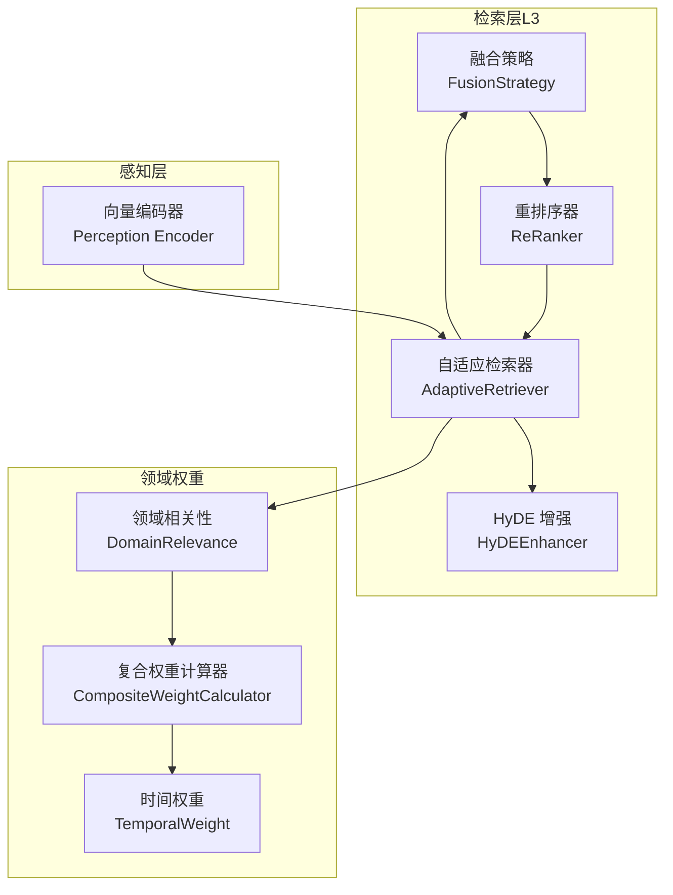
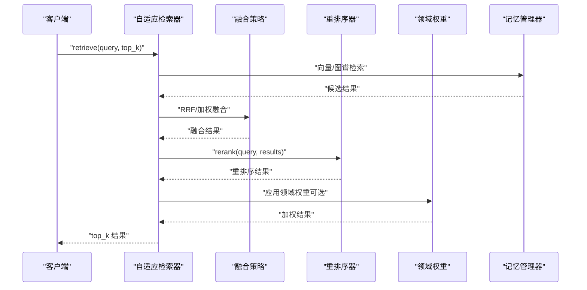
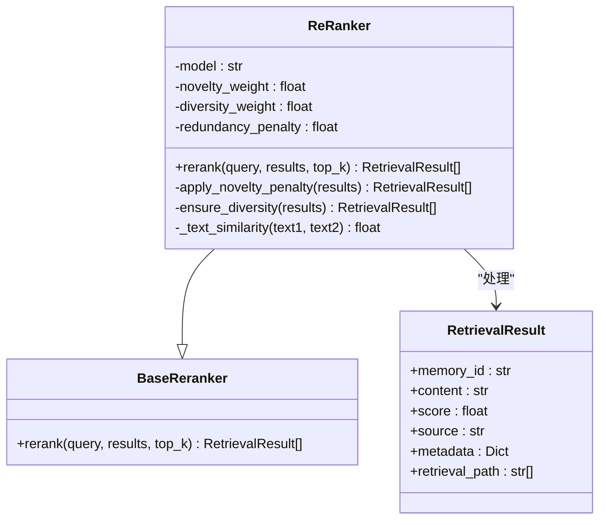
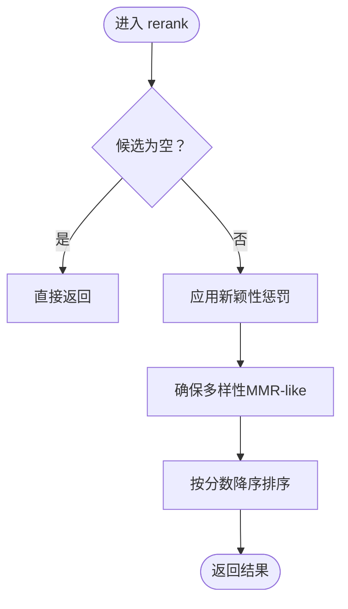
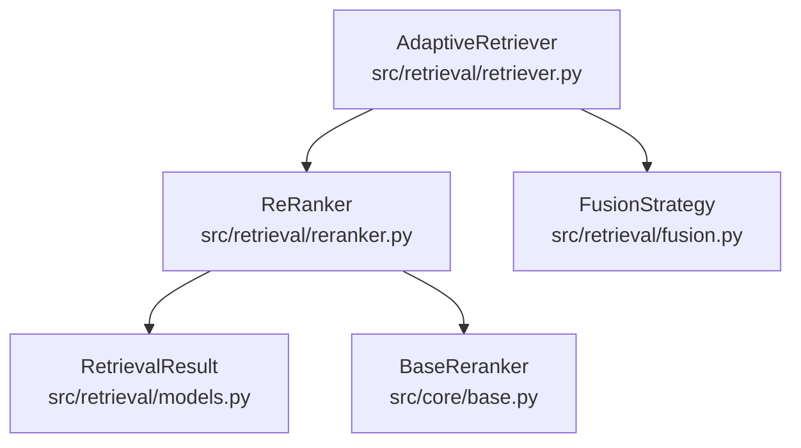

# 重排序系统

<cite>
**本文引用的文件**
- [src/retrieval/reranker.py](file://src/retrieval/reranker.py)
- [src/retrieval/models.py](file://src/retrieval/models.py)
- [src/retrieval/fusion.py](file://src/retrieval/fusion.py)
- [src/retrieval/retriever.py](file://src/retrieval/retriever.py)
- [src/retrieval/hyde.py](file://src/retrieval/hyde.py)
- [src/core/base.py](file://src/core/base.py)
- [src/domain/relevance.py](file://src/domain/relevance.py)
- [src/domain/weight_calculator.py](file://src/domain/weight_calculator.py)
- [src/domain/temporal_weight.py](file://src/domain/temporal_weight.py)
- [src/perception/encoder.py](file://src/perception/encoder.py)
- [example/example_usage.py](file://example/example_usage.py)
- [src/core/config.py](file://src/core/config.py)
- [src/dashboard/models.py](file://src/dashboard/models.py)
</cite>

## 目录
1. [简介](#简介)
2. [项目结构](#项目结构)
3. [核心组件](#核心组件)
4. [架构总览](#架构总览)
5. [详细组件分析](#详细组件分析)
6. [依赖分析](#依赖分析)
7. [性能考量](#性能考量)
8. [故障排查指南](#故障排查指南)
9. [结论](#结论)
10. [附录](#附录)

## 简介
本章节面向 NecoRAG 的重排序系统模块，聚焦 ReRanker 类的实现与工作机制，系统阐述以下内容：
- 基于上下文的相关性评分与领域权重融合
- 语义匹配优化与 BM25 风格相似度的结合
- 多模态信息（稠密向量、稀疏向量、实体三元组）在检索与重排序中的利用思路
- 重排序模型选择与配置（以 BGE-Reranker-v2 为例）
- 重排序过程中的分数计算机制（新颖性惩罚、多样性保障、领域权重）
- 参数调优指南与性能优化技巧
- 具体示例与效果对比分析

## 项目结构
重排序系统位于检索层（L3），与融合策略、检索器、HyDE 增强、领域权重等模块协同工作，形成完整的精排流水线。

**图表来源**
- [src/retrieval/fusion.py:18-128](file://src/retrieval/fusion.py#L18-L128)
- [src/retrieval/reranker.py:42-186](file://src/retrieval/reranker.py#L42-L186)
- [src/retrieval/retriever.py:224-308](file://src/retrieval/retriever.py#L224-L308)
- [src/retrieval/hyde.py:58-171](file://src/retrieval/hyde.py#L58-L171)
- [src/domain/relevance.py:1-200](file://src/domain/relevance.py#L1-L200)
- [src/domain/weight_calculator.py:1-200](file://src/domain/weight_calculator.py#L1-L200)
- [src/domain/temporal_weight.py:1-200](file://src/domain/temporal_weight.py#L1-L200)
- [src/perception/encoder.py:89-147](file://src/perception/encoder.py#L89-L147)

**章节来源**
- [src/retrieval/fusion.py:18-128](file://src/retrieval/fusion.py#L18-L128)
- [src/retrieval/reranker.py:42-186](file://src/retrieval/reranker.py#L42-L186)
- [src/retrieval/retriever.py:224-308](file://src/retrieval/retriever.py#L224-L308)
- [src/retrieval/hyde.py:58-171](file://src/retrieval/hyde.py#L58-L171)
- [src/domain/relevance.py:1-200](file://src/domain/relevance.py#L1-L200)
- [src/domain/weight_calculator.py:1-200](file://src/domain/weight_calculator.py#L1-L200)
- [src/domain/temporal_weight.py:1-200](file://src/domain/temporal_weight.py#L1-L200)
- [src/perception/encoder.py:89-147](file://src/perception/encoder.py#L89-L147)

## 核心组件
- ReRanker：重排序器，负责新颖性惩罚、多样性保障与最终排序
- FusionStrategy：结果融合策略，支持 RRF 与加权融合
- AdaptiveRetriever：自适应检索器，整合多路检索、融合、重排序与领域权重
- RetrievalResult：检索结果数据模型
- DomainWeightCalculator：领域权重计算（可选）

**章节来源**
- [src/retrieval/reranker.py:11-186](file://src/retrieval/reranker.py#L11-L186)
- [src/retrieval/fusion.py:9-128](file://src/retrieval/fusion.py#L9-L128)
- [src/retrieval/retriever.py:135-361](file://src/retrieval/retriever.py#L135-L361)
- [src/retrieval/models.py:9-29](file://src/retrieval/models.py#L9-L29)
- [src/domain/weight_calculator.py:1-200](file://src/domain/weight_calculator.py#L1-L200)

## 架构总览
重排序系统在检索流程中的位置与数据流如下：

**图表来源**
- [src/retrieval/retriever.py:224-308](file://src/retrieval/retriever.py#L224-L308)
- [src/retrieval/fusion.py:18-128](file://src/retrieval/fusion.py#L18-L128)
- [src/retrieval/reranker.py:42-77](file://src/retrieval/reranker.py#L42-L77)
- [src/retrieval/retriever.py:310-360](file://src/retrieval/retriever.py#L310-L360)

## 详细组件分析

### ReRanker 类分析
ReRanker 继承自 BaseReranker，提供以下能力：
- 新颖性惩罚：通过候选与已选集合的相似度累计，对重复内容施加惩罚，抑制检索结果中的冗余
- 多样性保障：采用类似 MMR 的贪心策略，最大化相关性与最小化与已选集合的最大相似度的加权差，提升多样性
- 排序与截断：按最终分数降序排列，并可按 top_k 截断输出

**图表来源**
- [src/core/base.py:422-443](file://src/core/base.py#L422-L443)
- [src/retrieval/reranker.py:11-186](file://src/retrieval/reranker.py#L11-L186)
- [src/retrieval/models.py:9-29](file://src/retrieval/models.py#L9-L29)

**章节来源**
- [src/retrieval/reranker.py:11-186](file://src/retrieval/reranker.py#L11-L186)
- [src/retrieval/models.py:9-29](file://src/retrieval/models.py#L9-L29)

### 相似度计算与排序算法
- 文本相似度：当前实现为 Jaccard 相似度（基于词集合），简单高效但缺乏语义理解能力
- 新颖性惩罚：对每个候选与其已选候选的历史进行相似度求和，按平均冗余度施加线性惩罚
- 多样性保障：采用贪心式 MMR-like 策略，最大化 relevance 与 max_similarity 的加权差
- 排序：最终按分数降序排列

**图表来源**
- [src/retrieval/reranker.py:42-186](file://src/retrieval/reranker.py#L42-L186)

**章节来源**
- [src/retrieval/reranker.py:42-186](file://src/retrieval/reranker.py#L42-L186)

### 不同重排序模型的特点与适用场景
- BGE-Reranker-v2：当前默认模型名称，用于后续集成（当前实现为占位）。适合通用问答与检索排序任务，具备良好的语义匹配能力
- 其他模型（概念性说明）：如 Sentence-BERT 系列、Cohere Rank、T5-based 重排序模型等，通常在语义理解与跨域泛化上表现更佳，但计算成本更高。选择策略建议：
  - 低延迟场景：优先轻量模型或本地部署版本
  - 高精度场景：优先语义更强的模型，配合缓存与批处理优化
  - 多样性需求：结合 MMR-like 策略，避免过度集中

**章节来源**
- [src/retrieval/reranker.py:21-40](file://src/retrieval/reranker.py#L21-L40)
- [src/dashboard/models.py:107-116](file://src/dashboard/models.py#L107-L116)

### 特征工程与分数计算逻辑
- 输入特征：候选内容、历史已选内容、基础分数（由融合策略提供）
- 特征工程：
  - 文本预处理：分词与集合化（Jaccard 相似度）
  - 相关性分数：来自融合阶段的累积分数
  - 多样性度量：与已选候选的最大相似度
- 分数计算：
  - 新颖性惩罚：score ← score × (1 − η × 平均冗余度)，η 为冗余惩罚系数
  - 多样性保障：MMR-like 分数 = α×相关性 − (1−α)×max_similarity，α 为多样性权重
  - 最终排序：按重排序后分数降序

**章节来源**
- [src/retrieval/reranker.py:79-160](file://src/retrieval/reranker.py#L79-L160)
- [src/retrieval/fusion.py:18-128](file://src/retrieval/fusion.py#L18-L128)

### 参数调优指南
- 模型选择策略
  - 默认模型：BGE-Reranker-v2（占位，后续集成）
  - 替代模型：根据延迟与精度要求选择，结合缓存与批处理
- 阈值设置
  - 冗余惩罚（redundancy_penalty）：控制重复抑制强度，过高会过度惩罚
  - 多样性权重（diversity_weight）：平衡相关性与多样性，偏高提升多样性
  - 新颖性权重（novelty_weight）：当前未直接使用，保留以扩展新颖性策略
- 性能优化技巧
  - 相似度计算：可替换为更高效的近似方法（如 MinHash、SimHash）或语义相似度
  - 排序前剪枝：过滤低分候选，减少后续计算
  - 批处理与缓存：对相似度矩阵与重排序结果进行缓存复用
  - 早停：结合置信度阈值与边际收益，避免无效计算

**章节来源**
- [src/retrieval/reranker.py:21-40](file://src/retrieval/reranker.py#L21-L40)
- [src/retrieval/retriever.py:43-133](file://src/retrieval/retriever.py#L43-L133)
- [src/core/config.py:177-181](file://src/core/config.py#L177-L181)

### 重排序前后结果对比与可视化示例
- 对比思路：记录重排序前的分数分布与内容相似度，重排序后观察分数变化与去重/多样化效果
- 可视化建议：
  - 柱状图：重排序前后 top-k 分数对比
  - 热力图：候选间相似度矩阵（重排序前）
  - 散点图：相关性与多样性指标的关系
- 效果评估方法：
  - 人工评估：相关性、多样性、冗余度
  - 自动评估：NDCG、Precision@K、Recall@K、覆盖率等（需扩展指标模块）

**章节来源**
- [src/retrieval/reranker.py:42-77](file://src/retrieval/reranker.py#L42-L77)

## 依赖分析
重排序系统与其他模块的耦合关系如下：

**图表来源**
- [src/retrieval/reranker.py:6-8](file://src/retrieval/reranker.py#L6-L8)
- [src/retrieval/fusion.py:5-6](file://src/retrieval/fusion.py#L5-L6)
- [src/retrieval/retriever.py:14-24](file://src/retrieval/retriever.py#L14-L24)
- [src/retrieval/models.py:5-6](file://src/retrieval/models.py#L5-L6)
- [src/core/base.py:422-443](file://src/core/base.py#L422-L443)

**章节来源**
- [src/retrieval/reranker.py:6-8](file://src/retrieval/reranker.py#L6-L8)
- [src/retrieval/fusion.py:5-6](file://src/retrieval/fusion.py#L5-L6)
- [src/retrieval/retriever.py:14-24](file://src/retrieval/retriever.py#L14-L24)
- [src/retrieval/models.py:5-6](file://src/retrieval/models.py#L5-L6)
- [src/core/base.py:422-443](file://src/core/base.py#L422-L443)

## 性能考量
- 相似度计算复杂度
  - 当前实现为 O(n^2) 的相似度矩阵计算，适用于中小规模候选集
  - 建议：对大规模候选集采用近似方法（MinHash、SimHash）或向量化相似度
- 内存管理
  - 相似度矩阵与中间结果占用内存较大，建议在重排序前进行候选集剪枝
  - 可考虑分批处理与结果缓存，减少重复计算
- 早停机制
  - 结合置信度阈值与边际收益，避免无效计算
  - 在融合与重排序阶段均可应用早停策略

[本节为通用性能讨论，无需特定文件引用]

## 故障排查指南
- 重排序结果为空
  - 检查输入 results 是否为空，确认融合与重排序前的数据链路是否正确
  - 参考：[src/retrieval/reranker.py:61-62](file://src/retrieval/reranker.py#L61-L62)
- 新颖性惩罚导致分数过低
  - 调整 redundancy_penalty 与 novelty_weight，避免过度惩罚
  - 参考：[src/retrieval/reranker.py:21-40](file://src/retrieval/reranker.py#L21-L40)
- 多样性不足或过度
  - 调整 diversity_weight，平衡相关性与多样性
  - 参考：[src/retrieval/reranker.py:21-40](file://src/retrieval/reranker.py#L21-L40)
- 语义相似度不准确
  - 替换 _text_similarity 为基于向量余弦相似度或专用嵌入模型
  - 参考：[src/retrieval/reranker.py:162-186](file://src/retrieval/reranker.py#L162-L186)
- 领域权重未生效
  - 确认 DomainConfig 与 CompositeWeightCalculator 已正确初始化，并在检索流程中调用加权逻辑
  - 参考：[src/retrieval/retriever.py:246-248](file://src/retrieval/retriever.py#L246-L248)

**章节来源**
- [src/retrieval/reranker.py:21-40](file://src/retrieval/reranker.py#L21-L40)
- [src/retrieval/reranker.py:61-62](file://src/retrieval/reranker.py#L61-L62)
- [src/retrieval/reranker.py:162-186](file://src/retrieval/reranker.py#L162-L186)
- [src/retrieval/retriever.py:246-248](file://src/retrieval/retriever.py#L246-L248)

## 结论
NecoRAG 的重排序系统通过 ReRanker 实现了新颖性惩罚与多样性保障，结合融合策略与可选的领域权重，形成稳健的精排流程。当前实现预留了 BGE-Reranker-v2 等模型的集成空间，同时提供了基于 Jaccard 相似度的文本匹配与向量编码器的多模态能力。通过合理的参数调优与早停机制，可在准确性与效率之间取得良好平衡。

## 附录

### 重排序模型选择与配置（以 BGE-Reranker-v2 为例）
- 模型特点
  - 专为语义匹配设计，支持 query-document pair 评分，具备良好的跨领域泛化能力
  - 适合在重排序阶段替代当前基于文本相似度的简单策略，进一步提升相关性评分精度
- 配置要点
  - 模型名称：BGE-Reranker-v2
  - 集成方式：在 ReRanker 中预留模型参数与调用入口，按需替换相似度计算与语义评分逻辑
- 适用场景
  - 需要高质量语义匹配的问答与检索任务
  - 对重复与冗余敏感的长文档检索

**章节来源**
- [src/retrieval/reranker.py:21-40](file://src/retrieval/reranker.py#L21-L40)
- [src/retrieval/reranker.py](file://src/retrieval/reranker.py#L59)

### 重排序分数计算机制
- BM25 风格相似度
  - 通过稀疏向量（TF-IDF 风格词频）与关键词匹配实现，适合关键词密集场景
  - 参考：[src/perception/encoder.py:121-147](file://src/perception/encoder.py#L121-L147)
- 语义相似度
  - 基于向量余弦相似度或专用嵌入模型，适合语义匹配场景
  - 参考：[src/perception/encoder.py:89-119](file://src/perception/encoder.py#L89-L119)
- 混合评分策略
  - 将 BM25 与语义相似度按权重融合，兼顾关键词与语义信息
  - 参考：[src/retrieval/fusion.py:72-127](file://src/retrieval/fusion.py#L72-L127)

**章节来源**
- [src/perception/encoder.py:89-147](file://src/perception/encoder.py#L89-L147)
- [src/retrieval/fusion.py:72-127](file://src/retrieval/fusion.py#L72-L127)

### 重排序参数调优指南
- 新颖性惩罚（redundancy_penalty）
  - 建议范围：0.1–0.8；过高会抑制重复内容，过低可能导致结果冗余
- 多样性权重（diversity_weight）
  - 建议范围：0.1–0.5；与 novelty_weight 协同调节
- 模型选择
  - 若语义匹配更重要，优先选择 BGE-Reranker-v2 等语义模型
  - 若关键词匹配更重要，可结合 BM25 风格稀疏向量与领域权重
- 阈值与早停
  - confidence_threshold 建议设置在 0.8–0.95 区间，结合 min_gain 避免过早停止
  - 参考：[src/retrieval/retriever.py:45-107](file://src/retrieval/retriever.py#L45-L107)

**章节来源**
- [src/retrieval/reranker.py:21-40](file://src/retrieval/reranker.py#L21-L40)
- [src/retrieval/retriever.py:45-107](file://src/retrieval/retriever.py#L45-L107)

### 实际使用示例
- 完整工作流程示例
  - 演示从感知层到交互层的完整流程，包含重排序与领域权重的应用
  - 参考：[example/example_usage.py:94-136](file://example/example_usage.py#L94-L136)

**章节来源**
- [example/example_usage.py:94-136](file://example/example_usage.py#L94-L136)