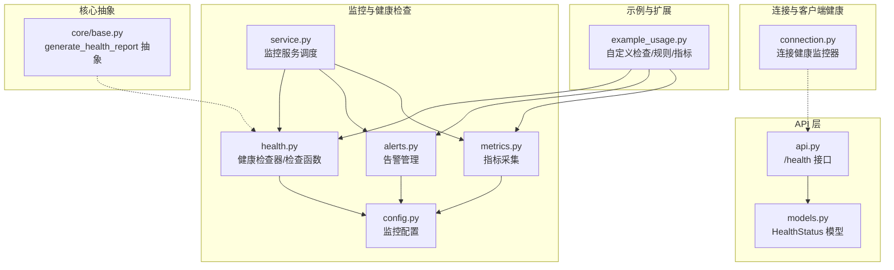
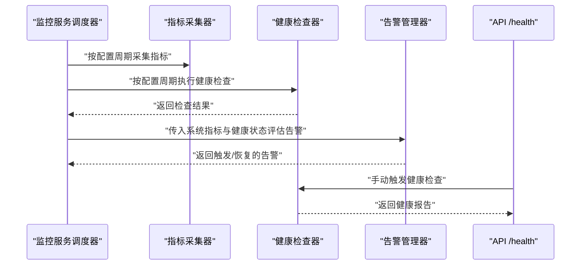
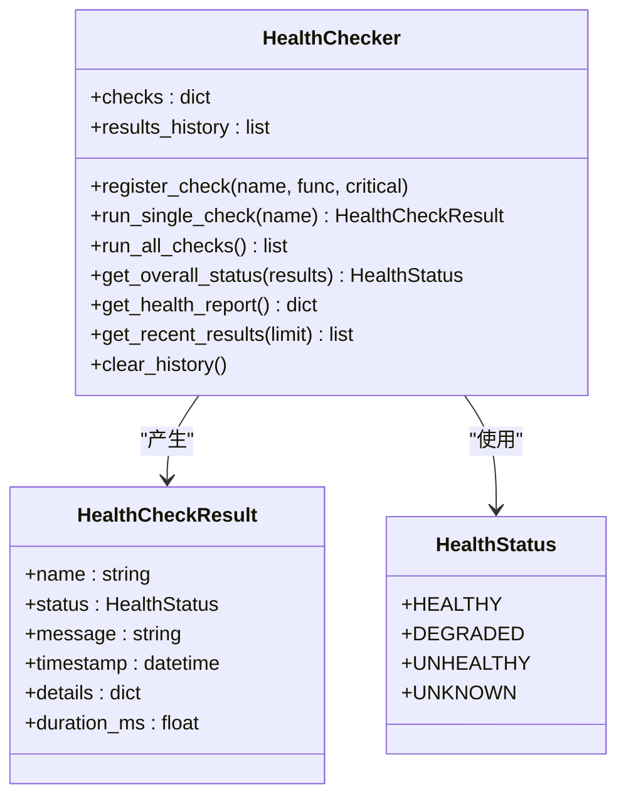
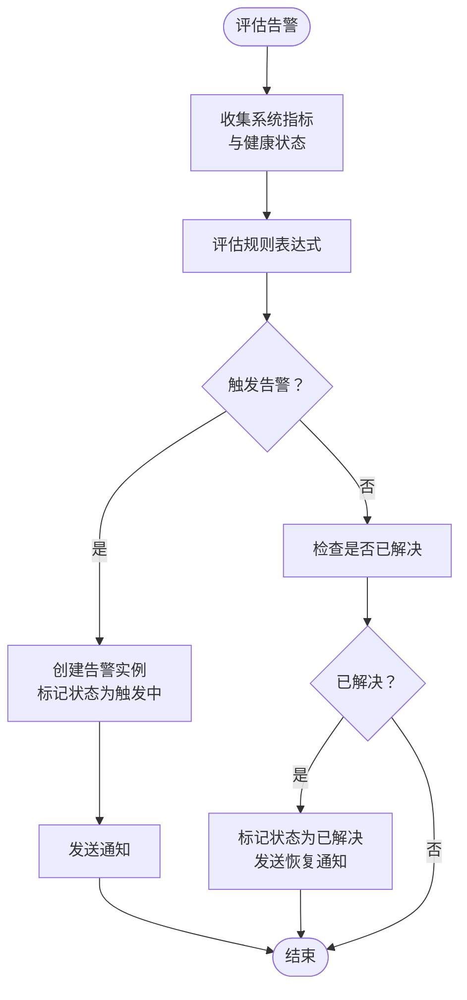
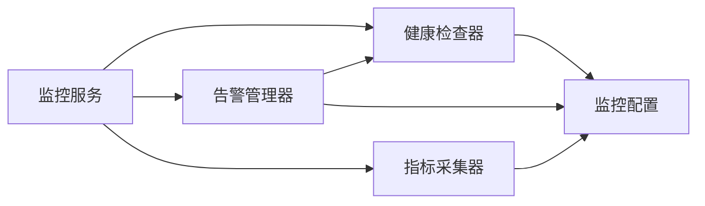

# 健康检查

<cite>
**本文引用的文件**
- [src/monitoring/health.py](file://src/monitoring/health.py)
- [src/monitoring/config.py](file://src/monitoring/config.py)
- [src/monitoring/alerts.py](file://src/monitoring/alerts.py)
- [src/monitoring/metrics.py](file://src/monitoring/metrics.py)
- [src/monitoring/service.py](file://src/monitoring/service.py)
- [interface/api.py](file://interface/api.py)
- [interface/models.py](file://interface/models.py)
- [src/dashboard/debug/connection.py](file://src/dashboard/debug/connection.py)
- [src/core/base.py](file://src/core/base.py)
- [src/monitoring/example_usage.py](file://src/monitoring/example_usage.py)
</cite>

## 目录
1. [引言](#引言)
2. [项目结构](#项目结构)
3. [核心组件](#核心组件)
4. [架构总览](#架构总览)
5. [详细组件分析](#详细组件分析)
6. [依赖分析](#依赖分析)
7. [性能考虑](#性能考虑)
8. [故障排查指南](#故障排查指南)
9. [结论](#结论)
10. [附录](#附录)

## 引言
本文件面向健康检查模块的实现与使用，系统性阐述组件状态监测机制（数据库连接、存储后端、外部服务依赖）、故障诊断能力（异常检测、错误日志分析、服务可用性评估）、执行策略（定时检查、手动触发、自动恢复）、健康状态的数据结构与状态转换逻辑、与监控系统的集成（指标上报与聚合）、常见故障诊断方法与解决方案、配置管理与自定义检查器扩展机制，并覆盖 v3.3.0-alpha 版本的改进要点。

## 项目结构
健康检查相关代码主要分布在以下模块：
- 监控与健康检查核心：src/monitoring/health.py、src/monitoring/config.py、src/monitoring/alerts.py、src/monitoring/metrics.py、src/monitoring/service.py
- API 层健康接口：interface/api.py、interface/models.py
- 连接与客户端健康监控：src/dashboard/debug/connection.py
- 核心抽象：src/core/base.py
- 示例与扩展：src/monitoring/example_usage.py

**图表来源**
- [src/monitoring/health.py:1-300](file://src/monitoring/health.py#L1-L300)
- [src/monitoring/config.py:1-117](file://src/monitoring/config.py#L1-L117)
- [src/monitoring/alerts.py:1-435](file://src/monitoring/alerts.py#L1-L435)
- [src/monitoring/metrics.py:1-207](file://src/monitoring/metrics.py#L1-L207)
- [src/monitoring/service.py:1-214](file://src/monitoring/service.py#L1-L214)
- [interface/api.py:55-78](file://interface/api.py#L55-L78)
- [interface/models.py:80-85](file://interface/models.py#L80-L85)
- [src/dashboard/debug/connection.py:1-595](file://src/dashboard/debug/connection.py#L1-L595)
- [src/core/base.py:817-825](file://src/core/base.py#L817-L825)
- [src/monitoring/example_usage.py:179-224](file://src/monitoring/example_usage.py#L179-L224)

**章节来源**
- [src/monitoring/health.py:1-300](file://src/monitoring/health.py#L1-L300)
- [src/monitoring/config.py:1-117](file://src/monitoring/config.py#L1-L117)
- [src/monitoring/alerts.py:1-435](file://src/monitoring/alerts.py#L1-L435)
- [src/monitoring/metrics.py:1-207](file://src/monitoring/metrics.py#L1-L207)
- [src/monitoring/service.py:1-214](file://src/monitoring/service.py#L1-L214)
- [interface/api.py:55-78](file://interface/api.py#L55-L78)
- [interface/models.py:80-85](file://interface/models.py#L80-L85)
- [src/dashboard/debug/connection.py:1-595](file://src/dashboard/debug/connection.py#L1-L595)
- [src/core/base.py:817-825](file://src/core/base.py#L817-L825)
- [src/monitoring/example_usage.py:179-224](file://src/monitoring/example_usage.py#L179-L224)

## 核心组件
- 健康检查器与检查函数：负责注册、并发执行、汇总与历史记录；内置数据库、Redis、LLM 服务、磁盘空间等检查函数。
- 监控配置：集中管理指标采集、健康检查、告警、通知渠道与阈值等配置。
- 告警管理：基于规则表达式评估健康状态与系统指标，触发多渠道通知。
- 指标采集：系统级与应用级指标收集，支持 Prometheus 导出格式。
- 监控服务：统一调度指标采集、健康检查、告警评估与仪表板。
- API 健康接口：对外暴露 /health 接口，返回组件状态与运行时信息。
- 连接健康监控：针对 WebSocket 连接的健康检查、统计与告警。
- 自定义扩展：示例展示如何注册自定义健康检查、告警规则与指标。

**章节来源**
- [src/monitoring/health.py:34-300](file://src/monitoring/health.py#L34-L300)
- [src/monitoring/config.py:27-117](file://src/monitoring/config.py#L27-L117)
- [src/monitoring/alerts.py:237-435](file://src/monitoring/alerts.py#L237-L435)
- [src/monitoring/metrics.py:25-207](file://src/monitoring/metrics.py#L25-L207)
- [src/monitoring/service.py:21-214](file://src/monitoring/service.py#L21-L214)
- [interface/api.py:55-78](file://interface/api.py#L55-L78)
- [src/dashboard/debug/connection.py:90-313](file://src/dashboard/debug/connection.py#L90-L313)
- [src/monitoring/example_usage.py:179-224](file://src/monitoring/example_usage.py#L179-L224)

## 架构总览
健康检查模块采用“配置驱动 + 组件解耦 + 调度执行”的架构。监控服务作为中枢，按配置周期性触发指标采集、健康检查与告警评估；健康检查器负责并发执行预定义或自定义检查；告警管理器根据规则与当前健康状态进行告警判定与通知；指标采集器提供系统与应用级指标供告警规则使用；API 层提供对外健康接口；连接健康监控器关注客户端连接层面的可用性。

**图表来源**
- [src/monitoring/service.py:38-154](file://src/monitoring/service.py#L38-L154)
- [src/monitoring/metrics.py:32-95](file://src/monitoring/metrics.py#L32-L95)
- [src/monitoring/health.py:107-154](file://src/monitoring/health.py#L107-L154)
- [src/monitoring/alerts.py:291-344](file://src/monitoring/alerts.py#L291-L344)
- [interface/api.py:55-78](file://interface/api.py#L55-L78)

## 详细组件分析

### 健康检查器与状态模型
- 数据结构
  - 健康状态枚举：健康、降级、不健康、未知。
  - 健康检查结果：包含检查名、状态、消息、时间戳、详情、耗时。
  - 健康检查器：维护检查函数注册表、历史记录、并发执行与整体状态计算。
- 执行策略
  - 单项检查：捕获异常并记录为不健康，记录耗时。
  - 全部检查：并发执行，聚合结果，写入历史，保留最近 1000 条。
  - 整体状态：关键检查任一不健康则整体不健康；否则若有降级则整体降级；否则全部健康则整体健康。
- 预定义检查
  - 数据库连接、Redis 连接、LLM 服务、磁盘空间等，均返回标准化结果字典。

**图表来源**
- [src/monitoring/health.py:15-105](file://src/monitoring/health.py#L15-L105)
- [src/monitoring/health.py:107-154](file://src/monitoring/health.py#L107-L154)

**章节来源**
- [src/monitoring/health.py:15-105](file://src/monitoring/health.py#L15-L105)
- [src/monitoring/health.py:107-154](file://src/monitoring/health.py#L107-L154)
- [src/monitoring/health.py:205-300](file://src/monitoring/health.py#L205-L300)

### 监控配置与阈值
- 配置项
  - 指标采集：开关、端口、路径、采集间隔。
  - 健康检查：开关、间隔、超时。
  - 告警：开关、评估间隔、保留天数、通知渠道（控制台、邮件、Webhook、Slack）。
  - 性能阈值：CPU/内存/磁盘警告与严重阈值；RAG 响应时间、API 错误率、缓存命中率阈值。
- 加载方式：支持从环境变量注入配置，便于容器化部署与多环境管理。

**章节来源**
- [src/monitoring/config.py:27-117](file://src/monitoring/config.py#L27-L117)

### 告警管理与通知
- 规则与状态
  - 规则：名称、表达式、级别、描述、持续时间、标签与注解。
  - 状态：触发中、已解决、已静默。
- 表达式评估：支持基于健康状态与系统指标的简单表达式（如 CPU/内存阈值、健康状态）。
- 通知渠道：控制台、邮件、Webhook、Slack，支持并发发送与失败回退。
- 默认规则：包含高 CPU/内存使用与系统不健康等规则。

**图表来源**
- [src/monitoring/alerts.py:291-344](file://src/monitoring/alerts.py#L291-L344)
- [src/monitoring/alerts.py:346-372](file://src/monitoring/alerts.py#L346-L372)
- [src/monitoring/alerts.py:401-427](file://src/monitoring/alerts.py#L401-L427)

**章节来源**
- [src/monitoring/alerts.py:237-435](file://src/monitoring/alerts.py#L237-L435)

### 指标采集与导出
- 系统指标：CPU、内存、磁盘、网络、进程、运行时等。
- 应用指标：RAG 响应时间、API 调用、缓存操作、模型推理时间等。
- 导出格式：支持 Prometheus 格式导出，便于 Prometheus/Grafana 集成。

**章节来源**
- [src/monitoring/metrics.py:25-207](file://src/monitoring/metrics.py#L25-L207)

### 监控服务调度
- 启动/停止：启动时注册定时任务，停止时关闭调度器。
- 任务类型：指标采集、健康检查、告警评估。
- 状态查询：返回运行状态、配置与组件激活情况。

**章节来源**
- [src/monitoring/service.py:38-170](file://src/monitoring/service.py#L38-L170)

### API 健康接口
- 接口：GET /health，返回健康状态模型，包含整体状态、组件状态、时间戳与运行时。
- 实现：调用知识服务统计信息，异常时返回不健康状态。

**章节来源**
- [interface/api.py:55-78](file://interface/api.py#L55-L78)
- [interface/models.py:80-85](file://interface/models.py#L80-L85)

### 连接健康监控（客户端侧）
- 监控器：按配置间隔对不同连接类型（调试面板、思维路径、性能、查询历史）执行健康检查。
- 记录与统计：记录最近 100 次检查结果，按小时窗口统计成功率、平均响应时间与状态分布。
- 告警：当检查失败时触发告警处理器，支持多处理器链路。

**章节来源**
- [src/dashboard/debug/connection.py:90-313](file://src/dashboard/debug/connection.py#L90-L313)

### 自定义扩展与示例
- 自定义健康检查：注册新的检查函数，返回标准化结果字典。
- 自定义告警规则：新增规则表达式，支持不同级别与标签。
- 自定义指标：记录应用级指标，供告警规则使用。

**章节来源**
- [src/monitoring/example_usage.py:179-224](file://src/monitoring/example_usage.py#L179-L224)

## 依赖分析
- 组件耦合
  - 监控服务依赖健康检查器、告警管理器与指标采集器，形成调度闭环。
  - 健康检查器依赖配置模块以决定关键/非关键检查与历史容量。
  - 告警管理器依赖配置模块的阈值与通知渠道，以及健康检查器提供的健康状态。
  - 指标采集器依赖配置模块的采集间隔与导出格式。
- 外部依赖
  - APScheduler：异步调度器，用于定时任务。
  - psutil：系统指标采集。
  - FastAPI：监控服务的 Web 暴露与仪表板集成。
  - aiohttp：通知渠道中的 Webhook/HTTP 请求。

**图表来源**
- [src/monitoring/service.py:21-80](file://src/monitoring/service.py#L21-L80)
- [src/monitoring/health.py:34-47](file://src/monitoring/health.py#L34-L47)
- [src/monitoring/alerts.py:240-275](file://src/monitoring/alerts.py#L240-L275)
- [src/monitoring/metrics.py:25-31](file://src/monitoring/metrics.py#L25-L31)

**章节来源**
- [src/monitoring/service.py:21-80](file://src/monitoring/service.py#L21-L80)
- [src/monitoring/health.py:34-47](file://src/monitoring/health.py#L34-L47)
- [src/monitoring/alerts.py:240-275](file://src/monitoring/alerts.py#L240-L275)
- [src/monitoring/metrics.py:25-31](file://src/monitoring/metrics.py#L25-L31)

## 性能考虑
- 并发执行：健康检查器并发运行所有检查，减少总耗时。
- 历史容量：限制历史记录数量，避免内存膨胀。
- 采集频率：通过配置控制指标与健康检查的采集/评估频率，平衡准确性与开销。
- 导出优化：Prometheus 导出仅输出最新样本，降低输出体积。

**章节来源**
- [src/monitoring/health.py:107-130](file://src/monitoring/health.py#L107-L130)
- [src/monitoring/health.py:186-198](file://src/monitoring/health.py#L186-L198)
- [src/monitoring/config.py:34-44](file://src/monitoring/config.py#L34-L44)
- [src/monitoring/metrics.py:144-174](file://src/monitoring/metrics.py#L144-L174)

## 故障排查指南
- 健康接口异常
  - 现象：/health 返回不健康。
  - 排查：查看知识服务统计信息获取路径与权限；检查日志错误堆栈。
- 健康检查失败
  - 现象：关键检查（数据库、Redis、LLM 服务）失败。
  - 排查：确认后端服务可达性、认证配置、网络延迟；查看检查耗时与错误详情。
- 告警未触发或误触发
  - 现象：阈值异常或规则表达式不匹配。
  - 排查：核对监控配置阈值与规则表达式；检查健康状态与系统指标是否符合预期。
- 指标缺失或导出异常
  - 现象：Prometheus 无法抓取指标。
  - 排查：确认采集间隔与导出路径；检查 psutil 可用性与权限。
- 连接健康问题
  - 现象：客户端连接频繁断连或响应慢。
  - 排查：查看连接健康统计（成功率、平均响应时间）；检查告警处理器日志。

**章节来源**
- [interface/api.py:71-78](file://interface/api.py#L71-L78)
- [src/monitoring/health.py:95-105](file://src/monitoring/health.py#L95-L105)
- [src/monitoring/alerts.py:346-372](file://src/monitoring/alerts.py#L346-L372)
- [src/monitoring/metrics.py:144-174](file://src/monitoring/metrics.py#L144-L174)
- [src/dashboard/debug/connection.py:236-256](file://src/dashboard/debug/connection.py#L236-L256)

## 结论
健康检查模块通过“配置驱动 + 组件解耦 + 调度执行”的方式，实现了对数据库、存储后端、外部服务与系统资源的全面监测，并与告警系统、指标系统、API 接口与连接监控形成闭环。v3.3.0-alpha 在配置灵活性、阈值可调性与通知渠道多样性方面进一步完善，配合自定义扩展能力，满足生产环境的多样化需求。

## 附录

### 健康状态转换逻辑
- 关键检查任一不健康 → 整体不健康
- 无关键检查不健康但存在降级 → 整体降级
- 无降级且所有检查健康 → 整体健康
- 无检查结果 → 未知

**章节来源**
- [src/monitoring/health.py:132-154](file://src/monitoring/health.py#L132-L154)

### 与监控系统的集成
- 指标上报：系统与应用指标通过指标采集器记录，支持 Prometheus 导出。
- 健康指标：健康检查器输出健康报告，供告警规则评估。
- 仪表板：监控服务集成仪表板应用，提供可视化界面。

**章节来源**
- [src/monitoring/metrics.py:144-174](file://src/monitoring/metrics.py#L144-L174)
- [src/monitoring/service.py:177-200](file://src/monitoring/service.py#L177-L200)

### 配置管理与环境变量
- 支持通过环境变量覆盖默认配置，便于容器化与多环境部署。
- 常用变量：监控开关、端口、路径、采集间隔、健康检查间隔/超时、告警评估间隔、阈值、通知渠道等。

**章节来源**
- [src/monitoring/config.py:72-100](file://src/monitoring/config.py#L72-L100)

### 自定义检查器与扩展机制
- 注册自定义健康检查函数，返回标准化结果字典。
- 新增告警规则，定义表达式与级别。
- 记录应用级指标，参与告警评估。

**章节来源**
- [src/monitoring/example_usage.py:179-224](file://src/monitoring/example_usage.py#L179-L224)
- [src/monitoring/health.py:42-47](file://src/monitoring/health.py#L42-L47)
- [src/monitoring/alerts.py:280-289](file://src/monitoring/alerts.py#L280-L289)
- [src/monitoring/metrics.py:126-135](file://src/monitoring/metrics.py#L126-L135)

### v3.3.0-alpha 改进要点
- 健康检查与监控配置的可配置性增强，支持更灵活的阈值与通知策略。
- 告警规则表达式与通知渠道扩展，提升告警的准确性与覆盖面。
- 指标导出与仪表板集成完善，便于生产监控与可视化。

**章节来源**
- [src/monitoring/config.py:27-117](file://src/monitoring/config.py#L27-L117)
- [src/monitoring/alerts.py:401-427](file://src/monitoring/alerts.py#L401-L427)
- [src/monitoring/metrics.py:144-174](file://src/monitoring/metrics.py#L144-L174)