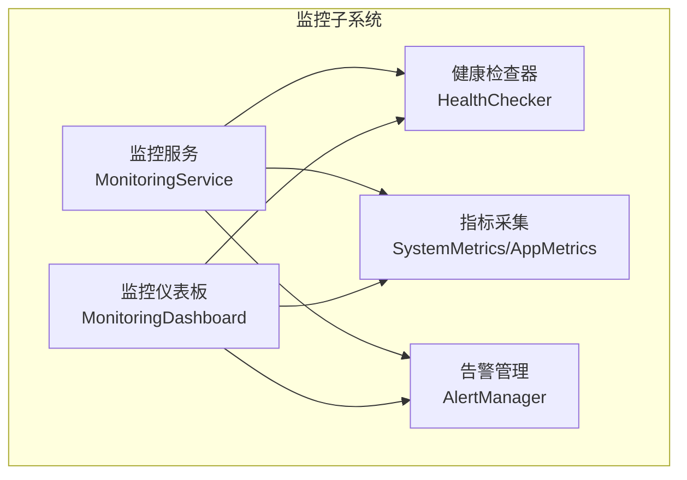
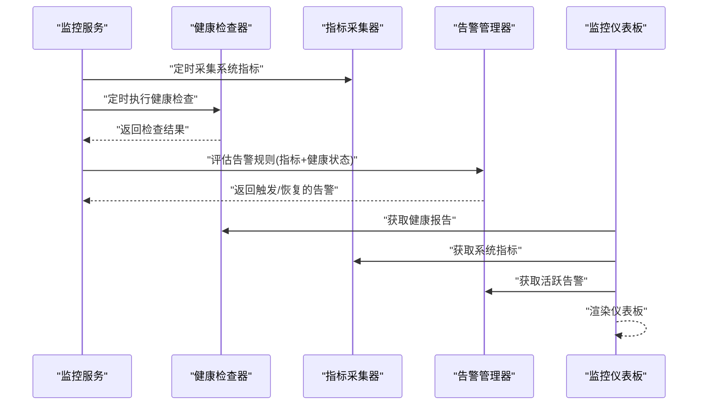
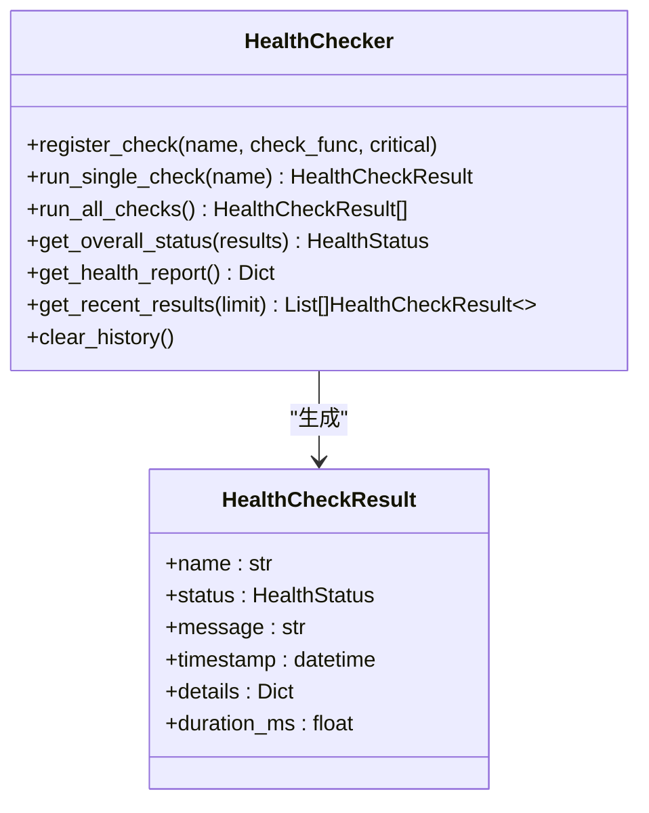
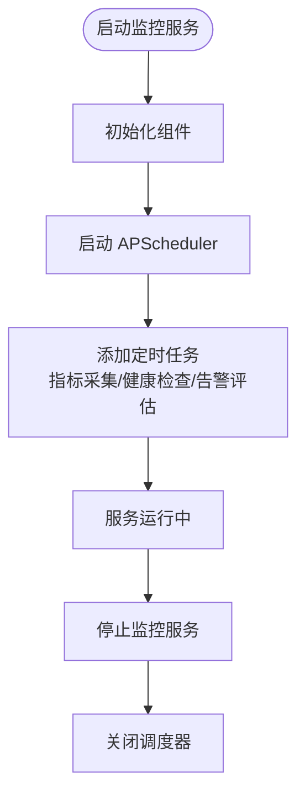
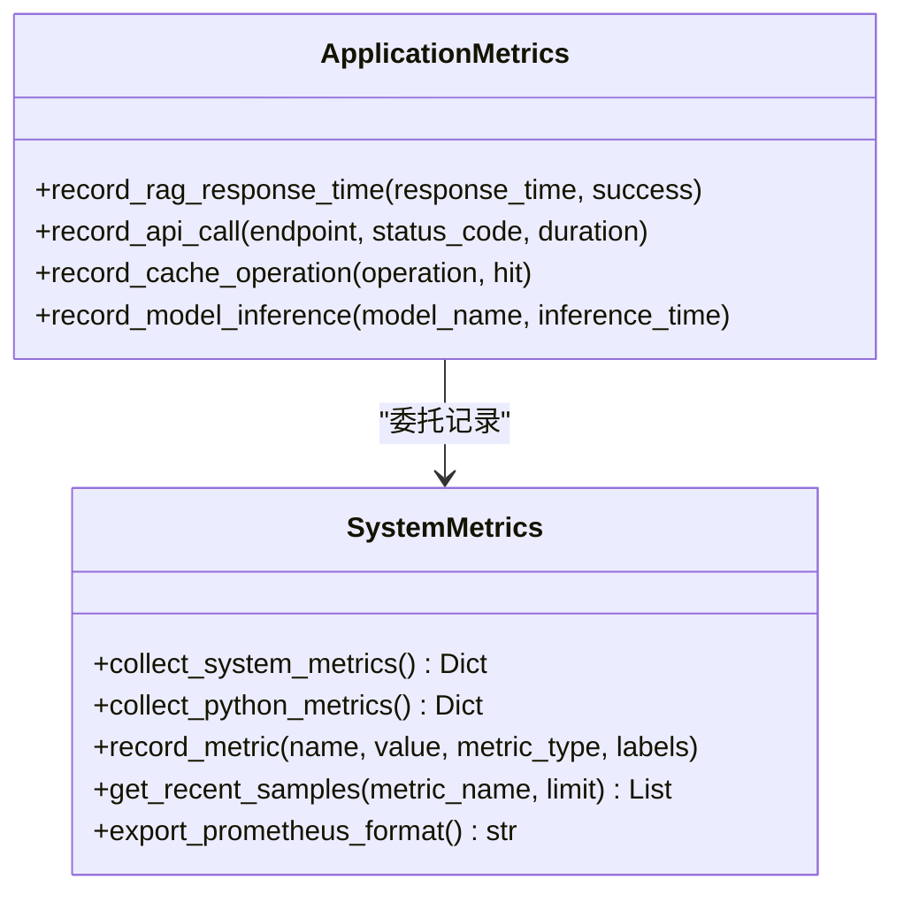
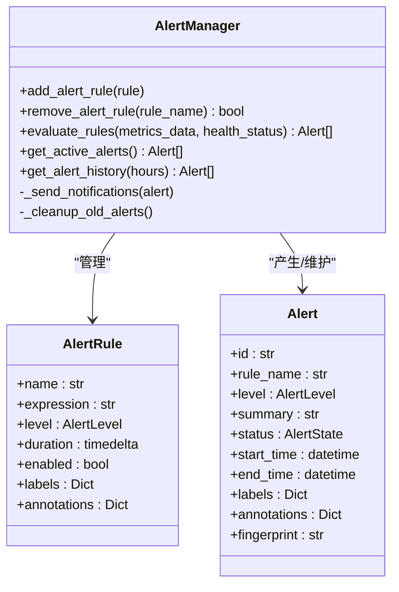
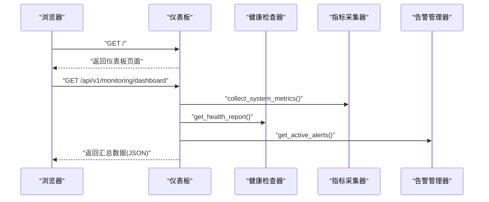
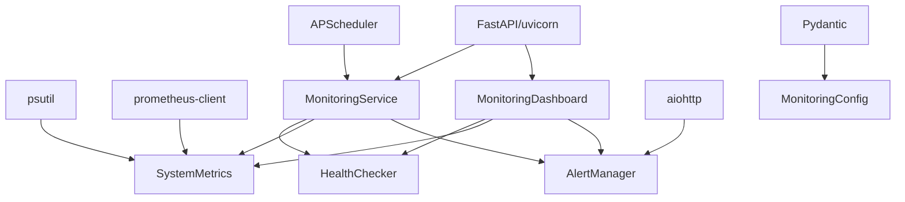

# 健康检查系统

<cite>
**本文引用的文件**
- [health.py](file://src/monitoring/health.py)
- [service.py](file://src/monitoring/service.py)
- [config.py](file://src/monitoring/config.py)
- [metrics.py](file://src/monitoring/metrics.py)
- [alerts.py](file://src/monitoring/alerts.py)
- [dashboard.py](file://src/monitoring/dashboard.py)
- [example_usage.py](file://src/monitoring/example_usage.py)
- [README.md](file://README.md)
- [requirements.txt](file://requirements.txt)
</cite>

## 目录
1. [引言](#引言)
2. [项目结构](#项目结构)
3. [核心组件](#核心组件)
4. [架构总览](#架构总览)
5. [详细组件分析](#详细组件分析)
6. [依赖分析](#依赖分析)
7. [性能考虑](#性能考虑)
8. [故障排查指南](#故障排查指南)
9. [结论](#结论)
10. [附录](#附录)

## 引言
本文件面向健康检查系统的使用者与维护者，系统性阐述组件状态监测的实现机制、健康检查的执行流程与状态评估算法；详述各类组件的健康检查策略、检查间隔设置与失败处理机制；解释整体健康状态的计算方法、状态转换逻辑与异常恢复流程；并提供健康检查规则的配置方法、自定义检查器的开发步骤与检查结果的可视化展示方案。同时给出健康监控的最佳实践、故障诊断方法与性能调优建议，帮助开发者构建可靠的系统健康保障体系。

## 项目结构
健康检查系统位于 monitoring 子模块，围绕“健康检查器”“监控服务”“指标采集”“告警管理”“仪表板”五个核心模块协同工作，形成完整的健康监控闭环。各模块职责如下：
- 健康检查器：注册与并发执行健康检查，聚合结果并计算整体健康状态。
- 监控服务：统一调度指标采集、健康检查与告警评估，并提供服务状态查询。
- 指标采集：系统级与应用级指标收集，支持 Prometheus 导出。
- 告警管理：规则定义、表达式评估、通知渠道与历史记录管理。
- 仪表板：提供 Web API 与前端页面，展示系统状态、健康概览与告警统计。

**图表来源**
- [health.py:34-154](file://src/monitoring/health.py#L34-L154)
- [service.py:21-170](file://src/monitoring/service.py#L21-L170)
- [metrics.py:25-174](file://src/monitoring/metrics.py#L25-L174)
- [alerts.py:237-344](file://src/monitoring/alerts.py#L237-L344)
- [dashboard.py:17-104](file://src/monitoring/dashboard.py#L17-L104)

**章节来源**
- [health.py:1-300](file://src/monitoring/health.py#L1-L300)
- [service.py:1-214](file://src/monitoring/service.py#L1-L214)
- [metrics.py:1-207](file://src/monitoring/metrics.py#L1-L207)
- [alerts.py:1-435](file://src/monitoring/alerts.py#L1-L435)
- [dashboard.py:1-250](file://src/monitoring/dashboard.py#L1-L250)

## 核心组件
- 健康检查器（HealthChecker）
  - 支持注册任意异步检查函数，按名称区分关键检查与非关键检查。
  - 并发执行所有检查，记录结果与耗时，维护历史记录。
  - 整体健康状态计算遵循“关键检查失败则整体不健康，否则降级/健康”的优先级。
- 监控服务（MonitoringService）
  - 基于 APScheduler 的定时任务，分别调度指标采集、健康检查与告警评估。
  - 提供服务状态查询接口，便于外部系统观测运行状态。
- 指标采集（SystemMetrics/AppMetrics）
  - 收集 CPU、内存、磁盘、网络、进程等系统指标与 Python 运行时指标。
  - 支持记录应用级指标（如 RAG 响应时间、API 调用、缓存操作、模型推理时间）。
  - 提供 Prometheus 格式导出能力。
- 告警管理（AlertManager）
  - 规则定义与表达式评估，支持健康状态与系统指标联动。
  - 多渠道通知（控制台、邮件、Webhook、Slack），并维护活跃告警与历史记录。
- 仪表板（MonitoringDashboard）
  - 提供系统概览、健康状态、告警统计与仪表板页面。
  - 前端页面定期拉取数据，展示整体健康状况与关键指标。

**章节来源**
- [health.py:34-154](file://src/monitoring/health.py#L34-L154)
- [service.py:21-170](file://src/monitoring/service.py#L21-L170)
- [metrics.py:25-174](file://src/monitoring/metrics.py#L25-L174)
- [alerts.py:237-344](file://src/monitoring/alerts.py#L237-L344)
- [dashboard.py:17-104](file://src/monitoring/dashboard.py#L17-L104)

## 架构总览
健康检查系统采用“服务编排 + 指标驱动 + 告警联动”的架构。监控服务作为中枢，周期性触发健康检查与指标采集；健康检查器负责组件状态聚合；指标采集器提供系统与应用指标；告警管理器根据规则与健康状态进行告警评估与通知；仪表板提供可视化展示与 API 查询。

**图表来源**
- [service.py:38-154](file://src/monitoring/service.py#L38-L154)
- [health.py:107-154](file://src/monitoring/health.py#L107-L154)
- [metrics.py:32-95](file://src/monitoring/metrics.py#L32-L95)
- [alerts.py:291-344](file://src/monitoring/alerts.py#L291-L344)
- [dashboard.py:51-101](file://src/monitoring/dashboard.py#L51-L101)

## 详细组件分析

### 健康检查器（HealthChecker）
- 注册与并发执行
  - 通过名称注册检查函数，区分关键检查与非关键检查。
  - 并发执行所有检查，使用 gather 汇聚结果，异常捕获并转为 UNHEALTHY。
- 结果与历史
  - 每次执行结果包含状态、消息、耗时与细节，写入历史记录并限制长度。
  - 历史按分钟粒度分组，便于趋势分析。
- 整体健康状态计算
  - 优先级：关键检查失败 → 整体不健康；否则若有降级 → 整体降级；否则若全部健康 → 整体健康；否则未知。
- 预定义检查
  - 数据库连接、Redis 连接、LLM 服务、磁盘空间等检查示例，便于扩展。

**图表来源**
- [health.py:34-154](file://src/monitoring/health.py#L34-L154)

**章节来源**
- [health.py:34-154](file://src/monitoring/health.py#L34-L154)

### 监控服务（MonitoringService）
- 定时任务
  - 指标采集：按配置间隔执行。
  - 健康检查：按配置间隔执行。
  - 告警评估：按配置间隔执行。
- 服务状态
  - 提供运行状态、配置开关与组件状态查询，便于外部系统集成。

**图表来源**
- [service.py:38-98](file://src/monitoring/service.py#L38-L98)

**章节来源**
- [service.py:21-170](file://src/monitoring/service.py#L21-L170)

### 指标采集（SystemMetrics/AppMetrics）
- 系统指标
  - CPU 使用率、频率、负载；内存与交换；磁盘总量/使用/剩余与读写；网络收发与包数；进程数与系统运行时长。
- Python 运行时指标
  - 垃圾回收统计、Python 内存占用、版本信息。
- 应用指标
  - RAG 响应时间、API 调用（带标签）、缓存操作（命中/未命中）、模型推理时间。
- Prometheus 导出
  - 将最近样本按指标名分组，生成 Prometheus 格式文本。

**图表来源**
- [metrics.py:25-174](file://src/monitoring/metrics.py#L25-L174)

**章节来源**
- [metrics.py:25-174](file://src/monitoring/metrics.py#L25-L174)

### 告警管理（AlertManager）
- 规则与表达式
  - 规则包含名称、表达式、级别、持续时间、标签与注解。
  - 表达式评估支持健康状态与系统指标（如 CPU/内存使用率）。
- 告警状态
  - 触发中（FIRING）、已解决（RESOLVED）、已静默（SILENCED）。
- 通知渠道
  - 控制台、邮件、Webhook、Slack，支持并发发送与错误日志。
- 历史与清理
  - 维护告警历史并按保留天数清理。

**图表来源**
- [alerts.py:237-344](file://src/monitoring/alerts.py#L237-L344)

**章节来源**
- [alerts.py:237-344](file://src/monitoring/alerts.py#L237-L344)

### 仪表板（MonitoringDashboard）
- API 路由
  - 系统指标、应用指标、健康状态、告警查询与仪表板汇总数据。
- 前端页面
  - 定时刷新系统状态、CPU/内存使用率与活跃告警数量，支持状态指示灯与图表容器。

**图表来源**
- [dashboard.py:82-101](file://src/monitoring/dashboard.py#L82-L101)

**章节来源**
- [dashboard.py:17-104](file://src/monitoring/dashboard.py#L17-L104)

## 依赖分析
- 外部依赖
  - psutil：系统指标采集。
  - prometheus-client：指标导出（Prometheus）。
  - APScheduler：定时任务调度。
  - FastAPI/uvicorn：监控服务与仪表板 Web 服务。
  - aiohttp：异步 HTTP 客户端（邮件/Webhook/Slack 通知）。
  - Pydantic：配置模型校验。
- 内部模块耦合
  - MonitoringService 依赖 HealthChecker、SystemMetrics、AlertManager、MonitoringDashboard。
  - Dashboard 依赖 HealthChecker、SystemMetrics、AlertManager。
  - AlertManager 依赖配置与健康状态枚举。

**图表来源**
- [requirements.txt:1-160](file://requirements.txt#L1-L160)
- [metrics.py:5-13](file://src/monitoring/metrics.py#L5-L13)
- [alerts.py:10-16](file://src/monitoring/alerts.py#L10-L16)
- [service.py:11-18](file://src/monitoring/service.py#L11-L18)
- [config.py:7-16](file://src/monitoring/config.py#L7-L16)

**章节来源**
- [requirements.txt:1-160](file://requirements.txt#L1-L160)
- [config.py:27-64](file://src/monitoring/config.py#L27-L64)

## 性能考虑
- 并发健康检查
  - 健康检查器对所有检查函数并发执行，避免串行阻塞，适合多组件并行探测。
- 指标采集开销
  - 系统指标采集为轻量级调用，建议合理设置采集间隔，避免频繁调用导致额外开销。
- 告警评估复杂度
  - 规则表达式评估目前为简化实现，建议将复杂阈值判断与外部监控系统（如 Prometheus）结合。
- 历史与缓冲
  - 健康检查历史与指标样本缓冲均有限制，注意在高并发场景下的内存占用与持久化需求。
- 可视化刷新
  - 仪表板前端定时刷新，建议根据页面刷新频率与后端压力调整刷新间隔。

[本节为通用性能建议，无需特定文件引用]

## 故障排查指南
- 健康检查失败
  - 检查注册的检查函数是否正确返回状态、消息与细节；确认异常被捕获并记录日志。
  - 关键检查失败会导致整体不健康，需优先定位关键组件。
- 告警未触发或误触发
  - 检查规则表达式与阈值配置；确认健康状态与系统指标是否正确传入评估。
  - 查看活跃告警与历史记录，核对告警指纹与持续时间。
- 指标缺失或异常
  - 确认系统指标采集函数运行正常；检查 psutil 是否可用；关注导出格式是否符合 Prometheus 规范。
- 通知渠道失败
  - 检查通知通道配置（SMTP、Webhook、Slack）；查看日志中的错误信息。
- 仪表板数据异常
  - 确认监控服务已启动且定时任务正常；检查 API 路由是否可达；查看前端控制台错误。

**章节来源**
- [health.py:95-105](file://src/monitoring/health.py#L95-L105)
- [alerts.py:374-381](file://src/monitoring/alerts.py#L374-L381)
- [metrics.py:144-174](file://src/monitoring/metrics.py#L144-L174)
- [dashboard.py:214-238](file://src/monitoring/dashboard.py#L214-L238)

## 结论
健康检查系统通过“并发健康检查 + 指标驱动 + 告警联动 + 可视化展示”的方式，为 NecoRAG 提供了全面的健康保障能力。其模块化设计便于扩展与维护，配置化策略满足不同环境需求。建议在生产环境中结合外部监控系统（如 Prometheus/Grafana）完善指标体系与可视化，并通过合理的检查间隔与阈值配置提升稳定性与可观测性。

[本节为总结性内容，无需特定文件引用]

## 附录

### 健康状态计算与转换逻辑
- 关键检查失败 → 整体不健康
- 无关键检查失败但存在降级 → 整体降级
- 无降级且所有检查健康 → 整体健康
- 其他情况 → 未知

**章节来源**
- [health.py:132-154](file://src/monitoring/health.py#L132-L154)

### 健康检查策略与检查间隔
- 策略
  - 关键检查：数据库、Redis、LLM 服务等核心组件，失败即整体不健康。
  - 非关键检查：磁盘空间等，降级/健康影响整体状态但不致命。
- 检查间隔
  - 通过配置项设置健康检查间隔与超时，建议根据组件响应时间与业务 SLA 调整。

**章节来源**
- [health.py:296-299](file://src/monitoring/health.py#L296-L299)
- [config.py:36-40](file://src/monitoring/config.py#L36-L40)

### 告警规则配置与通知渠道
- 规则
  - 名称、表达式、级别、持续时间、标签与注解；支持健康状态与系统指标联动。
- 通知渠道
  - 控制台、邮件、Webhook、Slack；可按需启用与配置。

**章节来源**
- [alerts.py:280-344](file://src/monitoring/alerts.py#L280-L344)
- [config.py:46-51](file://src/monitoring/config.py#L46-L51)

### 自定义检查器开发
- 步骤
  - 编写异步检查函数，返回状态、消息与细节；注册到健康检查器。
  - 在监控服务启动后，检查器将按配置周期执行。
- 示例
  - 参考示例脚本中的自定义组件检查与规则添加。

**章节来源**
- [example_usage.py:177-225](file://src/monitoring/example_usage.py#L177-L225)
- [health.py:42-47](file://src/monitoring/health.py#L42-L47)

### 检查结果可视化展示
- 仪表板
  - 提供系统状态、CPU/内存使用率、活跃告警数量与实时指标图表。
- API
  - 提供系统指标、应用指标、健康状态与告警查询接口。

**章节来源**
- [dashboard.py:149-241](file://src/monitoring/dashboard.py#L149-L241)
- [dashboard.py:29-101](file://src/monitoring/dashboard.py#L29-L101)

### 最佳实践与性能调优建议
- 最佳实践
  - 将关键组件纳入关键检查；为每个组件提供独立检查函数；合理设置检查间隔与超时。
  - 使用标签化指标记录业务维度；结合外部监控系统完善可视化。
  - 为不同级别告警配置合适的通知渠道与恢复流程。
- 性能调优
  - 并发健康检查已内置；适当降低采集与评估间隔；优化规则表达式评估逻辑。
  - 对高频指标进行采样与聚合，减少存储与传输压力。

[本节为通用建议，无需特定文件引用]