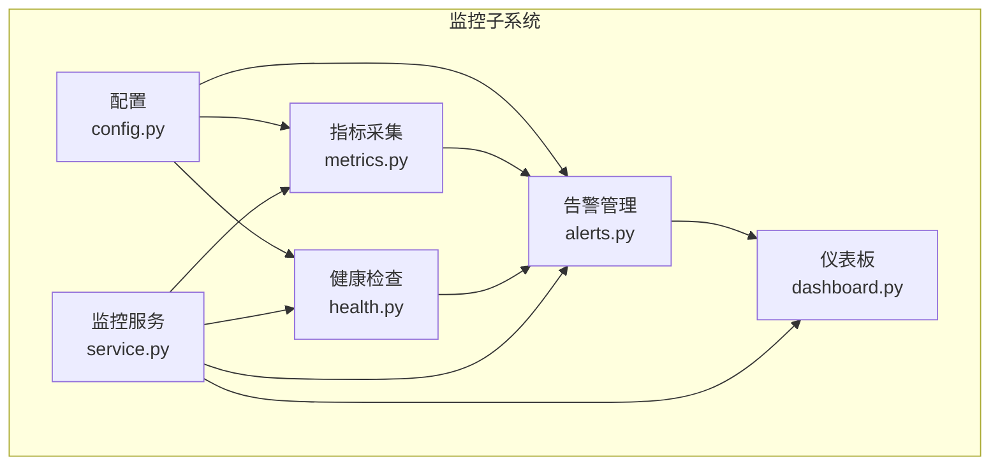
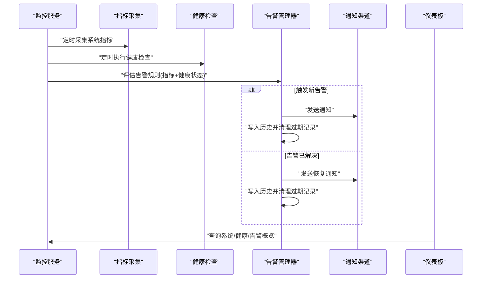
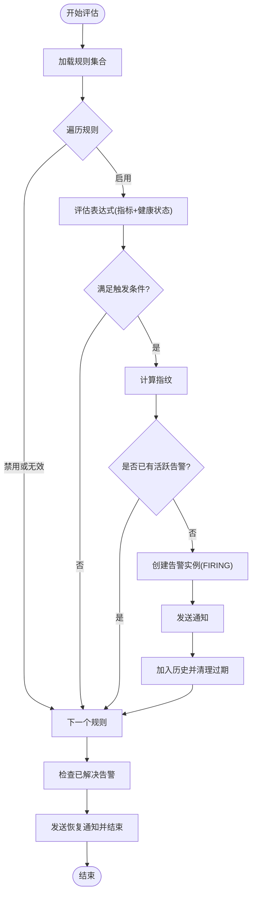
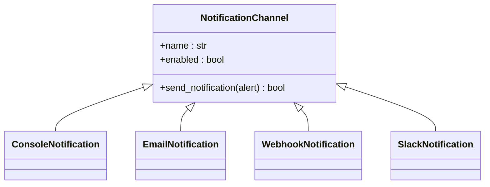
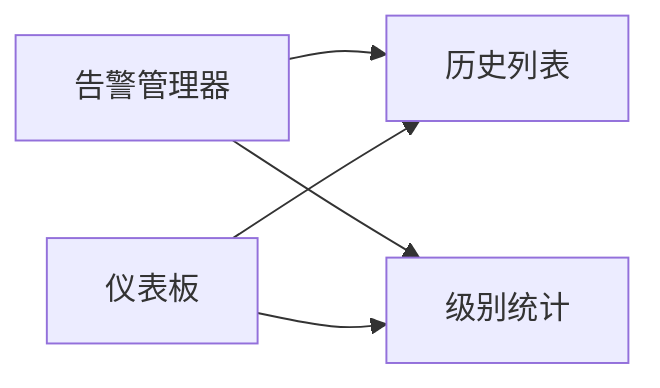
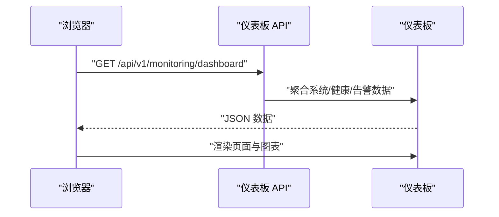
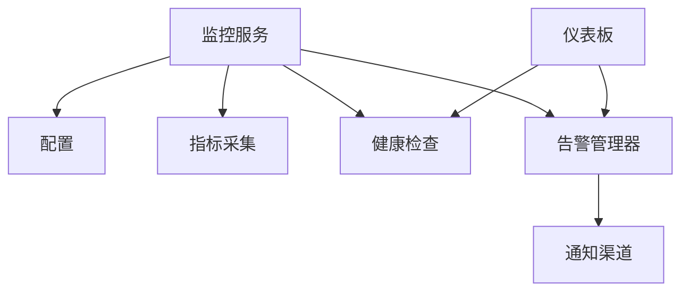

# 告警管理

<cite>
**本文引用的文件**
- [alerts.py](file://src/monitoring/alerts.py)
- [config.py](file://src/monitoring/config.py)
- [health.py](file://src/monitoring/health.py)
- [metrics.py](file://src/monitoring/metrics.py)
- [service.py](file://src/monitoring/service.py)
- [dashboard.py](file://src/monitoring/dashboard.py)
- [example_usage.py](file://src/monitoring/example_usage.py)
- [CHANGELOG.md](file://CHANGELOG.md)
- [VERSION_README.md](file://VERSION_README.md)
</cite>

## 目录
1. [引言](#引言)
2. [项目结构](#项目结构)
3. [核心组件](#核心组件)
4. [架构总览](#架构总览)
5. [详细组件分析](#详细组件分析)
6. [依赖分析](#依赖分析)
7. [性能考虑](#性能考虑)
8. [故障排查指南](#故障排查指南)
9. [结论](#结论)
10. [附录](#附录)

## 引言
本文件面向 v3.3.0-alpha 版本，系统性梳理告警管理模块的设计与实现，覆盖告警规则配置、阈值与条件、触发逻辑、多渠道通知、告警级别与抑制、历史与统计、去重与合并策略、升级与人工干预、动态配置与热更新、以及配套的 UI 与 REST API。文档同时给出代码级架构图与流程图，帮助读者快速理解与扩展。

## 项目结构
告警管理模块位于 src/monitoring 目录下，围绕“配置-采集-评估-通知-展示”的闭环构建，主要文件职责如下：
- config.py：定义监控与告警配置模型、告警级别枚举、全局配置加载与更新。
- health.py：健康检查系统，产出整体健康状态供告警评估使用。
- metrics.py：系统与应用指标采集器，提供 Prometheus 格式导出与样本缓冲。
- alerts.py：告警规则、告警实例、通知渠道与告警管理器，负责规则评估、去重、通知与历史管理。
- service.py：监控服务主入口，整合调度与生命周期管理，并提供 FastAPI 集成。
- dashboard.py：监控仪表板 API 与前端页面，提供系统状态、健康概览与告警概览。
- example_usage.py：示例脚本，演示独立运行、完整应用挂载与自定义扩展。

**图示来源**
- [config.py:27-117](file://src/monitoring/config.py#L27-L117)
- [metrics.py:25-207](file://src/monitoring/metrics.py#L25-L207)
- [health.py:34-300](file://src/monitoring/health.py#L34-L300)
- [alerts.py:237-435](file://src/monitoring/alerts.py#L237-L435)
- [service.py:21-214](file://src/monitoring/service.py#L21-L214)
- [dashboard.py:17-250](file://src/monitoring/dashboard.py#L17-L250)

**章节来源**
- [config.py:27-117](file://src/monitoring/config.py#L27-L117)
- [metrics.py:25-207](file://src/monitoring/metrics.py#L25-L207)
- [health.py:34-300](file://src/monitoring/health.py#L34-L300)
- [alerts.py:237-435](file://src/monitoring/alerts.py#L237-L435)
- [service.py:21-214](file://src/monitoring/service.py#L21-L214)
- [dashboard.py:17-250](file://src/monitoring/dashboard.py#L17-L250)

## 核心组件
- 配置与级别
  - 告警级别：info、warning、error、critical。
  - 监控配置：指标采集开关、健康检查间隔、告警评估间隔、保留天数、通知渠道列表、各类阈值（CPU、内存、磁盘、RAG 响应时间、API 错误率、缓存命中率）。
- 健康检查
  - 健康状态枚举：healthy、degraded、unhealthy、unknown。
  - 健康检查器：并发执行检查、聚合整体状态、生成健康报告与历史。
- 指标采集
  - 系统指标：CPU、内存、磁盘、网络、进程、运行时等。
  - 应用指标：RAG 响应时间、API 调用、缓存操作、模型推理等。
  - 导出格式：Prometheus 格式文本。
- 告警规则与实例
  - 规则：名称、表达式、级别、描述、持续时间、启用状态、标签与注解。
  - 实例：携带指纹、状态（触发中/已解决/已静默）、起止时间、标签与注解。
- 通知渠道
  - 控制台、邮件、Webhook、Slack。
- 告警管理器
  - 规则增删、表达式评估、活跃告警去重、通知发送、历史清理与查询。

**章节来源**
- [config.py:11-117](file://src/monitoring/config.py#L11-L117)
- [health.py:15-155](file://src/monitoring/health.py#L15-L155)
- [metrics.py:25-207](file://src/monitoring/metrics.py#L25-L207)
- [alerts.py:26-398](file://src/monitoring/alerts.py#L26-L398)

## 架构总览
告警管理采用“配置驱动 + 组件协作”的架构。监控服务周期性调度指标采集、健康检查与告警评估；告警管理器基于规则表达式与阈值进行评估，结合指纹去重，触发通知并维护历史；仪表板提供 REST API 与前端页面用于展示。

**图示来源**
- [service.py:99-154](file://src/monitoring/service.py#L99-L154)
- [metrics.py:32-95](file://src/monitoring/metrics.py#L32-L95)
- [health.py:107-154](file://src/monitoring/health.py#L107-L154)
- [alerts.py:291-398](file://src/monitoring/alerts.py#L291-L398)
- [dashboard.py:29-101](file://src/monitoring/dashboard.py#L29-L101)

## 详细组件分析

### 告警规则与评估
- 规则字段
  - 名称、表达式、级别、描述、持续时间、启用状态、标签、注解。
- 表达式评估
  - 支持健康状态与关键指标阈值判断（如 CPU、内存使用率），并预留扩展空间。
- 去重与指纹
  - 使用“规则名+表达式哈希”作为指纹，避免重复触发同一规则的相同条件。
- 触发与恢复
  - 触发时创建实例并发送通知；当规则不再满足时标记为已解决并发送恢复通知。
- 历史与清理
  - 保存触发与恢复事件，按配置的保留天数清理过期记录。

**图示来源**
- [alerts.py:291-398](file://src/monitoring/alerts.py#L291-L398)

**章节来源**
- [alerts.py:26-398](file://src/monitoring/alerts.py#L26-L398)

### 通知渠道与多通道
- 控制台通知：日志输出告警/恢复消息。
- 邮件通知：SMTP 发送，支持主题与正文模板。
- Webhook 通知：异步 HTTP POST，传递告警 JSON。
- Slack 通知：异步 HTTP POST，按级别映射颜色块。
- 渠道管理：统一注册、启用/禁用、并发发送、异常记录。

**图示来源**
- [alerts.py:55-235](file://src/monitoring/alerts.py#L55-L235)

**章节来源**
- [alerts.py:55-235](file://src/monitoring/alerts.py#L55-L235)

### 告警级别管理与抑制
- 级别：info、warning、error、critical，用于区分严重程度与优先级。
- 抑制：当前实现未内置“告警抑制/静默窗口”，可通过规则的 duration 字段与表达式设计实现“持续触发抑制”；也可通过外部手段对特定指纹进行静默标记（扩展点）。

**章节来源**
- [config.py:11-17](file://src/monitoring/config.py#L11-L17)
- [alerts.py:19-53](file://src/monitoring/alerts.py#L19-L53)

### 告警历史与统计
- 历史记录：保存触发与恢复事件，支持按小时筛选。
- 统计概览：活跃告警数量、按级别统计、关键级别计数。
- 仪表板：提供系统状态、CPU/内存使用率、活跃告警数与实时图表。

**图示来源**
- [alerts.py:387-398](file://src/monitoring/alerts.py#L387-L398)
- [dashboard.py:133-147](file://src/monitoring/dashboard.py#L133-L147)

**章节来源**
- [alerts.py:387-398](file://src/monitoring/alerts.py#L387-L398)
- [dashboard.py:58-101](file://src/monitoring/dashboard.py#L58-L101)

### 告警去重与合并策略
- 去重：以规则名+表达式哈希为指纹，避免同规则同条件重复触发。
- 合并：当前未实现“告警合并”策略，建议通过规则层面的聚合表达式或外部策略实现。

**章节来源**
- [alerts.py:303-324](file://src/monitoring/alerts.py#L303-L324)

### 告警升级与人工干预
- 升级：当前未实现“重复告警升级”机制；可在规则层面增加“持续时间阈值”或引入外部升级策略。
- 人工干预：可通过外部系统对特定指纹进行“静默/抑制”标记，或在 UI 中提供“解决”按钮（前端组件已具备相关交互逻辑）。

**章节来源**
- [alerts.py:326-338](file://src/monitoring/alerts.py#L326-L338)
- [dashboard.py:560-594](file://src/monitoring/dashboard.py#L560-L594)

### 动态配置与热更新
- 配置来源：环境变量驱动的配置模型，支持运行时读取。
- 热更新：提供配置更新方法，但需结合业务场景决定是否重启组件或重新初始化渠道。

**章节来源**
- [config.py:72-108](file://src/monitoring/config.py#L72-L108)

### UI 界面与 REST API
- 仪表板页面：HTML 页面，定期拉取系统/健康/告警概览数据。
- API 接口：
  - GET /api/v1/monitoring/metrics/system：系统指标
  - GET /api/v1/monitoring/metrics/application：应用指标
  - GET /api/v1/monitoring/health：健康报告
  - GET /api/v1/monitoring/alerts：告警列表（活跃/历史）
  - GET /api/v1/monitoring/dashboard：仪表板汇总数据

**图示来源**
- [dashboard.py:29-101](file://src/monitoring/dashboard.py#L29-L101)
- [dashboard.py:107-241](file://src/monitoring/dashboard.py#L107-L241)

**章节来源**
- [dashboard.py:29-101](file://src/monitoring/dashboard.py#L29-L101)
- [dashboard.py:107-241](file://src/monitoring/dashboard.py#L107-L241)

## 依赖分析
- 组件耦合
  - 告警管理器依赖配置、健康检查与指标采集。
  - 监控服务负责调度与生命周期，串联各组件。
  - 仪表板依赖告警管理器与健康检查器的数据。
- 外部依赖
  - 异步 HTTP 客户端用于 Webhook/Slack 通知。
  - SMTP 客户端用于邮件通知。
  - Prometheus 格式导出用于指标暴露。

**图示来源**
- [service.py:21-214](file://src/monitoring/service.py#L21-L214)
- [alerts.py:237-435](file://src/monitoring/alerts.py#L237-L435)
- [dashboard.py:17-250](file://src/monitoring/dashboard.py#L17-L250)

**章节来源**
- [service.py:21-214](file://src/monitoring/service.py#L21-L214)
- [alerts.py:237-435](file://src/monitoring/alerts.py#L237-L435)
- [dashboard.py:17-250](file://src/monitoring/dashboard.py#L17-L250)

## 性能考虑
- 并发执行：健康检查与指标采集均采用并发策略，降低整体评估延迟。
- 缓冲与导出：指标样本缓冲限制大小，Prometheus 导出仅输出最新样本，减少 IO 压力。
- 评估开销：规则评估为轻量表达式判断，建议将复杂逻辑外置为指标并通过阈值驱动。

[本节为通用指导，无需具体文件分析]

## 故障排查指南
- 通知失败
  - 检查通知渠道配置（SMTP、Webhook、Slack）与网络连通性。
  - 查看告警管理器日志中的异常记录。
- 告警未触发
  - 确认规则启用状态与表达式是否匹配当前指标。
  - 检查健康状态是否影响表达式判断。
- 历史缺失
  - 检查保留天数配置与清理逻辑。
- 仪表板数据为空
  - 确认监控服务已启动且定时任务正常运行。

**章节来源**
- [alerts.py:374-382](file://src/monitoring/alerts.py#L374-L382)
- [service.py:99-154](file://src/monitoring/service.py#L99-L154)
- [dashboard.py:29-101](file://src/monitoring/dashboard.py#L29-L101)

## 结论
v3.3.0-alpha 的告警管理模块提供了清晰的配置驱动、完善的多渠道通知与基础的去重/历史管理。建议后续增强包括：告警抑制/静默、升级策略、告警合并、动态规则热更新与 UI 交互完善。模块化的组件设计便于扩展与演进。

[本节为总结，无需具体文件分析]

## 附录

### 版本与变更摘要
- 当前版本：3.3.0-alpha
- 变更要点：本次版本聚焦于文档与 Wiki 的重构与同步，告警管理核心实现保持稳定。

**章节来源**
- [CHANGELOG.md:3-54](file://CHANGELOG.md#L3-L54)
- [VERSION_README.md:5-91](file://VERSION_README.md#L5-L91)

### 示例与集成
- 独立运行监控服务、挂载仪表板、自定义健康检查与告警规则、性能测试等示例均可参考示例脚本。

**章节来源**
- [example_usage.py:23-293](file://src/monitoring/example_usage.py#L23-L293)