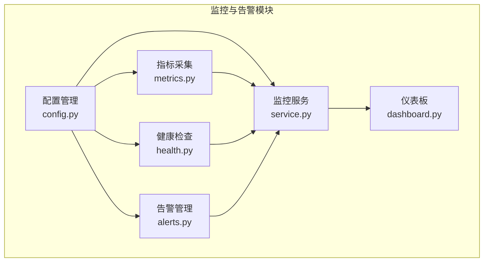
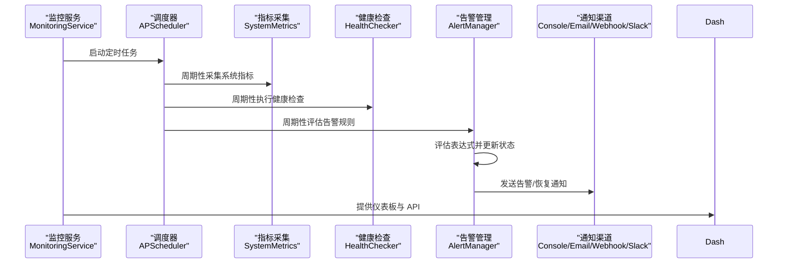
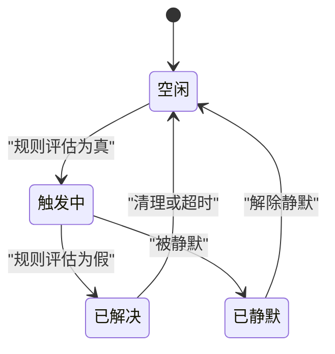
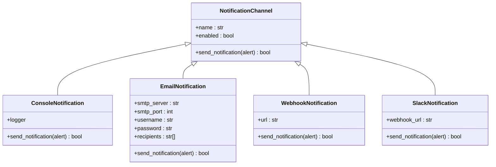
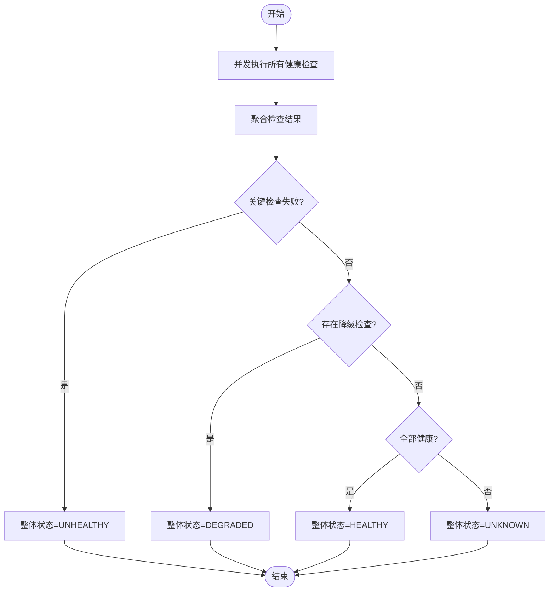
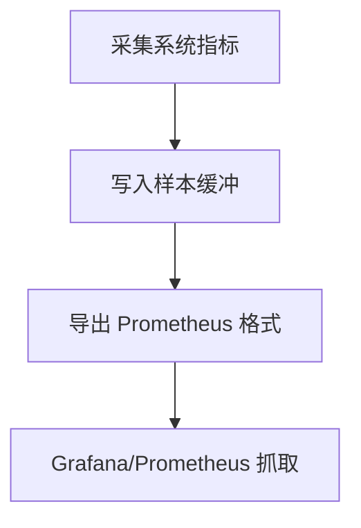
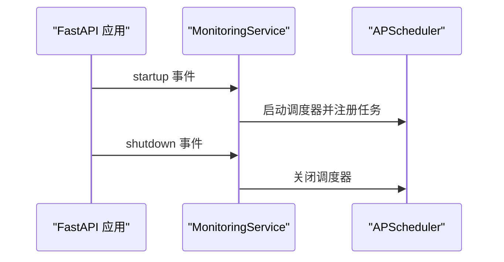
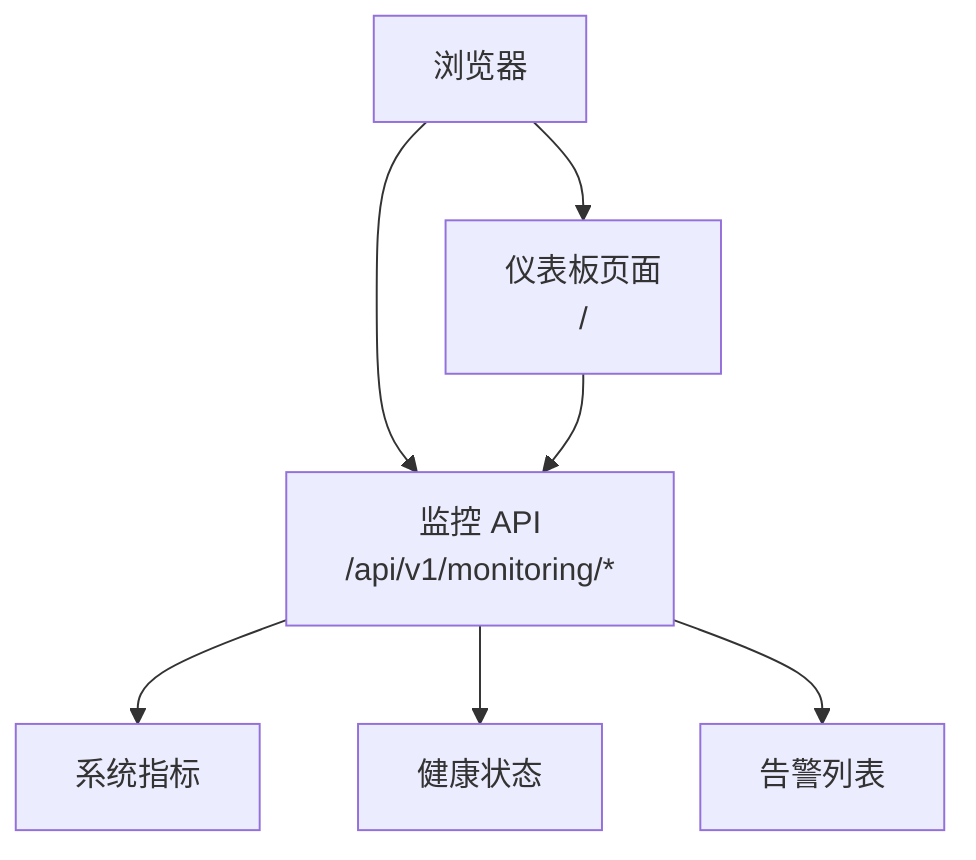
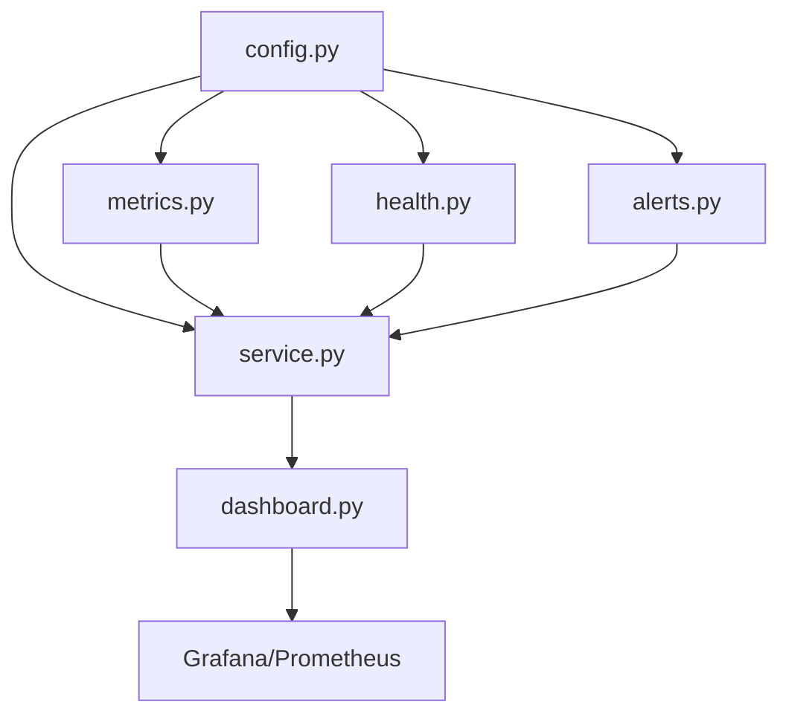

# 告警管理系统

<cite>
**本文引用的文件**
- [alerts.py](file://src/monitoring/alerts.py)
- [config.py](file://src/monitoring/config.py)
- [service.py](file://src/monitoring/service.py)
- [metrics.py](file://src/monitoring/metrics.py)
- [dashboard.py](file://src/monitoring/dashboard.py)
- [health.py](file://src/monitoring/health.py)
- [example_usage.py](file://src/monitoring/example_usage.py)
- [docker-compose.yml](file://devops/docker-compose.yml)
- [README.md](file://README.md)
- [architecture_framework.md](file://design/architecture_framework.md)
</cite>

## 目录
1. [简介](#简介)
2. [项目结构](#项目结构)
3. [核心组件](#核心组件)
4. [架构总览](#架构总览)
5. [详细组件分析](#详细组件分析)
6. [依赖关系分析](#依赖关系分析)
7. [性能考量](#性能考量)
8. [故障排查指南](#故障排查指南)
9. [结论](#结论)
10. [附录](#附录)

## 简介
本文件为 NecoRAG 项目中的“监控与告警系统”提供全面技术文档，聚焦以下目标：
- 告警规则的定义与评估机制
- 多渠道通知的实现方式
- 告警状态管理流程
- 告警级别、触发条件与抑制策略
- 通知发送机制、消息模板与接收者配置
- 告警历史存储、统计分析与效果评估
- 告警规则编写指南、通知渠道集成方案与运维管理

该系统以模块化设计为核心，结合定时调度、健康检查、指标采集与可视化仪表板，形成完整的可观测性闭环。

## 项目结构
监控与告警系统位于 src/monitoring 目录，主要文件与职责如下：
- config.py：监控配置模型与阈值管理
- metrics.py：系统与应用指标采集与导出
- health.py：健康检查与整体健康状态聚合
- alerts.py：告警规则、状态机与通知渠道
- service.py：监控服务主入口与调度器
- dashboard.py：监控仪表板与 API 路由
- example_usage.py：使用示例与演示脚本
- docker-compose.yml：容器化编排，包含 Grafana 监控可视化

**图表来源**
- [config.py:27-117](file://src/monitoring/config.py#L27-L117)
- [metrics.py:25-207](file://src/monitoring/metrics.py#L25-L207)
- [health.py:34-300](file://src/monitoring/health.py#L34-L300)
- [alerts.py:237-435](file://src/monitoring/alerts.py#L237-L435)
- [service.py:21-214](file://src/monitoring/service.py#L21-L214)
- [dashboard.py:17-250](file://src/monitoring/dashboard.py#L17-L250)

**章节来源**
- [config.py:27-117](file://src/monitoring/config.py#L27-L117)
- [metrics.py:25-207](file://src/monitoring/metrics.py#L25-L207)
- [health.py:34-300](file://src/monitoring/health.py#L34-L300)
- [alerts.py:237-435](file://src/monitoring/alerts.py#L237-L435)
- [service.py:21-214](file://src/monitoring/service.py#L21-L214)
- [dashboard.py:17-250](file://src/monitoring/dashboard.py#L17-L250)
- [example_usage.py:1-293](file://src/monitoring/example_usage.py#L1-L293)
- [docker-compose.yml:1-164](file://devops/docker-compose.yml#L1-L164)

## 核心组件
- 配置管理（MonitoringConfig）：集中管理指标采集、健康检查、告警评估周期、通知渠道、阈值与保留策略等。
- 指标采集（SystemMetrics/AppMetrics）：系统级指标（CPU/内存/磁盘/网络/进程）与应用级指标（RAG 响应时间、API 请求、缓存命中等）。
- 健康检查（HealthChecker）：注册多个健康检查函数，支持并发执行与历史记录，输出整体健康状态。
- 告警管理（AlertManager）：规则注册与评估、活跃告警与历史记录维护、通知渠道派发。
- 监控服务（MonitoringService）：基于 APScheduler 的定时任务调度，统一启动/停止服务。
- 仪表板（MonitoringDashboard）：提供系统概览、健康状态、活跃告警统计与仪表板页面。

**章节来源**
- [config.py:27-117](file://src/monitoring/config.py#L27-L117)
- [metrics.py:25-207](file://src/monitoring/metrics.py#L25-L207)
- [health.py:34-300](file://src/monitoring/health.py#L34-L300)
- [alerts.py:237-435](file://src/monitoring/alerts.py#L237-L435)
- [service.py:21-214](file://src/monitoring/service.py#L21-L214)
- [dashboard.py:17-250](file://src/monitoring/dashboard.py#L17-L250)

## 架构总览
监控与告警系统通过“服务调度 → 指标采集 → 健康检查 → 告警评估 → 通知派发 → 可视化”的流水线实现闭环。

**图表来源**
- [service.py:38-154](file://src/monitoring/service.py#L38-L154)
- [metrics.py:32-95](file://src/monitoring/metrics.py#L32-L95)
- [health.py:107-154](file://src/monitoring/health.py#L107-L154)
- [alerts.py:291-344](file://src/monitoring/alerts.py#L291-L344)
- [dashboard.py:26-104](file://src/monitoring/dashboard.py#L26-L104)

## 详细组件分析

### 告警规则与状态管理
- 规则定义：包含名称、表达式、级别、描述、持续时间、启用状态、标签与注解。
- 状态机：FIRING（触发中）、RESOLVED（已解决）、SILENCED（已静默）。
- 评估流程：对每个规则进行表达式评估，若满足且无活跃告警则创建；若不满足且存在活跃告警则标记解决并发送恢复通知。
- 历史与保留：告警历史按保留天数清理，避免无限增长。

**图表来源**
- [alerts.py:19-53](file://src/monitoring/alerts.py#L19-L53)
- [alerts.py:291-344](file://src/monitoring/alerts.py#L291-L344)

**章节来源**
- [alerts.py:26-53](file://src/monitoring/alerts.py#L26-L53)
- [alerts.py:19-24](file://src/monitoring/alerts.py#L19-L24)
- [alerts.py:291-344](file://src/monitoring/alerts.py#L291-L344)

### 通知渠道与发送机制
- 控制台通知：用于本地调试与默认通道，输出告警/恢复信息。
- 邮件通知：基于 SMTP，支持 TLS、用户名密码认证与收件人列表。
- Webhook 通知：异步 HTTP POST，JSON 负载包含告警关键字段。
- Slack 通知：通过 Webhook URL 发送富文本消息，按级别映射颜色。

**图表来源**
- [alerts.py:55-134](file://src/monitoring/alerts.py#L55-L134)
- [alerts.py:134-235](file://src/monitoring/alerts.py#L134-L235)

**章节来源**
- [alerts.py:55-134](file://src/monitoring/alerts.py#L55-L134)
- [alerts.py:134-235](file://src/monitoring/alerts.py#L134-L235)

### 健康检查与整体状态
- 健康检查注册：支持任意异步检查函数，可标注关键性。
- 并发执行：批量检查并发运行，记录耗时与结果。
- 整体状态：关键检查失败 → UNHEALTHY；存在 DEGRADED → DEGRADED；全部 HEALTHY → HEALTHY；否则 UNKNOWN。
- 历史与报告：提供最近结果与汇总统计。

**图表来源**
- [health.py:107-154](file://src/monitoring/health.py#L107-L154)
- [health.py:132-154](file://src/monitoring/health.py#L132-L154)

**章节来源**
- [health.py:34-300](file://src/monitoring/health.py#L34-L300)

### 指标采集与导出
- 系统指标：CPU/内存/磁盘/网络/进程/运行时长等。
- 应用指标：RAG 响应时间、API 调用次数/时延、缓存操作等。
- Prometheus 导出：将最近样本导出为 Prometheus 格式，便于 Grafana 抓取。

**图表来源**
- [metrics.py:32-95](file://src/monitoring/metrics.py#L32-L95)
- [metrics.py:126-174](file://src/monitoring/metrics.py#L126-L174)

**章节来源**
- [metrics.py:25-207](file://src/monitoring/metrics.py#L25-L207)

### 监控服务与调度
- 启动/停止：统一生命周期管理，记录状态。
- 定时任务：指标采集、健康检查、告警评估按配置周期执行。
- 服务状态：对外暴露运行状态与组件开关。

**图表来源**
- [service.py:178-201](file://src/monitoring/service.py#L178-L201)
- [service.py:38-98](file://src/monitoring/service.py#L38-L98)

**章节来源**
- [service.py:21-214](file://src/monitoring/service.py#L21-L214)

### 仪表板与 API
- 仪表板页面：实时展示系统状态、CPU/内存使用率与活跃告警数量。
- API 路由：系统指标、应用指标、健康报告、告警列表与汇总数据。
- 并发获取：仪表板汇总数据通过并发任务并行拉取。

**图表来源**
- [dashboard.py:107-111](file://src/monitoring/dashboard.py#L107-L111)
- [dashboard.py:26-104](file://src/monitoring/dashboard.py#L26-L104)

**章节来源**
- [dashboard.py:17-250](file://src/monitoring/dashboard.py#L17-L250)

## 依赖关系分析
- 模块内聚：各模块职责清晰，配置作为依赖注入贯穿指标、健康、告警与服务。
- 外部依赖：psutil（系统指标）、aiohttp（异步 HTTP）、APScheduler（定时任务）、FastAPI（Web 服务）。
- 可视化集成：Grafana 通过 Prometheus 抓取指标，实现多维监控与告警。

**图表来源**
- [config.py:27-117](file://src/monitoring/config.py#L27-L117)
- [metrics.py:25-207](file://src/monitoring/metrics.py#L25-L207)
- [health.py:34-300](file://src/monitoring/health.py#L34-L300)
- [alerts.py:237-435](file://src/monitoring/alerts.py#L237-L435)
- [service.py:21-214](file://src/monitoring/service.py#L21-L214)
- [dashboard.py:17-250](file://src/monitoring/dashboard.py#L17-L250)
- [docker-compose.yml:100-117](file://devops/docker-compose.yml#L100-L117)

**章节来源**
- [docker-compose.yml:100-117](file://devops/docker-compose.yml#L100-L117)

## 性能考量
- 指标采集：系统指标采集轻量，建议合理设置采集间隔，避免频繁 IO。
- 健康检查：并发执行检查，注意外部服务超时与重试策略。
- 告警评估：表达式简化实现，建议在生产中扩展为可解析的表达式引擎。
- 通知发送：异步发送，注意网络抖动与重试。
- 可视化：Prometheus 抓取与 Grafana 渲染需考虑数据量与查询复杂度。

[本节为通用指导，无需具体文件分析]

## 故障排查指南
- 启动失败：检查监控服务日志，确认调度器启动与任务注册。
- 指标缺失：确认采集间隔与 psutil 可用性；检查 Prometheus 抓取端口。
- 健康检查异常：查看检查函数返回格式与异常日志；确认外部服务可达。
- 告警不触发：核对规则表达式与阈值配置；检查活跃告警指纹与历史清理策略。
- 通知失败：检查通知渠道配置（SMTP、Webhook、Slack）与网络连通性。

**章节来源**
- [service.py:78-98](file://src/monitoring/service.py#L78-L98)
- [metrics.py:101-120](file://src/monitoring/metrics.py#L101-L120)
- [health.py:95-105](file://src/monitoring/health.py#L95-L105)
- [alerts.py:374-382](file://src/monitoring/alerts.py#L374-L382)

## 结论
NecoRAG 的监控与告警系统通过模块化设计与定时调度，实现了从指标采集、健康检查到告警评估与通知派发的完整闭环，并提供可视化仪表板与 Prometheus 集成。建议在生产环境中完善表达式评估、通知重试与告警抑制策略，持续优化阈值与通知模板，以提升告警的准确性与可维护性。

[本节为总结，无需具体文件分析]

## 附录

### 告警级别与触发条件
- 级别：INFO、WARNING、ERROR、CRITICAL
- 触发条件（默认规则）：CPU/内存使用率阈值、健康状态异常
- 持续时间：默认 5 分钟，避免瞬时波动误报

**章节来源**
- [alerts.py:11-17](file://src/monitoring/alerts.py#L11-L17)
- [alerts.py:402-427](file://src/monitoring/alerts.py#L402-L427)
- [config.py:52-63](file://src/monitoring/config.py#L52-L63)

### 告警规则编写指南
- 规则命名：清晰描述触发场景
- 表达式：建议使用可解析表达式引擎，支持变量与函数
- 标签与注解：用于分类与模板渲染
- 持续时间：根据业务容忍度设置，避免抖动
- 级别：依据影响面与 SLA 设置

**章节来源**
- [alerts.py:26-37](file://src/monitoring/alerts.py#L26-L37)

### 通知渠道集成方案
- 控制台：本地开发与默认通道
- 邮件：SMTP 配置与收件人列表
- Webhook：HTTP POST，JSON 负载标准化
- Slack：Webhook URL，富文本与颜色映射

**章节来源**
- [alerts.py:55-134](file://src/monitoring/alerts.py#L55-L134)
- [alerts.py:134-235](file://src/monitoring/alerts.py#L134-L235)

### 告警历史与统计
- 历史保留：按配置天数清理
- 统计维度：按级别统计、活跃告警数量、最近 24 小时告警趋势
- 仪表板：实时概览与图表

**章节来源**
- [alerts.py:387-398](file://src/monitoring/alerts.py#L387-L398)
- [dashboard.py:133-147](file://src/monitoring/dashboard.py#L133-L147)

### 运维管理
- 环境变量：通过环境变量覆盖配置项
- 容器化：Grafana 与 Prometheus 集成，统一监控
- 生命周期：FastAPI 启停事件与服务状态查询

**章节来源**
- [config.py:72-108](file://src/monitoring/config.py#L72-L108)
- [docker-compose.yml:100-117](file://devops/docker-compose.yml#L100-L117)
- [service.py:178-201](file://src/monitoring/service.py#L178-L201)