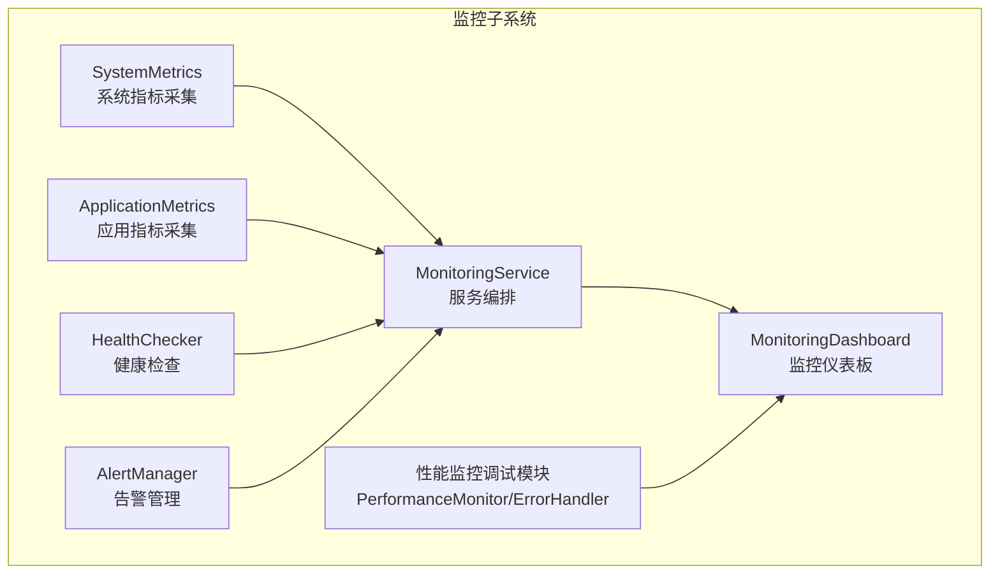
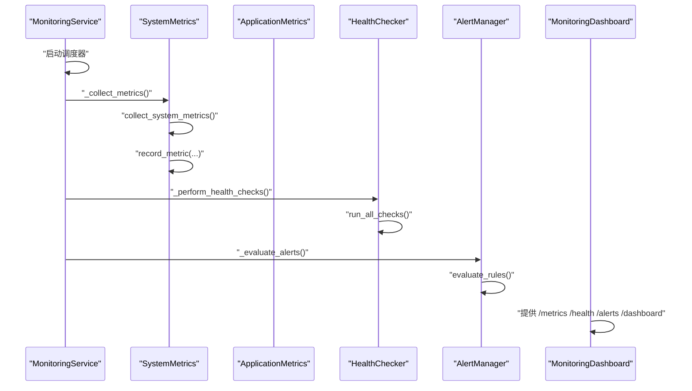
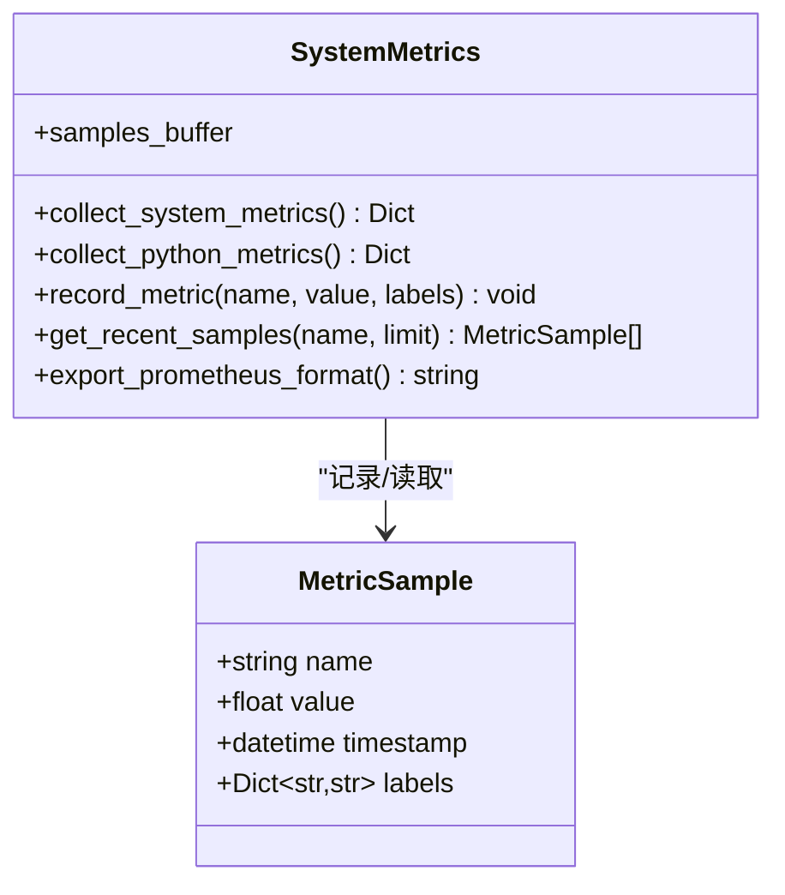
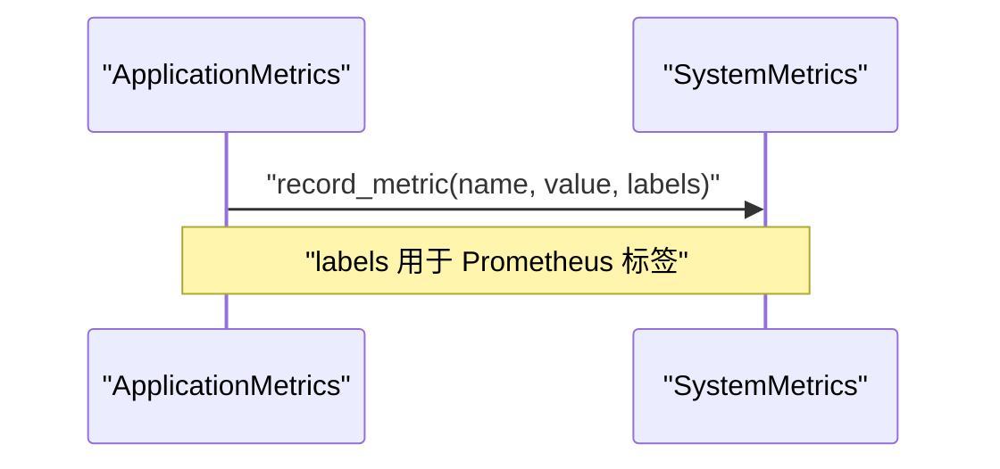
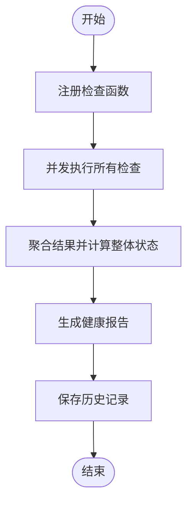
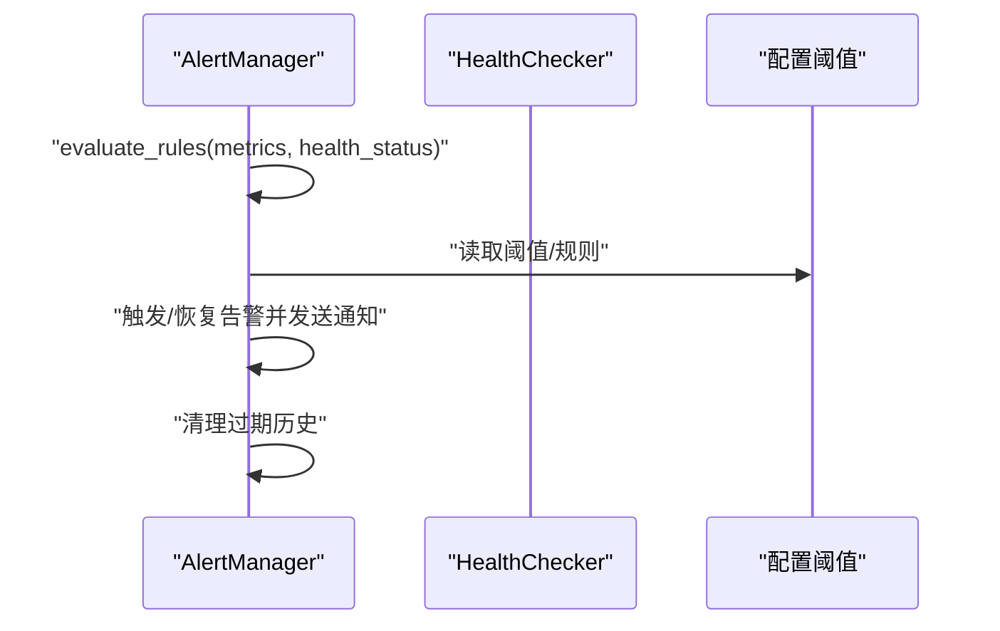
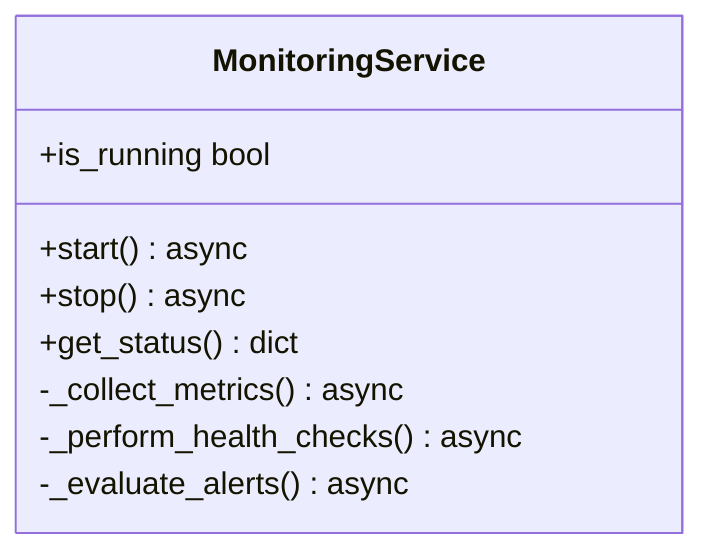
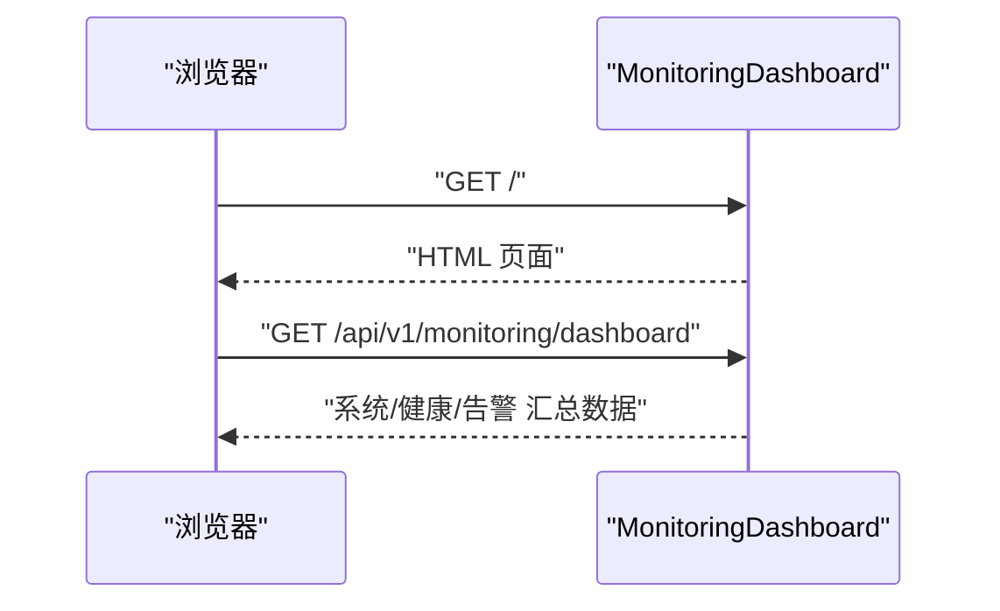
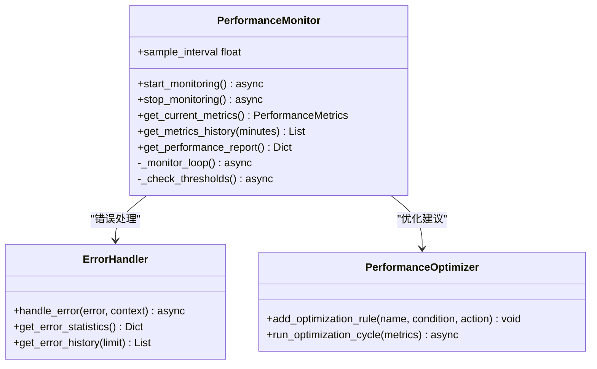
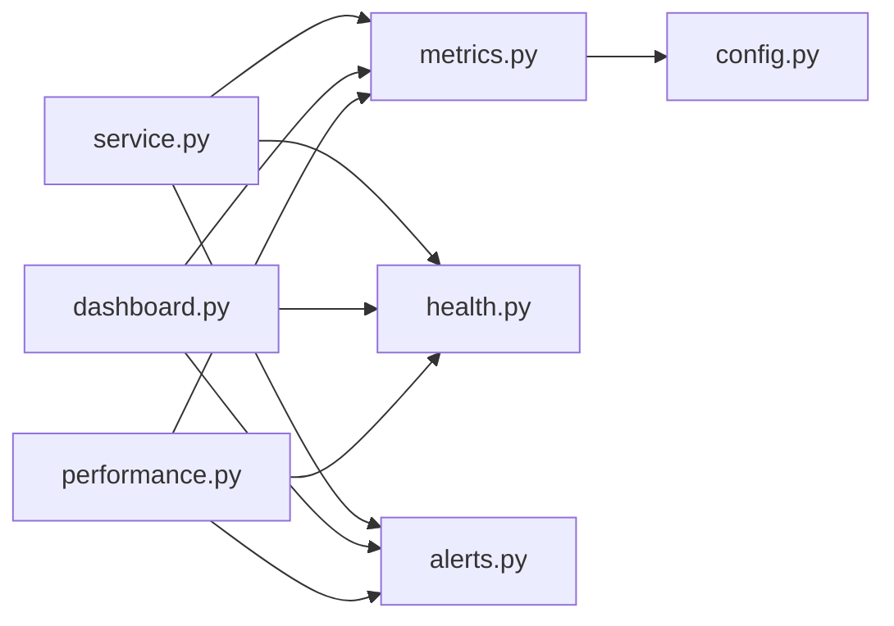

# 性能监控

<cite>
**本文引用的文件**
- [metrics.py](file://src/monitoring/metrics.py)
- [service.py](file://src/monitoring/service.py)
- [dashboard.py](file://src/monitoring/dashboard.py)
- [config.py](file://src/monitoring/config.py)
- [health.py](file://src/monitoring/health.py)
- [alerts.py](file://src/monitoring/alerts.py)
- [example_usage.py](file://src/monitoring/example_usage.py)
- [performance.py](file://src/dashboard/debug/performance.py)
- [PerformanceDashboard.html](file://src/dashboard/components/PerformanceDashboard.html)
- [performance_test.py](file://tests/performance_test.py)
- [auto_version_control.md](file://auto_version_control.md)
</cite>

## 目录
1. [引言](#引言)
2. [项目结构](#项目结构)
3. [核心组件](#核心组件)
4. [架构总览](#架构总览)
5. [详细组件分析](#详细组件分析)
6. [依赖分析](#依赖分析)
7. [性能考量](#性能考量)
8. [故障排查指南](#故障排查指南)
9. [结论](#结论)
10. [附录](#附录)

## 引言
本文件面向性能监控模块，系统化阐述系统级与应用级指标采集、样本缓冲与导出、业务指标记录、告警与健康检查、以及性能瓶颈识别与优化建议。特别结合 v3.3.0-alpha 版本的性能监控增强背景，给出可操作的实践路径与可视化集成方案。

## 项目结构
监控子系统由“指标采集与导出”“健康检查”“告警管理”“监控服务编排”“仪表板与调试工具”构成，采用模块化设计，便于独立运行与集成。

**图表来源**
- [metrics.py:25-207](file://src/monitoring/metrics.py#L25-L207)
- [service.py:21-174](file://src/monitoring/service.py#L21-L174)
- [dashboard.py:17-245](file://src/monitoring/dashboard.py#L17-L245)
- [health.py:34-294](file://src/monitoring/health.py#L34-L294)
- [alerts.py:237-435](file://src/monitoring/alerts.py#L237-L435)
- [performance.py:103-372](file://src/dashboard/debug/performance.py#L103-L372)

**章节来源**
- [metrics.py:1-207](file://src/monitoring/metrics.py#L1-L207)
- [service.py:1-214](file://src/monitoring/service.py#L1-L214)
- [dashboard.py:1-250](file://src/monitoring/dashboard.py#L1-L250)
- [health.py:1-300](file://src/monitoring/health.py#L1-L300)
- [alerts.py:1-435](file://src/monitoring/alerts.py#L1-L435)
- [performance.py:1-658](file://src/dashboard/debug/performance.py#L1-L658)

## 核心组件
- 系统指标采集 SystemMetrics：采集 CPU、内存、磁盘 IO、网络、进程与 Python 运行时指标，并提供 MetricSample 与 samples_buffer 的记录与导出。
- 应用指标采集 ApplicationMetrics：封装 RAG 响应时间、API 调用、缓存操作等业务指标记录。
- 健康检查 HealthChecker：注册与并发执行健康检查，聚合整体健康状态。
- 告警管理 AlertManager：基于规则表达式评估触发与恢复，多通道通知。
- 监控服务 MonitoringService：基于 APScheduler 的定时任务编排，统一启动/停止。
- 监控仪表板 MonitoringDashboard：FastAPI 路由提供系统/健康/告警/仪表板汇总数据。
- 性能监控调试模块：PerformanceMonitor 提供更细粒度的系统资源与响应时间采样，配合 ErrorHandler 与 PerformanceOptimizer 实现性能闭环。

**章节来源**
- [metrics.py:16-207](file://src/monitoring/metrics.py#L16-L207)
- [health.py:34-294](file://src/monitoring/health.py#L34-L294)
- [alerts.py:237-435](file://src/monitoring/alerts.py#L237-L435)
- [service.py:21-174](file://src/monitoring/service.py#L21-L174)
- [dashboard.py:17-245](file://src/monitoring/dashboard.py#L17-L245)
- [performance.py:103-372](file://src/dashboard/debug/performance.py#L103-L372)

## 架构总览
监控系统通过 MonitoringService 统一调度，SystemMetrics 与 ApplicationMetrics 负责指标采集，HealthChecker 与 AlertManager 负责健康与告警，MonitoringDashboard 提供 API 与前端页面，PerformanceMonitor 作为补充调试能力。

**图表来源**
- [service.py:38-154](file://src/monitoring/service.py#L38-L154)
- [metrics.py:99-124](file://src/monitoring/metrics.py#L99-L124)
- [health.py:107-130](file://src/monitoring/health.py#L107-L130)
- [alerts.py:291-344](file://src/monitoring/alerts.py#L291-L344)
- [dashboard.py:26-104](file://src/monitoring/dashboard.py#L26-L104)

## 详细组件分析

### 系统指标采集 SystemMetrics
- 指标覆盖
  - CPU：使用率、核心数、频率、负载均值
  - 内存/交换：总量、可用、使用率、已用/剩余
  - 磁盘：总量、使用、剩余、使用率、读写字节
  - 网络：字节收发、包数收发
  - 进程：进程数、系统运行时长
  - Python 运行时：GC 统计、RSS/VMS、版本信息
- 数据结构
  - MetricSample：name/value/timestamp/labels
  - samples_buffer：最大长度 1000 的双端队列，用于最近样本缓存
- 导出 Prometheus 格式
  - 按指标名分组，输出 HELP/TYPE/gauge 与最新样本值，支持标签拼接

**图表来源**
- [metrics.py:16-174](file://src/monitoring/metrics.py#L16-L174)

**章节来源**
- [metrics.py:25-174](file://src/monitoring/metrics.py#L25-L174)

### 应用指标采集 ApplicationMetrics
- RAG 响应时间与成功率
- API 调用耗时与计数（带 endpoint/status_code 标签）
- 缓存操作（带 operation/result 标签）
- 模型推理耗时（带 model 标签）

**图表来源**
- [metrics.py:177-203](file://src/monitoring/metrics.py#L177-L203)

**章节来源**
- [metrics.py:177-203](file://src/monitoring/metrics.py#L177-L203)

### 健康检查 HealthChecker
- 注册检查函数，支持并发执行
- 结果聚合与整体健康状态判定（健康/降级/不健康/未知）
- 健康报告与历史记录（最近 1000 条）

**图表来源**
- [health.py:107-184](file://src/monitoring/health.py#L107-L184)

**章节来源**
- [health.py:34-184](file://src/monitoring/health.py#L34-L184)

### 告警管理 AlertManager
- 规则表达式评估（支持健康状态与阈值）
- 活跃告警管理与恢复流程
- 多通道通知：控制台、邮件、Webhook、Slack
- 告警历史与保留策略

**图表来源**
- [alerts.py:291-398](file://src/monitoring/alerts.py#L291-L398)
- [config.py:52-63](file://src/monitoring/config.py#L52-L63)

**章节来源**
- [alerts.py:237-398](file://src/monitoring/alerts.py#L237-L398)
- [config.py:27-63](file://src/monitoring/config.py#L27-L63)

### 监控服务 MonitoringService
- 基于 APScheduler 的定时任务：指标收集、健康检查、告警评估
- 生命周期管理：启动/停止，状态查询
- 与监控仪表板集成：FastAPI 应用挂载

**图表来源**
- [service.py:21-170](file://src/monitoring/service.py#L21-L170)

**章节来源**
- [service.py:21-174](file://src/monitoring/service.py#L21-L174)

### 监控仪表板 MonitoringDashboard
- 提供系统指标、应用指标、健康状态、告警列表、仪表板汇总数据
- 前端页面展示系统状态、CPU/内存使用率、活跃告警等
- 仪表板页面通过定时刷新与图表容器展示

**图表来源**
- [dashboard.py:82-147](file://src/monitoring/dashboard.py#L82-L147)

**章节来源**
- [dashboard.py:17-245](file://src/monitoring/dashboard.py#L17-L245)

### 性能监控调试模块 PerformanceMonitor
- 采样间隔可配置，默认 1 秒
- 收集更丰富的系统指标（负载、线程/进程/FD、交换分区等）
- 响应时间记录与阈值告警回调
- 错误处理与通知、性能报告生成、优化规则执行

**图表来源**
- [performance.py:103-372](file://src/dashboard/debug/performance.py#L103-L372)

**章节来源**
- [performance.py:1-658](file://src/dashboard/debug/performance.py#L1-L658)

## 依赖分析
- 模块内聚与耦合
  - SystemMetrics/ApplicationMetrics 与 MonitoringService 通过全局实例交互，降低直接耦合
  - HealthChecker/AlertManager 通过 MonitoringService 的调度进行评估
  - MonitoringDashboard 依赖 SystemMetrics/AppMetrics/HealthChecker/AlertManager 提供数据
- 外部依赖
  - psutil：系统与进程信息采集
  - APScheduler：异步调度器
  - FastAPI：监控 API 与仪表板
  - aiohttp：Webhook/Slack 通知
- 循环依赖
  - 未发现循环导入；各模块职责清晰

**图表来源**
- [metrics.py:1-14](file://src/monitoring/metrics.py#L1-L14)
- [service.py:14-18](file://src/monitoring/service.py#L14-L18)
- [dashboard.py:11-14](file://src/monitoring/dashboard.py#L11-L14)
- [performance.py:1-17](file://src/dashboard/debug/performance.py#L1-L17)

**章节来源**
- [metrics.py:1-14](file://src/monitoring/metrics.py#L1-L14)
- [service.py:14-18](file://src/monitoring/service.py#L14-L18)
- [dashboard.py:11-14](file://src/monitoring/dashboard.py#L11-L14)
- [performance.py:1-17](file://src/dashboard/debug/performance.py#L1-L17)

## 性能考量
- 指标采集开销
  - SystemMetrics 的 collect_system_metrics 与 collect_python_metrics 基于 psutil，建议合理设置 collection_interval，避免频繁采样造成额外 CPU/IO 压力
- 缓冲区大小
  - samples_buffer 最大 1000，适合短期趋势观察；若需长期趋势，建议结合外部时序数据库
- 健康检查并发
  - HealthChecker 并发执行检查，注意检查函数自身是否阻塞；必要时增加超时与限流
- 告警评估
  - 表达式简化实现，建议在生产环境扩展为更健壮的表达式引擎，减少误报与漏报
- 仪表板与前端
  - 前端定时轮询与 WebSocket 双通道刷新，注意带宽与并发连接数限制
- 调试监控
  - PerformanceMonitor 的采样间隔与历史缓冲需根据吞吐量调整，避免内存膨胀

[本节为通用指导，无需具体文件分析]

## 故障排查指南
- 启动失败
  - 检查 MonitoringService 的日志，确认调度器启动与任务注册
  - 确认配置项（端口、路径、间隔）是否正确
- 指标缺失
  - 确认 SystemMetrics 是否被定时任务调用；检查 record_metric 是否被正确调用
  - Prometheus 导出需确保 samples_buffer 中存在样本
- 健康检查异常
  - 查看 HealthChecker 的历史记录与异常堆栈；确认检查函数返回格式
- 告警未触发/误触发
  - 核对 AlertManager 的规则表达式与阈值配置；检查健康状态传递
- 仪表板数据为空
  - 确认 MonitoringDashboard 的路由注册与并发获取任务是否成功
- 调试监控无数据
  - 检查 PerformanceMonitor 的启动与采样循环；确认回调注册与阈值配置

**章节来源**
- [service.py:78-98](file://src/monitoring/service.py#L78-L98)
- [health.py:95-105](file://src/monitoring/health.py#L95-L105)
- [alerts.py:374-381](file://src/monitoring/alerts.py#L374-L381)
- [dashboard.py:82-104](file://src/monitoring/dashboard.py#L82-L104)
- [performance.py:130-154](file://src/dashboard/debug/performance.py#L130-L154)

## 结论
该性能监控模块以 SystemMetrics 为核心，结合 ApplicationMetrics、HealthChecker、AlertManager 与 MonitoringService，形成完整的监控闭环，并通过 MonitoringDashboard 提供可视化入口。v3.3.0-alpha 版本在指标丰富度、告警表达式与通知渠道方面具备增强能力，配合 PerformanceMonitor 的调试能力，可满足从系统到应用的全栈性能观测需求。

[本节为总结，无需具体文件分析]

## 附录

### 指标命名规范与标签系统
- 指标命名
  - 使用小写字母与下划线，语义明确，如 rag_response_time_seconds、api_request_duration_seconds、cache_operations
- 标签（Labels）
  - endpoint、status_code、operation、result、model 等，用于区分维度
- Prometheus 导出
  - HELP/TYPE/gauge 与最新样本值，标签以 {key="value"} 形式拼接

**章节来源**
- [metrics.py:144-174](file://src/monitoring/metrics.py#L144-L174)
- [metrics.py:188-202](file://src/monitoring/metrics.py#L188-L202)

### 业务指标采集要点
- RAG 响应时间：记录时长与成功标志，便于计算 P95/P99 与成功率
- API 调用：按端点与状态码聚合，便于定位慢接口与错误热点
- 缓存操作：区分命中/未命中，辅助容量规划与优化
- 模型推理：按模型维度聚合，支撑成本与性能分析

**章节来源**
- [metrics.py:183-202](file://src/monitoring/metrics.py#L183-L202)

### v3.3.0-alpha 性能监控增强
- 版本管理与变更追踪：通过自动版本控制工具记录变更类型与影响范围，便于回溯与审计
- 监控配置可环境变量注入：支持运行时动态调整指标采集间隔、阈值与通知渠道
- 健康检查与告警规则扩展：支持自定义检查与规则表达式，提升可观测性与告警准确性

**章节来源**
- [auto_version_control.md:45-54](file://auto_version_control.md#L45-L54)
- [config.py:74-100](file://src/monitoring/config.py#L74-L100)
- [health.py:296-299](file://src/monitoring/health.py#L296-L299)
- [alerts.py:401-427](file://src/monitoring/alerts.py#L401-L427)

### 性能测试与基准
- 单操作基准测试：预热、多次迭代、统计最小/最大/平均/中位/标准差/百分位/吞吐量
- 并发性能测试：多线程并发、持续时间、失败率阈值
- 压力测试：最大时长与失败率阈值，统计成功/失败次数与每秒操作数
- 内存使用测试：采样初始/峰值/平均内存，评估增长趋势

**章节来源**
- [performance_test.py:31-291](file://tests/performance_test.py#L31-L291)

### 仪表板与前端集成
- 仪表板页面：系统状态、CPU/内存使用率、活跃告警卡片
- 前端刷新：定时轮询与 WebSocket 推送，支持实时更新
- 性能调试面板：响应时间、错误率阈值与告警联动

**章节来源**
- [dashboard.py:149-241](file://src/monitoring/dashboard.py#L149-L241)
- [PerformanceDashboard.html:342-669](file://src/dashboard/components/PerformanceDashboard.html#L342-L669)